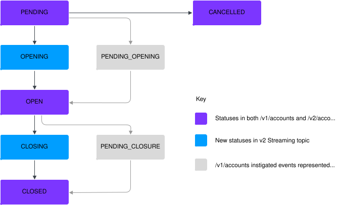
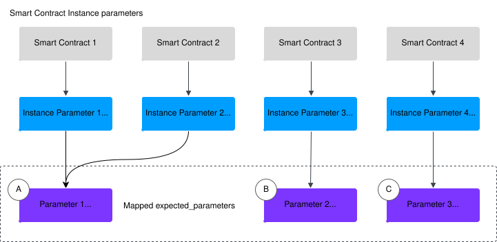
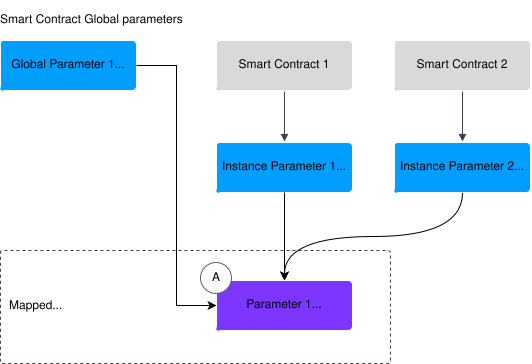
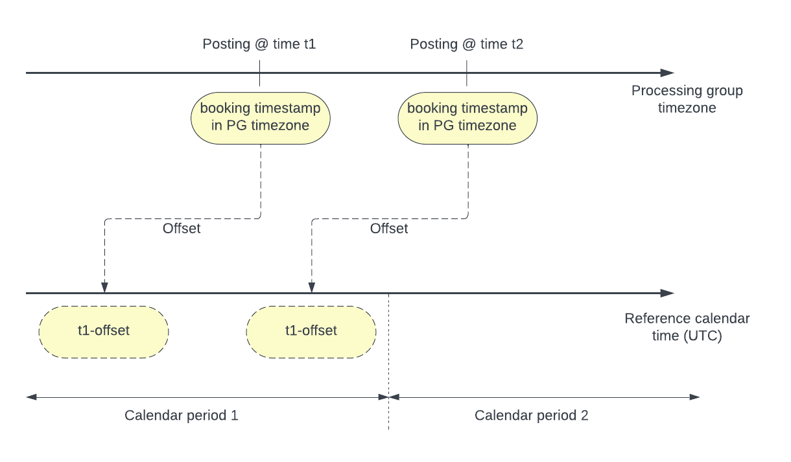

# Overview of changes

Key behavioural changes introduced in Vault Core 5.

## Accounts changes

This section describes the behavioural changes to Accounts as a result of Vault Core 5.

### Changes to the v1 Accounts API

#### Internal Accounts - name field no longer populated

Prior to Vault Core 5, Internal Accounts had to be backed by an empty Smart Contract. This did not add any benefits, but required users to create and upload an empty contract in order to create internal accounts.

From Vault Core 5 onwards, Internal Accounts no longer require a Smart Contract. As a result of this improvement, when retrieving a v1 Internal Account, the name field will no longer be populated. In the v2 Accounts API we have added a new `alias` field which can be specified when creating the account.

#### Customer Accounts - Improvements to the v1 endpoint

##### Instance Parameter updates not permitted when an Account fails to open

Before Vault Core 5, Instance Parameters could be updated on Accounts that failed to properly open, which caused issues; for example a Parameter time series could begin before the Account initially opened. Instance Parameters can no longer be updated if a Customer Account fails to open.

##### Postings prevented when Account ledger has closed

Before Vault Core 5, Postings could occasionally arrive after a zero balance check was completed but before closing an Account, thereby leaving some closed Accounts with a non-zero balance.

From Vault Core 5 onwards, Vault Core checks that the balance is zero and closes the ledger in a single atomic step, preventing any more Postings from adjusting the balance. Therefore, the balance of any closed Account is always zero.

#### Customer Accounts - retrievals have a minor lag following a mutation

While we never offered strong consistency guarantees for GET /v1/accounts calls, as a result of database read/write optimisations in Vault Core 5 there will be a short interval between a mutation being made to a given Account, and that mutation being reflected on GET /v1/accounts. For example, a newly created Account will return an Account ID synchronously, but it will take a short time for that ID to display in responses to GET /v1/accounts API calls.

These optimisations allow much higher write speeds, and much richer read requests, but you may need to factor this slight lag in any integration tooling.

#### Account updates - streaming events have an enhanced payload

Before Vault Core 5, when updating an account, the streamed update event would only contain the field that changed (along with `update_mask`), meaning that both the order of messages, and the deltas between subsequent messages, were required in order to track all changes.

From Vault Core 5 onwards, event streams for account updates now include the full account resource, as well as the `update_mask`, which specifies the fields that have changed.

#### Product version account updates from CLv3 to Clv4 - different failure behaviour

From Vault Core 5 onwards, if an account conversion from Contracts Language API Version 3 (CLv3) to Contracts Language API Version 4 (CLv4) is unsuccessful, the account will remain on the CLv3 contract. A subsequent CLv3 to CLv4 account conversion must be created successfully to define schedules, and move the account to CLv4.

### Key differences between the v1 and v2 Accounts APIs

 
| v1 Accounts API | v2 Accounts API |
| --- | --- |
| 
The initial 200 response does not imply a successful Account operation. Integrations need to listen to Streaming APIs to confirm actions.

 | 

The initial 200 response confirms a successful Account operation. All Account operations are synchronous.

 |
| 

Internal and Customer Accounts are separate resources. Internal Accounts are backed by an empty Smart Contract.

 | 

Internal and Customer Accounts are managed via the same v2 Account resource (instead set by `account.type`). There is no need to specify a Smart Contract when creating an Internal Account.

 |
| 

Customer Account status cannot be used to identify whether activation and closure hooks have been run.

 | 

Customer Account status reflects whether activation and closure hooks have been run.

 |
| 

Processing Groups are not supported.

 | 

Accounts will support the use of [Processing Groups](/vault-core/5-8/EN/reference/processing_groups), which allow for the isolation of Postings and additional controls over associated schedules.

 |
| 

You cannot use the Expected Parameters syntax introduced in Smart Contracts language version 4 (CLv4).

 | 

You can use the Expected Parameters syntax introduced in Smart Contracts language version 4 (CLv4), and therefore you can use the new [Parameters](/vault-core/5-8/EN/reference/parameters) resource. You can also use [the Parameter Value Hierarchy](/vault-core/5-8/EN/reference/parameters/building_and_managing_the_parameter_value_hierarchy); introduced in Vault Core 5.3.

 |
| 

Supports Customer Accounts with Smart Contracts on Contract Language v3 and v4.

 | 

Supports Customer Accounts with Smart Contracts on Contract Language v4.

 |

#### v1 and v2 Customer Account status overview

The below diagram compares the statuses in the v1 and v2 Customer Account journeys:

chat\_bubble

-   For a detailed explanation of the v2 Account statuses and their behaviour, see [Account statuses](/vault-core/5-8/EN/reference/accounts/accounts_version_2#account_statuses).
    
-   There is nuance in the way that statuses operate when performing a switch from the v1 to v2 services. For the complete process, see [Switching from v1 to v2 Accounts API](/vault-core/5-8/EN/reference/accounts/switching_from_v1_to_v2_accounts_api).
    

### Changes after switching to the v2 Accounts API

#### Parameter values must be set before converting the Customer Accounts that use them

Using the v1 Accounts API, you can convert Customer Accounts to a new Smart Contract version and simultaneously set Parameter values in the same call to `/v1/account-updates POST`.

When using the v2 API to convert accounts to a new Smart Contract version, Parameter values are no longer passed in with the API update call. Instead, Parameters and Parameter values have been abstracted away to become their own first-class resource. Following this change, new Parameters and Parameter values must be set via `POST /v1/parameters` and `POST /v1/parameter-values`. Any new CLv4 Smart Contracts that are uploaded will be checked for Parameter references, and these Parameters must exist prior to Smart Contract upload.

#### Customer Account opening: Activation hook is executed first

In the v2 Accounts API, the account opening process has changed so that the Smart Contract `activation_hook` is executed first. This ensures that we do not modify the account if an error occurs whilst executing the hook. However, this has some implications when writing an `activation_hook`.

The `get_account_creation_datetime` method in the contract language returns the `source_create_timestamp` field on the account. However, when creating an account in OPEN status, the account has not been created at the time that the hook is run, so the `get_account_creation_datetime` method will return None.

We recommend instead using the `effective_datetime` hook argument for creating schedules.

#### Customer Account closure: Deactivation hook is executed first

In the v2 Accounts API, the Account closure process has changed so that the Smart Contract `deactivation_hook` is executed first. The account will remain open if:

-   The hook does not run successfully
    
-   Deactivation is rejected
    
-   Any postings that are issued are not committed
    
-   The Account balances are not zero
    

In these circumstances, the `deactivation_hook` will be executed again when the bank later tries to close the Account.

error

You may need to change the `deactivation_hook` behaviour to account for these scenarios. For example, if a product using v1/accounts charged a fee during account closure, and the deactivation code for that charge was not changed when moving to v2/accounts, then that fee could end up being charged multiple times, as the account closure would be retried repeatedly because of the non-zero balance.

#### Immediate feedback on Account mutation outcomes

Contrary to the v1 Accounts API, the synchronous nature of the v2 Accounts API provides immediate feedback on the outcome of an operation.

This is especially useful in cases where the operation fails. The returned error provides sufficient information to easily identify the root cause of the problem, enabling faster remediation of issues. For information about some of the common errors, see [Troubleshooting Customer Accounts](/vault-core/5-8/EN/reference/accounts/accounts_version_2#troubleshooting_customer_accounts).

chat\_bubble

When using `GET /v2/accounts`, there will be a short interval between a mutation being made to a given Account, and that mutation being reflected.

#### Failed Customer Account mutations do not leave Accounts in a transient state

Before Vault Core 5, a Customer Account may have ended up in a transient state for a long period of time; however the architectural redesign of Vault Core 5 means that Accounts will not remain in transient states in case of a failed mutation. After an error, the Account will move into a stable state, ensuring the usability of the Account.

#### Restriction overrides are not possible

It is not possible to override Restrictions on the v2/Accounts API (or any of the [Usable v1 Accounts endpoints after the switch](/vault-core/5-8/EN/reference/accounts/switching_from_v1_to_v2_accounts_api#usable_v1_accounts_endpoints_after_the_switch)).

## Parameters changes

This section explains the behavioural changes that apply to Parameters in Vault Core 5, and the changes that then apply when you [switch to using the Core API Parameters](/vault-core/5-8/EN/reference/parameters/switching_to_core_api_parameters) resource.

### Changes before switching to the Parameters resource

#### Enhanced Instance Parameter time series history

If you have upgraded to Vault Core version 5, where a given Instance Parameter shape has not changed:

-   All previous history of the Instance Parameter Value (from the beginning of its use) is restored
    
-   Converting an Account to a new Smart Contract version will no longer reset its Instance Parameter Value’s time series history - the history will be preserved across Account conversions. However, if the Instance Parameter shape is changed during the conversion, this will not preserve its history
    

Therefore, more Instance Parameter and Parameter Values data for an Account may become available to you:

-   `v1/accounts:paramTimeseries` may return Parameter Values for an Instance parameter referenced in previous Product versions an Account was managed by
    
-   Any extra Parameter Values data will be available to Smart Contract hooks
    
    error
    
    Smart Contract hooks requiring Parameter time series data may be affected by the updated Parameter time series. Hooks only using the latest Parameter Values (for example `vault.get_parameter_timeseries('param').latest()`) are unaffected. Otherwise, please contact your Thought Machine representative for advice.
    

### Key differences between Smart Contract parameters and expected\_parameters

 
| Smart Contract `parameters` | Smart Contract `expected_parameters` |
| --- | --- |
| 
Instance Parameters are defined within Smart Contracts, and Global Parameters are set via the CLU or Global parameters endpoint.

 | 

Account-owned and Globally-owned Parameter values are managed independently of Smart Contracts, via a single API (or the CLU), defined in the Contracts as [Expected Parameters](/vault-core/5-8/EN/reference/contracts/contracts_api_4xx/concepts#expected_parameters).

 |
| 

No Parameter value inheritance.

 | 

Parameters apply inheritance to values - a globally-owned value is superseded by [Parameter Value Hierarchy](/vault-core/5-8/EN/reference/parameters/building_and_managing_the_parameter_value_hierarchy) values (which themselves follow an internal order), and ultimately by Account-owned values.

 |

### Behavioural changes when using the Parameters resource

#### Account conversions must be performed via v2 endpoints

When the switch to the Core API Parameters resource is complete, you can no longer use `POST /v1/account-migrations` and `POST /v1/account-update-batches` for Account conversions. Instead you must use `PUT /v2/accounts/{account.id}`.

#### All Parameter Value changes can trigger the post\_parameter\_change\_hook

In Vault Core 5, CLv4 Smart Contracts can opt-in to trigger the `post_parameter_change_hook` for any Parameter Value change referenced by `expected_parameters`, by including `triggers_post_parameter_change_hook=True` as shown in the following example.

chat\_bubble

Smart Contracts that are not opted in will trigger the `post_parameter_change_hook` for the creation of Account-owned Parameter Values only (not the expiry of Account-owned values). If you include `triggers_post_parameter_change_hook` for any `expected_parameter` in a CLv4 Smart Contract, you must also define both `triggers_pre_parameter_change_hook` and `triggers_post_parameter_change_hook` (as either true or false) for ALL of the `expected_parameters` in that CLv4 Smart Contract.

#### Post\_parameter\_change\_hook delay

To allow time for hierarchical checks on Parameter values affecting Accounts, there is a short lag between a Parameter value creation (or update), and the triggering of the `post_parameter_change_hook`. This is typically around 5 seconds, but could be longer during times of heavy processing load.

#### New method for unsetting optional Account Parameters

When updating Smart Contract Instance Parameters, you can unset an optional Instance Parameter by calling `/v1/account-updates POST`, and setting the value as an empty string ("").

Since the new Account-owned Parameter Values introduced in Vault Core 5 have no concept of 'optional', and since we have introduced a minimum string length of 1, calling `/v1/parameter-values POST` (when you have completed [switching to the Core API Parameters resource](/vault-core/5-8/EN/reference/parameters/switching_to_core_api_parameters)) and attempting to set an empty string will produce an error. Instead, you need to set the `effective_to_timestamp`, as explained in [Unsetting a Parameter Value](/vault-core/5-8/EN/reference/parameters/using_core_api_parameters#unsetting_a_parameter_value).

#### All Parameters fall back to globally-owned values (if included)

Due to the way that the general hierarchy of Parameter Values in Vault Core 5 works, if a Parameter has both a global value and an account-owned value applied to an Account, and the account-owned value is unset, then the global value will *always* be used - even if the Parameter is set as `optional=True` in the `expected_parameters` syntax of the CLv4 Smart Contract.

#### Parameter Value history available

In Vault Core 5, where a given Parameter shape has not changed, and has been mapped to the Core API Parameter type:

-   All Instance Parameter values created throughout an Account’s lifetime (including before Vault Core 5) will be available via `v1/parameter-values` when you complete [switching to the Core API Parameters resource](/vault-core/5-8/EN/reference/parameters/switching_to_core_api_parameters).
    
-   Parameter Values' time series history will be preserved across Account conversions.
    

chat\_bubble

The time series history of Template and Global Parameter Value behaviour has not changed in Core API Parameters:

-   Template value history is not preserved across Account conversions
    
-   Global value history is always preserved
    

#### Value ownership

Global, Template, Instance, and Derived Parameters have a concept of *level*, which is part of the definition. The value of that parameter can then only be applied at that level; for example when changing a Template-level parameter it will affect all accounts using its product version.

In Vault Core 5, the new equivalents of Global and Instance Parameters (global-owned and Account-owned respectively) do not have a level; instead, their *values* have an *owner*.

For example, where before Vault Core 5 you would define a parameter as being Instance-level, you now create a *value* and set its *owner* to be a specific account.

This change is to allow Smart Contracts to be written without having to make decisions on whether parameters can be (for example) customised per account.

#### Type support

In Vault Core 5, the Parameter system supports a similar set of types (also known as shapes, or constraints) to the pre-Vault Core 5 Parameters, but some have been improved, or in some cases consolidated. This is to make it easier to write and read Smart Contracts by requiring fewer Parameters overall, and making them more closely match the required usages.

chat\_bubble

To learn about the type (shape) mapping, see [Parameter shape to constraint mapping](/vault-core/5-8/EN/vault_core_overview/whats_new_in_vc5/overview#parameter_shape_to_constraint_mapping).

##### Denomination

In Vault Core 5, denominations can be represented as either String or Enumeration type Parameters, allowing flexibility or restriction as required. This could be used to restrict to ISO currency codes, but can also be used for:

-   Loyalty/reward points
    
-   Unofficial currencies
    
-   Tangible assets
    

#### No string parsing

Before Vault Core 5 all Parameter-related APIs treated values as strings, which had to be parsed according to their shape.

In Vault Core 5, each value has a type corresponding to its Parameter, meaning that in most cases an API user does not need to implement their own parsing.

### Data changes when using the Parameters resource

Once the upgrade to Vault Core 5 is completed:

-   All existing Global and Instance Parameters have been recreated in the new Parameter system, and are available via the new `v1/parameters` and `v1/parameter-values` endpoints (ready for when you [switch to the Core API Parameters resource](/vault-core/5-8/EN/reference/parameters/switching_to_core_api_parameters))
    
-   All existing APIs used to define Global and Instance Parameters (and their values) continue to work until their official removal. Any Parameters and values defined via these APIs are automatically recreated in the [Parameters](/vault-core/5-8/EN/api/core_api#parameters) resource (following the mapping rules in this section), and are available via the Parameter API endpoints
    
-   If you attempt to create a new Global Parameter via `POST /v1/global-parameters` with an `id` that matches an Instance Parameter’s `name`, the request will fail.
    

chat\_bubble

-   Template-level Parameters are not changing in Vault Core 5, and work the same way as they did before Vault Core 5.
    
-   Derived Parameters are not changing in Vault Core 5. They are not defined or accessed using the Parameters API, and are still accessed via `v1/accounts/{id} GET` (even after completing the switch from the v1 to v2 Accounts API).
    

#### Parameter mapping

To create equivalents of legacy parameters in the new [Parameters API](/vault-core/5-8/EN/api/core_api#parameters), the upgrade to Vault Core 5 maps the existing [Global Parameters](/vault-core/5-8/EN/api/core_api#global_parameters) and Smart Contract Instance Parameters. These are both mapped using the `id` of Global Parameters and the `name` of instance Parameters, together forming as a new Core API Parameter `id`.

This means that if Parameters created on Vault Core 4 (or earlier) have:

-   Both a matching ID/name and shape, only a single mapped Parameter is created (using the ID/name as its new ID)
    
-   The same ID/name but a different shape, one new Parameter (type) is created for each shape; for one of these shapes the new Parameter’s ID matches the former ID/name, but for the others the new ID is suffixed with an integer
    
-   Different IDs/names, one new Parameter is created for each (using the former ID/name as its new ID)
    

For example, if a Global Parameter was created on Vault Core 4 (or earlier) with an `id` of "A", and its shape is identical to an Instance Parameter with a `name` of "A", these two Parameters are mapped to a single new Core API Parameter with an `id` of "A".

This mapping also applies automatically when creating new Global or Instance Parameters on Vault Core 5, with one exception: you cannot create a new Global Parameter via `POST /v1/global-parameters` with an `id` that matches an Instance Parameter’s `name`.

chat\_bubble

There are some attributes within a given Parameter shape that are not considered a match (between two shapes of the same type), and therefore lead to the creation of new Parameters. For more information see [Attributes which affect mapping](#attributes_which_affect_mapping).

##### Instance Parameter mapping

Since Instance Parameters are created within each Smart Contract, and Core API Parameters are instead created and managed centrally via `v1/parameters`, this requires mapping (to combine isolated Instance Parameters into a central Core API store).

The following diagram illustrates the Vault Core 5 mapping of Instance Parameters to Core API Parameters. This mapping applies both during the upgrade to Vault Core 5, and when creating new Instance Parameters on Vault Core 5:

-   **Instance Parameter 1** and **2** have the same name and shape, so their name is mapped to only one Parameter ID in the new resource (A)
    
-   **Instance Parameter 3** has the same name but a different shape to **Instance Parameter 1** and **2**, so a new Parameter is created, and the ID is suffixed with an integer (B)
    
-   **Instance Parameter 4** has a different name to the previous Parameters, so the new Parameter is created with its name as the ID (C)
    

warning

-   If you want to obtain (and retain) the history of your Parameters, it is important to check which Instance Parameters mapped to which new Parameters (which Parameter was not suffixed, and which were). To retrieve the mapping of Instance Parameter renames, call `GET /v1/product-versions` , passing the `view` query parameter with a value of "PRODUCT\_VERSION\_VIEW\_INCLUDE\_PARAMETERS". The mapping is displayed in the `parameter_id_by_instance_parameter_name` field of the response.
    
-   Thought Machine recommends that you do not create new Instance Parameters on Vault Core 5 before you understand how the mapping works. This mapping affects any Core API Parameters created automatically, which will be visible when [Switching to Core API Parameters](/vault-core/5-8/EN/reference/parameters/switching_to_core_api_parameters).
    

##### Global Parameter mapping

Since Global Parameters are created via `POST /v1/global-parameters` with an ID which maps to the ID of Core API Parameters (also created and managed centrally via `v1/parameters`), during the upgrade to Vault Core 5 this combines with the mapping of Instance Parameters, as shown in the following diagram:

-   **Global Parameter 1** has an ID which matches the name of **Instance Parameter 1** and **2**, and its shape also matches, so this Parameter is also mapped to **Parameter 1** in the new resource (A)
    

info

While the upgrade to Vault Core 5 automatically maps Global and Instance Parameters together in this way, you cannot create a *new* Global Parameter on Vault Core 5 via `POST /v1/global-parameters` with an `id` which matches with an existing Instance Parameter’s `name`.

#### Parameter Value mapping

-   Each Global Parameter Value displays on the Parameter Values resource as a Parameter Value with an owner set to `global: true`
    
-   Each Instance Parameter Value displays on the Parameter Values resource as a Parameter Value owned by a specific Account (`account_id`)
    

chat\_bubble

For more information see [Retrieving Parameters and their values](/vault-core/5-8/EN/reference/parameters/using_core_api_parameters#retrieving_parameters_and_their_values)

#### Parameter shape to constraint mapping

The following table summarises how Smart Contract Global and Instance Parameters map across to Core API Parameters.

chat\_bubble

-   Parameters which map to a different type or have different metadata specified in the table below will result in the creation of different Core API Parameters
    
-   In some cases, Parameters which have the same Shape but different attributes can still lead to different Core API Parameters, as described in [Attributes which affect mapping](/vault-core/5-8/EN/vault_core_overview/whats_new_in_vc5/overview#attributes_which_affect_mapping).
    

  
| Smart Contract Parameter Type (shape) | Core API Parameter Type (constraint) | Core API Parameter metadata |
| --- | --- | --- |
| 
`DenominationShape` (empty `permitted_denominations` field)

 | 

`StringConstraint`

 | 

`{"value_type": "denomination"}`

 |
| 

`DenominationShape` (non-empty `permitted_denominations` field)

 | 

`EnumerationConstraint`

 | 

`{"value_type": "denomination"}`

 |
| 

`DateShape` (absolute)

 | 

`DateTimeConstraint`

 |  |
| 

`DateShape` (relative)

 | 

`StringConstraint`

 | 

`{"value_type": "relative_date"}`

 |
| 

`NumberShape`

 | 

`DecimalConstraint`

 |  |
| 

`StringShape`

 | 

`StringConstraint`

 |  |
| 

`AccountIdShape`

 | 

`AccountConstraint`

 |  |
| 

`UnionShape`

 | 

`EnumerationConstraint`

 | 

`{"value_type": "union"}`

 |
| 

`OptionalShape`

 | 

The constraint corresponding to the wrapped `Shape` (see also note below)

 | 

The metadata corresponding to the wrapped `Shape`, additionally with `{"optional": "true"}`

 |

chat\_bubble

Core API Parameters cannot be marked as optional as part of their resource definition. Instead, Smart Contracts that use the Parameter can mark them as optional for the purpose of that Contract.

#### Attributes which affect mapping

The following section indicates attributes of Smart Contract Global and Instance Parameters which do and do not lead to the creation of additional Core API Parameters:

##### AccountIdShape

`AccountIdShape` maps directly to `AccountConstraint`.

##### DateShape (absolute)

 
| Attribute | Does the variation lead to a new Parameter being created? |
| --- | --- |
| 
The content of `DateShape.min_date`

 | 

Yes

 |
| 

The content of `DateShape.max_date`

 | 

Yes

 |

##### DateShape (relative)

 
| Attribute | Does the variation lead to a new Parameter being created? |
| --- | --- |
| 
The content of `DateShape.min_date`

 | 

No

 |
| 

The content of `DateShape.max_date`

 | 

No

 |

##### DenominationShape

 
| Attribute | Does the variation lead to a new Parameter being created? |
| --- | --- |
| 
The order of metadata within `DenominationShape.permitted_denominations`

 | 

No

 |

##### NumberShape

 
| Attribute | Does the variation lead to a new Parameter being created? |
| --- | --- |
| 
The content of `NumberShape.kind` (note: Only applies to CLv3 Smart Contracts)

 | 

No

 |
| 

The content of `NumberShape.min_value`

 | 

Yes

 |
| 

The content of `NumberShape.max_value`

 | 

Yes

 |
| 

The content of `NumberShape.step`

 | 

No

 |

##### OptionalShape

`OptionalShape` only has an effect if two otherwise identical Smart Contract Global or Instance Parameters exist, but one of them specifies an `OptionalShape` and one does not; in this case two Core API Parameters will be created (one being suffixed).

##### StringShape

`StringShape` maps directly to `StringConstraint`.

##### UnionShape

 
| Attribute | Does the variation lead to a new Parameter being created? |
| --- | --- |
| 
The order of metadata within `UnionShape.items`

 | 

No

 |
| 

The content of `UnionShape.UnionItem.display_name`

 | 

No

 |
| 

The content of `UnionShape.UnionItem.key`

 | 

Yes

 |

##### Other attributes

 
| Attribute | Does the variation lead to a new Parameter being created? |
| --- | --- |
| 
The content of `display_name`

 | 

No

 |
| 

The content of `description`

 | 

No

 |
| 

The content of `default_value`

 | 

No

 |
| 

The content of `update_permission`

 | 

No

 |

## Postings and balances changes

### Posting Instruction Batch retrievals have a minor lag following a mutation

While Thought Machine never offered strong consistency guarantees for `GET /v1/posting-instruction-batches` calls, as a result of database read/write optimisations in Vault Core 5, there is a short interval between making a mutation to a given Posting Instruction Batch and that mutation being reflected on `GET /v1/posting-instruction-batches`.

Vault Core only publishes an event to the `vault.api.v1.postings.posting_instruction_batch.created` Kafka topic after the posting instruction batch has been fully persisted, so that integrations have the option to wait for that event to guarantee that the posting instruction batch is available from `GET /v1/posting-instruction-batches`.

These database read/write optimisations allow much higher write speeds, and much richer read requests, but you may need to factor in this slight lag in any integration tooling.

### Timestamps introduced at Posting Instruction level

info

-   For optimal system performance, Thought Machine recommends future-dating no more than one percent of your total Postings, and spreading them relatively evenly over a 90 day future period. If the expected throughput or concentration of future-dated Postings is higher than this, contact your Thought Machine representative.
    
-   Future-dated Postings are not compatible with CLv3 Smart Contracts.
    

Vault Core 5.5 includes the ability to submit Postings targeted at a future time, whereby no check is performed when the value timestamp is reached. To use this functionality, the value and booking timestamps must be set at the *Posting Instruction* (PI) level, not at the *Posting Instruction Batch* (PIB) level. The following table explains the differences between PIB level and PI level timestamps:

  
| Timestamp | Behaviour when used at PIB level | Behaviour when used at PI level |
| --- | --- | --- |
| 
`value_timestamp`

 | 

Defaults to `insertion_timestamp`. If set, this also sets `booking_timestamp`. Can be backdated, but cannot be future-dated.

 | 

Defaults to `insertion_timestamp`. Can be independently backdated or dated up to 90 calendar days in the future (from the time of the request). **Does not affect** `booking_timestamp`.

 |
| 

`booking_timestamp`

 | 

Defaults to `value_timestamp`. Can be independently backdated, but cannot be future-dated.

 | 

Defaults to `insertion_timestamp`. Can be independently backdated or dated up to 90 calendar days in the future (from the time of the request).

 |

warning

Multiple Posting Instructions (either in a single batch, or across multiple batches) must respect the correct order in a client transaction:

-   No two Posting Instructions may share the same `value_timestamp` or `booking_timestamp`
    
-   While `value_timestamp` and `booking_timestamp` are independent, they must both be in the same overall order; for example, both the `value_timestamp` and the `booking_timestamp` of an authorisation PI must fall before their equivalent timestamps in a settlement PI.
    

### Deterministic posting and balance requirements

Vault Core allows you to backdate or future-date postings to capture when the actual movements of funds took place, or a commitment to apply fund movements at a future time. These actions create three distinct time series for postings (and their associated account balances):

-   *Ledger balance time series*: Based on insertion time. This is immutable (Vault Core sets the insertion time, always increasing).
    
-   *Product balance time series*: Based on value time. This is mutable - it can change if a client submits a backdated or future-dated posting.
    
-   *Reporting balance time series*: Based on booking time. This is mutable - it can change if a client submits a backdated or future-dated posting.
    

You can configure the time that a schedule should run. This is called the schedule’s *effective time*.

The actual *execution time* of a schedule for each account is always later than its effective time and is non-deterministic. The difference between effective time and execution time can vary depending on a number of factors, some of which are completely out of the control of a Vault Core client (for example, processing lag, due to the asynchronous nature of schedule execution).

The product balance time series can change between *effective time* and *execution time* if backdated postings are received between those two times.

Before Vault Core 5, it was not possible to fetch postings and balances as observed at effective time, which meant its results were non-deterministic.

From Vault Core 5 onwards, for Smart Contracts written in CLv4, `schedule_code` execution fetches balances and postings as observed at the `effective_time` of a schedule by default, making these queries deterministic.

## Multi-timezone support

### Managing postings in multiple timezones

As of Vault Core 5.0, Vault Core supports assigning postings that originate from multiple timezones to the correct calendar period for clear and consistent financial reporting. Vault Core has an enriched postings stream that assigns each posting with a corresponding Calendar period.

Here, we describe how to assign postings to the correct calendar period using the bookkeeping label (provided in the enriched Kafka topic: `vault.core_api.v1.postings.enriched_posting_instruction_batch.events`) together with the following new features in Vault Core 5.0:

-   Processing Groups, which are timezone-aware
    
-   Booking timestamp
    

In Vault Core 4.x the bookkeeping label (provided in the enriched Kafka topic) is used to assign postings to the correct calendar period. The limitation of this solution is that the bookkeeping label is not timezone-aware. This is because it is based on the insertion timestamp (in UTC) combined with the reference calendar (which is also in UTC). As a result, a bank using this solution for assigning postings has to keep a Summer and a Winter calendar and switch between them when the clocks change with Daylight Savings Time (DST). This creates a heavy administrative burden.

In Vault Core 5.0, you can use a Processing Group (PG), which is timezone-aware, together with the booking timestamp to assign postings to a calendar period. Using these features means that you no longer need to maintain two calendars.

This solution works as follows:

1.  Every Posting Instruction Batch (PIB) is assigned a booking timestamp either automatically by Vault Core or as set by the bank. For each PIB, the booking timestamp is in UTC and is combined with the Processing Group timezone to calculate the `booking_localised_date_time` for each PIB. (The `booking_localised_date_time` is in the timezone of the PG of the affected accounts.)
    
2.  In order to assign each posting to a specific reference calendar period, the information from the `booking_localised_date_time` needs to be adjusted to be comparable to the reference calendar. You would typically achieve this by setting a suitable offset that represents the timezone of the reference calendar relative to UTC. This ensures that you can share the reference calendar across timezones.
    
3.  The `booking_localised_date_time` is adjusted to match the offset and then matched to a calendar period in the reference calendar. That calendar period is returned in the enriched topic as the `localised_bookkeeping_label` and can be consumed by downstream systems.
    

error

Using a Processing Group (PG) is not suitable for everyone. In Vault Core 5.0, there is only one, Default Processing Group (DPG) - you cannot create additional PGs. It is critical to set the Processing Group timezone correctly. Once a Processing Group timezone is set, you cannot change it. The underlying Accounts and corresponding Schedules in the PG use its timezone. We strongly recommend that before setting the timezone of the Default Processing Group to a non-empty value, that you convert all Accounts in Vault Core to a single timezone, set by the `events_timezone` parameter in a Contract. For more information, see [Processing Groups](/vault-core/5-8/EN/reference/processing_groups).

A large number of countries use DST and move their clocks forward during the Summer months. For banks that use timezones that follow this model, you can use the following set up to ensure that are postings allocated to the correct calendar period and assigned the expected `localised_bookkeeping_label` as a result.

error

It is important to set the offset correctly in order to avoid having postings shifted and assigned to the incorrect calendar period.

### Daylight Saving Time (DST)

Banks that follow Daylight Saving Time (DST) or summer time must configure the Processing Group timezone accordingly.

1.  Set the PG timezone through an API call to the [Processing Groups API](/vault-core/5-8/EN/api/core_api#processinggroups).
    
    info
    
    Make sure that you first read the information described in [Processing Groups](/vault-core/5-8/EN/reference/processing_groups). If you consider that using the feature is suitable for your requirements and you wish to implement a PG, make sure that you follow and complete the accompanying instructions exactly.
    
2.  Set-up the period cutoff in the reference calendar according to the Summer time of the PG timezone in UTC.
    
    Example scenario:
    
    -   You set the Processing Group (UTC) to Rome/Europe
        
    -   You want to set the cutoff for your calendar periods to 00:00 in your local time
        
    
3.  Set the offset as the difference between the reference calendar and UTC.
    
    In our example, if you set it to the Summer time of the local time, then you would set the offset at two hours. This is because during the Summer, 00:00 midnight in Rome is UTC+2, while UTC is 22:00. Therefore, you would set the cutoff in the reference calendar to 22:00 so that there is a difference of two hours, regardless of the time of the year and date/time that you set it up.
    
    In order to set the offset, you need to configure and set it in the values.yaml file:
    
    -   Environment variable (instance-level): `ENRICHED_POSTINGS_CALENDAR_OFFSET`
        
    -   Value format: duration
        
    -   Value: A valid timestamp offset between "-12 h" and "+14 h"
        
    -   Example value: 2 h
        
    -   Monitoring: `EnrichedPostingInstructionBatchEvent` (topic: `vault.core_api.v1.postings.enriched_posting_instruction_batch.events`)
        
    

chat\_bubble

For more information about monitoring `EnrichedPostingInstructionBatchEvent`, see: [Core Streaming API Posting Events](/vault-core/5-8/EN/api/core_api#posting_events)

### Examples

#### Working example

The following table illustrates how the localised bookkeeping label behaves during a clock change. The table shows the change from Summer to Winter time for the example used in the previous section. Rome observes CEST between 26 March and 29 October.

You can regard the "reference time" that we discuss in these examples and tables as a UTC representation of the localised time, such that you can use it with a calendar period (also in UTC), but that observes any DST shift. On the day of a clock change, we have 25 hours in the reference day (whereas standard UTC always has 24 hours per day).

To summarise this example:

-   Processing Group timezone (UTC): Europe/Rome
    
-   Reference calendar cutoff: 22:00
    
-   Offset (`ENRICHED_POSTINGS_CALENDAR_OFFSET`): 2 h
    

     
| No. | UTC | booking\_localised\_datetime (Europe/Rome) | bookkeeping\_label | Reference time (UTC) | localised bookkeeping label |
| --- | --- | --- | --- | --- | --- |
| 
1

 | 

2023-10-29 21:00

 | 

29/10/2023 23:00:00 CEST

 | 

2023-10-29

 | 

29/10/2023 21:00:00 UTC

 | 

2023-10-29

 |
| 

**2**

 | 

**2023-10-29 22:00**

 | 

**29/10/2023 00:00:00 CEST**

 | 

**2023-10-30**

 | 

**29/10/2023 22:00:00 UTC**

 | 

**2023-10-30**

 |
| 

3

 | 

2023-10-29 23:00

 | 

29/10/2023 01:00:00 CEST

 | 

2023-10-30

 | 

29/10/2023 23:00:00 UTC

 | 

2023-10-30

 |
| 

4

 | 

2023-10-30 00:00

 | 

29/10/2023 02:00:00 CEST

 | 

2023-10-30

 | 

29/10/2023 00:00:00 UTC

 | 

2023-10-30

 |
| 

5

 | 

2023-10-30 01:00

 | 

29/10/2023 02:00:00 CET

 | 

2023-10-30

 | 

29/10/2023 00:00:00 UTC

 | 

2023-10-30

 |
| 

6

 | 

2023-10-30 02:00

 | 

30/10/2023 03:00:00 CET

 | 

2023-10-30

 | 

30/10/2023 01:00:00 UTC

 | 

2023-10-30

 |
| 

7

 | 

2023-10-30 03:00

 | 

30/10/2023 04:00:00 CET

 | 

2023-10-30

 | 

30/10/2023 02:00:00 UTC

 | 

2023-10-30

 |
| 

8

 | 

2023-10-30 04:00

 | 

30/10/2023 05:00:00 CET

 | 

2023-10-30

 | 

30/10/2023 03:00:00 UTC

 | 

2023-10-30

 |
| 

9

 | 

2023-10-30 05:00

 | 

30/10/2023 06:00:00 CET

 | 

2023-10-30

 | 

30/10/2023 04:00:00 UTC

 | 

2023-10-30

 |
| 

10

 | 

2023-10-30 06:00

 | 

30/10/2023 07:00:00 CET

 | 

2023-10-30

 | 

30/10/2023 05:00:00 UTC

 | 

2023-10-30

 |
| 

11

 | 

2023-10-30 07:00

 | 

30/10/2023 08:00:00 CET

 | 

2023-10-30

 | 

30/10/2023 06:00:00 UTC

 | 

2023-10-30

 |
| 

12

 | 

2023-10-30 08:00

 | 

30/10/2023 09:00:00 CET

 | 

2023-10-30

 | 

30/10/2023 07:00:00 UTC

 | 

2023-10-30

 |
| 

13

 | 

2023-10-30 09:00

 | 

30/10/2023 10:00:00 CET

 | 

2023-10-30

 | 

30/10/2023 08:00:00 UTC

 | 

2023-10-30

 |
| 

14

 | 

2023-10-30 10:00

 | 

30/10/2023 11:00:00 CET

 | 

2023-10-30

 | 

30/10/2023 09:00:00 UTC

 | 

2023-10-30

 |
| 

15

 | 

2023-10-30 11:00

 | 

30/10/2023 12:00:00 CET

 | 

2023-10-30

 | 

30/10/2023 10:00:00 UTC

 | 

2023-10-30

 |
| 

16

 | 

2023-10-30 12:00

 | 

30/10/2023 13:00:00 CET

 | 

2023-10-30

 | 

30/10/2023 11:00:00 UTC

 | 

2023-10-30

 |
| 

17

 | 

2023-10-30 13:00

 | 

30/10/2023 14:00:00 CET

 | 

2023-10-30

 | 

30/10/2023 12:00:00 UTC

 | 

2023-10-30

 |
| 

18

 | 

2023-10-30 14:00

 | 

30/10/2023 15:00:00 CET

 | 

2023-10-30

 | 

30/10/2023 13:00:00 UTC

 | 

2023-10-30

 |
| 

19

 | 

2023-10-30 15:00

 | 

30/10/2023 16:00:00 CET

 | 

2023-10-30

 | 

30/10/2023 14:00:00 UTC

 | 

2023-10-30

 |
| 

20

 | 

2023-10-30 16:00

 | 

30/10/2023 17:00:00 CET

 | 

2023-10-30

 | 

30/10/2023 15:00:00 UTC

 | 

2023-10-30

 |
| 

21

 | 

2023-10-30 17:00

 | 

30/10/2023 18:00:00 CET

 | 

2023-10-30

 | 

30/10/2023 16:00:00 UTC

 | 

2023-10-30

 |
| 

22

 | 

2023-10-30 18:00

 | 

30/10/2023 19:00:00 CET

 | 

2023-10-30

 | 

30/10/2023 17:00:00 UTC

 | 

2023-10-30

 |
| 

23

 | 

2023-10-30 19:00

 | 

30/10/2023 20:00:00 CET

 | 

2023-10-30

 | 

30/10/2023 18:00:00 UTC

 | 

2023-10-30

 |
| 

24

 | 

2023-10-30 20:00

 | 

30/10/2023 21:00:00 CET

 | 

2023-10-30

 | 

30/10/2023 19:00:00 UTC

 | 

2023-10-30

 |
| 

25

 | 

2023-10-30 21:00

 | 

30/10/2023 22:00:00 CET

 | 

2023-10-30

 | 

30/10/2023 20:00:00 UTC

 | 

2023-10-30

 |
| 

26

 | 

2023-10-30 22:00

 | 

30/10/2023 23:00:00 CET

 | 

2023-10-31

 | 

30/10/2023 21:00:00 UTC

 | 

2023-10-30

 |
| 

**27**

 | 

**2023-10-30 23:00**

 | 

**30/10/2023 00:00:00 CET**

 | 

**2023-10-31**

 | 

**30/10/2023 22:00:00 UTC**

 | 

**2023-10-31**

 |
| 

28

 | 

2023-10-31 00:00

 | 

30/10/2023 01:00:00 CET

 | 

2023-10-31

 | 

30/10/2023 23:00:00 UTC

 | 

2023-10-31

 |

chat\_bubble

During the day of the clock change, 25 hours are 'stamped' (see rows 2-27).

Setting the reference calendar and offset according to Summer time of the Processing Group timezone ensures that the equivalent time of the posting in the reference calendar is never set in the future.

As the clocks move between Summer time (CEST) and Winter time (CET), as shown in the last two lines in the following table, 00:00 (UTC) and 01:00 (UTC) resolve to the *same* UTC equivalent in the reference calendar: 00:00 (UTC). The equivalent timestamp in the reference calendar is one hour behind the actual UTC time, which does not cause issues.

     
| No. | UTC | booking\_localised\_datetime (Europe/Rome) | bookkeeping\_label | Reference time (UTC) | localised bookkeeping label |
| --- | --- | --- | --- | --- | --- |
| 
1

 | 

2023-10-29 21:00

 | 

29/10/2023 23:00:00 CEST

 | 

2023-10-29

 | 

29/10/2023 21:00:00 UTC

 | 

2023-10-29

 |
| 

2

 | 

2023-10-29 22:00

 | 

30/10/2023 00:00:00 CEST

 | 

2023-10-30

 | 

29/10/2023 22:00:00 UTC

 | 

2023-10-30

 |
| 

3

 | 

2023-10-29 23:00

 | 

30/10/2023 01:00:00 CEST

 | 

2023-10-30

 | 

29/10/2023 23:00:00 UTC

 | 

2023-10-30

 |
| 

4

 | 

2023-10-30 00:00

 | 

30/10/2023 02:00:00 CEST

 | 

2023-10-30

 | 

30/10/2023 00:00:00 UTC

 | 

2023-10-30

 |
| 

5

 | 

2023-10-30 01:00

 | 

30/10/2023 02:00:00 CET

 | 

2023-10-30

 | 

30/10/2023 00:00:00 UTC

 | 

2023-10-30

 |

#### Nonfunctional example

The following is an example of incorrect configuration that could cause errors.

error

Do not copy this example - it is only intended to demonstrate how an incorrect configuration could cause unwanted consequences.

This example considers what the configuration would look like - and the potential unwanted consequences - if you set up the reference calendar based on the *Winter* time of the Processing Group, when the clocks move to Summer time. Rome observes CET between 29 October and 26 March. The resulting equivalent timestamp in the reference calendar is one hour in the future, which can have some unwanted consequences.

error

When considering DST, we always recommend setting the `ENRICHED_POSTINGS_CALENDAR_OFFSET` to the offset from UTC of the Summer timezone. Setting it to the Winter time will cause postings to be booked on the wrong day for an hour during the day of the clock change.

To summarise the following example:

-   Processing Group timezone (UTC): Europe/Rome
    
-   Reference calendar cutoff: 23:00
    
-   Offset (`ENRICHED_POSTINGS_CALENDAR_OFFSET`): 1 h
    

chat\_bubble

The `localised_bookkeeping_label` still resolves to the correct calendar period, regardless of whether you set the reference calendar and cutoff based on Summer time or Winter time.

     
| No. | UTC | booking\_localised\_datetime (Europe/Rome) | bookkeeping\_label | Reference time (UTC) | localised bookkeeping label |
| --- | --- | --- | --- | --- | --- |
| 
1

 | 

2024-03-30 21:00

 | 

30/03/2024 22:00:00 CET

 | 

2024-03-30

 | 

30/03/2024 21:00:00

 | 

2024-03-30

 |
| 

2

 | 

2024-03-30 22:00

 | 

30/03/2024 23:00:00 CET

 | 

2024-03-30

 | 

30/03/2024 22:00:00 UTC

 | 

2024-03-30

 |
| 

3

 | 

2024-03-30 23:00

 | 

31/03/2024 00:00:00 CET

 | 

2024-03-31

 | 

30/03/2024 23:00:00 UTC

 | 

2024-03-31

 |
| 

4

 | 

2024-03-31 00:00

 | 

31/03/2024 01:00:00 CET

 | 

2024-03-31

 | 

31/03/2024 00:00:00 UTC

 | 

2024-03-31

 |
| 

5

 | 

2024-03-31 01:00

 | 

31/03/2024 03:00:00 CEST

 | 

2024-03-31

 | 

31/03/2024 02:00:00 UTC

 | 

2024-03-31

 |
| 

6

 | 

2024-03-31 02:00

 | 

30/03/2024 04:00:00 CEST

 | 

2024-03-31

 | 

31/03/2024 03:00:00 UTC

 | 

2024-03-31

 |