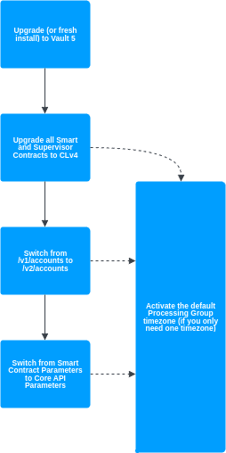

# Service compatibility

This page explains how the Vault Core 5 services work together, and in which order you should switch them over if you are using their legacy variants.

## Service compatibility

The following table summarises the compatibility of the services introduced in Vault Core 5:

    
| Accounts version | Smart Contract Language version | Core API Parameters resource | Processing Groups | Adjustments |
| --- | --- | --- | --- | --- |
| 
/v1/accounts

 | 

CLv3

 | 

NO

 | 

NO

 | 

NO

 |
| 

/v1/accounts

 | 

CLv4

 | 

NO

 | 

YES

 | 

NO

 |
| 

/v2/accounts

 | 

CLv4

 | 

YES

 | 

YES

 | 

YES

 |

chat\_bubble

Supervisor Contracts are not currently compatible with Core API Parameters or Adjustments.

## Accounts and Smart Contract Language version compatibility

    
| Vault Core Version | Contract Language version | Accounts v1 | Accounts v2 | Notes |
| --- | --- | --- | --- | --- |
| 
4.6/4.7

 | 

v3, v4

 | 

YES

 | 

N/A

 | 

Contract Language v4 live

 |
| 

5.X

 | 

v3

 | 

YES

 | 

NO

 | 

Accounts v2 live

 |
| 

5.X

 | 

v4

 | 

YES

 | 

YES

 |  |
| 

6.X

 | 

v3

 | 

NO

 | 

NO

 | 

Contracts Language v3 no longer supported

 |
| 

6.X

 | 

v4

 | 

PARTIAL

 | 

YES

 | 

Accounts v1 endpoint will remain to support updates of Contract Language v4 Accounts (for example metadata updates)

 |
| 

7.X

 | 

v3

 | 

N/A

 | 

NO

 | 

Accounts v1 will be removed no earlier than this version.

 |
| 

7.X

 | 

v4

 | 

N/A

 | 

YES

 |  |

## Required order to switch services

The required order in which to switch services to receive all of the Vault Core 5 benefits is:

1.  Upgrade all Smart Contracts and Supervisor Contracts to CLv4 (if you have not done so already).
    
2.  If you only require a single time zone for processing, [activate the default Processing Group timezone](/vault-core/5-8/EN/reference/processing_groups#supported_approaches_for_setting_the_processing_group_timezone).
    
    chat\_bubble
    
    This step can be carried out at any time, providing that all of your Smart Contracts are using CLv4.
    
3.  [Switching from v1 to v2 Accounts API](/vault-core/5-8/EN/reference/accounts/switching_from_v1_to_v2_accounts_api).
    
4.  [Switching to the Core API Parameters resource](/vault-core/5-8/EN/reference/parameters/switching_to_core_api_parameters) from Smart Contract (Global and Instance) parameters.
    
    chat\_bubble
    
    At this point, you can also leverage the [Adjustments](/vault-core/5-8/EN/reference/adjustments) Extension.
    

The following diagram illustrates the required order in which to switch services:

