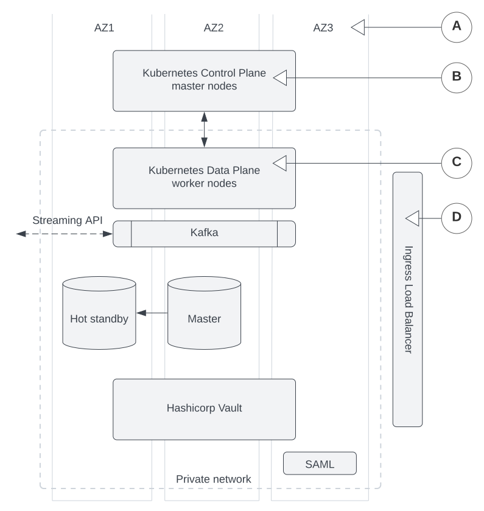

# Deployment options

Bank-hosted

Vault Core is a cloud-native, cloud-agnostic product designed and built to use key cloud functionality in any supported cloud environment. There are many ways to deploy a bank-hosted Vault Core instance, depending on your bank’s infrastructure and operational requirements.

This information is aimed at engineers (such as SREs or DevOps) who will be deploying and maintaining the infrastructure for Vault Core.

## Key considerations

For the bank-hosted offering of Vault Core, you are responsible for provisioning and maintaining the underlying resources and services, in addition to installing and maintaining your Vault Core instance.

Some important considerations include:

-   **Environment hosting**: You must decide where to host your environment. If you are deploying Vault Core in a public cloud environment, you must choose a cloud service provider to host the cloud environment. See [Choosing where to deploy Vault Core](/vault-core/5-9/EN/environment_and_installation/infrastructure_docs/getting_started_with_vault_core/deployment_options#choosing_where_to_deploy_vault_core).
    
-   **Database topology**: The default deployment is a single primary physical database, but you can choose to run Vault Core with multiple physical databases. See [Configuring multiple databases](/vault-core/5-9/EN/environment_and_installation/infrastructure_docs/vault_cloud_infrastructure/configuring_multiple_databases).
    
-   **Deployment size**: You will need to size infrastructure for Vault Core according to your bank size and workload requirements. For guidance, refer to the [Vault Core Release Certification Performance Report](/vault-core/5-9/EN/vault_release_information/performance_and_testing#performance_report) for your chosen CSP. See [Setting the deployment size](/vault-core/5-9/EN/environment_and_installation/infrastructure_docs/tmcomponent_operator_user_guide/installing_or_upgrading_vault#setting_the_deployment_size) for the recommended maximum number of customer accounts based on the size of your Vault Core instance - this configuration can be changed later on.
    
-   **Logging and metrics storage**: While we provide an Observability Stack for monitoring your Vault Core instance, you must provide your own logging platform and long-term storage solution for metrics. See [Introduction to observability](/vault-core/5-9/EN/environment_and_installation/infrastructure_docs/observability_and_monitoring/introduction_to_observability).
    
-   **High availability**: Vault Core is designed to be highly available - by default, it is deployed across three availability zones within a single region, protecting against downtime in the event of a localised data centre failure. To ensure greater resilience and maintain high availability in the event of a regional outage, you can consider using the [Active-Passive](/vault-core/5-9/EN/environment_and_installation/infrastructure_docs/tmcomponent_operator_user_guide/active_passive) deployment mode to create a backup Vault Core instance in a separate region..
    
-   **Security**: Security is a shared responsibility between Thought Machine and our clients. Ensure you are familiar with the Shared Responsibility Model at [Security](/vault-core/5-9/EN/vault_core_overview/vault_security) and understand how it relates to you as a bank-hosted client.
    

Your Thought Machine representative can help advise on what is most suitable for your bank’s operational requirements.

## Choosing where to deploy Vault Core

You can deploy Vault Core in either a public or private cloud environment. Thought Machine supports all major public cloud service providers (CSPs):

-   [Google Cloud Platform (GCP)](https://cloud.google.com/docs)
    
-   [Amazon Web Service (AWS)](https://docs.aws.amazon.com/)
    
-   [Microsoft Azure](https://learn.microsoft.com/azure/)
    

You can also deploy Vault Core on [OpenShift](https://www.redhat.com/en/technologies/cloud-computing/openshift), which can be run on any CSP or supported infrastructure.

Setting up the infrastructure to run your bank-hosted Vault Core instance depends on whether you are hosting via a CSP or on-premises. Setup also differs based on your chosen CSP. For more guidance on setting up GCP, AWS, or Azure, see your CSP’s documentation. Refer to [Expected infrastructure](/vault-core/5-9/EN/environment_and_installation/infrastructure_docs/getting_started_with_vault_core/infrastructure_overview#expected_infrastructure) for the recommended components based on your deployment.

## Setting up required infrastructure

Before installing Vault Core itself, you need to set up all the dependencies that make up its infrastructure. Vault Core relies on surrounding infrastructure including Kubernetes, PostgreSQL, Istio, Kafka, a secrets manager (such as HashiCorp Vault), and an OCI-compatible container registry - see [Infrastructure overview](/vault-core/5-9/EN/environment_and_installation/infrastructure_docs/getting_started_with_vault_core/infrastructure_overview).

Refer to the following guides:

-   [Requirements](/vault-core/5-9/EN/environment_and_installation/infrastructure_docs/getting_started_with_vault_core/requirements): A full list of mandatory and additional infrastructure components to set up prior to installation.
    
-   [Certified Environment matrix](/vault-core/5-9/EN/environment_and_installation/installationupgrade_and_version_compatibility#certified_environment_matrix_for_vault): To check the compatibility of your infrastructure against your cloud environment.
    
-   [Configuring cloud infrastructure](/vault-core/5-9/EN/environment_and_installation/infrastructure_docs/vault_cloud_infrastructure): For component-specific setup information.
    

## Production and non-production environments

You can deploy Vault Core in both production and non-production environments to suit your business aims and development lifecycle. They serve different purposes:

-   **Production**: Used for real-time banking operations and contains live customer data.
    
-   **Non-production**: Used for development, functional testing, and verification of changes before you deploy to production. Contains obfuscated test data only.
    

Depending on your requirements, you may want to have several non-production environments, and more than one production environment.

lightbulb

While it is not mandatory to install both environments, we recommend that you have at least one non-production environment for the purpose of testing and validation before deploying to production.

Thought Machine recommends installing the same components in both environments, so you can test the same setup in development before deploying to production. You should also install [Istio](/vault-core/5-9/EN/environment_and_installation/infrastructure_docs/vault_cloud_infrastructure/configuring_istio_service_mesh_with_vault) and the [Observability Stack](/vault-core/5-9/EN/environment_and_installation/infrastructure_docs/observability_and_monitoring/setting_up_the_observability_stack) in non-production environments, so that Thought Machine can provide help if you encounter problems in development.

Otherwise, production and non-production environments can have different configurations. You should design your testing approach carefully and make sure that you have the necessary environments to support the testing you want to carry out.

You must supply your own [SAML IdP](/vault-core/5-9/EN/environment_and_installation/infrastructure_docs/setting_up_and_configuring_vault_with_a_saml_idp) (identity provider) for production; the [dummy SAML IdP](/vault-core/5-9/EN/environment_and_installation/infrastructure_docs/setting_up_and_configuring_vault_with_a_saml_idp/sample_configuration_for_the_dummy_samlidp_service) is for development and testing purposes only.

## Deploying Vault Core in your cloud environment

Once you have set up the required infrastructure components for your cloud environment, you can install your Vault Core instance.

### Resources used in deployment

Visit [Installation/upgrade and version compatibility](/vault-core/5-9/EN/environment_and_installation/installationupgrade_and_version_compatibility) to download the Vault Core release package, which contains all the resources, tools, and artifacts required for deploying Vault Core in your cloud environment.

To deploy Vault Core (both production and non-production instances) you must use automation resources, including:

-   *vaultctl*: A command-line tool to interact with the TMComponent Operator in a streamlined way. Use this to install, upgrade, and configure Vault Core, as well as query the status of Vault Core components. vaultctl is currently only shipped as a Linux binary.
    
-   [*TMComponent Operator*](/vault-core/5-9/EN/environment_and_installation/infrastructure_docs/tmcomponent_operator_user_guide/deployment_tools#tmcomponent_operator): A Kubernetes Operator that is shipped with Vault Core and uses the [Operator pattern](https://kubernetes.io/docs/concepts/extend-kubernetes/operator/) to install and configure Vault Core microservices. Use vaultctl to deploy the TMComponent Operator.
    

These resources are provided as part of the release package, and can be integrated into CI/CD pipelines to support automated installation, upgrades, and configuration of Vault Core in your environment. See [Deployment tools and resources](/vault-core/5-9/EN/environment_and_installation/infrastructure_docs/tmcomponent_operator_user_guide/deployment_tools) for more information on how to use these resources.

### Checking the list of components available to install

You can return a list of the components that can be installed by running `vaultctl components` with the `vault-n.n.n.release` file from the release package. The output can help you to decide which are relevant for the installation environment. This information is also available in the `components_guide.yaml` file.

Some packages are optional, such as a [Dummy SAML identity provider](/vault-core/5-9/EN/environment_and_installation/infrastructure_docs/setting_up_and_configuring_vault_with_a_saml_idp/sample_configuration_for_the_dummy_samlidp_service), and are included for clients bootstrapping a development environment. However, in real environments you must replace any dummy components with a production-ready service.

### Configuring Vault Core via the values.yaml file

All Vault Core configuration is set in a `values.yaml` file containing key-value pairs that define settings for components such as infrastructure, observability, secrets management, and more. It is processed by the TMComponent Operator into Kubernetes configuration maps for each Vault Core service.

See [Generate the values file](/vault-core/5-9/EN/environment_and_installation/infrastructure_docs/tmcomponent_operator_user_guide/installing_or_upgrading_vault#generate_the_values_file) for information, and [Available values configuration options](/vault-core/5-9/EN/environment_and_installation/infrastructure_docs/tmcomponent_operator_user_guide/available_values_configuration) for a list of configurable values for the Vault Core version you are installing.

## How Vault Core deployment works

The default deployment option for Vault Core is the standard deployment mode: a Vault Core instance and all its components deployed in a single Kubernetes namespace, in a single region.

All Vault Core infrastructure deployments are automated, and you cannot make manual changes via cloud consoles or the command-line interface. This ensures that all deployments are fully reproducible and all resources are accounted for.

You must deploy Vault Core infrastructure in an isolated private network, which can then be exposed via load balancers. Additionally, infrastructure components must be spread across multiple availability zones or data centres to ensure high availability and minimal downtime.

Your Vault Core infrastructure comprises required and optional components, each of which can have zero or more dependencies. Thought Machine encourages the use of managed services, such as AWS Elastic Cloud Kubernetes (EKS) or Google Kubernetes Engine (GKE), to reduce operational overhead.

This diagram illustrates how an instance of Vault Core is deployed on a Kubernetes cluster:

1.  The Kubernetes cluster is deployed across multiple data centres/availability zones. This prevents any singular server from being overloaded, ensuring high availability and minimising downtime for Vault Core microservices. Here, the Kubernetes control plane and data plane, as well as the actual microservices running on top of them, are deployed across three zones.
    
2.  The Kubernetes control plane is deployed as a managed service outside of the private network. This control plane communicates with the cluster nodes within the private network.
    
3.  Nodes can be added to allow Vault Core to scale horizontally based on demand.
    
4.  REST APIs are exposed through a single ingress load balancer, which provides a point of access for external clients to interact with Vault Core services.
    

## Next steps

### First-time users

If you are installing Vault Core for the first time, refer to the following guides to get started:

-   [Vault Core infrastructure overview](/vault-core/5-9/EN/environment_and_installation/infrastructure_docs/getting_started_with_vault_core/infrastructure_overview)
    
-   [Requirements](/vault-core/5-9/EN/environment_and_installation/infrastructure_docs/getting_started_with_vault_core/requirements)
    
-   [Configuring cloud infrastructure](/vault-core/5-9/EN/environment_and_installation/infrastructure_docs/vault_cloud_infrastructure)
    

### Existing users

If you already have Vault Core installed and are familiar with its infrastructure, refer to the following post-installation guides:

-   [Upgrading Vault Core](/vault-core/5-9/EN/environment_and_installation/infrastructure_docs/tmcomponent_operator_user_guide/installing_or_upgrading_vault)
    
-   [Migrating data to Vault Core](/vault-core/5-9/EN/environment_and_installation/migrating_to_vault)
    
-   [Vault disaster recovery](/vault-core/5-9/EN/environment_and_installation/infrastructure_docs/vault_disaster_recovery)