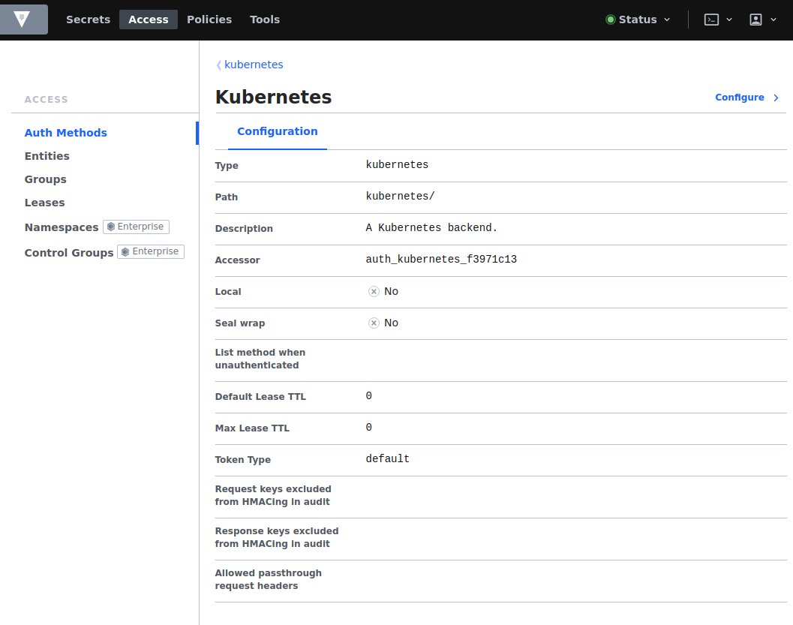
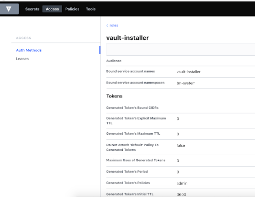

# Configuring HashiCorp Vault secrets manager

Bank-hosted

HashiCorp Vault provides a secure way of storing, retrieving, and managing secrets. During Vault Core installation, the Crown Operator generates and stores secrets and pushes these, along with their required policies and roles, to HashiCorp Vault - which Vault Core services then retrieve.

The Crown Operator uses a Kubernetes service account *vault-installer*. You need to configure the Kubernetes authentication backend in HashiCorp Vault to bind the vault-installer service account to a role with permissions to push secrets, policies and roles. This gives the Crown Operator the ability to create and update HashiCorp Vault policies and roles, and ensures it has the permissions to push these.

chat\_bubble

Thought Machine recommends deploying HashiCorp Vault on a separate node pool from standard workloads or a separate Kubernetes cluster. This is in order to reduce the probability of cyberattacks which could occur on shared worker nodes.

## Prerequisites

To enable HashiCorp Vault for use with Vault Core, you must first have the following enabled in your Kubernetes cluster:

-   [A KV version 1 or version 2 secrets backend](https://developer.hashicorp.com/vault/docs/secrets/kv): used to store secrets required by Vault Core services. The default is KV version 1, unless otherwise specified in the `values.yaml` file.
    
-   [Kubernetes authentication method](https://developer.hashicorp.com/vault/docs/auth/kubernetes): used by Kubernetes pods to authenticate with HashiCorp Vault and fetch required secrets.
    
-   A public key infrastructure (PKI) backend: used to sign client certificates. Optional.
    

For more information, see [Configuring a secrets manager](/vault-core/5-9/EN/environment_and_installation/infrastructure_docs/vault_cloud_infrastructure/configuring_a_secrets_manager_in_vault).

The Vault Core release package includes an example HashiCorp Vault policy file `vault-installer-hashicorp-vault-policy.hcl`, which defines the permissions and roles for the vault-installer service account. It binds vault-installer to a role in HashiCorp Vault, enabling the service account to push secrets, policies, and roles for Vault Core services during installation.

info

For HashiCorp Vault setup on Kubernetes, ensure you are using versions that are compatible with each other and are suitable for the version of Vault Core you are planning to install or upgrade to. For example, HashiCorp Vault 1.9 and Kubernetes 1.21 require you to provide a long-lived token as part of the JSON web token (JWT) token reviewer setup.

Refer to the [HashiCorp Vault documentation](https://developer.hashicorp.com/vault/docs/auth/kubernetes) for Kubernetes compatibility and further details. For information about Vault Core’s compatibility with third-party components, see the [Certified Environment Matrix](/vault-core/5-9/EN/environment_and_installation/installationupgrade_and_version_compatibility#certified_environment_matrix_for_vault).

## On-cluster deployment

[StatefulSets](https://kubernetes.io/docs/concepts/workloads/controllers/statefulset/) are used for on-cluster deployments of HashiCorp Vault and deployed in a highly-available configuration across multiple availability zones. You must choose a storage backend, depending on the cloud provider.

## Set up Kubernetes auth method

Once you have set up the [Kubernetes cluster](/vault-core/5-9/EN/environment_and_installation/infrastructure_docs/vault_cloud_infrastructure/configuring_kubernetes_in_vault) (refer to your chosen provider’s documentation), you can configure the authentication method. This allows the Kubernetes pods to authenticate with HashiCorp Vault and fetch the secrets required by Vault Core services. See the [Kubernetes auth method documentation](https://www.vaultproject.io/docs/auth/kubernetes.html) for further details.

To first create a secret, follow the relevant instructions in the [Kubernetes documentation](https://kubernetes.io/docs/tasks/configure-pod-container/configure-service-account/#manually-create-a-service-account-api-token). Ensure that the Kubernetes service account for HashiCorp Vault has the `system:auth-delegator` [ClusterRole](https://kubernetes.io/docs/reference/access-authn-authz/rbac/#role-and-clusterrole), or a ClusterRole that has token review permissions. This gives HashiCorp Vault the necessary permissions to validate the Kubernetes JWTs that pods use for authentication.

warning

The following commands are an example only - you should **not** run them in a production environment. In production environments, you must set up the Kubernetes backend for HashiCorp Vault according to your organisation’s processes and best practices.

1.  Enable and set up the Kubernetes auth backend. You need the Kubernetes API master host and the Kubernetes CA certificate. If you want to fetch the service account token manually, it is automatically created as a secret in the "vault-installer" namespace as soon as the service account is created.
    
    Run the following commands to set up the Kubernetes backend, or use the HashiCorp Vault web interface:
    
    After you have enabled the authentication backend, a configuration is displayed like the following example (or similar):
    
    
    
2.  Add a role for the vault-installer service account and the respective policies to associate the role with the service account. The `vault-installer-hashicorp-vault-policy.hcl` policy file must be associated with the vault-installer role.
    
    
    
3.  Test that the vault-installer service account can authenticate correctly with the HashiCorp Vault instance by running the following command:
    
    The example output displays the following token information, which is stored in the token helper:
    
     
    | Key | Value |
    | --- | --- |
    | 
    `token`
    
     | 
    
    <token>
    
     |
    | 
    
    `token_accessor`
    
     | 
    
    <accessor>
    
     |
    | 
    
    `token_renewable`
    
     | 
    
    `true`
    
     |
    | 
    
    `token_policies`
    
     | 
    
    `["default" "vault-installer"]`
    
     |
    | 
    
    `identity_policies`
    
     | 
    
    `[]`
    
     |
    | 
    
    `policies`
    
     | 
    
    `["default" "vault-installer"]`
    
     |
    

chat\_bubble

The token policies of the token you get must include the *vault-installer* policy created in step 2.

## Provide required secrets

chat\_bubble

This is a mandatory step for [installing Vault Core](/vault-core/5-9/EN/environment_and_installation/infrastructure_docs/tmcomponent_operator_user_guide/installing_or_upgrading_vault).

As part of installing Vault Core, you must provide the [database admin user](/vault-core/5-9/EN/environment_and_installation/infrastructure_docs/vault_cloud_infrastructure/using_a_relational_database#installing_vault_with_a_database_admin_user) (or root user) password to the HashiCorp Vault secrets manager.

Using the HashiCorp Vault web user interface, install the database admin user password in a secret called `root-db-secrets`, with the database host name as the key and the password as the value. This should be underneath the HashiCorp Vault path used for storing secrets for the Vault Core instance.

If the Vault Core installation spreads the databases across more than one host, include an entry in `root-db-secrets` for each host.

chat\_bubble

-   The database host must be an endpoint accessible to the Vault Core cluster.
    
-   The content of the database password must be URL safe, otherwise a database connection error will occur during Vault Core installation.
    

You may also need to provision additional secrets before the deployment, depending on which components of Vault Core are deployed. Details of any additional credential requirements will be provided before the installation.