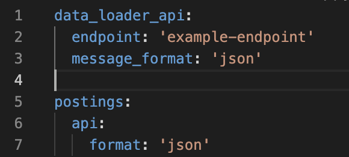
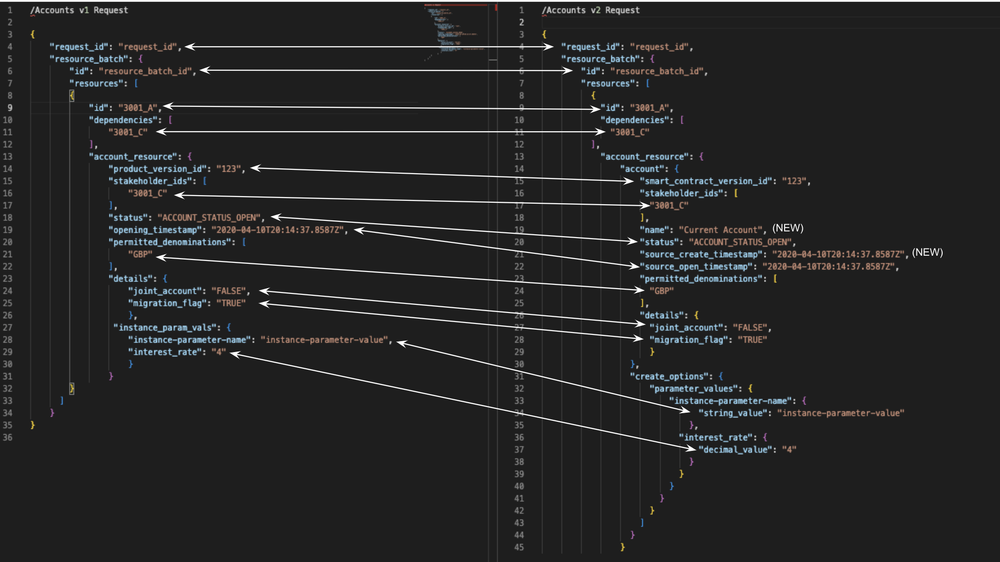

# Introduction to the Migration APIs

## What are the migration APIs?

error

Do not use the Posting Migration API unless specifically directed by a Thought Machine representative. It is known to be unreliable under specific usage patterns.

Vault Core supports the migration of back-book data from legacy client systems via two APIs:

-   **Data Loader API** (used to migrate majority of data to Vault Core except Postings)
    
    -   [Guidance](/vault-core/5-9/EN/environment_and_installation/migrating_to_vault/migrating_using_the_data_loader_api)
        
    -   [API specifications](/vault-core/5-9/EN/api/data_loader_api/)
        
    
-   **BAU Postings API** (alternative means of migrating Postings)
    
    -   [Guidance](/vault-core/5-9/EN/environment_and_installation/migrating_to_vault/migrating_using_the_postings_migration_api)
        
    -   [API specifications](/vault-core/5-9/EN/api/postings_api#synchronous_postings_api)
        
    

*Please note there is also the Postings Migration API as well, but in line with the guidance above this must not be used at this time.*

* * *

### What is the Data Loader API?

The Data Loader API is Thought Machine’s strategic solution for migration of your existing core data into an instance of Vault Core.

It has been designed to work optimally within a data migration context and provides a variety of benefits over Vault Core’s BAU APIs:

-   Migration-specific field validation and logic that better supports migration scenarios
    
-   Relaxation of asynchronous validations that are not relevant in a migration context
    
-   Performance improvements over equivalent BAU journeys
    
-   Sequencing of loads based on configurable Dependencies so that data can be sent in any order
    
-   Additional streamed events that support simple post-load data reconciliations
    

The Data Loader supports all Vault Core resources that have been determined to potentially require a migration, with the exception of Postings as outlined below.

* * *

### What is the BAU Postings API?

In BAU there are two methods for creating Postings:

-   [asynchronous (Kafka) Postings API](/vault-core/5-9/EN/api/postings_api#asynchronous_postings_api)
    
-   [synchronous (REST) Postings API](/vault-core/5-9/EN/api/postings_api#synchronous_postings_api)
    

In the context of migrations we refer to the asynchronous (Kafka) Postings API as the 'BAU Postings API' to more clearly distinguish it from the Postings Migration API. It is never appropriate to use a REST API to execute a high volume production migration.

Postings that are submitted via the BAU Postings API, without intervention, go through all [postings validation checks](/vault-core/5-9/EN/reference/postings#postings_checks). As a result some additional effort is required to enable this API to correctly support migration use cases.

Though the Posting Migration API was developed to support the migration of Postings to Vault Core, it is also possible to execute a migration using the BAU Postings API.

There are pros and cons of each API with respect to what they allow you to do and their ease of use, and which API is most suitable for your use case will depend on your migration strategy and BAU requirements.

For more information on the differences between the APIs that can inform the decision of which to use in your migration please see [here](/vault-core/5-9/EN/environment_and_installation/migrating_to_vault/migrating_using_the_postings_migration_api#choosing_between_the_posting_apis).

* * *

### What is the Posting Migration API?

error

Do not use the Posting Migration API unless specifically directed by a Thought Machine representative. It is known to be unreliable under specific usage patterns.

The Posting Migration API is a request topic on the Postings API which is designed for migration of Postings from your existing banking platform into Vault Core. It is a Kafka-based API that uses an asynchronous request-response model.

The Posting Migration API has been designed with migration use cases in mind, and benefits from the following improvements over the equivalent BAU journey:

-   Migration-specific field validation and logic that better supports migration scenarios
    
-   Relaxation of posting processor validation steps that are not relevant in a migration context (such as Smart Contract execution)
    
-   Performance improvements over equivalent BAU journeys
    
-   Allows migrated postings to use a separate topic to BAU postings traffic
    
-   Can set a historic insertion\_timestamp and use this in downstream Vault Core functions
    

The Posting Migration API request topic provides the same interface as the BAU Posting API request topic, accepting messages in the format of [CreatePostingInstructionBatchRequest](/vault-core/5-9/EN/api/core_api#posting_instruction_batches).

Though the Posting Migration API was developed to support the migration of Postings to Vault Core, it is also possible to execute a migration using the BAU Postings API.

There are pros and cons of each API with respect to what they allow you to do and their ease of use, and which API is most suitable for your use case will depend on your migration strategy and BAU requirements.

For more information on the differences between the APIs that can inform the decision of which to use in your migration please see [here](/vault-core/5-9/EN/environment_and_installation/migrating_to_vault/migrating_using_the_postings_migration_api#choosing_between_the_posting_apis).

## Migration considerations when designing BAU target state

Decisions made when designing the BAU target state (both technical architecture and Smart Contracts) will have a corresponding impact on the migration design for that product.

Because migration inherits the decisions made for BAU in this manner it is important to consider migration from the outset make rather than hitting issues later down the line when migration is brought into scope.

Considerations include (but are not limited to):

-   Whether changes are required to Smart Contracts to achieve the correct behaviour for migrated Accounts, which is covered in detail within the Vault Delivery Framework section on [Product vs migration gap analysis](/delivery-framework/latest/EN/delivery_workstream/migration/smart_contract_migration_build_and_test).
    
-   Whether the technical architecture of the target IT estate embraces co-existence (a multi-core state) and thus enables, or otherwise, a phased migration strategy, which is covered in detail within the Vault Delivery Framework section on [co-existence design](/delivery-framework/latest/EN/delivery_workstream/architecture/coexistence_design).
    
-   Smart Contracts must use Contract Language v4 to migrate Accounts onto Vault v5.0+.
    

## Installing the migration APIs & migration infrastructure considerations

This section covers the deployment & installation considerations relating to Vault’s migration APIs as well as recommendations on provisioning infrastructure for your migration.

* * *

### SaaS Installation

For Software as a Service clients, please contact Thought Machine before you plan to execute migration tests so that we can discuss your requirements and ensure the necessary deployment steps have been taken on your environments, including deploying the Migration component and [selecting the API message formats](/vault-core/5-9/EN/environment_and_installation/migrating_to_vault/intro#selecting_json_versus_proto_api_formats).

* * *

### Bank-hosted Installation

To utilise Vault Core’s migration capabilities you should use the Operator Installer to install the `Migration` component, which includes all Data Loader and Posting Migration packages.

Deploying this component will also create the migration consumer / producer Kafka topics, though your Dev Ops team may need to assist with:

-   Generating an access token with Data Loader REST API permissions (these are different to the Core API permissions).
    
-   Registering the Data Loader URL (which is different to the Core API URL) to a domain for REST API queries.
    
-   [Selecting API message formats](/vault-core/5-9/EN/environment_and_installation/migrating_to_vault/intro#selecting_json_versus_proto_api_formats).
    

See [Installing Vault Core](/vault-core/5-9/EN/environment_and_installation/infrastructure_docs/tmcomponent_operator_user_guide) for guidance on installing Vault components using the `operator-install` method.

If you need assistance in installing Vault Core’s `Migration` component then please reach out to your assigned Thought Machine representative.

* * *

### Selecting JSON versus Proto API formats

Regardless of your hosting method, it is important to consider that during the `Migration` component installation a message format is selected for the [Data Loader API](/vault-core/5-9/EN/api/data_loader_api/) and [Posting Migration API / BAU Postings API](/vault-core/5-9/EN/api/postings_api#posting_migration_api).

This is set within the `values.yaml` file, and has independent values as follows:

-   `postings.api.format` ([Posting Migration API](/vault-core/5-9/EN/api/postings_api#posting_migration_api) & [BAU Postings API](/vault-core/5-9/EN/api/postings_api#using_the_asynchronous_api) request and response messages).
    
-   `common_stream_api.message_format` ([Core API](/vault-core/5-9/EN/api/core_api#core_streaming_api) streamed events. This includes the `PostingInstructionBatchCreatedEvent`, `AccountBalanceEvent` and `BalanceEvent`, as though these are Posting related they are streamed via the Core API).
    
-   `data_loader_api.message_format` ([Data Loader API](/vault-core/5-9/EN/api/data_loader_api/) request and all streamed Data Loader events).
    

The options are:

-   Set to `proto` for Postings API or `protobuf` for Common Streaming API & Data Loader API (this is the default format if not specified).
    
-   Set to `json` (recommended for ease of ETL integrations and incident triage).
    

An example configuration for an environment where the Data Loader API and Postings API formats are set to `json`:

Though it is possible to select different message formats across these APIs, Thought Machine does not recommend this, because it means your ETL tooling will need to handle both message formats and risks confusing and slowing down incident triage.

chat\_bubble

If you are a SaaS customer, you should discuss the preferred format with your Thought Machine representative during environment setup. You should also make sure that you have set the correct format (most likely JSON) in your Vault Core SaaS Client Environment Request Form.

* * *

### Migration infrastructure recommendations

error

The following performance guidance is based on our experience migrating previous clients and on a best effort basis. Every migration is different and it is important to allow adequate time to optimise performance of your migration. We recommend contacting your Thought Machine representative for further guidance.

It is common for Vault Core environments and related infrastructure to be sized and provisioned based solely on BAU run requirements.

Migrations are often a short sharp increase in load on Vault Core that goes well above and beyond BAU run requirements. Therefore, when carrying out a migration, you must work with your Thought Machine representative to ensure your setup is sized in line with your single largest migration event.

There are a number of things related to your infrastructure that can affect migrations, such as your database size, deployment size, and more. Common changes include:

-   Increasing environment specs (such as deployment size) to increase load speed
    
-   Pinning MinReplicas for key Data Loader / Posting components to reduce inefficiency / retries due to scaling at the start of the load
    
-   Bespoke config changes to Vault Core services due to nuances of migration scope
    

When sizing and configuring your infrastructure in preparation for migration, you should consider:

-   Using the Vault Core [performance report](/vault-core/5-9/EN/vault_release_information/performance_and_testing#performance_report) as a starting point to size your migration environment appropriately.
    
    -   Make sure to set the [database settings](/vault-core/5-9/EN/environment_and_installation/infrastructure_docs/vault_cloud_infrastructure/using_a_relational_database/) as per those listed in the AWS / GCP performance reports. For example, set `max_locks_per_transaction` to `2048`.
        
    
-   Determining your broad non-functional requirements. For example, the window or length of time required to send the load to Vault Core in your largest migration event. If an extended period of time is not an issue (for example, 12+ hours) then you do not need the same set up as a bank that needs to migrate the same load in less than three hours.
    
    -   An example: within the AWS database family, the client started with R6g because they had determined this would be their BAU need. But due to their limited window for carrying out the migration, they moved to R7i for the purposes of their large migration.
        
    
-   How the timings and volumes of each phase of your migration can influence how and when you need to provision your environments. For example, if you have a two phase migration - one with less than 5000 accounts and a second one with 5,000,000 accounts - you would likely not need to provision the top specification infrastructure for the first phase.
    

Due to the number of considerations to make, every bank migration is different. With our experience supporting previous clients in their migrations, we have extensive knowledge and can provide guidance and advice based on your specific plans and schedule of events, including changes to infrastructure to boost performance during migration events.

* * *

### Uninstalling the migration components

As the migration APIs allow manipulation of certain data fields that are not possible in BAU (e.g. creating CLOSED accounts, bypassing Smart Contract hooks, etc.) that can have direct financial effects on you and your customers, we advise that you:

-   Only deploy migration packages where necessary to enable legacy to Vault Core data migrations.
    
-   Implement access controls and guidance around the use of migration APIs.
    
-   Undertake ongoing assessment of the requirement for migration packages to remain deployed (or else removed), balancing the risks outlined above against the:
    
    -   Ongoing use and value of the packages being deployed for upcoming migrations; and
        
    -   Nature of the environment they are deployed on and any specific security risks these pose (higher risk in production environments).
        
    

## Summary of migration changes in Vault Core 5

info

This section was created to support the release of Vault Core v5. The main [Migrating data to Vault](/vault-core/5-9/EN/environment_and_installation/migrating_to_vault) pages have been updated to reflect the migration process for Vault Core 5 and beyond and is now the primary source of migration information, including how to use Vault’s migration APIs and how to execute a migration programme more generally. This section has been retained for archival purposes only, where a comparison to Vault Core v4 behaviour is required.

If you are familiar with migrations on Vault Core 4 and are intending to upgrade and migrate on Vault Core 5, it is strongly recommended that you take the time to re-review the full end-to-end guidance linked above for a complete picture of the migration process on Vault Core 5.

### Vault Core 5 Data Loader API Changes

#### General changes

##### Requirement to be on CLv4 to migrate Accounts via the Data Loader API

From Vault Core 5 onward, you must use [Smart Contract CLv4 to migrate Accounts via the Data Loader API](/vault-core/5-9/EN/environment_and_installation/migrating_to_vault/intro#must_be_on_contract_language_v4_to_migrate_accounts_onto_vault_v5_0). Attempting to migrate Account Resources into Vault Core 5 that is backed by a CLv3 Smart Contract will not work.

##### Rejection of Resource Batches containing reused resource ids that were previously LOADED

Resource Batches will now fail Data Loader validation and result in a REJECTED\_RESOURCE\_DUPLICATE status if they contain at least one Resource that has reused a `resource_id` that has previously successfully migrated using the [Data Loader API](/vault-core/5-9/EN/api/data_loader_api/) and ended in a LOADED state.

`resource_id` remains a globally unique ID across any Resource supported by the Data Loader. This behaviour only applies to reuse of `resource_id` where the Resource was originally in LOADED status via the Data Loader API. The error message lists all Resources that fail this check, making it easier to identify and handle accidental reuse of a `resource_id` that has already been LOADED.

#### Field-level changes

##### Data Loader support for ParameterValues Resource

The Data Loader API now supports the migration of data into the new [ParameterValues](/vault-core/5-9/EN/api/core_api#parametervalue) Resource. For the first time, this enables the migration of historic parameters (in addition to any current or active parameters loaded during Account creation). Any Smart Contract operations that rely on a parameter timeseries now have access to the necessary historic data.

Download the [Vault Core Migrations - Data Dictionary](/vault-core/5-9/EN/resources/migrations-data-dictionary.zip) for detailed descriptions of the ParameterValues fields and behaviour.

##### Data Loader support for Accounts v2 and removal of support for Accounts v1

The Data Loader API now supports request messages in the format of Accounts v2 (specifically the `CreateAccountRequest` proto) instead of Accounts v1, which has been deprecated.

Download the [Vault Core Migrations - Data Dictionary](/vault-core/5-9/EN/resources/migrations-data-dictionary.zip) for detailed descriptions of the Accounts v2 fields.

The summary changes are as follows:

-   REQUEST: `product_version_id` has been renamed to `smart_contract_version_id`. Functional behaviour is unchanged.
    
-   REQUEST: `product_id` has been removed from the request message meaning that Accounts can no longer be associated with a Smart Contract ID on creation and must always be associated with a Smart Contract Version (`smart_contract_version_id`) instead. Setting `product_id` previously would have fetched the latest Smart Contract version.
    
-   REQUEST: `alias` can now be passed in the request, where previously the similar `name` field was output only and set to the name provided on the Smart Contract version.
    
-   REQUEST: New `source_create_timestamp` field enables historic Account creation dates to be migrated. This is in addition to historic opening timestamps which continue to be supported as they were in Accounts v1, and allows for better separation of these concepts where the legacy core captures this.
    
-   REQUEST: `instance_param_vals` object replaced with `create_options` object, altering the field structure used to migrate parameters but retaining the same functional behaviour as Accounts v1 when migrating parameters that are defined in the Smart Contract.
    
-   STREAMED EVENTS: Backwards compatible Accounts v1 events (`AccountCreated`, `AccountUpdateCreated`, `AccountUpdateUpdated`) continue to be streamed when migrating Accounts via the Data Loader API using Accounts v2, in addition to new Accounts v2 streamed events. See [Data Loader API resource-specific guidance](/vault-core/5-9/EN/environment_and_installation/migrating_to_vault/migrating_using_the_data_loader_api#data_loader_api_resource_specific_guidance) for an example Accounts v1 backwards compatible `AccountCreated` message.
    
-   STREAMED EVENTS: The activation hook will run as of now, rather than the provided legacy account opening date. This sets the `activation_time` field and the `effective_datetime` of the activation hook to the time that the hook executed in Vault Core. The `effective_from_timestamp` of any Parameters included in the Account request will also be set to this same time. You should discuss this behaviour with the team building your Smart Contract and ensure that the setting of any of these fields to a date in the past is suitable based on your use of these fields within the Smart Contract.
    
-   STREAMED EVENTS: `tside` has been renamed to `t_side`. Functional behaviour is unchanged.
    
-   EXAMPLE REQUEST: Below is an example of the same request using both Accounts v1 (Vault Core 4.6 and below) and Accounts v2 (Vault Core 5 onwards) formats:
    

### Vault Core 5 Posting Migration API Changes

#### Posting Migration API lifecycle changes

##### [Posting Migration API](/vault-core/5-9/EN/api/postings_api#posting_migration_api) supports migration of a historic insertion balance timeseries

Vault Core 5 changed the way that Vault calculates Balances internally, introducing a requirement for Postings to be inserted into the Vault Core database in chronological order of insertion time. These migrated Postings with their historic insertion timestamps must also be ordered in the same way.

This is because a 'migration buffer' step has been introduced in the Posting Migration API validation steps. Similar to the Data Loader’s dependency concept, it allows clients to send Posting Instruction Batches (PIBs) to Vault Core in any order since Vault will orchestrate the sequencing and respect the requirement to order by insertion time. Migration of historic insertion timestamps enables the recreation of the historic insertion balance timeseries in post-migration.

For more information, see [Posting APIs validation](/vault-core/5-9/EN/environment_and_installation/migrating_to_vault/migrating_using_the_postings_migration_api#posting_apis_validation).

##### Support for Authorised Postings via the Posting Migration API

The Posting Migration API now supports [InboundAuthorisation](/vault-core/5-9/EN/reference/contracts/contracts_api_4xx/common_types_4xx/classes#inboundauthorisation), [OutboundAuthorisation](/vault-core/5-9/EN/reference/contracts/contracts_api_4xx/common_types_4xx/classes#outboundauthorisation), [Settlement](/vault-core/5-9/EN/reference/contracts/contracts_api_4xx/common_types_4xx/classes#settlement), [Release](/vault-core/5-9/EN/reference/contracts/contracts_api_4xx/common_types_4xx/classes#release), and [AuthorisationAdjustment](/vault-core/5-9/EN/reference/contracts/contracts_api_4xx/common_types_4xx/classes#authorisationadjustment) Posting Instruction types in addition to [InboundHardSettlement](/vault-core/5-9/EN/reference/contracts/contracts_api_4xx/common_types_4xx/classes#inboundhardsettlement), [OutboundHardSettlement](/vault-core/5-9/EN/reference/contracts/contracts_api_4xx/common_types_4xx/classes#outboundhardsettlement), and [CustomInstruction](/vault-core/5-9/EN/reference/contracts/contracts_api_4xx/common_types_4xx/classes#custominstruction). This removes the requirement to integrate with and utilise the BAU Posting API to migrate Authorisations, and the associated trade-offs/additional effort this resulted in.

For more information, see [Migrating Authorisations using the Posting APIs](/vault-core/5-9/EN/environment_and_installation/migrating_to_vault/migrating_using_the_postings_migration_api#migrating_authorisations_using_the_posting_apis).

##### Prevent use of BAU Posting API via the Posting Migration API prior to migration

An Account can no longer accept any BAU Postings (either externally or internally generated) until all migrated Postings have finished being loaded using the Posting Migration API and the Account is 'cut over' to live. The first BAU Posting for an Account will preclude the future use of the Posting Migration API. This includes Postings created as a result of Account Activation.

For more information, see [Preventing BAU Postings prior to migration completing](/vault-core/5-9/EN/environment_and_installation/migrating_to_vault/migrating_using_the_postings_migration_api#preventing_bau_postings_prior_to_migration_completing).

##### New package included in 'Migration' component

The package needed to execute posting migrations has changed. A reinstall of the `Migration` component is therefore required when moving to Vault Core 5.

For more information, see [Bank-hosted](/vault-core/5-9/EN/environment_and_installation/migrating_to_vault/intro#bank_hosted) migration.

##### Support for Ledger Balances API

Postings migrated using the Posting Migration API will now be counted in Ledger Balance API calls. If this API / concept is being utilised post-migration this is important for ensuring accuracy of results.

For more information, see considerations for [Migrating Ledger Balances using the Posting APIs](/vault-core/5-9/EN/environment_and_installation/migrating_to_vault/migrating_using_the_postings_migration_api#migrating_ledger_balances_using_the_posting_apis).

#### PIB validation changes

##### Each migrated PIB must contain Posting Instructions for a single Customer Account only

Each PIB must only ever contain Posting Instructions (PIs) that relate to a single Customer Account. This is because each PIB needs to be sequenced per account in chronological order of `source_insertion_timestamp`, and this would not be possible if a PIB impacted more than one Customer Account.

Although we would never expect a requirement to migrate a single PIB impacting more than one Customer Account, where this is the case the message must be split into and migrated as multiple PIBs. This also extends to:

-   Custom Instructions where you cannot migrate a Custom Instruction between Customer Accounts.
    
-   `payment_device_token` which is not supported as a `target_account` type when migrating.
    

##### Dedicated Posting Migration API DLQ Topic

There is now a dedicated migration request DLQ topic, `vault.migrations.postings.requests.dlq`. Previously, migration shared the BAU DLQ topic (`vault.core.postings.requests.dlq.v1`). This enables simpler segregation between migration and BAU DLQs and faster response to load errors. You must update any integrations to monitor this new DLQ topic.

For more information, see [Posting APIs topics and events](/vault-core/5-9/EN/environment_and_installation/migrating_to_vault/migrating_using_the_postings_migration_api#posting_apis_topics_and_events).

##### Dedicated Posting Migration API Response Topic

The Posting Migration API now has its own dedicated [Posting Response topic](/vault-core/5-9/EN/environment_and_installation/migrating_to_vault/migrating_using_the_postings_migration_api#posting_apis_topics_and_events). Every single request passed to the Posting Migration API Request topic (that does not DLQ) now receives streamed events.

Previously, the Posting Response topic was determined based on the client\_id passed in the PIB and whichever Response topic was registered for this client\_id. The behaviour of Response topics for BAU Postings is unchanged.

For more information, see [Posting APIs topics and events](/vault-core/5-9/EN/environment_and_installation/migrating_to_vault/migrating_using_the_postings_migration_api#posting_apis_topics_and_events).

##### client\_id no longer used for idempotency

Previously, a combination of `client_id` and `request_id` was used for PIB idempotency checks, now it is only the `request_id`.

For more information, see [Posting APIs idempotency](/vault-core/5-9/EN/environment_and_installation/migrating_to_vault/migrating_using_the_postings_migration_api#posting_apis_idempotency).

##### Maximum of 5 Posting Instructions per PIB

For performance reasons, there is now a limit of 5 Posting Instructions per PIB when using the Posting Migration API. Guidance was, and remains, to only have 1 PI per PIB for migration regardless of this new maximum upper limit. This restriction does not apply to the BAU Postings API.

##### Maximum of 64 Postings per Posting Instruction (relevant for Custom Instruction only)

For performance reasons, there is now a limit of 64 Postings per Posting Instruction (in other words, 32 pairs of credits and debits) when using the Posting Migration API. This restriction also applies to the BAU Postings API.

#### Monitoring and error handling changes

##### REJECTED PIBs will no longer be stored in the Vault Core DB or stream PIBCreatedEvents

When using the Posting Migration API, Rejections are now treated consistently with errors and are not committed to the Vault Core database or streamed on `PostingInstructionBatchCreated` events

Rejected Postings in BAU represent a business failure resulting from the Posting, Contract, Restriction, or Account. Rejections will always be an issue that requires remediation and re-submission therefore should not be committed to the database for migration. You should never need to migrate a 'valid' Rejection. There is no change to BAU Posting behaviour.

For more information, see [Posting APIs monitoring recommendations](/vault-core/5-9/EN/environment_and_installation/migrating_to_vault/migrating_using_the_postings_migration_api#posting_apis_monitoring_and_error_handling).

#### Field-level changes

Download the [Vault Core Migrations - Data Dictionary](/vault-core/5-9/EN/resources/migrations-data-dictionary.zip) for detailed descriptions of the request message structure for Postings in Vault Core 5.