# Migrating using the Posting APIs

## Posting APIs introduction

* * *

### About the Posting APIs

error

Do not use the Posting Migration API unless specifically directed by a Thought Machine representative. It is known to be unreliable under specific usage patterns.

Throughout the Migrating to Vault Core documentation we refer to two 'Posting APIs' for creating Postings in Vault Core:

-   **Posting Migration API** refers to Postings submitted on the request topic `vault.migrations.postings.requests`
    
-   **BAU Postings API** refers to Postings submitted on the request topic `vault.core.postings.requests.v1` or `vault.core.postings.requests.low_priority.v1`
    

Both are Kafka-based APIs that use an asynchronous request-response model. Do NOT execute a migration using the BAU Sync REST Postings API.

Though the Posting Migration API was developed to support the migration of Postings to Vault Core, it is also possible to execute a migration using the BAU Postings API.

There are pros and cons of each API with respect to what they allow you to do and their ease of use, and which API is most suitable for your use case will depend on your migration strategy and BAU requirements.

For more information on the differences between the APIs that can inform the decision of which to use in your migration please see [here](/vault-core/5-9/EN/environment_and_installation/migrating_to_vault/migrating_using_the_postings_migration_api#choosing_between_the_posting_apis).

lightbulb

Throughout the 'Migrating Using the Posting APIs' content we have signposted whether the guidance relates to one or both APIs using coloured banners:

-   Blue banners signify shared behaviour that is common across both APIs.
    
-   Red banners signify behaviour that is specific to either the Postings Migration API or the BAU Postings API.
    

* * *

### Choosing between the Posting APIs

error

Do not use the Posting Migration API unless specifically directed by a Thought Machine representative. It is known to be unreliable under specific usage patterns.

At the outset of your migration programme you must decide which Posting API you will use to execute your migration.

Each API has its own benefits and trade-offs vs the other, so it is **very** important that you read and understand the differences below in detail.

We recommend that you reach out to Thought Machine to discuss this decision if you are not already engaged with us on migration delivery, so that we can help you make the right choice for your programme.

#### Summary

Notwithstanding the above, broadly speaking the left/right decision here can be summarised as follows:

-   **BAU Postings API**
    
    -   This API is commonly used in migrations that are only migrating a balance position, or where the preservation of historic `source_insert_timestamp` from the legacy core is not required.
        
    -   Clients that have migrated using this API tend to have relatively simple scope and are willing to accept the trade-offs of using the BAU Postings API to have a simpler migration process.
        
    -   As at this release, this is the API that Thought Machine recommends using for migrations wherever possible.
        
    
-   **Posting Migration API**
    
    -   This API is for migrations that have a clear use case for the preservation of historic `source_insert_timestamp` from the legacy core, and the features / opportunities this unlocks.
        
    -   By definition these are migrations where preserving large amounts of historic Postings are necessary to fulfil the post-migration use cases.
        
    -   Clients that have migrated using this API need to do so as using the BAU API is simply not an option, and accept the trade-offs this brings accordingly.
        
    

chat\_bubble

*Table Key*:

✅ - Behaviour is net positive and a benefit of using this API vs the other.

❌ - Behaviour is net negative and a trade-off of using this API vs the other.

Impact Ratings - Thought Machine’s view on the potential impact of absorbing this trade-off into your migration delivery programme. The actual impact on your programme will depend entirely on your Vault Core use case and this is just an indication that must be validated on a case by case basis.

**Impact: Low** - Potential for small changes to ETL tooling or Smart Contract design.

**Impact: Medium** - Potential for moderate changes to ETL tooling or Smart Contract design.

**Impact: High** - Potential for significant changes to migration strategy and / or event approach.

#### BAU API Benefit & Migration API Trade-Off

Below are differences between the Posting APIs that are net beneficial for the BAU Postings API and are trade-offs of using the Posting Migration API.

    
| Theme | BAU Postings API | Posting Migration API | ‘So what?’ if migrating using BAU Postings API | ‘So what?’ if migrating using Posting Migration API |
| --- | --- | --- | --- | --- |
| 
Vault Core Features

 | 

✅  
Can load future dated postings (`value_timestamp` and `booking_timestamp`).

 | 

❌  
**Impact: Medium**  
Cannot load future dated postings (`value_timestamp` and `booking_timestamp`).

 | 

Future value / booking dated postings can be migrated using the same API as other Postings. This is supported from Vault Core release 5.5 onwards.

 | 

As the only way to migrate future dated postings to Vault Core is using the BAU Postings API, if you are using the Posting Migration API for other Postings you must migrate future dated postings last using the BAU Postings API after all other Postings.  

This means that the migration event needs to be orchestrated carefully, taking into consideration the limitations around making BAU Postings prior to migration completing.  

For more information see [here](/vault-core/5-9/EN/environment_and_installation/migrating_to_vault/migrating_using_the_postings_migration_api#preventing_bau_postings_when_using_the_posting_migration_api).

 |
| 

Vault Core Features

 | 

✅  
Can specify the balance `address` and `asset` at the Posting Instruction level on Hard Settlements and Authorisations.

 | 

❌  
**Impact: Low**  
Cannot specify the balance `address` and `asset` at the Posting Instruction level on Hard Settlements and Authorisations.

 | 

Migrated Postings have access to the same `address` and `asset` behaviour as BAU Postings and can mimic these for the benefit of downstream event consumers / integrations.

 | 

Where Postings do need to target specific `address` and `asset` (e.g. to migrate an interest accrued position) a Custom Instruction PI type must be used as these cannot be specified on Hard Settlements and Authorisations.  

This means that downstream event consumers / integrations need to be able to handle the resulting event structure being a CI and not Hard Settlement or Authorisation, which may be different to equivalent events generated in the BAU state depending on PI types used.  

For more information see [Vault Core Migrations - Data Dictionary](/vault-core/5-9/EN/resources/migrations-data-dictionary.zip) (relevant field within the Posting Resource), and [here](/vault-core/5-9/EN/environment_and_installation/migrating_to_vault/migrating_using_the_postings_migration_api#posting_apis_supported_pi_types).

 |
| 

Vault Core Features

 | 

✅  
Can specify the `value_timestamp` and `booking_timestamp` at the Posting Instruction level in addition to the PIB level.

 | 

❌  
**Impact: Low**  
Cannot specify the `value_timestamp` and `booking_timestamp` at the Posting Instruction level (only PIB level).

 | 

Migrated Postings can batch together unrelated PIs in a single PIB, which is a more efficient (faster) means of loading Postings to Vault Core.  

This is supported from Vault Core release 5.5 onwards.  

Speak to Thought Machine for further advice on batching in the context of migrations.

 | 

Limits the batching opportunities, and resulting performance improvements, as `value_timestamp` and `booking_timestamp` must be uniform for all PIs in the batch.  

For more information see [Vault Core Migrations - Data Dictionary](/vault-core/5-9/EN/resources/migrations-data-dictionary.zip) (relevant field within the Posting Resource).

 |
| 

Request Message

 | 

✅  
Each PIB can contain Posting Instructions for multiple Internal Accounts.

 | 

❌  
**Impact: High**  
Each PIB must contain Posting Instructions for a single Internal Account only.

 | 

Flexibility in how Postings can be migrated to Vault Core and how the ETL tooling structures request messages for load ease / efficiency.

 | 

No migrated PIB can move money between more than one internal account or `internal_account_processing_label`, regardless of use of separate Posting Instructions or within a single Custom Instruction.  

This can negatively impact migration volumes and event strategy by forcing the splitting of migrated postings inefficiently into multiple PIBs, increasing total migration time.  

For more information see [here](/vault-core/5-9/EN/environment_and_installation/migrating_to_vault/migrating_using_the_postings_migration_api#posting_apis_hierarchy_and_ids).

 |
| 

Request Message

 | 

✅  
Each PIB can contain Posting Instructions for multiple Customer Accounts.

 | 

❌  
**Impact: Medium**  
Each PIB must contain Posting Instructions for a single Customer Account only.

 | 

Flexibility in how Postings can be migrated to Vault Core and how the ETL tooling structures request messages for load ease / efficiency..

 | 

A core principle of the Posting Migration API is that a PIB must only ever contain Posting Instructions that relate to a single Customer Account (this also extends to Custom Instructions PI type, where you cannot migrate a Custom Instruction between Customer Accounts).  

This is because each PIB needs to be sequenced per account in `source_insert_timestamp` order, and this would not be possible if a PIB impacted more than one Customer Account.  

Thought Machine expects the requirement for this functionality to be limited, but where this is the case the message must be split into and migrated as multiple PIBs, which can negatively impact migration volumes and event strategy by forcing the splitting of migrated postings inefficiently into multiple PIBs, increasing total migration time.  

For more information see [here](/vault-core/5-9/EN/environment_and_installation/migrating_to_vault/migrating_using_the_postings_migration_api#posting_apis_hierarchy_and_ids).

 |
| 

Request Message

 | 

✅  
No limit on the number of PIs per PIB. For guidance on managing PIB size, see [Postings APIs performance optimisation](/vault-core/5-9/EN/environment_and_installation/migrating_to_vault/migrating_using_the_postings_migration_api#posting_apis_performance_optimisation).

 | 

❌  
**Impact: Medium**  
Max of 5 PIs per PIB.

 | 

Flexibility in how Postings can be migrated to Vault Core and how the ETL tooling structures request messages for load ease / efficiency.

 | 

Adds a constraint on how you can structure PIBs, which where multiple balance address movements per migrated PIB are required can negatively impact migration volumes and event strategy by forcing the splitting of migrated postings inefficiently into multiple PIBs, increasing total migration time.  

For more information see [here](/vault-core/5-9/EN/environment_and_installation/migrating_to_vault/migrating_using_the_postings_migration_api#other_misc_2).

 |
| 

Request Message

 | 

✅  
`booking_timestamp` can be set to any date relative to `value_timestamp` at a Posting Instruction level or left null.

 | 

❌  
**Impact: Low**  
`booking_timestamp` must be greater than or equal to `value_timestamp`.

 | 

Allows future booking of Postings up to 90 days in future, which is related to Vault Core support for future dated postings from Vault Core release 5.5 onwards.

 | 

Must respect this limitation when migrating Postings to Vault Core.  

Linked to requirement for future dated postings and likely only impactful where these are in scope.  

For more information see [Vault Core Migrations - Data Dictionary](/vault-core/5-9/EN/resources/migrations-data-dictionary.zip) (relevant field within the Posting Resource).

 |
| 

Request Message

 | 

✅  
A Posting Instruction’s `target_account` can be either an `account_id` or a `payment_device_token`.

 | 

❌  
**Impact: Low**  
A Posting Instruction’s `target_account` can only be an `account_id`.

 | 

Allows the retention of historic \`payment\_device\_token\`s within migrated Postings, reflecting how such Postings would look when made in the BAU state.

 | 

Must respect this limitation when migrating Postings to Vault Core - can only migrate Postings against an `account_id`.  

Thought Machine does not anticipate a requirement to migrate Postings at the Payment Device level even if these are used in the BAU state, as the token is resolved to and applied against the `account_id` in any instance.  

For more information see [here](/vault-core/5-9/EN/environment_and_installation/migrating_to_vault/migrating_using_the_postings_migration_api#other_misc_2).

 |
| 

Request Message

 | 

✅  
Supports all Posting Instruction types.

 | 

❌  
**Impact: Low**  
Does not support the Transfer Posting Instruction type (supports all others).

 | 

All Posting Instruction types that are used in the BAU state can be used to migrate Postings to Vault Core.

 | 

The Posting Migration API supports all Posting Instruction Types except Transfer, because Transfers are intended to be used to move funds between two Customer Accounts, which is not supported by the Posting Migration API.  

However, the effect of transfers can still be migrated as two separate HardSettlement or Custom Instruction  
Postings.  

For more information see [here](/vault-core/5-9/EN/environment_and_installation/migrating_to_vault/migrating_using_the_postings_migration_api#posting_apis_supported_pi_types).

 |
| 

Topics & Events

 | 

✅  
The `EnrichedPostingInstructionBatchEvent` can be streamed if setup steps are taken.

 | 

❌  
**Impact: Low**  
The `EnrichedPostingInstructionBatchEvent` is never streamed.

 | 

The `EnrichedPostingInstructionBatchEvent` can be streamed for migrated Postings if it is set up correctly.

 | 

The Posting Migration API will never generate an `EnrichedPostingInstructionBatchEvent`.  

Thought Machine does not anticipate this to impact migrations as logically the additional EoD metadata fields present on this API are irrelevant for already processed historic Postings.  

Accordingly, it is very important that you do not build your BAU integrations to rely solely on the `EnrichedPostingInstructionBatchEvents` for this reason, as this should only be used as a source of the enriched booking related metadata and not a replacement for `PostingInstructionBatchCreatedEvent`.  

For more information see [here](/vault-core/5-9/EN/environment_and_installation/migrating_to_vault/migrating_using_the_postings_migration_api#topics).

 |
| 

Topics & Events

 | 

✅  
The `BalanceEvent` is streamed in response to using this API.

 | 

❌  
**Impact: Low**  
The `BalanceEvent` is never streamed.

 | 

The `BalanceEvent` which contains the `booking_timestamp` and consequently the booking balance timeseries (or at least a proportion of it) can be streamed from Vault Core.

 | 

The Posting Migration API will never generate an `BalanceEvent`.  

The absence of this event will only impact migrations if you have the concept of a booking timeseries and use the `booking_timestamp` in your legacy system and you intend to migrate and retain it downstream of Vault Core going forward.  

For more information, see [Timestamps introduced at Posting Instruction level](/vault-core/5-9/EN/vault_core_overview/financial_model#timestamps_introduced_at_posting_instruction_level).

 |
| 

Load Process

 | 

✅  
BAU API can continue being used to migrate Postings after true “BAU” Postings are received.

 | 

❌  
**Impact: High**  
Cannot use the Posting Migration API for an Account ever again once that Account has processed any Postings using the BAU Postings API (generated by either external or internal methods).

 | 

Not relevant as using the BAU Posting API to do both migrations and BAU - no requirement to carefully manage the ordering of activities between two APIs.

 | 

Once the first BAU Posting is loaded for an account this precludes the use of the Posting Migration API ever again for that Account.  

It is therefore important to consider how to guarantee that no BAU Postings are made before migration completes.  

This will include preventing Postings generated within Account Activation, stopping scheduled behaviour that generates Postings prior to cutover, and sequencing delta loads that need to occur using the BAU Postings API.  

For more information see [here](/vault-core/5-9/EN/environment_and_installation/migrating_to_vault/migrating_using_the_postings_migration_api#preventing_bau_postings_when_using_the_posting_migration_api).

 |
| 

Load Process

 | 

✅  
Postings can be sent in any `value_timestamp` order to Vault Core (`source_insert_timestamp` is set at the time of load to the Vault Core DB).

 | 

❌  
**Impact: Medium**  
Postings will be buffered unless sent in `source_insert_timestamp` order to Vault Core.

 | 

Simple migration event orchestration with no strict requirement to order Postings (though Thought Machine would still advise following the performance optimisation best practice [here](/vault-core/5-9/EN/environment_and_installation/migrating_to_vault/migrating_using_the_postings_migration_api#posting_apis_performance_optimisation)).

 | 

Not sending migrated Postings in `source_insert_timestamp` order is inefficient and will greatly increase the overall migration timeline as the requests will be buffered until earlier `account_sequence_number` are received.  

Using the migration buffer adds complexity to request message and error handling that needs to be factored into the migration design.  

For more information on performance optimisation best practice see [here](/vault-core/5-9/EN/environment_and_installation/migrating_to_vault/migrating_using_the_postings_migration_api#preventing_bau_postings_when_using_the_posting_migration_api).  

For more information on the buffer generally see [here](/vault-core/5-9/EN/environment_and_installation/migrating_to_vault/migrating_using_the_postings_migration_api#posting_apis_validation).

 |
| 

Deployment

 | 

✅  
Do not need to install additional optional components.

 | 

❌  
**Impact: Low**  
Need to install the additional optional `Migration` component.

 | 

Base Vault core installation will enable migration of Postings via the BAU Postings API.

 | 

The Posting Migration API will not work unless this additional component is deployed.  

If using the Data Loader API this component will also / already need to have been deployed.  

For more information see [here](/vault-core/5-9/EN/environment_and_installation/migrating_to_vault/intro#installing_the_migration_apis).

 |

#### Migration API Benefit & BAU API Trade-Off

Below are differences between the Posting APIs that are net beneficial for the Posting Migration API and are trade-offs of using the AU Postings API.

    
| Theme | BAU Postings API | Posting Migration API | ‘So what?’ if migrating using BAU Postings API | ‘So what?’ if migrating using Posting Migration API |
| --- | --- | --- | --- | --- |
| 
`source_insert_timestamp` Related Behaviours

 | 

❌  
**Impact: High**  
Cannot set the `source_insert_timestamp` in the PIB request. It is set automatically to time that the Posting is loaded to the Vault Core database. Note that the `source_insert_timestamp` is the name of the field on the request, which becomes `source_insertion_timestamp` on the Response and other streamed events.

 | 

✅  
Can set the `source_insert_timestamp` in the PIB request to a historic value retained from the legacy core.

 | 

Limitations to the following:  

\* *Downstream consumption of field*: The field cannot be set to a historic value, which may have an impact downstream if it has been relied upon for a business purpose (e.g. set as the transaction date that appears on statements). Handling of this will depend on the use case, but likely demand exceptional handling of migrated Postings using metadata.  

\* *REST API queries that use snapshotting*: Where REST API queries allow filtering by `snapshot_time` (i.e. based on insertion) this fetch will now result in a different outcome where Postings have been migrated by the Posting Migration API vs BAU Postings API based on the `source_insert_timestamp`. This includes at time of writing: LIST BalancesTimeRange (planned Q1 25 release).  

\* *Balance Fetching*: Balance fetches will be less efficient when fetching prior to the point of migration, as there are no milestones between the Definition Milestone and the point of migration.

 | 

\* *Downstream consumption of field*: The field is set consistently with BAU and can be relied upon downstream.  

\* *REST API queries that use snapshotting*: Snapshot queries priori to the point of migration will reflect migrated Postings.  

\* *Balance Fetching*: Fetching balances will be as efficient as it is in the BAU state, as historic balance milestones are generated during the Posting migration process based.

 |
| 

Request Message

 | 

❌  
**Impact: Low**  
From v5.5 Enriched Posting Information will stream depending on the logic of the pre-posting hook only, and cannot be directly instructed on the request.

 | 

✅  
From v5.5 you can instruct Enriched Posting Information on the request (pre-posting hook is always skipped).

 | 

The `enrichments` object cannot be populated as the pre/post posting hooks must always be skipped for migrated Accounts.  

Instead, this information must be captured in batch / instruction details and event consumers adapted accordingly where required.  

For more information see [here](/vault-core/5-9/EN/environment_and_installation/migrating_to_vault/migrating_using_the_postings_migration_api#posting_apis_metadata).

 | 

The `enrichments` object can be populated on the request as it would be in BAU, and can be consumed downstream accordingly without additional handling.

 |
| 

Topics & Events

 | 

❌  
**Impact: High**  
No dedicated request topic for migrated Postings, must instead use either the high (`vault.core.postings.requests.v1`) or low priority (`vault.core.postings.requests.low_priority.v1`) BAU topics.

 | 

✅  
Dedicated request topic for migrated Postings (`vault.migrations.postings.requests`).

 | 

Must use BAU request topics to initiate migration, which results in traffic from both BAU and migration using the same ledger service.  
When migrating into a clean environment this has no impact and either topic can be used.  

This trade-off will have an impact on latency of ‘true BAU’ Postings when migrating onto a live environment with concurrent BAU posting activity using the same request topic (high or low priority).  

Thought Machine recommendation is to always migrate Postings on the low priority BAU topic in such instances, moving all genuine ‘BAU’ traffic to the high priority topic that you do not want to be impacted by high latency during migration. Additionally, migrate during periods of no / insignificant low priority traffic to avoid contention. Requires a low priority topic to have been defined on the associated Posting API Client, which if already existing without one can be added with a REST Posting API Client Update call.  

For more information see [here](/vault-core/5-9/EN/environment_and_installation/migrating_to_vault/migrating_using_the_postings_migration_api#topics).

 | 

Vault Core will logically separate BAU and migration traffic from one another as much as possible - some latency impact of migration is likely, though to a lesser extent.

 |
| 

Topics & Events

 | 

❌  
**Impact: Medium**  
Response topic is determined by the `client_id` in the request and the topic mapped to the associated Postings Client.

 | 

✅  
Dedicated Response topic ( `vault.migrations.postings.responses`) regardless of `client_id`.

 | 

Response topic is mapped to `client_id`, which may demand filtering of the Response topic for the purposes of reconciliations and event consumption.  

The more complex the `client_id` topic mapping used in the BAU state, the more event streams that need to be listened to for migration reconciliations - as these are the single source of errored Postings.  

For more information see [here](/vault-core/5-9/EN/environment_and_installation/migrating_to_vault/migrating_using_the_postings_migration_api#topics).

 | 

Dedicated Response topic means that Response event traffic is logically separated for the purpose of downstream consumption, and the ETL tool only needs to listen to a single topic regardless of `client_id` for migration reconciliations.

 |
| 

Topics & Events

 | 

❌  
**Impact: Low**  
No dedicated request DLQ topic for migrated Postings.

 | 

✅  
Dedicated request DLQ topic for migrated Postings (vault.migrations.postings.requests.dlq).

 | 

BAU and migrated PIBs will DLQ onto the same topic, demanding additional filtering to isolate only migrated PIBs for the purpose of migration reconciliations and error handling based on identifiable metadata tags.  

For more information see [here](/vault-core/5-9/EN/environment_and_installation/migrating_to_vault/migrating_using_the_postings_migration_api#topics).

 | 

Dedicated DLQ topic means that DLQ event traffic is logically separated for the purpose of downstream and ETL tooling consumption.

 |
| 

Load Process

 | 

❌  
**Impact: Low**  
Account Status validation is executed during Posting Validation.

 | 

✅  
Account Status validation is skipped during Posting Validation.

 | 

Postings cannot be loaded against migrated CLOSED accounts when using the BAU Postings API.  

Where there is a requirement to capture a non-zero balance against a CLOSED migrated account using the BAU Postings API (likely a rare case but technically doable today using the Posting Migration API) then the account must be loaded in OPEN, postings migrated against it, and then moved to CLOSED using an AccountUpdate call.  

For more information see [here](/vault-core/5-9/EN/environment_and_installation/migrating_to_vault/migrating_using_the_postings_migration_api#posting_apis_validation).

 | 

This behaviour is inherent to the Posting Migration API and no further intervention is required.

 |
| 

Load Process

 | 

❌  
**Impact: Low**  
Restriction validation is executed during Posting Validation.

 | 

✅  
Restriction validation is skipped during Posting Validation.

 | 

Postings cannot be migrated against an Account that has an active Restriction when using the BAU Postings API, and will fail to load despite the fact they are historic transactions that succeed on legacy (when presumably the Restriction was not active).  

When using the BAU Postings API the restriction checks can be skipped using the `posting_instruction_batches[].posting_instructions[].override.restrictions.all` object in the PostingInstructionBatch request message, to override either all or a selection of restriction ids, to be skipped for the each account targeted by the PostingInstructionBatch.  

For more information see [here](/vault-core/5-9/EN/environment_and_installation/migrating_to_vault/migrating_using_the_postings_migration_api#posting_apis_validation).

 | 

This behaviour is inherent to the Posting Migration API and no further intervention is required.

 |
| 

Load Process

 | 

❌  
**Impact: Low**  
Pre and Post-Posting Hooks are executed during Posting Validation.

 | 

✅  
Pre and Post-Posting Hooks are skipped during Posting Validation.

 | 

Migrated Postings will run these hooks and likely result in incorrect financial outcomes unless manually skipped, which requires amendments to the underlying Smart Contract.  
Mitigate by setting a key value pair of `originating_account_id` : `<account_id>` in `instruction_details` and this will automatically skip Smart Contract execution without the need to amend the Smart Contract.  

For more information see [here](/vault-core/5-9/EN/environment_and_installation/migrating_to_vault/migrating_using_the_postings_migration_api#posting_apis_validation).

 | 

This behaviour is inherent to the Posting Migration API and no further intervention is required.

 |
| 

Load Process

 | 

❌  
**Impact: Low**  
PIBs can be set to status REJECTED where a violation occurs.

 | 

✅  
PIBs cannot be set to status REJECTED where a violation occurs, and instead error with an UNKNOWN status.

 | 

Rejections will commit to the Vault Core database even though in a migration context these should always represent migration issues that need fixing and resubmitting until Accepted (unlike in the BAU state where a Rejection is a valid status, for example, failed balance check).  

For more information see [here](/vault-core/5-9/EN/environment_and_installation/migrating_to_vault/migrating_using_the_postings_migration_api#event_statuses).

 | 

Rejections are treated consistently with Errors, in that they are not committed to the Vault Core database or streamed on PostingInstructionBatchCreated events.

 |
| 

Load Process

 | 

❌  
**Impact: Low**  
Cannot be used to migrate Postings against PENDING Accounts.

 | 

✅  
Can be used to migrate Postings against PENDING Accounts.

 | 

Removes possibility of using migration strategies that rely on creating Accounts in a PENDING state to control schedule execution before cutover (though this is not Thought Machine best practice).  

For more information on the buffer generally see [here](/vault-core/5-9/EN/environment_and_installation/migrating_to_vault/migrating_using_the_postings_migration_api#posting_apis_validation).

 | 

Unlocks migration strategies that rely on creating Accounts in a PENDING state to control schedule execution before cutover (though this is not Thought Machine best practice).

 |

#### Other Misc. Differences

Below are other miscellaneous differences between the Posting APIs that are not strong benefits / trade-offs of either API.

    
| Theme | BAU Postings API | Posting Migration API | ‘So what?’ if migrating using BAU Postings API | ‘So what?’ if migrating using Posting Migration API |
| --- | --- | --- | --- | --- |
| 
Request Message

 | 

**N/A - Difference**  
Uniquely supports the following fields to be passed in the request message:  
CreatePostingInstructionBatchRequest level:  
`dry_run` (O)  
`time_to_live` (O)  
`shard_key` (O)  
(M) Mandatory, (O) Optional.

 | 

**N/A - Difference**  
Does not support the fields to the left.

 | 

These three fields are not relevant for migrated accounts and should not be set when using the BAU API, and their omission from the Migration API thus poses no issues.+ For more information see [Vault Core Migrations - Data Dictionary](/vault-core/5-9/EN/resources/migrations-data-dictionary.zip) (relevant field within the Posting Resource).

 |
| 

Request Message

 | 

**N/A - Difference**  
Does not support the field to the right.

 | 

**N/A - Difference**  
Uniquely supports the following fields to be passed in the request message:  
Posting Migration wrapper:  
`account_sequence_number` (M)  
`target_account_id` (M)  
`source_insert_timestamp` (M)  
(M) Mandatory, (O) Optional.

 | 

These three fields are only relevant when using the Posting Migration API, as they relate to the sequencing logic that allows you to set the `source_insert_timestamp` to a historic date, which is not possible when using the BAU Postings API.  
For more information see [Vault Core Migrations - Data Dictionary](/vault-core/5-9/EN/resources/migrations-data-dictionary.zip) (relevant field within the Posting Resource).

 |
| 

Performance (Throughput)

 | 

**N/A - Difference**  
For the latest performance report see [here](/vault-core/5-9/EN/resources/performance_reports/vault_core_performance_report_gcp.html).

 | 

**N/A - Difference**  
For the latest performance report see [here](/vault-core/5-9/EN/resources/performance_reports/vault_core_performance_report_gcp.html).

 | 

The performance report results use different environment specs making side-by-side comparisons difficult, though internal TM tests have proven that speeds are like-for-like on comparable environments, with the BAU Postings API marginally faster.

 |

## Posting APIs core concepts

* * *

### Posting APIs context

error

Do not use the Posting Migration API unless specifically directed by a Thought Machine representative. It is known to be unreliable under specific usage patterns.

info

Common behaviour shared by both Posting Migration API and BAU Posting API

#### Account Types

Internal Accounts and Customer Accounts are the two types of Account within Vault Core that are relevant to the migration of Postings.

 
| *ID* | *Description* |
| --- | --- |
| 
`Customer Account`

 | 

Customer Accounts are owned by individual customers in the traditional sense.  

Each is stored within Vault Core as an 'Account' resource and is backed by a version of a Smart Contract that defines its product behaviour.  

Throughout this guidance, we refer to Customer Accounts as simply, Accounts.

 |
| 

`Internal Account`

 | 

Internal Accounts are accounts used by the bank to track internal product specific P&L and to balance Customer Account movements against.  

Every Posting in Vault Core needs to be balanced in order to maintain the t-sided ledger, either against another Customer Account or, most often, an Internal Account.  

The number and nature of Internal Accounts will be informed by the BAU accounting model determined during Product Build. For more information, see [Creating an Internal Account](/vault-core/5-9/EN/reference/accounts/accounts_version_2#creating_an_internal_account).  

An `internal_account_processing_label` can be used during migration to reference an underlying Internal Account, instead of specifying the Internal Account directly. This will only be relevant if you have or plan to utilise multiple [Processing Groups](/vault-core/5-9/EN/reference/processing_groups#using_processing_groups).

 |

#### Balance Addresses

Balance Addresses allow balances for a given Customer or Internal Account within Vault Core to be independently stored and tracked from one another.

For example, you may want to track a daily accrued interest position that has yet to be applied to a Customer’s available balance, or keep track of the amount of money an Account has spent or owes in fees in a given period.

Upon Account creation every Account will always be created a DEFAULT Balance Address (the name of this address is 'DEFAULT' - in capitals), and other addresses can be instantiated by simply submitted a Posting request that references that balance address (no additional 'definition' is required). Whether additional balance addresses are used for a given Account will depend entirely on the accounting model underpinning the Target Products.

Directly migrating into a non-default balance address is necessary for many Vault Core migrations. This requirement should be established during data mapping. For more information on how to approach the migration of Postings into Balance Addresses, see the [Data Mapping](/delivery-framework/latest/EN/delivery_workstream/migration/data_mapping) section of the Vault Core Delivery Framework’s Migration Workstream.

Balance Address use can vary depending on the type of Account in question:

 
| *ID* | *Description* |
| --- | --- |
| 
`Customer Account`

 | 

Customer Accounts are likely to have underlying Balance Addresses; their number and nature is defined as part of the Product (Smart Contract / Integration) build and will be more numerous or relevant for some product types (e.g. loans) over others (e.g. savings account).

 |
| 

`Internal Account`

 | 

Internal Accounts less likely to have underlying Balance Addresses (though technically they are able to) and instead banks will create many Internal Accounts to represent the various internal accounting balance positions.  

The address field therefore often points only to the DEFAULT address for Internal Accounts, though this is not necessarily always the case.

 |

The journey that initiated the Posting will also change the way that Balance Addresses are created:

 
| *Journey Type* | *Description* |
| --- | --- |
| 
*BAU (Smart Contract generated)*

 | 

In the BAU state Postings generated by the Smart Contract, for example a result of Schedules or 'post-posting re-balancing', are always (and can only be) Custom Instructions.  

This means that the Balance Address has to be defined on the request, which given they are Smart Contract generated effectively means it needs to be hard-coded into the Smart Contract itself.

 |
| 

*BAU (external)*

 | 

In the BAU state it is common for Postings to only impact the DEFAULT Balance Address.  

In such cases the Smart Contract may invoke post-posting hook logic that applies further Postings in order to move funds across to other balance addresses whenever a certain Posting Instruction type is sent / set of conditions are met.  

This pattern is known as 'post-posting re-balancing'. Alternatively, Authorisations and Hard Settlements may directly target non-DEFAULT addresses to support simpler integrations and to minimise 're-balancing' within Vault Core.

 |
| 

*Migration*

 | 

In migration scenario the pre and post-Posting hooks (Smart Contract execution) should always be skipped. This means that re-balancing cannot occur as it does in the BAU state.  

Migrating directly into specific Balance Addresses is therefore likely to be necessary during migration; for example migrating directly into an `accrued_interest` Balance Address when migrating part of the way through an interest accrual period.

 |

#### Field-level Behaviour

-   The field-level behaviour of the Posting APIs in a migration context is documented in the [Vault Core Migrations - Data Dictionary](/vault-core/5-9/EN/resources/migrations-data-dictionary.zip).
    
-   The 'Posting v2' resource in the Data Dictionary covers both the Posting Migration API and BAU Postings API behaviour. See the 'Posting Migration API vs BAU Postings API Behaviour' section on the far right for the differences between the APIs, reading the guidance appropriate for the API that you are mapping.
    
-   The behaviour varies slightly for some fields between the Posting Migration API and the BAU Postings API, which is highlighted in the document.
    

#### Other Misc.

-   *Maximum of 64 Postings per PostingInstruction (relevant for Custom Instruction only)* - For performance reasons there is a limit of 64 Postings per Posting Instruction (i.e. 32 pairs of credits and debits) when using the Posting APIs.
    

error

BAU Posting API specific behaviour

#### Balance Addresses

-   The BAU Postings API supports setting the `account_address` field for Hard Settlement or Authorisation Postings and can be used to specify a migrated Posting’s address for these PI types, in addition to Custom Instructions which do not need to ne solely relied upon for this behaviour.
    

#### Other Misc.

-   No limit on the number of PIs per PIB. For guidance on managing PIB size, see [Postings APIs performance optimisation](/vault-core/5-9/EN/environment_and_installation/migrating_to_vault/migrating_using_the_postings_migration_api#posting_apis_performance_optimisation).
    
-   A Posting Instruction’s `target_account` can be either an `account_id` or a `payment_device_token`.
    

error

Posting Migration API specific behaviour

#### Balance Addresses

-   *No support for the `account_address` field for Hard Settlement or Authorisation Postings* - Only the Custom Instruction PI type can be used to specify a migrated Posting’s address or asset. You can view an example Custom Instruction PIB with the `account_address` field populated, which is instructing the financial movement to hit a particular Balance Address, [here](/vault-core/5-9/EN/api/postings_api#additional_example_requests).
    

#### Other Misc.

-   *Maximum of 5 PostingInstruction per PostingInstructionBatch (relevant for Custom Instruction only)* - Unlike the BAU Postings API, there is a hard constraint on the number of PIs per PIB, which cannot exceed 5 total. This must be worked around when planning your migration request message structure, and may require either splitting out transactions with many legs into multiple PIBs, or using Custom Instructions.
    
-   \_A Posting Instruction’s `target_account` can only be an `account_id` - No support for migrating Postings against a `payment_device_token`. In a BAU context a `payment_device_token` can be used to route payments and provide a level of abstraction from the Vault Core `account_id` in upstream services. Thought Machine does not anticipate a requirement to migrate Postings at the Payment Device level even if these are used in the BAU state, as the token is resolved to and applied against the `account_id` in any instance.
    

* * *

### Posting APIs prerequisites

info

Common behaviour shared by both Posting Migration API and BAU Posting API

The migration process outlined in this guide assumes that a number of prerequisite activities have already taken place in advance of the Posting load.

The exact prerequisites will depend on the Product being migrated onto and how Vault Core is being used in the BAU state, though key prerequisite steps will always include:

1.  Deployment of the Migration 'Component', and selecting the Posting API file format (Protobuf or JSON), as outlined [here](/vault-core/5-9/EN/environment_and_installation/migrating_to_vault/intro#installing_the_migration_apis).
    
2.  Creation of a [Posting API Client](/vault-core/5-9/EN/api/core_api#postings_api_clients) for the `client_id` being migrated onto.
    
3.  Creation of the Customer Account that the migrated Posting is being associated with, likely using the [Data Loader API](/vault-core/5-9/EN/environment_and_installation/migrating_to_vault/migrating_using_the_data_loader_api), though migrating onto Accounts created using the [Core API](/vault-core/5-9/EN/api/core_api#_posting_api_v1_CreatePostingInstructionBatchResponse_CreatePostingInstructionBatch) is also possible. Posting migration is dependent on the associated Accounts having already been successfully created in Vault - see [Data Loader dependencies](/vault-core/5-9/EN/environment_and_installation/migrating_to_vault/migrating_using_the_data_loader_api#data_loader_api_resource_dependencies) for more details on the requirement for an Account to exist before you can load a Posting.
    
4.  Creation of Internal Accounts using the [Core API](/vault-core/5-9/EN/api/core_api#_core_api_v2_accounts_Account_CreateAccount) Accounts v2 Create endpoint. For more information on Internal Accounts in a BAU context, see [Creating an Account](/vault-core/5-9/EN/reference/accounts/accounts_version_2#creating_an_account). In a migration context you can either (1) use the same internal accounts that will be used in the BAU state, or (2) use bespoke migration-only internal accounts - these use cases are explored further within the [Data Mapping](/delivery-framework/latest/EN/delivery_workstream/migration/data_mapping) section.
    

* * *

### Posting APIs hierarchy and IDs

info

Common behaviour shared by both Posting Migration API and BAU Posting API

The Posting APIs follow a double-entry accounting model, which ensures that requests for financial transactions always result in a balanced set of debits and credits.

The API has 3 key objects:

 
| *Concept* | *Description* |
| --- | --- |
| 
`posting`

 | 

Captures a single credit or debit to an account in Vault Core.

 |
| 

`posting_instruction` (PI)

 | 

Maps to two or more postings and instructs Vault Core how to treat them.

 |
| 

`posting_instruction_batch` (PIB)

 | 

A wrapper that guarantees atomic execution of all posting instructions within the batch, meaning the entire batch must either process in full or not at all - it cannot partially execute.

 |

The Posting Instruction Batch (PIB) message contains a series of unique IDs:

 
| *ID* | *Description* |
| --- | --- |
| 
`request_id`

 | 

ID globally unique among other request messages and additionally the PIB idempotency key. Maps to the field `create_request_id` on streamed Posting events.

 |
| 

`id`

 | 

ID globally unique among other PIBs - set by Vault and appears on streamed events only.

 |
| 

`client_id`

 | 

When using the Postings APIs the `client_id` is used by Vault Core to namespace transaction chains along with `client_transaction_id`, and both need to be set consistently for any PIBs that are part of the same transaction chain. Hard Settlements and Custom Instructions are terminal PI types, so only the Auth journey (Inbound/Outbound Authorisation, Authorisation Adjustment, Release, Settlement) needs to be considered for chaining in the context of migrations.  

As long as the `client_id` and `client_transaction_id` are set consistently it does not matter which Posting topic is used to migrate individual parts of the chain (Migration / BAU or REST / Kafka). Posting Instruction Batch-level attribute.

 |
| 

`client_batch_id`

 | 

The suggested use is to set the same `client_batch_id` across related PIBs (related transactions).  

The posting service provides indexing on this ID, allowing for efficient queries to return all PIBs that belong to a client transaction. PIBs should not reuse a `client_batch_id` unless they are linked to a previous relevant PIB (for example, auth).  

The `client_batch_id` is used by Vault Core to determine which Kafka partition to publish events onto - note this partition key only applies for Postings and not Balances.

 |
| 

`client_transaction_id`

 | 

When using the Postings APIs the `client_id` is used by Vault Core to namespace transaction chains along with `client_transaction_id`, and both need to be set consistently for any PIBs that are part of the same transaction chain.  

Hard Settlements and Custom Instructions are terminal PI types, so only the Auth journey (Inbound/Outbound Authorisation, Authorisation Adjustment, Release, Settlement) needs to be considered for chaining in the context of migrations.  

As long as the `client_id` and `client_transaction_id` are set consistently it does not matter which Posting topic is used to migrate individual parts of the chain (Migration / BAU or REST / Kafka). Posting Instruction-level attribute.

 |
| 

`account_id` / `internal_account_id`/ `internal_account_processing_label`

 | 

This is the ID of the Account (Customer or Internal, including a processing label) that is being debited or credited by the Posting Instruction.  

Posting Instruction types have varying requirements for which of these IDs can (or must) be passed in the PIB request, and whether they can be a Customer or Internal account - see each Posting Instruction’s account\_id fields in the [Vault Core Migrations - Data Dictionary](/vault-core/5-9/EN/resources/migrations-data-dictionary.zip) for more details.

 |

error

BAU Posting API specific behaviour

 
| *ID* | *Description* |
| --- | --- |
| 
`client_id`

 | 

Determines which Posting Response topic to send the Posting Response messages to.  

When a [Posting API Client](/vault-core/5-9/EN/api/core_api#postings_api_clients) is registered it is a requirement to link a `client_id` to a Posting Response topic, which then determines the Response topic that will be used for any request with that `client_id` when using the BAU Postings API.  

Please note the REST or Sync API must have a non-empty `client_id`.

 |

error

Posting Migration API specific behaviour

 
| *ID* | *Description* |
| --- | --- |
| 
`client_id`

 | 

Response topic is always pinned to `vault.migrations.postings.responses` regardless of the `client_id` used and therefore setting up `client_id` is not a requirement as it is in BAU.  

When migrating Product-generated (internal) Postings, such as interest accruals, you can set the `client_id` to `CoreContracts` if you would like this to match the `client_id` that Vault will use in BAU for Smart Contract initiated Postings. This does not change the streamed event behaviour outlined in the bullet above, as is a discretionary decision dependent on your downstream consumer design.

 |
| 

`target_account_id`

 | 

This is the ID of the Customer Account that all Posting Instructions in the PIB relate to.  

This field is at the PIB wrapper level, is present only in the Posting Migration API and not in BAU, is in addition to the other account-related ifs which are at the Posting Instruction level but should be set to the same customer account ID, and is necessary for the migration ledger logic that sequences each PIB for a given Customer Account ID.  

The Posting Migration API requires that each PIB contain Posting Instructions relating to only a single Customer Account.  

You can never migrate Posting Instructions relating to more than one Customer Account in a single PIB - they must be migrated as separate PIBs.

 |
| 

`internal_account_id`/ `internal_account_processing_label`

 | 

No migrated PIB can move money between more than one internal account or `internal_account_processing_label`, regardless of use of separate Posting Instructions or within a single Custom Instruction.  

Either;  
(i) migrate in separate PIBs with only a single internal account per PIB,  
(ii) use a single migration-specific internal account; this will depend (and may be necessary) depending on your financial / GL reconciliation expectations within the programme, or,  
(iii) define in your Custom Instruction different internal account balances which will provide segregation across the internal account (for example interest versus fees) for you to reconcile against.

 |

* * *

### Posting APIs topics and events

info

Common behaviour shared by both Posting Migration API and BAU Posting API

#### Topics

The table below shows which topics / events are supported by each of the Posting APIs.

Note:

-   For some events the topic names are subtly different between BAU and Migration, so read with care and ensure that you are using the correct topic names for your chosen API.
    
-   The BAU Postings API has two request topics - `vault.core.postings.requests.v1` (hgh priority) and `vault.core.postings.requests.low_priority.v1` (low priority - recommended for migrations). See the 'BAU Posting API specific behaviour' sub-heading below for further information regarding which topic to use in a migration context.
    

     
| General Info |  | BAU |  | Migration |  |
| --- | --- | --- | --- | --- | --- |
| 
**Message**

 | 

**Type**

 | 

**Supported**

 | 

**Topic**

 | 

**Supported**

 | 

**Topic**

 |
| 

`CreatePostingInstructionBatchRequest`

 | 

Input (Request)

 | 

✓

 | 

`vault.core.postings.requests.v1` or `vault.core.postings.requests.low_priority.v1` (recommended)

 | 

✓

 | 

`vault.migrations.postings.requests`

 |
| 

`CreatePostingInstructionBatchRequest` **DLQ**

 | 

Output (Event)

 | 

✓

 | 

`vault.core.postings.requests.dlq.v1`

 | 

✓

 | 

`vault.migrations.postings.requests.dlq`

 |
| 

**Posting Response**

 | 

Output (Event)

 | 

✓

 | 

Varies by client\_id based on [Posting API Client](/vault-core/5-9/EN/api/postings_api#creating_postings_api_clients) mapping

 | 

✓

 | 

`vault.migrations.postings.responses`

 |
| 

`PostingInstructionBatchCreatedEvent`

 | 

Output (Event)

 | 

✓

 | 

`vault.api.v1.postings.posting_instruction_batch.created`

 | 

✓

 | 

`vault.api.v1.postings.posting_instruction_batch.created`

 |
| 

`EnrichedPostingInstructionBatchEvent`

 | 

Output (Event)

 | 

✓

 | 

`vault.core_api.v1.postings.enriched_posting_instruction_batch.events`

 | 

✗

 | 

✗

 |
| 

`AccountBalanceEvent`

 | 

Output (Event)

 | 

✓

 | 

`vault.core_api.v1.balances.account_balance.events`

 | 

✓

 | 

`vault.core_api.v1.balances.account_balance.events`

 |
| 

`BalanceEvent`

 | 

Output (Event)

 | 

✓

 | 

`vault.core_api.v2.balances.balance.events`

 | 

✗

 | 

✗

 |

A high-level description of each topic:

-   `CreatePostingInstructionBatchRequest` - Request message that initiates the load.
    
-   `CreatePostingInstructionBatchRequest` **DLQ** - DLQ topic if the request message is malformed. For more information see the [Posting APIs DLQ](/vault-core/5-9/EN/environment_and_installation/migrating_to_vault/migrating_using_the_postings_migration_api#posting_apis_failures_remediation_and_retries) tab.
    
-   **Posting Response** - Streamed for any non-DLQ’ed PIBs. This message is a Kafka equivalent of the HTTP Response received when using the sync (REST) Postings API.
    
-   `PostingInstructionBatchCreatedEvent` - Streamed for PIBs that have been committed to the Vault Core database / ledger in an ACCEPTED or REJECTED state. Unified stream for PIBs from all request topics (BAU and Migration).
    
-   `EnrichedPostingInstructionBatchEvent` - Streamed for PIBs that have been committed to the Vault Core database / ledger in an ACCEPTED or REJECTED state, only where a Calendar resource is specified as the input calendar for the EnrichedPostingInstructionBatchEvent Kafka stream. Unified stream for PIBs from all request topics (BAU and Migration). Provides additional metadata fields relevant for end of day processing.
    
-   `AccountBalanceEvent` - Streamed for PIBs that have been committed to the Vault Core database / ledger in an ACCEPTED state. Unified stream for PIBs from all request topics (BAU and Migration).
    
-   `BalanceEvent` - Streamed for PIs that have impacted the live booking and / or value balance of the customer account. Only streams for Postings generated from the BAU Postings API, never the Posting Migration API.
    

#### Event Statuses

The table below shows which Posting statuses result in which events being streamed.

Note:

-   The Posting Migration API does not support the REJECTED status, instead setting an UNKNOWN (Errored) status where it would otherwise be set using the BAU Posting API.
    
-   See [Posting APIs Lifecycle](/vault-core/5-9/EN/environment_and_installation/migrating_to_vault/migrating_using_the_postings_migration_api#posting_apis_lifecycle_overview) for descriptions of the Posting statuses and when they are set within the posting migration lifecycle.
    
-   See [Posting APIs Monitoring Recommendations](/vault-core/5-9/EN/environment_and_installation/migrating_to_vault/migrating_using_the_postings_migration_api#posting_apis_monitoring_recommendations) for guidance on which events to listen to for your migration reconciliations.
    

         
| General Info |  | BAU |  |  |  | Migration |  |  |  |
| --- | --- | --- | --- | --- | --- | --- | --- | --- | --- |
| 
**Message**

 | 

**Type**

 | 

**`ACCEPTED`**

 | 

**`REJECTED`**

 | 

**`UNKNOWN` (Errored)**

 | 

**DLQ**

 | 

**`ACCEPTED`**

 | 

**`REJECTED`**

 | 

**`UNKNOWN` (Errored)**

 | 

**DLQ**

 |
| 

`CreatePostingInstructionBatchRequest` **DLQ**

 | 

Output (Event)

 | 

✗

 | 

✗

 | 

✗

 | 

✓

 | 

✗

 | 

N/A

 | 

✗

 | 

✓

 |
| 

**Posting Response**

 | 

Output (Event)

 | 

✓

 | 

✓

 | 

✓

 | 

✗

 | 

✓

 | 

N/A

 | 

✓

 | 

✗

 |
| 

`PostingInstructionBatchCreatedEvent`

 | 

Output (Event)

 | 

✓

 | 

✓

 | 

✗

 | 

✗

 | 

✓

 | 

N/A

 | 

✗

 | 

✗

 |
| 

`EnrichedPostingInstructionBatchEvent`

 | 

Output (Event)

 | 

✓

 | 

✓

 | 

✗

 | 

✗

 | 

N/A

 | 

N/A

 | 

N/A

 | 

N/A

 |
| 

`AccountBalanceEvent`

 | 

Output (Event)

 | 

✓

 | 

✗

 | 

✗

 | 

✗

 | 

✓

 | 

N/A

 | 

✗

 | 

✗

 |
| 

`BalanceEvent`

 | 

Output (Event)

 | 

✓

 | 

✗

 | 

✗

 | 

✗

 | 

N/A

 | 

N/A

 | 

N/A

 | 

N/A

 |

#### Event Content

The table below shows whether PostingInstructionBatch (PIB), PostingInstruction (PI), and Live Balance (value balance) information is included in each streamed (output) event for ACCEPTED PIBs.

Note:

-   See [BAU Posting API specifications](/vault-core/5-9/EN/api/postings_api#asynchronous_postings_api) for example BAU Posting API events.
    
-   See [Posting Migration API specifications](/vault-core/5-9/EN/api/postings_api#posting_migration_api) for example Posting Migration API events.
    

       
| General Info |  | BAU |  |  | Migration |  |  |
| --- | --- | --- | --- | --- | --- | --- | --- |
| 
**Message**

 | 

**Type**

 | 

**PIB Object**

 | 

**PI Object**

 | 

**Live Balances**

 | 

**PIB Object**

 | 

**PI Object**

 | 

**Live Balances**

 |
| 

`CreatePostingInstructionBatchRequest` **DLQ**

 | 

Output (Event)

 | 

N/A

 | 

N/A

 | 

N/A

 | 

N/A

 | 

N/A

 | 

N/A

 |
| 

**Posting Response**

 | 

Output (Event)

 | 

✓

 | 

✓

 | 

✗

 | 

✓

 | 

✓

 | 

✗

 |
| 

`PostingInstructionBatchCreatedEvent`

 | 

Output (Event)

 | 

✓

 | 

✓

 | 

✓

 | 

✓

 | 

✓

 | 

✓

 |
| 

`EnrichedPostingInstructionBatchEvent`

 | 

Output (Event)

 | 

✓

 | 

✓

 | 

✗

 | 

N/A

 | 

N/A

 | 

N/A

 |
| 

`AccountBalanceEvent`

 | 

Output (Event)

 | 

✗

 | 

✓

 | 

✓

 | 

✗

 | 

✓

 | 

✓

 |
| 

`BalanceEvent`

 | 

Output (Event)

 | 

✗

 | 

✓

 | 

✓

 | 

N/A

 | 

N/A

 | 

N/A

 |

error

BAU Posting API specific behaviour

-   You should always migrate Postings to Vault Core using the Low Priority Postings request topic (`vault.core.postings.requests.low_priority.v1`).
    
-   When migrating onto a live Vault Core environment (i.e. an environment that is running Accounts in BAU, whether the result of natural onboarding or a previous migration) the Low Priority topic will protect the latency of any Postings submitted concurrently on the High Priority topic, which should include time sensitive Postings such as PoS transactions.
    
    -   Evidence of this 'protection' can be seen in the Vault Core performance report for GCP [here](/vault-core/5-9/EN/resources/performance_reports/vault_core_performance_report_gcp.html), specifically the 'Blended' 'Online And Offline Postings' test.
        
    -   It is important that you analyse your use of both request topics in the BAU state and validate that no time-sensitive Postings will be submitted on the Low Priority topic during the migration window.
        
    
-   When migrating onto a clean Vault Core environment (i.e. an environment with no data in it) the Low Priority topic is likely to be faster than the High Priority topic all else being equal, due to additional batching that takes place in the Vault Core ledger when using the Low Priority topic. Accordingly it is recommended to also use the Low Priority Postings request topic for these migrations.
    

* * *

### Posting APIs supported PI types

info

Common behaviour shared by both Posting Migration API and BAU Posting API

The following instruction types are supported for migration by the Posting APIs:

-   `OutboundAuthorisation`
    
-   `InboundAuthorisation`
    
-   `AuthorisationAdjustment`
    
-   `Settlement`
    
-   `Release`
    
-   `InboundHardSettlement`
    
-   `OutboundHardSettlement`
    
-   `CustomInstruction`
    

error

BAU Posting API specific behaviour

-   Supports the `Transfer` instruction type.
    

error

Posting Migration API specific behaviour

-   Does not support the `Transfer` instruction type, though the same effect can instead be migrated using two Hard Settlements or Custom Instructions.
    
-   The inability to specify balance addresses or assets for Authorisations can be an issue where these are being used in the BAU state:
    
    -   Scenario: In the BAU state there are integrations that create Authorisation Posting Instructions that specify a non-default balance address.
        
    -   Option 1 - Migrate the Authorisation as a Custom Instruction directed at the appropriate non-default balance address and create a bespoke process post-migration that will ‘catch’ any auth adjustments, settlements, or releases related to these migrated auths and pass them in as Custom Instructions chained to the migrated one. Effectively overriding the default behaviour for migrated auth chains for a short period post migration.
        
    -   Option 2 - Migrate the Authorisation as Custom Instruction that hits the default address and include within the same PIB another posting instruction that moves an equivalent amount out of the default balance and into the necessary non-default balance address. A bespoke process will be required to do the same for any auth adjustments, settlements, or releases related to these migrated auths post-migration, similar to the above.
        
    

## Posting APIs lifecycle

* * *

### Posting APIs lifecycle flow

error

BAU Posting API specific behaviour

The following diagram and table gives an overview of the statuses and transitions when migrating Postings via BAU Postings API:

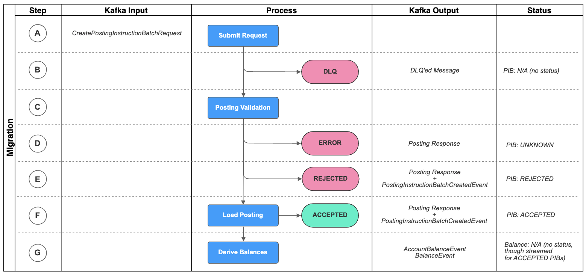

 
| Step and action | Output |
| --- | --- |
| 
*Step A:*  
*Send request to the BAU Postings API.*  

Prepare messages in the format of a `CreatePostingInstructionBatchRequest` and send to either the `vault.core.postings.requests.v1` or `vault.core.postings.requests.low_priority.v1` (recommended) topic.

 | 

N/A

 |
| 

*Step B:*  
*DLQ - Messages that could not be understood by Vault are sent to the Dead Letter Queue (DLQ).*  
  
If the message is structurally unsound and / or unable to be understood by Vault then it will be sent to a DLQ and not processed. Investigate the cause (see [Postings API failures and remediation - DLQ tab](/vault-core/5-9/EN/environment_and_installation/migrating_to_vault/migrating_using_the_postings_migration_api#posting_apis_failures_remediation_and_retries)) and then retry the request message.

 | 

DLQ topic:  
`vault.core.postings.requests.dlq.v1`

 |
| 

*Step C:*  
*Vault Migration Ledger executes Posting Validation.*  

Vault Core executes Postings Validation steps for the BAU Posting API. See: [Postings API validation](/vault-core/5-9/EN/environment_and_installation/migrating_to_vault/migrating_using_the_postings_migration_api#posting_apis_validation)

 | 

N/A

 |
| 

*Step D:*  
*Error - PIB errors during validation, is set to status UNKNOWN, and a Response message is streamed out.*  

Where a PIB errors during validation it will stop validation at the point it errored and a message will be sent to the Posting Response topic.  

The reasons include:

\- Invalid argument error: If the PIB has invalid fields or missing fields (as defined in the [Vault Core Migrations - Data Dictionary](/vault-core/5-9/EN/resources/migrations-data-dictionary.zip))  
\- Internal error: If the PIB processing experiences an infrastructure issue which cannot be retried by the processor itself

 | 

Event:  
`PostingInstructionBatchResponse`  
Kafka topic:  
Posting Response (varies by client\_id based on [Posting API Client](/vault-core/5-9/EN/api/postings_api#creating_postings_api_clients) mapping)  
Status:  
`POSTING_INSTRUCTION_BATCH_STATUS_UNKNOWN`

 |
| 

*Step E:*  
*Rejection - PIB status set to REJECTED, and Response and PIBCreatedEvent are streamed out.*  

If Postings validation is unsuccessful the PIB status is set to REJECTED. Rejections can be thought of as 'good' failures that in a BAU context you want to commit to the ledger as a persistent record of the rejection (e.g. a failed balance check during the pre-posting hook). A Posting Response message and a `PostingInstructionBatchCreatedEvent` message will be streamed for Rejected PIBs when they have been committed to the database.

 | 

Event:  
`PostingInstructionBatchResponse`  
Kafka topic:  
Posting Response (varies by client\_id based on [Posting API Client](/vault-core/5-9/EN/api/postings_api#creating_postings_api_clients) mapping)  
Status:  
`POSTING_INSTRUCTION_BATCH_STATUS_REJECTED`

Event:  
`PostingInstructionBatchCreatedEvent`  
Kafka topic:  
`vault.api.v1.postings.posting_instruction_batch.created`  
Status:  
`POSTING_INSTRUCTION_BATCH_STATUS_REJECTED`  
DLQ topic:  
`vault.api.v1.postings.posting_instruction_batch.created.failures`

 |
| 

*Step F:*  
*Success - PIB status set to ACCEPTED, and Response and PIBCreatedEvent are streamed out.*  

If Postings validation is successful the PIB status is set to ACCEPTED. A Posting Response message and a `PostingInstructionBatchCreatedEvent` message will be streamed for Accepted PIBs when they have been committed to the database.

 | 

Event:  
`PostingInstructionBatchResponse`  
Kafka topic:  
Posting Response (varies by client\_id based on [Posting API Client](/vault-core/5-9/EN/api/postings_api#creating_postings_api_clients) mapping)  
Status:  
`POSTING_INSTRUCTION_BATCH_STATUS_ACCEPTED`

Event:  
`PostingInstructionBatchCreatedEvent`  
Kafka topic:  
`vault.api.v1.postings.posting_instruction_batch.created`  
Status:  
`POSTING_INSTRUCTION_BATCH_STATUS_ACCEPTED`  
DLQ topic:  
`vault.api.v1.postings.posting_instruction_batch.created.failures`

 |
| 

*Step G:*  
*Additional AccountBalanceEvent & BalanceEvent is streamed out.*  

An `AccountBalanceEvent` & `BalanceEvent` is streamed out. The `AccountBalanceEvent` contains the all the balances for the account, including those unaffected by the ACCEPTED PIB. It will only contain the Posting Instructions that have impacted the live balances - for example any migrated future-dated Postings will not stream an `AccountBalanceEvent`. The `BalanceEvent` will only be streamed where a live value or booking balance changes.

 | 

Event:  
`AccountBalanceEvent`  
`BalanceEvent`  
Kafka topic:  
`vault.core_api.v1.balances.account_balance.events`  
`vault.core_api.v2.balances.balance.events` DLQ topic:  
`vault.migrations.balances.postings_committed.live_migration_processor.failure`

 |

error

Posting Migration API specific behaviour

The following diagram and table gives an overview of the statuses and transitions when migrating Postings via Postings Migration API:

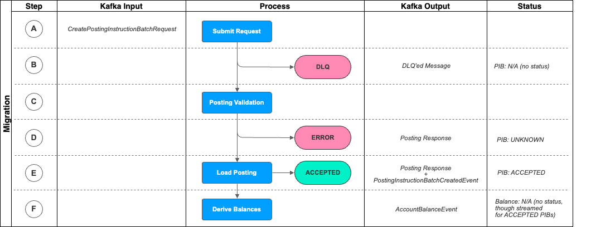

 
| Step and action | Output |
| --- | --- |
| 
*Step A:*  
*Send request to the Posting Migration API.*  

Prepare messages in the format of a `CreatePostingInstructionBatchRequest` and send to the `vault.migrations.postings.requests` topic.

 | 

N/A

 |
| 

*Step B:*  
*DLQ - Messages that could not be understood by Vault are sent to the Dead Letter Queue (DLQ).*  
  
If the message is structurally unsound and / or unable to be understood by Vault then it will be sent to a DLQ and not processed. Investigate the cause (see [Postings API failures and remediation- DLQ tab](/vault-core/5-9/EN/environment_and_installation/migrating_to_vault/migrating_using_the_postings_migration_api#posting_apis_failures_remediation_and_retries)) and then retry the request message.

 | 

DLQ topic:  
`vault.migrations.postings.requests.dlq`

 |
| 

*Step C:*  
*Vault Migration Ledger executes Posting Validation.*  

Vault Core executes Postings Validation steps for the Posting Migration API. See: [Posting Migration validation](/vault-core/5-9/EN/environment_and_installation/migrating_to_vault/migrating_using_the_postings_migration_api#posting_apis_validation)

 | 

N/A

 |
| 

*Step D:*  
*Error - PIB errors during validation, is set to status UNKNOWN, and a Response message is streamed out.*  

Where a PIB errors during validation it will stop validation at the point it errored and a message will be sent to the Posting Response topic.  

The reasons include:

\- Invalid argument error: If the PIB has invalid fields or missing fields (as defined in the [Vault Core Migrations - Data Dictionary](/vault-core/5-9/EN/resources/migrations-data-dictionary.zip))  
\- Internal error: If the PIB processing experiences an infrastructure issue which cannot be retried by the processor itself  

Migrated PIBs cannot be set to status REJECTED as they can in BAU. This is because in BAU a Rejection is a valid business outcome that is stored in Vault, whereas in migration there should never be a reason to intentionally migrate a REJECTED PIB so these are treated in the same way as Errors (i.e set to status UNKNOWN, not committed to the DB, and expected to be retried until successful). Vault Migration Ledger executes a different set of Postings Validation steps to BAU. See: [Posting Migration validation](/vault-core/5-9/EN/environment_and_installation/migrating_to_vault/migrating_using_the_postings_migration_api#posting_apis_validation).

 | 

Event:  
`PostingInstructionBatchResponse`  
Kafka topic:  
`vault.migrations.postings.responses`  
Status:  
`POSTING_INSTRUCTION_BATCH_STATUS_UNKNOWN`

 |
| 

*Step E:*  
*Success - PIB status set to ACCEPTED, and Response and PIBCreatedEvent are streamed out.*  

If Postings validation is successful the PIB status is set to ACCEPTED. A Posting Response message and a `PostingInstructionBatchCreatedEvent` message will be streamed for Accepted PIBs when they have been committed to the database.

 | 

Event:  
`PostingInstructionBatchResponse`  
Kafka topic:  
`vault.migrations.postings.responses`  
Status:  
`POSTING_INSTRUCTION_BATCH_STATUS_ACCEPTED`

Event:  
`PostingInstructionBatchCreatedEvent`  
Kafka topic:  
`vault.api.v1.postings.posting_instruction_batch.created`  
Status:  
`POSTING_INSTRUCTION_BATCH_STATUS_ACCEPTED`  
DLQ topic:  
`vault.api.v1.postings.posting_instruction_batch.created.failures`

 |
| 

*Step F:*  
*Additional AccountBalanceEvent is streamed out.*  

An `AccountBalanceEvent` is streamed out, containing the live balances reflecting the effect of the ACCEPTED Posting. `BalanceEvent` is not streamed when using the Postings Migration API.

 | 

Event:  
`AccountBalanceEvent`  
Kafka topic:  
`vault.core_api.v1.balances.account_balance.events`  
DLQ topic:  
`vault.migrations.balances.postings_committed.live_migration_processor.failure`

 |

* * *

### Posting APIs validation

info

Common behaviour shared by both Posting Migration API and BAU Posting API

During the [Posting Lifecycle](/vault-core/5-9/EN/environment_and_installation/migrating_to_vault/migrating_using_the_postings_migration_api#posting_apis_lifecycle_overview) (Step C) Vault Core executes Posting Validation.

Postings go through a different set of Posting validation steps for the BAU Postings API vs the Posting Migration API.

-   This is because migrated PIBs represent financial movements that have already occurred on the banking platform and should therefore not be erroneously; (i) rejected , or (ii) allowed to execute duplicate product logic.
    
-   Accordingly the Posting Migration API natively suppresses validation steps that would otherwise take place using the BAU Postings API. This behaviour is intentional, inherent to the Posting Migration API, and cannot be changed.
    
-   If using the BAU Postings API to execute a migration then it is possible to achieve the same net effect (skipping unwanted validation steps), though additional effort is needed to achieve this as outlined in the table below.
    

The Posting validation flows are as follows:

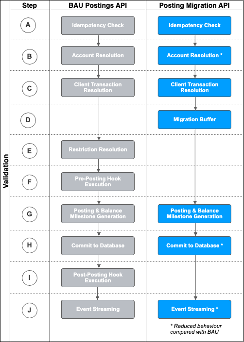

  
| *Step* | *BAU Postings API Validation* | *Posting Migration API Validation* |
| --- | --- | --- |
| 
*A*  
Idempotency Check

 | 

Validates that the PIB is not a duplicate already present in the Vault Core database. This check is against all Postings in the Vault Core database for the instance, regardless of origination via BAU or Migration request topics.  

The idempotent key is `request_id`, which if resubmitted will re-stream out duplicate events. This occurs regardless of whether the body of the PIB is identical (i.e. a duplicate request with completely different content but eh same `request_id` will still stream out a copy of the first request’s events and disregard the changes to the body of the request).  

See [Posting APIs idempotency](/vault-core/5-9/EN/environment_and_installation/migrating_to_vault/migrating_using_the_postings_migration_api#posting_apis_idempotency) for more details.

 | 

*Same as BAU Postings API.*

 |
| 

*B*  
Account Resolution

 | 

Fetches the Account for the `target_account_id` or `payment_device_token` provided in the PIB, and in doing so checks that;

\- It exists in Vault Core,  
\- It has the status of OPEN or PENDING\_CLOSURE,  
\- Is a supported denomination,  
\- Is a valid Payment Device ID (if passed)

**Validation that needs to be skipped when migrating using BAU:**

*Status Check*  
Most clients do not migrate CLOSED accounts (and challenge whether there is truly a requirement for this data to be stored in the operational Core vs a separate data warehouse), however where there is a requirement to migrate a non-zero balance against a CLOSED migrated account using the BAU Postings API then the account must first be loaded in status OPEN, Postings migrated against it, and then moved to CLOSED using an Account Update.  

 | 

Fetches the Account for the `target_account_id` provided in the PIB, and in doing so checks that;

\- It exists in Vault Core

**Reduced validation compared to BAU:**

*Status Check*  
The status check is skipped for migrated postings. This allows Postings to be loaded against Pending or Closed Accounts. Where Accounts are migrated with a status of CLOSED, these accounts will never be able to accept BAU Postings. These accounts should ideally have a zero balance as is required by Vault Core in BAU - this is not enforced in the Posting Migration API, but should be discussed with Thought Machine as part of the migration design if relevant.  

*Supported Denomination Check*  
Denominations do not have to have been specified in the Smart Contract to be supported for migration via the Posting Migration API.  

*Payment Device Token Check*  
Payment Device Tokens are not supported for migrated postings (if both an Account ID and Payment Device Token are provided, then the Account ID will be used for the PIB validation and the Payment Device Token ignored. If only a Payment Device Token is provided then the PIB will error).

 |
| 

*C*  
Client Transaction Resolution

 | 

Validates the transaction chain by fetching associated PIBs, and in doing so checks that:

\- It exists (if used on Auth Adjust, Settlement, or Release PI types which can only augment, not create a transaction chain),  
\- It is not already closed (by terminal PI type)  
\- It does not include an invalid operation (such as. a `value_timestamp` earlier than an existing Posting in the chain),  
\- It does not result in an Authorisation with a negative amount,  
\- It does not already exist within the namespace of this `client_id`

For more information on transaction chain fetching in BAU, see [Client transaction lifecycle checks](/vault-core/5-9/EN/reference/postings#client_transaction_lifecycle_checks).

 | 

Validates the transaction chain, and in doing so checks that:

\- It exists (if used on Auth Adjust, Settlement, or Release PI types which can only augment, not create a transaction chain),  
\- It is not already closed (by terminal PI type)  
\- It does not include an invalid operation (such as. a `value_timestamp` earlier than an existing Posting in the chain),  
\- It does not result in an Authorisation with a negative amount.  

For more information on transaction chain fetching in BAU, see [Client transaction lifecycle checks](/vault-core/5-9/EN/reference/postings#client_transaction_lifecycle_checks).

**Reduced validation compared to BAU:** As the Posting Migration API does not namespace on client\_id this check is skipped.

 |
| 

*D*  
Migration Buffer

 | 

*This step is only relevant for the Posting Migration API, it does not take place when using the BAU Postings API.*

 | 

Migrated Postings are buffered by Vault Core prior to running the Restriction Resolution / all subsequent Posting Validation steps. This is so that Vault Core can guarantee the chronological ordering of Postings by `source_insert_timestamp` at the Customer Account level, using the `target_account_id` and `account_sequence_number`.  

For more information on the Migration Buffer see the detailed explanation [here](/vault-core/5-9/EN/environment_and_installation/migrating_to_vault/migrating_using_the_postings_migration_api#migration_buffer_step_d).

 |
| 

*E*  
Restriction Resolution

 | 

Checks whether there is an active Restriction set for the `account_id` (or linked `customer_id`) at the time that Posting validation takes place, and where appropriate, rejects the PIB. Any restriction violation yields a restriction violation object in the streamed events, which contains the relevant restriction set ID in Vault Core.

**Validation that needs to be skipped when migrating using BAU:**  

*Restriction Check*  
When migrating using the BAU Postings API you will not want current or historic Restrictions to result in erroneous Posting migration Rejections. Accordingly, when migrating Postings using the BAU Postings API the restriction checks can be skipped using the `override` object in the `PostingInstructionBatch` request message, which will bypass any active Restrictions. See [here](/vault-core/5-9/EN/environment_and_installation/migrating_to_vault/migrating_using_the_postings_migration_api#skipping_restriction_validation_checks_code_snippet) for an example code snippet.

 | 

**Reduced validation compared to BAU:**  

*This step is skipped when using the Posting Migration API.*

 |
| 

*F*  
Pre-Posting Hook Execution

 | 

Pre-posting Smart Contract hook execution takes place before commitment of the Posting to the Vault Core database. The outcome will vary depending on what has been built into the Smart Contract for pre-posting hooks.  

An example of a pre-posting hook could be a balance check to verify the account has the necessary funds to process a transaction.

**Validation that needs to be skipped when migrating using BAU:**  

*Hook execution*  
To skip the Pre-posting hook and Post-posting hook when using BAU Postings API the preferred Thought Machine approach is to use the `originating_account_id`. By setting a key:value pair of `originating_account_id`:\`account\_id\` (where `account_id` is the customer account id that the PI is targeting) in every Posting Instruction’s `instruction_details` within all migrated PIBs it will force Vault Core to skip the pre and post posting hook execution for migrated Postings entirely. Note that for this to work we need to guarantee that each PI only contains postings related to a single customer account - most PI types enforce this by default, though it is possible for Custom Instruction and Transfer so this must be factored into data mapping. See [here](/vault-core/5-9/EN/environment_and_installation/migrating_to_vault/migrating_using_the_postings_migration_api#skipping_pre_and_post_posting_hook_execution_code_snippet) for an example code snippet.

 | 

**Reduced validation compared to BAU:**  

*This step is skipped when using the Posting Migration API.*

 |
| 

*G*  
Posting & Balance Milestone Generation

 | 

Postings (individual pairs of Credits and Debits) are created where necessary. Custom Instructions pass Postings on the request but other Posting Instruction types do not, hence the need to create at this step. Balance Milestones (record of the account balance at a point in time based on `source_insert_timestamp`) are created by Vault automatically and help optimise the speed of fetching historic balances.

 | 

*Same as BAU Postings API.*

 |
| 

*H*  
Commit to the Database

 | 

Commits Accepted and Rejected PIBs to the Vault Core database. Will not commit Errored PIBs. Only commits to the DB when all of the steps above have fully completed.

 | 

*Same as BAU Postings API.*  

(Though note that it is not possible to have Rejected PIBs using the Posting Migration API)

 |
| 

*I*  
Post-Posting Hook Execution

 | 

Post-posting Smart Contract hook execution takes place after commitment of the Posting to the Vault Core database. The outcome will vary depending on what has been built into the Smart Contract for post-posting hooks.  

An example of a post-posting hook could be a 'rounding-up' of spending to the nearest £ and sweeping this into a linked savings account, or the automatic payment of an account opening 'bonus' through the triggering of a new Posting entry to the account.

**Validation that needs to be skipped when migrating using BAU:**  

*Hook execution*  
To skip the Pre-posting hook and Post-posting hook when using BAU Postings API the preferred Thought Machine approach is to use the `originating_account_id`. By setting a key:value pair of `originating_account_id`:\`account\_id\` (where `account_id` is the customer account id that the PI is targeting) in every Posting Instruction’s `instruction_details` within all migrated PIBs it will force Vault Core to skip the pre and post posting hook execution for migrated Postings entirely. Note that for this to work we need to guarantee that each PI only contains postings related to a single customer account - most PI types enforce this by default, though it is possible for Custom Instruction and Transfer so this must be factored into data mapping. See [here](/vault-core/5-9/EN/environment_and_installation/migrating_to_vault/migrating_using_the_postings_migration_api#skipping_pre_and_post_posting_hook_execution_code_snippet) for an example code snippet.

 | 

**Reduced validation compared to BAU:**  

*This step is skipped when using the Posting Migration API.*

 |
| 

*J*  
Event Streaming

 | 

Events are streamed for each PIB, which depending on the status could include;

\- *Posting Migration API*: Response, in the format of `PostingInstructionBatch`  
\- *Core API*: `PostingInstructionBatchCreatedEvent`  
\- *Core API*: `AccountBalanceEvent`  
\- *Core API*: `BalanceEvent`  

See [here](/vault-core/5-9/EN/environment_and_installation/migrating_to_vault/migrating_using_the_postings_migration_api#posting_apis_topics_and_events) for more information about streamed events.

 | 

Events are streamed for each PIB, which depending on the status could include;

\- *Posting Migration API*: Response, in the format of `PostingInstructionBatch`  
\- *Core API*: `PostingInstructionBatchCreatedEvent`  
\- *Core API*: `EnrichedPostingInstructionBatchEvent`  
\- *Core API*: `AccountBalanceEvent`

See [here](/vault-core/5-9/EN/environment_and_installation/migrating_to_vault/migrating_using_the_postings_migration_api#posting_apis_topics_and_events) for more information about streamed events.

 |

error

BAU Posting API specific behaviour

As above, if you are using the BAU Postings API to migrate Postings then the BAU Postings API will no longer skip:

-   Account status checks
    
-   Restriction validation checks
    
-   Smart Contract execution (both pre-posting hooks and post-posting hooks)
    

Below are code snippets that can replicate the behaviour of the last two of these.

#### Skipping Restriction validation checks (code snippet)

Within each migrated PIB:

#### Skipping Pre- and Post-Posting Hook execution (code snippet)

Within each migrated PIB’s Posting Instruction:

error

Posting Migration API specific behaviour

#### Migration Buffer (Step D)

*Context:*

-   Vault v5.0 changed the way that Vault calculates Balances internally, and in doing so introduced a hard requirement for Postings to be strictly inserted into the Vault Core database by insertion time.
    
-   In BAU this happens automatically as insertion time into Vault is set to the current time when the Posting is inserted into the Vault Core database, so these are always 'ordered' by insertion time.
    
-   However, for migrated Postings clients often want to capture the legacy system’s historic insertion timestamp in order to recreate a historic insertion balance time-series that can be queried seamlessly alongside BAU postings after migration. These migrated Postings with their historic insertion timestamps also needs to be strictly ordered in the same way.
    
-   Rather than pushing this responsibility onto the external ETL tooling, instead a 'buffer' was added to the Posting Migration API that will handle this ordering.
    

*Buffer operation:*

-   The Posting Migration API’s 'migration buffer' can be considered somewhat analogous to the Data Loader’s 'dependency' concept, as it allows you to send PIBs to Vault Core out of the system enforced order, instead enabling Vault to orchestrate any necessary sequencing.
    
-   As a client your engagement with the buffer will be via a new set of fields required on each migrated PIB:
    
    -   `source_insert_timestamp` field - Present only on the Posting Migration API. Specifies the time the instruction was inserted in the source core banking system at the time the PIB was first captured in a ledger. For migrated Postings this means the time the instruction was inserted into the legacy core. Allows Vault to reconstruct the insertion balance time-series using this client provided timestamp instead of the defaulted `insertion_timestamp` (which is current time insertion into Vault Core as used in BAU).
        
    -   `account_sequence_number` field - Present only on the Posting Migration API. The position of the PIB relative to all other migrated PIBs for the same customer account when ordered by `source_insert_timestamp`. The `source_insert_timestamp` and `account_sequence_number` always need to be monotonically and consistently (i.e. as a pair) increasing for a given `target_account_id`.
        
    
-   For example, where the migration extract contains 10 postings for a single `account_id`, order these ascending by `source_insert_timestamp` and assign a sequence number 1 through 10 accordingly based on this chronological ordering.
    
-   The buffer then operates as follows:
    
    -   Every PIB sent to the Posting Migration API for a given customer account is compared to that account’s 'watermark'. This watermark is tracked invisibly by Vault and is the last `account_sequence_number` successfully processed + 1 (where none have processed then the starting `account_sequence_number` will always start at '1').
        
    -   Where the PIB’s `account_sequence_number` it higher than the account watermark then it will be 'buffered' and held until all preceding `account_sequence_number` have also been successfully processed by the Posting Migration API, at which point it shall also be processed accordingly.
        
    -   Where the PIB’s `account_sequence_number` equals the account watermark then it will be immediately processed through the Posting validation steps E-J above, as will any PIBs already in the buffer that have contiguous account\_sequence\_numbers.
        
    

*Error Handling:*

-   There are then two types of error that can impact migrated Postings in relation to the buffer; (i) the account watermark PIB errors with a validation error (for example missing mandatory field) - this does not impact any postings already in the buffer and the errored account\_sequence\_number needs to be fixed and resubmitted, (ii) the account watermark PIB errors because the PIB breaks the rules regarding the `source_insert_timestamp` and `account_sequence_number` always need to be monotonically and consistently (as a pair) increasing - this 'locks' the account.
    
-   See [Posting Migration API failures and remediation](/vault-core/5-9/EN/environment_and_installation/migrating_to_vault/migrating_using_the_postings_migration_api#posting_apis_failures_remediation_and_retries) section for a list of common error messages and whether they result in the account becoming 'locked' and for for worked examples of how the Posting Migration API handles different happy path / unhappy path scenarios.
    

## Posting APIs monitoring and error handling

* * *

### Posting APIs monitoring recommendations

info

Common behaviour shared by both Posting Migration API and BAU Posting API

Thought Machine recommend that you listen to and reconcile the following events as a minimum when migrating Postings using the Posting APIs (for Kafka topic names see [here](/vault-core/5-9/EN/environment_and_installation/migrating_to_vault/migrating_using_the_postings_migration_api#posting_apis_topics_and_events)):

-   `CreatePostingInstructionBatchRequest` **DLQ** - (single source of terminal status DLQ)
    
-   **PIB Response** - (single source of terminal status UNKNOWN (Error), additional source for terminal statuses ACCEPTED & REJECTED)
    
-   `PostingInstructionBatchCreatedEvent` - (preferred source for terminal statuses ACCEPTED & REJECTED, and also live balance resulting from ACCEPTED PIBs)
    

Depending on your Product and ETL design you may wish to *also* consume:

-   `EnrichedPostingInstructionBatchCreatedEvent` (only if utilising this event in the BAU state)
    
-   `AccountBalanceEvent` (contains the same core information as is present in the PostingInstructionBatchCreatedEvent for ACCEPTED PIBs) AND/OR `BalanceEvent` (most useful if in BAU you rely on Vault Core to provide a booking timeseries and the migration to a certain extent needs to reflect that), most likely determined by whichever you are integrating with in the BAU state.
    
-   `vault.api.v1.postings.posting_instruction_batch.created.failures` and `vault.migrations.balances.postings_committed.live_migration_processor.failure` (these are internal DLQ topics that are unlikely to ever have messages placed onto them)
    

Overall, it is very important that you have setup Reconciliations that are able to join PIB request messages with their associated streamed (output) events, and at an `account_id` level are able to quickly analyse the outcomes of PIBs associated with that `account_id`.

Important questions and considerations regarding event monitoring

*How do I listen to events?*

-   Streamed Kafka events are a key part of the Vault Core architecture and your BAU implementation design should have already solved this. Contact your Thought Machine representative for general support on consuming Kafka events where necessary.
    

*How do I capture streamed events for use in reconciliations?*

-   This will depend on your reconciliation design, but our expectation would be that Vault’s streamed events are being picked up by a Kafka listener and sent to a downstream data lake or database that the reconciliations tooling can access in order to perform reconciliations.
    
-   This might be the same data lake used in BAU as a system of insight, or a separate reconciliations database used only in migration. Storing copies of Kafka events as they are sent and streamed out is key - you should NOT build a reconciliation tool that relies on REST API calls to retrieve the migration outcome (or state) of loaded data.
    

*Why can’t I just use the REST APIs for reconciliations instead of the streamed Kafka events?*

-   You should never use REST API GET calls as a primary source of data for accuracy reconciliations because they are not performant at even small migration volumes (1000+). You should only use these GET calls with the [Data Loader API](/vault-core/5-9/EN/api/data_loader_api#Data_loader) and [Core API](/vault-core/5-9/EN/api/core_api/) to investigate small/low volume issues (for example, a single DLQ message or functional migration testing).
    
-   Instead, you should ensure that Vault Core’s streamed Kafka events are consumed and stored in your reconciliations data lake or DB and used as the primary source of data for accuracy reconciliations.
    

*Do I need to handle duplicate messages?*

-   Vault Core provides an 'at least once' delivery guarantee. This means you should always receive at least one response message (event topic or DLQ) for every request submitted, but you may also get more than one.
    
-   It is important to set up your reconciliations to handle scenarios where you get two identical response events (i.e. duplicate `event_id`) for the same request. This design requirement may already be part of the wider architecture; for example, certain S3 connectors provide an exactly once delivery guarantee.
    
-   Two common reasons that Vault may stream out duplicate Posting events include (this is not exhaustive):
    
    -   The Posting APIs directly write each streamed event to the public response Kafka topics - this is known as 'eager publishing'. They will insert an intent entry into the database table and update the entry as "published" if the event is successfully published to the Kafka topic. There are occasional instances where eager publishing does not happen immediately or fails (for example, due to a network issue). From here the Journal Poller monitors for any previously unpublished events, publishes these events and updates the intent entries in the database accordingly as "published". As a result, the same Kafka event could be published twice as the journal poller sees the intent entry status as "unpublished" and decides to republish the message to Kafka. It is the responsibility of the event consumer to handle duplicate events via idempotency checks.
        
    -   If the poller service pod (pod A) or "worker" processes a Posting and sends the message to Kafka but scales down before updating the intent entry as "published", then the same event could be delivered more than once to the Kafka topic. The next available poller pod (pod B) sees that the posting has been processed but the intent entry in the database is not updated as "published". To ensure reliable event delivery, pod B will send the same event again.
        
    

* * *

### Posting APIs failures, remediation and retries

info

Common behaviour shared by both Posting Migration API and BAU Posting API

The ability to retry messages should already be set up as part of your wider Vault integration architecture (for example to retry a failed account creation in the BAU state). This capability is also important for migration purposes - for general guidance on designing migration Reconciliations as part of ETL tooling build, see the [Reconciliations](/delivery-framework/latest/EN/delivery_workstream/migration/extract_transform_and_load_etl_tooling_build) section of the Vault Core Delivery Framework.

Where there are errors, failures, or issues with the migration pipeline you must have the ability to automatically (up to a set number of retries) and manually (based on user instruction) fix and retry previously sent Postings.

In broadly chronological order left to right the errors, failures, or other issue types you should consider are as follows:

Kafka Failure DLQ UNKNOWN (Error) REJECTED Missing events Fin Recs Failure

*Identify:*

-   A failure to connect to Kafka may be apparent through a Kafka message similar to the following: `KafkaTimeoutError: Failed to update metadata after 5.0 secs`.
    

*Remediate:*

-   Your ETL pipeline design should include the ability to automatically retry Posting API `CreatePostingInstructionBatchRequest` messages based on Kafka failure messages where there is a transient failure to connect to Kafka (Brokers).
    
-   If the Kafka broker is completely unavailable then the Posting APIs will not be able to process requests until it becomes available again. Ensure that you have Kafka expertise within your migration event team to be able to diagnose and resolve any issues. Smoke tests ahead of the event are also valuable in ensuring that Kafka is working as expected.
    

*Retry:*

-   `CreatePostingInstructionBatchRequest` messages that suffer Kafka Connection Errors have not reached the Vault Platform and so the Vault Core event streams will not produce any messages for these.
    
-   After resolving the Kafka issue you can retry the PIB by sending the message as-is, including the same `request_id`. The message did not get committed to the Vault Core database, so the normal [idempotency](/vault-core/5-9/EN/environment_and_installation/migrating_to_vault/migrating_using_the_postings_migration_api#posting_apis_idempotency) rules do not apply.
    

*Identify:*

-   A PIB lands on the `CreatePostingInstructionBatchRequest` DLQ topic (`vault.core.postings.requests.dlq.v1` or `vault.migrations.postings.requests.dlq`), depending on the [request topic](/vault-core/5-9/EN/environment_and_installation/migrating_to_vault/migrating_using_the_postings_migration_api#topics) used.
    
-   Vault Core’s [DLQ Inspector](/vault-core/5-9/EN/reference/dlq#dlq_inspector) can also be helpful in both notifying of and understanding reasons for DLQ’ed messages.
    
-   The Posting APIs perform structural checks on each message when sending from one location to another (both internal and external). Where these fail and Vault Core is simply not able to make sense of a message it is placed onto a DLQ topic.
    

*Remediate:*

-   The DLQ’ed messaged does not give failure reasons in the message body itself (as the DLQ topic just contains a copy of the original unprocessed request), though it can be worth checking the Kafka header as this will sometimes give an indication as to the reason the message was DLQ’ed.
    
-   The primary reasons for Posting Migration messages being sent to a DLQ are:
    

 
| *Failed check* | *Reason* |
| --- | --- |
| 
Message is not correctly structured

 | 

Message does not meet the standard syntax of the expected message format. For example, missing brackets, commas, and so on.

 |
| 

Incorrect message format

 | 

The postings API message format set in the `values.yaml` file is different from the messages format passed in. This always defaults to Proto unless positively changed - if you are passing in a JSON message then check this has been set correctly to JSON. This is described further [here](/vault-core/5-9/EN/environment_and_installation/migrating_to_vault/intro#installing_the_migration_apis).

 |
| 

Posting API Client not registered

 | 

If the [Posting API Client](/vault-core/5-9/EN/api/postings_api#creating_postings_api_clients) has not been registered (`client_id` defined and mapped to a response topic) then the request will DLQ. The request will also DLQ if a `client_id` was registered without a low priority response topic specified, and a request is sent to the low priority request topic for this `client_id`.

 |

-   You should then remediate the issue as appropriate, which could mean updating the `values.yaml` file or fixing the syntax of the request message.
    

*Retry:*

-   Retry the PIB by sending the message as-is (accounting for any necessary fixes to resolve the cause of the issue), including the same `request_id`. The message did not get committed to the Vault Core database, so the normal [idempotency](/vault-core/5-9/EN/environment_and_installation/migrating_to_vault/migrating_using_the_postings_migration_api#posting_apis_idempotency) rules do not apply.
    

*Identify:*

-   A **Posting Response** is streamed with an `UNKNOWN` status.
    

*Remediate:*

-   Where a PIB Errors the message will be set to an `UNKNOWN` status and a fix is required before resubmission.
    
-   Vault Core will automatically retry errors internally before streaming this terminal status where possible. PIBs that are set to an `UNKNOWN` status are generally non-transient errors where automatic retries were either not possible or successful.
    
-   There are two error types - `POSTING_INSTRUCTION_BATCH_ERROR_TYPE_INVALID_ARGUMENT` (primarily field-level data validation errors) and `POSTING_INSTRUCTION_BATCH_ERROR_TYPE_INTERNAL` (primarily unexpected behaviour occurred when trying to process the request). The specific reason for the error can be found in the message’s `error` object, which will drive the appropriate remediation (be it a fix in the request message or to environment infrastructure). If you receive a `POSTING_INSTRUCTION_BATCH_ERROR_TYPE_INTERNAL` status with the error message `exceeded the postings per account limit when fetching postings` then you should consult the [guidance on the sizing of each migrating PIB](/vault-core/5-9/EN/environment_and_installation/migrating_to_vault/migrating_using_the_postings_migration_api#posting_apis_performance_optimisation).
    

*Retry:*

-   Retry the PIB by sending the message as-is (accounting for any necessary fixes to resolve the cause of the issue), including the same `request_id`. The message did not get committed to the Vault Core database, so the normal [idempotency](/vault-core/5-9/EN/environment_and_installation/migrating_to_vault/migrating_using_the_postings_migration_api#posting_apis_idempotency) rules do not apply.
    

error

Posting Migration API specific behaviour

-   The Posting Migration API treats messages that would otherwise be REJECTED using the BAU Postings API as Errors, which is to say it sets the status to UNKNOWN and not REJECTED. In such cases the rejection reason will be populated in the `violations` objects as normal.
    
-   The Posting Migration API broadly has two types of Error - those that 'lock' and account, and those that do not.
    
    -   'Locking' of an account occurs on certain error types where the Posting Migration API protects against accidental corruption of the monotonically increasing ordering of PIBs by `source_insert_timestamp`.
        
    -   Locking an account results in; (i) the buffer for that account being flushed and any PIBs currently in it to be deleted, (ii) the immediate erroring of the PIB account\_sequence\_number that caused the account to become locked (message immediately below), (iii) inability to submit any PIBs into the buffer for that account until the `account_sequence_number` that locked it has been remediated.
        
    

**Errors that will lock an account**

-   *"\`source\_insert\_timestamp\` for this PIB is lower than a source\_insert\_timestamp for a PIB that was previously ACCEPTED for this ``target_account_id`"``* ``- errored because the `source_insert_timestamp`` is earlier than an already accepted PIB and thus breaks the rules around monotonically increasing timestamps.
    

**Errors that will not lock an account (non-exhaustive list of common errors):**

-   *"The account is locked and may only be unlocked by sequence number: 1"* - if an account has locked for one of the error reasons listed above then submitting a PIB for any `account_sequence_number` other than the one that caused the account to lock will result in this error. The error provides the account\_sequence\_number in question required to unlock the account - in this case '1'.
    
-   *"invalid amount field"* - the PIB request contains a zero or negative `amount` where this is unsupported by PI type being used.
    
-   *"custom\_instruction must contain no more than 64 postings"* - the PIB request is a Custom Instruction that contains over 64 Postings.
    
-   *"must contain no more than 5 posting instruction(s)"* - the PIB request contains over 5 Postings Instructions (of any type).
    
-   *"source\_insert\_timestamp is before value\_timestamp: should be greater than or equal"* - timestamps break validation rules around date ordering.
    
-   *"booking\_timestamp is before value\_timestamp"* - timestamps break validation rules around date ordering.
    
-   *"one or more posting\_instructions are targeting a different account than the request"* - the `account_id` in the Posting Instruction object is different from the `target_account_id` in the PIB migration wrapper (they must always be the same).
    
-   *"account\_sequence\_number must be set to at least 1"* - can never be '0' or a negative number.
    
-   *"payment device token cannot be used as target account"* - payment devices are not supported for posting migration.
    
-   *"unsupported posting instruction transfer"* - the Transfer Posting Instruction type is not supported for migration.
    
-   *"account type for account ID "1" doesn’t match expected type in request"*: "ACCOUNT\_TYPE\_CUSTOMER Actual type from account service "ACCOUNT\_TYPE\_INTERNAL"\_ - cannot use a customer account id in the internal account id field (or vice versa)
    
-   *"encountered account violation"* with an `account_violation` of ACCOUNT\_VIOLATION\_ACCOUNT\_NOT\_PRESENT
    
-   *"encountered posting violation"* with a `posting_violation` of POSTING\_VIOLATION\_CLIENT\_TRANSACTION\_ALREADY\_EXISTS, POSTING\_VIOLATION\_CLIENT\_TRANSACTION\_DOES\_NOT\_EXIST, POSTING\_VIOLATION\_ADJUSTMENT\_YIELDS\_AUTHORISATION\_WITH\_NEGATIVE\_AMOUNT, POSTING\_VIOLATION\_CLIENT\_TRANSACTION\_CLOSED, or POSTING\_VIOLATION\_CLIENT\_TRANSACTION\_INVALID\_OPERATION
    
-   *"\`create\_posting\_instruction\_batch\_request\`: field `target_account_id` should be different from `` internal_account_id` ``*``: invalid arguments"_ - attempting to load the same customer id in both the `account_id`` and `internal_account_id` fields.
    
-   *"request\_id has been reused"*. Already used for a different set of (`account_id`/`account_sequence_number`) \_- request id for a previously ACCEPTED PIB has been reused (this is a failure of idempotency rules).
    
-   *"exactly one of `internal_account_processing_label` or `internal_account_id` should be set: invalid arguments"* - in line with BAU you can only specify either the `internal_account_id` or the `internal_account_processing_label` in the request, not both.
    
-   *"posting\_instruction\_batch: unimplemented asset field"* - unlike with authorisations and hard settlements in the BAU Postings API (and like Custom Instructions), it is not possible to define the asset on the request via the Postings Migration API.
    
-   *"posting\_instruction\_batch: unimplemented target\_account\_address field"* - unlike with authorisations and hard settlements in the BAU Postings API (and like Custom Instructions), it is not possible to define the target address on the request via the Postings Migration API.
    
-   *"setting account context"* - this likely means you have attempted to have multiple (up to 5) PIs where each PI does not reference the internal account. To workaround this issue you should only use only one PI per PIB. It could also mean that you have not set the `account_id` or `internal_account_processing_label` field correctly. If you receive this error contact Thought Machine support.
    
-   *"account is not valid for migration"* - a BAU Posting has been loaded against the Account, preventing all future use of the Posting Migration API for that Account. See [here](/vault-core/5-9/EN/environment_and_installation/migrating_to_vault/migrating_using_the_postings_migration_api#preventing_bau_postings_when_using_the_posting_migration_api) for more information on causes and how to avoid.
    

*Identify:*

-   A **Posting Response** or `PostingInstructionBatchCreatedEvent` is streamed with a `REJECTED` status.
    

*Remediate:*

-   Postings will be Rejected for one of four specific 'violations', and appear as such in the streamed event:
    

-   These violations related to corresponding steps of the [Posting validation](/vault-core/5-9/EN/environment_and_installation/migrating_to_vault/migrating_using_the_postings_migration_api#posting_apis_validation) process.
    
-   Each violation type has a range of pre-determined Rejection reasons and all will require a change to the request message to resolve.
    

*Retry:*

-   Retry the PIB by sending the message (accounting for any necessary fixes to resolve the cause of the issue), with a new `request_id`. The message was committed to the Vault Core database, so the normal [idempotency](/vault-core/5-9/EN/environment_and_installation/migrating_to_vault/migrating_using_the_postings_migration_api#posting_apis_idempotency) rules apply.
    

*Identify:*

-   Reconciliations flag that a request message has been sent but some or all of the [expected](/vault-core/5-9/EN/environment_and_installation/migrating_to_vault/migrating_using_the_postings_migration_api#topics) streamed Kafka event messages are 'missing'.
    

*Remediate / Retry:*

-   First, check the [DLQ topic](/vault-core/5-9/EN/environment_and_installation/migrating_to_vault/migrating_using_the_postings_migration_api#topics) for the Posting API in question. If the message is on the DLQ then the reason that the streamed events are 'missing' is because Vault Core could not make sense of the request message. See the **DLQ** tab for more guidance on how to recover from DLQ’ed messages.
    
-   Next, if not resolved, check your ETL Tooling logs to verify the message was actually sent to the Posting API request topic as expected. If not, investigate why and resend the message when ready.
    
-   Next, if not resolved, using Kafkacat or another similar Kafka messenger, consume the relevant Posting API [request topic](/vault-core/5-9/EN/environment_and_installation/migrating_to_vault/migrating_using_the_postings_migration_api#topics) to verify that the message is present (and therefore landed on the Kafka topic as expected).
    
-   Next, if not resolved, ensure that you are consuming the correct Kafka [topics](/vault-core/5-9/EN/environment_and_installation/migrating_to_vault/migrating_using_the_postings_migration_api#topics). In particular take note of the `client_id` used in the original request message and ensure that you are listening to the correct Response topic based on the [Posting API Client](/vault-core/5-9/EN/api/postings_api#creating_postings_api_clients) mapping (as this `client_id` will have been mapped to a specific low and high priority topic - check you are listening to the right one).
    
-   Next, if not resolved, ensure that the `client_id` and associated Kafka topic actually exist in the environment. The Kafka topic should have been created automatically when registering the [Posting API Client](/vault-core/5-9/EN/api/postings_api#creating_postings_api_clients), however it may be the case the `client_id` exists but the associated Kafka topic does not - most likely as a result of an environment snapshot / restore that recreated the Vault Core tables but not Kafka topics. Here the request will not DLQ (as the `client_id` exists) but the event will not stream.
    
    -   In the Grafana Dashboard, go to **Ledger Balances** > **\[V5+\] Ledger Processor Breakdown**, then see **Overview** > **Request Status Statistics**. This panel should contain an error suggesting missing Kafka topics. Failing that, check the logs for the `ledger-router`, which should also publish an error log that displays similar information.
        
    
-   Next, if not resolved, then this is likely an environmental or infrastructure issue and you should check the health of the relevant Posting services using logs and observability tools - there may be a crash-looping pod for example, or the relevant packages may not have deployed correctly. This typically does not require a fix to the message, but rather to the infrastructure issue that caused the message to error. For example, the Posting journey relies on:
    
    -   *Database* - Relies on Postgres to access the postings ledger as well as each PostingInstruction processed. If Postgres is unavailable it cannot start up. If Postgres becomes unavailable during execution then any requests will fail to be processed until the database become available again.
        
    -   *gRPC* - Relies on the following gRPC services to be up and running to operate correctly: `vault/core/accounts/accounts` & `vault/core/processing_groups/processing_groups`. An inability to reach either of these services will result in a failure in processing that request.
        
    -   *ledger or ledger-migrator service* - Check the pod health for the `ledger` (BAU Postings API) `ledger-migrator` (Posting Migration API) and any error logs associated with this pod (e.g. SASL auth error).
        
    
-   Contact Thought Machine if you are in need of further support.
    

error

Posting Migration API specific behaviour

-   Where the PIB is confirmed to have been sent per the above but no events were received at all then the message has likely been 'buffered'. The concept of the buffer is explained in the Posting Migration API Validation sub-section titled [buffer operation](/vault-core/5-9/EN/environment_and_installation/migrating_to_vault/migrating_using_the_postings_migration_api#migration_buffer_step_d) and the behaviour when submitting PIBs out of sequence is explained in the Posting Migration API Idempotency & Retries [examples](/vault-core/5-9/EN/environment_and_installation/migrating_to_vault/migrating_using_the_postings_migration_api#happy_path_accepted). In short, no positive Kafka events are streamed when a message is in waiting in the buffer to be processed.
    

*Identify:*

-   Reconciliations highlight that all Postings have been loaded to Vault Core but for whatever reason the account balance is not in the required go-forward state (i.e. failed financial reconciliations).
    

*Remediate:*

-   Postings are immutable resources in Vault Core so previously loaded Postings cannot be updated, only new Postings inserted to increase / decrease the account’s balance.
    
-   Depending on your use case for historic Postings you may find that a fin rec failure means that the migration event forces a no-go decision, and any data loaded to Vault Core must be put beyond use - i.e. Accounts Closed, Customer moved to Inactive state. Postings and other Vault Core resources cannot be hard deleted from the Vault core DB once successfully loaded.
    
-   Where this is not the case then a corrective PIB message can be sent to Vault Core.
    

*Retry:*

-   It is important that you have a corrective pipeline set-up to handle any mismatched posting / balance reconciliations and this should be planned during the initial ETL pipeline build. To implement this you will need to:
    
    -   *Agree the scenarios and places (databases) in the migration event where a corrective PIB may need to be inserted* - looking at the key reconciliation points where you may learn that a balance is incorrect, remembering this could be during the 'main' load event itself or later when there is business verification post load taking place.
        
    -   *Determine method to insert PIB for each scenario* - with each scenario considered, you must determine the lowest risk and most efficient method available to correct balance positions.
        
    -   *Implement and test corrective pipeline* - depending on the method chosen for each scenario implement, in an automated / manual manner as agreed with bank stakeholders, the corrective pipeline for each scenario and database. This ability should be tested during the ETL proving cycles and dress rehearsals.
        
    -   *Ensure appropriate Production access* - make sure that when it comes to the production event that any teams needing to potentially use a corrective pipeline have the appropriate access. For example, if the method chosen is to use the sync BAU Postings API (and assuming all hook impacts for example are known) then the project and / or BAU team will need to be given appropriate access to this API ahead of or as part of the migration event.
        
    

#### Remediation

error

BAU Postings API specific behaviour

This section focuses on submitting corrective postings, and specifically the derived balances, where it is realised (likely via reconciliations) after the end of the load that the balance(s) is not representing the correct value.

 
| Question | Answer |
| --- | --- |
| 
*What effects does it trigger and how will these be handled?*

 | 

Before submitting corrective PIBs it is important to be aware of any effects. For example, even if skipping restriction checks and hooks the creation of the streamed events may or may not require handling downstream.

 |
| 

*What are the options for updating resource data?*

 | 

*Vault Accounts App* - the UI can be used to create a PIB for low volume updates to a particular account. Please note [skipping of restrictions](/vault-core/5-9/EN/environment_and_installation/migrating_to_vault/migrating_using_the_postings_migration_api#skipping_restriction_validation_checks_code_snippet) will need to be set in the UI.  

\* Before the migration make sure there is adequate access to the UI for those that may require it.  

*BAU Postings API* - use the BAU Postings API directly in Production to update multiple PIBs. Please note [skipping of restrictions](/vault-core/5-9/EN/environment_and_installation/migrating_to_vault/migrating_using_the_postings_migration_api#skipping_restriction_validation_checks_code_snippet) will need to be set.  

\* This will require the user to have adequate API permissions setup prior to the migration event.  

\* Additionally, make sure the non-functional requirements of the BAU Postings API have been tested in a large scale scenario before the production migration and enough time allowed in the migration event accordingly.

 |
| 

*What if I know the resource data is incorrect but not sure of fix?*

 | 

In this scenario you may want to reduce balances to zero and close the account (or apply Restrictions if desired) and revert that account back to the legacy system. For the avoidance of doubt once an Account is moved to `CLOSED` it cannot be reverted or reopened.

 |

* * *

### Posting APIs load scenarios and outcomes

error

Posting Migration API specific behaviour

The Posting Migration API has more complex retry logic than the BAU Postings API due to the behaviour of the [migration buffer](/vault-core/5-9/EN/environment_and_installation/migrating_to_vault/migrating_using_the_postings_migration_api#migration_buffer_step_d).

See the examples below for more detailed scenarios.

**Diagram Key**

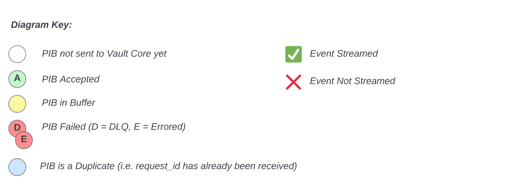

##### Happy path - ACCEPTED

The below are scenarios that relate to PIBs in an ACCEPTED status, which is the happy path scenario whereby data has successfully loaded to the Vault Core DB.

**PIB 1 is ACCEPTED**

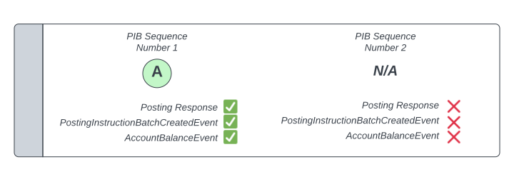

-   *GIVEN* PIB `account_sequence_number` 1 is sent to Vault.
    
-   *WHEN* PIB `account_sequence_number` 1 is processed by Vault and passes all validation steps.
    
-   *THEN* Vault will immediately load to the Vault Core DB and stream out all expected Posting events.
    
-   *NOTE*: This scenario applies to any Posting that is the next `account_sequence_number` for the given `account_id`. So for example if the next sequence number is '3' and PIB 3 is submitted and the message content is valid then it will be processed immediately in the same manner as the scenario above.
    

**PIB 1 was previously ACCEPTED and a Duplicate PIB 1 is submitted**

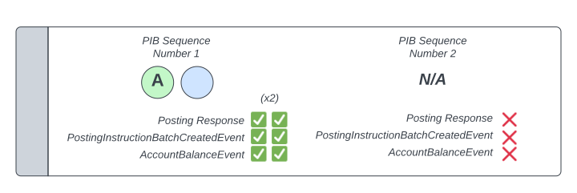

-   *GIVEN* PIB `account_sequence_number` 1 was previously sent to Vault and was ACCEPTED.
    
-   *WHEN* a duplicate PIB that meets idempotency rules (i.e. has the same `request_id`) is processed by Vault and reaches the idempotency stage of the posting validation steps.
    
-   *THEN* Vault will stream out all duplicate Posting events. There is nothing on the events themselves that marks them as duplicated - you must consume all streamed events and compare downstream of Vault for any duplicate messages.
    

**PIB 2 is sent to Vault Core before PIB 1 and is placed into the migration buffer**

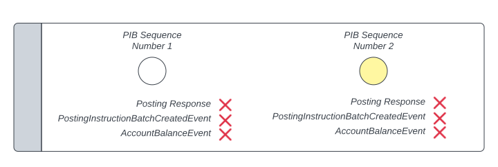

-   *GIVEN* PIB `account_sequence_number` 2 is sent to Vault prior to PIB `account_sequence_number` 1.
    
-   *WHEN* PIB `account_sequence_number` 2 is processed by Vault and reaches the migration buffer.
    
-   *THEN* Vault will keep PIB `account_sequence_number` 2 in the migration buffer as PIB `account_sequence_number` 1 has not yet been sent to Vault. No Posting events will stream out at this stage for PIB `account_sequence_number` 2.
    
-   *NOTE*: The migration buffers works similar to the Data Loader’s concept of Dependencies, whereby messages are held in a pending state and only processed once certain conditions have been met. There is no positive notification that a PIB is being held in the migration buffer or means of querying Vault to check the buffer, so it is very important that your reconciliations capture requests and responses for all PIB messages and can be used to identify the most recently ACCEPTED `account_sequence_number` for a given `account_id`, which will tell you the PIB `account_sequence_number` that is outstanding to be sent to Vault.
    

**PIB 2 is sent to Vault Core before PIB 1 and is placed into the migration buffer, then PIB 1 is sent to Vault Core**

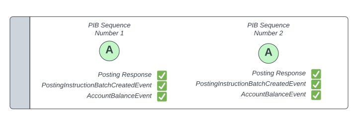

-   *GIVEN* PIB `account_sequence_number` 2 is sent to Vault prior to PIB `account_sequence_number` 1 and was placed into the migration buffer accordingly.
    
-   *WHEN* PIB `account_sequence_number` 1 is sent to Vault and both PIBs pass all validation steps.
    
-   *THEN* Vault will sequentially load the PIBs to the Vault Core Database and stream out all expected Posting events for PIB `account_sequence_number` 1 and 2.
    

##### Unhappy path - DLQ

The below are scenarios that relate to PIBs that have landed on the Posting Migration API request topic DLQ, which is an unhappy path scenario whereby data has now successfully loaded to the Vault Core DB and will need to be investigated and retried.

**PIB 1 is DLQ’ed**

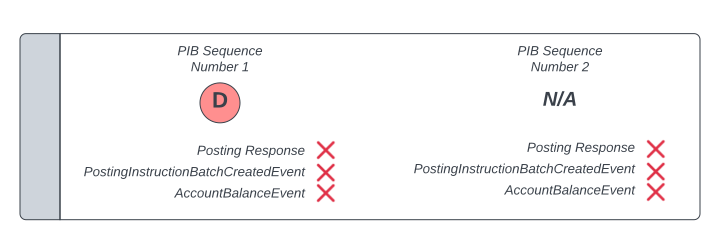

-   *GIVEN* PIB `account_sequence_number` 1 is sent to Vault.
    
-   *WHEN* PIB `account_sequence_number` 1 is processed by Vault and the message cannot be understood.
    
-   *THEN* Vault will put the request message onto the Posting Migration API DLQ topic pending analysis and retry - DLQ’ed messages do not result in any streamed events. When the DLQ’ed message is retried it will be treated as a new message and not subject to normal idempotency rules.
    

**PIB 1 is DLQ’ed and PIB 2 is already in the migration buffer**

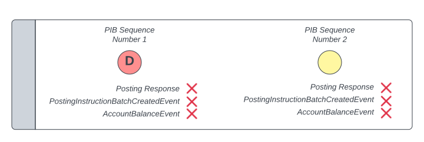

-   *GIVEN* PIB `account_sequence_number` 1 is sent to Vault and PIB `account_sequence_number` 2 is already in the migration buffer.
    
-   *WHEN* PIB `account_sequence_number` 1 is processed by Vault and the message cannot be understood.
    
-   *THEN* Vault will put the request message onto the Posting Migration API DLQ topic pending analysis and retry - DLQ’ed messages do not result in any streamed events. The Account is not 'locked' and PIB `account_sequence_number` 2 will be unaffected by this and will remain in the migration buffer. When the DLQ’ed message is retried it will be treated as a new message and not subject to normal idempotency rules. If it succeeds then PIB `account_sequence_number` 2 will also process.
    

##### Unhappy path - ERROR (Account not locked)

The below are scenarios that relate to PIBs that have ended in an Errored (UNKNOWN) status, which is an unhappy path scenario whereby data has now successfully loaded to the Vault Core DB and will need to be investigated and retried.

Additionally, in this instance the nature of the error is such that the Account has not been 'locked', meaning that any PIBs already in the buffer will remain there and new PIBs can continue to be accepted into the buffer despite the erroring of an earlier PIB. See [Posting Migration API failures and remediation](/vault-core/5-9/EN/environment_and_installation/migrating_to_vault/migrating_using_the_postings_migration_api#posting_apis_failures_remediation_and_retries) section for a list of common error messages and whether they result in the account becoming 'locked'.

**PIB 1 is Errored**

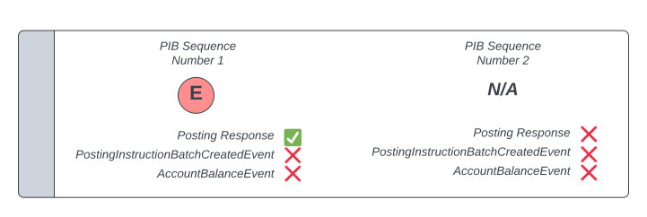

-   *GIVEN* PIB `account_sequence_number` 1 is sent to Vault.
    
-   *WHEN* PIB `account_sequence_number` 1 is processed by Vault and fails a validation step (this is a validation error is one that does not result in the account becoming locked).
    
-   *THEN* Vault will stream a Posting Response event only, including the PIB status of UNKNOWN and associated reason in the appropriate field. When the Errored PIB `account_sequence_number` 1 message is retried it will be treated as a new message and not subject to normal idempotency rules.
    

**PIB 1 is Errored and PIB 2 is already in the migration buffer**

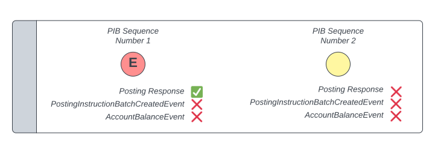

-   *GIVEN* PIB `account_sequence_number` 1 is sent to Vault and PIB `account_sequence_number` 2 is already in the migration buffer.
    
-   *WHEN* PIB `account_sequence_number` 1 is processed by Vault and fails a validation step (this is a validation error is one that does not result in the account becoming locked).
    
-   *THEN* for PIB `account_sequence_number` 1 Vault will stream a Posting Response event only, including the PIB status of UNKNOWN and associated reason in the appropriate field. As the account is not 'locked' as a result of this particular error type then the PIB `account_sequence_number` 2, which is already in the migration buffer, is unaffected and will remain in the buffer until `account_sequence_number` 1 is re-processed correctly. When the Errored PIB `account_sequence_number` 1 message is retried it will be treated as a new message and not subject to normal idempotency rules.
    

**PIB 1 is Errored and PIB 2 is then sent to Vault after this**

-   *GIVEN* PIB `account_sequence_number` 1 is sent to Vault and fails a validation step (this is a validation error is one that does not result in the account becoming locked).
    
-   *WHEN* PIB `account_sequence_number` 2 is sent to Vault after this has happened.
    
-   *THEN* PIB `account_sequence_number` 2 is stored in this buffer and will remain in the buffer until account\_sequence\_number 1 is re-processed correctly. When the Errored PIB `account_sequence_number` 1 message is retried it will be treated as a new message and not subject to normal idempotency rules.
    

##### Unhappy path - ERROR (account locked)

The below are scenarios that relate to PIBs that have ended in an Errored (UNKNOWN) status, which is an unhappy path scenario whereby data has now successfully loaded to the Vault Core DB and will need to be investigated and retried.

Additionally, in this instance the nature of the error is such that the Account has been 'locked', meaning that the buffer has been flushed and only the next expected `account_sequence_number` (the account watermark) will be accepted and unlock the account - all other PIBs sent until this is done will error. See [Posting Migration API failures and remediation](/vault-core/5-9/EN/environment_and_installation/migrating_to_vault/migrating_using_the_postings_migration_api#posting_apis_failures_remediation_and_retries) section for a list of common error messages and whether they result in the account becoming 'locked'.

**PIB 1 is Errored**

-   *GIVEN* PIB `account_sequence_number` 1 is sent to Vault
    
-   *WHEN* PIB `account_sequence_number` 1 is processed by Vault and fails a validation step (this is a processing error is one that does result in the account becoming locked).
    
-   *THEN* Vault will stream a Posting Response event only, including the PIB status of UNKNOWN and associated reason in the appropriate field. This has the effect of 'locking' the `account_id` associated with the PIB from migrating any further Postings until PIB `account_sequence_number` 1 has been ACCEPTED - Postings of a higher PIB `account_sequence_number` will Error per the two examples below until remediated. When the Errored PIB `account_sequence_number` 1 message is retried it will be treated as a new message and not subject to normal idempotency rules.
    

**PIB 1 is Errored and PIB 2 is already in the migration buffer**

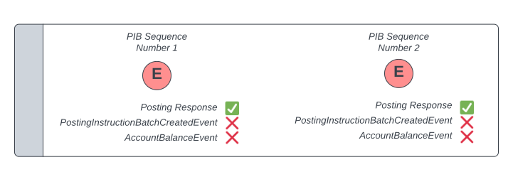

-   *GIVEN* PIB `account_sequence_number` 1 is sent to Vault and PIB `account_sequence_number` 2 is already in the migration buffer.
    
-   *WHEN* PIB `account_sequence_number` 1 is processed by Vault and fails a validation step (this is a processing error is one that does result in the account becoming locked).
    
-   *THEN* for PIB `account_sequence_number` 1 Vault will stream a Posting Response event only, including the PIB status of UNKNOWN and associated reason in the appropriate field. This has the effect of 'locking' the `account_id` associated with the PIB from migrating any further Postings until PIB `account_sequence_number` 1 has been ACCEPTED. PIB `account_sequence_number` 2, which is already in the migration buffer at this time, is immediately moved to an Errored state and a Posting Response only is streamed for this PIB. When the Errored PIB `account_sequence_number` 1 message is retried it will be treated as a new message and not subject to normal idempotency rules. Only after this will PIB `account_sequence_number` 2 can then be resubmitted.
    

**PIB 1 is Errored and PIB 2 is then sent to Vault after this**

-   *GIVEN* PIB `account_sequence_number` 1 is sent to Vault and fails a validation step (this is a processing error is one that does result in the account becoming locked).
    
-   *WHEN* PIB `account_sequence_number` 2 is sent to Vault after this has happened.
    
-   *THEN* for PIB `account_sequence_number` 1 Vault will stream a Posting Response event only, including the PIB status of UNKNOWN and associated reason in the appropriate field. This has the effect of 'locking' the `account_id` associated with the PIB from migrating any further Postings until PIB `account_sequence_number` 1 has been ACCEPTED. PIB `account_sequence_number` 2, which is subsequently sent to Vault after this has happened, is immediately moved to an Errored state and a Posting Response only is streamed for this PIB. When the Errored PIB `account_sequence_number` 1 message is retried it will be treated as a new message and not subject to normal idempotency rules. Only after this will PIB `account_sequence_number` 2 can then be resubmitted.
    

* * *

### Posting APIs idempotency

info

Common behaviour shared by both Posting Migration API and BAU Posting API

Posting Instruction Batches are treated idempotently based on the `request_id`. Specifically:

-   Where a PIB was previously ACCEPTED or REJECTED, submitting another PIB with the same `request_id` will stream out duplicate events (Posting Response, `PostingInstructionBatchCreatedEvent`, `EnrichedPostingInstructionBatchEvent`, `AccountBalanceEvent` , `BalanceEvent` as appropriate depending on status) as were streamed the first time that `request_id` was processed, regardless of the content of the new PIB which is ignored.
    
-   Where a PIB was previously Errored (UNKNOWN status), or landed on the request DLQ, submitting another PIB with the same `request_id` will be treated as a new PIB message and processed as if for the first time. This is because the original PIB was not committed to the Vault Core database.
    

## Posting APIs approaches

* * *

### Posting APIs load sequencing

info

Common behaviour shared by both Posting Migration API and BAU Posting API

Separate from the approach for loading historic postings to Vault Core, you must ensure that the basic [Vault Core logical data model](/vault-core/5-9/EN/environment_and_installation/migrating_to_vault/migrating_using_the_data_loader_api#data_loader_api_resource_dependencies) is adhered to.

For Postings, this means that they can only be loaded when the `account_id` specified in the Posting Instruction Batch is already present in Vault Core. Attempting to load a posting without the associated Account being present will result in a failed load.

#### Sequential

The standard approach for meeting the Account dependency for Postings, is to sequentially load resources in the order defined in the Vault Core logical data model. This means loading Customers (which Accounts are dependent on) and then Account resources prior to attempting the Posting load.

 
| *Benefits* | *Challenges* |
| --- | --- |
| 
Avoids building additional event orchestration / services to act as the 'listener'.

 | 

Discrete Posting event required in event plan, which can only take place once Account load completes.

 |
| 

Posting performance is not limited by speed of Account (i.e. waiting for an `AccountCreatedEvent` response).

 | 

Additional delta account updates may be needed to ensure the account position or data is up to date prior to go-live. This will depend on the overall migration strategy.

 |

#### Orchestrating via Account Events

When banks build their migration pipelines we often see Vault Core’s Streaming API events being used to help orchestrate the migration load; specifically using Account Events as a trigger to commence the Posting load for a given Account.

If using event listeners in this manner then we recommend that you listen to the `AccountUpdatedEvent` as opposed to be `AccountCreatedEvent`, so that postings only start to be loaded once the account resource and any activities that happen from its activation (for example creation of schedules) have completed fully.

From Vault Core 5, this event is consumed from `vault.core_api.v2.accounts.account.events`, though is also available on the `vault.core_api.v1.accounts.account_update.events` topic in the Accounts v1 format.

In the unlikely event that the activation does not complete successfully, the account has no Postings inserted and can therefore be moved to a closed status more easily. Remember the account needs to be zeroed out before it can be closed. This simplifies your Vault Core backout scenario planning.

If you use the `AccountCreatedEvent` to trigger the insertion of historic or balancing postings and then subsequently realise that the activation did not complete; you potentially then need to read the account’s balances and submit another PIB to zero out any positions before attempting to close the account.

 
| *Benefits* | *Challenges* |
| --- | --- |
| 
Removes requirement for a discrete Posting load event.

 | 

Requires additional set up and orchestration that will need to be designed and tested outside of Vault Core.

 |

* * *

### Posting APIs performance optimisation

#### General guidance

info

Common behaviour shared by both Posting Migration API and BAU Posting API

Posting Migration performance can be highly variable depending on your chosen migration environment spec, scope, and strategy. In particular:

-   Whether historic transactions are in scope (as opposed to a balance migration only).
    
-   The number of postings per account, including whether the migration includes High Volume Accounts (HVAs) with disproportionately high numbers of postings for a single account.
    

The Vault Core performance report for GCP [here](/vault-core/5-9/EN/resources/performance_reports/vault_core_performance_report_gcp.html) includes regular migration tests at the bottom of the page which you can use as a benchmark for migration performance on the given environment specification. Contact Thought Machine for more information if required.

The guidance below focuses on production migration performance. For additional performance considerations appropriate for migration testing see [here](/delivery-framework/latest/EN/delivery_workstream/migration/migration_testing#non_functional_testing).

When executing production migrations of postings to Vault Core the following guidance should be followed to ensure consistent and optimal performance throughput.

error

BAU Posting API specific behaviour

##### 1\. Partition PIBs by account\_id

-   All PIBs sent to the Kafka request topic should be keyed by customer `account_id` onto the Kafka partitions.
    
-   Keying by customer `account_id` means that the same Kafka processor will pick up all Postings requests for a given Account, which is important to guarantee ordering as different partitions may work down their backlog at different speeds.
    
-   How you key by `account_id` will depend on the Kafka integration you are using. In kafkacat the command is `-k`.
    

##### 2\. Set PIB shard\_key to the account\_id

-   All PIBs sent to Vault Core should have their `shard_key`, which is a field on the PIB request, set to the `account_id`.
    
-   The `shard_key` is a best-effort lock used within the ledger services to prevent related postings from racings with one another.
    
-   It is not a perfect guarantee, and any Postings sent to Vault Core within milliseconds of one another risk racing - where strict ordering is needed (e.g. migrating multiple stages of an auth chain) then waiting for the Posting Response before sending subsequent chained Postings is the only 100% guarantee.
    
-   Where multiple customer accounts are referenced in a single PIB you can choose any `account_id` in the PIB.
    

##### 3\. Order PIs by value\_timestamp

-   Within your ETL tooling, firstly order all PIs ascending by `value_timestamp`.
    
-   The TPS performance of the migration itself is not impacted by `value_timestamp` ordering. However, if Future Dated Postings (FDPs) are in scope then if these mature (i.e. `value_timestamp` is reached in real time) during the migration event then there will be a temporary TPS impact to any postings being migrated at the same time - ordering by `value_timestamp` is a best effort means of avoiding this for long running migration events.
    

##### 4\. Order PIs by account\_id and structure PIBs to only contain PIs for a single customer account

-   Within your ETL tooling, secondarily order by `account_id` and then construct PIBs that only contain PIs for a single Customer Account.
    
-   The number of PIs per PIB can vary, and though in general this is expected to be a single transaction per PIB, there are options to [structure larger PIBs](/vault-core/5-9/EN/environment_and_installation/migrating_to_vault/migrating_using_the_postings_migration_api#migrating_large_posting_instruction_batches) that may be appropriate.
    

##### 5\. Order PIBs to avoid PIBs for the same customer account being submitted in quick succession

-   Within your ETL tooling, thirdly order all PIBs so that each PIB for a given account is submitted as far away as possible from other PIBs for that account.
    
-   This is because TPS will be lower where an account is 'hot', which is to say many PIBs submitted for the same account in very quick succession. Enabling the High Volume Account feature will lessen this impact, though only if this is being used in BAU as it is impractical to enable solely for the migration.
    
-   This ordering could be achieved using a round-robin sequence (PIB 1 for all accounts, then PIB 2, etc.) if the number of Postings per account is within a tight range, or ideally using weighted fair queuing that takes into consideration the number of PIBs per each and every account and distributes the PIBs evenly across the entire population.
    
    -   See example of weighted fair queuing in practice [here](/vault-core/5-9/EN/resources/wfqexample.zip).
        
    

error

Posting Migration API specific behaviour

##### 1\. Partition PIBs by account\_id

-   All PIBs sent to the Kafka request topic should be keyed by customer `account_id` onto the Kafka partitions.
    
-   Keying by customer `account_id` means that the same Kafka processor will pick up all Postings requests for a given Account, which is important to guarantee ordering as different partitions may work down their backlog at different speeds.
    
-   How you key by `account_id` will depend on the Kafka integration you are using. In kafkacat the command is `-k`.
    

##### 2\. Send Postings distributed across accounts and in chronological order by source\_insert\_timestamp

-   For optimal migration performance you should never:
    
    -   Send Postings for the same account to Vault Core in quick succession (i.e. all Postings for account 1, then all for account 2, etc.). The migrated account effectively becomes a high-volume account and performance will degrade.
        
    -   Send Postings out of `account_sequence_number` (which is also effectively `source_insert_timestamp`) order.
        
    
-   'Sending' as defined here means the order that PIB messages are published onto the Kafka request API.
    
-   Accordingly, you **must** configure your ETL tooling load order to publish requests to the KAfka request topic in a **chronologically ascending order by the `source_insert_timestamp`** (i.e. oldest date first) across the entire population of accounts in scope for migration. This will guarantee the best possible distribution of Postings by account and `source_insert_timestamp` to be processed performantly by Vault Core.
    
-   Note that the `source_insert_timestamp` is the name of the field on the request, which becomes `source_insertion_timestamp` on the Response and other streamed events.
    

#### Migrating large Posting Instruction Batches

info

Common behaviour shared by both Posting Migration API and BAU Posting API

When migrating historic postings there may be a requirement or desire to migrate a large number of Postings or Posting Instructions as part of a single PIB.

**This requirement must be discussed with Thought Machine to analyze the most appropriate PIB sizes for your load profile.**

While migrating a larger number of postings in a smaller number of PIBs is possible, there are factors to be considered that should drive the design of your historic postings load into Vault Core.

1.  *\`client\_id\` and `client_batch_id` are PIB-level fields*
    
    -   While you can construct PIBs with multiple posting instruction types, including PIs relevant to the Auth journey, this may make it more difficult or not possible to correctly chain a migrating authorisation that is one of many posting instructions in the PIB to the settlement that is received after migration.
        
    -   For example, if your `client_id` for migrating postings is `Migration` and your BAU `client_id` is `BAU`, then the settlement will be rejected due to mismatch in `client_id`. These authorisation posting instructions would need to be separately submitted with the correct `client_id` that will be used after migration. It is a similar concept and constraint with `client_batch_id`.
        
    
2.  *Warm-Storage-Inserter lag*
    
    -   Migrating PIBs with a larger number of postings *may* create more lag on updates / insertions into the warm storage, which is used to efficiently service read queries from the Core API. It is important to monitor whether there is warm storage lag during testing, and if so to consider the impact on the migration event.
        
    
3.  *Configuration changes*
    
    -   As PIBs contain ever increasing numbers of PIs, there may be a need to change certain ledger configuration values to ensure optimal performance and avoiding load issues (such as posting fetch limits).
        
    -   Accordingly, engagement with Thought Machine to discuss optimal configuration is important.
        
    
4.  *Insertion\_timestamp*
    
    -   When using Posting Migration API, all postings within a single PIB will have the same `source_insert_timestamp`. This may cause issues after migration (for example, during Contract Simulation or downstream) because the historic insertion time will likely be incorrect for at least one of these postings.
        
    -   To minimise the risk of incorrect insertion times, we suggest dividing the number of PIBs into smaller batches.
        
    

* * *

### Posting APIs metadata

info

Common behaviour shared by both Posting Migration API and BAU Posting API

There is often value in including 'migration metadata' in API requests for migrated Postings.

Migration metadata in this context could mean either; (a) a simple flag that identifies a migrated resource from a BAU one, (b) contextual information about the migration (dates, tranche ids, etc.).

Commonly such metadata would be used by downstream event consumers to distinguish between BAU and Migration messages, and intentionally include / exclude one of the other depending on the use case in question.

#### User provided metadata

**`batch_details`**

Metadata at the Posting Instruction Batch (PIB) level can be added in the request using key:value pairs, for example:

PIB-level metadata streams on Posting Instruction Batch Responses and the `PostingInstructionBatchCreatedEvent`. It does not stream on the `AccountBalanceEvent` or `BalanceEvent`.

**`instruction_details`**

Metadata at the Posting Instruction (PI) level can be added in the request using key:value pairs, for example:

PI-level metadata streams on Posting Instruction Batch Responses, the `PostingInstructionBatchCreatedEvent`, `AccountBalanceEvent` and `BalanceEvent`.

error

BAU Posting API specific behaviour

#### Vault provided metadata

**`migrated` field**

This field will never set to true, or be able to be set to true, for Postings migrated using the BAU Postings API.

This field cannot therefore be used for reconciliations / downstream routing when executing a migration using the BAU Postings APis.

#### User provided metadata

**`enrichments`**

Cannot be passed on the request for Postings migrated using the BAU Postings API.

As the recommendation is to skip Smart Contract execution when migrating using the BAU Postings API, this means the `enrichments` field cannot be migrated into.

error

Posting Migration API specific behaviour

#### Vault provided metadata

**`migrated` field**

The `PostingInstructionBatchCreatedEvent` and `AccountBalanceEvent` messages contain a `migrated` field, which is automatically set to `true` for any Posting request that originated via the Posting Migration API request topic and can distinguish messages originating via these two event streams specifically without the need to set additional metadata in the request.

This field is not present on the Posting Instruction Batch Response, even where the Posting Migration API is used to initiate the request.

This field is not included on the `BalanceEvent`, and this event does not stream where the Posting Migration API is used to initiate the request.

This field is set to false on `PostingInstructionBatchCreatedEvent` and `AccountBalanceEvent` messages for requests originating from all other request topics / methods (i.e. BAU topics).

#### User provided metadata

**`enrichments`**

[Contract Enriched Postings](/vault-core/5-9/EN/reference/contracts/contracts_api_4xx/concepts#posting_instruction_enrichment_2) are a type of metadata at the Posting Instruction (PI) level that are normally (in the BAU state) output only fields added during execution of the Pre-Posting Hook. Their use is optional and will depend on your BAU Product use cases as to whether they are employed.

The Posting Migration API allows you to set enrichments in the request using key:value pairs, for example:

Where Contract Enriched Postings are being used in BAU you can use this object to optionally migrate equivalent values from legacy for migrated Postings.

It is not recommended to use these fields to capture general migration metadata, instead using either `instruction_detail` or `batch_details` for this purpose.

As `enrichments` are PI-level metadata they stream on Posting Instruction Batch Responses, the `PostingInstructionBatchCreatedEvent`, `AccountBalanceEvent` and `BalanceEvent`.

* * *

### Migrating Authorisations using the Posting APIs

info

Common behaviour shared by both Posting Migration API and BAU Posting API

#### Posting types

Across the Vault accounting model there are nine Posting Types, which can be used as part of a Posting Instruction Batch (PIB) request to help define the behaviour of the PIB within Vault. Posting Types are defined in detail in [Posting Instruction types](/vault-core/5-9/EN/reference/postings#posting_instruction_types), but in summary are as follows:

   
| *Posting Type* | *Supported API(s)* | *Description* | *Potential Subsequent PIB Requests in Client Transaction chain (if any)* |
| --- | --- | --- | --- |
| 
`inbound_authorisation`

 | 

BAU Postings API ✅  
Postings Migration API ✅

 | 

Used to authorise incoming funds.

 | 

The client transaction has not concluded and this posting could be followed by:

\- `authorisation_adjustment`  
\- `release`  
\- `settlement`  

 |
| 

`outbound_authorisation`

 | 

BAU Postings API ✅  
Postings Migration API ✅

 | 

Used to authorise outgoing funds.

 | 

The client transaction has not concluded and this posting could be followed by:

\- `authorisation_adjustment`  
\- `release`  
\- `settlement`

 |
| 

`authorisation_adjustment`

 | 

BAU Postings API ✅  
Postings Migration API ✅

 | 

Used to adjust a previously created outbound or inbound authorisation’s amount

 | 

The client transaction has not concluded and this posting could be followed by:

\- `authorisation_adjustment`  
\- `release`  
\- `settlement`

 |
| 

`settlement`

 | 

BAU Postings API ✅  
Postings Migration API ✅

 | 

Used to clear funds pre-authorised by either an outbound authorisation or an inbound authorisation

 | 

The client transaction has not concluded and this posting could be followed by:

\- `release` (see note below)  
\- `settlement` (see note below)  
\- `authorisation_adjustment` (see note below)

 |
| 

`release`

 | 

BAU Postings API ✅  
Postings Migration API ✅

 | 

Used to release previously authorised funds.

 | 

This is the final posting that can be made against an open client transaction and closes the transaction chain

 |
| 

`inbound_hard_settlement`

 | 

BAU Postings API ✅  
Postings Migration API ✅

 | 

Used to apply funds to an account that have not been previously authorised

 | 

Client transaction is in a final/immutable state and cannot change

 |
| 

`outbound_hard_settlement`

 | 

BAU Postings API ✅  
Postings Migration API ✅

 | 

Used to withdraw funds from an account without authorising them

 | 

Client transaction is in a final/immutable state and cannot change

 |
| 

`transfer`

 | 

BAU Postings API ✅  
Postings Migration API ❌  
*Although not supported natively by the Posting Migration API, this could instead be migrated as two hard settlements*

 | 

Used to transfer funds between two accounts in Vault

 | 

Client transaction is in a final/immutable state and cannot change

 |
| 

`custom_instruction`

 | 

BAU Postings API ✅  
Postings Migration API ✅

 | 

Used to apply a set of credits and debits using customer behaviour defined for each use case

 | 

Client transaction is in a final/immutable state and cannot change

 |

chat\_bubble

Note: Except where the settlement is marked as "final" in the PIB request, in which case this is the final posting that can be made against an open client transaction and closes the transaction chain.

In the context of migration programmes, Authorisations (Inbound and Outbound) are a key part of the Vault ledger, and must be taken into consideration when migrating postings from the legacy core, or when recreating the account balance on Vault Core using a balancing posting. Auths can be either:

-   *Outbound Authorisation*: For example when hiring a vehicle, where a customer pays a security deposit in case of damage to the vehicle (the authorisation), and when the vehicle is returned with no damage the authorised funds are released to the customer (the release).
    
-   *Inbound Authorisation*: For example, when a refund is issued from a retailer to a customer via cheque. The depositing of the cheque into the customer’s account represents an inbound authorisation that is then settled when the cheque is cleared.
    

#### Principles

When migrating Authorisations it is important that the following principles are followed:

-   The state of the transaction chain at the point of migration cutover (i.e. reflecting the final position reached on the legacy system in the final source extract) will need to be migrated to Vault. For any product with a concept of Authorisations this means migrating either an Inbound or Outbound auth position where it exists for an account at the point of cutover.
    
-   For a migrated Inbound or Outbound Authorisation to complete the transaction chain on Vault Core post-migration, the `client_id` and `client_transaction_id` must be identical across each Posting Instruction Batch (PIB) in the chain, regardless of whether it was loaded at the point of migration or received post-migration in the BAU state.
    
    -   This means that the `client_id` and `client_transaction_id` set during migration transform must be the same `client_id` and `client_transaction_id` that will be set in BAU after migration (if unsure you should investigate the BAU logic / behaviour to understand how this will be set, and then retrofit the same logic into the migration pipleine).
        
    -   If these IDs have been used consistently then it does not matter which request topic (BAU or Migration) was used to send each element of the transaction chain.
        
    
-   It is recommended that the `client_batch_id` is the same across the transaction chain of linked Posting Instructions Batches to allow for namespacing queries using this id. This is not strictly necessary for migration to execute successfully.
    
-   Bearing in mind the recommended guidance already stated for all Posting Instruction types in the [Posting Migration performance optimisation](/vault-core/5-9/EN/environment_and_installation/migrating_to_vault/migrating_using_the_postings_migration_api#posting_apis_performance_optimisation) section, in the context of Authorisations it is also very important to ensure that all authorisations within a transaction chain are submitted into the Vault Core ledger in the order in which they were processed on the legacy core:
    
    -   For example, where migrating multiple postings for the same transaction chain, such as an `outbound_authorisation` and an associated `authorisation_adjustment`, then the `outbound_authorisation` Posting must be sent to AND 'processed' by Vault Core BEFORE any subsequent Postings in the chain (in this case the `authorisation_adjustment`) are submitted.
        
    -   If this is not the case then Vault Core may error the `authorisation_adjustment` and reach an incorrect balance position for the Account until remediated.
        
    

error

Posting Migration API specific behaviour

-   If using the Posting Migration API then strict ordering of Authorisations will take place automatically by virtue of the `source_insert_timestamp` ordering provided by this API - though note, you must ensure that the `source_insert_timestamp` and `value_timestamp` of multiple Authorisations in the chain are consistently ordered. If this is not the case (for example `source_insert_timestamp` ordering 1 - 2 - 3 and equivalent `value_timestamp` order is 1 - 3 - 2) then the request will fail and you must instead consider an alternative option:
    
    -   Group all non-final Posting Instructions (for example, `outbound_authorisation` and an associated `authorisation_adjustment`) belonging to a single transaction into one Posting Instruction Batch rather than migrating in separate PIBs - In this case the `value_timestamp` will be the same across all Posting Instructions in the PIB.
        
    -   Adapt your transform rules to combine the effects of multiple PIBs in a single transaction chain - For example, an `outbound_authorisation` of £10 and an associated `authorisation_adjustment` of +£5 can be migrated as a single `outbound_authorisation` of £15. The exact approach taken (grouping of auths and adjustments) will likely be driven by the setup and capabilities of your migration (ETL) pipeline.
        
    

* * *

### Migrating Ledger Balances using the Posting APIs

info

Common behaviour shared by both Posting Migration API and BAU Posting API

Vault Core’s [Ledger Balance](/vault-core/5-9/EN/api/core_api#ledgerbalances) resource allows the retrieval of historic balance positions up to several minutes before the current time (based on Posting insertion timestamps) into the Vault ledger. In practice, Ledger Balances can be used to support the End of Day process, where balance positions strictly related to ledger insertion timestamps (as opposed to Posting value timestamps) are necessary for the operation to run accurately.

From Vault Release 5.0 the [Postings Migration API](/vault-core/5-9/EN/api/postings_api#posting_migration_api) will integrate with the Ledger Balance API, such that migrated Postings will count towards Ledger Balance positions when called. The BAU Postings API has always done so.

error

Posting Migration API specific behaviour

Note that:

-   The `source_insert_timestamp` passed in migrated PIB requests will be used as the insertion time in the operation.
    
-   Ledger Balances can only be called for a time after the migration to Vault has concluded - attempting to call a Ledger Balance position prior to the point of migration to Vault will return a zero balance.
    

* * *

### Preventing BAU Postings when using the Posting Migration API

error

Posting Migration API specific behaviour

An Account cannot accept **any** BAU Postings (either externally or internally generated) until all migrated Postings have finished been loaded using the Posting Migration API.

This limitation exists in order to preserve the monotonically increasing `source_insert_timestamp`.

In this context;

-   'Externally' generated means originating through a request sent on either the BAU Kafka topic or REST API.
    
-   'Internally' generated means originating through any Vault Core operation, such as the Postings resulting from the post-activation hook or a schedule.
    

Once the first BAU Posting is loaded for an account this precludes the use of the Posting Migration API ever again for that Account. It is therefore important to consider how to guarantee that no BAU Postings are made before migration completes and cutover to BAU is ready to take place.

#### Preventing External Postings

External Postings should be prevented by:

-   Primary control: *Limit upstream access to BAU topics for migrated Accounts* - The main control for preventing sending Kafka or REST API calls for BAU Postings between the migrated Account load and migrated Posting load should be external to Vault in your upstream systems.
    
-   Secondary control: *Vault Restriction* - As a second line of control you may choose to add a Vault Core Restriction to prevent Credits and Debits for each migrated Account. This Restriction will only apply to external Postings generated via BAU and not the Posting Migration API, as this inherently skips Restriction checks. To be worthwhile this Restriction should be loaded as soon as possible after Account load (the quickest way to do this is via a listener that loads Restrictions at an Account level following receipt of each individual `AccountCreatedEvent`) and you can set an expiry date on the Restriction request to expire at the point of cutover (this means that a second call to 'end' the Restriction is not required, though does mean that the end time is set in stone on the request and a second call would be required to extend or end earlier than this). It is not recommended to rely solely on this control as this is inefficient and will result in many Rejected Postings for these Accounts.
    

#### Preventing Internal Postings

Internal Postings should be prevented by:

-   *Analysis and control of the Schedules* - Schedules will likely need to be controlled over migrations in any circumstance in order to stop erroneous or duplicative behaviour from taking place. Where Schedules result in Postings being generated these always need to be controlled and either skipped or started after the point of cutover.
    
-   *Analysis and control of the Activation hook* - The post-activation hook is likely to need to be controlled over migrations in any circumstance in order to stop erroneous or duplicative behaviour from taking place. Where the activation hook results in Postings it will need to be skipped and, where absolutely necessary, equivalent Postings made using the Posting Migration API instead.
    

* * *