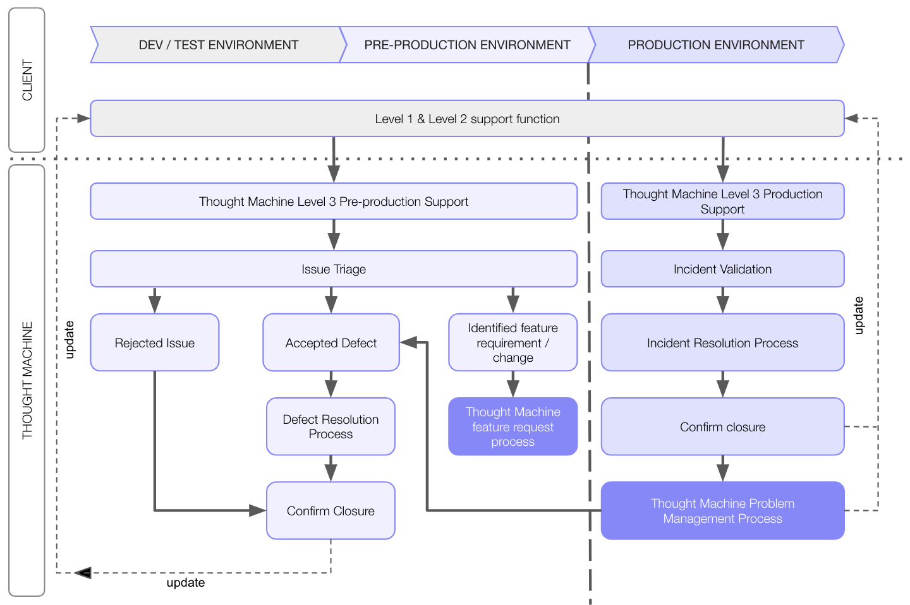
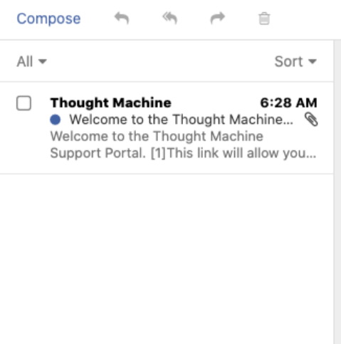
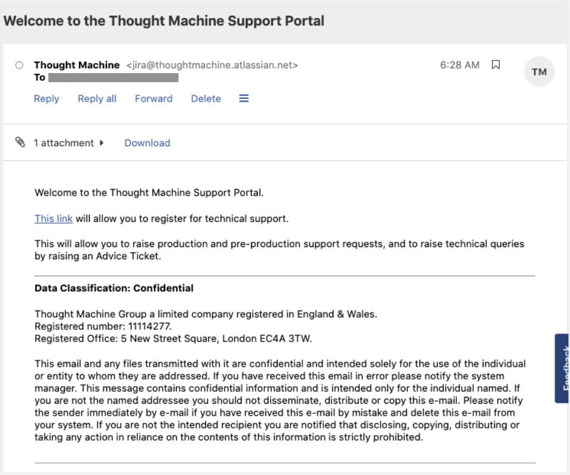
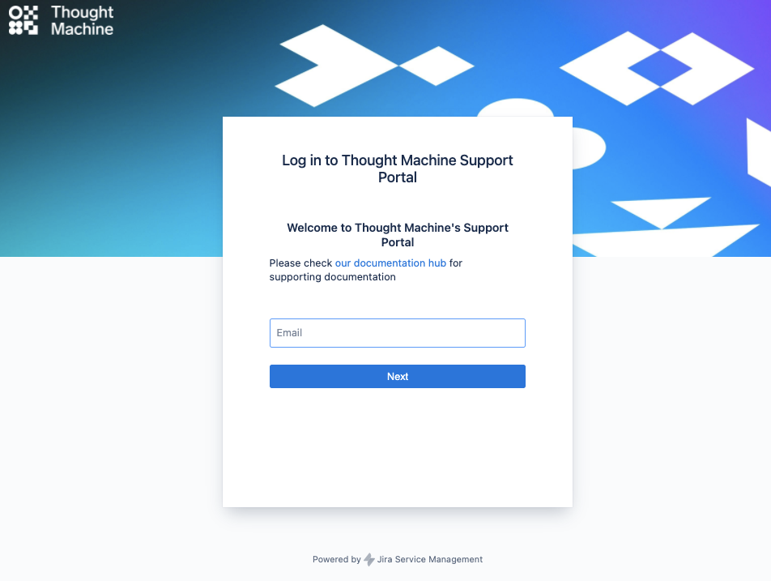
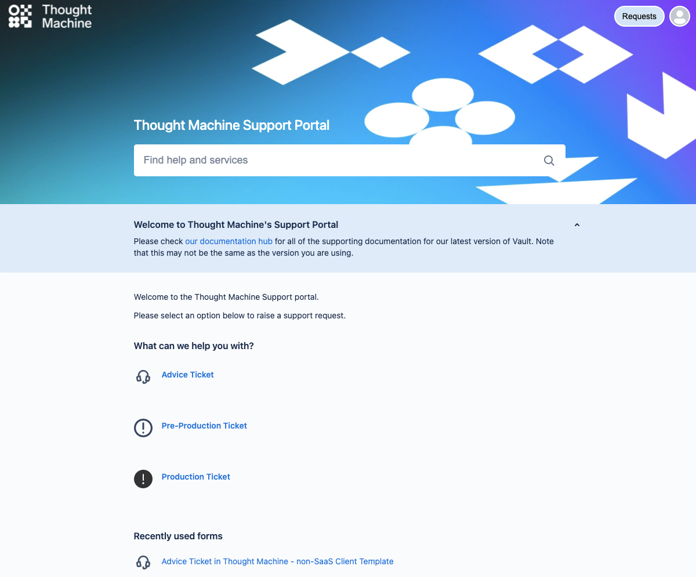
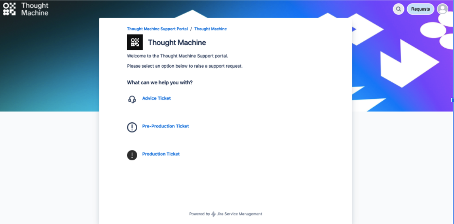
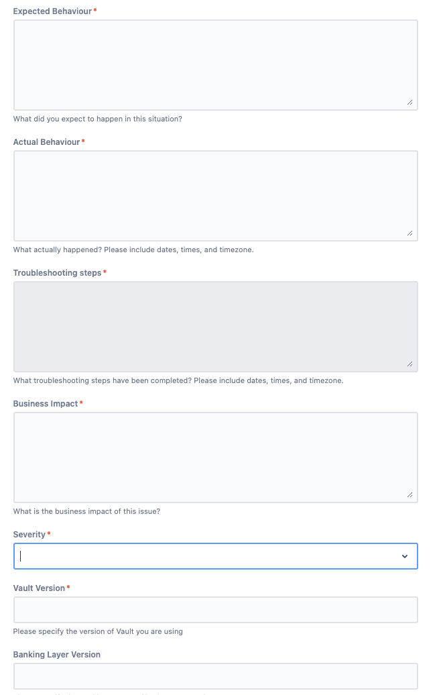
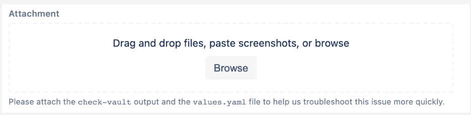

# Service Desk Ways of Working

Registering for and using our customer Service Desk portal to access technical support.

## [](#non_production_and_production_support_process_explained "Copy link to heading")Non-production and production support process explained

A client’s internal Service Desk function performs the first level support and the initial investigation with their internal technical teams.

A support case is logged via the Service Desk portal once it is confirmed that the service or component that has failed needs to be further investigated by Thought Machine.

Your Service Desk portal URL is unique, where you would replace `<client-name>` with your client name.

```
http://<client-name>.support.thoughtmachine.net/
```

You must:

-   Document and provide all relevant information related to the issue, the steps required to recreate the issue, the expected behaviour, and with context of the problem to Thought Machine services (problem/impact statement, any errors observed, screen prints of when the issue occurred).
    
-   Confirm the severity of the incident based on the business impact and urgency.
    
-   Provide contact details for the person(s) handling the issue in case Thought Machine requires further questions, troubleshooting and logs.
    

## [](#non_production_and_production_support_process_workflow "Copy link to heading")Non-production and production support process workflow



## [](#registering_for_technical_support_services "Copy link to heading")Registering for technical support services

For security, all members of a client’s support team must be verified and pre-registered for technical support before they can raise an incident.

chat\_bubble

You cannot raise a new ticket by email. This is a change from our previous ticket system.

Contact your Client Success Manager (CSM) to request access.



### [](#registration_email "Copy link to heading")Registration email

Once the Thought Machine Service Management team has created a Service Desk account for a client support representative, they will receive an email with instructions to complete the registration process.



### [](#register_a_username_and_password "Copy link to heading")Register a username and password

For each client support representative, in order to complete your registration for the Service Desk portal, you can provide the name by which you would like to be known to Thought Machine and a password which you must remember.

Single Sign On (SSO) will not work for the Service Desk; you will need to remember your password if you change computers or use a different browser.



## [](#raising_a_support_request "Copy link to heading")Raising a support request

Use the **Advice Ticket** option for general technical queries relating to Vault Core.

If you believe that there is a problem with Vault Core that is related to a feature or functionality not working as expected or documented, or the availability or performance of the platform, raise a **Pre-Production Ticket**.

A client must first perform its own internal investigation and only then request assistance from Thought Machine.



## [](#service_transition_to_production_status "Copy link to heading")Service transition to Production status

The details supplied with your Service Procedure Manual (SPM) indicate the date when Vault Core is deemed to be 'live' from a support perspective.

This triggers different support coverage as defined in your SPM, such as 24x7 support.

From this date you can raise a **Production Ticket**. This has the highest level of priority, and an engineer will be paged out to assist you.

If you have any questions about this process, contact your Service Manager (SM).



## [](#priorityseverity_business_impact_of_the_issue "Copy link to heading")Priority/Severity - Business impact of the issue

We will handle **Pre-production** and **Advice** tickets on a priority basis and they are not subject to SLA. We aim to triage and close the ticket within three business days.

We will handle **Production** tickets according to the following framework.

Contact your Thought Machine Service Manager if you have any questions.

### [](#maximum_time_for_support_response "Copy link to heading")Maximum time for support response

    
| Severity | Description | Maximum time for support response | Target time to resolve | Hours of coverage at regional hub (London/Singapore/East Coast U.S.) |
| --- | --- | --- | --- | --- |
| 
1 - Critical(S1)

 | 

An error that disables major software functions, causes substantial performance degradation, or results in loss, damage or corruption of data.Difficult workarounds are required to process work and the ability to process work is seriously impaired.

 | 

15 minutes

 | 

4 hours

 | 

24x7

 |
| 

2 - Major(S2)

 | 

An error that results in a measurable loss of functionality and/or performance. The ability to process work is impaired.

 | 

30 minutes

 | 

8 hours

 | 

24x7

 |
| 

3 - Minor(S3)

 | 

An error that has no significant impact and where an acceptable workaround is readily available.

 | 

1 hour

 | 

1 business day

 | 

09.00 - 18.00(Monday - Friday, excluding public holidays)

 |
| 

Support Request

 | 

Product support query and advice

 | 

6 hours

 | 

3 business days

 | 

09.00 - 18.00(Monday - Friday, excluding public holidays)

 |
| 

RCA

 | 

Root Cause Analysis

 | 

N/A

 | 

3 business days

 | 

N/A

 |

## [](#incident_checklist "Copy link to heading")Incident checklist

The more accurate and complete that a client’s support ticket request is, the quicker that the Thought Machine engineers can investigate to help you.

The form presented contains the basic minimum information that we need to open a support case with our engineering teams.

If you do not provide all of the requested information, Thought Machine will request it from you again before engaging the engineering teams. This could delay the resolution of the issue.





## [](#problem_tickets "Copy link to heading")Problem tickets

Problem Management is an ITIL process used at Thought Machine. Its core function is to address the root cause of an issue by taking corrective actions to permanently fix a problem, thus preventing repeat occurrences of an incident.

### [](#when_is_a_problem_ticket_triggered "Copy link to heading")When is a problem ticket triggered?

-   Whereas Incident Management focuses on service restoration, Problem Management is the formal contractual process to track the follow up actions resulting from an incident in which the strategic fix has not been shipped to the client by the time the incident is closed.
    
-   Problem tickets are created at the request of the client following incident closure to track the progress and actions taken in Problem Management.
    

### [](#core_activities_associated_with_managing_a_problem_ticket "Copy link to heading")Core activities associated with managing a problem ticket

-   A Problem Manager (usually the Thought Machine Service Manager) is assigned to the problem ticket to review/drive and coordinate with Thought Machine Engineering teams the resolution of the incident.
    
-   Communicate the progress of problem tickets to the client as agreed (e.g. weekly, monthly) and via monthly/quarterly Service Reviews.
    
-   Obtain Client approval and acceptance of a patch or fix provided by Thought Machine Engineering before closing the problem ticket.
    

## [](#vault_technical_documentation "Copy link to heading")Vault technical documentation

-   Each Vault Core environment comes with a specific set of comprehensive technical documentation for the version of Vault Core that is deployed in that environment.
    
-   The documentation is updated for every release with new features, and details features that are due for deprecation.
    
-   When you access the Vault Portal, select the documentation for the environment you are working with.
    

We require that all external users are onboarded to Okta (Single Sign On) in order to access the Vault Portal. If you need access, or are having issues, raise an advice ticket.