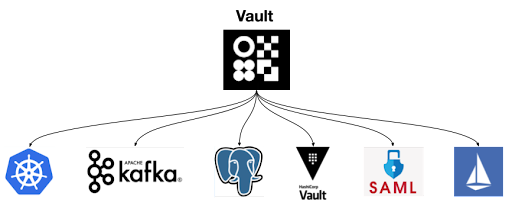

# Infrastructure overview

Bank-hosted

Vault Core’s microservices architecture is designed to be cloud-native, cloud-agnostic, and self-healing, so it can run on different cloud platforms. Vault Core relies on surrounding infrastructure such as Kubernetes, Kafka, PostgreSQL, a secrets manager (such as HashiCorp Vault), and an Observability Stack.

This guide gives a high-level overview of the different components that make up Vault Core. Together, these components create an efficient, scalable, and highly available system that supports modern banking workloads of all sizes.

## Supported components

Vault Core infrastructure leverages open-source and cloud-native technology, including:

-   **Containerisation**: all Vault Core microservices are deployed in Open Container Initiative (OCI)-compliant containers. This streamlines deployments, reduces resource consumption and avoids the complexity of having to configure virtual machines for specific applications.
    
-   **Kubernetes**: Kubernetes container orchestration allows Vault Core to efficiently use compute resources, schedule deployments, and scale horizontally.
    
-   **Distroless Container Images**: lightweight, highly secure container images that only contain the software necessary to run the microservices, and nothing else.
    
-   **Prometheus**: millions of metrics are scraped from Vault Core via Prometheus instances. These can be viewed through Grafana dashboards or exported to other systems.
    
-   **PostgreSQL**: Vault Core relies on PostgreSQL as the single source of truth for all of its data. Postgres is a highly reliable and mature relational database providing the atomicity, consistency, isolation, and durability (ACID) guarantees required to handle financial transactions.
    
-   **HashiCorp Vault (or another supported secrets manager)**: used for cryptographically secure storage of sensitive pieces of data (for example, database passwords or API keys) and Public Key Infrastructure.
    
-   **Istio**: service mesh to ensure network reliability, enforce rate limiting, traffic management and circuit breaking.
    
-   **Kafka**: Vault Core relies on Apache Kafka for its event-driven architecture which guarantees delivery and scale. Subscribing multiple consumers to our Kafka streams enables the bank to operate in real-time.
    

For information about supported components and their versions, see the [Certified Environment matrix for Vault](/vault-core/5-9/EN/environment_and_installation/installationupgrade_and_version_compatibility#certified_environment_matrix_for_vault).

## Deciding on your infrastructure

There are many ways to deploy a Vault Core instance, depending on your bank’s infrastructure and operational requirements.

Configuration instructions differ depending on the components you choose. Visit [Configuring cloud infrastructure](/vault-core/5-9/EN/environment_and_installation/infrastructure_docs/vault_cloud_infrastructure) for more information on deciding where to run your chosen infrastructure components, and how to set them up.

The following components are integral to your bank-hosted deployment:

### Kubernetes

Kubernetes manages the orchestration of Vault Core’s microservices, which are deployed in OCI-compliant containers. Vault Core is designed to run on a Kubernetes cluster, taking advantage of Kubernetes' scalability, automation, and resilience.

The Kubernetes control plane and data plane, as well as the actual microservices running on top of them, are deployed across three availability zones. Traffic is load-balanced across all nodes, ensuring high availability for services and minimising downtime.

See [Configuring Kubernetes in Vault Core](/vault-core/5-9/EN/environment_and_installation/infrastructure_docs/vault_cloud_infrastructure/configuring_kubernetes_in_vault) for more information.

#### Public cloud managed Kubernetes

Vault Core is compatible with Cloud Native Computing Foundation (CNCF) certified Kubernetes implementations. This provides several advantages:

-   Consistency: users want consistency when interacting with any installation of Kubernetes.
    
-   Timely updates: to remain certified, vendors must provide the latest version of Kubernetes annually (or more frequently) to be sure that clients will always have access to the latest features.
    
-   Confirmability: any end user can confirm that their distribution or platform remains conformant by running the identical open source conformance application (Sonobuoy) that was used for certification. AWS, GCP, and Azure managed Kubernetes services are all compatible with Vault Core.
    

#### Public cloud secrets management

Vault Core can take advantage of the container storage interface (CSI) driver to connect to secrets stores.

The Secrets Store CSI Driver allows Kubernetes to mount multiple secrets, keys, and certificates stored in enterprise-grade external secrets stores into their pods as a volume. Once the volume is attached, the data in it is mounted into the container’s file system.

Supported CSIs are:

-   AWS Secrets Manager
    
-   Azure Key Vault
    

#### Public cloud container registries

Container registries store and manage the [software images](/vault-core/5-9/EN/environment_and_installation/infrastructure_docs/tmcomponent_operator_user_guide/installing_or_upgrading_vault#copy_images) that contain the software required to run Vault Core’s microservices. Managed container registries are well supported by the major cloud service providers. You can use any container registry, such as:

-   Amazon Elastic Container Registry
    
-   Google Artifact Registry
    
-   Azure Container Registry
    
-   Other OCI-compliant registries, such as Docker
    

### PostgreSQL

chat\_bubble

You can choose to deploy Vault Core across [multiple physical databases](/vault-core/5-9/EN/environment_and_installation/infrastructure_docs/advanced_deployment_modes/multiple_physical_databases), which enables you to store a larger amount of data and separate workloads across different database instances. See [Configuring multiple databases](/vault-core/5-9/EN/environment_and_installation/infrastructure_docs/vault_cloud_infrastructure/configuring_multiple_databases) for more information.

Acting as the source of truth for Vault Core’s systems, the [relational database](/vault-core/5-9/EN/environment_and_installation/infrastructure_docs/vault_cloud_infrastructure/using_a_relational_database) stores all the logical databases used by Vault Core microservices, such as data related to accounts, balances, and transactions. Vault Core requires a PostgreSQL database.

You can use bank-hosted, open-source PostgreSQL, or a managed Postgres service that is supported by one of the cloud service providers. There are trade-offs between different options:

#### AWS

 
| AWS RDS | AWS Aurora |
| --- | --- |
| 
-   RDS is generally cheaper than Aurora for a given workload.
    
-   Costs are more predictable.
    
-   Resizing the primary instance will result in a short period of downtime while it is rebooted.
    
-   Not recommended for more than 10 million accounts - use Aurora instead.
    

 | 

-   Aurora claims performance improvements of up to 3x over RDS.
    
-   Offers higher durability of data out of the box.
    
-   Better suited to larger workloads.
    
-   Resizing the primary instance will result in a short period of downtime as the instance is rebooted. This can be minimised by creating a correctly scaled replica and failing over to the new instance.
    

 |

Both RDS and Aurora support storage scaling with zero downtime.

#### GCP

 
| Google CloudSQL | Google AlloyDB |
| --- | --- |
| 
-   CloudSQL is generally cheaper than AlloyDB for a given workload.
    
-   Costs are more predictable.
    
-   Changing the number of CPUs or the memory size results in the instance going offline for less than 60 seconds.
    

 | 

-   AlloyDB claims performance improvements of up to 4x over CloudSQL.
    
-   Better suited to larger workloads.
    
-   Supports non-disruptive instance resizing.
    

 |

#### Azure

-   Postgres Flexible Server is fully compatible with Vault Core.
    
-   Resizing the primary instance will result in a short period of downtime while it is rebooted.
    

### Istio

Istio is an open-source service mesh deployed on Kubernetes, managing the communication between services within Vault Core’s microservices-based architecture. It ensures network reliability and enforces rate limiting, traffic management and circuit breaking:

-   Offers a high-level API for establishing and maintaining highly reliable network connectivity between microservices.
    
-   While Kubernetes focuses on reliability of deployments, Istio focuses on reliability of network communications – in a microservice architecture with hundreds or thousands of replicas, network communication is critical.
    
-   Enforces security (mTLS) across the entire fleet of services.
    

You have a few different setup options for Istio. See [Configuring Istio service mesh with Vault Core](/vault-core/5-9/EN/environment_and_installation/infrastructure_docs/vault_cloud_infrastructure/configuring_istio_service_mesh_with_vault) for more information.

### Apache Kafka

Vault Core’s microservices require a Kafka cluster for asynchronous message processing and real-time data streaming. Additionally, the Streaming API uses Kafka to send messages to a series of Kafka topics - these messages are events relating to changes in Vault Core resources, such as accounts, balances, and customers.

You can use a managed Kafka service or a bank-hosted Kafka cluster. To set up a Kafka cluster, you will need to consider your security - namely the type of Certificate Authority to use for Transport Layer Security. See [Configuring Kafka and Vault Core](/vault-core/5-9/EN/environment_and_installation/infrastructure_docs/vault_cloud_infrastructure/configuring_kafka_and_vault) for more information.

### Observability and monitoring

You need to [set up an Observability Stack](/vault-core/5-9/EN/environment_and_installation/infrastructure_docs/observability_and_monitoring/setting_up_the_observability_stack) to observe, monitor, and troubleshoot the performance of Vault Core services via metrics, dashboards, and alerts.

Vault Core ships with the following monitoring tools:

-   **Prometheus**: a monitoring solution that gathers, organises, and stores metrics along with unique identifiers and timestamps. Using a pull-based mechanism for fetching metrics, it captures millions of metrics, including CPU usage, memory usage, request rates and latencies. Multiple Prometheus instances are deployed, but the instances are aggregated to provide a single view.
    
-   **Thanos**: allows you to aggregate metrics data from multiple Prometheus instances and query them from a single endpoint. This can be visualised in Grafana.
    
-   **Grafana**: an analytics and interactive visualisation web application. It provides charts, graphs, and alerts for the web when connected to a supported data source.
    
-   **AlertManager**: receives alerts from Prometheus instances and handles their deduplication, grouping and routing to a receiver integration such as Slack or PagerDuty. The Alertmanager web interface shows information about alert status and allows for temporary suppression of alerts by creating silences.
    

While Vault Core is shipped with the core observability and monitoring tools, you need to set up additional components to enable full functionality. Examples include Fluentd, ElasticSearch and Kibana for logging, Opsgenie or Slack for incident management, and Jaeger for tracing.

### Secrets management

You must use a secrets manager to securely store and protect sensitive information, such as keys and tokens. When deploying Vault Core, the TMComponent Operator generates and stores secrets in the secrets manager.

Vault Core supports the following secrets managers:

-   Vault Core 5.2 and above: Hashicorp Vault, AWS Secrets Manager, and Microsoft Azure Key Vault
    
-   Vault Core 4.6 and above: Hashicorp Vault and AWS Secrets Manager
    
-   Vault Core 4.5: Hashicorp Vault
    

See [Configuring a secrets manager in Vault Core](/vault-core/5-9/EN/environment_and_installation/infrastructure_docs/vault_cloud_infrastructure/configuring_a_secrets_manager_in_vault) for more information.

## Expected infrastructure

This section describes the expected infrastructure used for each supported cloud environment:

### Amazon Web Services (AWS)

  
| Infrastructure component | Development and staging environments | Production and pre-production environments |
| --- | --- | --- |
| 
Kubernetes

 | 

An [Amazon Elastic Kubernetes Service](https://docs.aws.amazon.com/eks/latest/userguide/clusters.html) (EKS) per Vault Core instance

 | 

An [EKS](https://docs.aws.amazon.com/eks/latest/userguide/clusters.html) cluster per Vault Core instance

 |
| 

Kafka

 | 

Bank-hosted or managed Kafka cluster

 | 

Bank-hosted or managed Kafka cluster

 |
| 

Database

 | 

Use Aurora or RDS following the sizing in the [Vault Performance Report](/vault-core/5-9/EN/vault_release_information#performance_report).

 | 

Use Aurora following the sizing in the [Vault Performance Report](/vault-core/5-9/EN/vault_release_information#performance_report).

 |
| 

Secrets Manager

 | 

Hashicorp Vault using the [Bank Vaults Operator](https://github.com/banzaicloud/bank-vaults) on your Kubernetes cluster, or AWS Secrets Manager.

 | 

Hashicorp Vault with a highly available storage backend (such as DynamoDB) or AWS Secrets Manager.

 |
| 

Identity Provider

 | 

Thought Machine expects you to use your existing provider. There is also guidance at [AWS IAM Identity Center](https://aws.amazon.com/iam/identity-center).

 | 

Thought Machine expects you to use your existing provider for production and pre-production.

 |
| 

Service Mesh

 | 

Thought Machine-provided Istio

 | 

Thought Machine-provided Istio

 |
| 

REST access

 | 

-   Ingress controller: use [Istio Ingress Gateway](https://istio.io/latest/docs/tasks/traffic-management/ingress/ingress-control) or an alternative suited to your needs. If using an alternative, we recommend configuring your ingress controller to be inside the Istio service mesh so you can enforce strict mTLS from the edge, however this is [optional](/vault-core/5-9/EN/environment_and_installation/infrastructure_docs/vault_cloud_infrastructure/configuring_istio_service_mesh_with_vault#disable_istio_strict_mtls).
    
-   DNS: use [external DNS](https://github.com/kubernetes-sigs/external-dns/blob/master/docs/tutorials/aws.md) with Route53.
    
-   TLS certificates: use [AWS Certificate Manager](https://aws.amazon.com/certificate-manager) with the ingress controller.
    

 | 

-   Ingress controller: use [Istio Ingress Gateway](https://istio.io/latest/docs/tasks/traffic-management/ingress/ingress-control) or an alternative suited to your needs. If using an alternative, we recommend configuring your ingress controller to be inside the Istio service mesh so you can enforce strict mTLS from the edge, however this is [optional](/vault-core/5-9/EN/environment_and_installation/infrastructure_docs/vault_cloud_infrastructure/configuring_istio_service_mesh_with_vault#disable_istio_strict_mtls).
    
-   DNS: use [external DNS](https://github.com/kubernetes-sigs/external-dns/blob/master/docs/tutorials/aws.md) with Route53.
    
-   TLS certificates: use [AWS Certificate Manager](https://aws.amazon.com/certificate-manager) with the ingress controller.
    

 |

### Microsoft Azure

  
| Infrastructure component | Development and staging environments | Production and pre-production environments |
| --- | --- | --- |
| 
Kubernetes

 | 

An [Azure Kubernetes Service](https://azure.microsoft.com/en-gb/services/kubernetes-service/) (AKS) cluster per Vault Core instance

 | 

An [AKS](https://azure.microsoft.com/en-gb/services/kubernetes-service/) cluster per Vault Core instance

 |
| 

Kafka

 | 

Bank-hosted or managed Kafka cluster

 | 

Bank-hosted or managed Kafka cluster

 |
| 

Database

 | 

Postgres Flexible Server

 | 

Postgres Flexible Server

 |
| 

Secrets Manager

 | 

Hashicorp Vault using the [Bank Vaults Operator](https://github.com/banzaicloud/bank-vaults) on your Kubernetes cluster.

 | 

Hashicorp Vault on a hardened Kubernetes cluster using a highly available storage backend.

 |
| 

Identity Provider

 | 

Thought Machine expects you to use your existing provider. There is also guidance at [Azure Active Directory single sign-on](https://azure.microsoft.com/en-us/services/active-directory/sso/#overview).

 | 

Thought Machine expects you to use your existing provider for production and pre-production.

 |
| 

Service Mesh

 | 

Thought Machine-provided Istio

 | 

Thought Machine-provided Istio

 |
| 

REST access

 | 

-   Ingress controller: use [Istio Ingress Gateway](https://istio.io/latest/docs/tasks/traffic-management/ingress/ingress-control) or an alternative suited to your needs. If using an alternative, we recommend configuring your ingress controller to be inside the Istio service mesh so you can enforce strict mTLS from the edge, however this is [optional](/vault-core/5-9/EN/environment_and_installation/infrastructure_docs/vault_cloud_infrastructure/configuring_istio_service_mesh_with_vault#disable_istio_strict_mtls).
    
-   DNS: use [external DNS](https://github.com/kubernetes-sigs/external-dns/blob/master/docs/tutorials/azure.md) with Azure DNS.
    
-   TLS certificates: use [cert manager](https://cert-manager.io/docs/configuration/acme/dns01/azuredns/) with the ingress controller.
    

 | 

-   Ingress controller: use [Istio Ingress Gateway](https://istio.io/latest/docs/tasks/traffic-management/ingress/ingress-control) or an alternative suited to your needs. If using an alternative, we recommend configuring your ingress controller to be inside the Istio service mesh so you can enforce strict mTLS from the edge, however this is [optional](/vault-core/5-9/EN/environment_and_installation/infrastructure_docs/vault_cloud_infrastructure/configuring_istio_service_mesh_with_vault#disable_istio_strict_mtls).
    
-   DNS: use [external DNS](https://github.com/kubernetes-sigs/external-dns/blob/master/docs/tutorials/azure.md) with Azure DNS.
    
-   TLS certificates: use [cert manager](https://cert-manager.io/docs/configuration/acme/dns01/azuredns/) with the ingress controller.
    

 |

### Google Cloud Platform (GCP)

  
| Infrastructure component | Development and staging environments | Production and pre-production environments |
| --- | --- | --- |
| 
Kubernetes

 | 

A [Google Kubernetes Engine](https://cloud.google.com/kubernetes-engine) (GKE) cluster per Vault Core instance

 | 

A [GKE](https://cloud.google.com/kubernetes-engine) cluster per Vault Core instance

 |
| 

Kafka

 | 

Bank-hosted or managed Kafka cluster

 | 

Bank-hosted or managed Kafka cluster

 |
| 

Database

 | 

Use [AlloyDB](https://cloud.google.com/products/alloydb) or [CloudSQL](https://cloud.google.com/sql/docs/postgres/introduction) following the sizing in the [Vault Performance Report](/vault-core/5-9/EN/vault_release_information#performance_report).

 | 

Use [AlloyDB](https://cloud.google.com/products/alloydb) following the sizing in the [Vault Performance Report](/vault-core/5-9/EN/vault_release_information#performance_report).

 |
| 

Secrets Manager

 | 

Hashicorp Vault using the [Bank Vaults Operator](https://github.com/banzaicloud/bank-vaults) on your Kubernetes cluster.

 | 

Hashicorp Vault using the [Bank Vaults Operator](https://github.com/banzaicloud/bank-vaults) on a hardened Kubernetes cluster with a highly available storage backend (such as a GCS bucket).

 |
| 

Identity Provider

 | 

Thought Machine expects you to use your existing provider. There is also guidance at [Google Cloud Identity](https://cloud.google.com/identity).

 | 

Thought Machine expects you to use your existing provider for production and pre-production.

 |
| 

Service Mesh

 | 

Thought Machine-provided Istio

 | 

Thought Machine-provided Istio

 |
| 

REST access

 | 

-   Ingress controller: use [Istio Ingress Gateway](https://istio.io/latest/docs/tasks/traffic-management/ingress/ingress-control) or an alternative suited to your needs. If using an alternative, we recommend configuring your ingress controller to be inside the Istio service mesh so you can enforce strict mTLS from the edge, however this is [optional](/vault-core/5-9/EN/environment_and_installation/infrastructure_docs/vault_cloud_infrastructure/configuring_istio_service_mesh_with_vault#disable_istio_strict_mtls).
    
-   DNS: use [external DNS](https://github.com/kubernetes-sigs/external-dns/blob/master/docs/tutorials/gke.md) with Cloud DNS.
    
-   TLS certificates: use [Google managed certificates](https://cloud.google.com/load-balancing/docs/ssl-certificates/google-managed-certs#create-ssl) with the ingress controller.
    

 | 

-   Ingress controller: use [Istio Ingress Gateway](https://istio.io/latest/docs/tasks/traffic-management/ingress/ingress-control) or an alternative suited to your needs. If using an alternative, we recommend configuring your ingress controller to be inside the Istio service mesh so you can enforce strict mTLS from the edge, however this is [optional](/vault-core/5-9/EN/environment_and_installation/infrastructure_docs/vault_cloud_infrastructure/configuring_istio_service_mesh_with_vault#disable_istio_strict_mtls).
    
-   DNS: use [external DNS](https://github.com/kubernetes-sigs/external-dns/blob/master/docs/tutorials/gke.md) with Cloud DNS.
    
-   TLS certificates: use [Google managed certificates](https://cloud.google.com/load-balancing/docs/ssl-certificates/google-managed-certs#create-ssl) with the ingress controller.
    

 |

### On-premises

  
| Infrastructure component | Development and staging environments | Production and pre-production environments |
| --- | --- | --- |
| 
Kubernetes

 | 

A [Red Hat OpenShift](https://www.redhat.com/en/technologies/cloud-computing/openshift) cluster per Vault Core instance

 | 

A [Red Hat OpenShift](https://www.redhat.com/en/technologies/cloud-computing/openshift) cluster per Vault Core instance

 |
| 

Kafka

 | 

Bank-hosted or managed Kafka cluster

 | 

Bank-hosted or managed Kafka cluster

 |
| 

Database

 | 

Implementation-specific

 | 

Implementation-specific

 |
| 

Secrets Manager

 | 

Hashicorp Vault using the [Bank Vaults Operator](https://github.com/banzaicloud/bank-vaults) on a hardened Kubernetes cluster using a highly available storage backend.

 | 

Hashicorp Vault on a hardened Kubernetes cluster using a highly available storage backend.

 |
| 

Identity Provider

 | 

Thought Machine expects you to use your existing provider.

 | 

Thought Machine expects you to use your existing provider for production and pre-production.

 |
| 

Service Mesh

 | 

Thought Machine-provided Istio.

 | 

Thought Machine-provided Istio.

 |
| 

REST access

 | 

-   Ingress controller: use [Istio Ingress Gateway](https://istio.io/latest/docs/tasks/traffic-management/ingress/ingress-control) or an alternative suited to your needs. If using an alternative, we recommend configuring your ingress controller to be inside the Istio service mesh so you can enforce strict mTLS from the edge, however this is [optional](/vault-core/5-9/EN/environment_and_installation/infrastructure_docs/vault_cloud_infrastructure/configuring_istio_service_mesh_with_vault#disable_istio_strict_mtls).
    
-   DNS: use your existing DNS provider.
    
-   TLS certificates: use your existing certificate provider.
    

 | 

-   Ingress controller: use [Istio Ingress Gateway](https://istio.io/latest/docs/tasks/traffic-management/ingress/ingress-control) or an alternative suited to your needs. If using an alternative, we recommend configuring your ingress controller to be inside the Istio service mesh so you can enforce strict mTLS from the edge, however this is [optional](/vault-core/5-9/EN/environment_and_installation/infrastructure_docs/vault_cloud_infrastructure/configuring_istio_service_mesh_with_vault#disable_istio_strict_mtls).
    
-   DNS: use your existing DNS provider.
    
-   TLS certificates: use your existing certificate provider.
    

 |