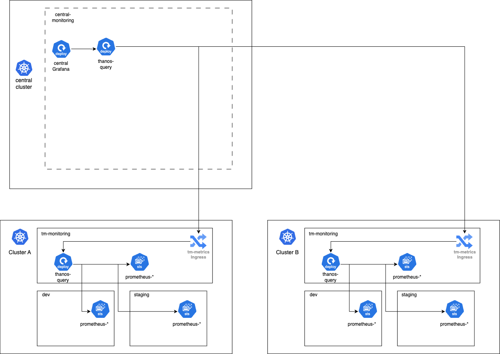
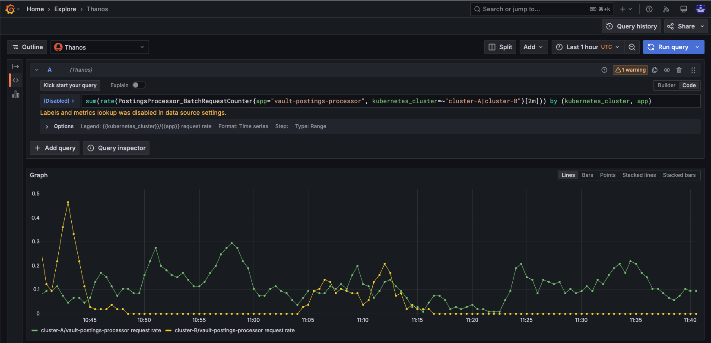
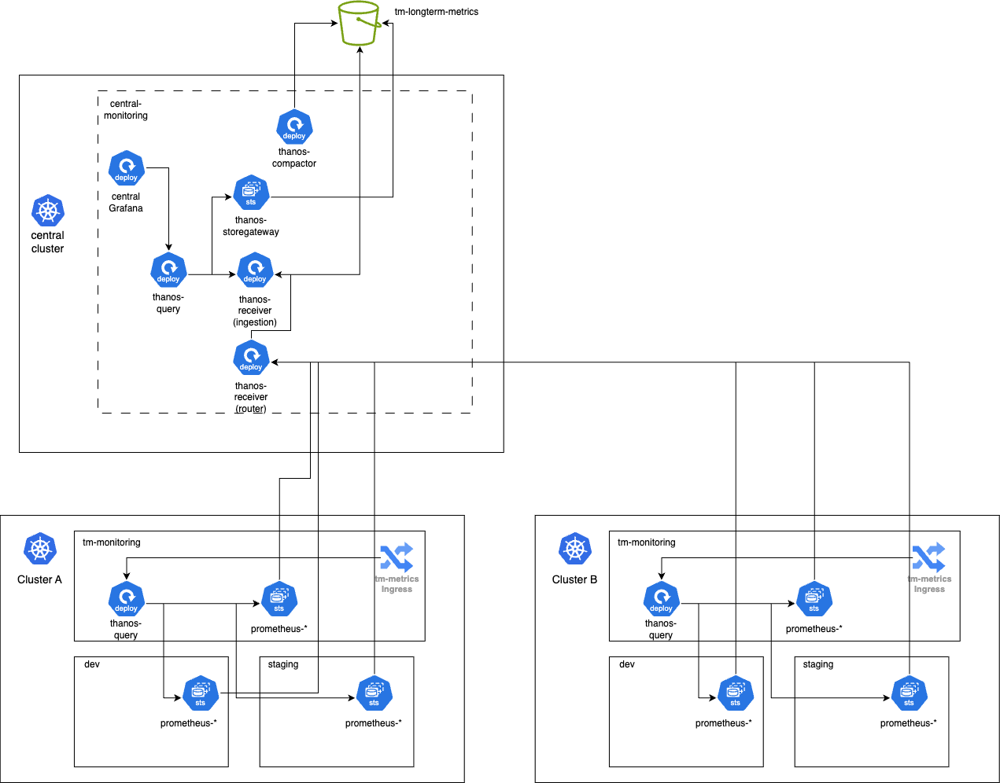

# Multi-instance monitoring

Bank-hosted

## [](#about_this_guide "Copy link to heading")About this guide

### [](#scope "Copy link to heading")Scope

This document provides details on a design for monitoring multiple Vault Core deployments, based on an approach that Thought Machine advises clients to implement. The following proposal focuses on a self-managed central observability cluster using Thanos, which offers greater control and customisation options for organisations with specific requirements or cost considerations.

This document won’t cover the operational part of maintaining one of the proposed approaches to monitoring multi-instance Vault Core installations as each installation could bring different kind of issues or operational load depending on scale, resource usage, data store solution, etc.

This document won’t cover authentication or authorization aspects of the solution nor networking requirements like VPC connections some self-hosted banks may need to set up in order to connect to the Vault Core Kubernetes clusters from an external system.

## [](#before_you_start "Copy link to heading")Before you start

### [](#prerequisites "Copy link to heading")Prerequisites

Before implementing monitoring for multiple Vault Core deployments, review [Setting up the Observability Stack](/vault-core/5-9/EN/environment_and_installation/infrastructure_docs/observability_and_monitoring/setting_up_the_observability_stack) and ensure you understand the components installed as part of the observability component and those installed with the `vault-core` component.

## [](#overview "Copy link to heading")Overview

### [](#default_state "Copy link to heading")Default state

After installing Vault Core, you typically have a single Kubernetes cluster running one or multiple Vault Core instances in different namespaces, along with the following components:

-   `tm-vault` component in each Vault Core namespace.
    
-   `observability` component in the `tm-monitoring` namespace (or a similarly named namespace).
    


Users can monitor multiple Vault Core instances within the same Kubernetes cluster using:

-   Thanos Query ingress in the `tm-monitoring` namespace to discover all Prometheus instances across both Vault Core namespaces and the `tm-monitoring` namespace.
    
-   `kubernetes_namespace` and `kubernetes_cluster` external static labels to filter metrics for specific Vault Core instances on the same cluster.
    

### [](#observability_challenges_in_multi_cluster_vault_core_deployments "Copy link to heading")Observability challenges in multi-cluster Vault Core deployments

In multiple Vault Core installations across different Kubernetes clusters, each cluster stores its observability data locally in a dynamically provisioned PVC (Persistent Volume Claim).

For example, an engineer checking application metrics for a Vault Core instance in the `dev` namespace of Kubernetes `“cluster-A”` queries the ingress at `[https://tm-metrics.k8s-cluster-a.domain.io](https://tm-metrics.k8s-cluster-a.domain.io)`. Comparing this data to a `dev` or `pre-prod` instance in Kubernetes `“cluster-B”` is challenging because each cluster exposes metrics through a different ingress (`[https://tm-metrics.k8s-cluster-b.domain.io](https://tm-metrics.k8s-cluster-b.domain.io)`).

There is no built-in way to aggregate data across clusters, making cross-cluster monitoring and analysis more complex.

## [](#architecture "Copy link to heading")Architecture

### [](#querying_real_time_prometheus_metrics_from_multiple_clusters "Copy link to heading")Querying real-time Prometheus metrics from multiple clusters



To query metrics from multiple Vault Core instances, follow these steps. Use the same pattern applied in the observability component by configuring the Vault Core metrics’ ingresses as the `--endpoint` of the central Thanos instance. This will align with the diagram shown above.

1.  Deploy a Thanos instance in your central monitoring cluster.
    
2.  Set up the Vault Core metrics’ ingresses as the `--endpoint` argument of the central Thanos instance or use the `query.sdConfig` or `query.existingSDConfigmap` parameters when using the Thanos bitnami helm package. This configuration will allow the central Thanos instance to discover all Vault Core instances across clusters.
    
    ```
    Example:
    \`\`\`
    $ query --log.level=warn --query.timeout=10s \\
      --endpoint=tm-metrics.k8s-cluster-A.domain.io:1443 \\
      --endpoint=tm-metrics.k8s-cluster-B.domain.io:1443 \\
      --endpoint=tm-metrics.k8s-cluster-C.domain.io:1443
    \`\`\`
    ```
    
3.  Configure your Grafana instance to point to the newly set up “central Thanos Query” endpoint. This will enable you to view your dashboards and filter metrics by the `kubernetes_cluster` label.
    
4.  With Grafana pointing to the “central Thanos Query” endpoint, you can now create queries comparing different clusters. Group by the `kubernetes_cluster` label to compare data from different clusters in real-time.
    

In the below example we’re querying for metric `PostingsProcessor_BatchRequestCounter` grouping by the label `kubernetes_cluster`



chat\_bubble

This approach is useful for querying real-time metrics from the Prometheus instances via Thanos, but note that Prometheus data typically only stores 1-2 weeks of metrics stored on Prometheus’ StatefulSet’s provisioned PVCs, which means on disk. To query historical data spanning multiple weeks or months, you will need to implement a long-term metrics storage solution. Prometheus TSDB format alone cannot store and query extended historical data.

### [](#querying_and_storing_metrics_from_long_term_data_stores "Copy link to heading")Querying and storing metrics from long term data stores

To store and query metrics from long-term data stores, you need to use the Prometheus remote-write capability included in the observability component to send data to a more complex Thanos deployment.

With this setup, you can query metrics from both real-time Prometheus instances and long-term storage through a single Thanos Query interface. This enables seamless access to recent and historical data for comprehensive monitoring and analysis across multiple Vault Core instances over time.

#### [](#components "Copy link to heading")Components

Thanos provides several components, aside from the Querier, that are essential for this approach:

-   Store: The Store component acts as a gateway to object storage systems like GCS or S3. It implements the Store API, enabling the Query component to seamlessly access both real-time and long-term stored metrics.
    
-   Receiver: The Receiver component ingests Prometheus data in real-time using the remote write protocol. It then stores this data in object storage, enabling long-term retention without affecting the performance of the Prometheus instances.
    
-   Compactor: The Compactor is responsible for compacting, downsampling, and applying retention policies to the data stored in the object storage. This helps optimise storage usage and query performance for long-term data.
    



#### [](#storing_long_term_metrics_using_gcs_or_aws_s3_bucket "Copy link to heading")Storing long-term metrics using GCS or AWS S3 bucket

The [Helm Chart of Thanos](https://bitnami.com/stack/thanos/helm) will be highly useful to bootstrap a long-term storage Thanos deployment. Check out the [README](https://github.com/bitnami/charts/blob/main/bitnami/thanos/README.md) for documentation on which Values file parameters should be used. Here is a non exhaustive list of the components that should be configured.

To set up long-term storage using GCS or AWS S3 buckets, follow the steps below.

1.  Create a bucket in GCS or AWS S3 to store the metrics data.
    
2.  Point the Thanos Store component to your newly created bucket.
    
    Example configuration for GCS:
    
    ```
    objstore:
    type: GCS
    config:
        bucket: "thanos-metrics"
        service\_account: "/path/to/service-account.json"
    ```
    
    Example configuration for AWS:
    
    ```
    objstore:
    type: S3
    config:
        bucket: "thanos-metrics"
        access\_key: "<YOUR\_ACCESS\_KEY>"
        secret\_key: "<YOUR\_SECRET\_KEY>"
        endpoint: "s3.amazonaws.com"
    ```
    
3.  Set up the Thanos Receiver component to accept remote-write requests from Prometheus instances. Ensure that the Receiver stores the data in the same bucket configured for the Thanos Store component.
    
4.  Point the Thanos Compactor to the same bucket as the Thanos Store and Thanos Receiver. Configure retention and downsampling policies as required to manage data efficiently.
    
5.  Modify the Vault Core `` values.yaml` `` file to enable remote write in Prometheus, directing the data to the Thanos Receiver.
    
    Example configuration:
    
    ```
    observability.cluster\_prometheus.remote\_write:
        - {'url': ''https://thanos-receiver.my-central-observability-cluster.domain.io/api/v1/receive'',
        'remoteTimeout': '2m',
        'writeRelabelConfigs': \[{'action': 'keep', 'sourceLabels': \['name'\], 'regex': '.+'}\]}
    observability.namespaced\_prometheus.remote\_write:
        - {'url': ''https://thanos-receiver.my-central-observability-cluster.domain.io/api/v1/receive'',
        'remoteTimeout': '2m',
        'writeRelabelConfigs': \[{'action': 'keep', 'sourceLabels': \['name'\], 'regex': '.+'}\]}
    ```
    
6.  Add the Thanos Store component as an endpoint for the Thanos Query component. This will allow the Thanos Query to access both real-time and historical metrics data.
    

A full list of supported storage clients can be found here: [supported clients](https://thanos.io/tip/thanos/storage.md/#supported-clients).

For further details on how to bootstrap the Thanos deployment, you can refer to the [Helm Chart of Thanos](https://bitnami.com/stack/thanos/helm) and the [README](https://github.com/bitnami/charts/blob/main/bitnami/thanos/README.md) for more information on parameter configuration.