# Using the Observability Stack

Bank-hosted

lightbulb

Vault Core 5.7 introduces the following feature:

-   Support for Opentelemetry Protocol (OTLP) metrics export - see [OTLP metrics export](/vault-core/5-9/EN/environment_and_installation/infrastructure_docs/observability_and_monitoring/using_the_observability_stack#writing_metrics_to_external_storage)
    

chat\_bubble

Vault Core 5.5 introduces the following features:

-   Support for Grafana Enterprise - see [Using Grafana dashboards](/vault-core/5-9/EN/environment_and_installation/infrastructure_docs/observability_and_monitoring/using_the_observability_stack#using_grafana_dashboards)
    
-   [OpenTelemetry collector Agent-Gateway architecture](/vault-core/5-9/EN/environment_and_installation/infrastructure_docs/observability_and_monitoring/using_the_observability_stack#opentelemetry_collector_agent_gateway_architecture) - adopting the agent-gateway architecture to provide a smarter trace sampling policy in which it looks at the full trace and not just at individual spans
    
-   Custom labels for alerts - you can add custom Prometheus labels to alerts generated by the Observability Stack. It enables you to route to your downstream systems and manage Vault Core alerts effectively, so that you can monitor and maintain the ongoing health of Vault Core - see [Using the Observability Stack](/vault-core/5-9/EN/environment_and_installation/infrastructure_docs/observability_and_monitoring/using_the_observability_stack) and [Observability configuration in values.yaml](/vault-core/5-9/EN/environment_and_installation/infrastructure_docs/observability_and_monitoring/setting_up_the_observability_stack#observability_configuration_in_values_yaml)
    

## Using the Observability Stack

### About the Observability Stack functionality

Ingress resources are created by the Vault installer according to the `observability.ingress` values that [you set in `values.yaml`](/vault-core/5-9/EN/environment_and_installation/infrastructure_docs/observability_and_monitoring/setting_up_the_observability_stack#observability_configuration_in_values_yaml). You use these resources to access the web interfaces of the Observability Stack components through your Kubernetes cluster ingress controller.

You can add custom Prometheus labels to alerts generated by the Thought Machine Observability Stack. This allows you to correctly label Vault Core alerts for routing to your downstream systems and manage Vault Core alerts effectively, so that you can monitor and maintain the ongoing health of Vault Core.

You can configure custom labels for each Vault Core instance in [the `values.yaml` file](/vault-core/5-9/EN/environment_and_installation/infrastructure_docs/observability_and_monitoring/setting_up_the_observability_stack#observability_configuration_in_values_yaml) using the value `observability.prometheus.custom_labels` value. The labels MUST comply with the Prometheus label restrictions in the [Prometheus Data Model documentation](https://prometheus.io/docs/concepts/data_model/).

For example, given the alert:

And given the `observability.prometheus.custom_labels` value:

Then, the resulting alert is:

### Observability Stack components and URLs

  
| Functionality | When to use it | URL |
| --- | --- | --- |
| 
[Alerting](/vault-core/5-9/EN/environment_and_installation/infrastructure_docs/observability_and_monitoring/using_the_observability_stack#the_alertmanager_user_interface) (Alertmanager)

 | 

-   View information about Prometheus alerts currently firing in Vault Core.
    
-   Temporarily silence alerts to prevent notifications being sent.
    
-   View the status of your Alertmanager cluster as it handles the routing of alerts in Vault Core.
    

 | 

[https://tm-alertmanager.\\{observability.ingress.domain}](https://tm-alertmanager.\{observability.ingress.domain})

 |
| 

[Metrics](/vault-core/5-9/EN/environment_and_installation/infrastructure_docs/observability_and_monitoring/using_the_observability_stack#metrics_information_for_an_alert) (Thanos/Thanos Query)

 | 

Execute ad hoc PromQL queries against all Prometheus instances.

The Observability Stack retains metrics for a limited time, configurable in `values.yaml`. Retention is controlled by `observability.cluster_prometheus.retention` and `observability.namespaced_prometheus.retention`, and also limited by the storage allocated to the Prometheus instances in `values.yaml`. You can configure Vault Core to send all metrics that you specify to an external service which supports the Prometheus `remote_write` or OpenTelemetry Protocol (OTLP) specification. See: [Writing metrics to external storage](/vault-core/5-9/EN/environment_and_installation/infrastructure_docs/observability_and_monitoring/using_the_observability_stack#writing_metrics_to_external_storage)

 | 

[https://tm-metrics.\\{observability.ingress.domain}](https://tm-metrics.\{observability.ingress.domain})

 |
| 

[Dashboards](/vault-core/5-9/EN/environment_and_installation/infrastructure_docs/observability_and_monitoring/using_the_observability_stack#using_grafana_dashboards) (Manage Dashboards)

 | 

View real-time dashboards for Vault Core. See the note.

 | 

[https://tm-grafana.\\{observability.ingress.domain}](https://tm-grafana.\{observability.ingress.domain})

 |

chat\_bubble

Dashboards

If the value `observability.grafana.auth_anonymous_enabled` in the `values.yaml` file is `false`, you must use the Grafana admin user account to access Grafana.

### Writing metrics to external storage

There are two ways to write metrics to a compatible system that you manage:

-   Using the Prometheus RemoteWrite protocol
    
-   Using the OpenTelemetry Protocol (OTLP) metrics export
    

This enables you to store and manage these metrics as you require - for example, in long-term storage solutions.

If you want to be able to retain and recover your metrics in case of a disaster recovery (DR) scenario, you could include the Prometheus RemoteWrite or the OpenTelemetry Protocol (OTLP) metrics export feature as part of your DR process. You need to establish your own process that takes into consideration your business continuity needs.

#### Using the Prometheus RemoteWrite protocol

RemoteWrite configuration is available from Vault 4.6.0 onwards.

Using this feature sets all Prometheus instances send metrics to a compatible receiver that you have set up.

It lets you allow or block specific metrics by setting the remoteWrite configuration accordingly in the `values.yaml` file.

To implement the RemoteWrite feature, you must configure `observability.cluster_prometheus.remote_write` in `values.yaml` before you install or upgrade Vault, as part of your observability component configuration. For a guide, see: [Observability configuration in values.yaml](/vault-core/5-9/EN/environment_and_installation/infrastructure_docs/observability_and_monitoring/setting_up_the_observability_stack#observability_configuration_in_values_yaml)

Alternatively, if you are considering backing up Prometheus instances, the Prometheus website provides some related information that you may find helpful. For example, under [Prometheus → 3.3 → Storage)](https://prometheus.io/docs/prometheus/3.3/storage/).

#### Using the OpenTelemetry Protocol (OTLP)

OpenTelemetry Protocol (OTLP) metrics export is available from Vault Core 5.7 onwards.

Using this feature sets all OpenTelemetry Collector (agent-otel-collector) instances to send metrics to a compatible OTLP-grpc or OTLP-http receiver, such as a managed service like Datadog, NewRelic, Splunk, Dynatrace, or a self-hosted receiver such as Prometheus3 (with OTLP ingestion enabled) or another OpenTelemetry Collector instance. Not all observability platforms support all types of OTLP metrics—depending on the platform where the metrics are shipped to, you may see warning logs of rejected unsupported metrics. Metrics are shipped with delta temporality.

To implement the OpenTelemetry Protocol (OTLP) metrics export feature, you must configure `metrics.exporters.otlp_endpoint` or `metrics.exporters.otlp_http_config` in `values.yaml` before you install or upgrade Vault Core, as part of your observability component configuration. For a guide, see: [Observability configuration in values.yaml](/vault-core/5-9/EN/environment_and_installation/infrastructure_docs/observability_and_monitoring/setting_up_the_observability_stack#observability_configuration_in_values_yaml)

### Enabling Vertical Pod Autoscaling for observability workloads

Thought Machine provides support for certain Vertical Pod Autoscaling (VPA) configurations, such as Prometheus. For Kubernetes, however, the Observability Stack does not come with Vertical Pod Autoscaling (VPA) enabled by default.

However, Thought Machine provides an optional platform feature, in the form of Kubernetes Custom Resources, that you (a client) can choose to enable yourself.

This configuration allows the Kubernetes Vertical Pod Autoscaler to vertically scale some observability workloads. It allows automatic elasticity, which could help save costs on idle environments and cope with a high load on busy environments.

lightbulb

Where you anticipate a high load on busy environments, consider using the `common.deployment_size` value, which spreads the workload across multiple shards.

Automatic Vertical Scaling works together with `common.deployment_size` sharding. For more information, see [Getting started with Vault Core](/vault-core/5-9/EN/environment_and_installation/infrastructure_docs/getting_started_with_vault_core/deployment_options#deployment_size_setting_in_the_values_yaml_file).

#### Enabling Prometheus sharding for observability workloads

From Vault Core 5.3 and above, Thought Machine supports sharding, which is a method of horizontal scaling that distributes large workloads across multiple shards for a given Prometheus instance. Sharding is useful for high query loads and large volumes of metrics, as each shard is given a smaller, more manageable workload to handle.

Sharding is static, as the number of shards provisioned for a Prometheus instance depends on the `common.deployment_size` parameter. The default value is `medium`, and you can configure this value in the `values.yaml` file.

See [common\_deployment.size](/vault-core/5-9/EN/environment_and_installation/infrastructure_docs/observability_and_monitoring/setting_up_the_observability_stack#common_deployment_size) for details on the supported values and their corresponding number of shards.

#### Considerations

While Thought Machine provides the configuration that allows you to scale observability, there are some implications to consider:

-   Workloads will vertically scale up and down automatically, based on load.
    
-   The value of the `common.deployment_size` parameter defines the number of shards provisioned for a Prometheus instance.
    
-   You are responsible for managing your VPA installation.
    
-   You must meet the prerequisites to ensure that you can enable and use this feature.
    

#### Prerequisites for enabling Vertical Pod Autoscaling

The following is required if you want to enable this configuration.

You must:

-   install and manage the installation of the optional VPA component, [VPA autoscaler version 1.1 or later](https://github.com/kubernetes/autoscaler/tree/master/vertical-pod-autoscaler#compatibility), on your cluster
    
-   configure the Kubernetes Vertical Pod Autoscaler on your platform - you can follow the documentation as appropriate to the Cloud Service Provider that you use, see [Google documentation](https://cloud.google.com/kubernetes-engine/docs/concepts/verticalpodautoscaler), [AWS documentation](https://docs.aws.amazon.com/eks/latest/userguide/vertical-pod-autoscaler.html), or [Azure documentation](https://learn.microsoft.com/en-us/azure/aks/vertical-pod-autoscaler)
    
-   enable the Kubernetes Custom Resources configuration - you must change the default setting is `false` to `true` for the `observability.provision_vertical_autoscaling_configs` [observability configuration value](/vault-core/5-9/EN/environment_and_installation/infrastructure_docs/observability_and_monitoring/setting_up_the_observability_stack#observability_configuration_in_values_yaml) in `values.yaml`
    
-   allow scaling of observability workloads by configuring the `vpa updater` component/deployment to allow scaling of single-replica workloads
    

##### Example of configuring the vpa updater

chat\_bubble

If you have any queries about the configuration settings for the observability component, contact Thought Machine support. For queries regarding installing and configuring the Kubernetes component, consult your cloud service provider’s documentation.

## Using Alertmanager

Alertmanager is one of several [Observability Stack components](/vault-core/5-9/EN/environment_and_installation/infrastructure_docs/observability_and_monitoring/using_the_observability_stack#about_the_observability_stack_functionality). You can use it to:

-   view information about Prometheus alerts currently firing in Vault Core
    
-   temporarily silence alerts to prevent notifications
    
-   view the status of your Alertmanager cluster as it handles the routing of alerts in Vault Core
    

For an examples of configuring a Slack receiver or Blackhole receiver to send you alerts, refer to the [Alertmanager example configurations](/vault-core/5-9/EN/environment_and_installation/infrastructure_docs/observability_and_monitoring/using_the_observability_stack#alertmanager_example_configurations).

If you receive an alert for a DLQ, you should check Alertmanager and the [metadata fields present in all Alertmanager alerts](/vault-core/5-9/EN/environment_and_installation/infrastructure_docs/observability_and_monitoring/using_the_observability_stack#metadata_fields_present_in_all_alertmanager_alerts), and cross-reference it with the list of [DLQ Alerts](/vault-core/5-9/EN/environment_and_installation/infrastructure_docs/observability_and_monitoring/using_the_observability_stack#dlq_alerts).

### The Alertmanager user interface

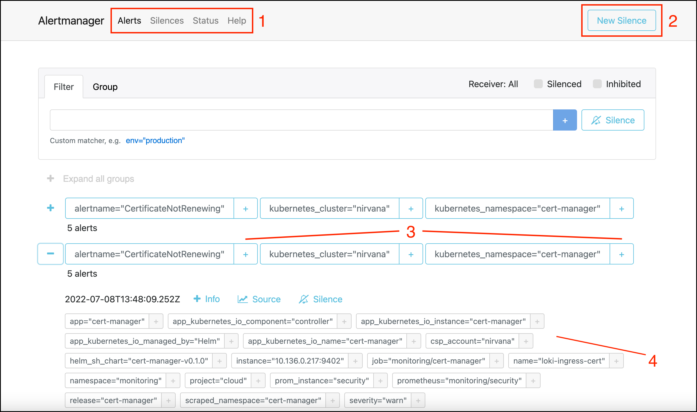

#### Explaining the Alertmanager user interface

 
| UI area | Description |
| --- | --- |
| 
*1*

 | 

The top-level menu provides access to the **Alerts**, **Silences**, **Status** and **Help** areas.

-   **Alerts** shows all alerts received by Alertmanager, grouped according to the `group_by` parameter [defined in your Alertmanager configuration](/vault-core/5-9/EN/environment_and_installation/infrastructure_docs/observability_and_monitoring/setting_up_the_observability_stack#observability_configuration_in_values_yaml). If Alertmanager is not currently receiving any firing alerts or silences are suppressing all alerts, it displays **No alert groups found**.
    
-   **Silences** shows all silenced alerts.
    
-   **Status** shows the alert’s uptime, cluster name, status, peers and other details.
    

To learn more about alerts, silences, metrics, alert metadata fields, rules and labels, see:

-   [Alert silence fields](/vault-core/5-9/EN/environment_and_installation/infrastructure_docs/observability_and_monitoring/using_the_observability_stack#alert_silence_fields)
    
-   [Metadata fields present in all Alertmanager alerts](/vault-core/5-9/EN/environment_and_installation/infrastructure_docs/observability_and_monitoring/using_the_observability_stack#metadata_fields_present_in_all_alertmanager_alerts)
    
-   [Observability Stack contents](/vault-core/5-9/EN/environment_and_installation/infrastructure_docs/observability_and_monitoring/using_the_observability_stack#observability_stack_artefacts)
    
-   [DLQ Alerts](/vault-core/5-9/EN/environment_and_installation/infrastructure_docs/observability_and_monitoring/using_the_observability_stack#dlq_alerts)
    

 |
| 

*2*

 | 

Click **New Silence** to silence an alert and prevent its display in a third-party incident management or communication system such as PagerDuty or Slack. Examples of when you might use this are:

-   During planned maintenance windows, such as cluster upgrades.
    
-   To acknowledge alerts that an engineer is currently actioning.
    

You are directed to a page where you complete information about silencing the alert. For more information, see [Alert silence fields](/vault-core/5-9/EN/environment_and_installation/infrastructure_docs/observability_and_monitoring/using_the_observability_stack#alert_silence_fields).

 |
| 

*3*

 | 

Click the **+** button beside the name of an alert, cluster or namespace to view extra data associated with that particular firing alert.

 |
| 

*4*

 | 

The extra information about a particular firing alert. Click on [**Source**](/vault-core/5-9/EN/environment_and_installation/infrastructure_docs/observability_and_monitoring/using_the_observability_stack#metrics_information_for_an_alert) to view metrics information for that alert.

 |

chat\_bubble

You can directly query the time-series data collected by the Metrics component [using PromQL (Prometheus Query Language)](https://prometheus.io/docs/prometheus/latest/querying/basics/).

### Alertmanager example configurations

For up to date information please refer to the *General receiver-related settings* section of the official [Alertmanager configuration documentation](https://prometheus.io/docs/alerting/latest/configuration/).

chat\_bubble

Alertmanager supports a number of specific receiver integrations and below are only a handful examples of that. We strongly advise to refer to official Alertmanager documentation to for a full list of integrations available and for to date information.

#### Blackhole receiver

This is the default configuration in the `values.yaml` file; the alert status is visible only in the Alertmanager web UI.

#### Slack receiver

You could use this configuration to route all alerts to a single Slack channel; this sends all alerts to #vault-alerts, delivered in batches grouped by the alert name and originating Kubernetes namespace.

chat\_bubble

The following example configuration mentions HashiCorp Vault; however, Thought Machine supports other secret managers as of Vault Core 4.6, as detailed in the infrastructure and installation guidance. Refer to your secrets manager’s own documentation for information about integrations, including for Alertmanager and Slack.

#### HTTP config

An http\_config allows configuring the HTTP client that the receiver uses to communicate with HTTP-based API services. Example configuration to send alerts to OpsGenie:

#### Webhook config

The webhook receiver allows configuring a generic receiver. There is a list of webhook receiver integrations available as defined in *Alertmanager Webhook Receiver* section of the official [Alertmanager configuration documentation](https://prometheus.io/docs/operating/integrations/). Example integration is for JIRAlert:

### Alert silence fields

 
| Field | Description |
| --- | --- |
| 
StartDurationEnd

 | 

Define the time period covered by the silence.

 |
| 

Matchers

 | 

One or more Prometheus field key/value pairs that are used to match against firing alerts. You can use any Prometheus label or annotation as a matcher, including the alert name which can be matched using the key: \`alertname\`You can also use Regex in the matcher value by selecting the **Regex** radio button.

 |

chat\_bubble

Alertmanager uses RE2 syntax for regular expressions.

### Metrics information for an alert

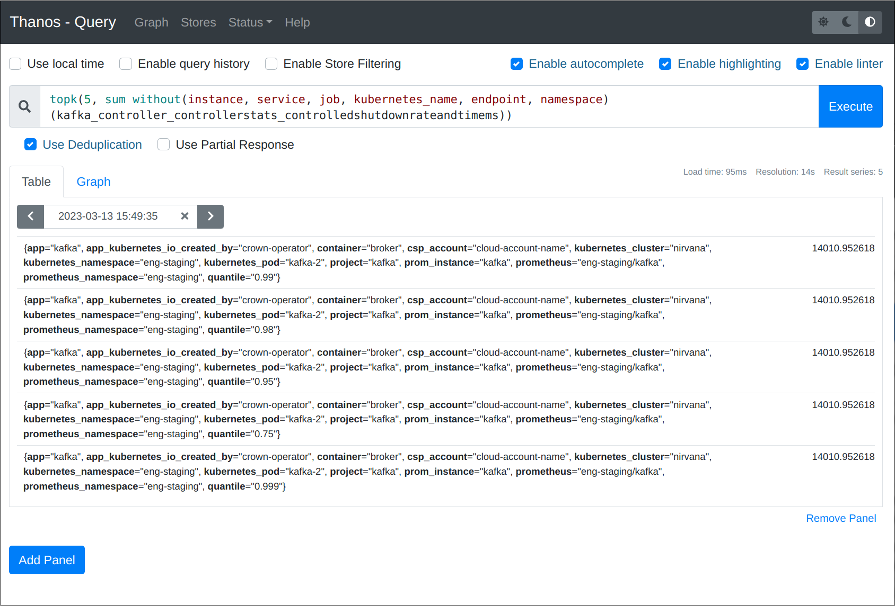

The example image shows the user interface including options for **Enable query history**, **Execute**, **deduplication**, **partial response**, **Graph** and **Table** tabs, and **Element** information.

chat\_bubble

For information about PromQL language, see [Querying Basics on the Prometheus website](https://prometheus.io/docs/prometheus/latest/querying/basics/).

### Metadata fields present in all Alertmanager alerts

chat\_bubble

You can use these metadata fields in your Alertmanager receiver configuration to de-duplicate, inhibit, silence and group alerts sent to Alertmanager receivers such as PagerDuty.

   
| Prometheus field name | Prometheus field type | Data type | Description |
| --- | --- | --- | --- |
| 
`summary`

 | 

Annotation

 | 

String

 | 

Alert name and a high-level summary of the event that is triggering the alert.

 |
| 

`source`

 | 

Annotation

 | 

String

 | 

Unique identifier for the source of the alert.

 |
| 

`severity`

 | 

Label

 | 

String

 | 

Severity of the alert.

 |
| 

`component`

 | 

Annotation

 | 

String

 | 

The Vault Core microservice that is affected by the alert.

 |
| 

`group`

 | 

Annotation

 | 

String

 | 

Higher-level grouping of the functionality that is affected by the alert.

 |

#### Alerting rules versus recording rules

Rules of type `alert:` are alerting rules which send alerts and, as such, each has a `severity` assigned, among other possible annotations. Rules of type `record:` are recording rules and do not have a severity, team, `for`, or any annotations. To learn about the differences between alerting rules and recording rules, see the [Prometheus documentation](https://prometheus.io/docs/prometheus/latest/configuration/recording_rules/#rule).

### DLQ Alerts

Here, you can view a list of common DLQ (Dead Letter Queue) alerts that Thought Machine has configured and the specific [DLQs](/vault-core/5-9/EN/reference/dlq) it associated with them.

You must [use Alertmanager to configure the alerts](#using_alertmanager_setting_up_alerts) that you wish to receive (and any you might want to silence) and actively monitor DLQs for new messages.

If you receive a DLQ alert, you should attempt to [investigate and remediate the issue](#investigating_dlq_alerts_and_errors) in the first instance.

chat\_bubble

This is not intended as a list of all DLQs. To learn more about DLQs, see the [DLQs Overview](/vault-core/5-9/EN/reference/dlq) and [DLQ Inspector](/vault-core/5-9/EN/reference/core_apps_and_operations_dashboard/dlq_inspector) documentation. It explains the naming and message format of DLQs, how to monitor, recover, and read messages from a DLQ.

#### Using Alertmanager and setting up alerts for DLQs

You can use the [Alertmanager component included in the Observability Stack](/vault-core/5-9/EN/environment_and_installation/infrastructure_docs/observability_and_monitoring/using_the_observability_stack#about_the_observability_stack_functionality) to view information about Prometheus alerts currently firing in Vault Core. You can also use the [metadata fields present in all Alertmanager alerts](/vault-core/5-9/EN/environment_and_installation/infrastructure_docs/observability_and_monitoring/using_the_observability_stack#metadata_fields_present_in_all_alertmanager_alerts) to monitor DLQs and investigate any errors. For more information, see:

-   [The Alertmanager user interface](/vault-core/5-9/EN/environment_and_installation/infrastructure_docs/observability_and_monitoring/using_the_observability_stack#the_alertmanager_user_interface)
    
-   allows you to configure settings for alerts, monitor alerts, and view detailed information about all alerts that it receives
    
-   [Alertmanager example configurations](/vault-core/5-9/EN/environment_and_installation/infrastructure_docs/observability_and_monitoring/using_the_observability_stack#alertmanager_example_configurations)
    
-   example Alertmanager configurations if you wish to use a Blackhole receiver or Slack receiver to send you alerts
    

#### Investigating DLQ alerts and errors

In many cases, a message being placed on a DLQ represents a critical processing error which requires immediate attention.

If you receive an alert for a DLQ: 1. Check the DLQ alert in Alertmanager, cross-referencing it with this list. 2. Identify if there is a specific DLQ with the error, checking the summary and metadata for the alert in Alertmanager. You should be able to the component (Vault Core microservice) that is affected by the alert. 3. Investigate any errors. The API documentation contains information about the DLQs for each API and some DLQ alerts in this list contains a link to its associated API and DLQ documentation. This can include the processing that occurs, the impact of a message being placed on that DLQ, and potential recovery steps to follow. 4. Attempt to resolve the error by following the associated remediation information, unless the advice in our guides states otherwise. If you are unable to resolve the error, contact Thought Machine for support.

##### Useful pages

-   [DLQs Overview](/vault-core/5-9/EN/reference/dlq)
    
-   [DLQ Inspector](/vault-core/5-9/EN/reference/core_apps_and_operations_dashboard/dlq_inspector) documentation
    
-   [APIs](/vault-core/5-9/EN/api) - the API documentation contains information about the available DLQs and topics for each API
    

#### DLQ Alerts

chat\_bubble

-   This is a list of DLQ alerts that Thought Machine has configured - it is not a list of all available DLQs.
    
-   In Vault Core 5.0+, Thought Machine has removed the following DLQ Alerts, as these are no longer required: `NewMessagesInBalancesDLQ` and `NewMessagesInPostingAccountPostingsDLQ`
    

#### NewMessagesInAuditLogsDLQ

 
| DLQ names | Severity |
| --- | --- |
| 
vault.core.audit.logs.dlq

 | 

Error

 |

#### NewMessagesInStreamAPIDLQ

 
| DLQ names | Severity |
| --- | --- |
| 
vault.api.v1.accounts.account.created.failures

 | 

Error

 |
| 

vault.api.v1.accounts.account.status.updated.failures

 | 

Error

 |
| 

vault.api.v1.customers.customer.created.failures

 | 

Error\*

 |
| 

vault.api.v1.products.product\_version.created.failures

 | 

Error

 |
| 

vault.api.v1.workflows.workflow\_instance.create.requests.failures

 | 

Error

 |
| 

vault.api.v1.products.product\_version.parameter.updated.failures

 | 

Error

 |
| 

vault.api.v1.workflows.workflow\_instance.external\_operation.requests.failures

 | 

Error

 |
| 

vault.api.v1.workflows.workflow\_instance.external\_operation.responses.failures

 | 

Error

 |
| 

vault.api.v1.accounts.account.instance\_param\_vals.updated.failures

 | 

Error

 |
| 

vault.api.v1.audit\_logs.audit\_log.created.failures

 | 

Error

 |
| 

vault.api.v1.action\_logs.action\_log.created.failures

 | 

Error

 |
| 

vault.api.v1.customers.customer.customer\_details.updated.failures

 | 

Error

 |
| 

vault.api.v1.postings.posting\_instruction\_batch.created.failures

 | 

Error

 |

chat\_bubble

\*For `vault.api.v1.customers.customer.created.failures`, see the [Customer events DLQ documentation](/vault-core/5-9/EN/api/core_api#customer_events_dlqs).

#### NewMessagesInSchedulerOutcomesDLQ

 
| DLQ names | Severity |
| --- | --- |
| 
scheduler.jobs.outcomes.dlq

 | 

Error

 |

#### NewMessagesInPostingsAsyncOperationsDLQ

 
| DLQ names | Severity |
| --- | --- |
| 
vault.core.postings.async\_operation.events.async\_processor.dlq

 | 

Error

 |

#### NewMessagesInLedgerBalancesDLQ

 
| DLQ names | Severity |
| --- | --- |
| 
vault.core.posting\_instruction\_batch.created.event.bucket\_processor.dlq

 | 

Error

 |
| 

vault.core.ledger\_balances.global\_watermarks.distribution\_processor.dlq

 | 

Error

 |
| 

vault.core.ledger\_balances.bucket\_processor.heartbeat.watermark\_calculation\_processor.dlq

 | 

Error

 |
| 

vault.core.ledger\_balances.account\_watermarks.accumulator.dlq

 | 

Error

 |

#### NewMessagesInBottomlineIntegrationDLQ

 
| DLQ names | Severity |
| --- | --- |
| 
vault.integrations.payments.fps.inbound.requests.dlq

 | 

Error

 |
| 

vault.integrations.payments.fps.outbound.responses.dlq

 | 

Error

 |
| 

vault.integrations.payments.fps.inbound.standin.requests.dlq

 | 

Error

 |
| 

vault.integrations.payments.fps.inbound.usm.dlq

 | 

Error

 |

chat\_bubble

These topics are associated with the `NewMessagesInBottomlineIntegrationDLQ` alert; they only exist if you are using the Thought Machine Bottomline connector. For more information or in the event of an error, see the [Payments Hub DLQs documentation](/vault-core/5-9/EN/api/payments_hub_api#dlqs).

#### NewMessagesInCreditTransferDLQ

 
| DLQ names | Severity |
| --- | --- |
| 
vault.payment\_hub.posting.responses.credit\_transfer.dlq

 | 

Error

 |
| 

vault.payment\_hub.v1.credit\_transfer.schedule\_job.requests.dlq

 | 

Error

 |
| 

vault.payment\_hub.payment\_events.v1.credit\_transfer\_reversal\_processor.dlq

 | 

Error

 |
| 

vault.payment\_hub.credit\_transfers.posting\_instruction\_batch.responses.dlq

 | 

Error

 |
| 

vault.payment\_hub\_api.v1.payments.payment.events.credit\_transfer\_reversal\_processor.dlq

 | 

Error

 |
| 

vault.payment\_hub\_api.v1.payments.payment\_action.events.form3\_connector.dlq

 | 

Error

 |
| 

vault.payment\_hub\_api.v1.payments.payment\_action.update.requests.dlq

 | 

Error

 |
| 

vault.payment\_hub.payments.payment\_action.create.requests.dlq

 | 

Error

 |
| 

vault.payment\_hub\_api.v1.payments.payment\_action.events.credit\_transfer\_settlement\_scheduler.dlq

 | 

Error

 |
| 

vault.payment\_hub.payments.payment\_action.events.updated.dlq

 | 

Error

 |
| 

vault.payment\_hub\_api.v1.payments.payment\_action.events.cleared\_payment\_processor.dlq

 | 

Error

 |
| 

vault.payment\_hub\_api.v1.payments.payment\_action.events.bacs\_processor.dlq

 | 

Error

 |
| 

vault.payment\_hub\_api.v1.payments.payment\_action.events.payment\_reversal\_exception\_action\_resolver.dlq

 | 

Error

 |
| 

vault.payment\_hub\_api.v1.payments.payment\_action.events.onus\_processor.dlq

 | 

Error

 |
| 

vault.payment\_hub\_api.v1.payments.payment\_action.events.postings\_connector.dlq

 | 

Error

 |
| 

vault.payment\_hub\_api.v1.payments.payment\_action.events.fps\_processor.dlq

 | 

Error

 |
| 

vault.payment\_hub.target\_status\_updates.dlq

 | 

Error

 |
| 

vault.payment\_hub.payment\_events.bottomline.v1.dlq

 | 

Error

 |
| 

vault.payment\_hub.payment\_events.form3.v1.dlq

 | 

Error

 |
| 

vault.payment\_hub.payment\_events.v1.cpp.dlq

 | 

Error

 |
| 

vault.payment\_hub.payment\_events.v1.tminstant\_processor.dlq

 | 

Error

 |

chat\_bubble

These topics are associated with the `NewMessagesInCreditTransferDLQ` alert. For more information or in the event of an error, see the [Payment DLQs documentation](/vault-core/5-9/EN/api/payments_hub_api#payment_dlqs)

#### NewMessagesInPaymentHubBridgeDLQ

 
| DLQ names | Severity |
| --- | --- |
| 
vault.payment\_hub.payment\_events.v1.payment\_hub\_bridge.dlq

 | 

Error

 |

chat\_bubble

This topic is associated with the Experience Layer; for more information or in the event of an error, see the [Experience Layer DLQ documentation](/vault-core/5-9/EN/api/experience_layer_api#experience_layer_dlqs).

#### NewMessagesInMigratedPostingsBridgeDLQ

 
| DLQ names | Severity |
| --- | --- |
| 
vault.api.v1.postings.posting\_instruction\_batch.created.migrated\_postings\_bridge.dlq

 | 

Error

 |

chat\_bubble

This topic is associated with the Experience Layer; for more information or in the event of an error, see the [Experience Layer DLQ documentation](/vault-core/5-9/EN/api/experience_layer_api#experience_layer_dlqs).

#### NewMessagesInContractsBridgeDLQ

 
| DLQ names | Severity |
| --- | --- |
| 
vault.api.v1.postings.posting\_instruction\_batch.created.contracts\_bridge.dlq

 | 

Error

 |

chat\_bubble

This topic is associated with the Experience Layer; for more information or in the event of an error, see the [Experience Layer DLQ documentation](/vault-core/5-9/EN/api/experience_layer_api#experience_layer_dlqs).

#### NewMessagesinPaymentOrdersDLQ

 
| DLQ names | Severity |
| --- | --- |
| 
vault.core.payment\_order.execution.dlq

 | 

Error

 |
| 

vault.core.payment\_order.event\_journal\_entry.dlq

 | 

Error

 |

#### NewMessagesInCalendarSchedulesDLQ

 
| DLQ names | Severity |
| --- | --- |
| 
vault.core.calendar\_schedules.schedule.requests.dlq

 | 

Error

 |
| 

vault.core.calendar\_schedules.calendar\_event\_rescheduler.dlq

 | 

Error

 |

#### NewMessagesInNextJobProcessorDLQ

 
| DLQ names | Severity |
| --- | --- |
| 
vault.core.next\_job.processor.requests.dlq

 | 

Error

 |

#### NewMessagesInRegionalProcessorsDLQ

 
| DLQ names | Severity |
| --- | --- |
| 
vault.payment\_hub.files.file.events.regional\_processors.dlq

 | 

Error

 |
| 

vault.payment\_hub.files.file\_version.events.regional\_processors.dlq

 | 

Error

 |

#### NewMessagesInContractEngineAccountSchedulingProcessorDLQ

 
| DLQ names | Severity |
| --- | --- |
| 
vault.core.contracts.journeys.account\_schedule.requests.dlq

 | 

Error

 |

#### NewMessagesInAccountScheduleOutcomeProcessorDLQ

 
| DLQ names | Severity |
| --- | --- |
| 
vault.core.contracts.journeys.account\_schedule.responses.dlq

 | 

Error

 |

#### NewMessagesInContractHookDirectivesCommitterProcessorDLQ

 
| DLQ names | Severity |
| --- | --- |
| 
vault.core.contracts.hook\_directives.commit.requests.dlq

 | 

Error

 |

#### NewMessagesInStreamAPICustomersDLQ

 
| DLQ names | Severity |
| --- | --- |
| 
vault.api.v1.customers.customer.created.failures

 | 

Error

 |
| 

vault.api.v1.customers.customer.customer\_details.updated.failures

 | 

Error

 |
| 

vault.core\_api.v1.customers.customer\_address.events.failures

 | 

Error

 |

chat\_bubble

These topics are associated with the NewMessagesInStreamAPICustomersDLQ alert. For more information or in the event of an error, see the [Customer Events DLQ documentation](/vault-core/5-9/EN/api/core_api#customer_events_dlqs).

#### NewMessagesInContractDirectivesAggregatorProcessorDLQ

 
| DLQ names | Severity |
| --- | --- |
| 
vault.core.internal.postings.responses.v1.hook\_directives.aggregator.dlq

 | 

Error

 |

#### NewMessagesInContractHookDirectivesSecondaryCommitterProcessorDLQ

 
| DLQ names | Severity |
| --- | --- |
| 
vault.core.contracts.hook\_directives.secondary.commit.requests.dlq

 | 

Error

 |

#### NewMessagesInContractPlanScheduleExecutionProcessorDLQ

 
| DLQ names | Severity |
| --- | --- |
| 
vault.core.contracts.plans.schedule\_execution.requests.dlq

 | 

Error

 |

#### NewMessagesInContractPostPostingProcessorDLQ

 
| DLQ names | Severity |
| --- | --- |
| 
vault.core.postings.post\_processing\_failures

 | 

Error

 |

#### NewMessagesInPlanEventProcessorDLQ

 
| DLQ names | Severity |
| --- | --- |
| 
vault.core.plan.events.plan\_event\_processor.dlq

 | 

Error

 |

#### NewMessagesInAccountPostPostingExecutionFailureEventsDLQ

 
| DLQ names | Severity |
| --- | --- |
| 
vault.core\_api.v1.accounts.account\_post\_posting\_execution\_failure.events.failures

 | 

Error

 |

chat\_bubble

This alert is associated with the `NewMessagesInAccountPostPostingExecutionFailureEventsTopic` alert and `AccountPostPostingExecutionFailureEvent` messages. We stream `AccountPostPostingExecutionFailureEvent` messages to the topic `vault.core_api.v1.accounts.account_post_posting_execution_failure.events` when a Smart Contract post posting hook execution fails for an account. If publishing a message fails, we stream to the DLQ topic `vault.core_api.v1.accounts.account_post_posting_execution_failure.events.failures`, and you can monitor the `NewMessagesInAccountPostPostingExecutionFailureEventsDLQ` DLQ alert for any such failures. For more information, see the [Accounts DLQ documentation](/vault-core/5-9/EN/api/core_api#accounts_dlqs) and `AccountPostPostingExecutionFailureEvent` in the [Streaming API Account events documentation](/vault-core/5-9/EN/api/core_api#account_events).

#### NewMessagesInAccountEventProcessorDLQ

 
| DLQ names | Severity |
| --- | --- |
| 
vault.core.account.events.account\_event\_processor.dlq

 | 

Error

 |

#### NewMessagesInAccountProcessorDLQ

 
| DLQ names | Severity |
| --- | --- |
| 
vault.core.accounts.processor\_failures

 | 

Error

 |

#### NewMessagesInAccountProcessorRequestsDLQ

 
| DLQ names | Severity |
| --- | --- |
| 
vault.core.accounts.account\_processor.requests.dlq

 | 

Error

 |

#### NewMessagesInAccountPostPostingExecutionFailureEventsTopic

 
| DLQ names | Severity |
| --- | --- |
| 
vault.core\_api.v1.accounts.account\_post\_posting\_execution\_failure.events

 | 

Error

 |

chat\_bubble

We stream `AccountPostPostingExecutionFailureEvent` messages to the topic `vault.core_api.v1.accounts.account_post_posting_execution_failure.events` when a Smart Contract post posting hook execution fails for an account. If publishing a message fails, we stream to the DLQ topic `vault.core_api.v1.accounts.account_post_posting_execution_failure.events.failures`, and you can monitor the `NewMessagesInAccountPostPostingExecutionFailureEventsDLQ` DLQ alert for any such failures. For more information, see the [Accounts DLQ documentation](/vault-core/5-9/EN/api/core_api#accounts_dlqs) and `AccountPostPostingExecutionFailureEvent` in the [Streaming API Account events documentation](/vault-core/5-9/EN/api/core_api#account_events).

## Using Grafana dashboards

Here, we provide you with a brief introduction to using the Grafana observability platform to view Vault Core dashboards.

With each new release of Vault Core, Thought Machine provides a suite of dashboards that allows clients to monitor, observe, and gain insights into Vault Core by using Grafana Enterprise.

There are typically three types of Grafana use cases:

1.  A client uses Grafana Enterprise (free and proprietary-licensed) without adding an enterprise license key and allows Thought Machine to manage it (most common)
    
2.  A client uses Grafana Enterprise and activates the Enterprise license by adding the license key via values file and allows Thought Machine to manage it
    
3.  A client chooses to use Grafana Enterprise and manages it; for example, because they want to use it with SAML IdP log in or the option of enterprise-level support from Grafana
    

For those clients that manage Grafana themselves (use case 3) you must ensure that you extract and import the dashboards to your Grafana instance with each Vault release. This is necessary to ensure that you have the latest observability dashboards for monitoring and production support.

chat\_bubble

You do not need to configure Grafana if using the instance automatically installed as part of the `observability` TMComponent. Only clients that manage their Grafana instance need to complete these configuration steps.

For a complete list of dashboards, see [Grafana dashboards included in the Observability Stack](/vault-core/5-9/EN/environment_and_installation/infrastructure_docs/observability_and_monitoring/using_the_observability_stack#grafana_dashboards_included_in_the_observability_stack). For more information about the key dashboards, see [Introduction to Grafana and key dashboards](/vault-core/5-9/EN/environment_and_installation/infrastructure_docs/observability_and_monitoring/introduction_to_grafana_and_key_dashboards).

   
| Client use case | Actions when installing or upgrading Vault | Actions when installing or upgrading Grafana | Responsibility |
| --- | --- | --- | --- |
| 
(1 and 2) Client uses a Grafana instance that Thought Machine manages

 | 

None

 | 

None

 | 

Thought Machine (configuration is included with the release)

 |
| 

(3) Client uses a Grafana Enterprise instance that they manage themselves

 | 

Update dashboards

 | 

Import dashboards (if upgrading, import dashboards again if necessary)

 | 

Client - see [Importing Vault dashboards into Grafana](/vault-core/5-9/EN/environment_and_installation/infrastructure_docs/observability_and_monitoring/using_the_observability_stack#importing_vault_dashboards_into_grafana) and [Configuring client-managed Grafana for use with Vault dashboards](/vault-core/5-9/EN/environment_and_installation/infrastructure_docs/observability_and_monitoring/using_the_observability_stack#configuring_client_managed_grafana_for_use_with_vault_dashboards)

 |

### Adding a license key to Thought Machine managed Grafana Enterprise

chat\_bubble

It’s not mandatory to activate a Grafana Enterprise [license](https://grafana.com/licensing/). The grafana-enterprise image is a free-to-use, proprietary-licensed, compiled binary that matches the features of the OSS version, and can be upgraded to take advantage of all the commercial features in Grafana Enterprise (Enterprise plugins, advanced security, reporting, support, and more) with the purchase of a license key.

There are three different ways to add a Grafana Enterprise License key.

1.  Using the `observability.grafana.config_ini` configuration in the Values file. The configuration options are described in the [Grafana documentation](https://grafana.com/docs/grafana/latest/setup-grafana/configure-grafana/enterprise-configuration/). We recommend configuring the license key through the `enterprise.license_text` [parameter](https://grafana.com/docs/grafana/latest/administration/enterprise-licensing/#set-the-content-of-the-license-file-as-a-configuration-option/).
    
2.  Adding the key `GF_ENTERPRISE_LICENSE_TEXT_env` to the `{SECRET_PREFIX}/grafana` folder in the secret manager. Then the `GF_ENTERPRISE_LICENSE_TEXT` [environment variable](https://grafana.com/docs/grafana/latest/administration/enterprise-licensing/#set-the-content-of-the-license-file-as-a-configuration-option) will be loaded into the grafana container.
    
3.  Upload the license file via the Grafana server administrator page. In order to do so, you will need to be using the grafana a Grafana Administrator user (check the `GF_SECURITY_ADMIN_PASSWORD` in your secret manager) Described [here](https://grafana.com/docs/grafana/latest/administration/enterprise-licensing/#upload-the-license-file-via-the-grafana-server-administrator-page/) (less preferred since you could loose the configuration when the Grafana deployment restarts)
    

### The Manage dashboards user interface in Grafana

In the **Dashboards** area, you can view a list dashboards, browse the different folders and dashboards, or search for them by name.

Here is an example of what this looks like in Grafana after we browse through the folders and open a folder. In this case, it is the **Kernel** folder, so it displays all the dashboards located in this folder.

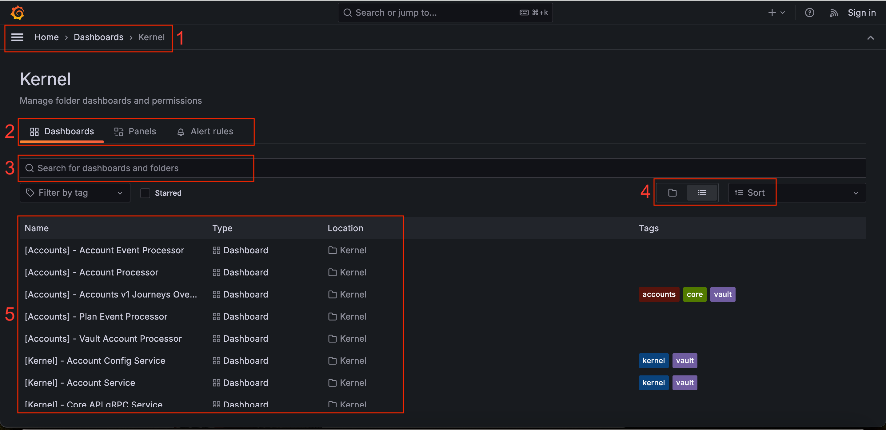

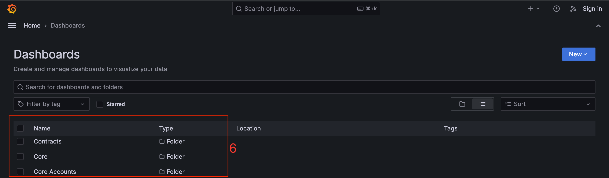

#### Explaining the Manage dashboards user interface

Here is a summary of the key areas that you can use to view dashboards, alerts, and more. For a detailed guide about managing dashboards, refer to the [documentation on the Grafana website](https://grafana.com/docs/grafana/latest/dashboards/manage-dashboards/).

 
| UI area | Description |
| --- | --- |
| 
*1*

 | 

Use the breadcrumb menu or collapsible menu to navigate to the Grafana homepage, any dashboards that you have starred as your favourites, playlists, alerting, and more.

 |
| 

*2*

 | 

Select these tabs to manage your dashboards, panels and alert rules.

 |
| 

*3*

 | 

Search for dashboards by name.

 |
| 

*4*

 | 

Select:- **Folder** view to see dashboards grouped by areas of Vault Core and non-Vault Core functionality- **List** view to see all dashboards listed alphabetically. Use the **Sort** button to change the display order the items to suit your preference.

 |
| 

*5*

 | 

The dashboards included in a folder. Click on a dashboard to access it.

 |
| 

*6*

 | 

Folders containing the Grafana dashboards grouped by areas of Vault Core and non-Vault Core functionality.

 |

chat\_bubble

For more information about the Grafana dashboards included in the Observability Stack, see [Grafana dashboards included in the Observability Stack](/vault-core/5-9/EN/environment_and_installation/infrastructure_docs/observability_and_monitoring/using_the_observability_stack#grafana_dashboards_included_in_the_observability_stack).

### Viewing an individual Grafana dashboard

Select a dashboard from the manage, browse, or search results areas to view it. It loads the data into the rows and panels, ready for you view. Each dashboard comprises:

-   Rows - these horizontal rows have a heading and contains panels - each dashboard has at least one row, while some contain several rows
    
-   Panels - each row contains at least one panel, for example an interactive graph - some rows contain several panels
    

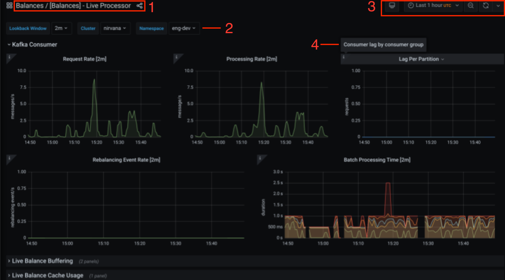

#### Explaining the dashboard

 
| UI area | Description |
| --- | --- |
| 
*1*

 | 

The name of the dashboard.

 |
| 

*2*

 | 

Use the drop-down list here to select any variables associated with the dashboard. Variables are defined at individual dashboard level and you can use them to refine what the dashboard displays.\*

 |
| 

*3*

 | 

A default time range and refresh interval are specified for each dashboard and are set according to the type of information displayed on the dashboard. Use these controls to change the time range and the refresh interval.\*\*

 |
| 

*4*

 | 

Tooltips are available on some individual graphs to provide additional information about their content.

 |

*(*2\*) You might need to select variables to ensure the dashboard displays correctly.

\*\*(*3*) By default, time-series data is retained for 14 days. However, this can be temporarily shortened if provisioned storage limits are approached.

### Configuring client-managed Grafana for use with Vault dashboards

You can optionally configure your own instance of Grafana to feature the Thought Machine provided dashboards.

chat\_bubble

You do not need to configure Grafana if you use the standard, free and proprietary-licensed Grafana Enterprise instance installed as part of the `observability` TMComponent. Only clients that choose to manage the Grafana instance themselves need to complete these configuration steps. To learn more about these and whether you need to take any action, see [Using Grafana dashboards](/vault-core/5-9/EN/environment_and_installation/infrastructure_docs/observability_and_monitoring/using_the_observability_stack#using_grafana_dashboards).

#### Overview

In order to use your Vault Core dashboards with your client-managed Grafana instance, you need to:

1.  Check that your version of Grafana and any plugins are compatible with the version of Vault Core that you intend to use and, therefore, the dashboards included in the respective Vault Core release. The `release.json` file states the Grafana version associated with the Vault Core release. If there is a mismatch, see the Grafana documentation and update Grafana and its plugins if needed.
    
2.  Connect your Grafana instance to a data source (Thanos in our examples). You need to set up the ingresses created by Vault Core as data sources in Grafana - see: [Connecting and configuring Grafana with a data source](#connecting_and_configuring_grafana_with_a_data_source)
    
3.  Obtain your Grafana API key, so that you can connect to our Grafana instance and extract the Vault Core dashboards - see: [Obtaining the API key for Grafana](#obtaining_the_api_key_for_grafana)
    
4.  Extract and import the Vault Core dashboards into your Grafana instance - see: [Importing Vault dashboards into Grafana](/vault-core/5-9/EN/environment_and_installation/infrastructure_docs/observability_and_monitoring/using_the_observability_stack#importing_vault_dashboards_into_grafana)
    
5.  Validate that everything works as expected, such as the connection between Grafana and the data source, and that you can view the dashboards.
    

#### Obtaining the API key for Grafana

Thought Machine provides an API key with the secrets manager (such as HashiCorp Vault) that allows you to use the Grafana API in the workspace. This is the same API key that you need to use with your Grafana instance.

For more information about using the Grafana API, refer to the following documentation:

-   [Grafana API documentation](https://grafana.com/docs/grafana/latest/developers/http_api/)
    
-   [AWS Grafana API key console documentation](https://docs.aws.amazon.com/grafana/latest/userguide/API_key_console.html)
    

#### Connecting and configuring Grafana with a data source

In order to view the Thought Machine dashboards, you need to set up the ingress created by Vault Core as a data source in your self-managed Grafana instance. This requires a user with organisation Admin role access - for more information, see the [Grafana Administration and data source management documentation](https://grafana.com/docs/grafana/latest/administration/data-source-management/).

chat\_bubble

The following guidance assumes that you have a Grafana instance that you manage, likely outside of the Kubernetes cluster.

In a client-managed Grafana instance, you can query metrics from a Vault Core cluster by setting the ingress endpoint as a Grafana data source.

You need to follow these steps to add an ingress as a data source in your Grafana instance for each Vault Core cluster (one ingress and one data source per cluster). If you are running multiple Vault Core installations and want to query metrics for each cluster then you need to repeat these steps to set up multiple ingresses by adding each ingress as a data source to your Grafana instance. Name each ingress with a name that is meaningful to you so that you can identify them.

Each Vault Core cluster has a unique ingress URL; the ingress `observability.ingress.domain` is set in the `values.yaml` file for each Kubernetes cluster.

chat\_bubble

As an alternative to pulling data from multiple different clusters, one option that you could consider is to use the RemoteWrite (`remote_write`) feature that is available from Vault Core 4.6 onwards. RemoteWrite allows you to write Thought Machine’s metrics to a (compatible) system that you manage. To learn more, see: [Using RemoteWrite to write metrics to external storage](/vault-core/5-9/EN/environment_and_installation/infrastructure_docs/observability_and_monitoring/using_the_observability_stack#observability_stack_components_and_urls)

In order to connect Grafana to one or more ingresses, do the following:

1.  In Grafana, select **Configuration** (cog icon) > **Data sources**.
    
2.  The **Data sources** screen opens and displays a list of previously configured data sources for your Grafana instance.
    
    -   If a data source is already configured, locate and select the data source (for example, **Thanos**) to load the configuration **Settings**. Proceed to step 3.
        
    -   If you do not have a data source configured, you can add one. Select the **Add data source** button to access the **Choose data source type** menu. For **Type**, select **Prometheus**. The **Settings** area loads. Proceed to step 3.
        
    
3.  In the **Settings** area for your data source, check/set the settings as follows:
    
    -   For **Name**, you can set a name that is meaningful to you as you require.
        
    -   In **HTTP**, set **URL** to your ingress URL - you must include the protocol and use/add the ingress URL that is set in your `values.yaml` file under `observability.ingress.domain`.
        
    -   In **Alerting**, set **HTTP method** to **POST**.
        
    -   In **Type and version**:
        
        -   Set **Prometheus type** to the name of your data source (for example, **Thanos**).
            
        -   Set data source **version** to the current version - check in the settings.
            
        
    
4.  Select **Save & Test** to save the settings and validate that they are correct.
    
    -   If it is successful, you receive a success message.
        
    -   If it fails, check all settings, including the ingress URL, and save again.
        
        You can proceed to import your Vault Core dashboards once you have successfully validated the connection.
        
    

For further guidance on adding and configuring data sources and plugins, refer to the [Grafana Administration and data source management documentation](https://grafana.com/docs/grafana/latest/administration/data-source-management/).

### Importing Vault dashboards into client-managed Grafana

In order to view the dashboards included in a Vault Core release, you need an instance of the Grafana observability platform. There are typically three types of Grafana use cases - where Thought Machine manages your instance of the standard, free and proprietary-licensed Grafana Enterprise or where you manage your instance of Grafana OSS or Grafana Enterprise instance.

chat\_bubble

You do not need to import dashboards if you use the standard, free and proprietary-licensed Grafana Enterprise instance that you install as part of the `observability` component when installing Vault Core. Only clients that choose to manage the Grafana instance themselves need to complete these configuration steps.

#### Importing Vault dashboards into a client-managed Grafana instance

If choosing to use the Vault Core dashboards with a self-managed Grafana instance, clients are responsible for importing the TM dashboards. This section includes information to help you do this once Grafana is configured - see [Configuring client-managed Grafana for use with Vault dashboards](/vault-core/5-9/EN/environment_and_installation/infrastructure_docs/observability_and_monitoring/using_the_observability_stack#configuring_client_managed_grafana_for_use_with_vault_dashboards).

error

Dashboards are only compatible with the Vault Core version that they shipped with; therefore, you must repeat the following steps with each release of Vault Core. Failure to maintain the correct dashboard versions could result in missing data.

Both Grafana OSS and Enterprise allow you to import dashboards and to do so in the same way.

Follow these steps to import the dashboards for Vault Core:

1.  Pull the Docker image included with the Vault Core release artefact from Thought Machine repository located at `cloud/services/grafana/client/resources:vault-..:<sha-tag>` (where `..` represents the Vault Core version).
    
2.  Copy the following `.tar` files from the Docker image to a local file system:
    
3.  Extract these `.tar` files and import the JSON files into the correct location for your Grafana instance to add them - [use the Grafana documentation as your guide](https://grafana.com/docs/grafana/v9.0/dashboards/export-import/). Next, you need to validate your configuration and check that you can view the dashboards.
    

chat\_bubble

It is also possible to programmatically export the dashboards by using the Grafana API. Refer to the [Grafana guidance](https://community.grafana.com/t/export-dashboards-programmatically/57623/2) or contact Grafana for information and support.

#### Validating your configuration and checking the dashboards

Once you have configured the connectivity between Grafana, Prometheus, and the data source ('Thanos' in our example), and imported the dashboards for Vault Core, you should:

1.  Validate that you can access the ingress URL. For example, this should look similar to: `[https://tm-metrics.<ValueObservabilityIngressDomain>.io](https://tm-metrics.\<ValueObservabilityIngressDomain\>.io)`
    
    chat\_bubble
    
    In this example, `.<ValueObservabilityIngressDomain>` is a placeholder for the ingress URL that you have defined in your `values.yaml` file under `observability.ingress.domain`.
    
2.  Run a basic check to make sure that you can see the targets and Prometheus instances that should be "seen" by the data source. Run the following command - this should return multiple Prometheus instances across two or more namespaces:
    

## Grafana dashboards included in the Observability Stack

Thought Machine provides a suite of dashboards with Vault Core that allows clients to monitor, observe, and gain insights into Vault Core by using the Grafana observability platform.

Here, we provide a detailed list of key dashboards that we ship with each release - these are grouped by area:

-   [Experience Layer](/vault-core/5-9/EN/environment_and_installation/infrastructure_docs/observability_and_monitoring/using_the_observability_stack#experience_layer)
    
-   [Contracts](/vault-core/5-9/EN/environment_and_installation/infrastructure_docs/observability_and_monitoring/using_the_observability_stack#smart_contracts) (formerly \`Smart Contracts')
    
-   [Core](/vault-core/5-9/EN/environment_and_installation/infrastructure_docs/observability_and_monitoring/using_the_observability_stack#core)
    
-   [Payments Hub](/vault-core/5-9/EN/environment_and_installation/infrastructure_docs/observability_and_monitoring/using_the_observability_stack#payments_hub)
    
-   [Tickets Engine and Workflows](/vault-core/5-9/EN/environment_and_installation/infrastructure_docs/observability_and_monitoring/using_the_observability_stack#tickets_engine_and_workflows)
    
-   [Migrations](/vault-core/5-9/EN/environment_and_installation/infrastructure_docs/observability_and_monitoring/using_the_observability_stack#migrations)
    
-   [Non-Vault components](/vault-core/5-9/EN/environment_and_installation/infrastructure_docs/observability_and_monitoring/using_the_observability_stack#nonvault_components)
    
-   [Policy](/vault-core/5-9/EN/environment_and_installation/infrastructure_docs/observability_and_monitoring/using_the_observability_stack#policy)
    
-   [Schedule Manager](/vault-core/5-9/EN/environment_and_installation/infrastructure_docs/observability_and_monitoring/using_the_observability_stack#schedule_manager)
    
-   [Upgrade path](/vault-core/5-9/EN/environment_and_installation/infrastructure_docs/observability_and_monitoring/using_the_observability_stack#upgrade_path)
    
-   [Vault Jobs](/vault-core/5-9/EN/environment_and_installation/infrastructure_docs/observability_and_monitoring/using_the_observability_stack#vault_jobs)
    
-   [Vault Health Overview](/vault-core/5-9/EN/environment_and_installation/infrastructure_docs/observability_and_monitoring/using_the_observability_stack#vault_health_overview)
    

chat\_bubble

The Product Hub and its associated dashboards were removed in Vault Core 4.3.

In addition to the overviews that we provide here, we recommend that you also refer to the following guidance:

-   [Introduction to Grafana and key dashboards](/vault-core/5-9/EN/environment_and_installation/infrastructure_docs/observability_and_monitoring/introduction_to_grafana_and_key_dashboards)
    
-   a preview and more detailed information about some of the dashboards listed here
    
-   [Using Grafana dashboards](/vault-core/5-9/EN/environment_and_installation/infrastructure_docs/observability_and_monitoring/using_the_observability_stack#using_grafana_dashboards)
    
-   a guide to using the dashboards for all users, with additional instructions about how to import and update dashboards for those who manage Grafana themselves
    

### Experience Layer

chat\_bubble

The Experience Layer API is deprecated as of Vault Core release 4.7, and will be removed no earlier than release 6.0.

The **Experience Layer** dashboard folder contains the following dashboards under `/dashboards/experience-layer/`.

 
| Dashboard | Description |
| --- | --- |
| 
App: xpl-latest-payee-marker

 | 

Displays metrics for the Experience Layer latest payee marker migration job, including the number of payee rows processed, batch process times and row processing rate.

 |
| 

App: xpl-latest-transaction-marker

 | 

Displays metrics for the Experience Layer latest transaction marker migration job, including the number of transaction rows processed, batch process times and row processing rate.

 |
| 

App: xpl-transactions

 | 

Displays high-level metrics for the Experience Layer transactions gRPC service, including successful and failed request, database utilisation, QPS (queries per second) and wait times.

 |
| 

Contracts Bridge Pipeline

 | 

Displays performance and error metrics for the Contracts Transaction Bridge, which creates transactions for postings created by contract executions.

 |
| 

Migrated Postings Bridge Pipeline

 | 

Displays performance and error metrics for the Migrated Postings Transaction Bridge, which creates transactions for postings being migrated into Vault.

 |
| 

Payments Hub Bridge Pipeline

 | 

Displays performance and error metrics for the Payments Transaction Bridge, which creates transactions for postings created by the Payments Hub.

 |

chat\_bubble

-   The Experience Layer Payee resource is deprecated as of Vault release 4.6.0, and will be removed no earlier than release 6.0.0.
    
-   The following dashboards were previously available but are no longer provided in the latest dashboard release package: `App: internal-transfers`, `App: payment-hub-bridge`, `App: xpl-contracts-bridge`, `App: xpl-payees`, `App: xpl-payments`
    

### Core

Core includes the following dashboard folders and dashboards.

chat\_bubble

In Vault Core 5, we have added a number of new dashboards and removed some that are no longer required.

-   New dashboards include: End of Day, Ledger Processor Breakdown, Ledger Responder, Legacy Postings Service, Point in Time Overview, Post-Posting Overview, and Postings Service (in the **Ledger** folder)
    
-   Removed dashboards: Backdate Processor, Internal Processor, Live Processor, Live Processor Migration, Live Processor Pipeline, Balances Service, Postings Service, Postings Processor Pipeline, and Postings API
    

  
| Dashboard folder | Dashboard | Description |
| --- | --- | --- |
| 
Account Management

 | 

Accounts

 | 

Displays metrics used to help diagnose issues in the Account/Plan lifecycle, including the performance metrics for `PlanUpdates` and other information related to the processing of `PlanUpdates`/`AccountUpdateBatches`/`PlanUpdateBatches`. For `AccountUpdates`, see the **\[Accounts\] - Account Processor** dashboard.

 |
| 

Account Management

 | 

\[Kernel\] - Account Service

 | 

Provides visibility of the Account Service.

 |
| 

Account Management

 | 

\[Accounts\] - Vault Account Processor

 | 

Provides visibility into Vault Account Processor deployment. It allows banks to monitor the health of asynchronous operations for `PlanUpdates` (`activation_update`, `supervisor_contract_version_update`, `disassociate_account_update` and `closure_update`) along with other processors that are part of `PlanMigration`/`AccountMigration` journeys.

 |
| 

Account Management

 | 

\[Accounts\] - Account Processor

 | 

Provides visibility into the Account Processor deployment, and allows banks to monitor the health of their system and the `AccountUpdate`/`PlanUpdate` asynchronous operations. The Account Processor handles the processing of `AccountUpdates` and is a key component of core account lifecycle journeys, including account opening and account conversions. It also handles the processing of `account_plan_association` `PlanUpdates`. For other types of `PlanUpdates`, see the **Accounts** dashboard.

 |
| 

Account Management

 | 

\[Accounts\] - Account Event Processor

 | 

Provides visibility for the Account Event Processor deployment, which processes `AccountEvent` messages. The Account Event Processor is a key component of core account lifecycle journeys, including asynchronous creation of AccountUpdates for account opening and account closing.

 |
| 

Account Management

 | 

\[Accounts\] - Plan Event Processor

 | 

Provides visibility for the Plan Event Processor deployment, which processes `PlanEvent` messages. The Plan Event Processor is a key component of core plan lifecycle journeys, including asynchronous creation of `PlanUpdates` for plan opening.

 |
| 

Audit Logs

 | 

Audit Overview

 | 

Displays a broad overview of the status of the main components in the Audit service.

 |
| 

Audit Logs

 | 

Audit Services

 | 

Displays metrics that help diagnose issues in the Audit service, including metrics for inbound REST requests and the rate of audit messages created to track audit message loss.

 |
| 

Bulk Operations

 | 

Bulk Operations - Bulk Operations Health

 | 

Provides visibility to monitor the health of Bulk Operations (such as bulk Account conversions).

 |
| 

Calendar

 | 

Calendar - Application metrics

 | 

Displays information on Calendar APIs (1.12.0) as well as processing of Calendar Periods (2.8.0) used for End of Day among other things. The dashboard has not been included in previous versions accidentally, and was only introduced in 2.9.1. The dashboard JSON can be shared with clients if required for previous versions.

 |
| 

Core Accounts

 | 

Accounts Retry Executor

 | 

Available with Accounts v2. Displays information about the status of Accounts, for example during Account conversion. The dashboard has boards for **Kafka**, **Common Kafka**, **Common Kafka Error**, **Retries**, **Common gRPC**, **Storage**, and **Deployment Information**. You can check the **Retries** board to determine whether the Accounts Retry Executor has automatically performed any retries and the rate on the **Account Retries** and **Retry attempts rate** panels.

 |
| 

Core Accounts

 | 

Core Accounts Service

 | 

Displays overall visibility of the Accounts service. This service serves requests for the Accounts v2 API, some endpoints for the Accounts v1 API, the Parameters API, and requests for requirement fetching and execution for other Contract hooks. It also handles requests to convert an Account and update Smart Contracts. A key use of this dashboard is to monitor the v2 Accounts endpoints and the `FetchParameterValueTimeseries` journey. You can also use it to observe the embedded Contract Executor, which executes Smart Contract hooks, in this deployment. The executor activity, such as the Smart Contract hooks it executes, requirements it fetches and directives it commits per execution, depends on the hooks that you define in the Contract and endpoint that you call. We recommend also referring to other supporting sources of information, such as distributed traces, documentation, accounts logs, and API responses, when interpreting this dashboard.

 |
| 

Core Accounts

 | 

Accounts Fetch Service

 | 

Displays visibility of some performance-critical journeys that involve reading Accounts and Account-related data.

 |
| 

Core Accounts

 | 

Accounts Journeys

 | 

Displays visibility of Accounts Journeys, with boards for **accounts gRPC Server Stats**, **accounts gRPC Client Stats**, **Downstream dependency status heuristics**, and **Dependency Deployments overview**.

 |
| 

Core Accounts

 | 

Parameter Change

 | 

Displays monitoring for Post Parameter Change Hook executions to allow observability of executions and failures.

 |
| 

Core Accounts

 | 

Parameter View

 | 

Displays monitoring for View journeys over Parameters, Parameter Values and Effective Parameter Values.

 |
| 

Core Streaming API

 | 

Core Stream API

 | 

Displays resource utilisation and per-topic Kafka consumer statistics for the Core Streaming API.

 |
| 

Data Retention

 | 

Deleter Job

 | 

Provides performance statistics for the deletion of resources as well as reporting on successful and failed deletions.

 |
| 

Core

 | 

Vault Performance Report

 | 

Displays an overview of current throughput across the vault system. Includes account creation and update rate, online and offline postings rate, End-of-Day (EoD) job processing rate, and Balance enquiries.

 |
| 

Core

 | 

Deployment Overview

 | 

Displays an overview of any deployment in Vault Core, covering its interactions with the database, Kafka, and other services via gRPC. Also includes information on replica availability, and CPU and memory usage. Provides a view of what a particular deployment is doing.

 |
| 

Core

 | 

Deployment Problems

 | 

Displays an overview of problems across an entire Vault Core instance, with the ability to select a specific deployment to allow more detailed diagnosis. The panels cover interactions with the database, Kafka, and other services via gRPC. Also includes information on alerts and logging across all deployments, replica availability, and CPU and memory usage.

 |
| 

Ledger

 | 

\[V5+\] Directives Committer Overview

 | 

Provides an overview of the directives committer, with panels for Overview (Kafka Message Rate, Incoming Request Rate), Performance (Processor Batch Size, Processor Duration Breakdown, Commit Ledger Duration), and panels for Ledger Directives Committer Performance, Secondary Directives Committer Performance, Contracts Platform Committer Library, and Deployment Information.

 |
| 

Ledger

 | 

\[V5+\] End of Day

 | 

Displays an overview of the End of Day journey, with all involved services.

 |
| 

Ledger

 | 

\[V5+\] Postings Service

 | 

Displays information about the Postings Service and monitors the throughput of requests received by service, the error percentage or processing time.

 |
| 

Ledger

 | 

\[V5+\] Ledger Processor Breakdown

 | 

Displays a breakdown of the Ledger services and its internal workers. Provides information about latencies of different stages performed by the Ledger Processor.

 |
| 

Ledger

 | 

\[V5+\] Ledger Responder

 | 

Displays information about the Ledger Responder service, and monitors the throughput of requests received by the service, the processing time and the number of messages that it publishes or skips.

 |
| 

Ledger

 | 

\[V5+\] Point in Time Overview

 | 

Displays a breakdown information about services involved in asynchronous execution, such as End of Day Schedules or post Postings.

 |
| 

Ledger

 | 

V5 - Ledger Migrator

 | 

Displays a breakdown information about the Ledger Migrator. It shows the latencies of the different steps involved when migrating Postings into Vault. See the [Migrations](/vault-core/5-9/EN/environment_and_installation/infrastructure_docs/observability_and_monitoring/using_the_observability_stack#migrations) section for information about the dashboards that are associated with migrating data to Vault.

 |
| 

Ledger

 | 

\[V5+\] Legacy Postings Service

 | 

Displays information about the Legacy Postings Service and monitors the throughput of requests received by service, the error percentage or processing time.

 |
| 

Ledger

 | 

Vault Core Data Volumes

 | 

Displays a breakdown of various key data volumes within Vault Core that can be used to monitor the overall size and capacity of the system.

 |
| 

Ledger Balances

 | 

\[Ledger Balances\] - Accumulator Processor

 | 

Displays panels for Kafka Consumer, Deployment Information, DB Query Duration, Bucket Entries fetched from DB.

 |
| 

Ledger Balances

 | 

\[Ledger Balances\] - Accumulator Processor Pipeline

 | 

Displays the different stages of the accumulator processor and provides statistics about how each stage performs; each row represents one stage.

 |
| 

Ledger Balances

 | 

\[Ledger Balances\] - Bucket Processor

 | 

Displays information about the bucket processor input topic, monitors its request and processing rates and provides information about the health of the processor (memory, CPU or heartbeat).

 |
| 

Ledger Balances

 | 

\[Ledger Balances\] - Bucket Processor Pipeline

 | 

Displays the different stages of the bucket processor and provides statistics about how each stage performs; each row represents one stage.

 |
| 

Ledger Balances

 | 

\[Ledger Balances\] - Distribution Processor

 | 

Displays information about the distribution processor, monitors the input Kafka topic and follows progression of the account watermark.

 |
| 

Ledger Balances

 | 

\[Ledger Balances\] - Domain

 | 

Displays global statistics about all processors involved in the Ledger Balances.

 |
| 

Ledger Balances

 | 

\[Ledger Balances\] - Ledger Balances Service

 | 

Displays information about the Ledger Balances service and monitors the throughput of requests received by the service, the error percentage or processing time.

 |
| 

Ledger Balances

 | 

\[Ledger Balances\] - Watermark Processor

 | 

Displays information about the global watermark Kafka consumer and monitors the global watermark value; this determines the validity of a ledger timestamp when querying the Ledger Balance service.

 |
| 

Postings

 | 

\[Postings\] - Enrichment Processor

 | 

Displays information about the Postings Enrichment processor and monitors its Kafka consumer and deployment health (memory usage, CPU).

 |
| 

Postings

 | 

\[Postings\] Enrichment Processor Pipeline

 | 

Displays the different stages of the Postings Enrichment processor and provides statistics about how each stage performs.

 |
| 

Scheduler

 | 

\[Scheduling\] Schedule Jobs Processing

 | 

Displays information on the processing of Schedule Jobs, including statistics on each Scheduler service involved in Job processing and overall metrics on Jobs.

 |
| 

Scheduler

 | 

\[Scheduling\] Schedule Migrator Overview

 | 

Displays information on the background data migration process for the Scheduler Service, including the speed, integrity, and completion status of data moving from the legacy schema to the new Scheduler database architecture.

 |
| 

Scheduler

 | 

\[Scheduling\] Scheduler Overview

 | 

Displays information on the [Scheduler](/vault-core/5-9/EN/reference/scheduler) application; this includes statistics for: gRPC endpoints served by the scheduler, database calls made to the scheduler database and application health.

 |
| 

Warm Storage

 | 

\[Core\] Warm Storage

 | 

Provides information about the progress of insertion to and retrieval from the warm storage database. The **Warm Resource Insertion** row shows metrics regarding the processing of Kafka messages and resultant insertion of rows for Accounts and Ledger resources. The **Warm Accounts** and **Warm Ledger** rows provide metrics regarding retrieval endpoints served by the Warm Storage database for these services respectively. The **DB** and **Kafka** rows provide information about Kafka message processing and database query latency. The **warm-storage-inserter Resources** row provides visibility into the health of the warm-storage-inserter deployment. You can use these metrics collectively to help debug issues with the Warm Ledger, Warm Accounts and warm-storage-inserter.

 |

### Edge Functions

The **Edge Functions** folder contains the following dashboards under `/dashboards/edge-functions/`.

  
| Dashboard folder | Dashboard | Description |
| --- | --- | --- |
| 
Edge Functions

 | 

\[Edge Functions\] Executions

 | 

The **Executions** dashboard allows you to view visualisations about the status of Edge Functions executions based on metrics that concern the `ExecutionContext`. The individual rows contain panels that display this information, as a sum of the concurrent executions. You can view all executions and have the option to filter the information by execution type, with further filters for some metrics for outcome (state) and error code. For more information, see the [Monitoring and Disaster Recovery](/vault-core/5-9/EN/reference/edge_functions/overview_and_getting_started/observability_and_disaster_recovery) guide for Edge Functions.

 |
| 

Edge Functions

 | 

\[Edge Functions\] Overview

 | 

This dashboard provides a starting point for you to monitor Edge Functions. It brings together links to existing Grafana dashboards that relate to Vault Core, with the views tuned to monitoring Edge Functions. It also provides a link to the dedicated Edge Functions Execution dashboard, which you can learn more about in the [Monitoring and Disaster Recovery](/vault-core/5-9/EN/reference/edge_functions/overview_and_getting_started/observability_and_disaster_recovery) guide for Edge Functions.

 |

### Payments Hub

The **Payments Hub** dashboard folder includes the following dashboards under `/dashboards/payments-hub/`.

 
| Dashboard | Description |
| --- | --- |
| 
\[Payments Hub\] - Payments Kafka Consumers

 | 

Displays Kafka and deployment statistics for deployments relevant to the processing of Payments.

 |
| 

\[Payments Hub\] - Gateways - Bottomline Consumers

 | 

Displays Kafka and deployment statistics for deployments relevant to Bottomline Integration.

 |
| 

\[Payments Hub\] - Bank Account Service

 | 

Displays information about the Bank Account service, including metrics on requests per second, request latency, error rate and resource usage.

 |
| 

Payments Hub Integrations Business Metrics

 | 

Contains high-level business information indicating the readiness of Payments Hub to process payments. Includes high-level deployment statuses, whether there is a UK-specific configuration, and overall gRPC traffic and errors.

 |
| 

\[Payments Hub\] - Credit Transfer

 | 

Displays gRPC and deployment statistics for the Credit Transfer service.

 |
| 

\[Payments Hub\] - Credit Transfer Action

 | 

Displays gRPC and deployment statistics for the Credit Transfer Action service.

 |
| 

\[Payments Hub\] - Credit Transfer Action Request Processor - Create Request Pipeline

 | 

Displays pipeline boards for the Create Request pipeline of the Credit Transfer Action Request Processor, including duration, queuing time, batch size and RPS metrics for every pipeline stage.

 |
| 

\[Payments Hub\] - Credit Transfer Action Request Processor - Update Request Pipeline

 | 

Displays pipeline boards for the Update Request pipeline of the Credit Transfer Action Request Processor, including duration, queuing time, batch size and RPS metrics for every pipeline stage.

 |
| 

\[Payments Hub\] - Credit Transfer Cleared Payment Processor - Pipeline

 | 

Displays pipeline boards for the Credit Transfer Cleared Payment Processor, including duration, queuing time, batch size and RPS metrics for every pipeline stage.

 |
| 

\[Payments Hub\] - Credit Transfer Executor - Payment Action LP Pipeline

 | 

Displays pipeline boards for the Credit Transfer Payment Action Executor, including duration, queuing time, batch size and RPS metrics for every pipeline stage.

 |
| 

\[Payments Hub\] - Credit Transfer Executor - Posting Response Pipeline

 | 

Displays pipeline boards for the Credit Transfer Posting Response Executor, including duration, queuing time, batch size and RPS metrics for every pipeline stage.

 |
| 

\[Payments Hub\] - Credit Transfer Executor - Target Status Pipeline

 | 

Displays pipeline boards for the Credit Transfer Target Status Executor, including duration, queuing time, batch size and RPS metrics for every pipeline stage.

 |
| 

\[Payments Hub\] - Credit Transfer Reversal

 | 

Displays information about the Credit Transfer Reversal service, including metrics on requests per second, request latency, error rate and resource usage.

 |
| 

\[Payments Hub\] - Credit Transfer Reversal Processor - Payment Event Pipeline

 | 

Displays pipeline boards for the Credit Transfer Reversal Processor, including duration, queuing time, batch size and RPS metrics for every pipeline stage.

 |
| 

\[Payments Hub\] - Credit Transfers Payment Processing Times

 | 

Displays the number of payments reaching any Current Status. You can filter payments by Scheme, Direction and Execution Plan. It also displays the time taken to reach a Current Status and the time spent in a Current Status. The full \`round trip' time of a payment is not displayed by this dashboard because the time the payment spends in a gateway connector is not captured.

 |
| 

\[Payments Hub\] - File Service

 | 

Displays information about the File service, including metrics on requests per second, request latency, error rate and resource usage.

 |
| 

\[Payments Hub\] - FPS Processor - Payments - Pipeline

 | 

Displays pipeline boards for the FPS Processor, including duration, queuing time, batch size and RPS metrics for every pipeline stage.

 |
| 

\[Payments Hub\] - FPS Processor - Payment Actions - Pipeline

 | 

Displays payment actions pipeline boards for the FPS Processor. You can view boards for **General** that cover latency, processing duration, transient errors, and DLQed errors, **Validation - Payment**, **Validation - Return**, **Validation - Party**, **Enrichment - ID Generation**, and **Processing - Action Resolution**.

 |
| 

FPS Processor

 | 

Contains information about the status of the processing pipeline used by the FPS Processor service. Includes duration, queuing times, and TPS stats for each stage in the pipeline, as well as standard Kafka metrics for the service’s consumer, and overall resource usage of the service.

 |
| 

\[Payments Hub\] - OnUs Processor - Payment Actions - Pipeline

 | 

Displays payment actions pipeline boards for the OnUs Processor

 |
| 

\[Payments Hub\] - PaymentReversals - Status

 | 

Displays the number of Payment Reversals reaching any Status. You can filter Payment Reversals by Scheme and Type. Also displays the re-processing of Payment Reversals when required.

 |
| 

\[Payments Hub\] - Scheme Message Service

 | 

Displays information about the Scheme Message service, including metrics on requests per second, request latency, error rate and resource usage.

 |
| 

\[Payments Hub\] - Scheme Service

 | 

Displays information about the Scheme service, including metrics on requests per second, request latency, error rate and resource usage.

 |
| 

\[Payments Hub\] - UK Service

 | 

Displays information about the UK Regional service, including metrics on requests per second, request latency, error rate and resource usage.

 |
| 

Bottomline FPS Integration

 | 

Displays information related to FPS payments using the Bottomline gateway connector, including the general health of the payment processing path and relevant resource usage, payment rate and round trip times. Only applicable to customers using the Bottomline FPS integration.

 |
| 

Bottomline Payment Processing Health

 | 

Display information related to the Bottomline gateway connector for inbound and outbound payment action codes, the DLQ messages count, retry message queue rate, and retry queue consumer lag.

 |
| 

Payments Hub Kafka Client Consumers

 | 

Displays information about the request rate, processing rate, lag per partition, and rebalancing event rate for all consumers, and more information, including **Consumer Errors** (**Consumer Retries Rate** and **DLQ Message Publish Increase**), **Consumer Idempotency** (**Idempotent Messages** and **Duplicate Messages**).

 |
| 

Payments Hub Idempotency Metrics

 | 

Tracks idempotent gRPC calls across various Payments Hub services.

 |
| 

Payments Hub Processor Breakdown

 | 

Tracks stage timings across various Payments Hub Processors (for pre-pipelined processors).

 |
| 

Payments Load Testing

 | 

Provides an overview of important processors in the payment processing hot path.

 |

### Contracts

The **Contracts** dashboard folder includes the following dashboards to help you to monitor Smart Contracts and the Contract Platform. These are available under `/dashboards/smart-contracts/`.

chat\_bubble

In Vault 5.0, Thought Machine has introduced a new set of dashboards that relate to the **Ledger**. Among these are **End of Day** and **Point in Time Overview**. These, along with the other journey dashboards and **Contract Platform Libraries**, replace the **Contract Engine Account Scheduling** and **Contract Engine** dashboards (available in earlier versions of Vault Core).

 
| Dashboard | Description |
| --- | --- |
| 
Contract Platform Libraries

 | 

This displays metrics for the performance and health of the Contract Platform. These metrics are available across the following rows: **Deployment Information**, **Contract Platform Resource Fetching**, **Contract Platform Hook Fetching**, **Contract Platform Requirements Fetching**, **Directive Committing**

 |
| 

Contract Simulation

 | 

Provides observability for [Contract Simulation](/vault-core/5-9/EN/reference/contracts/contract_simulation/) when running simulations with Smart Contracts.

 |
| 

\[Contracts\] - Contract Modules Service

 | 

Displays information about the health of the Contract Modules service within Smart Contracts.

 |
| 

\[Contracts\] - Contract Embedded Execution Detailed Breakdown

 | 

Displays information about Smart Contracts executions, allowing you to monitor journeys for Activation and End of Day, with boards for **Deployment Information**, **Embedded Hook Execution**, and **Contract Executor Embedded Execution Breakdown**.

 |
| 

\[Core API\] - Account Attributes

 | 

Displays information about the `/v1/account-attribute-values` Core API. This API is serviced by the attributes gRPC deployment, and exclusively executes the `attribute_hook` within a Smart Contract, on demand from a given API request.

 |

### Tickets Engine and Workflows

The **Tickets Engine** folder includes the following dashboards under `/dashboards/ticket-engine/`.

  
| Dashboard folder | Dashboard | Description |
| --- | --- | --- |
| 
Ticket Engine (under **workflows** in Grafana)

 | 

Ticket Engine Application Metrics

 | 

Provides an overview of Ticket service component metrics. These link to detailed dashboards.

 |
| 

Ticket Engine (under **workflows** in Grafana)

 | 

\[Workflows\] Tickets Engine

 | 

Helps the quick diagnosis of problems with the Ticket service; all metrics shown link to a more in-depth, component-specific dashboard (Application, RPC, or Database) with the current variables selected.

 |
| 

Ticket Engine (under **workflows** in Grafana)

 | 

\[Workflows\] Tickets to Tasks Migration Metrics

 | 

Only relevant for clients migrating from Vault Core version 2.5 or earlier to a later version of Vault Core (required by Vault 4.0). Displays the migration status of tickets to tasks or task threads.

 |

The **Workflows** folder includes the following dashboards under `/dashboards/workflows/`. For more information about Workflows, see the [Workflows API](/vault-core/5-9/EN/api/workflows_api/) and [Workflows and Tickets](/vault-core/5-9/EN/reference/workflows-tickets/) reference documentation.

  
| Dashboard folder | Dashboard | Description |
| --- | --- | --- |
| 
Workflows

 | 

\[Workflows\] - JVM Statistics

 | 

Displays different graphs allowing investigation of the health of the JVM used in each pod for the Ticket service; the Ticket Engine is a Java service.

 |
| 

Workflows

 | 

\[Workflows\] - Callback Router Overview

 | 

Displays information about the health of the Callback Router. This component handles Workflow auto-instantiations and the calls that Workflows can make to other Vault Core services.

 |
| 

Workflows

 | 

\[Workflows\] - Engine Overview

 | 

Displays information about the health of the Workflows Engine. This component handles the creation, storage, parsing and execution of Workflows by orchestrating the invocation of APIs, the handling of the respective responses and the production and consumption of messages to and from Kafka topics.

 |
| 

Workflows

 | 

\[Workflows\] - Processor Overview

 | 

Displays information about the health of the Workflows Processor. This component handles all the asynchronous (event-driven) communication sent to and coming from the Workflow Engine.

 |
| 

Workflows

 | 

\[Workflows\] - Schedule Processor Overview

 | 

Displays information about the health of the Schedule Processor. This component listens for requests to either instantiate a Workflow or fire events to an existing instance.

 |
| 

Workflows

 | 

\[Workflows\] - Transform Executor Overview

 | 

Displays information about the health of the Transform Executor. This component executes Workflow transforms written in Starlark.

 |

### Migrations

The following dashboards are available to help you to monitor the process of migrating data to Vault Core under `/dashboards/migrations/`, `/dashboards/data-loader/`, and `/dashboards/ledger/`.

chat\_bubble

For more information, see: [Migrating data to Vault](/vault-core/5-9/EN/environment_and_installation/migrating_to_vault/)

The **Migrations** folder contains the following dashboards under `/dashboards/migrations/`.

  
| Dashboard folder | Dashboard | Description |
| --- | --- | --- |
| 
Migrations

 | 

Migrations Dashboard

 | 

Displays information to allow you to monitor the progress of migrating data to Vault Core, using the [Data Loader API](/vault-core/5-9/EN/environment_and_installation/migrating_to_vault/migrating_using_the_data_loader_api) and [Postings API](/vault-core/5-9/EN/environment_and_installation/migrating_to_vault/migrating_using_the_postings_migration_api/). For use for migrations only. Boards are available for **Kafka Overview**, **Data Loader API - Requests**, **Data Loader API - Validation**, **Data Loader API - Load**, **Data Loader API - Misc**, **Postings API - Requests**, **Postings API - Validation**, **Postings API - Load**, and **Postings API - Misc**.

 |

The **DataLoader** folder contains the following dashboards under `/dashboards/data-loader/`. The use of these dashboards is only for the purposes of migrating data to Vault.

  
| Dashboard folder | Dashboard | Description |
| --- | --- | --- |
| 
Data Loader

 | 

Data Loader Dashboard

 | 

Displays information about the performance of the data loader services as well as the number of requests processed, failed and awaiting completion.

 |
| 

Data Loader

 | 

Data Loader Resources Dashboard

 | 

Displays per resource information about the development of a migration together with the performance of the endpoints used to load resources.

 |
| 

Data Loader

 | 

Service - Data Loader Stream API

 | 

Displays per-topic Kafka consumer statistics for the Data Loader Streaming API.

 |

The **Ledger** folder contains the following dashboard under `/dashboards/ledger/`. The use of these dashboards is only for the purposes of data migration.

  
| Dashboard folder | Dashboard | Description |
| --- | --- | --- |
| 
Ledger

 | 

V5 - Ledger Migrator

 | 

Displays a breakdown information about the Ledger Migrator. It shows the latencies of the different steps involved when migrating Postings into Vault.

 |

### Non-Vault components

Non-Vault components include the following dashboard folders and dashboards.

  
| Dashboard folder | Dashboard | Description |
| --- | --- | --- |
| 
Database

 | 

Database Clients Overview

 | 

Provides an overview of performance metrics for the database instance used by Vault including QPS (queries per second), latency and TPS.

 |
| 

Database

 | 

Database Queries

 | 

Provides a per-query view of QPS (queries per second), latency and query response time; see the graph tooltips for more information.

 |
| 

Database

 | 

Deadpool DB Pooler

 | 

Provides an overview of the performance of connections into the database. The **Conns Wait Time** shows the connections wait time. In an environment with no issues, we would expect connection times around 0.01 on average; an extended amount of time to establish a connection may indicate an issue.

 |
| 

Istio

 | 

Istio Control Plane Overview

 | 

Displays performance and operation metrics for Istio Pilot.

 |
| 

Istio

 | 

Istio Mesh Overview

 | 

Provides an overview of Istio traffic, with details about workloads per service.

 |
| 

Kafka

 | 

Kafka Clients Consumer

 | 

Displays statistics for applications consuming messages from Kafka.

 |
| 

Kafka

 | 

Kafka Clients Producer

 | 

Displays statistics for applications producing messages into Kafka.

 |
| 

Kafka

 | 

Kafka Topics / Consumer Lag

 | 

Displays Kafka topics details independent of broker.

 |
| 

Kubernetes

 | 

Availability Zone Distribution

 | 

Displays the number of pods in each availability zone for apps.

 |
| 

Kubernetes

 | 

Cluster Overview

 | 

Displays memory/CPU requests vs current utilisation for apps.

 |
| 

Kubernetes

 | 

Deployment Reliability

 | 

Provides an overview of a cluster or app by showing container-level events, CPU throttling, **HPA** (HorizontalPodAutoscaler) events and alerts.

 |
| 

Kubernetes

 | 

Container Resource Usage

 | 

Displays CPU Throttling and Out Of Memory events for containers across a namespace, as well as percentage of resources used. It is aimed towards Istio tuning, but you can use it for any container.

 |
| 

Kubernetes

 | 

Deployment statistics

 | 

Displays basic statistics about memory, CPU, the network and the current number of replicas of deployments.

 |
| 

Kubernetes

 | 

Persistent Volumes

 | 

Kubernetes persistent volume inode and disk usage.

 |
| 

Observability

 | 

Alerts (Alerts Review Tool)

 | 

Provides an overview of alerts that are firing across all Prometheus instances. Use this to visualise the alerts firing in Vault over time. Qualitative information for alerts currently firing is not included in this dashboard - see the Alertmanager UI.

 |
| 

Observability

 | 

Custom Metrics Troubleshooting

 | 

Provides a way to troubleshoot custom metrics, which can otherwise be difficult as they rely on multiple services. It gives an overview of related objects, application pods, and metrics. For example, the row for **Relevant kubernetes objects on the clustername cluster** provides panels to check the age and status of the pods on a cluster and the Prometheus-adapter ConfigMaps on it. There are also rows for **Consumer lag recorded metrics**, **Scraped metrics used by relevant recording rules**, and **Consumer lag related metrics** for the instance. Check the advice displayed on the dashboard for how to best use it.

 |
| 

Observability

 | 

Otel / OpenTelemetry Collector

 | 

Displays information about the OpenTelemetry Collector, including panels about its status (**Otel-collector status**), the tracing status (**Tracing enabled?**), **Resource Usage**, and **Service Metrics**. The `otel-collector` lives in the Vault namespace and, when you have enabled Tracing via the Vault Core `values.yaml` file, it collects and exports tracing data (spans) to a compatible collector, for you to store and query. See the [OpenTelemetry Collector](https://opentelemetry.io/docs/collector) documentation for details on Receivers, Processors and Exporters.

 |
| 

Observability

 | 

Prometheus

 | 

Displays uptime, resource utilisation, network traffic and scrape and error metrics for individual Prometheus instances. Use this to investigate any issues with the Observability Stack, such as missing metrics, dashboards without data and Prometheus Pods failing to be scheduled.

 |
| 

Observability

 | 

Prometheus Label Cardinalities

 | 

Provides insight into the cardinalities of metrics and labels exposed by Prometheus instances within clusters; the [Prometheus HTTP API](https://prometheus.io/docs/prometheus/latest/querying/api/) provides this data. The dashboard defines the metrics data across panels for **Metric Cardinalities**, **Label Cardinalities**, **Memory Usage**, and **Most Common Label/Value Pairs And Their Relative Counts**. See the dashboard for information about the definitions and how to use it.

 |
| 

Redis

 | 

Overview - Redis

 | 

Displays information about Redis health status and resources allocation.

 |
| 

Sync Comms

 | 

gRPC Clients

 | 

Displays statistics about all gRPC calls made by an application.

 |
| 

Sync Comms

 | 

gRPC Services

 | 

Displays statistics about all gRPC calls that an application is serving.

 |
| 

Sync Comms

 | 

gRPC Stats

 | 

Displays an overview of timing/success statistics for a deployment, including both service and client calls.

 |
| 

Sync Comms

 | 

HTTP Gateways

 | 

Displays statistics about all HTTP calls that an application is serving.

 |

### Policy

The **Policy** folder contains the following dashboards under `/dashboards/policy/`.

  
| Dashboard folder | Dashboard | Description |
| --- | --- | --- |
| 
Policy

 | 

Policy Service - Application Metrics

 | 

Displays application-specific metrics for the Policy service. Use this dashboard to diagnose problems with policy management or evaluation for specific environments and observe performance of the Policy service after a risky change to behaviour.

 |
| 

Policy

 | 

Service - Policy

 | 

Helps the quick diagnosis of problems with the Policy service; all metrics shown link to a more in-depth, component-specific dashboard (Application, RPC, or Database) with the current variables selected.

 |

### Reliability

The **Reliability** folder contains the following dashboards under `/dashboards/reliability/`.

  
| Dashboard folder | Dashboard | Description |
| --- | --- | --- |
| 
Reliability

 | 

Vault Workload Migration, Blue-Green, Active-Passive

 | 

If you choose to run Vault Core in an advanced deployment mode, you can configure the **Vault Workload Migration, Blue-Green, Active-Passive** dashboard with your source and target clusters to observe the progress of the cut-over. **Consumer lag for Kafka rehydration** is an important area for surfacing metrics that help you to determine the Kafka time lag, with panels for **Lag Samples**, **Sampling Duration Time**, **Rehydration time (UTC)** and **Rehydration delta**. For more information, see the [Active-Passive](/vault-core/5-9/EN/environment_and_installation/infrastructure_docs/tmcomponent_operator_user_guide/active_passive) documentation.

 |

### Schedule Manager

The **Schedule Manager** folder contains the following dashboards under `/dashboards/schedule-manager/`.

  
| Dashboard folder | Dashboard | Description |
| --- | --- | --- |
| 
Shell

 | 

Schedule Manager Execution Processing

 | 

Provides high-level views on the execution processing component of the Schedule Manager, which interacts with [Vault Jobs](/vault-core/5-9/EN/reference/core_apps_and_operations_dashboard/vault_jobs). Displays schedule execution information across the **Execution Processor**, **Execution Set Poller**, and **DB Overview** boards. For Vault Jobs, a Scheduled Job is known as a Schedule Execution in Schedule Manager.

 |

### Upgrade path

The **Upgrade Path** folder includes the following dashboards under `/dashboards/upgrade-path/`.

chat\_bubble

These dashboards are relevant only for clients upgrading to Vault Core 5.0+ from Vault Core version 4.7. For more information about upgrading to Vault Core 5 and about how to use these dashboards to monitor the migration, see the following guides on the Vault Core 4.7:

-   [Upgrading to Vault 5](/vault-core/4-7/EN/environment_and_installation/upgrading_to_vault_5/)
    
-   [Upgrade Path dashboards guidance](/vault-core/4-7/EN/environment_and_installation/upgrading_to_vault_5#managing_the_data_migration_in_v4.7) (Managing the data migration in Vault Core 4.7)
    

  
| Dashboard folder | Dashboard | Description |
| --- | --- | --- |
| 
Upgrade Path

 | 

Upgrade Path: Accounts

 | 

Displays various metrics to monitor the status of the Accounts data migration to the new schema, with boards for a summary of the migration health and more detailed metrics tracking progress of successful and unsuccessful operations.

 |
| 

Upgrade Path

 | 

Upgrade Path: Global Parameters

 | 

Displays various metrics to monitor the status of the Global Parameters migration to the new schema, with boards for a summary of the migration health and more detailed metrics tracking progress of successful and unsuccessful operations.

 |
| 

Upgrade Path

 | 

Upgrade Path: Overview

 | 

Displays an overview of the status of the migration, including a dedicated **Migration Status** row which contains a number of panels that are key to monitoring the data migration. You can monitor any potential migration failures here and via alerts. This is the primary dashboard for you to use to monitor the Vault Core 5 upgrade. For more information, see [How to monitor the migration in the Vault Core 4.7 documentation](/vault-core/4-7/EN/environment_and_installation/upgrading_to_vault_5#managing_the_data_migration_in_v4.7).

 |
| 

Upgrade Path

 | 

Upgrade Path: Post Posting Failures

 | 

Displays various metrics to monitor the migration status for Post Posting failures, with boards for a summary of the migration health and more detailed metrics tracking progress of successful and unsuccessful operations.

 |
| 

Upgrade Path

 | 

Upgrade Path: Post Posting Watermarks

 | 

Displays various metrics to monitor the migration status by the Upgrade Path Migrator for Post Posting Watermarks, with boards for a summary of the migration health and more detailed metrics tracking progress of successful and unsuccessful operations.

 |
| 

Upgrade Path

 | 

Upgrade Path: Postings

 | 

Displays various metrics to monitor the migration status by the Upgrade Path Migrator for Postings, with boards for a summary of the migration health and more detailed metrics tracking progress of successful and unsuccessful operations.

 |
| 

Upgrade Path

 | 

Upgrade Path: Verifiers Overview

 | 

Displays an overview of the verification status of the migration. The verification phase checks migrated resources for consistency and correctness against the legacy data, as expected under the Vault Core 5 data models.

 |

### Usage Monitor

The **Usage Monitor** folder contains the following dashboards under `/dashboards/usage-monitor/`.

  
| Dashboard folder | Dashboard | Description |
| --- | --- | --- |
| 
Usage Monitor

 | 

Usage Monitor Overview

 | 

Provides metrics about the Usage Monitor, Usage Collector, Usage Committer, and Usage Backfiller, such as the processing rate of messages and the rate of requests and retries. For information about the Usage Monitor app, see the [Usage Monitor](/vault-core/5-9/EN/reference/core_apps_and_operations_dashboard/usage_monitor/) guidance.

 |

### Vault Jobs

The **Vault Jobs** folder contains the following dashboards under `/dashboards/vault-jobs/`.

  
| Dashboard folder | Dashboard | Description |
| --- | --- | --- |
| 
Vault Jobs

 | 

Vault Jobs Overview

 | 

Provides information about the **Database**, **Vault Jobs**, **Events Processor** (Vault Core 5.4 onwards), **Groups Processor**, **Notifications Poller**, and **Remediation Processor**. For Vault Jobs, a Schedule Execution in Schedule Manager is an Operation.

If you experience any issues with the Vault Jobs app, you can use this dashboard and other observability areas to help you to investigate and remediate them. For example, checking Kafka topics for messages (`vault.core.jobs.operation.events.dlq`), DLQ alerts (`NewMessagesInVaultJobsOperationEventsDLQ`), and the services and pods that concern the Vault Jobs app. See the Grafana dashboards guide for more information about the [**Vault Jobs Overview** dashboard](/vault-core/5-9/EN/environment_and_installation/infrastructure_docs/observability_and_monitoring/introduction_to_grafana_and_key_dashboards#vault_jobs_overview) and [**Schedule Manager Execution Processing** dashboard](/vault-core/5-9/EN/environment_and_installation/infrastructure_docs/observability_and_monitoring/using_the_observability_stack#schedule_manager). For more information about Vault Jobs, see the [Vault Jobs](/vault-core/5-9/EN/reference/core_apps_and_operations_dashboard/vault_jobs) documentation.

 |

### Vault Health Overview

The **Vault Health Overview** dashboard is under `/dashboards/cloud/`.

 
| Dashboard | Description |
| --- | --- |
| 
Vault Health Overview

 | 

An overview of key metrics that may indicate a Vault Core environment is unhealthy. In case of an incident, this can provide a holistic view of Vault Core, and help you to pinpoint the root cause of an issue and any effects it is having on other services.

 |

## Using Tracing

You can optionally configure Vault to send traces to an OpenTelemetry endpoint residing within the cluster. The configured endpoint does not have to be a OpenTelemetry Collector, but any service that can accept traces in the [OpenTelemetry format](https://github.com/open-telemetry/opentelemetry-specification/blob/main/specification/configuration/sdk-environment-variables.md).

Vault services recognise a number of open source propagation headers, such as [W3C TraceContext](https://www.w3.org/TR/trace-context/), passed in as gRPC Metadata or HTTP Headers. These are propagated across Vault services and their values are reflected in the traces sent to the configured endpoint.

A new trace is created for each incoming request and spans are created as per the [OpenTelemetry specification](https://github.com/open-telemetry/opentelemetry-specification/blob/v1.38.0/specification/overview.md#traces). However, tracing for asynchronous batch processing, such as for Kafka consumers, is split across multiple traces with links attached to them.

If your sampling strategy determines a trace to be worth storing, it is searchable in the tracing store. You (the client) are responsible for selecting the sampling strategy and setting up the tracing store. See the [high-level tracing diagram](/vault-core/5-9/EN/environment_and_installation/infrastructure_docs/observability_and_monitoring/using_the_observability_stack#highlevel_tracing_diagram).

### Tracing configuration options

Enabling tracing is optional; to implement this feature, you must configure the following values before you install or upgrade Vault, as part of your observability component configuration. You should only use one tracing facility and it must support the OpenTelemetry specification.

 
| Endpoint | Description |
| --- | --- |
| 
`tracing.exporter.otlp_endpoint`

 | 

The gRPC endpoint for exporters to send traces using the OpenTelemetry Protocol. This value implicitly disables tracing if unset.You can use either gRPC or HTTP (configure only one).

 |
| 

`tracing.exporter.otlp_http_endpoint`

 | 

The HTTP endpoint for exporters to send traces using the OpenTelemetry Protocol. This value implicitly disables tracing if unset.You can use either gRPC or HTTP (configure only one).

 |
| 

`tracing.sampler.type`

 | 

Either `always_off` or `parentbased_traceidratio` (default). See the [OpenTelemetry specification](https://github.com/open-telemetry/opentelemetry-specification/blob/main/specification/configuration/sdk-environment-variables.md).

 |
| 

`tracing.sampler.arg`

 | 

Sampler argument for the otel-collector tail-based probabilistic sampler policy.

The parameter can accept a valid value between `0` and `1`, as described in the [OpenTelemetry tailsampling processor](https://github.com/open-telemetry/opentelemetry-collector-contrib/blob/main/processor/tailsamplingprocessor/README.md#tail-sampling-processor).

**Note**: The default value is `0` (zero), which means tracing is disabled for Vault Core’s services. If you set the `tracing.sampler.arg` parameter to a non-zero value, then also specify an appropriate OpenTelemetry collector using either `tracing.exporter.otlp_endpoint` or `tracing.exporter.otlp_http_endpoint`.

 |

chat\_bubble

Support for exporting traces from Vault Core has changed from the Jaeger format to using the OpenTelemetry Protocol in Vault Core 3.3.16+, 4.2.7+, 4.3.3+, 4.4.5+, 4.5.16+, 4.6.14+, 4.7.1+, 5.0.4+ and 5.1.0+. This is because [OpenTelemetry no longer includes exporters for the native Jaeger format](https://opentelemetry.io/blog/2023/jaeger-exporter-collector-migration/) in the OpenTelemetry binary.If you currently have an instance of Vault that uses the Jaeger endpoint you must update the configuration (only for specified Vault Core Patch release versions and onwards) to use an OpenTelemetry endpoint instead. To do this, follow the [configuration guidance](/vault-core/5-9/EN/environment_and_installation/infrastructure_docs/observability_and_monitoring/setting_up_the_observability_stack#observability_configuration_in_values_yaml) to clear the `tracing.exporter.jaeger-endpoint` value in `values.yaml` and use either the gRPC endpoint (value `tracing.exporter.otlp_endpoint`) or HTTP endpoint (value `tracing.exporter.otlp_http_endpoint`). Note that the default port has changed from `14250` (Jaeger) to `4318` (OTLP gRPC) or `4317` (OTLP HTTP). You should use the URL and port that you currently have configured.If you do NOT clear the value, the `vault-installer` fails with an error.

See the following links for more information:

-   [Observability configuration in values.yaml](/vault-core/5-9/EN/environment_and_installation/infrastructure_docs/observability_and_monitoring/setting_up_the_observability_stack#observability_configuration_in_values_yaml) - to configure tracing for Vault Core
    
-   [OpenTelemetry Protocol Exporter information](https://opentelemetry.io/docs/specs/otel/protocol/exporter/)
    

### High-level tracing diagram

The following diagram shows how traces are sent by a client (as Client HTTP headers or GRPC Metadata), received and propagated across Vault services, and sent to the configured endpoint.

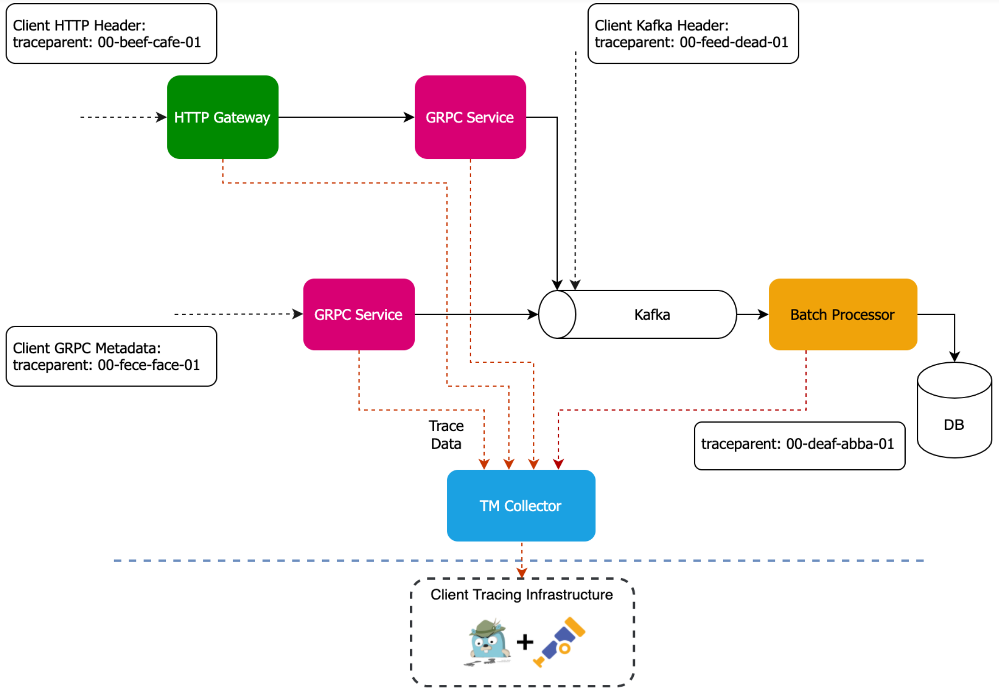

High-level tracing diagram depicts:

-   Client HTTP Header
    
-   HTTP Gateway
    
-   Client GRPC Metadata
    
-   2x GRPC Service
    
-   Kafka
    
-   Batch Processor
    
-   DB (Database)
    
-   TM Collector - `otel-collector` [agent-gateway architecture](https://opentelemetry.io/docs/collector/deployment/gateway/#combined-deployment-of-collectors-as-agents-and-gateways)
    
-   Client Tracing Infrastructure
    
-   Trace Data
    

### OpenTelemetry collector Agent-Gateway architecture

In Vault Core 5.5, Thought Machine has modified the resource type of the OpenTelemetry collector running on the Vault Core namespace. In versions of Vault Core prior to Vault Core 5.5, the `otel-collector` spans receiver was a Deployment running a single tracing pipeline.

However, Vault Core 5.5 adopts the [agent-gateway architecture](https://opentelemetry.io/docs/collector/deployment/gateway/#combined-deployment-of-collectors-as-agents-and-gateways) which helps to solve a significant issue:

#### Sampling

Vault Core can now have a smarter trace sampling policy by looking at the full trace and not just at individual spans. Tail sampling enables probabilistic sampling based on `tracing.sampler.arg`, and sampling for traces with at least one `ERROR`, and where the latency is above 500ms.

The following high-level tracing diagram showcases the new architecture which consists of an otel-collector Daemonset acting as an "agent" component, and another otel-collector Deployment acting as a "gateway" component. It depicts the Kubernetes Node, Vault Core services, otel-collector Dameonset "agent" running on every node, and the otel-collector Deployment "gateway".

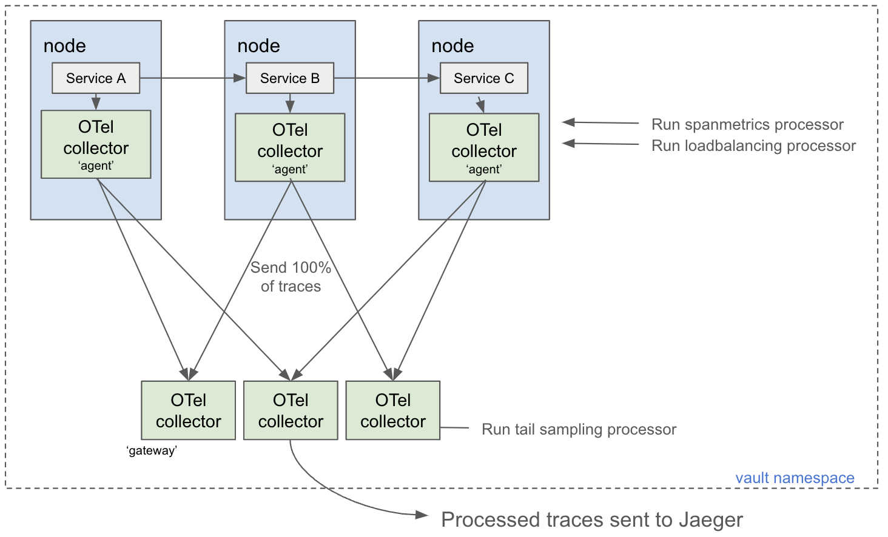

The following diagrams showcase the telemetry pipelines configured in the otel-collector "agent" and "gateway" workloads.

##### Agent

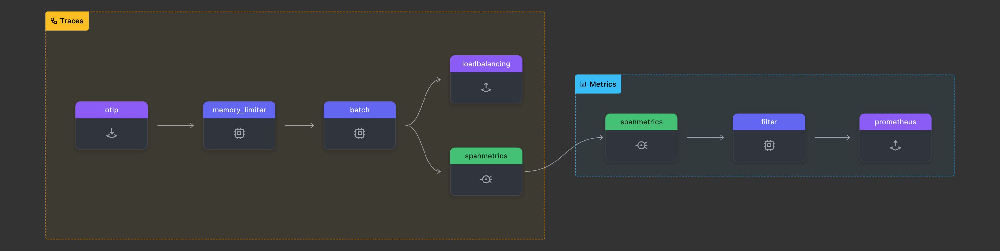

The agent pipeline flow comprises the following components:

-   OTLP receiver
    
-   Memory limiter processor
    
-   Batch processor
    
-   Loadbalancing exporter
    
-   Spanmetrics conector
    
-   Cardinality filter
    
-   Prometheus exporter
    

##### Gateway

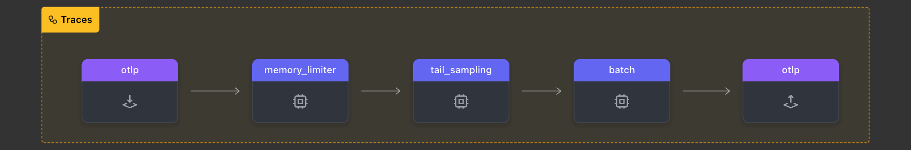

The gateway pipeline flow comprises the following components:

-   OTLP receiver
    
-   Memory limiter processor
    
-   Tailsampling processor
    
-   Batch processor
    

### Propagation of tracing ID through Vault Core services

You can use the features and functionality of Vault Core via two types of APIs:

-   an HTTP REST API – for making HTTP requests
    
-   a Streaming API – for sending Kafka messages
    

Once tracing is enabled for a given Vault Core instance, Vault Core generates spans to trace request journey through the Vault Core services.

An important part in the tracing process is the context propagation. This is a process of passing a trace context through the execution path of a request as it travels from one service to another. The trace context contains the trace ID, which acts as a unique identifier for the trace.

Vault Core operators can submit a custom tracing ID and observe it as it is propagated.

Let’s take a look at those APIs in more detail to understand how context propagation works in Vault Core.

#### Trace IDs in log entries

You should expect to see a trace ID in the log entries with an `ERROR` log level.

#### HTTP tracing

When you send an HTTP request to the HTTP REST API endpoints that creates, retrieves or updates a Vault Core resource, it creates a trace ID that is propagated throughout the system.

You have the option of including a tracing ID in your HTTP requests so that you can observe the propagation and link it back to your system.

Vault Core supports the following propagation standards:

-   [W3C TraceContext](https://www.w3.org/TR/trace-context/)
    
-   [B3 Propagation](https://github.com/openzipkin/b3-propagation)
    

HTTP requests propagate the trace IDs that you include in your HTTP request headers to all internal requests to the Vault Core gRPC services that sit behind it. This requires that the trace IDs comply with these standards.

##### W3C TraceContext

The W3C TraceContext standard uses the `traceparent` request header to share a trace ID. The `traceparent` HTTP request header describes the position of an incoming request in its trace graph. Every tracing tool must set `traceparent`.

The `traceparent` HTTP header field identifies an incoming request in a tracing system, in the following format:

Example:

For more information about TraceContext formatting standards, see [Examples of HTTP traceparent Headers on W3.org](https://www.w3.org/TR/trace-context/#examples-of-http-traceparent-headers).

To further illustrate this, consider the following request that attempts to retrieve a product version:

This request is missing the product ID; therefore, the service returns an error response. The response contains the tracing ID generated by Vault Core. This tracing ID is included in both response body under `tracing_id` key and response HTTP header `x-tm-tracingid`.

Here is the same request that provides a tracing ID `traceparent` HTTP request header:

Notice that Vault Core uses the tracing ID submitted with the request instead of generating a new one.

If a submitted request does not return an error, then the response only includes a tracing ID in the HTTP response header.

The following example demonstrates this:

The following screenshot of the Jaeger UI shows the propagation of the trace ID from the previous example request:

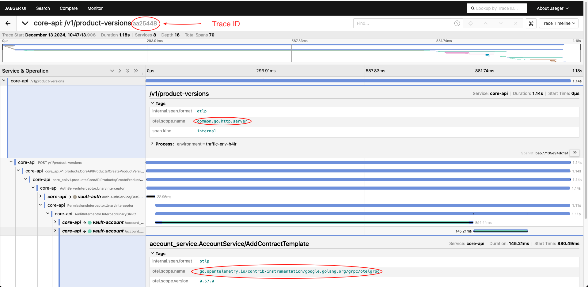

##### B3 Propagation

You can use the B3 Propagation standard in two formats:

-   Single header – [Single header on GitHub](https://github.com/openzipkin/b3-propagation?tab=readme-ov-file#single-header)
    
-   Multiple headers – [see Multiple headers on GitHub](https://github.com/openzipkin/b3-propagation?tab=readme-ov-file#multiple-headers)
    

Both formats support the same functionality.

###### Single header example

Example request with a single header and B3-formatted tracing:

###### Multiple headers example

Example request with multiple headers with B3-formatted tracing:

##### Tracing standards precedence

The following list of standards is in order of precedence, with the first one having the higher precedence:

1.  B3 Propagation Single header
    
2.  B3 Propagation Multiple headers
    
3.  W3C TraceContext
    

This is an example of request and response which demonstrates the above, notice how we submit traceparent and b3 headers:

#### GRPC tracing

Vault Core is composed of GRPC microservices. HTTP requests and Streaming API messages result in internal GRPC requests. The GRPC trace propagation depends on the type of request processing being executed. It can be single or batch processing.

##### GRPC request: single processing

This is the most common method of request processing. When a request is sent to a GRPC service, it starts its processing immediately and propagates the trace ID that it receives.

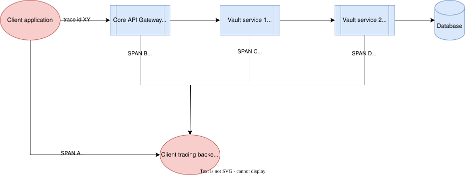

##### GRPC request: batch processing

Some services will buffer multiple inbound requests in memory and process them in one batch (by making further GRPC calls or sending Kafka messages or interacting with its database). When this happens, a new trace id is created to process this batch of requests. The new trace ID is then propagated to upstream GRPC requests.

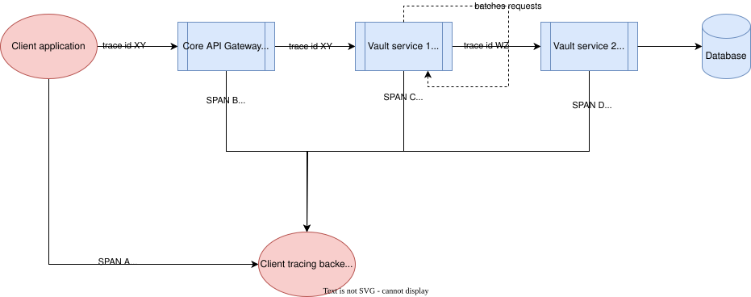

#### Kafka tracing

##### Trace IDs are created when messages are consumed

When a Vault Core Kafka consumer reads a batch of one or more messages, it creates a new trace ID to represent that individual batch execution of Vault Core. At this point, it is not possible to connect such an execution with an external trace ID that was part of the original message.

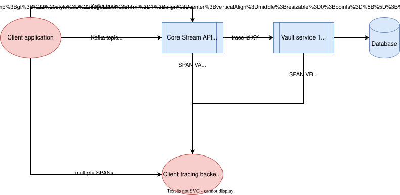

##### Span linking

Because you cannot rely on an external trace ID to connect a journey execution, you can use span links to make sure that you can understand different traces together in context. Span links can aid journey visualisation by showing spans from different traces altogether, as if they were members of the same trace. This allows users to understand a journey execution inside of Vault Core from the journey starting point. For more information, see the [OpenTelemetry Span Links documentation](https://opentelemetry.io/docs/concepts/signals/traces/#span-links).

Thought Machine supports span linking through its Kafka consumers, which include the Postings API and all the subsequent consumers called by it. As the following diagram illustrates, you can see that span links connect consumer spans to the producer spans.

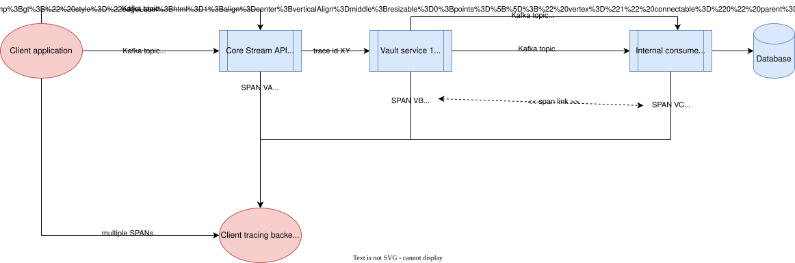

The following images of the Jaeger UI show the trace with a span link to a different trace:

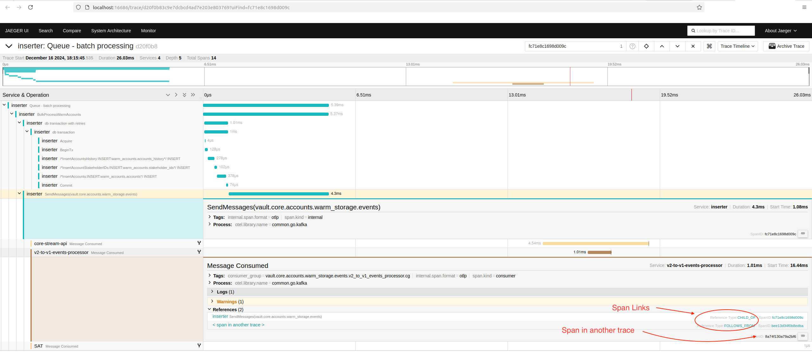

This example span link takes you to a different trace where the span resides:

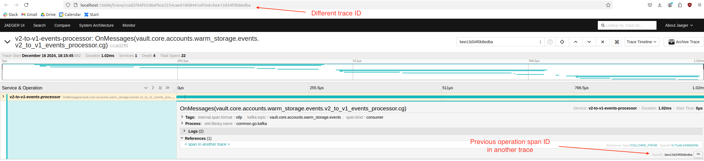

#### Scheduler tracing

A scheduled journey starts a process from within Vault Core, so there is no way for the Vault Core API user to set a custom trace ID. Instead, a new trace ID is generated and follows the propagation rules that this guidance described earlier.