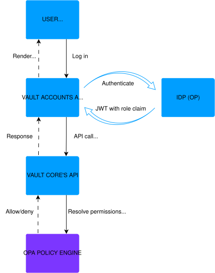

# Setting up and configuring OIDC authentication

## OpenID Connect (OIDC) overview

The following Vault Core applications allow users to log in via OpenId Connect (OIDC) as an alternative to [SAML Authentication](/vault-core/5-9/EN/environment_and_installation/infrastructure_docs/setting_up_and_configuring_vault_with_a_saml_idp):

-   [Vault Accounts App](/vault-core/5-9/EN/reference/core_apps_and_operations_dashboard/vault_accounts).
    
-   [Vault Jobs](/vault-core/5-9/EN/reference/core_apps_and_operations_dashboard/vault_jobs).
    
-   [Vault Processing Groups](/vault-core/5-9/EN/reference/core_apps_and_operations_dashboard/processing_groups).
    
-   [DLQ Inspector](/vault-core/5-9/EN/reference/core_apps_and_operations_dashboard/dlq_inspector).
    
-   [Usage Monitor](/vault-core/5-9/EN/reference/core_apps_and_operations_dashboard/usage_monitor).
    

chat\_bubble

These are the only Apps which currently support OIDC in addition to SAML. Vault Core supports OIDC with JWTs. OIDC with opaque tokens are not supported.

OpenID Connect is an authentication protocol that can be used by an App to authenticate users against a central Identity Provider (IdP), allowing federated Apps and organisations to communicate and trust each other’s users. Using OIDC auth with JWTs allows clients to align authentication and authorisation for humans with the mechanisms for machine-to-machine access control.

There are two main entities involved in authentication and authorisation:

-   A Relying Party (RP) entity, the App provider. The listed OIDC user auth capable Vault applications act as a Relying Party.
    
-   An Identity Provider (IdP) or OpenID Provider (OP) entity, allowing authentication and authorisation of the user trying to access the App via the RP.
    

OIDC is a protocol based on the [OAuth 2.0](https://oauth.net/2/) framework. Generally, OIDC uses the authorization code, access token, and refresh token (as described in the OAuth 2.0 specifications) while defining a new type of token called the ID Token (see the [OpenID Connect specification](https://openid.net/specs/openid-connect-core-1_0.html) for more information).

## Thought Machine’s implementation of OIDC

The following is a list of RFCs and Technical References to help you understand Thought Machine’s implementation and how to integrate with it:

-   OAuth 2.0 Core ([RFC 6749](https://datatracker.ietf.org/doc/html/rfc6749))
    
-   PKCE: Proof Key for Code Exchange ([RFC 7636](https://datatracker.ietf.org/doc/html/rfc7636))
    
-   OpenID Connect [Core 1.0](https://openid.net/specs/openid-connect-core-1_0.html)
    
-   JWT Profile for OAuth Access Tokens ([RFC 9068](https://datatracker.ietf.org/doc/html/rfc9068))
    

In particular, the following RFCs explain about the token format itself:

-   Bearer Token Usage ([RFC 6750](https://datatracker.ietf.org/doc/html/rfc6750))
    
-   JSON Web Token (JWT) format ([RFC 7519](https://datatracker.ietf.org/doc/html/rfc7519))
    

### Authentication flow

The Relying Party (RP) and the OpenID Provider (OP) do not always directly communicate during the authentication process. Instead, the user is forwarded from one to the other at the beginning and end of the exchange. Both need to be accessible from the user’s browser. For more information, see the [OpenID developer guidance](https://openid.net/developers/how-connect-works/).

Vault Core requires the Authorization Code Flow with [Proof Key of Code Exchange](https://oauth.net/2/pkce/) (PKCE). Vault Core requires PKCE on top of the Authorization Code Flow to prevent malicious actors from intercepting an authorization code and using it to obtain tokens, ensuring that the App requesting an authorization code is the same App that uses the authorization code to obtain a token.

The following summarises how Vault Core interacts with the OP to authenticate a user:

1.  The user opens an OIDC capable Vault Application.
    
2.  The Application queries the Environment Settings from the server, and if OIDC is being used it redirects the user to the OP.
    
3.  The user logs in to the OP.
    
4.  The OP verifies the user’s identity.
    
5.  The OP redirects the user back to application with an authorization code.
    
6.  The application front end calls the OP to exchange the authorization code with an access token and an ID token, as part of the PKCE flow.
    
7.  The application makes requests to the Vault Core’s back end using the access token.
    

## IdP requirements

The OIDC capable Vault applications require an Identity Provider that fully supports the OpenID Connect protocol - the OIDC standard endpoints (such as the `.well-known/openid-configuration`) and userinfo endpoints are expected to be reachable by the Vault application.

## Configuring Vault Core

Clients need to configure the details of the Identity Provider (IdP), by adding an entry to the `bearer_auth.issuers`. Vault Core expects the following fields:

-   `client_id` - A unique identifier for the OIDC capable Vault application, issued by the IdP during client registration. It is used by the OP to recognize which client is making the request.
    
-   `iss` - The URL that uniquely identifies the Identity Provider. It is used to validate the source of ID tokens and to discover other endpoints.
    
-   `jwks_uri` - The URL where the IdP publishes its public keys in JWKS (JSON Web Key Set) format. Vault Core uses this to verify the signature of tokens issued by the OP.
    
-   `jwt_audience` - Indicates the intended recipient of the token, optional. If present, this must exactly match the `aud` claim on the access tokens.
    

chat\_bubble

`bearer_auth.issuers` is also the config where clients set up the issuers for JWT machine-to-machine authentication. The issuer that is used for human authentication is identified by the existence of the `client_id` field. Clients should only set up one issuer with the `client_id` field.

Vault Core 5.8 saw the introduction of OIDC user authentication for Vault Accounts. The only Vault configuration necessary to trigger this was the addition of `bearer_auth.issuers`.

With the release of Vault Core 5.9, more Core applications now support OIDC user auth. In order to allow the effective set-up and validation of suitable user Roles, additional configuration has been defined within `values.yaml`. This configuration allows clients to enable the feature for each application. Each OIDC auth capable application can be configured with values `oidc` or `saml`

  
| Application | values.yaml field | default |
| --- | --- | --- |
| 
Vault Accounts App

 | 

core\_apps.vault\_accounts.auth

 | 

oidc

 |
| 

Vault Jobs

 | 

core\_apps.vault\_jobs.auth

 | 

saml

 |
| 

DLQ Inspector

 | 

core\_apps.dlq\_inspector.auth

 | 

saml

 |
| 

Usage Monitor

 | 

core\_apps.usage\_monitor.auth

 | 

saml

 |
| 

Vault Processing Groups

 | 

core\_apps.vault\_processing\_groups.auth

 | 

saml

 |

The access token issued by the OP must include a custom claim to represent a user’s roles. Clients set the claim in the JWT, which is the key that contains the role claim in Vault Core’s `values.yaml` file. To configure this claim in Vault Core, set the `bearer_auth.roles_based_access_control.roles_path` config in the `values.yaml` file.

lightbulb

Clients can use dot notation to reference nested keys in the JWT. For example, `roles.groups` refers to `{ "role": { "group": "…​" } }`.

For documentation to set up the roles and privileges, see [Managing user access via OIDC](/vault-core/5-9/EN/environment_and_installation/infrastructure_docs/setting_up_and_configuring_oidc_authentication#managing_user_access_via_oidc).

warning

If you grant a user any other role that is unknown to Vault Core, it will be ignored.

## Session Renewal

The OIDC capable Vault applications use the Authorization Code Flow with PKCE in conjunction with refresh tokens to renew sessions. During the initial authentication, the IdP returns an access token and a refresh token.

Shortly before the expiry of the access token, each application sends a token renewal request to the OP with the `grant_type=refresh_token` parameter, to obtain a new access token.

The access token is automatically renewed using the refresh token a few minutes before the access token expires. As such, Thought Machine recommends setting an access token lifetime longer than 5 minutes.

lightbulb

The refresh token lifetime also determines how long a user can stay logged into the App before they need to re-authenticate.

## Managing user access via OIDC

Vault Core provides the ability for users to log in via OIDC for each OIDC capable Vault application. To manage access control policies of users accessing these applications, you must set up [Roles version 2](/vault-core/5-9/EN/api/access_control_api#roles_version_2) resources in Vault Core.

warning

Only use role-based access control for human authentication; do not use it for machine-to-machine authentication, where non functional requirements on performance and availability are critical. Role-based access control adds small latencies and can reduce availability.

### Roles version 2

[Roles version 2](/vault-core/5-9/EN/api/access_control_api#roles_version_2) enables access control privileges to roles present in the JWT claims. A JWT can claim one or more Roles version 2 resources. To claim a role the JWT must contain one or more `external_references` of the role version 2 resource.

The Roles version 2 resource contains one or more privileges. Each privilege contains scopes which gives the role access to Vault Core APIs. The scope corresponding to each endpoint is mentioned in the [API reference](/vault-core/5-9/EN/api) documentation. Roles version 2 does not allow for addition of scopes that grant access to all endpoints on the API (such as core:write). Instead, assign scopes that give access to particular resources (such as core.accounts:write).

When a Roles V2 resource is created or updated, Vault Core validates against one of :create/:update scopes existing with :write scope on the same resource. This validation is performed for scopes across privileges.

Privileges can also contain attribute restrictions on the scopes under `abac_policies`. For more information, see [Setting up roles for attribute-based access control](/vault-core/5-9/EN/environment_and_installation/infrastructure_docs/setting_up_and_configuring_oidc_authentication#setting_up_roles_for_attribute_based_access_control).

chat\_bubble

Attribute-based access control (required for managing access via OIDC) is only available as an Extension. Contact your Thought Machine representative for more information.

### OPA policies

chat\_bubble

This section is only relevant if you manage your own custom [OPA policies](/vault-core/5-9/EN/reference/policies/opa-policies) or have a default OPA Policy in your values.yaml file. If you do not use custom policies or specify a default OPA Policy, no change is required and you can skip this section.

The scopes given to the roles are evaluated by the OPA policy against the expected scopes for endpoints. To provide the ability for OPA policies to evaluate roles, add the following to the custom OPA policy you are using:

#### OPA policy flow

The following diagram illustrates the OPA authentication flow:

### Setting up roles for role-based access control for OIDC user auth capable applications

To allow a role to perform a specific action, set up the Roles version 2 resource with the corresponding scopes.

Refer to the application relevant `Role permissions and scopes` documentation to determine the scopes required for access to the resources they require:

-   [Vault Accounts App](/vault-core/5-9/EN/reference/core_apps_and_operations_dashboard/vault_accounts#role_permissions_saml_and_scopes_oidc).
    
-   [Vault Jobs](/vault-core/5-9/EN/reference/core_apps_and_operations_dashboard/vault_jobs#role_permissions_saml_and_scopes_oidc).
    
-   [Vault Processing Groups](/vault-core/5-9/EN/reference/core_apps_and_operations_dashboard/processing_groups#role_permissions_saml_and_scopes_oidc).
    
-   [DLQ Inspector](/vault-core/5-9/EN/reference/core_apps_and_operations_dashboard/dlq_inspector#role_permissions_saml_and_scopes_oidc).
    
-   [Usage Monitor](/vault-core/5-9/EN/reference/core_apps_and_operations_dashboard/usage_monitor#role_permissions_saml_and_scopes_oidc).
    

## Setting up Product-based access control for OIDC capable Vault applications.

chat\_bubble

Product-based access control is available as an Extension. Contact your Thought Machine representative for more information.

To set up product-based access control, create [Roles version 2 resources](/vault-core/5-9/EN/api/access_control_api#roles_version_2) with privileges that contain `abac_policies`. The `abac_policies` map on a privilege contains OPA policies written in [Rego](https://www.openpolicyagent.org/docs/policy-language) which describe the attribute-based access control (ABAC) logic.

The `abac_policies` in a privilege will apply to all scopes contained in the privilege. This in turn means that every scope in the privilege with an ABAC policy must support ABAC. For a list of scopes that offer attribute-based access control on Product IDs, see [Scopes which support product-based access control](/vault-core/5-9/EN/environment_and_installation/infrastructure_docs/setting_up_and_configuring_oidc_authentication#scopes_which_support_product_based_access_control).

### Support for attribute-based access control

Vault Core supports attribute-based access control only on the Product ID. The following example Role has a privilege that has attribute-based restriction.

In this example, the Role of “OperationsManager” is granted:

-   Read access on all Products
    
-   Read and Write access for Accounts linked to the Product ID “Loan” and “Credit”
    
-   Read access to all flags linked to accounts with Product ID “Loan”
    

chat\_bubble

OPA policies for attribute-based access control can only contain logical operators to equate or inequate. Clients should only use `in`, `==` or `!=`

## Scopes which support product-based access control

The actions, with their scopes, that support product-based access control are described in the following table:

   
| Resource | Supported scopes | Supported actions | Description |
| --- | --- | --- | --- |
| 
Account

 | 

core.accounts:read

 | 

GET /v1/accounts  
GET /v1/accounts/{id}  
GET /v2/accounts  
GET /v2/accounts:batchGet  
GET /v1/accounts/{account\_id}:paramTimeseries

 | 

Restrict access to accounts linked to Product IDs.

 |
| 

Account

 | 

core.accounts:write

 | 

POST /v1/accounts  
PUT /v1/accounts/{account.id}  
POST /v2/accounts  
PUT /v2/accounts/{account.id}  
PUT /v1/accounts/{accounts.id}:updateDetails

 | 

Restrict access to accounts linked to Product IDs.

 |
| 

Account

 | 

core.accounts:create

 | 

POST /v1/accounts  
POST /v2/accounts

 | 

Restrict access to accounts linked to Product IDs.

 |
| 

Account

 | 

core.accounts:update

 | 

PUT /v1/accounts/{account.id}  
PUT /v1/accounts/{accounts.id}:updateDetails  
PUT /v2/accounts/{account.id}

 | 

Restrict access to accounts linked to Product IDs.

 |
| 

Account Attributes

 | 

core.account\_attribute\_values:read

 | 

GET /v1/account-attribute-values

 | 

Restrict access to Account Attribute values linked to Product IDs. List requests require account ID when Product restrictions are present.

 |
| 

Adjustments

 | 

core.adjustments:read

 | 

GET /v1/adjustments  
GET /v1/adjustments:batchGet  
GET /v1/adjustment-balance-corrections

 | 

Restrict access to Adjustments on Accounts linked to Product IDs. List requests require account ID when Product restrictions are present.

 |
| 

Adjustments

 | 

core.adjustments:write

 | 

POST /v1/adjustments  
PUT /v1/adjustments/{adjustment.id}

 | 

Restrict access to Adjustments on Accounts linked to Product IDs.

 |
| 

Adjustments

 | 

core.adjustments:create

 | 

POST /v1/adjustments

 | 

Restrict access to Adjustments on Accounts linked to Product IDs.

 |
| 

Adjustments

 | 

core.adjustments:update

 | 

PUT /v1/adjustments/{adjustment.id}

 | 

Restrict access to Adjustments on Accounts linked to Product IDs.

 |
| 

Balances

 | 

core.balances:read

 | 

GET /v1/balances/live  
GET /v2/balances/live  
GET /v1/balances/timerange  
GET /v2/balances/series  
GET /v2/balances/end

 | 

Restrict access to Balances on Accounts linked to Product IDs. List requests require account ID when Product restrictions are present.

 |
| 

Derived Parameter Value

 | 

core.derived\_parameter\_values:read

 | 

GET /v1/derived-parameter-values

 | 

Restrict access to derived parameter values on Accounts linked to Product IDs. List requests require account ID when Product restrictions are present.

 |
| 

Flags

 | 

core.flags:read

 | 

GET /v1/flags  
GET /v1/flags:batchGet

 | 

Restrict access to Flags on Accounts linked to Product IDs. List requests require account ID when Product restrictions are present.

 |
| 

Flags

 | 

core.flags:write

 | 

POST /v1/flags  
PUT /v1/flags/{flag.id}

 | 

Restrict access to Flags on Accounts linked to Product IDs.

 |
| 

Flags

 | 

core.flags:create

 | 

POST /v1/flags

 | 

Restrict access to Flags on Accounts linked to Product IDs.

 |
| 

Flags

 | 

core.flags:update

 | 

PUT /v1/flags/{flag.id}

 | 

Restrict access to Flags on Accounts linked to Product IDs.

 |
| 

Parameter Value

 | 

core.parameter\_values:read

 | 

GET /v1/parameter-values  
GET /v1/parameter-values:viewEffective  
GET /v1/parameter-values:batchGet

 | 

Restrict access to Parameter Values of Accounts linked to Product IDs. List requests require account ID when Product restrictions are present.

 |
| 

Parameter Value

 | 

core.parameter\_values:write

 | 

POST /v1/parameter-values  
PUT /v1/parameter-values/{parameter\_value.id}  
POST /v1/parameter-values:batchCreate

 | 

Restrict access to Parameter Values of Accounts linked to Product IDs.

 |
| 

Parameter Value

 | 

core.parameter\_values:create

 | 

POST /v1/parameter-values  
POST /v1/parameter-values:batchCreate

 | 

Restrict access to Parameter Values of Accounts linked to Product IDs.

 |
| 

Parameter Value

 | 

core.parameter\_values:update

 | 

PUT /v1/parameter-values/{parameter\_value.id}

 | 

Restrict access to Parameter Values of Accounts linked to Product IDs.

 |
| 

Payment Device Link

 | 

core.payment\_device\_links:read

 | 

GET /v1/payment-device-links  
GET /v1/payment-device-links:batchGet  
POST /v1/payment-device-links:search  

 | 

Restrict access to Payment Device Links on Accounts linked to Product IDs. List requests require account ID when Product restrictions are present.

 |
| 

Payment Device Link

 | 

core.payment\_device\_links:write

 | 

POST /v1/payment-device-links  
PUT /v1/payment-device-links/{payment\_device\_link.id}

 | 

Restrict access to Payment Device Links on Accounts linked to Product IDs.

 |
| 

Payment Device Link

 | 

core.payment\_device\_links:create

 | 

POST /v1/payment-device-links

 | 

Restrict access to Payment Device Links on Accounts linked to Product IDs.

 |
| 

Payment Device Link

 | 

core.payment\_device\_links:update

 | 

PUT /v1/payment-device-links/{payment\_device\_link.id}

 | 

Restrict access to Payment Device Links on Accounts linked to Product IDs.

 |
| 

Posting Instruction Batch

 | 

core.posting\_instruction\_batches:read

 | 

GET /v1/posting-instruction-batches  
GET /v1/posting-instruction-batches/{id}  
GET /v1/posting-instruction-batches:batchGet

 | 

Restrict access to postings on Accounts linked to Product IDs. Authorisation adjustment, settlement and release type postings are restricted when Product Restrictions are present.

 |
| 

Posting Instruction Batch

 | 

core.posting\_instruction\_batches:write

 | 

POST /v1/posting-instruction-batches  
POST /v1/posting-instruction-batches:asyncCreate

 | 

Restrict access to postings on Accounts linked to Product IDs. Authorisation adjustment, settlement and release type postings are restricted when Product Restrictions are present.

 |
| 

Posting Instruction Batch

 | 

core.posting\_instruction\_batches:create

 | 

POST /v1/posting-instruction-batches  
POST /v1/posting-instruction-batches:asyncCreate

 | 

Restrict access to postings on Accounts linked to Product IDs. Authorisation adjustment, settlement and release type postings are restricted when Product Restrictions are present.

 |
| 

Products

 | 

core.products:read

 | 

GET /v1/products  
GET /v1/products:batchGet

 | 

Restrict access to Products with IDs.

 |
| 

Product Version

 | 

core.product\_versions:read

 | 

GET /v1/product-versions:batchGet  
GET /v1/product-versions  
GET /v1/product-versions/{product\_version\_id}:paramTimeseries

 | 

Restrict access to Product Versions of Products with IDs.

 |
| 

Product Version

 | 

core.product\_versions:write

 | 

POST /v1/product-versions  
POST /v1/product-versions:batchUpdate  
PUT /v1/product-versions/{product\_version\_id}:updateParams

 | 

Restrict access to Product Versions of Products with IDs.

 |
| 

Product Version

 | 

core.product\_versions:create

 | 

POST /v1/product-versions

 | 

Restrict access to Product Versions of Products with IDs.

 |
| 

Product Version

 | 

core.product\_versions:update

 | 

POST /v1/product-versions:batchUpdate  
PUT /v1/product-versions/{product\_version\_id}:updateParams

 | 

Restrict access to Product Versions of Products with IDs.

 |
| 

Restriction Set

 | 

core.restriction\_sets:read

 | 

GET /v1/restriction-sets  
GET /v1/restriction-sets:batchGet

 | 

Restrict access to Restriction Sets of Accounts linked to Product IDs. List requests require account ID when Product restrictions are present.

 |
| 

Restriction Set

 | 

core.restriction\_sets:write

 | 

POST /v1/restriction-sets+ PUT /v1/restriction-sets/{restriction\_set.id}

 | 

Restrict access to Restriction Sets of Accounts linked to Product IDs. List requests require account ID when Product restrictions are present.

 |
| 

Restriction Set

 | 

core.restriction\_sets:create

 | 

POST /v1/restriction-sets

 | 

Restrict access to Restriction Sets of Accounts linked to Product IDs. List requests require account ID when Product restrictions are present.

 |
| 

Restriction Set

 | 

core.restriction\_sets:update

 | 

PUT /v1/restriction-sets/{restriction\_set.id}

 | 

Restrict access to Restriction Sets of Accounts linked to Product IDs. List requests require account ID when Product restrictions are present.

 |
| 

Restriction

 | 

core.restrictions:read

 | 

GET /v1/restrictions

 | 

Restrict access to Restrictions of Accounts linked to Product IDs.

 |
| 

Schedule

 | 

core.schedules:read

 | 

GET /v1/schedules

 | 

Restrict access to Schedules of Accounts linked to Product IDs. List requests require account ID when Product restrictions are present.

 |

## Example CLU Pack for Roles v2 with ABAC

Manifest for the CLU Pack.

The following subsections provide the accompanying resources:

### Admin role

Provides global read/write access on all scopes. Unrestricted access to Vault Core APIs.

CLU resource for admin role

### Accounts App admin role

Provides access to perform all actions within the Accounts App.

CLU resource for Accounts App admin role

### Accounts app restricted role

Provides access to perform all actions within the Accounts App, but restricted to accessing resources associated with a limited set of product IDs.

This splits some of the scopes out into a separate privilege, as the scopes in question do not support product-based access control.

The below example uses example product IDs (`example_loan_product_1`, `example_mortgage_product_1`, `example_mortgage_product_2`). Replace them with the Product IDs you want the role to have access to.

chat\_bubble

This `Role` makes use of the product-based access control extension that is not enabled in Vault Core by default, and will be rejected without the feature being enabled.

CLU resource for Accounts App restricted role