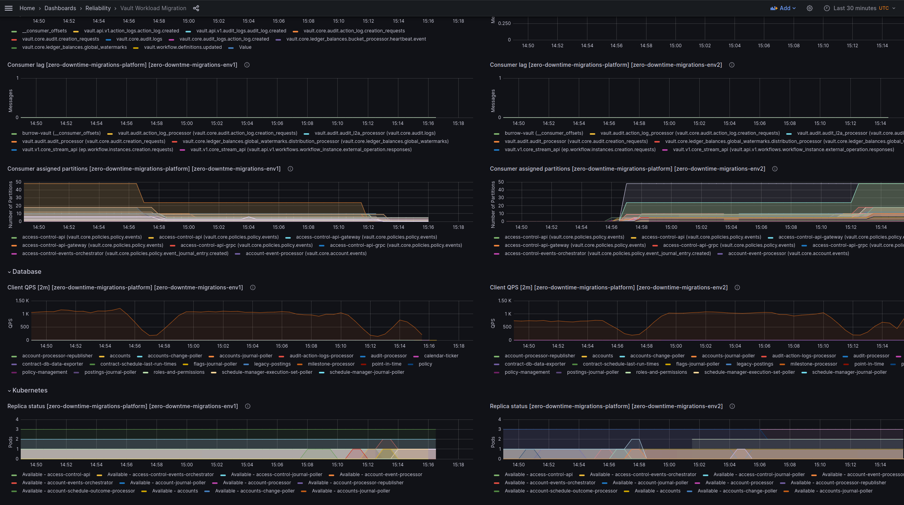
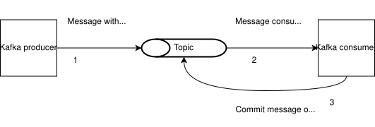
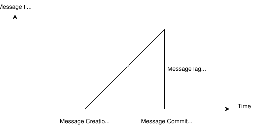
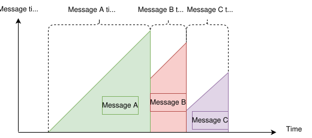
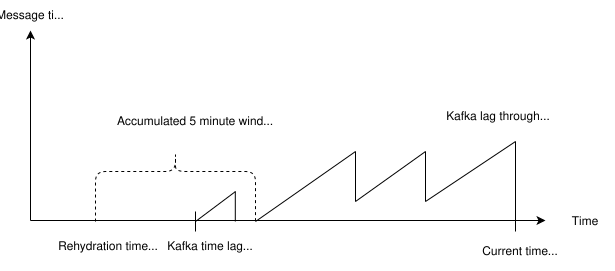

# Active-Passive mode

Bank-hosted

chat\_bubble

From Vault Core 5.5, clients can choose to operate Vault Core in Active-Passive deployment mode.

From Vault Core 5.6, clients using multiple databases have access to an operational mode that improves Recovery Time Objective (RTO).

You can run Vault Core in an Active-Passive deployment mode that comprises:

-   Active environment: your fully-functional live Vault Core environment.
    
-   Passive environment: an additional environment of Vault Core which uses a standby, read-only database replicated from the active environment. Kafka may be either an independent, separate cluster, or replicated from the active one. This Vault Core environment, alongside its infrastructure prerequisites, is usually installed in another region.
    

Another potential use case is using the passive environment to serve data via read APIs to a different set of users, without affecting the performance of the active environment.

This guide goes through the steps to set up an Active-Passive Vault Core environment, as well as how to perform a failover to the passive environment.

## Using Vault Core in Active-Passive mode

Vault Core uses a PostgreSQL relational database as the source of truth. In the default Vault Core setup, Vault Core is installed across multiple availability zones within a single region. Kafka and Vault Core microservices are highly-available. The recommended setup also includes a highly-available, synchronously-replicated PostgreSQL setup. This way, Vault Core can be available during zonal outages and without suffering any data loss.

Sometimes you may also want to tolerate regional outages by applying the same pattern across regions at the expense of additional infrastructure cost. Unfortunately, Cloud Service Providers (CSPs) do not provide a cross-regional synchronous replication for PostgreSQL as the geographic distances are often prohibitively large and introduce noticeable performance degradation.

Instead, you can configure an asynchronous PostgreSQL replica in a different region.

### Use cases for Active-Passive mode

The Active-Passive mode allows you to install Vault Core in another, passive, region where the database is in standby, read-only mode.

-   The main use case for this is having a multi-region Active-Passive setup where the database in the passive region is replicating from the primary (active) region.
    
    -   This setup provides significantly improved Recovery Time Objective (RTO) and Recovery Point Objective (RPO) during regional outages, compared to a fresh installation of Vault Core with the database restored from a snapshot.
        
    
-   A potential secondary use case is using the passive environment to serve data via read APIs to a different set of users, without affecting the performance of the active environment.
    

These benefits comes at the expense of additional operational and hosting costs. You could also combine the two approaches - for example, a snapshot restoration is useful for other types of disaster, such as accidental or malicious data corruption.

error

Asynchronous replication (and snapshot restoration) implies some data loss may occur. The decision of whether to perform a failover and risk some data loss, instead of waiting for the outage to end is informed by many factors. Many of these factors are specific to your set up and are therefore outside the scope of this guide.

For the same reason, if you are serving API reads from the passive environment then there is some chance that the data returned is slightly stale.

### Kafka Time Lag

For this Active-Passive feature, Thought Machine has introduced a new term: Kafka consumer group *time* lag.

The distinction between the *time lag* and *lag* of a consumer group is as follows:

-   (Message) lag: in the Kafka community, the lag of a consumer group represents the number of unprocessed messages
    
-   Time lag: however, the time lag of a consumer group measures the time difference between now and the timestamp of the earliest unprocessed message
    

This *time lag* measurement provides a more precise way to determine a suitable time window to run Kafka rehydration (republishing of persisted data from the database to Kafka) during disaster recovery.

Not having the *time lag* measurement would mean having to fallback to a very conservative stance of running Kafka rehydration over a much larger time window. Doing so is often unnecessary and, therefore, undesirable because it affects the Recovery Time Objective.

#### Collecting consumer lag to estimate a suitable Kafka rehydration window

Consumer lag information is collected and replicated into the passive region. This enables Thought Machine and clients to estimate the correct timestamp to run Kafka rehydration in the passive region for a disaster recovery.

The replication of lag samples in the passive region is important. It leverages PostgreSQL replication to provide a reliable way to inform an optimised timestamp for a disaster recovery independent of the functional state of the active region.

The lag for each topic and partition is collected and is the basis for calculating the rehydration timestamp.

The rehydration timestamp is the latest timestamp when the active environment is known to be running without consumer groups accumulating messages lag. It marks the estimated time when all journeys can be rehydrated and downstream processing can occur without the risk of incompleteness.

#### Metrics and dashboards

Consumer lag information, along with suggested recovery time, is available in both passive and active regions through metrics.

The data is sampled from the active region and made visible to the **Consumer lag for Kafka rehydration** dashboard in the **Reliability** folder. The same information is also replicated in the passive region under its equivalent dashboard.

### Kafka-based derived database replication mode

To improve Recovery Time Objective (RTO) for Vault Core instances running on multiple physical databases (Warm and Hot data), Vault Core provides an operational mode. In an Active-Passive setup with asynchronous PostgreSQL replication of the Hot database and Kafka replication, this mode keeps the passive region’s Warm database behind the Hot database. This avoids the RTO impact of a Warm database rollback, which is typically necessary to guarantee ordering and financial consistency.

See: [Background to the disaster recovery process for Vault Core with multiple physical databases](/vault-core/5-9/EN/environment_and_installation/infrastructure_docs/advanced_deployment_modes/multiple_physical_databases#background_to_the_disaster_recovery_process_for_vault_core_with_multiple_physical_databases).

### Limitations

This Active-Passive feature has the following limitations:

-   Only a single environment can be active at a time - this is dictated by the standby database being read-only.
    
    -   If you use a separate, read-write database (active-active), you will have a split brain as a result. This means that you will have conflicting data and behaviour, which will most likely have severe negative business impact. This active-active setup is strictly not supported by Thought Machine.
        
    -   During a real disaster or scheduled failover, you must isolate the active environment so that it cannot receive write traffic, even if the failure condition resolves.
        
    
-   You cannot install a Vault Core version in the passive environment that is higher than the one in the active environment because it may contain database schema changes that cannot be performed against a standby database.
    
-   The Vault Core version in the passive environment cannot be of a different major version. During a major version upgrade, you cannot use the Active-Passive functionality.
    
-   All APIs performing writes fail in the passive environment. This includes logging into the Operations website because Thought Machine keeps track of active sessions in the database.
    
-   Audit information from the Audit API is only streamed to Kafka but is not persisted in the database.
    
-   The idempotence guarantees may not hold for the outcomes lost during failover due to asynchronous data replication. You may get a different outcome for the same request that occurred in the original active environment and were lost due to asynchronous data replication. This is because replaying the relevant API calls against the new environment may be intertwined with new actions that affect their outcomes.
    
-   The traffic, database, and Kafka failovers are performed separately and beyond the Active-Passive feature functionality. Likewise, the issuance and distribution of TLS (Transport Security Layer) certificates with appropriate Subject Alternative Names (SANs) is outside the scope of Vault Core Active-Passive.
    
-   After a failover, you cannot switch back to the old active environment because you risk a split-brain scenario. Instead, you should create a new Vault Core passive environment with its own infrastructure and then perform a failover when convenient.
    
-   When upgrading an Active-Passive deployment, you must upgrade the passive environment before finalising the active one. Finalising the active environment without first upgrading the passive one will prevent the ability to perform a failover to the passive environment.
    

## Prerequisites

### Infrastructure setup

The Passive environment has the same infrastructure requirements as a standard Vault Core environment with some small adjustments. Refer to the standard documentation for instructions while also taking into account the following sections.

#### PostgreSQL

The PosgreSQL database (or databases) in the passive environment must replicate from the primary database in the active environment. Most Cloud Service Providers (CSPs) provide this as part of their managed PostgreSQL service offering.

#### Kafka

The Kafka cluster in the passive environment can be standalone, or replicated from the one in the active environment using a replicator tool, such as [Kafka MirrorMaker 2](https://kafka.apache.org/documentation/#georeplication).

##### Considerations for standalone Kafka versus replicated Kafka

info

The [**Kafka-based derived database replication mode**](/vault-core/5-9/EN/environment_and_installation/infrastructure_docs/tmcomponent_operator_user_guide/active_passive#kafka_based_derived_database_replication_mode) requires **Replicated Kafka** as a prerequisite.

The following table describes some of the factors that you should consider when choosing between standalone and replicated Kafka configurations.

  
| Consideration | Standalone Kafka | Replicated Kafka |
| --- | --- | --- |
| 
Setup requirements

 | 

No impact

 | 

A Kafka replicator service deployed in the passive environment, configured to replicate messages and consumer group offsets from the active environment to the passive environment.

 |
| 

Recovery time

 | 

The Kafka rehydration window start time, which impacts recovery time, is derived from the consumer lag of consumers in the active environment. In most cases, consumer lag across Vault Core should be low and relatively constant (in the order of minutes). However, during some incidents affecting consumer throughput, time lag may increase and, therefore, affect rehydration if you need to perform a failover.

 | 

The Kafka rehydration window start time, which impacts recovery time, is based on the lag of the Kafka cluster replicator. This should be more predictable, more consistent, and unrelated to Vault Core processing Kafka messages.

 |
| 

Recovery point

 | 

No impact

 | 

No impact

 |
| 

Message retention in the passive environment

 | 

The Kafka cluster in the passive environment contains no messages before failover and only contains rehydrated and new messages after failover.

 | 

The Kafka cluster in the passive environment contains messages for the whole retention period before and after failover, with the exception of those that are lost during failover.

 |
| 

Performance and resource utilisation

 | 

No impact

 | 

Negligible impact on Kafka cluster resource utilisation in both the active and passive environments, including, for example, CPU, network, disk.

 |
| 

Cost

 | 

No impact

 | 

Additional costs for hosting a replicator service and cross-region replication traffic.

 |
| 

[Kafka-based derived database replication mode](/vault-core/5-9/EN/environment_and_installation/infrastructure_docs/tmcomponent_operator_user_guide/active_passive#kafka_based_derived_database_replication_mode)

 | 

Not supported

 | 

Required

 |

##### Setup for replicated Kafka

In the replicated Kafka configuration, you must deploy a Kafka replicator service that replicates messages from the Kafka cluster in the active environment to the cluster in the passive environment. Any Kafka replicator service is suitable, as long as it meets the requirements in the following table.

 
| Requirement | Reason |
| --- | --- |
| 
Consumer offsets replication

 | 

Replicating consumer offsets, which is also known as *offset translation*, means that services in the passive environment can begin consuming from near-enough where the consumers in the active environment finished.

If consumer offsets are not replicated, consumers in the passive environment would need to consume from one of the following:

-   the earliest messages in the topics - this significantly increases recovery time
    
-   the latest messages - this increases the rehydration requirements and, therefore, increases recovery time
    

 |
| 

Cross-region replication

 | 

The active and passive environments will likely be in different regions; if you are using a managed service you must ensure that it supports cross-region replication.

 |
| 

Replication lag latency metric

 | 

Required for deriving the rehydration start time.

 |
| 

Selective replication

 | 

Some topics, such as topics in the Audit pipeline, are not rehydrated as part of the failover process; therefore, you should exclude such topics from replication.

 |

###### Additional configuration requirements

-   You must colocate the Kafka replicator with the passive environment to ensure it is available in the event of a failure in the active environment.
    
-   You must configure the Kafka replicator to exclude topics with the prefix `vault.core.audit` and consumer groups with the prefix `vault.audit`.
    
-   You must monitor the Kafka replicator lag latency from the passive environment to derive the rehydration start time upon failover.
    
    -   To calculate the rehydration start time, subtract the replication lag latency from the current time.
        
    -   You must make this timestamp available in RFC3339 format and use it as the `--override-from-time` value when running the `vaultctl dr rehydrate` command during failover.
        
    

#### Sharing secrets

You must ensure that both environments have access to the same secrets. You can find information about this in [Shared secrets access](/vault-core/5-9/EN/environment_and_installation/infrastructure_docs/tmcomponent_operator_user_guide/shared_secrets_access).

#### Ingress

To perform a network traffic failover between the active and passive environment you must be able to direct traffic from one environment to the other.

Vault Core does not have very specific requirements around the ingress traffic routing solution.

The Vault Core installation creates Kubernetes Ingress API objects during the installation process. You have the freedom to ingest that configuration into whichever integration works best for your organisation.

Therefore, the ingress failover mechanism is under your control, but this guidance describes a method based on DNS (Domain Name System).

##### DNS failover

Thought Machine’s preferred failover strategy is DNS failover, a method that uses DNS records as the authority on which of the environment’s requests should be routed to.

With this method, both the active and passive environment are installed as standard, each with their own DNS subdomain and ingress endpoints.

Thought Machine then defines an additional *shared* subdomain, creating CNAME records that point to either the active or passive subdomain to indicate which environment should receive traffic. Failover is achieved by swapping the value of those CNAME records.

The requirements to use this method are described in the following sections.

###### Shared DNS subdomain

The shared DNS subdomain is distinct from the active or passive environment DNS subdomains. To integrate the shared subdomain with the active and passive environments, Thought Machine exposes configuration options for each of the Vault Core services that require an ingress endpoint.

These options are labelled as `shared_endpoint`. Examples include:

-   `access_control_api.shared_endpoint`
    
-   `audit.shared_endpoint`
    
-   `core.shared_endpoint`
    
-   `data_loader_api.shared_endpoint`
    
-   `documents.shared_endpoint`
    
-   `ops.website.shared_endpoint`
    

chat\_bubble

When using DNS failover, you must set these values on both the active and passive environments in order to enable the Active-Passive deployment mode. The value for `shared_endpoint` must be different to its respective `endpoint` value in order to be valid. That is, the endpoint and shared endpoint for each service must be unique.

###### CNAME pointer records

CNAME pointer records are DNS records under the shared subdomain that point to the active environment. During failover, the value of these records is replaced with the domain of the passive environment. How these CNAME records are created depends on hosting provider. For more information, see [Expected infrastructure](/vault-core/5-9/EN/environment_and_installation/infrastructure_docs/getting_started_with_vault_core/infrastructure_overview#expected_infrastructure).

chat\_bubble

Thought Machine recommends that you use a low Time-To-Live (TTL) value for the CNAME records, in order to allow clients to resolve the new address swiftly following a failover. Higher TTL values may result in delays on clients connecting to the newly promoted environment. A value of 60 seconds or less is a good starting point, but you must balance this against the additional name resolution load on your DNS hosts.

###### Ingress TLS secrets

For TLS termination, the ingress controller must use a certificate that trusts traffic originating from the shared subdomain and the environment subdomain.

You can achieve this by using the same certificate for both endpoints; either add alternative names as appropriate or use a separate certificate for the shared subdomain.

You can specify the ingress certificate - for the shared endpoints to use - in the environment configuration by using the option labelled `shared_tls_secret_name`.

For example:

-   `access_control_api.shared_tls_secret_name`
    
-   `audit.shared_tls_secret_name`
    
-   `core.shared_tls_secret_name`
    
-   `data_loader_api.shared_tls_secret_name`
    
-   `documents.shared_tls_secret_name`
    
-   `ops.website.shared_tls_secret_name`
    

chat\_bubble

The values for `*.shared_tls_secret_name` and `*.tls_secret_name` do not need to be different.

Ingress endpoints can share the same certificate; in this case, you should define all of the listed endpoints as alternative names on the certificate.

##### Alternative methods

The DNS failover approach uses only basic DNS capabilities, therefore making it cloud-provider agnostic. It is also loosely coupled to the cluster and Vault Core instance, and does not require any additional self-managed infrastructure.

However, there are a few other ways of performing a network traffic failover but each has their own set of trade-offs, as follows.

###### DNS routing policies

Some DNS providers offer a feature that returns query answers based on health checks configured for the IP endpoints.

This is beneficial, as all Active-Passive endpoints are pre-configured, and the DNS provider handles switching between them. However, it does require implementing health check logic that can signal the provider to perform the swap at the appropriate time. Furthermore, no health check is perfect. You may find it strongly preferable to control the moment that you perform the switchover, in the case of a disaster.

###### Istio traffic shifting

The Istio service mesh is capable of shifting traffic between different subsets of the same microservice. If it is installed using the Multicluster configuration option, you can direct traffic between two Vault Core API gateways on different clusters, using just Istio APIs.

This method avoids any external dependencies to Vault Core. However, it also involves a complex setup of Istio and Istio API objects that have so far not been tested with Vault Core.

Furthermore, it means that traffic may travel across two regions during normal operations, incurring cost and latency.

###### Forward proxy

Using a forward proxy involves setting up a server to forward requests to the active instance, with the passive instance on standby. Performing a failover would involve reconfiguring the proxy routes to direct traffic to the passive instance instead.

This has the advantage of being a single authority on which instance should receive traffic. However, it also has the disadvantage of being an additional deployment that you need to operate.

You would also need to deploy the forward proxy in a third, separate region, in order to satisfy regional availability guarantees.

This increases operational complexity, and introduces additional cross-region latency for requests.

###### Reconfiguring clients

Instead of directing traffic on the server side, another option is to reconfigure your clients.

This involves pointing your clients at the active environment, and then reconfigure them to point to the passive environment during a failover.

This requires no additional infrastructure to work, but it adds complexity to the client application logic.

### Vault Core setup

#### Vault Core active environment

You may need to make configuration changes in your active environment depending on how you plan to direct your client traffic using DNS records.

##### Directing client traffic to the new environment and DNS records

During BAU, you will not need to do anything to the active environment if you plan to manually carry out both of the following:

-   You will direct your client traffic straight to the DNS records for your active environment
    
-   In the event of a disaster, after failover, you will configure your clients to point to the new environment
    

This means it is easy to extend the default setup with the Active-Passive mode.

##### Switching to the recovery environment by updating DNS records

If you plan to manage the switch to the recovery environment by updating DNS records, then you must configure the shared endpoints and secrets in `values.yaml`.

Make the following configuration changes in `values.yaml`:

-   Populate the `*.shared_endpoint` fields for each API - for example, `access_control_api.shared_endpoint` and `core.shared_endpoint` - with the shared endpoint used for ingress.
    
-   Set the `k8s.ingress.*.shared_tls_secret_name` fields in the `k8s.ingress` section - for example, `k8s.ingress.audit.shared_tls_secret_name` and `k8s.ingress.core.shared_tls_secret_name` - to the secret containing the shared certificate.
    

#### Vault Core passive environment

Once you have set up the passive environment’s infrastructure as per the instructions in the previous section, you are ready to create the passive Vault Core installation.

The `values.yaml` for the passive environment must be separate and differ to the active environment. For example, you need to use the new database and Kafka clusters.

error

Except for the mandatory changes listed in this section (database/Kafka cluster addresses and specific flags), all other service configurations in the passive environment’s `values.yaml` must exactly match those in the active environment’s `values.yaml`.

If you switch traffic between the environments by updating DNS records, then you must populate the `values.yaml` for the passive environment with the same values for `*.shared_endpoint` and `k8s.ingress.*.shared_tls_secret_name` fields. This in the Vault Core active environment section.

In addition, you need to set the following flags in the `values.yaml`:

-   `common.mode.passive` to `true`
    
-   `common.mode.standby_db` to `true`
    
-   `scheduler.mode.passive` to `true`
    

These flags default to `false` and, therefore, having them as `false` results in Vault Core being configured as `active`.

error

The Vault Core Active-Passive feature does not support multiple environments being `active` at the same time.

Doing so and processing live traffic from both (implying read-write databases in both environments) results in a split brain situation which will likely have a severe negative business impact. This is why during an actual disaster recovery failover, you should stop the live traffic to the old `active` environment as soon as possible.

##### Multiple database environments using the kafka-based derived database replication mode

Thought Machine recommends that [multiple databases](/vault-core/5-9/EN/environment_and_installation/infrastructure_docs/advanced_deployment_modes/multiple_physical_databases#about_this_deployment_mode) are [set up](/vault-core/5-9/EN/environment_and_installation/infrastructure_docs/vault_cloud_infrastructure/configuring_multiple_databases) first before setting up the Active-Passive deployment mode.

In addition to the [Vault Core passive environment instructions](/vault-core/5-9/EN/environment_and_installation/infrastructure_docs/tmcomponent_operator_user_guide/active_passive#vault_core_passive_environment), the following flag must be set to true in the `values.yaml` file:

-   `common.mode.enable_kafka_based_derived_db_replication`
    

The Warm Storage database must be a standalone instance, either promoted from a replica of the primary Warm Storage instance or restored from a snapshot.

The Warm Storage service will replay all replicated events during environment bootstrapping.

The passive environment setup process, in this operational mode, can be done as follows:

1.  Set up the active environment.
    
2.  Set up the passive environment.
    
    1.  Create the passive hot database as a read replica of the primary hot database.
        
    2.  Create the passive Warm Storage database as a read replica of the primary Warm Storage database.
        
    3.  Wait for the passive Warm Storage database to reach a low and consistent replication lag.
        
    4.  Promote the passive Warm Storage database.
        
    5.  [Set up Kafka replication from the active environment to the passive environment](/vault-core/5-9/EN/environment_and_installation/infrastructure_docs/tmcomponent_operator_user_guide/active_passive#setup_for_replicated_kafka).
        
    6.  Install Vault Core in the passive environment.
        
    

###### Kafka topics consumed in the passive environment

These following topics are consumed from in the passive environment:

-   `vault.core.accounts.account.events`
    
-   `vault.core.ledger.instruction_group.events`
    
-   `vault.core.ledger.instruction_group.migrated.events`
    

###### Kafka topics excluded from replication

In the passive environment, these topics should be monitored for issues. If the Warm Storage Inserter service encounters database or incoming message problems, it will write to the respective DLQ topic. This can lead to the database diverging from the active environment.

Do not replicate these topics into the passive environment:

-   `vault.core.accounts.warm_storage.events.warm_storage.dlq`
    
-   `vault.core.ledger.instruction_group.events.warm_storage.dlq`
    
-   `vault.core.ledger.instruction_group.migrated.events.warm_storage.dlq`
    

###### Warm Storage Inserter passive consumer groups

The Warm Storage Inserter service will consume from the following consumer groups in the passive environment:

 
| Topic | Consumer group |
| --- | --- |
| 
`vault.core.ledger.instruction_group.migrated.events`

 | 

`vault.core.ledger.instruction_group.migrated.events.account_balances.passive.cg`

 |
| 

`vault.core.ledger.instruction_group.events`

 | 

`vault.core.ledger.instruction_group.events.account_balances.passive.cg`

 |
| 

`vault.core.ledger.instruction_group.migrated.events`

 | 

`vault.core.ledger.instruction_group.migrated.events.warm_storage.passive.cg`

 |
| 

`vault.core.accounts.account.events`

 | 

`vault.core.accounts.account.events.warm_storage.passive.cg`

 |
| 

`vault.core.ledger.instruction_group.events`

 | 

`vault.core.ledger.instruction_group.events.warm_storage.passive.cg`

 |

## Upgrading in Active-Passive mode

You must first upgrade both active and passive environments to the same Vault Core version as each other before performing [finalisation](/vault-core/5-9/EN/environment_and_installation/infrastructure_docs/tmcomponent_operator_user_guide/installing_or_upgrading_vault#finalisation) in both environments, and in the correct order.

To complete an upgrade for an Active-Passive deployment, you must:

1.  Upgrade the active environment to the newer version of Vault Core first.
    
2.  Verify the active environment to ensure it is working properly and a [rollback](/vault-core/5-9/EN/environment_and_installation/infrastructure_docs/tmcomponent_operator_user_guide/rolling_back_vault_core) is not required. If you need to roll back the active environment, you should do so before upgrading the passive environment.
    
3.  Upgrade the passive environment to match the Vault Core version of the active environment.
    
4.  Run finalisation in the active environment first.
    
5.  Run finalisation in the passive environment second, to synchronise the cluster state with the database state.
    

error

You **must** upgrade the passive environment **before** finalising the active one. Failure to do so will result in a state where [failover](/vault-core/5-9/EN/environment_and_installation/infrastructure_docs/tmcomponent_operator_user_guide/active_passive#promoting_a_passive_environment_to_perform_a_failover) to the passive environment cannot be performed, because the database may no longer be compatible with the standby version of Vault Core.

### Performing a failover during finalisation

You can still [perform a failover](/vault-core/5-9/EN/environment_and_installation/infrastructure_docs/tmcomponent_operator_user_guide/active_passive#promoting_a_passive_environment_to_perform_a_failover) in Active-Passive mode even if you have not yet upgraded and finalised both the active and passive environments.

If you are at any of the following stages of upgrading an Active-Passive deployment, you will be able to perform a failover:

-   Active upgraded, passive not upgraded, neither finalised (at this point, failover also counts as a rollback)
    
-   Active upgraded, passive upgraded, neither finalised
    
-   Active upgraded, passive upgraded, active finalised
    

In all scenarios, you must first provision a new passive environment that is **the same version** as the new active environment, and then continue with the upgrade process for both environments before carrying out a failover.

## Promoting a passive environment to perform a failover

To perform a failover in Active-Passive mode, you need to promote the passive environment to take over from the active environment.

### Overview of the workflow for performing a failover in Active-Passive mode

Here is a high-level summary of the failover process:

1.  Disable traffic to the original environment.
    
2.  Determine the Kafka time lag (you need this in order to complete step 6).
    
3.  Perform a database failover in the passive environment.
    
4.  Switch Vault Core to active mode in the target environment using `vaultctl`.
    
5.  Pre-scale the target environment using `vaultctl` (optional).
    
6.  Perform Kafka rehydration on the target environment.
    
7.  Enable traffic to the target environment.
    
8.  Disable artificial scaling and enable the scheduler using `vaultctl`.
    

After performing the failover and the new active Vault Core environment starts accepting writes, the two databases diverge.

At this stage, you must:

1.  Stop accepting live traffic on the old active environment as soon as possible.
    
2.  Carry out any additional forensics that you may need to reduce your RPO.
    
3.  Re-create a new passive environment, if you want to maintain an Active-Passive deployment model.
    

error

You must not have both environments in active mode at the same time.

If you have not yet imported or updated your Grafana dashboards, see [Importing Vault dashboards into Grafana](/vault-core/5-9/EN/environment_and_installation/infrastructure_docs/observability_and_monitoring/using_the_observability_stack#importing_vault_dashboards_into_grafana) and [Configuring client-managed Grafana for use with Vault dashboards](/vault-core/5-9/EN/environment_and_installation/infrastructure_docs/observability_and_monitoring/using_the_observability_stack#configuring_client_managed_grafana_for_use_with_vault_dashboards).

You can configure the [Workload Migration dashboard](/vault-core/5-9/EN/environment_and_installation/infrastructure_docs/observability_and_monitoring/using_the_observability_stack#grafana_dashboards_included_in_the_observability_stack) with your Vault Core instance to observe the progress of the cut-over.

### 1\. Disable traffic to the original Vault Core environment

Before you [activate the target environment](/vault-core/5-9/EN/environment_and_installation/infrastructure_docs/tmcomponent_operator_user_guide/active_passive#promotion), you need to disable traffic to the original environment. The correct process that you should use to migrate network ingress is specific to your infrastructure.

During a real regional outage, it may be hard to guarantee that this is the case. For some types of outages, some traffic may still reach the Vault Core environment and it may still successfully perform some work. Continuing with the failover is possible but keep in mind that this will result in the loss of successful operations that have not been replicated to the passive environment.

### 2\. Determine the rehydration start time

As part of the Vault Core failover process for Active-Passive, you need to rehydrate Kafka in the passive environment. This ensures that any Kafka-based downstream processing steps Vault Core services may perform after certain database writes are seen to completion in the new environment. This is in the case when they were interrupted during the regional failure.

The rehydration step requires the start time from which the originating database writes will be republished to Kafka to re-trigger the work. The origin of the start time depends on whether you are using standalone or replicated Kafka.

Standalone Kafka Replicated Kafka

chat\_bubble

The rehydration start time is automatically detected by the `vaultctl dr rehydrate` command.

In the standalone Kafka configuration, the rehydration window is determined by the time-based consumer lag of consumers in the active environment.

Timed-based consumer lag is monitored across the active region and exposed to the passive region to allow the disaster recovery operators to know the exact time the rehydration must start. This optimises the rehydration process whilst ensuring that all required events are republished.

Follow these steps to find the rehydration start timestamp:

1.  Navigate to the "Kafka time consumer lag" row of the Dashboards > Reliability > **Vault Workload Migration, Blue-Green, Active-Passive** dashboard.
    
2.  Locate the **Rehydration time (UTC)** panel. This value is the calculated rehydration start time.
    
3.  Verify the value is a valid timestamp. In cases when it is not possible to calculate the rehydration start time, the panel displays an invalid value. For example, `0001-01-01 00:00:00`.
    
4.  (Optional) Check calculated rehydration window in the **Rehydration delta** panel. This panel shows the time difference between the current time and the calculated rehydration start time. This panel should display a value in the order of minutes, with either green, yellow, or red colouring indicating health.
    

warning

The rehydration start time is not automatically detected by the `vaultctl dr rehydrate` command, therefore you must source it yourself.

In the replicated Kafka configuration, the rehydration start timestamp is determined by monitoring the replication lag latency of the Kafka replicator service. This lag represents the delay in replicating messages from the active to the passive Kafka cluster. To calculate the rehydration start timestamp, you need to subtract the observed replication lag latency from the current time. This timestamp should be saved in RFC3339 format and used as the `--override-from-time` flag when executing the `vaultctl dr rehydrate` command.

### 3\. Database failover

Performing the database failover is specific to your infrastructure setup. The only requirement is that the passive environment’s database becomes the primary database and, therefore, allows writes.

warning

Important considerations for multiple databases

For multiple database setups, you MUST check additional considerations before you continue. Thought Machine currently only supports splitting out Warm Storage into its own database and with everything else in the other database.

The Warm Storage database that is in the passive region must NOT be ahead of the other database during promotion. Refer to and follow the guidance in the [database restoration for multiple databases](/vault-core/5-9/EN/environment_and_installation/infrastructure_docs/vault_disaster_recovery#) in the Disaster Recovery Guide.

### 4\. Begin the promotion of the passive Vault Core environment

The process of promoting an environment from passive to active is completed using `vaultctl dr promote-env`. This command performs the following actions:

1.  Fetches the values applied to each component.
    
2.  Patches the values of each component with settings to disable passive mode.
    
    -   Database standby mode is disabled: `common.mode.standby_db` set to `false`
        
    -   Database pollers are enabled: `common.mode.passive` set to `false`
        
    -   Kafka ignore message values are set, if feature enabled via the `--enable-kafka-ignore-messages` flag: `common.mode.ignore_messages.start_time` and `common.mode.ignore_messages.end_time` are set to values detected from the environment OR the `--override-kafka-ignore-messages-start-time`/`--override-kafka-ignore-messages-end-time` values, if set
        
    -   The Vault Core Scheduler is kept in standby mode; it is reactivated in the finalisation step
        
    
3.  Creates a Promotion time DRTimestamp resource in the environment with the current time OR reads the Promotion time from the environment if it already exists. A later step includes using this resource for rehydration.
    
4.  Places the environment under disaster-recovery controlled reconciliation.
    

Bringing a Vault Core instance out of passive mode requires that reconciliation is enabled. Therefore, if the command detects any of the following scenarios, it warns the user and refuses to continue:

-   Reconciliation is disabled
    
-   Disaster recovery is already in progress and reconciliation is under disaster recovery control
    

error

While it is possible to bypass pre-flight checks by using the `--force` parameter, Thought Machine does not recommend doing this. Doing so could lead to unintended side effects.

error

After this command completes, the values in `values.yaml` that are applied to components will differ from the values that were applied during the installation of Vault Core. You must take care to ensure that you do not complete any actions that would result in reverting these values. This is because it could cause the environment to be placed back into passive mode.

If you are using the [Replicated Kafka configuration](/vault-core/5-9/EN/environment_and_installation/infrastructure_docs/tmcomponent_operator_user_guide/active_passive#kafka), then you MUST set the `--enable-kafka-ignore-messages` flag to ensure that the passive environment’s Kafka cluster remains in a consistent state with the database during failover. The command detects the values from the environment unless you specify them via the `--override-kafka-ignore-messages-start-time` and `--override-kafka-ignore-messages-end-time` flags.

The command supports dry runs with the `--dry-run` parameter. In this mode, the command tests whether it can apply the changes that it intends to make without actually applying those changes.

After applying the patches to the associated values in `values.yaml`, the command enters a polling loop and waits for all environment resources to complete their updates and return to a Ready state.

The final step of the command puts the Vault Core instance under reconciliation that is controlled by the disaster recovery process.

#### Example command

### 5\. Pre-scale the target Vault Core environment

chat\_bubble

This step is optional.

You can pre-scale the target environment. This step is optional because Vault Core services will also autoscale anyway. However, this step can help with faster processing of the rehydrated Kafka messages and smoother handling of a potential burst of live traffic. It comes at the expense of reserving more resources and wasting some of them.

To perform this step:

1.  Make sure your Kubernetes cluster has capacity. You can do this either by relying on autoscaling alone or in combination with being preemptively scaled out. In Thought Machine’s experience, the latter option speeds up Pod scheduling for this step because the Kubernetes Cluster Autoscaler tends to be tuned for other use cases.
    
2.  Run the following command: `vaultctl dr scale-up`
    

Scaling up requires that the Vault Core instance is under disaster-recovery controlled reconciliation. Therefore, if the command detects both the following scenarios, it warns the user and refuses to continue:

-   Disaster recovery has not been started
    
-   Disaster recovery-controlled reconciliation is disabled
    

error

Pre-flight checks can be bypassed using the `--force` parameter. Thought Machine does not recommend doing this because it could lead to unintended side effects.

The command supports dry runs with the `--dry-run` parameter. In this mode, it tests whether it is possible to make the changes that it intends to make without actually applying them.

#### Example command

### 6\. Perform Kafka rehydration

The Journal Bootstrappers, jobs included with Vault Core, handle Kafka rehydration - you must use the [Disaster Recovery Operator](/vault-core/5-9/EN/environment_and_installation/infrastructure_docs/vault_disaster_recovery#about_the_disaster_recovery_operator) to orchestrate this, following the steps in the [Disaster Recovery Operator instructions](/vault-core/5-9/EN/environment_and_installation/infrastructure_docs/vault_disaster_recovery#using_the_disaster_recovery_operator).

You can monitor progress for some of the Journal Bootstrappers in the **Rehydration** row of the **Vault Workload Migration, Blue-Green, Active-Passive** dashboard, under **Dashboards > Reliability**.

This dashboard comprises the following panels:

-   **Bootstrapper: Outcomes** - displays a breakdown for the status of each Bootstrapper and which Journal tables it affected
    
-   **Bootstrapper: Total Journal rows rehydrated** - displays the total number of rows rehydrated in the given time window
    
-   **Bootstrapper: Average execution time for rehydration** - the average total amount of time in ms to rehydrate each Journal table
    
-   **Bootstrapper: Average processing rate** - the average processing for a single batch in ms per Journal table
    
-   **Orchestrator: Deployment Availability** - the percentage breakdown for the number of available replicas out of the number of desired replicas for each Orchestrator
    
-   **Orchestrator: Average processing rate** - the average processing for a single batch in ms per Orchestrator
    
-   **Orchestrator: Consumer Lag** - the number of messages that have not yet been processed by the Orchestrator
    
-   **Orchestrator: Consumer error rate** - displays any errors returned by the Orchestrator when consuming Kafka messages
    
-   **Orchestrator: Producer error rate** - displays any errors returned by the Orchestrator when producing Kafka messages
    

chat\_bubble

Rerunning Schedule Jobs is not a blocker for Vault Core to accept traffic. Therefore, for larger deployments, you must not apply the Schedule Jobs DRPD at this step in order to make sure that Vault Core is ready to accept traffic in the shortest time possible.

### 7\. Enable traffic to the target Vault Core environment

Before you [complete the promotion of the target environment](/vault-core/5-9/EN/environment_and_installation/infrastructure_docs/tmcomponent_operator_user_guide/active_passive#9_complete_promotion_of_the_target_vault_core_environment), you need to first enable traffic to the target environment. The correct process you should use to migrate network ingress is specific to your infrastructure.

### 8\. Republish Schedule Jobs (optional)

If you have skipped applying the Schedule Jobs DRPD in [Perform Kafka Rehydration](/vault-core/5-9/EN/environment_and_installation/infrastructure_docs/tmcomponent_operator_user_guide/active_passive#6_perform_kafka_rehydration), follow the steps in the [Disaster Recovery Operator instructions](/vault-core/5-9/EN/environment_and_installation/infrastructure_docs/vault_disaster_recovery#using_the_disaster_recovery_operator) and apply this now.

### 9\. Complete promotion of the target Vault Core environment

To complete the final step of promoting the target Vault Core environment, you must use the command `vaultctl dr finalise`. This command performs the following actions:

-   Removes scaling overrides and resumes reconciliation.
    
-   Activates the Vault Core Scheduler: `scheduler.mode.passive` set to `false`.
    

Completing environment promotion requires reconciliation to be enabled. Therefore, if the command detects any of the following scenarios, it warns the user and refuses to continue:

-   Reconciliation is disabled.
    
-   Disaster recovery has not been started and disaster recovery-controlled reconciliation is disabled.
    

error

While it is possible to bypass pre-flight checks by using the `--force` parameter, Thought Machine does not recommend doing this. This is because doing so could lead to unintended side effects.

error

After this command completes, the `values.yaml` configurations applied to components will differ from those applied during installation. You must take care to ensure that you do not revert these values because it could cause the environment to be placed back into passive mode. Therefore, you should update your own record, if it exists, of the `values.yaml` file with the following values:

The command supports dry runs with the `--dry-run` parameter. In this mode, the command tests whether it can apply the changes that it intends to make without actually applying those changes.

After applying the patches to the associated values in `values.yaml`, the command enters a polling loop and waits for all environment resources to complete their updates and return to a Ready state.

#### Example command:

## Monitoring your Active-Passive setup

Use these instructions to monitor your environment so that you are aware of the current state of your active and passive Vault Core environments. You can use this information to assess the health of your environment and determine whether the passive environment is in a healthy state to be promoted in case of a disaster.

In order to monitor your environments and make this assessment, you must use a combination of dashboards and alerts. The main dashboard that you need to be aware of can be found under Dashboards > Reliability > **Vault Workload Migration, Blue-Green, Active-Passive**.

### Database health

#### Monitoring

The **Replication lag seconds** panel in the **Database** row of the **Vault Workload Migration, Blue-Green, Active-Passive** dashboard displays the time lag, in seconds, of database replication from the active environment to the passive environment. In healthy environments, the database replication lag should be low and consistent, in the order of seconds. If this is not the case, check your database observability tooling and, if required, contact your database provider. Database replication lag directly affects the recovery point of Vault Core, in the case of a disaster.

In addition to monitoring the replication lag, you must also create dashboards based on the metrics from your database provider.

#### Alerting

**WarningHighPgReplicationLag**

The `WarningHighPgReplicationLag` alert warns you when lag is building up for PostgreSQL replication.

Thought Machine expects that PostgreSQL replication lag should remain in the order of seconds under normal operation. This alert is triggered when the lag is higher than one minute for five consecutive minutes. is stated as being longer than one minute. This alert indicates that there are issues with the replication, and this means that you must check the replication database.

### Kafka health

The additional signals for Kafka health that you must monitor depend on whether you are using a [standalone or replicated Kafka configuration](/vault-core/5-9/EN/environment_and_installation/infrastructure_docs/tmcomponent_operator_user_guide/active_passive#kafka). The recovery time of Vault Core is significantly impacted by the required rehydration window:

-   In a standalone Kafka configuration the rehydration window is determined by the "Kafka time lag" in the active environment.
    
-   In a replicated Kafka configuration the rehydration window is determined by the replication lag of the Kafka replicator service.
    

#### Monitoring

Standalone Kafka Replicated Kafka

Thought Machine provides dashboards and alerting to monitor "Kafka time lag" in your Active-Passive setup. This lag is measured as the maximum message time lag in the active environment.

Message time lag is the difference between the message creation time and the current time. The message time is calculated on uncommitted - or unprocessed - messages. These are messages that the consumer group has not marked as processed.

The following image demonstrates the duration between the time that a Kafka Producer creates a message and the time that a Kafka Consumer consumes a message.

Time lag accumulates if messages remain unprocessed. The consumer group time lag is the time difference between now and the timestamp of the earliest unprocessed message.

At any point in time, the Kafka time lag is the maximum consumer group time lag across all consumer groups.

In the following example, the Kafka time lag is determined by the time lag of message A, until this message is consumed and its lag drops to zero. At this point, the time lag of message B has the longest time lag and, therefore, becomes the current Kafka time lag. Then, message B is processed. This leaves only the time lag of message C, so it becomes the Kafka time lag.

To determine the rehydration time, you need to find the latest five-minute window that does not have any relevant Kafka time lag. This is a sufficiently large value to allow enough time for long multi-topic journeys to finish.

The **Rehydration Time (UTC)** panel in the **Kafka Time Consumer lag** row of the **Vault Workload Migration, Blue-Green, Active-Passive** dashboard displays this data, and is available in the passive environment even when the active environment is unavailable.

It is possible for the **Rehydration Time (UTC)** panel to show an unreasonable time, such as in days, or even an invalid time, for example `01-01-0001 00:00:00`. This scenario can occur when the sample collection has just started or significant lag has been present for an extended period. This is an indication that the environment is unhealthy and may require manual intervention. In this scenario disaster recovery could take longer than expected, and in some extreme cases lead to data inconsistencies.

You must create dashboards and alerts to monitor the health of your Kafka replicator service. In particular, you must monitor the replication lag time between your active and passive Kafka clusters. At the point of promotion, you must calculate the rehydration start time as the replication lag time subtracted from the current time. You must pass this value to the `vaultctl dr rehydrate` command in RFC3339 format.

In addition to this, if you are using the [Kafka-based derived database replication mode](/vault-core/5-9/EN/environment_and_installation/infrastructure_docs/tmcomponent_operator_user_guide/active_passive#kafka_based_derived_database_replication_mode), you must monitor the Warm Storage Inserter in the passive environment. The Warm Storage Inserter Dashboard can be found under Dashboards > Warm Storage. The **Database Replication Lag Consumer** row in the **\[Core\] Warm Storage Overview** dashboard provides panels indicating the health of the watermarking process, which is used to keep the passive Warm Storage database behind the passive hot database. In a healthy passive environment, the Warm Storage Inserter should periodically consume watermark timestamps and have very low or no consumer lag. The **Insertion rate** panel in the **Warm Resource Insertion** row of the **\[Core\] Warm Storage Overview** dashboard displays the approximate rate of database insertions by the Warm Storage Inserter. This is the method of populating the Warm Storage databases in both the active and passive environments, therefore this panel should show similar values for both environments.

#### Alerting

Standalone Kafka Replicated Kafka

**VeryHighDisasterRecoveryRehydrationWindow**

The `VeryHighDisasterRecoveryRehydrationWindow` alert is the main alert for monitoring the health of an environment. This alert triggers when the recommended rehydration time is becoming longer than desirable and the amount of data involved in a possible disaster recovery may be too large. The amount of data being rehydrated directly impacts the Recovery Time Objective (RTO) of a disaster. When the query detects six hours of Kafka accumulated lag, it triggers this alert.

**WarningDisasterRecoveryRehydrationDelta**

The monitoring system triggers the `WarningDisasterRecoveryRehydrationDelta` alert when it detects 30 minutes of accumulated lag. You would receive this alert prior to receiving a `VeryHighDisasterRecoveryRehydrationWindow` alert. Monitor this alert in order to receive a pre-emptive warning before the accumulated lag reaches a critical stage.

**WarningKafkaLagSamplingDuration**

`WarningKafkaLagSamplingDuration` monitors the performance of Kafka lag sampling. Thought Machine expects each sampling interaction to conclude in less than one minute. If it detects low performance then it means that the metric is reporting imprecise data, which impacts the rehydration time estimate. An increase in the sampling duration may be a symptom of failing consumers in the application or the system is processing a high load of messages. Make sure that you verify the health of the consumers if you receive this alert.

**NewMessagesIn<ServiceName>DLQ**

chat\_bubble

This alert is only relevant in the passive environment if are using the [Kafka-based derived database replication mode](/vault-core/5-9/EN/environment_and_installation/infrastructure_docs/tmcomponent_operator_user_guide/active_passive#kafka_based_derived_database_replication_mode).

The `NewMessages<ServiceName>DLQ` alert indicates that a message has been produced to one of the [Dead Letter Queue (DLQ) topics](/vault-core/5-9/EN/reference/dlq). A message will be produced to a DLQ topic if a processor is unable process it.

Most DLQs can be inspected and resolved solely in the active environment using the [DLQ inspector](/vault-core/5-9/EN/reference/core_apps_and_operations_dashboard/dlq_inspector), however, DLQ messages in topics directly downstream of the passive environment Warm Storage Inserter must be manually inspected and resolved in the passive environment. These topics are as follows:

-   `vault.core.accounts.warm_storage.events.warm_storage.dlq`
    
-   `vault.core.ledger.instruction_group.events.warm_storage.dlq`
    
-   `vault.core.ledger.instruction_group.migrated.events.warm_storage.dlq`
    

Failing to resolve DLQs in these topics may result in data inconsistencies between the active and passive Warm Storage databases.

**Additional alerting**

You must create additional alerting to monitor the performance and progress of your replicator service. This is to ensure the recovery time, in the event of a disaster, is as low as possible.