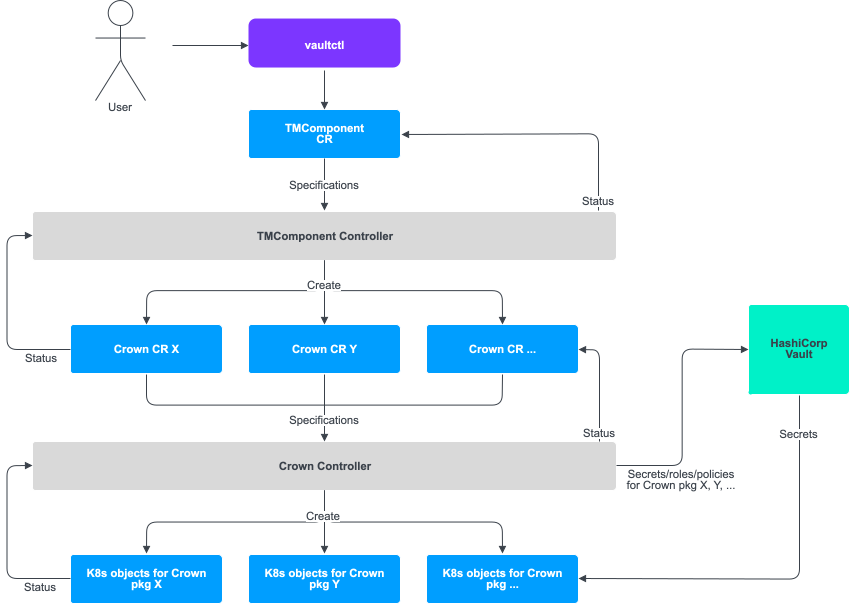

# Deployment tools and resources

Bank-hosted

All the tooling you need for installing Vault Core is available in the downloadable [Vault Core release package](/vault-core/5-9/EN/environment_and_installation/installationupgrade_and_version_compatibility). You use the resources in the package to configure and deploy Vault Core components.

This guide goes through:

-   How the installation resources (vaultctl, TMComponent Operator, and Crown Operator) work
    
-   The purpose of the artifacts included in the release package
    

For specific guidance on installing external components, refer to the relevant pages in [Configuring cloud infrastructure](/vault-core/5-9/EN/environment_and_installation/infrastructure_docs/vault_cloud_infrastructure).

lightbulb

Because Vault Core runs on a Kubernetes cluster, the installation tools follow the Kubernetes Operator pattern for installing its native resources. See Kubernetes documentation for further explanations about the [Operator pattern](https://kubernetes.io/docs/concepts/extend-kubernetes/operator/) and [Custom Resources](https://kubernetes.io/docs/concepts/extend-kubernetes/api-extension/custom-resources/).

## vaultctl

*vaultctl* is a command-line tool used for installing and upgrading Vault Core, as well as configuring Vault Core components and querying their statuses. You use vaultctl to install components or interact with an installed component on a Kubernetes cluster. It is currently shipped as a Linux binary.

You run vaultctl commands from the command line - see [Using vaultctl commands](/vault-core/5-9/EN/environment_and_installation/infrastructure_docs/tmcomponent_operator_user_guide/installing_or_upgrading_vault#using_vaultctl_commands). For example, running `vaultctl init-operators` deploys the [TMComponent Operator](/vault-core/5-9/EN/environment_and_installation/infrastructure_docs/tmcomponent_operator_user_guide/deployment_tools#tmcomponent_operator) and the [Crown Operator](/vault-core/5-9/EN/environment_and_installation/infrastructure_docs/tmcomponent_operator_user_guide/deployment_tools#crown_operator), as well as the custom resources they require.

You also run `vaultctl values generate` to create the `values.yaml` file that you use to specify configuration settings for various Vault Core components. See the [Installation guide](/vault-core/5-9/EN/environment_and_installation/infrastructure_docs/tmcomponent_operator_user_guide/installing_or_upgrading_vault) for more information on using the values file.

Use `--help` on vaultctl subcommands for full documentation.

info

*vaultctl* and the associated operators are versioned independently of Vault Core. The lowest vaultctl version you should use is the one shipped with the Vault Core release, but you can use any subsequent version of vaultctl. Major, minor and patch releases of Vault Core include an appropriate version of vaultctl with the latest bug and security fixes applied.

vaultctl is backwards-compatible, so the latest vaultctl can always install release files from previous Vault Core releases. However, vaultctl is not forwards-compatible, so you should not use an older version of vaultctl with a more recent release. Run `vaultctl version` to view the version you are using.

## TMComponent Operator

chat\_bubble

Both the TMComponent Operator and [Crown Operator](/vault-core/5-9/EN/environment_and_installation/infrastructure_docs/tmcomponent_operator_user_guide/deployment_tools#crown_operator) follow the [Kubernetes Operator pattern](https://kubernetes.io/docs/concepts/extend-kubernetes/operator/), meaning they include:

-   *A custom resource definition (CRD)* which defines the field structures and types, as well as acceptable values that instruct behaviour with the Kubernetes API. In the context of Vault Core, CRDs provide the desired blueprint for how Vault Core should be configured.
    
-   A *custom resource (CR)* which is an instance of an object defined by the CRD. In the context of Vault Core, CRs provide the specific configurations for Vault Core components based on the CRD.
    
-   A *controller* which subscribes to events relating to required cluster resources and reconciles the state of resources according to the (CR) instance in the cluster. In the context of Vault Core, it ensures that the cluster resources match the specified CR configurations.
    

The *TMComponent Operator* is a Kubernetes Operator that is shipped with Vault Core. You use it with other [release artifacts](/vault-core/5-9/EN/environment_and_installation/infrastructure_docs/tmcomponent_operator_user_guide/deployment_tools#operator_release_artifacts) to configure, install and manage Vault Core components. It is responsible for deploying and garbage-collecting [Crown CRs](/vault-core/5-9/EN/environment_and_installation/infrastructure_docs/tmcomponent_operator_user_guide/deployment_tools#crown_operator).

The TMComponent Operator runs a controller that manages instances of the CRD "tmcomponents.tmachine.io", which changes during Vault Core deployment, reconfiguration, and upgrade. In response, the TMComponent Operator deploys Crown CRs, which the Crown Operator then processes to ensure that the state of the resources in the Kubernetes cluster matches your required configurations.

When you set configurations in the [values file](/vault-core/5-9/EN/environment_and_installation/infrastructure_docs/tmcomponent_operator_user_guide/installing_or_upgrading_vault#generate_the_values_file), the TMComponent Operator processes this file to generate Kubernetes configuration maps for each Vault Core service. It performs fresh installations or upgrades of Vault Core based on the configurations provided.

Use vaultctl to deploy and interact with the TMComponent Operator.

## Crown Operator

The *Crown Operator* is a lower-level Kubernetes Operator that works alongside the TMComponent Operator to manage the deployment of Vault Core microservices.

"Crown" is a packaging utility created and used by Thought Machine to bundle and deploy the built-in Kubernetes resources (such as [ConfigMap](https://kubernetes.io/docs/concepts/configuration/configmap/), [Deployment](https://kubernetes.io/docs/concepts/workloads/controllers/deployment/), [HorizontalPodAutoscaler](https://kubernetes.io/docs/tasks/run-application/horizontal-pod-autoscale/)) required for Vault Core’s microservices.

The Crown Operator runs a controller that manages instances of the CRD "crowns.tmachine.io". The Crown CRs (which are Crown packages) deployed by the TMComponent Operator define the groups of native Kubernetes resources that should be installed, and how. To install Vault Core microservices, the Crown Operator processes the CRs to reconcile the state of Kubernetes resources with those defined by the CRs.

When installing Vault Core, you do not need to directly interact with any aspect of the Crown Operator - it works behind the scenes. Running vaultctl commands triggers the TMComponent Operator, which in turn triggers the Crown Operator.

## Deployment structure

This diagram shows the relationship between a user, vaultctl, TMComponent Operator, Crown Operator, HashiCorp Vault (as an example secrets manager), and native Kubernetes (K8s) resources:

A TMComponent CR results in the creation/update of Crown CRs, which in turn results in the creation/update of Kubernetes built-in resources.

## Operator release artifacts

The TMComponent Operator uses release artifacts to install and configure Vault Core resources. These artifacts are provided with each Vault Core release, and contain the necessary configuration and deployment files required for setting up your Vault Core environment.

Visit [Installation/upgrade and version compatibility](/vault-core/5-9/EN/environment_and_installation/installationupgrade_and_version_compatibility) to download the release file for the Vault Core version you want.

The following artifacts are included in the release file:

  
| Artifact name | Description | Type |
| --- | --- | --- |
| 
vaultctl

 | 

TMComponent Operator command line tool. Used for installation, configuration or export of TMComponent Operator artifacts. For more information, see the [vaultctl section](/vault-core/5-9/EN/environment_and_installation/infrastructure_docs/tmcomponent_operator_user_guide/deployment_tools#vaultctl) above.

 | 

Binary (Unix Executable)

 |
| 

components\_guide.yaml

 | 

Outlines the components that can be installed using a given release file. Refer to this to decide which components are relevant to your setup. Equivalent to running `vaultctl components` on the release file.

 | 

YAML

 |
| 

kafka\_topics\_info.json

 | 

Aids with manually creating all Kafka topics required by Vault Core services, in case you do not intend to use the vault-topic-manager deployment or it is incompatible with the managed Kafka service you are using.

The file contains all required details and configuration settings information for creating the topics. For more details, along with the schema, see [Kafka topics artifact](/vault-core/5-9/EN/environment_and_installation/infrastructure_docs/tmcomponent_operator_user_guide/deployment_tools#kafka_topics_artifact).

 | 

JSON

 |
| 

release.json

 | 

Release metadata file. Metadata such as images, vulnerabilities, service accounts, and third-party libraries is scoped by component. See [Release JSON artifact](/vault-core/5-9/EN/environment_and_installation/infrastructure_docs/tmcomponent_operator_user_guide/deployment_tools#release_json_artifact).

 | 

JSON

 |
| 

vault-installer-hashicorp-vault-policy.hcl

 | 

HashiCorp Vault policy. If HashiCorp Vault is your chosen secrets manager, this file is required to be associated with the TMComponent Operator HashiCorp Vault role. See [Configuring HashiCorp Vault secrets manager](/vault-core/5-9/EN/environment_and_installation/infrastructure_docs/vault_cloud_infrastructure/configuring_hashicorp_vault_secrets_manager).

 | 

HashiCorp Configuration Language

 |
| 

vault-n.n.n.release

 | 

Release file containing information that vaultctl needs in order to install components for a particular release, where "n.n.n." denotes the specific Vault Core version.

Use it as input to vaultctl - for example, run `vaultctl components -r vault-n.n.n.release` for a list of components that can be installed.

 | 

Release

 |

### Release JSON artifact

The `release.json` artifact contains all component-scoped metadata about the Vault Core release, such as images, secrets, service accounts, and third-party libraries.

It lists all available components and fields - refer to the `components_guide.yaml` artifact to decide which components are relevant to your deployment. You can then use the `release.json` to parse only the relevant data before installing Vault Core.

Use the `release.json` for:

-   Manually generating certificates or credentials for authenticating to a Kafka cluster - use [kafka\_principals](/vault-core/5-9/EN/environment_and_installation/infrastructure_docs/tmcomponent_operator_user_guide/deployment_tools#kafka_principals_json_schema) for this
    
-   [Copying images](/vault-core/5-9/EN/environment_and_installation/infrastructure_docs/tmcomponent_operator_user_guide/deployment_tools#copying_images_using_release_json) from the Thought Machine registry to your own registry before installation
    

Thought Machine recommends using the `release.json` artifact as part of your own automated Vault Core installation/upgrade pipeline, where it is parsed and the information fed into your usual tools for generating certificates, credentials, and ACLs for Kafka. Make sure to run this prior to Vault Core installation; otherwise services will fail to start up, and they will not be able to connect to Kafka and access the resources they require.

#### Kafka\_principals JSON schema

The `release.json` artifact contains a list of Kafka-authenticated Vault Core services, which you can find under `.metadata.kafka_principals`.

You use `kafka_principals` for help with manually configuring Kafka authentication and authorisation for Vault Core services. It enables you to manually generate:

-   Client certificates for mTLS, credentials for SASL-SCRAM, or client credentials for SASL-OAUTHBEARER for authenticating to a Kafka cluster
    
-   Coarse-grained Kafka access control lists (ACLs) for authorising principals to access Kafka resources
    

Your manual configuration must match the artifact for that specific Vault Core version. Therefore, you are responsible for keeping track of changes in the artifact between Vault Core versions, especially for scenarios where:

-   A principal entry was removed, because you may wish to delete related ACLs or explicitly deny access for services that no longer exist
    
-   A principal has changes in the resources or permissions it requires
    
-   A principal has changes to the permission type (`ALLOW`/`DENY`) given to it
    
-   A principal has changed the secret keys that it expects (for example, from PKCS12 to PEM)
    

See [Creating Kafka ACLs](/vault-core/5-9/EN/environment_and_installation/infrastructure_docs/vault_cloud_infrastructure/configuring_kafka_and_vault#creating_kafka_acls) for information on how to use the release JSON artifact to manually create ACLs, as well as an [example release.json containing Kafka principals](/vault-core/5-9/EN/environment_and_installation/infrastructure_docs/vault_cloud_infrastructure/configuring_kafka_and_vault#example_release_json_containing_kafka_principals).

warning

Do not diverge from the principal names, Common Names, usernames and Client IDs specified in the artifact, because Thought Machine relies on these to properly provide support.

**Expand to see the JSON schema for *metadata.kafka\_principals.{principal}***

-   `principal`: The name of the principal for use with Kafka ACLs
    
-   `resources`: The Kafka resources that this principal requires access to
    
    -   `topics`: A list of Topic resources, specified either as prefixes or names, and the permissions required, which correspond to Operations [in the Confluent docs](https://docs.confluent.io/platform/current/kafka/authorization.html#operations)
        
        -   `prefixes`: A list of topic prefixes. Note that the dot is part of the prefix (for example, `vault.`)
            
        -   `permissions`: A list of permissions required on the above topic prefixes
            
        -   `permission_type`: Either `ALLOW` or `DENY` the above permissions
            
        -   `names`: A list of individual topic names
            
        -   `permissions`: A list of permissions required on the above topic names
            
        -   `permission_type`: Either `ALLOW` or `DENY` the above permissions
            
        
    -   `groups`: A list of Group (consumer group) resources, specified either as prefixes or names, and the permissions required, which correspond to Operations [in the Confluent docs](https://docs.confluent.io/platform/current/kafka/authorization.html#operations)
        
        -   `prefixes`: A list of group prefixes. Note that the dot is part of the prefix
            
        -   `permissions`: A list of permissions required on the above group prefixes
            
        -   `permission_type`: Either `ALLOW` or `DENY` the above permissions
            
        -   `names`: A list of individual group names
            
        -   `permissions`: A list of permissions required on the above group names
            
        -   `permission_type`: Either `ALLOW` or `DENY` the above permissions
            
        
    
-   `authentication_methods`: A list of supported authentication methods. Only parse the method that you require
    
    -   `mtls`: Mutual TLS
        
        -   `common_name`: The expected Common Name on the client certificate for this principal
            
        -   `kv_secret_path`: The path at which the CA chain and client certificate files should be stored in the HashiCorp Vault KV secrets engine
            
        -   `kv_secret_keys`: A list of keys expected within the secret at the above path. These keys correspond to filenames, where the file extension dictates what format the value should be. These will be either:
            
            -   `.pem`: CA chain, client certificate chain and client key in PEM format
                
            -   `.p12_b64`: Base64 encoded PKCS12 format truststore and keystore
                
            
        
    -   `sasl_scram`: SASL-SCRAM, applies to both SHA-256 and SHA-512
        
        -   `username`: The expected SASL-SCRAM username for this principal
            
        -   `kv_secret_path`: The path at which the username and password should be stored in the HashiCorp Vault KV secrets engine
            
        -   `kv_secret_keys`: A list of keys expected within the secret at the above path. These keys correspond to the SASL-SCRAM username and password, which must be saved as the respective values in plaintext
            
        
    -   `sasl_oauth`: SASL-OAUTHBEARER
        
        -   `client_id`: The expected SASL-OAUTHBEARER client ID for this principal
            
        -   `kv_secret_path`: The path at which the client ID and secret should be stored in the HashiCorp Vault KV secrets engine
            
        -   `kv_secret_keys`: A list of keys expected within the secret at the above path. These keys correspond to the SASL-OAUTHBEARER client ID and secret, which must be saved as the respective values in plaintext
            
        
    

#### Copying images using release.json

Below is an example `release.json` that includes the most relevant image metadata fields, such as:

-   `source` (or `source-tag` if not using image digests): The origin of the image - the registry it is being pulled from
    
-   `dest`: The destination of the image - the registry it is being copied to
    
-   `vulnerabilities`: Provides a snapshot of the vulnerabilities at a specific point in time
    

As shown in the example, under `metadata` is a collection of fields, and each field has a collection of items. Each item has a `components` list to allow you to filter the content by component.

For more information on copying images, see the [Installation guide](/vault-core/5-9/EN/environment_and_installation/infrastructure_docs/tmcomponent_operator_user_guide/installing_or_upgrading_vault).

Below is an example script for using the `release.json` to copy images - you can parse a variety of other metadata in a similar way:

### Kafka topics artifact

You can use `kafka_topics_info.json` to help with manually creating all Kafka topics required by the Vault Core microservices, in case you do not intend to use the `vault-topic-manager` deployment or it is incompatible with the managed Kafka service you are using.

Thought Machine recommends using the Kafka topics artifact as input to an automated Vault Core installation/upgrade pipeline, where it is parsed and the information fed into a tool that manages the creation, update, and deletion of topics. You must run this pipeline before the actual installation/upgrade itself, because Vault Core requires the topics to be created in place in the Kafka cluster with the correct configuration. Otherwise, services will fail to consume from and produce to Kafka.

See [Manually create Kafka topics](/vault-core/5-9/EN/environment_and_installation/infrastructure_docs/vault_cloud_infrastructure/configuring_kafka_and_vault#manually_create_kafka_topics) for more guidance on using this release artifact to manually create and manage Kafka topics.

**Expand to see the JSON schema for *kafka\_topics\_info.json***

-   `name` : The name of the Kafka topic to be created in the Kafka cluster
    
-   `configuration` : The parameters, which can be safely changed
    
    -   `retentionPeriod` : The retention period in milliseconds for the topic
        
    
-   `details` : The parameters, which would require additional logic for handling changes
    
    -   `numPartitions` : The number of topic partitions, possible to change between Vault Core releases
        
    
-   `dlqtopic` : Flags if a topic is used as a DLQ
    
-   `publicAPITopic` : Flags if a topic is part of the Stream APIs
    
-   `repartitioningStrategy` : The repartitioning strategy if the value of the number of partitions in the cluster is different from the value in the artefact
    
-   `safeToDelete` : Flags if a topic is safe to delete
    

Below is an example of one entry in the JSON artifact, corresponding to the `vault.workflows.tasks.task.events` topic: