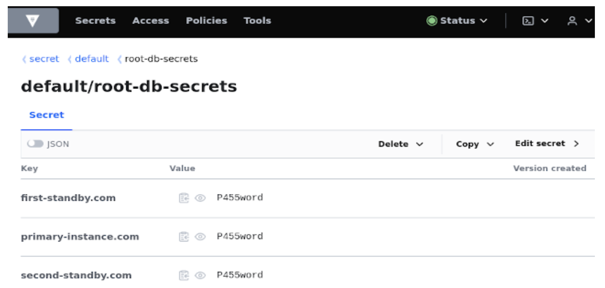

# Using a relational database

Bank-hosted

Check database compatibility with Vault Core in the [Certified Environment matrix](/vault-core/5-9/EN/environment_and_installation/installationupgrade_and_version_compatibility#certified_environment_matrix_for_vault). The database must:

-   Be deployed to multiple Availability Zones or data centres for high availability
    
-   Have support for logical replication switched on (disabled by default)
    
-   Be set up to serve over TLS (disabled by default)
    

Start with the following guidance for setting up relational databases:

-   [Using a relational database](/vault-core/5-9/EN/environment_and_installation/infrastructure_docs/vault_cloud_infrastructure/using_a_relational_database#relational_database_configuration_changes) - for required changes to the default relational database configuration
    
-   [Configuring Vault with PostgreSQL/Cloud SQL](/vault-core/5-9/EN/environment_and_installation/infrastructure_docs/vault_cloud_infrastructure/using_a_relational_database#configuring_vault_with_postgresqlcloudsql) - how to configure settings differently for different types of managed databases
    

You can use read replicas to improve performance under specific workloads when your Account volumes exceed 10 million - for example, when reconciling events during high load. See [Configuring read replicas for performance](/vault-core/5-9/EN/environment_and_installation/infrastructure_docs/vault_cloud_infrastructure/using_a_relational_database#configuring_read_replicas_for_performance).

It is possible to have separate physical databases rather than a single database for better performance, transparency and security (for the database, Audit Logs, and others). However, this creates additional operational complexity; with more than one physical database, snapshot-based disaster recovery becomes more challenging.

You can find more information about this deployment mode in the following guides:

-   [Setting up and migrating to multiple physical databases](/vault-core/5-9/EN/environment_and_installation/infrastructure_docs/vault_cloud_infrastructure/configuring_multiple_databases)
    
-   [Considerations during disaster recovery with multiple physical databases](/vault-core/5-9/EN/environment_and_installation/infrastructure_docs/advanced_deployment_modes/multiple_physical_databases)
    

## Relational database configuration changes

In order to use a relational database with Vault Core you must change the default configuration. Change the following configuration settings:

-   `pg_hba.conf`
    
-   `postgresql.conf`
    
-   Extensions
    

Configuration: `pg_hba.conf`

Changes:

-   add HBA for pods and nodes
    
-   allow replication
    

Example:

Configuration: `postgresql.conf`

Changes:

-   enable TLS
    
-   increase the maximum number of connections
    
-   enable logical replication
    
-   set the default client timezone to UTC
    

Determining the maximum number of connections to a PostgreSQL database, whether self-hosted or managed, is not as straightforward as it might seem and typically depends on a number of factors.

These factors include:

-   the number of CPU cores
    
-   available memory
    
-   specific workload characteristics
    

Thought Machine recommends that you follow this guide to help you to determine an estimated number of maximum connections to use for the `max_connections` value.

error

This number is an estimation only, and is based on the performance characteristics of AWS Aurora and GCP Alloy databases. You must consider corrections to this number depending on the factors affecting your installation, as outlined above.

Select the maximum number of connections depending on the number of accounts:

   
| Up to 100k | Up to 1M | Up to 10M | Over 10M |
| --- | --- | --- | --- |
| 
1000

 | 

2000

 | 

4000

 | 

4000

 |
| 

Minimum memory: 32Gb

 | 

Minimum memory: 384Gb

 | 

Minimum memory: 512Gb

 | 

Minimum memory: 384Gb \* 2 = 768Gb

 |

These calculations are based on the following formula. This formula uses the memory available to a given database and the memory consumed by a single connection as the basis for the calculations.

 
| Variable | Definition |
| --- | --- |
| 
DB\_MEM

 | 

Database instance memory in Gb

 |
| 

CONN\_MEM

 | 

Memory consumed by a single connection on average

 |
| 

MAX\_CONN\_NEEDED

 | 

Default number of required connections

 |

Example:

Configuration: Extensions

Changes:

The common extensions `uuid-ossp,pg_trgm` and `pg_stat_statements` should be installed (usually as part of the PostgreSQL distribution).

chat\_bubble

Clients that wish to run a large number of accounts (for example, 5 million accounts) must use the database with performant resource (for example, model `db.m6g.16xlarge` in RDS or equivalent), with the following additional PostgreSQL configurations:

-   `max_locks_per_transaction` to `2048`
    
-   `max_pred_locks_per_transaction` to `2048`
    
-   `max_pred_locks_per_page` to `64`
    

This configuration ensures that the environment will not hit "out of shared memory" errors that are caused by a limitation in the number of locks it can give on exclusive grants on the tables. For information about resources, see the [Performance Report](/vault-core/5-9/EN/vault_release_information#performance_report).

## Configuring Vault with PostgreSQL/CloudSQL

You can configure Vault Core for use with either PostgreSQL or CloudSQL.

### Google Cloud Platform configuration options

Whether you host a PostgreSQL on a virtual machine (VM) or configure Vault Core with CloudSQL, you can create one of the following:

-   An entry in the DNS zone of the VPC that resolves to the private IP of the instance.
    
-   A ClusterIP service in one of the namespaces of your Kubernetes cluster and manually create an endpoint object which points to the private IP of the DB instance.
    

### Hosting a PostgreSQL on a VM (Virtual Machine)

To load server certificates on your instance, you should produce and store them in a GCS bucket. Next, run the following example commands to load them to the VM that hosts your PostgreSQL:

### Configuring Vault Core with CloudSQL

Vault Core supports only username/password authentication with CloudSQL.

Choose one of the following options:

-   Allow non-SSL/non-TLS connections and allow SSL/TLS connections - the client certificate is not verified for SSL/TLS connections (this is the default setting)\*
    
-   Only allow connections encrypted with SSL/TLS - the client certificate is not verified for SSL connections
    
-   Only allow connections encrypted with SSL/TLS and with valid client certificates
    

error

**If you check \*Allow only SSL connections**, this forces client TLS authentication for connections to the database. You can use this option but you must NOT enable **Require trusted client certificates**.

chat\_bubble

Previously, the information in this section stated that you must "Disable the **Allow only SSL connections** option which forces client TLS authentication for connections to the database". This has since changed due to a change made by Google. The requirement to configure `values.yaml` remains the same.

Set all of the following values in your `values.yaml`:

-   `vault.db.replication: 'false'`
    
-   `audit.db.is_rds: 'false'`
    
-   `vault.db.is_rds: 'false'`
    
-   `common.db.ssl_mode: 'require'`
    

Inject the CA certificate of the CloudSQL instance to the Vault Core instance. You can do this using the `ca-injector` webhook as described in the [TMComponent Operator Guide](/vault-core/5-9/EN/environment_and_installation/infrastructure_docs/tmcomponent_operator_user_guide). If you plan on also using the `ca-injector` for a custom Kafka CA certificate, append the CloudSQL CA certificate to the Kafka CA certificate.

### Amazon Web Services RDS parameter group example values

These are example values for RDS parameter groups:

## Installing Vault with a Database Admin User

Vault Core ships with a Kubernetes Job that runs as part of an installation or upgrade, which handles bootstrapping the database by creating the logical databases and users that Vault Core needs to function. It will also install certain extensions and grant the required permissions for reading and writing data to application database users.

In order to achieve this, the Kubernetes Job requires access to the database - the role/privileges it requires depends on the Vault Core version and PostgreSQL version.

To install Vault Core 4.7 or later using Database Admin role level privileges, the database version MUST be greater than or equal to PostgreSQL version 13.0.

Here, we describe the additional steps that you can choose to follow if you want to set up an admin user for the purposes of installing or upgrading Vault Core.

chat\_bubble

The examples in this section include `<placeholders>` and example values. You must replace these (including the symbols that indicate them) with the correct values for your setup.

### Step 1. Check the PostgreSQL version

Check that your database version meets the requirements for installing Vault Core with a DB Admin user.

If it does, you can proceed to follow this guide. If it does not and you will not update it, you will need to install Vault Core with a superuser or root user.

*Database user privilege requirements for installing Vault Core*

  
| PostgreSQL version | Vault Core 4.6.x or earlier | Vault Core 4.7 or later |
| --- | --- | --- |
| 
PostgreSQL Version 13.0 or later

 | 

Superuser or root user

 | 

Database Admin (Superuser or root user access is not a strict requirement with this combination)

 |
| 

PostgreSQL Version 12.x or earlier

 | 

Superuser or root user

 | 

Superuser or root user

 |

### Step 2. Creating the admin user

The admin user privileges must allow the user to create logical databases and create users. In PostgreSQL, it requires the privileges `CREATEDB` and `CREATEROLE`. Use the commands `CREATE` to create the user and `ALTER` to assign the roles.

You MUST make sure that the password for the admin user is both:

-   the same as the password located in the secret store as `"root-db-secrets"`
    
-   different to the root user password
    

You must also update the `values.yaml` file to reflect this and set the `db.admin_user` values to match the username of the admin user for all database sections, such as `vault.db.admin_user` and `scheduler.db.admin_user`.

Examples:

In this example, to create an admin user that authenticates *using a password* (called `tm_admin` here) we will log in to the database as the superuser and execute the following command:

Or, for an admin user that authenticates *without a password* (such as [AWS IAM DB authentication](/vault-core/5-9/EN/environment_and_installation/infrastructure_docs/vault_cloud_infrastructure/using_a_relational_database#configuring_rbac_based_authentication_to_aws_rdsaurora)):

### Step 3. Creating the pg\_stat\_statements extension

From PostgreSQL 13, non-superusers can create extensions if they are marked as 'trusted'. This is true for all but one of the extensions that Vault Core needs, the odd one out being `pg_stat_statements` - meaning it must be created with a superuser. This extension is used by the `postgres-exporter` pods to fetch server-side metrics, including metrics about query latencies, cache hit ratios, the type and number of locks that have been acquired (this list is not exhaustive).

If the database initialisation job determines that it is not using a superuser role, it will not attempt to create this extension on every logical database. This means that it requires a small amount of manual overhead from you to ensure that all of the extensions that Vault Core requires are created.

There are two main ways that you can ensure that all of the required extensions are created if the database initialisation job uses a non-superuser role:

-   Option 1: Add the `pg_stat_statements` extension to the template1 database (recommended)
    
-   Option 2: Create the `pg_stat_statements` extension on every new database after installing or upgrading Vault Core
    

#### Option 1: Adding the pg\_stat\_statements extension to the template1 database

When PostgreSQL is issued with a \`create database' command it makes a copy of the 'template1' logical database, which is an internal database, and renames it to the new database’s name.

You can add the `pg_stat_statements` extension to the `template1` database so that it is created on a new Vault Core logical database by default when the Vault installer creates it. For more information, see: [PostgreSQL Template Databases documentation](https://www.postgresql.org/docs/current/manage-ag-templatedbs.html)

To add the extension to the template1 database, log into the database as a superuser and run the following command:

This means that only one manual step is required and all subsequent Vault Core version upgrades do not need any access to or any manual actions from the superuser. This is the recommended approach; if it is not suitable, see option 2 to create the extension on every new logical database.

#### Option 2: Creating the extension on every new logical database

If the template1 option is not suitable, the remaining solution is to create the extension on all of the logical databases that the admin user creates.

You can do this manually or automate it by using a script - both approaches will require the superuser.

chat\_bubble

You must repeat these steps (described in steps 1 and 2 or a script combining them) to run these commands every time that you subsequently upgrade or reinstall Vault Core. Do this after all subsequent Vault Core version upgrades to add the extension to new logical databases. The postgres-exporter pods will be in a crashlooping state for new databases until you run this command for their database.

##### Manual steps to create the extension

1.  Log into the database as the superuser and run the following command. This will fetch all of the databases that were created by the "tm\_admin" user.
    
2.  Next, switch into each of those databases and run the following command:
    

##### Automating the steps to create the extension with a script

As an alternative to running the commands separately as per steps 1 and 2, you could combine the commands into a small bash script. The following snippet is an example script only and combines the `SELECT` and `CREATE` commands.

### Step 4. Granting ADMIN OPTION with PostgreSQL 16

This information only applies if you want to use PostgreSQL 16+ with Vault Core 5.3+, and either:

-   You previously installed Vault Core with a root or superuser, and then switched to a Database Admin user for a subsequent installation or upgrade of Vault Core.
    
-   You are currently switching from a password-based authentication setup to a RBAC based one (for example using AWS IAM roles).
    

If this scenario applies to you, refer to the following information and guidance to grant the required additional permissions.

However, if this scenario does not apply to you, then you do NOT need to follow this guidance. For example, if you are installing Vault Core for the first time.

chat\_bubble

If you are unsure if this applies to you, but have previously installed Vault Core using a Database Admin and are experiencing an error when trying to install or upgrade Vault Core, refer to the example logs in this guidance to help identify if this is the cause of the issue.

#### Changes in PostgreSQL 16 that can affect Database Admin users and using Vault Core

In order to use PostgreSQL 16+ with a Database Admin user and Vault Core 5.3+ when you have previously installed Vault Core under this scenario, you might need to grant additional permissions to the Database Admin user. This is due to a change that impacts the privileges of CREATEROLE that was introduced in PostgreSQL 16. If the Database Admin user does not have the required permissions, then the Vault Core installation fails with errors, such as those in the following examples.

##### Example error in the log of the core-db-init container

You can identify the error in the core-db-init-migrator pod. The core-db-init container contains log lines like those in the following example.

The [PostgreSQL 16 release notes](https://www.postgresql.org/docs/release/16.0/) confirm the change that impacts the privileges of `CREATEROLE` in the following quoted paragraph:

> Previously roles with CREATEROLE privileges could change many aspects of any non-superuser role. Such changes, including adding members, now require the role requesting the change to have ADMIN OPTION permission. For example, they can now change the CREATEDB, REPLICATION, and BYPASSRLS properties only if they also have those permissions.

This means that the Database Admin user lacks sufficient privileges for any existing Vault Core database user that it did not directly create.

#### Granting the correct permissions to the Database Admin user

You need to complete the one-off manual step of granting the Database Admin user with the additional permissions that it requires to manage the database users needed for Vault Core.

As the PostgreSQL release notes indicate, you need to grant the `ADMIN OPTION` to all existing Vault Core database users.

1.  Identify all existing Vault Core database users either using your `values.yaml` (for example: `Values.audit.db.user` and `Values.audit.db.migrator_user`) or by querying the `pg_user` table.
    

Example query for the `pg_user` table:

2.  Once you have identified your Vault Core Database Admin users, use the command in the following example to grant them with the correct privileges that they require to manage the database users.
    

Example command to grant the ADMIN OPTION to a Database Admin user. In this example, the following command grants the Database Admin user `tm_admin` with the correct privileges that they require to manage the `core` and `core_migrator` database users.

warning

If you are switching from a password based authentication setup to an RBAC based one (for example using AWS IAM roles), then you will need to create a new set of users to avoid downtime during upgrade. For more information see [Configuring RBAC based authentication to AWS RDS/Aurora](/vault-core/5-9/EN/environment_and_installation/infrastructure_docs/vault_cloud_infrastructure/using_a_relational_database#important_considerations).

In such a scenario, run the query in step 2 for each new and existing DB user to prevent `psycopg2.errors.InsufficientPrivilege: permission denied` errors.

In this scenario, you must additionally run the following command for every new database migrator user to ensure it can become the owner of the `public.migrations` table in its database.

In the example below, `<NEW_CORE_MIGRATOR_USERNAME>` is the new database migrator user replacing `core_migrator`, and the public schema is in the `core` database:

3.  Complete this for each Vault Core database user.
    

Installing Vault Core against a PostgreSQL 16 database using a Database Admin User should now be possible.

## Upgrading the major version of the PostgreSQL database

You should follow the recommendations and guidance of your cloud provider when performing a major version upgrade of your PostgreSQL database.

error

Once your database has upgraded successfully, we strongly advise that you run the `ANALYZE` PostgreSQL command on each of the Vault Core databases to update the `pg_statistic` system catalogue. PostgreSQL uses these statistics for query planning, and failing to update them may result in serious performance degradation.

## Configuring SCRAM-SHA-256 password hash

Prior to PostgreSQL 10, only md5 password hashing was available. But since the md5 hashing method was known for being "cryptographically broken and unsuitable for further use", starting with PostgreSQL 10, the SCRAM-SHA-256 hashing method was introduced.

Vault Core is fully compatible with the SCRAM-SHA-256 password hashing method; it requires the configuration described in [Configure PostgreSQL with SCRAM-SHA-256 password hash](/vault-core/5-9/EN/environment_and_installation/infrastructure_docs/vault_cloud_infrastructure/configure_postgresql_with_scramsha256_password_hash).

## Configuring RBAC based authentication to AWS RDS/Aurora

You can optionally configure Vault Core to authenticate against a database using Role-based Access Control (RBAC) with AWS IAM (Identity Access Management) credentials instead of traditional usernames and passwords. This option is available from Vault Core 5.3.

You could find that this is a useful solution if any of the following are requirements:

-   to use RBAC as the primary method of authentication
    
-   to eliminate the use of database static credentials stored in the secrets manager
    

### Overview

There are two authentication methods that you can use for database connections:

-   Password-based authentication
    
-   RBAC authorisation (with AWS IAM)
    

In order to use RBAC as the primary method of authentication against a database, you require a specific IAM database user with the relevant permissions. The RBAC resources allow you to configure the IAM database user. See [prerequisites](/vault-core/5-9/EN/environment_and_installation/infrastructure_docs/vault_cloud_infrastructure/using_a_relational_database#prerequisites) and [Creating RBAC resources](/vault-core/5-9/EN/environment_and_installation/infrastructure_docs/vault_cloud_infrastructure/using_a_relational_database#creating_rbac_resources) for details.

An RBAC authentication configuration impacts applications in the following ways:

-   applications that connect directly to the database request and then use IAM-based credentials
    
-   applications that connect to the database via the DBPool authenticate with the DBPool using Kubernetes Service Account Tokens instead of static credentials. The service account tokens are short-lived and rotated automatically.
    

### Prerequisites

Users of this guide need to have operational awareness of using RBAC resources such as IAM policies and IAM roles for configuring AWS RDS/Aurora access.

Before you proceed to setup the infrastructure, you must read this section and the mandatory steps in **Prerequisite configurations**, and understand all considerations in **Important considerations**.

#### Important considerations

Before proceeding with configuring RBAC authentication, ensure you have considered the following:

-   Vault Core does not support [EKS Pod Identity](https://aws.amazon.com/blogs/containers/amazon-eks-pod-identity-a-new-way-for-applications-on-eks-to-obtain-iam-credentials/) as an access control mechanism. It uses [IAM roles for Service Accounts (IRSA)](https://aws.amazon.com/blogs/opensource/introducing-fine-grained-iam-roles-service-accounts/) instead.
    
-   On PostgreSQL, dual authentication is not supported; users must authenticate using either a password or IAM. To prevent downtime when switching from password-based to IAM-based (RBAC) authentication, the Vault installer automatically creates a parallel set of database users.
    
    By default, the installer creates new users with the same permissions as your original users (as defined in `values.yaml`) but appends an `_iam` suffix to their names. This ensures the transition is seamless and there is no downtime during upgrade.
    
    To disable the `_iam` suffix, you can manually define new usernames by updating your `values.yaml` file:
    
    -   To define new usernames: provide a new unique name for each database user
        
    -   To disable auto-suffix: set the following `values.yaml` field to `false`, like this: `common.db.aws_iam.append_username_suffix: 'false'`
        
    

For more details on these authentication limitations on AWS, refer to [AWS IAM Authentication Limitations](https://docs.aws.amazon.com/AmazonRDS/latest/UserGuide/UsingWithRDS.IAMDBAuth.html#UsingWithRDS.IAMDBAuth.Limitations).

#### Prerequisite configurations

You must enable certain settings, create certain users and grant the appropriate privileges for each AWS RDS/Aurora database, as follows:

1.  IAM Database Authentication - you must enable it for the target database by setting the `EnableIAMDatabaseAuthentication` flag to `true` when invoking the API calls `CreateDBInstance` or `ModifyDBInstance`. For more information on how to enable IAM Database Authentication, see the AWS documentation for [Enabling and disabling IAM database authentication](https://docs.aws.amazon.com/AmazonRDS/latest/UserGuide/UsingWithRDS.IAMDBAuth.Enabling.html).
    
2.  Grant appropriate database privileges to the `admin` user, creating the Database Admin user if necessary. Follow the existing documentation for [Installing Vault with a Database Admin User](/vault-core/5-9/EN/environment_and_installation/infrastructure_docs/vault_cloud_infrastructure/using_a_relational_database#step_2_creating_the_admin_user).
    
3.  Grant IAM permissions to the database `admin` user, created in the previous step, such that it can connect to the database using RBAC:
    

4.  Use the `values.yaml` file to enable RBAC authentication to AWS Aurora/RDS. Refer to the `common.db.auth_mechanism` section of the `values.yaml` file schema for more details.
    

Once you have completed the prerequisites, you must create the RBAC resources before installing or upgrading Vault Core. For information on how to create RBAC resources, see [RBAC resources creation](/vault-core/5-9/EN/environment_and_installation/infrastructure_docs/vault_cloud_infrastructure/using_a_relational_database#rbac_resources_creation).

### Creating RBAC resources

Once you have completed the [prerequisite steps for the RBAC configuration](/vault-core/5-9/EN/environment_and_installation/infrastructure_docs/vault_cloud_infrastructure/using_a_relational_database#prerequisites), the next step is to provision the required RBAC resources.

All of the resources that you need to provision are included in the `release.json` file. There are a large number of RBAC resources that you need to create, so Thought Machine recommends that you automate the process in order to minimise the risk of human error. The location of the RBAC resources is in `metadata.database_iam_principals`.

#### Populate the placeholders in the resources

You will notice that the RBAC resource in the `release.json` file contains placeholders. You need to ensure that you populate these resources before you can create resources. These placeholders are inside curly brackets. For example: `{ACCOUNT_ID}`.

The common placeholders are:

-   `{NAMESPACE}`: The name of the Kubernetes namespace where you have installed Vault Core.
    
-   `{REGION}`: The AWS region where you installed Vault Core.
    
-   `{ACCOUNT_ID}`: AWS Account ID.
    
-   `{OIDC_PROVIDER}`: IAM OIDC Identity provider. For more information, see the [OpenID Connect (OIDC) identity provider in IAM](https://docs.aws.amazon.com/IAM/latest/UserGuide/id_roles_providers_create_oidc.html) information in the AWS documentation.
    
-   `{DB_ID}`: AWS Aurora/RDS database resource ID. This is NOT an [AWS Database Identifier](https://docs.aws.amazon.com/AmazonRDS/latest/UserGuide/Overview.DBInstance.html).
    
-   `{AWS_ROLE_PREFIX}`: Prefix used during creation of AWS IAM roles to set role name. Set this to the same value as `common.csp_integrations.aws.iam_role_prefix`.
    
-   `{IAM_SUFFIX}`: The suffix appended to the DB user names during installation. This value can either be an empty string or `_iam`, depending on the value set in `common.db.aws_iam.append_username_suffix` of the `values.yaml` file.
    

There are also placeholders for database user names. You must replace these placeholders with the user names from the `values.yaml` file. For example, populate `{VALUES__VAULT__DB__USER}` with the value from the `values.yaml` file located in `vault.db.user`. You must populate the placeholders that contain `ADMIN`, for example `{VALUES__VAULT__DB__ADMIN_USER}`, with the `admin` username that you created as part of the [prerequisite RBAC configuration](/vault-core/5-9/EN/environment_and_installation/infrastructure_docs/vault_cloud_infrastructure/using_a_relational_database#prerequisites).

#### Structure of the resources

Every entry in `metadata.database_iam_principals` contains information about the role name, assume role policy document, and policy. Every one of these resources must be created for the authentication mechanism to work correctly. This is how every entry is structured:

-   `principal`: AWS IAM role name which contains a placeholder that you need to populate with the correct value
    
-   `assume_role_policy_document`: Assume role policy which you need to set against a role when creating resources
    
-   `policy`: AWS IAM policy which you need to attach to the role
    

You must create a role and a policy for every entry in `metadata.database_iam_principals` and attach the policy to the created role. Follow the next sections for creating a role and creating a policy to understand how to create the resources.

Here’s an example:

#### Creating a role

You need to create a role before you can attach a policy to it. The role name is under `principal` key. An AWS role name cannot not exceed the maximum [limit set by AWS](https://docs.aws.amazon.com/IAM/latest/APIReference/API_Role.html), which is equal to 64. Due to this limitation, the role name is constructed from an AWS role name prefix (32 chars max) and the rest of the name which is also limited to 32 chars.

warning

In cases where multiple Vault Core installations are done against the same AWS account, the AWS role name prefix MUST be set and MUST be unique to an installation. Otherwise this will lead to AWS role names clashes and installation failure.

You must create a role with:

-   an assume role policy, which is under `assume_role_policy_document` key. The assume role policy contains placeholders which you need to populate before creating the role
    
-   an IAM path that you specify via the `values.yaml` file under `common.db.aws_iam.tm_iam_prefix`
    

For guidance on how you could create a role with an assume role policy, see [create-role](https://awscli.amazonaws.com/v2/documentation/api/latest/reference/iam/create-role.html).

#### Creating a policy

You must attach a policy to every role that you create. The policy specification is found under `policy`. The policy contains placeholders that you need to populate before creating the policy.

Thought Machine recommends that you create an identity-based managed policy. For See the AWS documentation for information about how to [create an identity-based managed policy](https://docs.aws.amazon.com/IAM/latest/UserGuide/access_policies.html#policies_id-based) and [create a policy](https://docs.aws.amazon.com/cli/latest/reference/iam/create-policy.html).

Once you have created the policy, you must attach it to the role that you created.

For guidance on how you could attach a policy to a role, see [attach-role-policy](https://docs.aws.amazon.com/cli/latest/reference/iam/attach-role-policy.html) in the AWS documentation.

#### Important limitations

AWS identity-based managed policies have a maximum size of 6,144 characters per managed policy.

The AWS policy located under `metadata.database_iam_principals.core-db-init-migrator` in the `release.json` file exceeds that value. The reason for this is that the `metadata.database_iam_principals.core-db-init-migrator` policy contains duplicated rows for the admin user in the `Resource` collection:

All the admin users placeholders `{*__DB__ADMIN_USER}` have the same `admin` user name. Once you have replaced all of the placeholders, you must remove these duplicates in order to ensure that you do not exceed the maximum size of the policy.

#### Considerations when using Vault Core on multiple physical databases

When you use the configuration where Vault Core is configured with Warm Storage as a separate database, you must set up the IAM roles to access the additional database for the following resources:

-   `arn:aws:rds-db:{REGION}:{ACCOUNT_ID}:dbuser:{DB_ID}/{VALUES__WARM_STORAGE__DB__USER}{IAM_SUFFIX}`
    
-   `arn:aws:rds-db:{REGION}:{ACCOUNT_ID}:dbuser:{DB_ID}/{VALUES__WARM_STORAGE__DB__MIGRATOR_USER}{IAM_SUFFIX}`
    
-   `arn:aws:rds-db:{REGION}:{ACCOUNT_ID}:dbuser:{DB_ID}/{VALUES__WARM_STORAGE__DB__ADMIN_USER}{IAM_SUFFIX}`
    

You must duplicate each resource entry with the new `{DB_ID}` - labelled as `{DB_WARM_STORAGE_ID}` in the following examples. Ensure the [prerequisites](#prerequisites) for the additional database has been performed too.

Example change with the additional `VALUES__WARM_STORAGE__DB__USER` for `warm-storage-inserter`:

Example change for `warm-accounts` adding to a single database user resource:

#### Installing and upgrading Vault Core

Once you have created the prerequisite configuration and RBAC resources, run through the Vault Core installation process.

For more information about installing Vault Core, see [Installing Vault Core](/vault-core/5-9/EN/environment_and_installation/infrastructure_docs/tmcomponent_operator_user_guide/).

## DBPool database connection proxy

The DBPool is a database connection proxy that sits between Vault Core services and the database. It optimises the number of database connections being used at any one time and improves the recovery speed in the event of a database failover. It provides a set sized pool of connections per logical database.

The DBPool is deployed with three replicas that will aim to be evenly distributed across three Availability Zones; this is done on a best effort basis. It does not need to scale and is pinned at three replicas. A dashboard for monitoring the service can be found in Grafana under **Database/Deadpool DB Pooler**.

### Changes to values.yaml and packages\_info

From the point of view of Vault Core pods, the DBPool works as a drop-in replacement. To deploy the DBPool as part of Vault Core:

1.  Make sure the dbpool-package is added to the packages\_info.yaml (if using the TM Operator) or packages.txt (if using the TM Installer).
    
2.  In addition to the usual values.yaml settings for database hosts, set the value: `common.db.pool.enabled: 'true'` where `'true'` is the default from Vault Core 4.5.
    

As part of Vault Core installation or upgrade, the DBPool will be deployed before any of the pods that need to connect to it are deployed.

chat\_bubble

You can deploy Vault Core without DBPool by setting `common.db.pool.enabled: 'false'`.

### Multi-host connection string for primary instance discovery

In order to support scenarios where multiple instances of Postgres are used, with one being the read-write/primary and the rest being standbys that are replicated to, you can use the DBPool to determine which instance is the primary instance and forward all traffic to it. However, if you have a DNS solution in place to point to the primary instance - such as using AWS Aurora’s cluster endpoint - then ignore this feature and use the cluster endpoint as the db.host values as usual.

The multi-host connection string allows Vault Core to failover to a newly-promoted primary instance if the original primary is taken offline, without needing to update the database hosts in the `values.yaml` file.

In order to enable primary instance discovery, deploy the DBPool as in the above step and set the hostnames using a comma-separated list. For example:

-   `vault.db.host: 'primary-instance.com,first-standby.com,second-standby.com'`
    
-   `vault.db.port: '5432'`
    

Each instance:

-   MUST expose the same port and has the same admin user and password. The admin user is the same user that the `vault-db-init job` uses to bootstrap Vault Core on install or upgrade.
    
-   MUST have a separate key-value entry in the secrets manager at the correct secret path - the unique hostname of each instance and the corresponding password.
    

chat\_bubble

We recommend that you place the main primary instance first in the list, as instances are then connected to in the order provided for discovery.

### Support for named prepared statements

DBPool has support for named prepared statements which improves overall performance.

This feature is available from Vault Core version 5.5 onwards, and from Vault Core 5.6 it is enabled by default. You can disable it by setting `common.db.pool.named_prepared_statements: 'false'`

chat\_bubble

When this feature is enabled, rollbacks to versions that do not support it (prior to 5.5) can lead to a brief (<5s) disruption during the rollback process. At this time a small number of requests may fail, but will succeed on subsequent retry.

## Configuring read replicas for performance

Vault Core supports the use of asynchronous read replicas to offload read traffic from the primary read-write database to a secondary read-only database. This is particularly useful during periods of high activity, because the read-only replica can help handle read-intensive workloads and optimise the performance of the primary database.

You can use read replicas with both single and multi database topologies. If you have a [multiple database](/vault-core/5-9/EN/environment_and_installation/infrastructure_docs/vault_cloud_infrastructure/configuring_multiple_databases) topology with Warm Storage or Activity data on a second or third physical database, you have the option to offload read-loads from these databases to a dedicated read-only replica.

If you want to offload Vault Core data to a read replica, only [Event reconciliation](/vault-core/5-9/EN/api/core_api#event_reconciliation) and the checksum API can be offloaded due to strict consistency requirements while processing.

### Sizing your replicas

This is guidance to help you determine the replica instance size.

Typically the standard approach is to choose the same replica size as the primary database. This is strictly the case when replicas are used for standby-failover purposes in different availability zones.

If the intention is to provision read replica instances **only** to reduce contention on the primary database, Thought Machine recommends provisioning instances at least 50% of the primary database size, because replication activity has a write overhead that must be accommodated. If in doubt, use the same instance sizing as the primary database.

warning

Choosing an instance size that is too small can result in insufficient compute capacity, which can result in API and processing timeouts.

### Configuring Vault Core with read replicas

Read replicas must have the same user authentication as the primary database, and the replicas must be created with the same credentials, whether using password-based credentials or IAM.

Set these values in your `values.yaml` file:

 
| Parameter | Description |
| --- | --- |
| 
`vault.db.replica.host`

 | 

Points to the Vault Core read-only replica database.

 |
| 

`vault.db.replica.port`

 | 

Corresponding port for the Vault Core read replica. Defaults to `5432`.

 |
| 

`warm_storage.db.replica.host`

 | 

Points to the Warm Storage read-only replica database. Optional value - should only be populated if you are using a separate physical Warm Storage database with a read replica.

 |

These settings propagate across to other logical database configuration available in `values.yaml`, unless overridden or when the host is different to `vault.db.host`.

`vault.db.replica.*` parameters are not inherited when configuring services to point to different database hosts. For each overridden database, you must configure their equivalent replica settings separately.

See [Configuring multiple databases](/vault-core/5-9/EN/environment_and_installation/infrastructure_docs/vault_cloud_infrastructure/configuring_multiple_databases#values_yaml_settings) for further guidance on configuring the values file for multiple databases and read replicas.

#### Multi-host connection string

`vault.db.replica.host` can be specified with multiple hosts to act as standbys for failover in case an instance is taken offline.

See [Multi host connection string for primary instance discovery](/vault-core/5-9/EN/environment_and_installation/infrastructure_docs/vault_cloud_infrastructure/using_a_relational_database#multi_host_connection_string_for_primary_instance_discovery).

## Validating Database Indices

Whilst upgrading Vault Core, new indices will be added to a number of tables within the database. For large installations, index generation may take a long time to run. In some cases, it may be necessary to verify that these have been created successfully. This section outlines how to do this and actions to take in the event an index is found to be invalid.

### The metric for monitoring database index status

The metric `pg_index_status_indisinvalid` is provided within the [Observability Stack](/vault-core/5-9/EN/environment_and_installation/infrastructure_docs/observability_and_monitoring/using_the_observability_stack#observability_stack_components_and_urls). Any databases for which the metric reports non-zero indicate that a given index is invalid. The database engine will mark an index as invalid while it is still being built, in which case the invalid state will recover by itself. There are a number of other scenarios under which data corruption will lead to an index becoming permanently invalid and in these cases, manual intervention will be required to rebuild it.

### Verifying if an index is in a permanent invalid state

You can verify if an index is in a permanent invalid state by running the following query against the affected database:

If running the above query does not result in a percentage completion reported for the affected index, it will need to be rebuilt.

### Rebuilding an index

error

Indexing tables can be computationally expensive and may result in degraded query performance; you should aim to undertake such maintenance during periods of lower system load.

You can rebuild an index using the `REINDEX` SQL command, for example:

You can verify that the reindex was successful by using the above `SELECT` query.