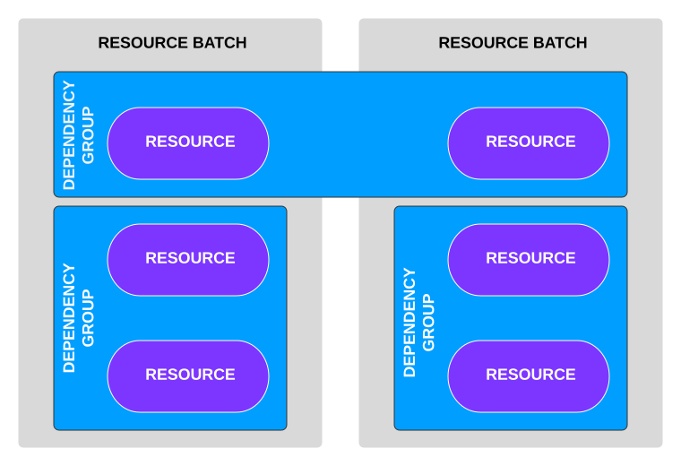
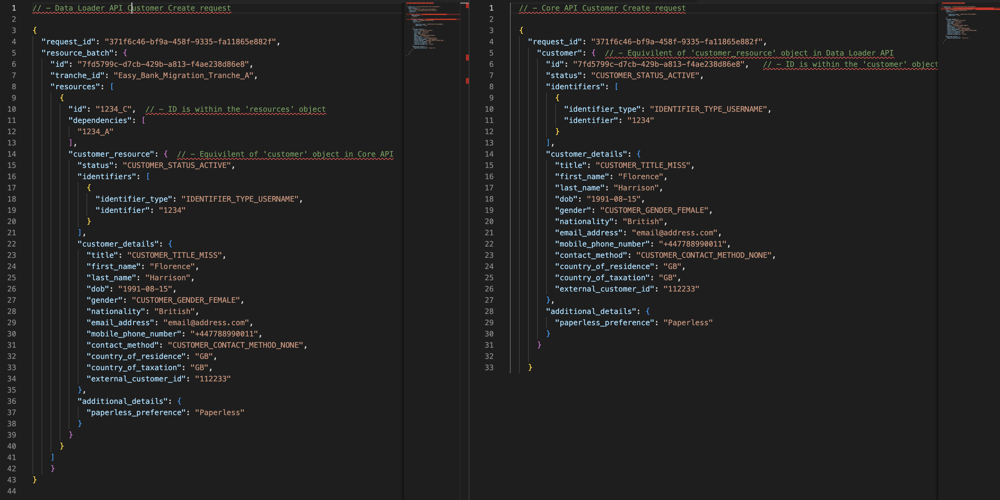
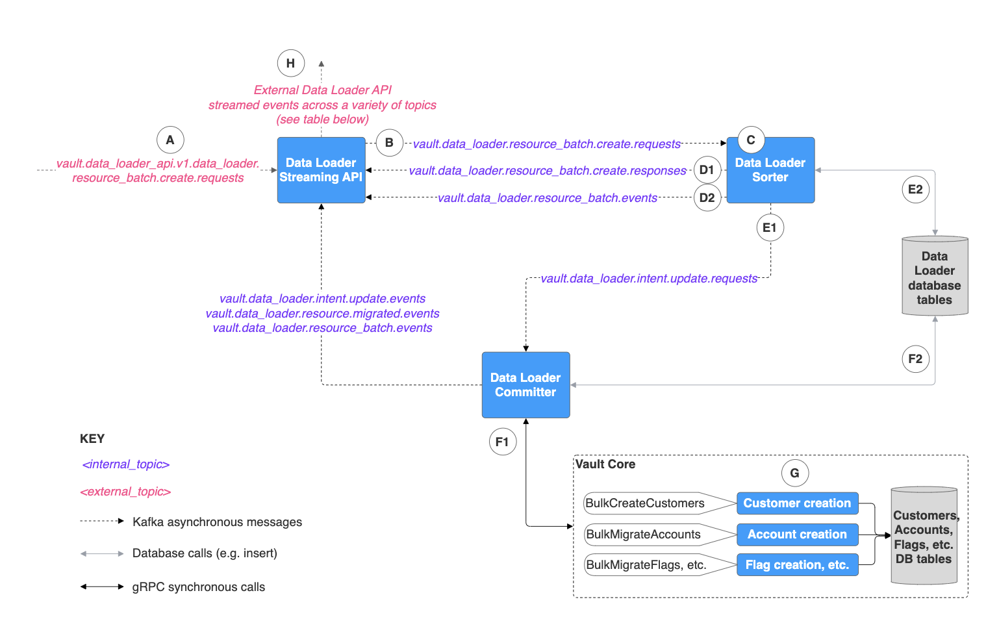
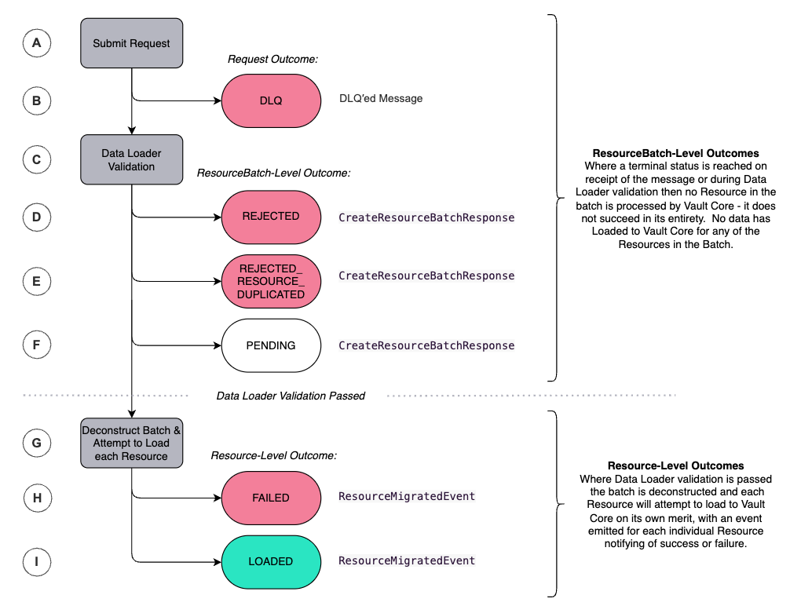
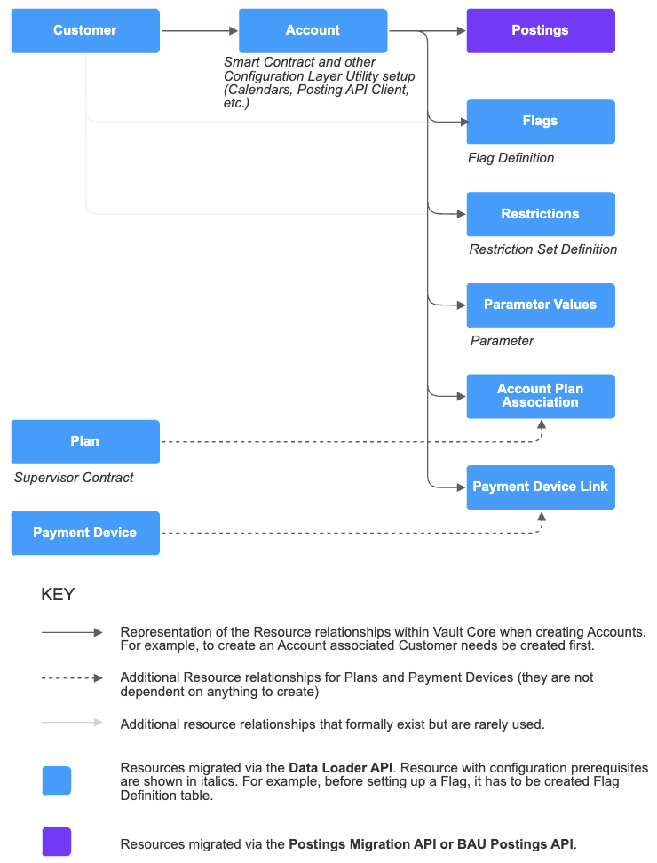
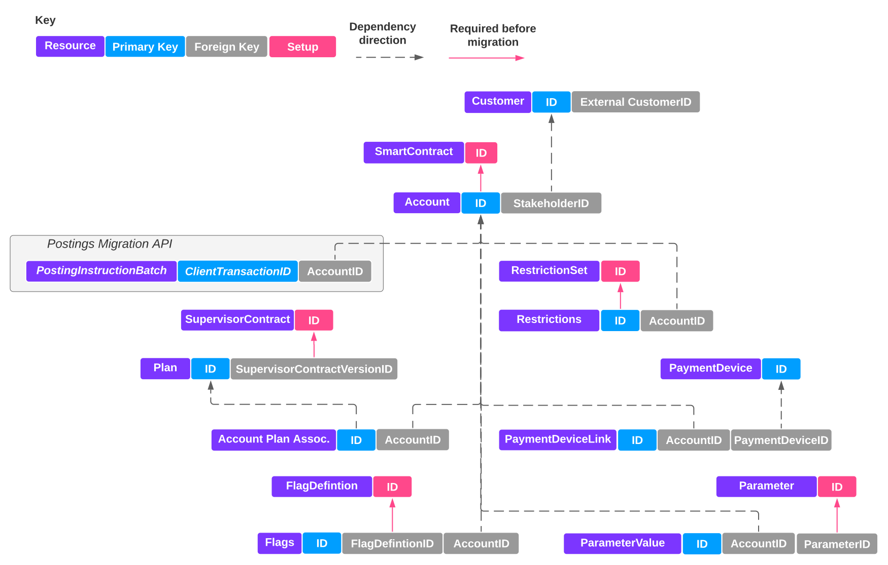
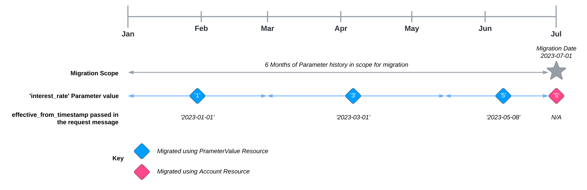
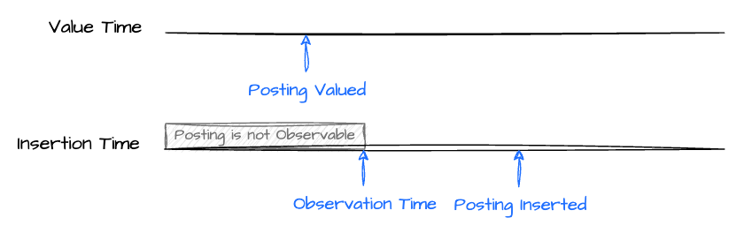
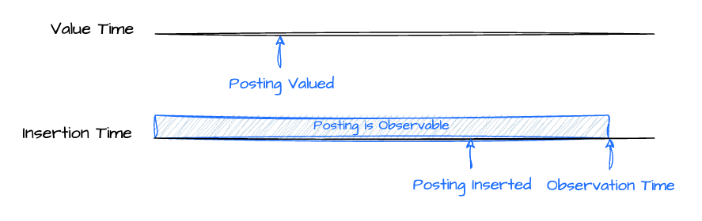
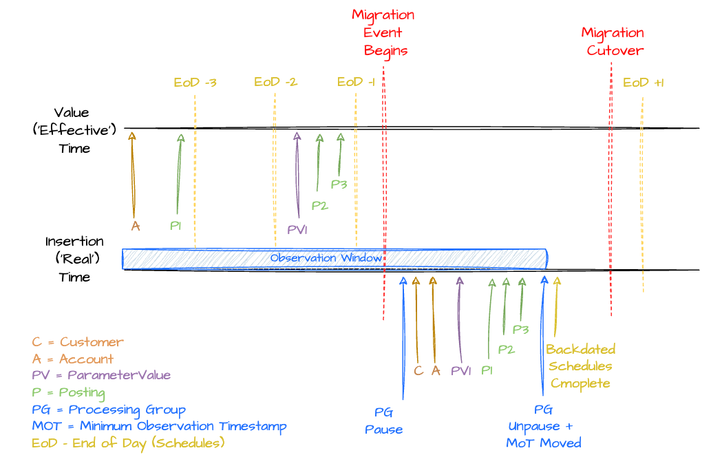

# Migrating using the Data Loader API

## Data Loader API introduction and core concepts

* * *

### About the Data Loader API

The Data Loader API:

-   Enables you to migrate existing data from your legacy core into Vault Core.
    
-   Supports all Vault Core resources that could require a migration of historic data with the exception of Postings, which are instead migrated via the [Posting APIs](/vault-core/5-9/EN/environment_and_installation/migrating_to_vault/migrating_using_the_postings_migration_api).
    
-   Is a Kafka Streaming API, which accepts appropriately formatted request messages.
    
-   Streams a variety of events throughout the load process that can be used to support data reconciliations.
    
-   Supports REST API (List/Get/BatchGet) calls that can be used for low volume checks; note this can only be done via Postman or similar tools and not using Vault Lookup which only supports the Core API.
    
-   Supports data inserts only - updates to data previously inserted via the Data Loader should be made using the BAU Vault Core APIs.
    

error

The Data Loader API is the preferred API for migrating Customers, Accounts, and other non-Posting Resources to Vault Core. If you are considering using the Core API to execute a migration to Vault Core please contact Thought Machine to discuss this.

* * *

### Data Loader API hierarchy and IDs

#### Data Loader hierarchy

The Data Loader hierarchy comprises the following levels:

-   **Resource**: An entity of data within Vault Core; for example a single Customer resource is a single customer record including all associated objects and fields, an Account resource is a single account record, and so on. The Data Loader supports the migration of [a variety of different Resources](/vault-core/5-9/EN/environment_and_installation/migrating_to_vault/migrating_using_the_data_loader_api#data_loader_api_resource_dependencies).
    
-   **Resource Batch**: A message containing one or more Resources that is sent to the Data Loader to be loaded into Vault Core. Resource Batches can contain multiple Resource types that need not be logically related. By extension, Resources relating to a single customer or account entity can be split across multiple Resource Batches.
    
-   **Dependency Group**: An optional feature of the Data Loader, allowing dependencies to be defined in the request message that enforces the load order of those Resources into Vault Core. Dependency Groups can be set for Resources either within or across Resource Batches.
    

The relationship between Resources, Resource Batches, and Dependency Groups is shown in the example below.

##### Resource statuses

Resource supports the following `resource_status`

 
| *Status* | *Description* |
| --- | --- |
| 
`RESOURCE_STATUS_PENDING`

 | 

The resource load is in progress.

 |
| 

`RESOURCE_STATUS_LOADED`

 | 

The resource has been successfully loaded into Vault Core.

 |
| 

`RESOURCE_STATUS_FAILED`

 | 

The resource load has failed.

 |

##### Resource Batch statuses

Resource Batch supports the following `resource_batches.status`

 
| *Status* | *Description* |
| --- | --- |
| 
`RESOURCE_BATCH_STATUS_PENDING`

 | 

There are resources within the batch still in progress.

 |
| 

`RESOURCE_BATCH_STATUS_COMPLETE`

 | 

All resources within the batch have been successfully loaded.

 |
| 

`RESOURCE_BATCH_STATUS_FAILED`

 | 

At least one resource within the batch has failed to load.

 |
| 

`RESOURCE_BATCH_STATUS_REJECTED`

 | 

At least one resource within the batch has been rejected during Data Loader validation.

 |
| 

`RESOURCE_BATCH_STATUS_REJECTED_RESOURCE_DUPLICATED`

 | 

At least one resource within the batch has been rejected during Data Loader validation due to reuse of a `resource_id` that was previously successfully `LOADED` via the Data Loader.

 |

##### Dependency Group statuses

Dependency Group supports the following `dependency_groups.status`

 
| *Status* | *Description* |
| --- | --- |
| 
`DEPENDENCY_GROUP_STATUS_PENDING`

 | 

There are resources within the dependency group still in progress.

 |
| 

`DEPENDENCY_GROUP_STATUS_COMPLETE`

 | 

All resources within the dependency group have been successfully loaded.

 |
| 

`DEPENDENCY_GROUP_STATUS_FAILED`

 | 

At least one resource within the dependency group has failed loading.

 |

#### Data Loader IDs

The Data Loader messages and events contain a series of unique IDs:

 
| *ID* | *Description* |
| --- | --- |
| 
`event_id`

 | 

A unique string ID that can be used for idempotence. Present only on streamed events and cannot be defined in the Request.

-   CreateResourceBatchResponse: n/a, no `event_id` as this is a sync Response not a streamed event
    
-   ResourceBatchCreatedEvent: `event_id` = `request_id`
    
-   ResourceBatchUpdatedEvent: `event_id` = `resource_batch_id` + `status`
    
-   DependencyGroupUpdatedEvent: `event_id` = `dependency_group_id` + `status`
    
-   ResourceEvent: `event_id` = `resource_id` + `status`
    
-   Core API (generated as a result of a Data Loader request): `event_id` is normally equal to the `resource_id` (Customer resource is an exception and generates its own new UUID). Where multiple events are streamed from the same Core API event topic, for example `AccountUpdateCreated` and `AccountUpdateUpdated` on `vault.core_api.v1.accounts.account.events` when migrating an Account, the second event has "\_2" added for uniqueness (and "\_3" and so on where relevant).
    

 |
| 

`request_id`

 | 

ID globally unique among other Data Loader requests.

 |
| 

`resource_batch_id`

 | 

ID globally unique among other Resource Batches.

 |
| 

`tranche_id`

 | 

A tranche id that can be used to identify groups of related resources on Data Loader events. Can be set against either the entire Resource Batch (by placing within the `resource_batch` object) or each individual Resource in the batch (by placing within the `resources` object). Streamed on Data Loader events but not persisted in Vault Core or present on Core API events and cannot be used as a unit for other operations (e.g. pausing schedules).

 |
| 

`resources.id`

 | 

ID of the Resource when migrated to Vault, **globally unique** among other Vault Core Resources, including both those loaded via the Data Loader and already present in Vault Core.

Similar to the `id` field used in the Core API, with a few key differences:

-   To support migration reconciliations, the Resource ID is a mandatory field in the Data Loader request message. In BAU the equivalent id is an optional field on most Create requests and Vault creates it if not set. [Download](/vault-core/5-9/EN/environment_and_installation/migrating_to_vault#downloadable_information) the Vault Core Migrations - Data Dictionary to see exceptions (notably, Restrictions).
    
-   The field format of the `id` is based on a given Resource’s field level validation rules (generally string but this does vary). [Download](/vault-core/5-9/EN/environment_and_installation/migrating_to_vault#downloadable_information) the Vault Core Migrations - Data Dictionary to see exceptions (notably, ParameterValues and Restrictions).
    
-   It is displayed in a different place in the Data Loader request message compared to equivalent Core API requests. It is underneath the Data Loader `resources` object - not the `{resourcename}_resource` object as it is in BAU. This is an implementation detail of the Data Loader API and does not impact how and where this id is stored in the Vault database or how it behaves post migration.
    

 |
| 

`vault_id`

 | 

Not currently used, appears as `null` in Data Loader streamed events.

 |
| 

`dependencies`

 | 

The dependency field lists the Resource IDs on which the given Resource is dependent. The Data Loader does not attempt to load the given resource to Vault until the dependent Resource(s) have successfully loaded. To learn more, see [Resource Dependencies](/vault-core/5-9/EN/environment_and_installation/migrating_to_vault/migrating_using_the_data_loader_api#data_loader_api_resource_dependencies).

 |

* * *

### Data Loader API microservices architecture

The Data Loader is made up of 3 components or microservices:

 
| *Service name* | *Service description* |
| --- | --- |
| 
Data Loader Stream API

 | 

Converts incoming messages into the internal format required to proceed through the Data Loader services. It will also convert Vault Core internal messages into the correct external format before event streaming. This service’s peak activity occurs when messages have been sent to the `vault.data_loader_api.v1.data_loader.resource_batch.create.requests` topic, and drops off when all requests have been processed into the next stage of the Data Loader process. During a load this service normally converts messages quickly and will have minimal periods of lag compared to downstream Data Loader services.

 |
| 

Data Loader Sorter

 | 

Organises the submitted Resource Batches into Dependency Groups ready for submission to the Data Loader Committer. This is generally the bottleneck in the migration process.

 |
| 

Data Loader Committer

 | 

Takes the organised Resources and passes them to the appropriate downstream Vault service (for example, Customer microservice for Customer Resources) via batched gRPC calls in order to be loaded to the Vault DB.

 |

The diagram below outlines these Data Loader microservices and the associated Kafka topics and database queries, which together form the end-to-end Data Loader mechanism that is used to load back-book data to Vault Core.

chat\_bubble

The Dead Letter Queue (DLQ) topics for each stage of the Data Loader journey are not inlcuded in the diagram below. You can find more information on these topics in [Data Loader API Lifecycle](/vault-core/5-9/EN/environment_and_installation/migrating_to_vault/migrating_using_the_data_loader_api#data_loader_api_lifecycle).

 
| *Stage* | *Description* |
| --- | --- |
| 
*A*

 | 

Resource Batches are submitted as `CreateResourceBatchRequests` to the `vault.data_loader_api.v1.data_loader.resource_batch.create.requests` external topic and processed through the Data Loader Stream API that converts the submitted message into the required internal Vault format.

 |
| 

*B*

 | 

Resource Batches, now in the internal Vault message format, are published onto the internal topic `vault.data_loader.resource_batch.create.requests` ready to be picked up by the Data Loader Sorter. When available, the Data Loader Sorter consumes the messages.

 |
| 

*C*

 | 

The Data Loader Sorter creates Dependency Groups using the dependency relationships that have been defined in the request messages. Resources 'wait' at the Sorter until the full dependency group has been received and validated by the Data Loader.

 |
| 

*D*  

 | 

D1: `CreateResourceBatchResponse` updates are sent from the Data Loader Sorter via the Data Loader Stream API, confirming the status of the Resource Batch (H in diagram).

D2: In parallel, a message is sent from the Data Loader Sorter to the `vault.data_loader.resource_batch.events` internal topic confirming acceptance of the request by the Data Loader Sorter, and published externally by the Data Loader Stream API for external consumption (H in diagram).

 |
| 

*E*

 | 

Data Loader Sorter messages are published to `vault.data_loader.intent.update.requests` internal topic and are picked up by the Data Loader Committer when a service pod becomes available (E1). In parallel, the Data Loader Sorter also updates the Data Loader database table to reflect the latest status of the Resource, Resource Batch and Dependency Group (E2).

 |
| 

*F*

 | 

F1: The Data Loader Committer picks up Dependency Groups and, by determining the most appropriate batch size, makes gRPC resource creation calls to downstream Vault services (for example, BulkCreateCustomers).

F2: In parallel to sending messages downstream to the resource services (for example, Customer Creation), the Data Loader Committer also updates the status of the Resource, Resource Batch and Dependency Group in the Data Loader database tables.

 |
| 

*G*

 | 

The gRPC call to the downstream resource services (for example, Customer) triggers those microservices to create the resource in Vault Core. It is these downstream services and not the Data Loader that writes to the database.

 |
| 

*H*

 | 

When the Data Loader Committer has received a response from the gRPC synchronous call to the downstream service (F1) the Data Loader status is updated in the Data Loader database tables (F2) and then fed back to the Data Loader Streaming API in a format ready for external consumption.

 |

chat\_bubble

There is only one database instance deployed alongside Vault Core, but the separation in the diagram is to illustrate the different tables that are being read and written to.

* * *

### Data Loader API topics and events

The tables below summarise the Data Loader’s external topics and streamed Kafka events.

#### Resource Batch

   
| *Event name* | *Description* | *Topic* | *DLQ or failure topic* |
| --- | --- | --- | --- |
| 
`CreateResourceBatchRequest`  
This is the original request message

 | 

The request message that initiated all other events below. The resource batch request will be routed to the request DLQ topic, instead of being processed by the Data Loader Streaming API, where the request message is not structured or readable. This is the most important DLQ to listen to; others are only relevant if there are issues sending messages within Vault Core, which is far less likely than user submission of malformed messages.

 | 

`vault.data_loader_api.v1.data_loader.resource_batch.create.requests`  
(request is submitted onto this topic)

 | 

`vault.data_loader_api.v1.data_loader.resource_batch.create.requests.failures`  
(malformed request message)

 |
| 

`CreateResourceBatchResponse`

 | 

Acknowledges whether the submitted Resource Batch is `REJECTED`, `REJECTED_RESOURCE_DUPLICATE`, or `PENDING` (the latter indicating that initial validation passed) following the initial Data Loader validation steps. A status of `COMPLETE` or `FAILED` will only be seen if duplicate messages reusing the same request and resource batch IDs are submitted (i.e. [idempotency rules](/vault-core/5-9/EN/environment_and_installation/migrating_to_vault/migrating_using_the_data_loader_api#data_loader_api_idempotency)).

 | 

`vault.data_loader_api.v1.data_loader.resource_batch.create.responses`

 | 

`vault.data_loader_api.v1.data_loader.resource_batch.create.responses.failures`  
(Vault malforms message)

 |
| 

`ResourceBatchCreatedEvent`

 | 

Acknowledges that a Resource Batch has been created in a status of `PENDING`. This event is similar to `CreateResourceBatchResponse`. Created in this context means created within the Data Loader ready to be loaded to Vault in a subsequent step. The messages contain a copy of the original Resource request (resource objects with all fields and values).

 | 

`vault.data_loader_api.v1.data_loader.resource_batch.events`

 | 

`vault.data_loader_api.v1.data_loader.resource_batch.events.failures`  
(Vault malforms message)

 |
| 

`ResourceBatchUpdatedEvent`

 | 

Acknowledges that a Resource Batch has `COMPLETED`, `REJECTED_RESOURCE_DUPLICATE`, or `FAILED` to load to Vault Core. These events do not contain resource-level information about what was loaded to the Vault database (resource objects with all fields and values), or any failure reasons for failures.

 | 

`vault.data_loader_api.v1.data_loader.resource_batch.events`

 | 

`vault.data_loader_api.v1.data_loader.resource_batch.events.failures`  
(Vault malforms message)

 |

#### Dependency Group

   
| *Event name* | *Description* | *Topic* | *DLQ or failure topic* |
| --- | --- | --- | --- |
| 
`DependencyGroupUpdatedEvent`

 | 

Acknowledges that a Dependency Group has `COMPLETED` or `FAILED` to load to Vault Core. These events do not contain resource-level information about what was loaded to the Vault database (resource objects with all fields and values), but do contain failure reasons for failures in the `status_message` field.

 | 

`vault.data_loader_api.v1.data_loader.dependency_group.events`

 | 

`vault.data_loader_api.v1.data_loader.dependency_group.events.failures`  
(Vault malforms message)

 |

#### Resource

   
| *Event name* | *Description* | *Topic* | *DLQ or failure topic* |
| --- | --- | --- | --- |
| 
`ResourceMigratedEvent`

 | 

Acknowledges that a Resource has been LOADED or FAILED to load to Vault Core.  
These messages contain:

\- a copy of the original request (resource objects with all fields and values) in the `resource` object  
\- a copy of the data that was loaded to Vault Core where status is LOADED in the `vault_resource_loaded` object  
\- a copy of the request data (including any derived fields that have been added) as well as the failure reasons for FAILED resources in the `status_message` field  
\- Data Loader IDs necessary for cross-referencing - intended as a one-stop shop at the Resource level for migration reconciliations

 | 

`vault.data_loader_api.v1.data_loader.resource.migrated.events`

 | 

`vault.data_loader_api.v1.data_loader.resource.migrated.events.failures`  
(Vault malforms message)

 |

The second table focuses on the internal topics deployed by Vault Core to pass processed data from one microservice to another (for information only as these should not be relevant for client migration planning).

#### Internal topic names

 
| *Internal topic name* | *Description* |
| --- | --- |
| 
`vault.data_loader.resource_batch.create.requests`

 | 

The internal topic that Resource Batches, originally submitted on the external topic, are landed on after they have been through the Data Loader Streaming API and converted into the necessary internal format.

 |
| 

`vault.data_loader.resource_batch.create.responses`

 | 

The internal topic that consumes messages from the Data Sorter, providing a status of `RESOURCE_BATCH_STATUS_REJECTED` or `RESOURCE_BATCH_STATUS_PENDING`, depending on whether the validation rules are met. This is sent via the Data Loader Stream API for external user consumption. When duplicate messages are submitted a status of `RESOURCE_BATCH_STATUS_COMPLETE` or `RESOURCE_BATCH_STATUS_FAILED` will be returned (i.e. [idempotency rules](/vault-core/5-9/EN/environment_and_installation/migrating_to_vault/migrating_using_the_data_loader_api#data_loader_api_idempotency)).

 |
| 

`vault.data_loader.resource_batch.events`

 | 

The internal topic provides Resource Batch messages from the Data Loader Committer through to the Data Loader Stream API.

 |
| 

`vault.data_loader.resource.migrated.events`

 | 

The internal topic provides Resource messages from the Data Loader Committer through to the Data Loader Stream API.

 |
| 

`vault.data_loader.intent.update.requests`

 | 

The internal topic through which messages are passed from the Data Loader Sorter to the Data Loader Committer.

 |
| 

`vault.data_loader.intent.update.events`

 | 

The internal topic through which Resource Batch messages are confirmed via the Data Loader Committer back to the external public topics.

 |

* * *

### Prerequisites to using the Data Loader API

The migration process outlined in the sections below assumes that a number of prerequisite activities have already taken place, likely as part of the Smart Contract build activities, which is always a precursor to data migration.

These prerequisites include, but are not limited to:

-   [Deployment of the relevant packages and components](/vault-core/5-9/EN/environment_and_installation/migrating_to_vault/intro#installing_the_migration_apis) including the decision regarding preferred file format (Protobuf or JSON).
    
    error
    
    You must ensure that the correct file format has been deployed for your intended migration design. The default is Proto if not proactively set to JSON.
    
-   You must be on Smart Contracts Language v4 in order to migrate Accounts using the Data Loader from Vault Core 5.
    
-   Design, build, test, and deployment of Smart Contracts (including Supervisor Contracts where migrating Plans), which will define required Instance Parameters.
    
-   Access Control and Permissions setup.
    
-   Creation of Calendars, Workflows, Internal Accounts (including any processing labels), Processing Groups, Parameter Value Hierarchies and any other relevant Configuration Layer activities.
    
-   Where relevant depending on migration scope and strategy:
    
    -   Creation of Account Schedule Tags
        
    -   Creation of Flag Definitions
        
    -   Creation of Restrictions Definitions
        
    -   Creation of Parameters (the definitions that ParameterValues are associated with)
        
    

When these prerequisite activities, and any others depending on programme scope, have been undertaken, data can be migrated to Vault Core via the Data Loader API.

## Data Loader API lifecycle

* * *

### Data Loader API lifecycle overview

The following diagram and table gives an overview of the journey of a request message through Data Loader with respect to outcomes / statuses:

  
| Step | Description | Output |
| --- | --- | --- |
| 
*Step A*:  
*Submit Request*

 | 

Create a `CreateResourceBatchRequest` and send it to the Kafka topic: `vault.data_loader_api.v1.data_loader.resource_batch.create.requests`

 | 

N/A

 |
| 

*Step B*:  
*Terminal Batch-Level Status: DLQ*

 | 

If a `CreateResourceBatchRequest` message is structurally unsound and cannot be understood by the Data Loader then it will not be processed and will be sent to a DLQ topic.  

See the [Data Loader API failures](/vault-core/5-9/EN/environment_and_installation/migrating_to_vault/migrating_using_the_data_loader_api#data_loader_api_failures_remediation_and_retries) section for further guidance and next steps on fixing this issue.

 | 

DLQ Kafka topic:  
`vault.data_loader_api.v1.data_loader.resource_batch.create.requests.failures`

 |
| 

*Step C*:  
*Data Loader Validation*

 | 

The Data Loader validates the request, specifically relating to reuse of unique ids.  

See the [Data Loader validation](/vault-core/5-9/EN/environment_and_installation/migrating_to_vault/migrating_using_the_data_loader_api#data_loader_api_validation) section for further information about these validation checks.

 | 

N/A

 |
| 

*Step D*:  
*Terminal Batch-Level Status: REJECTED*  

 | 

Where validation fails due to reuse of the `request_id` or `resource_batch_id` the Data Loader sets the Resource Batch to `REJECTED`.  

No Resource in the batch has or will load to Vault Core if this terminal status is reached - the entire batch is rejected in its entirety.  

See the [Data Loader validation](/vault-core/5-9/EN/environment_and_installation/migrating_to_vault/migrating_using_the_data_loader_api#data_loader_api_validation) section for further information about these validation checks.  

See the [Data Loader API failures](/vault-core/5-9/EN/environment_and_installation/migrating_to_vault/migrating_using_the_data_loader_api#data_loader_api_failures_remediation_and_retries) section for further guidance and next steps on fixing this issue.

 | 

Event:  
`CreateResourceBatchResponse`  
Kafka topic:  
`vault.data_loader_api.v1.data_loader.resource_batch.create.responses`  
Status (Batch-Level):  
`RESOURCE_BATCH_STATUS_REJECTED`

 |
| 

*Step E*:  
*Terminal Batch-Level Status: REJECTED\_RESOURCE\_DUPLICATED*  

 | 

Where validation fails due to reuse of the `resource_id` for a Resource that the Data Loader has previously marked as `RESOURCE_STATUS_LOADED` the Data Loader sets the Resource Batch to `REJECTED_RESOURCE_DUPLICATED`.  

No Resource in the batch has or will load to Vault Core if this terminal status is reached - the entire batch is rejected in its entirety.  

See the [Data Loader validation](/vault-core/5-9/EN/environment_and_installation/migrating_to_vault/migrating_using_the_data_loader_api#data_loader_api_validation) section for further information about these validation checks.  

See the [Data Loader API failures](/vault-core/5-9/EN/environment_and_installation/migrating_to_vault/migrating_using_the_data_loader_api#data_loader_api_failures_remediation_and_retries) section for further guidance and next steps on fixing this issue.

 | 

Event:  
`CreateResourceBatchResponse`  
Kafka topic:  
`vault.data_loader_api.v1.data_loader.resource_batch.create.responses`  
Status (Batch-Level):  
`RESOURCE_BATCH_STATUS_REJECTED_RESOURCE_DUPLICATED`  

 |
| 

*Step F*:  
*Interim Batch-Level Status: PENDING*  

 | 

If Data Loader validation is successful the status of the Resource Batch is set to `PENDING` and the message continues to the next stage of the load process.  

The Data Loader also creates and assigns Dependency Groups to each Resource within the Resource Batch at this stage.  

See the [Data Loader resource dependencies](/vault-core/5-9/EN/environment_and_installation/migrating_to_vault/migrating_using_the_data_loader_api#data_loader_api_resource_dependencies) section for further information about dependencies.  

Note: Resource Batches with a `REJECTED_RESOURCE_DUPLICATED` terminal status (Step E above) will also stream an event with a `PENDING` status. The `last_updated_timestamp` field may be the same on both events, but the `PENDING` event will always stream prior to the `RESOURCE_BATCH_STATUS_REJECTED_RESOURCE_DUPLICATED` event, so it is important to listen for the latest message based on time received by your ETL tool.

 | 

Event:  
`CreateResourceBatchResponse`  
Kafka topic:  
`vault.data_loader_api.v1.data_loader.resource_batch.create.responses`  
Status (Batch-Level):  
`RESOURCE_BATCH_STATUS_PENDING`  

 |
| 

*Step G*:  
*Deconstruct Batch & Attempt to Load each Resource*

 | 

The batch (i.e. entirety of the request message), which up to this point would succeed or fail in its entirety, is stripped away and each Resource can now reach its own terminal outcome of either `LOADED` or `FAILED` on its own merit.  

In practice, the Data Loader API send each Resource to the relevant microservice individually, which then run their own additional validations of each Resource’s data.

 | 

At this stage the status of each individual Resource defaults to `PENDING`. This is not streamed out; however, if needed for low volume incident triage you can monitor it on:  

Data Loader REST API call:  
`GET /v1/resources`  
Status:  
`RESOURCE_STATUS_PENDING`

 |
| 

*Step H*:  
*Terminal Batch-Level Status: FAILED*  

 | 

If a Resource does not successfully load to Vault Core then it will be set to a status of `FAILED`.  

No data has been stored in the Vault Core DB (except for Accounts edge cases detailed via the link below).

See the [Data Loader API failures](/vault-core/5-9/EN/environment_and_installation/migrating_to_vault/migrating_using_the_data_loader_api#data_loader_api_failures_remediation_and_retries) section for further guidance and next steps on fixing this issue.

 | 

Event:  
`ResourceMigratedEvent`  
Kafka topic:  
`vault.data_loader_api.v1.data_loader.resource.migrated.events`  
Status (Resource-Level):  
`RESOURCE_STATUS_FAILED`  

 |
| 

*Step I*:  
*Terminal Batch-Level Status: LOADED*  

 | 

If a Resource does successfully load to Vault Core then it will be set to a status of `LOADED`.

 | 

Event:  
`ResourceMigratedEvent`  
Kafka topic:  
`vault.data_loader_api.v1.data_loader.resource.migrated.events`  
Status (Resource-Level):  
`RESOURCE_STATUS_LOADED`

Resources will also stream out notifications on their respective Streaming APIs (Customer, Account, Flag, and so on). See the [Data Loader API monitoring recommendation](/vault-core/5-9/EN/environment_and_installation/migrating_to_vault/migrating_using_the_data_loader_api#data_loader_api_monitoring_recommendations) section, specifically the table at the bottom, for a list of migration relevant Core API Streaming events/topics.

 |

* * *

### Data Loader API validation

The Data Loader performs validation on the data when it receives a new Resource Batch request. This can cause a Resource Batch to be marked as `REJECTED` for the following reasons.

 
| *Failed validation* | *Reason* |
| --- | --- |
| 
Re-use of a Request ID (with different data in message)

 | 

`request_id` has previously been sent to the Data Loader (and did not DLQ) and the data within the request has changed in any way.

 |
| 

Re-use of a Resource Batch ID (with different Request ID)

 | 

`resource_batch_id` with this ID has previously been sent to the Data Loader (and did not DLQ).

 |

A Resource Batch can also be marked as `REJECTED_RESOURCE_DUPLICATED` for the following reason.

 
| *Failed validation* | *Reason* |
| --- | --- |
| 
Re-use of a Resource ID that has previously been `LOADED`

 | 

The request contains at least one `resource_id` that has previously been successfully `LOADED` via the Data Loader API.  

The resource must be in status `LOADED` (reusing a `resource_id` related to `FAILED` or `PENDING` resources will never result in this status) and have originated via the Data Loader API (reusing a `resource_id` that has been created via the Core API rather than the Data Loader API will never result in this status).  

Rejects the entire batch and the associated error message lists any `resource_id` within that batch that resulted in the rejection.

 |

For more information see [Data Loader failures](/vault-core/5-9/EN/environment_and_installation/migrating_to_vault/migrating_using_the_data_loader_api#data_loader_api_failures_remediation_and_retries).

* * *

### Data Loader API resource dependencies

The Vault logical data model has a minimum resource sequence that is required when loading data to Vault, as outlined in the below diagram.

The Data Loader supports a 'dependencies' concept that allows clients to optionally overcome the requirement to migrate data in the exact order given in the LDM (see the *Vault Logical Data Model* diagram).

Where you choose not to use Data Loader dependencies:

-   You MUST migrate data in the exact order outlined in the *Vault Logical Data Model* diagram. Resources loaded out of order will fail with a failure reason that the necessary precondition resource is not present.
    
-   As Kafka does not guarantee that data will be processed in the order it is sent to Kafka, you should execute separate sequential loads of each resource type (load all Customers, validate they have finished loading, and only then load associated Accounts, etc.). At a minimum you must wait for positive confirmation in the form of a Data Loader or Core API event notifying that a resource has loaded before sending any other resource that is dependent on that resource.
    

Where you do choose to use Data Loader dependencies:

-   Dependencies are set in the Data Loader request message (see the example below where Account 789 is dependent on Customer 123).
    
-   Resources can be sent within Resource Batches to the Data Loader out of order (i.e. the dependent resource can be sent ahead of the resource it is dependent on) and you will not have to orchestrate or sequence the load at all as Vault Core will do this for you.
    
-   Multiple dependencies can be set against a single resource, dependencies can be set between any resource including those over and above the minimum logical data model, and dependencies can be set in 'both directions' (e.g. in example code snippet below Account 789 is dependent on Customer 123, and Customer 123 could additionally be made dependent on Account 789 ).
    
-   Resources with dependencies can be split flexibly across Resource Batches with no limitations - the Data Loader will always wait until all dependent resources have arrived before committing them one by one, in the order required by the Vault Core Logical Data Model (LDM), to the Vault Core Database. You can load all the data associated with a single Customer or Account in a single Resource Batch, or across different Resource Batches, or any other combination you can imagine - the resources you decide to include in what Resource Batch and then the order you send them to Vault Core in becomes irrelevant.
    
-   The dependent resource must have itself have been (or in the future be) loaded via the Data Loader API. For example, you cannot create a Customer resource via the BAU Core API and then use this resource id as a dependency for a Data Loader API Account. Dependency validation is executed against the Data Loader’s own database, not general Vault Core database, so if the Data Loader has not seen the resource in question the dependency cannot resolve correctly.
    

If utilising Data Loader dependencies it is also important to note that:

-   Using Data Loader Dependencies will require (a small amount of) additional effort in data transformation to set the dependencies field correctly.
    
-   Data Loader Dependencies are only supported on resources that can be loaded via the Data Loader (and not via any other mechanism, such as the Postings Migration API or BAU APIs). As a result, migrated Postings must be sequentially loaded after accounts, either in a bulk load or one-by-one by listening for individual account creation events and using this as a trigger to send postings.
    
-   Data Loader Dependencies do not guarantee atomicity of Dependency Groups (for example all or nothing loading of all Resources in the group), they only guarantee that data can be sent to the Data Loader in any order. In a group of three resources linked via dependencies if the first succeeds and second fails then the third will remain PENDING at the Data Loader until the second failed resource is fixed and resubmitted successfully.
    
-   For dependencies to operate correctly, the Data Loader database must be maintained between migration phases and should not be deleted until all dependencies have been resolved.
    
-   You cannot specify the `dependency_group_id`. It is output only and automatically created for every resource loaded via the Data Loader (even if it is only a single resource with no dependencies specified). Using the dependency field in the request message results in other resources being added to the existing group of the dependent resource.
    
    -   For example, you load a Customer with no dependencies set which automatically generates a dependency group with id "123".
        
    -   If you subsequently load an Account that has a dependency set on this Customer it will be added to the dependency group and also have its dependency group id set to "123". The group can therefore grow over time as further resources are added to the chain (such as a Flag dependent on that Account) and the group status also moves back and forth between terminal and non-terminal statuses as it does so.
        
    -   Where the status shifts from terminal to non-terminal, for each new resource added to the Dependency Group an additional `ResourceMigratedEvent` is (re)streamed for all resources in the Dependency Group. For example, if adding a Flag to a Dependency Group that has previously loaded Customer and Account, then when adding the Flag the corresponding Customer and Account `ResourceMigratedEvent` will be streamed again.
        
    

See the following diagram for an alternative view that shows the Dependencies model; this also highlights the relationships between the unique ids for each Resource.

## Data Loader API monitoring and error handling

* * *

### Data Loader API monitoring recommendations

There is no single definitive approach to migration monitoring. However, the following example represents Thought Machine’s recommended minimum viable approach.

Monitor the Data Loader API request DLQ (`.Failures` topic), ideally via automated alerting:

-   Data Loader API: `vault.data_loader_api.v1.data_loader.resource_batch.create.requests.failures` (single source of terminal state - DLQ)
    

Consume the following Events into your reconciliation tool:

-   Data Loader API: `CreateResourceBatchResponse` (single source of terminal status - `REJECTED` & `REJECTED_RESOURCE_DUPLICATED`)
    
-   Data Loader API: `ResourceMigratedEvent` (single source of terminal status - `FAILED`, preferred option for terminal status - `LOADED`)
    
-   Core API: `AccountUpdateUpdatedEvent` (Accounts v1) or `AccountUpdatedEvent` (Accounts v2), although which of these is relevant for your migration will likely depend on which version of the Accounts API you are consuming in BAU (single source of Account Activation outcomes).
    
    -   See [here](/vault-core/5-9/EN/environment_and_installation/migrating_to_vault/migrating_using_the_data_loader_api#data_loader_api_failures_remediation_and_retries) (specifically the “Failure (Account Activation)” tab) for more information about the value of listening to these Core API Account events to handle 'fail forwards / backwards' edge cases.
        
    
-   Core API: `PlanUpdateUpdatedEvent`, though only when deploying Supervisor Contracts (single source of Plan Activation outcomes).
    

*Thought Machine also recommends that you have access to your Kafka Producer logs so you can investigate errors arising from there. For example, due to messages over 4MB being created and attempting to be submitted.*

chat\_bubble

See the [Data Loader topics and events](/vault-core/5-9/EN/environment_and_installation/migrating_to_vault/migrating_using_the_data_loader_api#data_loader_api_topics_and_events) section for detailed descriptions of each of the messages listed above.

Optionally the following events can also be listened to for migration monitoring;

-   `ResourceBatchCreatedEvent`, `ResourceBatchUpdatedEvent`, and `DependencyGroupUpdatedEvent` can be used to reconcile specifically at the Resource Batch or Dependency Group levels. They are not strictly required in your MVP migration monitoring design and are never a substitute for the MVP recommendations above.
    
-   [Other Data Loader DLQ topics](/vault-core/5-9/EN/environment_and_installation/migrating_to_vault/migrating_using_the_data_loader_api#data_loader_api_topics_and_events), aside from `CreateResourceBatchRequest`, will only receive messages that Vault itself has malformed. This is exceptionally unlikely, although they can be monitored for completeness.
    
-   `<Core API Events>` provide an alternative set of Resource-level events to consume when migrating. They are identical to the equivalent Creation / Update events generated in BAU. This may be useful to monitor based on existing BAU integrations you have for these events.
    
    -   These events are consistent with the equivalent Data Loader API events for those resources (same event name, topic, message structure, and so on), with the exception of the `event_id` which is set to the `request_id` instead of the `resource_id` as in Data Loader API.
        
    -   In the context of Data Loader migrations, these Core API events will only provide events for `LOADED` outcomes (successful load to the Vault DB) and not `FAILED`, `REJECTED` or DLQ outcomes (i.e. any outcome that means the data does not load to the Vault DB). This is because in BAU the failure responses for these journeys do not result in a streamed Kafka event but rather a synchronous HTTP response back to the user submitting the request informing them of the failure. In the context of Data Loader migrations it is the Data Loader receiving these responses and not the end user, and the Data Loader uses this failure information to create its own Data Loader events as outlined above.
        
    -   For migrations, all resource-level information useful for reconciliations can be found on the ResourceMigratedEvent instead.
        
    -   Below is a snapshot of the most relevant Core API (BAU) Create and Update events for migration-supported resources.
        
    

Accounts Customer Contract Notifications Flags Parameters & Parameter Values Payment Devices Plans Restriction Set

**Accounts v1**

   
| *Event name* | *Description* | *Event topic* | *DLQ or failure topic* |
| --- | --- | --- | --- |
| 
`AccountCreatedEvent`

 | 

For the purposes of migration, this acknowledges the creation of an account on Vault.

 | 

`vault.core_api.v1.accounts.account.events`

 | 

`vault.core_api.v1.accounts.account.events.failures`

 |
| 

`AccountUpdateCreatedEvent`

 | 

For tracking that the account activation has started following Account creation.

 | 

`vault.core_api.v1.accounts.account_update.events`

 | 

`vault.core_api.v1.accounts.account_update.events.failures`

 |
| 

`AccountUpdateUpdatedEvent`

 | 

Important for determining that synchronous account activation activities (e.g. schedule creation or committing postings) have completed as expected. The creation of schedules is key to ensure that accounts are set up correctly ahead of the first End of Day run. Async activities may not have completed when this event is streamed (e.g. updating balances)

 | 

`vault.core_api.v1.accounts.account.events` `vault.core_api.v1.accounts.account_update.events`

 | 

`vault.core_api.v1.accounts.account.events.failures` `vault.core_api.v1.accounts.account_update.events.failures`

 |

These three listening 'points' ensure that a Customer Account is set up correctly (internal accounts do not stream events on these topics). The account update that drives account activation is automatically triggered when the migrated account is created on Vault.

**Accounts v2**

   
| *Event name* | *Description* | *Event topic* | *DLQ or failure topic* |
| --- | --- | --- | --- |
| 
`AccountCreatedEvent`

 | 

For the purposes of migration, this acknowledges the creation of an account on Vault.

 | 

`vault.core_api.v2.accounts.account.events`

 | 

`vault.core_api.v2.accounts.account.events.failures`

 |
| 

`AccountUpdatedEvent`

 | 

Important for determining that synchronous account activation activities (e.g. schedule creation or committing postings) have completed as expected. The creation of schedules is key to ensure that accounts are set up correctly ahead of the first End of Day run. Async activities may not have completed when this event is streamed (e.g. updating balances)

 | 

`vault.core_api.v2.accounts.account.events`

 | 

`vault.core_api.v2.accounts.account.events.failures`

 |

   
| *Event name* | *Description* | *Event topic* | *DLQ or failure topic* |
| --- | --- | --- | --- |
| 
`CustomerCreatedEvent`

 | 

Acknowledges the creation of a customer on Vault. This may be simply the creation of a stakeholder ID within the Customer resource and not the 'full' Customer record (e.g. name and address).

 | 

`vault.api.v1.customers.customer.created`

 | 

`vault.api.v1.customers.customer.created.failures`

 |
| 

`CustomerAddressCreatedEvent`

 | 

Creation of a (home) address for a Customer. Not to be confused with a posting balance address. This is not currently supported for loading via the Data Loader.

 | 

`vault.core_api.v1.customers.customer_address.events`

 | 

`vault.core_api.v1.customers.customer_address.events.failures`

 |

   
| *Event name* | *Description* | *Event topic* | *DLQ or failure topic* |
| --- | --- | --- | --- |
| 
`ContractNotificationEvent`

 | 

Provided when the execution of a hook (e.g. activation hook) returns a `AccountNotificationDirective` (Smart Contracts) or `PlanNotificationDirective` (Supervisor Contracts). Can be useful if wanting to provide additional monitoring or to enable Vault Core migration to trigger downstream activity.

 | 

`vault.core_api.v1.contracts.contract_notification.events`

 | 

`vault.core_api.v1.contracts.contract_notification.events.failures`

 |

   
| *Event name* | *Description* | *Event topic* | *DLQ or failure topic* |
| --- | --- | --- | --- |
| 
`FlagCreatedEvent`

 | 

Creation of a Flag resource.

 | 

`vault.core_api.v1.flags.flag.events`

 | 

`vault.core_api.v1.flags.flag.events.failures`

 |

   
| *Event name* | *Description* | *Event topic* | *DLQ or failure topic* |
| --- | --- | --- | --- |
| 
`ParameterEvents`

 | 

Streamed whenever a Parameter (e.g. interest\_rate) is created for the first time. This includes Parameters resulting from an Account load.

 | 

`vault.core_api.v1.parameters.parameter.events`

 | 

N/A

 |
| 

`ParameterValueEvents`

 | 

Streamed whenever a ParameterValue (e.g. interest\_rate = '4') is created.

 | 

`vault.core_api.v1.parameters.parameter_value.events`

 | 

N/A

 |

   
| *Event name* | *Description* | *Event topic* | *DLQ or failure topic* |
| --- | --- | --- | --- |
| 
`PaymentDeviceCreatedEvent`

 | 

Creation of a payment device resource.

 | 

`vault.core_api.v1.payment_devices.payment_device.events`

 | 

`vault.core_api.v1.payment_devices.payment_device.events.failures`

 |
| 

`PaymentDeviceLinkCreatedEvent`

 | 

Creation of a payment device link resource.

 | 

`vault.core_api.v1.payment_devices.payment_device_link.events`

 | 

`vault.core_api.v1.payment_devices.payment_device_link.events.failures`

 |

   
| *Event name* | *Description* | *Event topic* | *DLQ or failure topic* |
| --- | --- | --- | --- |
| 
`PlanCreatedEvent`

 | 

Creation of a Plan resource.

 | 

`vault.core_api.v1.plans.plan.events`

 | 

`vault.core_api.v1.plans.plan.events.failures`

 |
| 

`AccountPlanAssocCreatedEvent`

 | 

Indicates the `AccountPlanAssociation` resource was created successfully in Vault (similar to a normal account) - the plan is linked to the account.

 | 

`vault.core_api.v1.plans.account_plan_assoc.events`

 | 

`vault.core_api.v1.plans.account_plan_assoc.events.failures`

 |
| 

`PlanUpdateCreatedEvent`

 | 

Acknowledges the start of the `PlanUpdate`.

 | 

`vault.core_api.v1.plans.plan_update.events`

 | 

`vault.core_api.v1.plans.plan_update.events.failures`

 |
| 

`PlanUpdateUpdatedEvent`

 | 

Tracks the completion of a plan update and communicates the status of `PlanUpdate`. This is important for migration in the context of plan activation and ensuring all plan (Supervisor Smart Contract) schedules are set up correctly. Make sure that the `PlanUpdateUpdatedEvent` is successful.

 | 

`vault.core_api.v1.plans.plan_update.events`

 | 

`vault.core_api.v1.plans.plan_update.events.failures`

 |

   
| *Event name* | *Description* | *Event topic* | *DLQ or failure topic* |
| --- | --- | --- | --- |
| 
`RestrictionSetCreatedEvent`

 | 

Creation of a Restriction Set resource.

 | 

`vault.core_api.v1.restrictions.restriction_set.events`

 | 

`vault.core_api.v1.restrictions.restriction_set.events.failures`

 |

chat\_bubble

The [Usage Monitor](/vault-core/5-9/EN/reference/core_apps_and_operations_dashboard/usage_monitor#logging_in_and_permissions) is unlikely to be a fit for purpose tool or app to support migration reconciliations. The number of migrated accounts or customers shown in the UI will only be updated once a month (this defaults to first of the month) so will likely not tell you in a timely manner how many accounts or customers have been loaded.

**Important questions and considerations regarding event monitoring**

*How do I listen to events?*

-   Streamed Kafka events are a key part of the Vault Core architecture and your BAU implementation design should have already solved this. Contact your Thought Machine representative for general support on consuming Kafka events where necessary.
    

*How do I capture streamed events for use in reconciliations?*

-   This will depend on your reconciliation design, but our expectation would be that Vault’s streamed events are being picked up by a Kafka listener and sent to a downstream data lake or database that the reconciliations tooling can access in order to perform reconciliations.
    
-   This might be the same data lake used in BAU as a system of insight, or a separate reconciliations database used only in migration. Storing copies of Kafka events as they are sent and streamed out is key - you should NOT build a reconciliation tool that relies on REST API calls to retrieve the migration outcome (or state) of loaded data.
    

*Why can’t I just use the REST APIs for reconciliations instead of the streamed Kafka events?*

-   You should never use REST API GET calls as a primary source of data for accuracy reconciliations because they are not performant at even small migration volumes (1000+). You should only use these GET calls with the [Data Loader API](/vault-core/5-9/EN/api/data_loader_api#Data_loader) and [Core API](/vault-core/5-9/EN/api/core_api/) to investigate small/low volume issues (for example, a single DLQ message or functional migration testing).
    
-   Instead, you should ensure that Vault Core’s streamed Kafka events are consumed and stored in your reconciliations data lake or DB and used as the primary source of data for accuracy reconciliations.
    

*Do I need to handle duplicate messages?*

-   Vault Core provides an 'at least once' delivery guarantee. This means you should always receive at least one response message (event topic or DLQ) for every request submitted, but you may also get more than one.
    
-   It is important to set up your reconciliations to handle scenarios where you get two identical response events (i.e. duplicate `event_id`) for the same request. This design requirement may already be part of the wider architecture; for example, certain S3 connectors provide an exactly once delivery guarantee.
    
-   Two common reasons that Vault may stream out duplicate events include (this is not exhaustive):
    
    -   The APIs directly write each streamed event to the public response Kafka topics - this is known as 'eager publishing'. They will insert an intent entry into the database table and update the entry as "published" if the event is successfully published to the Kafka topic. There are occasional instances where eager publishing does not happen immediately or fails (for example, due to a network issue). From here the Journal Poller monitors for any previously unpublished events, publishes these events and updates the intent entries in the database accordingly as "published". As a result, the same Kafka event could be published twice as the journal poller sees the intent entry status as "unpublished" and decides to republish the message to Kafka. It is the responsibility of the event consumer to handle duplicate events via idempotency checks.
        
    -   If the poller service pod (pod A) or "worker" processes a message and sends the message to Kafka but scales down before updating the intent entry as "published", then the same event could be delivered more than once to the Kafka topic. The next available poller pod (pod B) sees that the message has been processed but the intent entry in the database is not updated as "published". To ensure reliable event delivery, pod B will send the same event again.
        
    

**Relevance of the `GetJournalEventsChecksum` reconciliation events within migration**

To provide additional data to support your migration reconciliation, you can use the Core Streaming API event reconciliation feature. This reconciliation would likely not support business reconciliations (such as checking there are 100 accounts each with the correct $ values) but could support technical reconciliations. Specifically, this reconciliation would provide confidence that all events from the Core Streaming API resulting from the migration have been consumed as expected.

The GetJournalEventsChecksum is the Core Streaming API’s event reconciliation feature. This reconciliation is not a replacement for full migration reconciliations (completeness and accuracy) but could be added to the broader suite of technical reconciliations run over the migration event. Specifically, this reconciliation would provide confidence that all events from the Core Streaming API resulting from the migration have been consumed as expected and no events have been dropped / missed.

To reconcile the events published via the Core Streaming API with downstream records use the [GetJournalEventsChecksum](/vault-core/5-9/EN/api/core_api#journaleventschecksum) endpoint. This provides a count of events (e.g. account creation) that happened during the event window and list those events that led to that count of events being published.

It is important to note that: \* Duplicates are disregarded as part of the response on this endpoint.

-   This endpoint also has a limit of 500k events - if the volume of the resource loaded in the time window is greater than 500k, then multiple requests across smaller time windows must be made to build the complete view. This limit of 500k is enforced to protect wider Vault services and recognises the expensive operations that are required to provide this endpoint response.
    

Depending on the topic used to support your reconciliation, you may need to filter the query results to complete an accurate migration comparison. For example, you may need to ignore account events triggered by BAU (non-migration) account creation or account status change.

* * *

### Data Loader API failures, remediation and retries

chat\_bubble

For general guidance on designing migration Reconciliations, see the [Reconciliations](/delivery-framework/latest/EN/delivery_workstream/migration/extract_transform_and_load_etl_tooling_build) section of the Vault Core Delivery Framework’s Migration Workstream.

The ability to retry messages should already be set up as part of your wider Vault integration architecture (for example, a retry for the BAU Postings API). This capability is also important for migration purposes.

Where there are errors, failures, or other issues with the migration pipeline you must have the ability to automatically (up to a set number of retries) and manually (based on user instruction) fix and retry previously sent Data Loader messages.

In broadly chronological order left to right the errors, failures, or other issue types you should consider are as follows:

Kafka Error DLQ Rejection Failure (Data Loader) Failure (Account Activation) Missing messages

*Identify:*

-   A failure to connect to Kafka may be apparent through a message similar to the following: `KafkaTimeoutError: Failed to update metadata after 5.0 secs`
    

*Remediate:*

-   `CreateResourceBatchRequest` messages that encounter Kafka Connection Errors have not made it to the Vault Platform and so Vault will not produce any errors for these.
    
-   Your migration pipeline design should include the ability to automatically retry Data Loader `CreateResourceBatchRequest` messages based on Kafka responses where there is a transient failure to connect to Kafka (Brokers).
    

*Retry:*

-   Retry the message by sending the entire Resource Batch as-is, including the same `request_id`, `resource_batch_id` and `resource_id`. The message did not reach the Data Loader, so the normal [idempotency rules](/vault-core/5-9/EN/environment_and_installation/migrating_to_vault/migrating_using_the_data_loader_api#data_loader_api_idempotency) do not apply.
    

*Identify:*

-   A Resource Batch lands on the `CreateResourceBatchRequest` DLQ topic.
    
-   The Data Loader performs structural checks on each message when sending from one location to another (internal or external). Where these fail, the message is placed onto a DLQ. The DLQ does not give failure reasons, however the primary reasons for Data Loader messages being sent to a DLQ are as follow.
    

 
| *Failed check* | *Reason* |
| --- | --- |
| 
No Resources

 | 

Message contains no Resources in the `resources` object

 |
| 

No Resource Batch ID

 | 

Message is missing the `resource_batch.id` field

 |
| 

No Request ID

 | 

Message is missing the `request_id` field

 |
| 

Message is in wrong format (JSON vs Proto)

 | 

As outlined in the [Environment setup section](/vault-core/5-9/EN/environment_and_installation/migrating_to_vault/intro#selecting_json_versus_proto_api_formats) it is important to configure the Data Loader Streaming API to the message format to the same format used in your request messages. Misalignment of message formats is a common cause of DLQs on newly provisioned environments.

 |
| 

Fields do not meet their Proto format definitions

 | 

Some fields in the message do not meet the definitions of the Proto field format specified in the relevant Proto files. For example, passing a value against a field with a `google.protobuf.Timestamp` format that is not in the required RFC 3339 format. These Proto files are available for download in the [Data Loader API](/vault-core/5-9/EN/api/data_loader_api/) section. The DLQ message header will state `Something Went Wrong`, and the specific cause will be present in associated logs streamed from the `data-loader-stream-api` component.

 |
| 

Message is not correctly formatted

 | 

Message structure does not meet the standard syntax of the relevant message format. For example, missing brackets, commas or any other structural formatting issue.

 |

-   The Data Loader DLQ topics (internal and external) are denoted by topics ending in `.failures`.
    
-   This does not mean that every message with a `FAILED` status ends up on a DLQ. Rather, messages with a `FAILED` status are streamed on the normal external topics with a status field set to `FAILED`.
    
-   The DLQs should be thought of more as Error topics, where Vault is unable to understand the message. Accordingly it is only the request topic’s DLQ (`vault.data_loader_api.v1.data_loader.resource_batch.create.requests.failures`) that is likely to see any messages during a Vault migration, with all others only used where Vault internal services fail to produce correctly formatted messages.
    
-   You can find information about how to monitor and read the DLQ topics mentioned in this guide on the [DLQ](/vault-core/5-9/EN/reference/dlq) page.
    
-   Vault Core’s [DLQ Inspector](/vault-core/5-9/EN/reference/dlq#dlq_inspector) can be useful in both notifying of and understanding potential reasons for DLQ’ed messages.
    

*Remediate:*

-   Where the reason for DLQ is determined to be an issue with the content or structure of the message itself, you should identify and fix this. DLQs by their nature do not provide failure reasons, because the message could not be understood by Vault, but likely DLQ reasons are outlined above.
    

*Retry:*

-   Retry the Resource Batch by sending the entire Resource Batch as-is, including the same `request_id`, `resource_batch_id` and `resource_id`. The message did not reach the Data Loader, so the normal [idempotency rules](/vault-core/5-9/EN/environment_and_installation/migrating_to_vault/migrating_using_the_data_loader_api#data_loader_api_idempotency) do not apply.
    
-   If the message landed on one of the [other internal Data Loader DLQ topics](/vault-core/5-9/EN/environment_and_installation/migrating_to_vault/migrating_using_the_data_loader_api#data_loader_api_topics_and_events), contact Thought Machine immediately.
    

*Identify:*

-   A Resource Batch message is streamed with a `REJECTED` or `REJECTED_RESOURCE_DUPLICATED` status.
    
-   The `CreateResourceBatchResponse` message acts as a 'receipt' from the Data Loader acknowledging that it received the request message, and is also the single source of `REJECTED` & `REJECTED_RESOURCE_DUPLICATED` outcomes where the [Data Loader validation](/vault-core/5-9/EN/environment_and_installation/migrating_to_vault/migrating_using_the_data_loader_api#data_loader_api_validation) of the message has failed.
    

*Remediate:*

-   Where a Resource Batch is Rejected for not meeting the [Data Loader validation](/vault-core/5-9/EN/environment_and_installation/migrating_to_vault/migrating_using_the_data_loader_api#data_loader_api_validation), the message will contain an ID that has been reused and must be fixed before resubmitting. Where a Resource Batch is `REJECTED` or `REJECTED_RESOURCE_DUPLICATED` the Rejection reasons can be found in the `validation_error` field.
    
-   This is most likely to occur in early tests of the transformation pipeline, and fixed in transform accordingly, however the DLQ should still continue to be monitored in all migration events.
    

*Retry:*

-   You can retry the Resource Batch by sending a new Resource Batch message with a different `request_id` and `resource_batch_id`. The message previously reached the Data Loader, so the normal [idempotency rules](/vault-core/5-9/EN/environment_and_installation/migrating_to_vault/migrating_using_the_data_loader_api#data_loader_api_idempotency) apply.
    

*Identify:*

-   A `ResourceMigratedEvent` message is streamed with a `FAILED` status.
    
-   AND if the Resource is an Account then the associated Accounts v2 `AccountUpdatedEvent` did not stream - if the Accounts v2 `AccountUpdatedEvent` did stream then instead see the 'Failure (Account Activation)' tab.
    

*Remediate:*

-   Where a Resource lands in a `FAILED` status:
    
    -   The Resource has not loaded to Vault Core due to a validation failure in the downstream relevant microservice.
        
    -   The associated Resource Batch and Dependency Group statuses will also update to `FAILED`. This does not impact any other Resources in the batch or group, and only indicates that at least one Resource within the batch or group has `FAILED`.
        
    
-   You can find the Failure reasons in the `status_message` field on the `ResourceMigratedEvent`. You must fix the issue (either in the message or config, for example a missing Smart Contract) before resubmitting.
    

*Retry:*

-   You can retry the Resource by sending a new Resource Batch message with a different `request_id` and `resource_batch_id`, while maintaining the same unique `resource_id` that was used in the original request. The message previously reached the Data Loader, so the normal [idempotency rules](/vault-core/5-9/EN/environment_and_installation/migrating_to_vault/migrating_using_the_data_loader_api#data_loader_api_idempotency) apply.
    
-   Upon retrying the Resource, the status will update (reset) to `RESOURCE_STATUS_PENDING`. Where a retry is:
    
    -   Unsuccessful, the process above should be repeated, with a focus on identifying the root cause of the original issue, which may not have been correctly solved.
        
    -   Successful, a full set of new Data Loader events will be streamed out to signify successful load, and when complete the Resource Batch and Dependency Group statuses will transition to `COMPLETE`.
        
    

*Identify:*

-   A `ResourceMigratedEvent` message is streamed with a `FAILED` status for the Account Resources and the associated Accounts v2 `AccountUpdatedEvent` was also streamed.
    
-   The Accounts v2 `AccountUpdatedEvent` will have a `status` of either `ACCOUNT_STATUS_PENDING` or `ACCOUNT_STATUS_OPEN` and an error message will be present within the `error` object.
    

*Remediate:*

-   If you see a `FAILED` status on the *latest* `ResourceMigratedEvent` for an Account resource it is important to validate the `status` field and `error` object within the Accounts v2 `AccountUpdatedEvent`.
    
    -   This is because such Accounts will have *failed backward* or *failed forward* in line with the guidance on handling Accounts v2 edge cases within [Troubleshooting Customer Accounts](/vault-core/5-9/EN/reference/accounts/accounts_version_2#troubleshooting_customer_accounts), which you should pause to read in full now for context.
        
    -   In short, there are three specific scenarios whereby an Account will have been created in Vault Core but not have successfully completed Account Activation.
        
    -   As per [Troubleshooting Customer Accounts](/vault-core/5-9/EN/reference/accounts/accounts_version_2#troubleshooting_customer_accounts), these are a result of the failure of a hook directive, which can be one of: (1) creating schedules, (2) creating postings, or (3) sending contract notifications.
        
    -   For (1) the Account is created in a `PENDING` state with an error. For (2) and (3) the Account is created in an `OPEN` status with an error message. The error messages include (but are not limited to):
        
    

| *Failure Message* |
| --- |
|  |
| 
`apierror: code = DeadlineExceeded msg = 'unable to create schedule sets' details = []`

 |
|  |
| 

`apierror: code = Unavailable msg = 'unable to create schedule sets' details = []`

 |
|  |
| 

`apierror: code = Internal msg = 'unable to create schedule sets' details = []`

 |
|  |
| 

`apierror: code = Internal msg = 'failed to fetch schedule tags' details = []`

 |
|  |
| 

`apierror: code = Unavailable msg = 'failed to commit account notification directives returned from the account’s activation hook' details = []`

 |
|  |
| 

`apierror: code = Internal msg = ''failed to commit scheduled events returned from the account''s activation hook'' details = []`

 |
|  |

-   The `ResourceMigratedEvent` will mark the resource as `FAILED` even though the Account was created in Vault Core, which is why it is important your ETL tooling reconciliations also consume and consider the Accounts v2 `AccountUpdatedEvent`, checking for any `FAILED` Accounts whether the `status` field is set to `ACCOUNT_STATUS_PENDING` or `ACCOUNT_STATUS_OPEN` and the `error` object is populated.
    
-   This is exceptional behaviour that should not occur at scale, though this should be validated during ETL testing.
    
-   For Account v1 events the event will be status `ACCOUNT_UPDATE_STATUS_ERRORED` and the error explained within the `failure_reason` field (for Accounts v1) or `error` object (for Accounts v2) on the `AccountUpdate` event.
    
-   The only other potential cause of this behaviour is if the `maximum_locked_account_duration` Accounts config value has been set too low.
    
    -   This config automatically fails Account activation if one of the three directives (creating schedules, creating postings, or sending contract notifications) takes longer than this max duration. Up until this point, the directive will repeatedly retry until a terminal outcome is reached.
        
    -   The default value is 48 hours, which will always be more than enough time in the context of a migration. **Note**: This is not the time from initiating the Data Loader API request to completion, it is the time from the Account service running the activation hook to the directives completing, which should be seconds in most circumstances.
        
    

*Retry:*

-   Given these fail backward / forward scenarios, it is important to validate whether the account has eventually got to an `OPEN` status with no associated errors. Assuming you have setup the recommended monitoring, the table below provides a view of the various states (determined by the events consumed) that an Account could be in and what you can do to resolve.
    

     
| *Scenario* | *Categorisation* | *ResourceMigratedEvent* | *AccountCreatedEvent (v2)(Optional)* | *AccountUpdatedEvent (v2)* | *Remedial Steps* |
| --- | --- | --- | --- | --- | --- |
| 
1

 | 

No Failures - Happy Path

 | 

`LOADED`

 | 

`OPENING`

 | 

`OPEN` no error

 | 

*No action required*: Successful account activation

 |
| 

2

 | 

No Failures - Eventually Happy Path

 | 

`FAILED`

 | 

`OPENING`

 | 

`OPEN` no error

 | 

*No action required*: Account activation has eventually succeeded, however needs to be marked in your reconciliations as successful.

 |
| 

3

 | 

Transient - Wait For Vault Core

 | 

`FAILED`

 | 

`OPENING`

 | 

N/A

 | 

*No action required*: This is a transient state. Wait for account to finish attempting to account activation and then take action if necessary.

 |
| 

4

 | 

Failed Backward - Schedule Failure

 | 

`FAILED`

 | 

`OPENING`

 | 

`PENDING` (with `error`)

 | 

*Action required*: You must perform `PUT /v2/accounts/{account.id}` via the Core API, setting the `status` to `OPEN`. Once complete, you will then receive the AccountUpdatedEvent (v2) confirming `OPEN` (no error).

 |
| 

5

 | 

Failed Forward - Postings And / Or Notification Failure

 | 

`FAILED`

 | 

`OPENING`

 | 

`OPEN` (with `error`)

 | 

See [Troubleshooting customer accounts](/vault-core/5-9/EN/reference/accounts/accounts_version_2#troubleshooting_customer_accounts). If these remediation proposals are not suitable then you may elect to do something external to Vault Core. For example, publish a notification on the outbound public Kafka topic for consumption by a downstream service (as was originally intended).

 |

chat\_bubble

Based on our experience, we see failed activation on environments that have underprovisioned infrastructure for the size of migration they are attempting to undertake; more specifically the database instance class is underprovisioned.

If you are early in migration testing and finding these Accounts with a `FAILED` status and `status_message` then please review the [infrastructure guidance](/vault-core/5-9/EN/environment_and_installation/migrating_to_vault/intro#installing_the_migration_apis) and / or speak to a Thought Machine Migration SME.

*Identify:*

-   Reconciliations highlight missing streamed event messages from Vault (including missing from the DLQ topic).
    

*Remediate:*

-   First, check the [DLQ topic](/vault-core/5-9/EN/environment_and_installation/migrating_to_vault/migrating_using_the_data_loader_api#data_loader_api_topics_and_events). If the message is on the DLQ then the reason that the streamed events are 'missing' is because Vault Core could not make sense of the request message. Select the **DLQ** tab above for more guidance on how to recover from DLQ’ed messages.
    
-   Next, if not resolved, check your ETL Tooling logs to verify the message was actually placed onto the Data Loader API request topic as expected. If not, investigate why and resend the message when ready.
    
-   Next, if not resolved, use Kafkacat or another similar Kafka messenger to consume the request topic and verify that the message is present (and therefore landed on the Kafka topic as expected).
    
-   Next, if not resolved, ensure that you are consuming the correct [Kafka topics](/vault-core/5-9/EN/environment_and_installation/migrating_to_vault/migrating_using_the_data_loader_api#data_loader_api_topics_and_events).
    
-   Next, if not resolved, where a `CreateResourceBatchBatchResponse` was received but no `ResourceMigratedEvent`, check whether the Resource is in a [Dependency Group](/vault-core/5-9/EN/environment_and_installation/migrating_to_vault/migrating_using_the_data_loader_api#data_loader_api_resource_dependencies) that has not yet been resolved. For example, if you load a Customer and Account Resource in a Dependency Group and the Customer resource fails or has not yet been sent, the Account Resource will remain Pending at the Data Loader indefinitely until the Customer Resource is sent and loaded successfully.
    
-   Next, if not resolved, where the message did not DLQ and streamed Kafka event messages are missing for a subset of accounts (in particular, a round number such as 200, 400, or 1000), make sure the request message (the 200 Resources in the Resource Batch) corresponding to the missing streamed messages is under 4MB.
    
    -   This can also be tested via tools like Kafkacat and consuming from the `vault.data_loader_api.v1.data_loader.resource_batch.create.requests` to check that the Resource Batch message is successfully making it onto the topic.
        
    
-   Next, if not resolved, then this is likely an environmental or infrastructure issue and you should check the health of the relevant Data Loader services using logs and observability tools - for example, there may be a crash-looping pod, or the relevant packages may not have deployed correctly. This typically does not require a fix to the message, but rather to the infrastructure issue that caused the message to error. Validate the pods from the following Deployments are in a good state: `data-loader-api`, `data-loader-committer`, `data-loader-hub`, `data-loader-sorter`, `data-loader-stream` and check the logs for these Deployments for the time that the messages went missing.
    
    -   One possible infrastructure issue follows the restoration of a database snapshot. This can cause the Data Loader Committer to timeout and ultimately not insert resources. Importantly no `ResourceMigratedEvent` are streamed too and this is one of the main symptoms. If you see an `ERROR` in the logs that reads `DLError41: transaction to batch update resources failed: DLError43: Exec operation for batch update dependency groups failed: context deadline exceeded` then we recommend doing a database vacuum to resolve the issue and rerun the migration.
        
    -   Note to run a vacuum you will need the ability and access to run a SQL command, for example, `VACUUM data_loader.dep_group_assoc;`.
        
    

Contact Thought Machine if you need more support.

* * *

### Data Loader API load scenarios and outcomes

The tables below detail the behavior of the Data Loader API when handling different message scenarios, including event streaming and resource status.

#### Key

  
| Category | Term / Symbol | Definition / Field Name |
| --- | --- | --- |
| 
**Event Groups**

 | 

**Receipt Events**

 | 

`CreateResourceBatchResponse` + `ResourceBatchCreatedEvent`

 |
| 

**Load Events**

 | 

`ResourceMigratedEvent` + `DependencyGroupUpdatedEvent` + `ResourceBatchUpdatedEvent`

 |
| 

**Table Symbols**

 | 

✅

 | 

Events Streamed

 |
| 

❌

 | 

Events Not Streamed

 |
| 

**Table Columns**

 | 

**Request ID**

 | 

`request_id`

 |
| 

**Batch ID**

 | 

`resource_batch_id`

 |
| 

**Res ID**

 | 

`resource_id`

 |
| 

**Data**

 | 

`resource` payload

 |
| 

**Response**

 | 

Status of the Resource Batch in the `CreateResourceBatchResponse`

 | 

**Resource State**

 |

#### (A) First Loads

       
| Scenario | Request ID | Batch ID | Res ID | Data | Response | Resource State | Event Stream |
| --- | --- | --- | --- | --- | --- | --- | --- |
| 
**1\. Success (Happy Path)**  
Resource sent for the first time that succeeds.

 | 

NEW

 | 

NEW

 | 

NEW

 | 

NEW

 | 

PENDING

 | 

**LOADED**

 | 

Receipt Events: ✅  
Load Events: ✅

 |
| 

**2\. Failure (Unhappy Path)**  
Resource sent for the first time but fails validation downstream.

 | 

NEW

 | 

NEW

 | 

NEW

 | 

NEW

 | 

PENDING

 | 

**FAILED**

 | 

Receipt Events: ✅  
Load Events: ✅

 |

#### (B) Non-Idempotent ID Reuse

These scenarios occur when IDs are reused in a non-idempotent way (i.e some of the message content is different). The Data Loader does **not** load data and instead Rejects the entire Resource Batch.

##### Group 1: Reusing Request ID

Where a `request_id` has been reused and any of the message content has changed from the original request, a `CreateResourceBatchResponse` will stream with the error message:

       
| Scenario | Request ID | Batch ID | Res ID | Data | Response | Resource State | Event Stream |
| --- | --- | --- | --- | --- | --- | --- | --- |
| 
**3\. Reuse Req ID**  
Resend loaded resource with new Batch ID.

 | 

REUSED

 | 

NEW

 | 

REUSED

 | 

REUSED

 | 

REJECTED

 | 

\-

 | 

Receipt Events: ✅  
Load Events: ❌

 |
| 

**4\. Reuse Req ID**  
Resend loaded resource with new Res ID.

 | 

REUSED

 | 

REUSED

 | 

NEW

 | 

REUSED

 | 

REJECTED

 | 

\-

 | 

Receipt Events: ✅  
Load Events: ❌

 |
| 

**5\. Reuse Req ID**  
Resend loaded resource with new Data.

 | 

REUSED

 | 

REUSED

 | 

REUSED

 | 

NEW

 | 

REJECTED

 | 

\-

 | 

Receipt Events: ✅  
Load Events: ❌

 |
| 

**6\. Reuse Req ID**  
Resend loaded resource with new Batch ID & Res ID.

 | 

REUSED

 | 

REUSED

 | 

NEW

 | 

NEW

 | 

REJECTED

 | 

\-

 | 

Receipt Events: ✅  
Load Events: ❌

 |
| 

**7\. Reuse Req ID**  
Resend loaded resource with new Batch ID & Data.

 | 

REUSED

 | 

NEW

 | 

REUSED

 | 

NEW

 | 

REJECTED

 | 

\-

 | 

Receipt Events: ✅  
Load Events: ❌

 |
| 

**8\. Reuse Req ID**  
Resend loaded resource with new Res ID & Data.

 | 

REUSED

 | 

REUSED

 | 

NEW

 | 

NEW

 | 

REJECTED

 | 

\-

 | 

Receipt Events: ✅  
Load Events: ❌

 |
| 

**9\. Reuse Req ID**  
Resend loaded resource with Batch ID & Res ID & Data.

 | 

REUSED

 | 

NEW

 | 

NEW

 | 

NEW

 | 

REJECTED

 | 

\-

 | 

Receipt Events: ✅  
Load Events: ❌

 |

##### Group 2: Reusing Resource Batch ID

Where a `request_id` has not been reused but a `resource_batch_id` has, and any of the message content has changed from the original request, a `CreateResourceBatchResponse` will stream with the error message:

       
| Scenario | Request ID | Batch ID | Res ID | Data | Response | Resource State | Event Stream |
| --- | --- | --- | --- | --- | --- | --- | --- |
| 
**10\. Reuse Batch ID**  
Resend loaded resource with new Req ID.

 | 

NEW

 | 

REUSED

 | 

REUSED

 | 

REUSED

 | 

REJECTED

 | 

\-

 | 

Receipt Events: ✅  
Load Events: ❌

 |
| 

**11\. Reuse Batch ID**  
Resend loaded resource with new Req ID & Res ID.

 | 

NEW

 | 

REUSED

 | 

NEW

 | 

REUSED

 | 

REJECTED

 | 

\-

 | 

Receipt Events: ✅  
Load Events: ❌

 |
| 

**12\. Reuse Batch ID**  
Resend loaded resource with new Req ID & Data.

 | 

NEW

 | 

REUSED

 | 

REUSED

 | 

NEW

 | 

REJECTED

 | 

\-

 | 

Receipt Events: ✅  
Load Events: ❌

 |
| 

**13\. Reuse Batch ID**  
Resend loaded resource with new Req ID & Res ID & Data.

 | 

NEW

 | 

REUSED

 | 

NEW

 | 

NEW

 | 

REJECTED

 | 

\-

 | 

Receipt Events: ✅  
Load Events: ❌

 |

#### (C) Idempotent Retries

Retrying previously sent messages where the entire message content is the same will result in the normal [idempotency rules](/vault-core/5-9/EN/environment_and_installation/migrating_to_vault/migrating_using_the_data_loader_api#data_loader_api_idempotency) applying.

For examples 14 and 15 below the `last_updated_timestamp` on the `CreateResourceBatchResponse` will be `0001-01-01T00:00:00Z` to help demonstrate that the Resource Batch has not been processed but is simply replaying the status that previously streamed.

For example 15 below a `CreateResourceBatchResponse` will stream with the error message:

       
| Scenario | Request ID | Batch ID | Res ID | Data | Response | Resource State | Event Stream |
| --- | --- | --- | --- | --- | --- | --- | --- |
| 
**14\. Identical (Loaded)**  
Re-sending exact same message for a batch of Resources that previously entirely loaded.

 | 

REUSED

 | 

REUSED

 | 

REUSED

 | 

REUSED

 | 

COMPLETE  

 | 

\- (The Resources remain LOADED)

 | 

Receipt Events: ✅  
Load Events: ❌

 |
| 

**15\. Identical (Failed)**  
Re-sending exact same message for a batch of Resources that previously had at least one failed resource.

 | 

REUSED

 | 

REUSED

 | 

REUSED

 | 

REUSED

 | 

FAILED  

 | 

\- (The Resource(s) remain FAILED)

 | 

Receipt Events: ✅  
Load Events: ❌

 |
| 

**16\. Identical (Rejected)**  
Re-sending exact same message for a batch of Resources that was previously Rejected.

 | 

REUSED

 | 

REUSED

 | 

REUSED

 | 

REUSED

 | 

REJECTED

 | 

\- (The batch continues to Reject)

 | 

Receipt Events: ✅  
Load Events: ❌

 |

#### (D) Non-Idempotent Retries

These scenarios involve changing the `request_id` and `resource_batch_id` IDs so that the Data Loader considers the retried message as a new request and attempts to process the contained Resources again. This is the standard approach for remediating `FAILED` loads.

       
| Scenario | Request ID | Batch ID | Res ID | Data | Response | Resource State | Event Stream |
| --- | --- | --- | --- | --- | --- | --- | --- |
| 
**17\. Retry Loaded**  
Attempting to send an already LOADED resource again.

 | 

NEW

 | 

NEW

 | 

REUSED

 | 

REUSED

 | 

REJECTED\_RESOURCE\_DUPLICATED

 | 

LOADED (existing state)

 | 

Receipt Events: ✅  
Load Events: ❌

 |
| 

**18\. Update Loaded**  
Attempting to update data for a LOADED resource.

 | 

NEW

 | 

NEW

 | 

REUSED

 | 

NEW

 | 

REJECTED\_RESOURCE\_DUPLICATED

 | 

LOADED (existing state)

 | 

Receipt Events: ✅  
Load Events: ❌

 |
| 

**19\. Retry Failed**  
Retrying a FAILED resource in a new batch without fixing the failure reason.

 | 

NEW

 | 

NEW

 | 

REUSED

 | 

REUSED

 | 

PENDING

 | 

**FAILED**

 | 

Receipt Events: ✅  
Load Events: ✅

 |
| 

**20\. Update Failed (Fix)**  
Retrying a FAILED resource in a new batch with failure reason fixed.

 | 

NEW

 | 

NEW

 | 

REUSED

 | 

NEW

 | 

PENDING

 | 

**LOADED**

 | 

Receipt Events: ✅  
Load Events: ✅

 |

#### (E) Edge Scenarios

       
| Scenario | Request ID | Batch ID | Res ID | Data | Response | Resource State | Event Stream |
| --- | --- | --- | --- | --- | --- | --- | --- |
| 
**21\. New Resource**  
Sending old data with completely new IDs (treated as new resource, unlikely user would want to achieve).

 | 

NEW

 | 

NEW

 | 

NEW

 | 

REUSED

 | 

PENDING

 | 

**LOADED**

 | 

Receipt Events: ✅  
Load Events: ✅

 |
| 

**22\. Core API Conflict**  
Reusing a `resource_id` that has already been loaded via BAU Core API.

 | 

NEW

 | 

NEW

 | 

REUSED

 | 

NEW

 | 

PENDING

 | 

**FAILED**

 | 

Receipt Events: ✅  
Load Events: ✅

 |
| 

**23\. DLQ (Retry)**  
Resending DLQ’d message without fixing root cause.

 | 

REUSED

 | 

REUSED

 | 

REUSED

 | 

REUSED

 | 

N/A (DLQ)

 | 

N/A (DLQ)

 | 

Receipt Events: ❌  
Load Events: ❌

 |

#### Fixing Forwards Loaded Data

Guidance for when resources are `LOADED` but contain incorrect data.

 
| Question | Answer |
| --- | --- |
| 
**Can I use the Data Loader API to update the resource?**

 | 

No. The Data Loader API is only for inserting resources. You must use the [Core API](/vault-core/5-9/EN/api/core_api) for updates.

 |
| 

**What effects does it trigger?**

 | 

Be aware of side effects. For example, updating a `Parameter Value` via Core API will trigger post-parameter change hooks/Smart Contracts.

 |
| 

**What are the options for updating resource data?**

 | 

**1\. Vault Accounts App:**  
Suitable for low-volume updates.  
\* *Supported:* Customers, Flags, Payment Devices, Restriction Sets, Parameter Values, PIBs.  
\* Review [edit actions](/vault-core/5-9/EN/reference/core_apps_and_operations_dashboard/vault_accounts) and permissions.

**2\. Core API:**  
Suitable for high-volume or specific fixes.  
\* Requires appropriate API permissions.  
\* **Warning:** Test non-functional requirements (rate limits) before running large-scale updates in Production.

 |
| 

**What if I can’t fix the data?**

 | 

If the resource is incorrect but cannot be easily fixed, consider:  
1\. Reducing balances to zero.  
2\. Closing the account (or applying Restrictions).  
3\. Reverting the account back to the legacy system.  
**Note: `CLOSED` accounts cannot be reopened.**

 |

* * *

### Data Loader API idempotency

Data Loader API idempotency works as follows when submitting duplicate request messages (all elements must be identical to the message originally processed, including the `request_id`, `resource_batch_id`, `resource_id` and resource data):

-   Where the Resource Batch request contains only Resources that were in status `LOADED`:
    
    -   A `CreateResourceBatchResponse` and `ResourceBatchCreatedEvent` will stream with status `COMPLETE`.
        
    -   These events will have a `last_updated_timestamp` of `0001-01-01T00:00:00Z`, which can be used to uniquely identify these idempotent events if needed.
        
    -   The `ResourceMigratedEvent` will not be restreamed, and there is no mechanism to get it to do so.
        
    
-   Where the Resource Batch request contains at least one Resource of status `FAILED`:
    
    -   A `CreateResourceBatchResponse` and `ResourceBatchCreatedEvent` will stream with status `FAILED`.
        
    -   The error message will be `"previously failed resource batch was resubmitted with the same [request_id], [resource_batch_id], [resource_id] and resource data combination. Please correct any issues and resend with a new [request_id] and [resource_batch_id]"`
        
    -   The `ResourceMigratedEvent` will not be restreamed, and there is no mechanism to get it to do so.
        
    

Data Loader API idempotency does not apply in the following scenarios:

-   Submitting a message that has previously resulted in streamed Data Loader events, where some elements are different to the message originally processed, including the `request_id`, `resource_batch_id`, `resource_id` and resource data. This will result in the request being treated as new. The resulting outcome will depend on which elements of the original message have and have not been reused as well as the terminal status that the associated original Resources reached. See the [Data Loader API failures remediation and retries](/vault-core/5-9/EN/environment_and_installation/migrating_to_vault/migrating_using_the_data_loader_api#data_loader_api_failures_remediation_and_retries) section for further guidance and next steps for a list of outcomes and how to appropriately handle retries.
    
-   Submitting a duplicate message that previously landed on the request DLQ, regardless of message contents and whether identical to the original DLQ or not. These will always be treated as a new Resource Batch message and processed as if for the first time.
    

## Data Loader API approaches

* * *

### Data Loader API resource-specific guidance

In addition to; (1) the general Data Loader API guidance above, and (2) the field level information that is available for [download](/vault-core/5-9/EN/environment_and_installation/migrating_to_vault#downloadable_information) within the Vault Core Migrations - Data Dictionary, below you will find additional migration guidance that is specific to a particular Data Loader API resource.

Account ParameterValues Customer Restrictions Plan

**(1) Account resource datetimes and their accessibility within Smart Contracts**

There are a variety of timestamps within the Account resource, only some of which are accessible within Smart Contracts.

  
| Datetime field | How is this field exposed in the contract language API? | Can this field be backdated? |
| --- | --- | --- |
| 
`source_create_timestamp`

 | 

[get\_account\_creation\_datetime()](/vault-core/5-9/EN/reference/contracts/contracts_api_4xx/smart_contracts_api_reference4xx/vault#get_account_creation_datetime)

 | 

Data Loader API only

 |
| 

`vault_create_timestamp`

 | 

N/A

 | 

No

 |
| 

`source_open_timestamp`

 | 

N/A

 | 

Data Loader API only

 |
| 

`source_close_timestamp`

 | 

N/A

 | 

Data Loader API only

 |
| 

`activation_timestamp`

 | 

[get\_account\_activation\_datetime()](/vault-core/5-9/EN/reference/contracts/contracts_api_4xx/smart_contracts_api_reference4xx/vault#get_account_activation_datetime)

 | 

Both Core API and Data Loader API

 |
| 

`contract_update_timestamp`

 | 

`effective_datetime` of `conversion_hook`

 | 

No

 |
| 

`update_timestamp`

 | 

N/A

 | 

No

 |

chat\_bubble

See the [Vault Core Migrations - Data Dictionary](/vault-core/5-9/EN/resources/migrations-data-dictionary.zip) for more information about these fields.

**(2) Migration and Account Activation**

All Data Loader resources are *created* upon a successful migration to Vault Core.

Accounts, uniquely, run a Smart Contract hook and are generally also *activated* upon a successful migration to Vault Core.

This process is described in more detail below.

  
| *Theme* | *Description* | *Recommendations* |
| --- | --- | --- |
| 
*Activation & Account Status*  

 | 

\- Accounts can be migrated in `ACCOUNT_STATUS_OPEN` via the Data Loader API, and doing so results in the resource creation and activation steps occurring synchronously. The resulting `ResourceMigratedEvent` will reflect the outcome of both activities which will fail or succeed together, except in very rare edge cases described [here](/vault-core/5-9/EN/environment_and_installation/migrating_to_vault/migrating_using_the_data_loader_api#data_loader_api_failures_remediation_and_retries) (specifically the “Failure (Account Activation)” tab).  

\- Accounts can be migrated in `ACCOUNT_STATUS_PENDING` via the Data Loader API, and doing so results in the resource creation but no activation, which is deferred until a Core API call is made to update the status of a the previously migrated Account from `ACCOUNT_STATUS_PENDING` to `ACCOUNT_STATUS_OPEN`. The resulting `ResourceMigratedEvent` will reflect the outcome of resource creation only.  

\- Accounts can be migrated in `ACCOUNT_STATUS_CLOSED` via the Data Loader API, and doing so results in the resource creation but no activation, which can never take place. The resulting `ResourceMigratedEvent` will reflect the outcome of resource creation only.  

 | 

\- Generally, Thought Machine recommends setting migrated Accounts to `ACCOUNT_STATUS_OPEN` and activating at the point of migration to Vault Core. This is because activation can be a lengthy process, and deferring this to later in the migration event can put pressure on your event timelines, given Activating via the Core API will be slower than activating via the Data Loader API.  

\- Though this means that intervention may be needed to prevent Schedules from executing erroneously between the point of Account load and cutover, it is highly likely that such intervention will be required in any circumstance (e.g. to retain existing cycle dates for migrating Accounts), so should not be considered a blocker.

 |
| 

*Activation Timing*  

 | 

\- When migrating Accounts in `ACCOUNT_STATUS_OPEN`, activation occurs and is timestamped at the point of migration to Vault Core.  

\- The exception is where the `activation_timestamp` is set to a date in the past in the Account resource request when migrating Accounts in `ACCOUNT_STATUS_OPEN`. This will activate the Account as of this historic date and, without intervention, immediately run any historic schedules to 'catch-up' to the current time.

 | 

\- The `activation_timestamp` should only be backdated where catching-up of historic schedules is required. It should not be backdated simply to capture a historic date from the legacy system (instead use one of the other Account timestamps for this purpose).  

\- Where you are backdating account activation see [Executing backdated Account activation](/vault-core/5-9/EN/environment_and_installation/migrating_to_vault/migrating_using_the_data_loader_api#executing_backdated_account_activation) for additional guidance about how to orchestrate this process.

 |
| 

*Activation Effects*  

 | 

\- The effects of the activation hook will vary for each and every Smart Contract, and could include;  
(1) creation of Postings  
(2) creation of Schedules  
(3) creation of Contract Notifications  
(4) other validations  

 | 

\- Whether each function of the activation hook is a necessary step that must occur for migrated Accounts or a design issue that needs specific handling (or additional code) to prevent / alter behaviour, will vary depending on what the hook does and what outcomes you are looking for from the migration.

\- The activation hook must be therefore be [analysed carefully](/delivery-framework/latest/EN/delivery_workstream/migration/smart_contract_migration_build_and_test) in migration design and if required, you should mitigate the impact by altering the Account resource request or amending the Smart Contract.

 |
| 

*Schedule Creation during Activation*  

 | 

\- Schedules are defined in Smart Contracts, created during Account activation, and then executed periodically by the scheduled hook based on the definition (e.g. interest accrual at End of Day).  

\- Of the various functions and directives that the activation hook can execute, it is creation of Schedules that is most likely to require some intervention to set-up correctly for migrated accounts.  

\- There are two key questions to ask and answer in the Smart Contract design phase relating to migration behaviour:  
(1) When are schedules going to be created from for migrated accounts?  
(2) What is the intended behaviour of schedules over the migration event?

 | 

\- Analyse and be critical about when you want Schedules to begin running, which might be a known time in the future based on the relative timings of Account load and cutover.  

\- There are ways to suppress or future date Schedule creation and execution if required, which are explored further [here](/delivery-framework/latest/EN/delivery_workstream/migration/smart_contract_migration_build_and_test).

 |
| 

*Activation & Parameters*  

 | 

\- Any ParameterValues included in the Account resource (`create_options` object) will be created during Account activation with an `effective_from_timestamp` equal to the `effective_datetime` of the `activation_hook`.

 | 

\- Where a historic ParameterValue timeseries is being migrated then this `effective_from_timestamp` is likely incorrect for the current value. See the **ParameterValues** tab of this table for more information about how to correctly construct this timeseries.

 |
| 

*Activation Events*  

 | 

\- In addition to the standard Data Loader API events, Account activation also results in [streamed events](/vault-core/5-9/EN/environment_and_installation/migrating_to_vault/migrating_using_the_data_loader_api#data_loader_api_monitoring_recommendations) on the Core API.  

 | 

\- You should analyse your event consumers in BAU and ensure that no incorrect behaviour is triggered as a result of the migration (e.g. a workflow or business process that triggers every time a message is received on these topics).

 |
| 

*Activation & Other Backdateable Resources*  

 | 

\- You can migrate backdatable resources with datetimes earlier than the point of Account Activation without issue.

\- Smart Contract hooks can, in turn, fetch resources with datetimes that are earlier than the point of Account Activation without issue.

\- This includes the following backdateable resources (relevant timestamps in brackets):  
(1) Flags (`effective_timestamp`)  
(2) ParameterValue (`effective_from_timestamp`)  
(3) Postings (`value_timestamp`, `source_insert_timestamp`, `booking_timestamp`).

 | 

\- Do not consider the date of Account Activation as a blocker for backdating other Vault Core resources.

 |

**(3) Readiness of Accounts to accept Postings**

-   Postings can be loaded against an Account once the Account has been created in Vault Core as signified by a Data Loader `ResourceMigratedEvent` or Core API `AccountCreatedEvent`.
    
-   It is not necessary to wait for Account Activation directives to have fully completed in order to migrate Postings against an Account.
    
-   Account activation is signified through the `vault.core_api.v1.accounts.account_update.events` topic streaming out an `AccountUpdateUpdatedEvent` message with a COMPLETED status (for Accounts v1) or `vault.core_api.v2.accounts.account.events` topic streaming out `AccountUpdatedEvent` message with a COMPLETED status (for Accounts v2).
    
-   However, Account Activation is required to execute EoD (scheduled) processes so it is important to monitor these events for completion before migration cutover can commence.  
    

**(4) Migrating into a `PENDING` account status**

-   In line with the guidance in section (2) above it is not recommended that you migrate accounts in a `PENDING` status. If this is your migration approach please contact the Thought Machine team for support.
    
    -   `PENDING` accounts will stream `AccountCreatedEvent` and also the `ParameterValueEvent`, the latter signifying that the values loaded in the account resource via the Data Loader have been inserted into Vault Core as expected.
        
    -   `PENDING` accounts can have postings submitted via the Postings Migration API in the same manner as accounts created in an `OPEN` status.
        
    -   If you are using the BAU Postings API then postings will be rejected / cannot be loaded against an account in `PENDING` status.  
        
    

**(5) Migrating into a `CLOSED` account status**

-   Accounts can be created in a `CLOSED` status when using the Data Loader API and when doing this there are a number of potential impacts of doing this. A formal impact assessment is required to mitigate any unforeseen impacts but at a high level we recommend:
    
    -   `AccountCreatedEvent` - review the integrations around this event to ensure any downstream database entries are as desired or removed as part of the migration runbook. For example, you may want to store the `CLOSED` accounts in the data warehouse but not in the Accounts domain service around Vault Core.
        
    -   `AccountUpdatedEvent` - this is **not** streamed when migrating into a `CLOSED` status because there is no change in account status. Depending on your integrations this may or may not be correct.
        
    -   `AccountUpdateCreatedEvent` or `AccountUpdateUpdatedEvent` - no account activation takes places on an account created in `CLOSED` status.
        
    -   Reviewing the Vault Migration Data Dictionary - this will insight into field level behaviour when migrating into a `CLOSED` status. For example, the recommendation to set the `closing_timestamp` on the request.
        
    -   `CLOSED` accounts can have postings submitted via the Postings Migration API in the same manner as accounts created in an `OPEN` status.
        
    -   If you are using the BAU Postings API then postings will be rejected / cannot be loaded against an account in `CLOSED` status (though this would be exceptional as CLOSED Accounts should generally have a zero balance).  
        
    
-   Depending on your requirements the above impact assessment may determine that it is better to migrate into an `OPEN` status and then move to `CLOSED` via the BAU journey / integrations. Where this is the case please speak to Thought Machine so we can support accordingly.  
    

**(6) Differences between Accounts v1 and Accounts v2 request messages**

The Data Loader API supports Account request messages in two formats depending on Vault version being migrated onto. These are:

 
| *Accounts v1* | *Accounts v2* |
| --- | --- |
| 
Only supported via the Data Loader API on Vault Core 4.6 and before (never Vault Core 4.7)

 | 

Only supported via the Data Loader API on Vault Core 5 onwards

 |
| 

Core APIs streams only Accounts v1 Events, including `AccountCreatedEvent`, `AccountUpdateCreatedEvent`, and `AccountUpdateUpdatedEvent`

 | 

Core API streams both backwards compatible Accounts v1 Events, including `AccountCreatedEvent`, `AccountUpdateCreatedEvent`, and `AccountUpdateUpdatedEvent`, and also Accounts v2 Events `AccountCreatedEvent` and `AccountUpdatedEvent`. The v2 events include an output only `streamed_to_v1_topic` field that will be uniquely set to `true` when using the Data Loader to migrate a v2 Account, indicating that backwards compatible v1 events have also been streamed.

 |
| 

Can be on either Smart Contract Language version 3 or 4

 | 

Must be on Smart Contract Language version 4 (migration will never work onto Smart Contract Language version 3)

 |
| 

Account creation and activation are asynchronous

 | 

Account creation and activation are synchronous

 |
| 

Migrated Accounts can be Updated (parameter changes, closure, etc.) using only the Accounts v1 Update endpoints.

 | 

Migrated Accounts can be Updated (parameter changes, closure, etc.) using either Accounts v1 or v2 Update endpoints

 |
| 

Different request message and event message fields and behaviours compared to v2 Accounts. [Vault Core Migrations - Data Dictionary](/vault-core/5-9/EN/resources/migrations-data-dictionary.zip) for detailed descriptions

 | 

Different request message and event message fields and behaviours compared to v1 Accounts. See the [Vault Core Migrations - Data Dictionary](/vault-core/5-9/EN/resources/migrations-data-dictionary.zip) for detailed descriptions

 |

Migrations onto the v4 branch of Vault should ideally take place onto Vault Core 4.6, because this is the version of 4 branch Vault with the best migration performance and functionality. Use the documentation version drop down on the top right hand side to select 4.6.

For the backwards compatible Accounts v1 Events that are streamed when using Accounts v2 requests (denoted by `streamed_to_v1_topic` field set to `true`), the message structure is unchanged/backwards compatible and the underlying field logic is also the same except for the v1 `AccountCreatedEvent` as specified below.

**Comparing Smart Contract (Old) vs Expected (New) Parameter migration support**

*Before reading the below, for a simple definition and explanation of the differences between the two types of Parameters, see [Key differences between Smart Contract Parameters and the Core API Parameters resource](/vault-core/5-9/EN/reference/parameters#key_differences_between_smart_contract_parameters_and_the_core_api_parameters_resource).*

The Data Loader API supports migration of Parameter history for both the Smart Contract (Old) and Expected (New) methods of creating Parameters, though not for every Parameter 'level'.

The matrix of support for each API / method is as follows:

*Smart Contract (Old) Parameters*

  
| Parameter Level | Historic Parameters can be created via Data Loader API | Historic Parameters can be created via Core API |
| --- | --- | --- |
| 
Global

 | 

No

 | 

Yes

 |
| 

Template (i.e. Smart Contact)

 | 

No

 | 

No

 |
| 

Instance (i.e. Account)

 | 

Yes

 | 

Yes

 |

*Expected (New) Parameters*

  
| Parameter Level | Historic Parameters can be created via Data Loader API | Historic Parameters can be created via Core API |
| --- | --- | --- |
| 
Global

 | 

No

 | 

Yes

 |
| 

Hierarchy Node

 | 

No

 | 

Yes

 |
| 

Account

 | 

Yes

 | 

Yes

 |

For migration of Account level Parameters for both the Smart Contract (Old) and Expected (New) methods:

-   The default option for migration of Account level Parameter history should always be the Data Loader API via the ParameterValues resource.
    
-   The Data Loader API is a Kafka-based API that is built to handle high volume migrations, and is preferable to the Core (REST) API for this reason.
    
-   The Data Loader API supports both Smart Contract (Old) and Expected (New) methods of defining Parameters, though this subtly changes the message structure and data sources. See the [Vault Core Migrations - Data Dictionary](/vault-core/5-9/EN/resources/migrations-data-dictionary.zip) Account v2 `create_options` row for more information.
    

For the migration of non-Account level Parameters (Global and Hierarchy Node) for the Expected (New) method:

-   It is not possible to migrate Expected (New) method Global or Hierarchy Node level Parameters using the Data Loader API (the request will fail with an error), and where required to satisfy your migration requirements they should instead be loaded using the [Core API](/vault-core/5-9/EN/api/core_api#_core_api_v1_parameters_ParameterValue_CreateParameterValue), which allows the backdating of historic ParameterValues for Global and Hierarchy Node Parameters in the same way that the Data Loader API does at the Account level.
    
-   This is because historic Parameters at the Global or Hierarchy Node are considered 'setup' activities outside the scope of a mass migration, similar to Flag or Restriction definition.
    
-   The loading of these historic values using the Core API, where needed, should be captured as a pre-requisite for migration.
    

For the migration of non-Account level Parameters (Global and Template) for the Smart Contract (Old) method:

-   Smart Contract (Old) style Global Parameters are fully supported using the [Core API](/vault-core/5-9/EN/api/core_api#_core_api_v1_parameters_ParameterValue_CreateParameterValue), so can be loaded following the guidance above.
    
-   Smart Contract (Old) style Template level Parameters are not, and there is no way to migrate these using any API. Where this is deemed necessary you should reach out to Thought Machine to discuss this requirement further, options for which include:
    
    -   Redefining Template level Parameters as Account level Parameters.
        
    -   Moving to the Expected (New) method of defining Parameters and recreating these as Hierarchy Nodes.
        
    

Other general advice relating to Parameter migration includes:

-   It is possible, though not necessarily Thought Machine best practice for Smart Contract development, to use the two methods of creating Parameters interchangeably across levels. E.g. use Expected (New) Parameters for the Account-level but Smart Contract (Old) Parameters for the Global and Template levels. Best practice is to commit entirely to the Expected (New) method of creating Parameters where possible.
    
-   If migrating onto an environment that previous used Smart Contract (Old) Parameters it is possible that Parameter name mapping may occur, as explained in [Parameter mapping](/vault-core/5-9/EN/reference/parameters#parameter_mapping). This should be factored into data mapping and reconciliations.
    
-   Make sure that any Parameters created via the Core API do not have constraints that will not be allowed when attempting to migrate the corresponding ParameterValue. For example, an earliest allowed date constraint of 2020 when the Parameter was created for BAU purposes will cause a failure if you attempt to migrate a ParameterValue of 2018.
    
-   See [Parameters](/vault-core/5-9/EN/reference/parameters) for more general information regarding Vault Core Parameters.
    

**Skipping the Pre and Post-Parameter Change Hooks**

The Pre and Post-Parameter Change Hooks are automatically skipped for ParameterValues migrated using the Data Loader API - this is important to ensure that operations do not run duplicitively or erroneously (for example overloading Vault Core with unnecessary updates to Schedules resulting from migration of historic parameters, and is analogous to the Postings Migration API skipping Smart Contract execution).  

**Parameter migration using Account vs ParameterValues Resources**

Account Resource migration:

-   As part of the Account Resource migration you must pass current values for all non-optional Account-level Parameters in the request.
    
-   These will be effective (`effective_from_timestamp`) from the point of Account Activation
    
    -   Where the `activation_timestamp` has not been set in the request then this will be the real world time of migration - see below for an illustrated example.
        
    -   Where the `activation_timestamp` has been set in the request as a result of executing [backdated Account activation](/vault-core/5-9/EN/environment_and_installation/migrating_to_vault/migrating_using_the_data_loader_api#executing_backdated_account_activation) migration then this will be equal to the `activation_timestamp`.
        
    

ParameterValue Resource migration:

-   Only used where additional historic parameters are required to 'fill-in' the time-series - see below for an illustrated example where `activation_timestamp` has not bee set in the Account request.
    
-   This must always occur after the Account has been loaded.  
    

**Migrating a Parameter Timeseries**

The diagram below shows an example of an Account-level Parameter timeseries migration using the Data Loader API:

-   In this example there was a desire to migrate six months of parameter history prior to the migration date (July 1).
    
-   It does not matter whether the Account-level Parameter is defined as Smart Contract (Old) and Expected (New) Parameters.
    
-   Over this time there were three active values for the Parameter 'interest\_rate' on the source system - '1', '3' and '5', the last of which is the current active value at the point of migration. The date from which each value was effective on the source system is captured below (in practice this is a datetime field so can be specific to the microsecond where necessary).
    
-   Considering the production migration event sequencing, the Account Resource will always be migrated before ParameterValue Resources. This is because many Resources, including ParameterValues, are dependent on the Account existing to load themselves. The Account Resource will include in the request the current value for all Parameters defined in the Smart Contract - so '5' in this case - which are used in Post-Activation hook logic. The Account Resource provides no ability to set the `effective_from_timestamp` (hence 'N/A' above) for those Parameters so this will always default to the time that the activation hook is run (the time the Account is activated on Vault a part of the load process by default or as per the `activation_timestamp` if set). Therefore, at this stage in the migration event the Account has Parameters effective from the point of migration onwards they will be active indefinitely.
    
-   Following the Account load the ParameterValues can then be migrated. It is important that only the `effective_from_timestamp` is set on the request and never the `effective_to_timestamp` (which will break this logic and make Parameter timeseries recreation much more difficult). By setting only the `effective_from_timestamp` on the request then the ParameterValue will be inserted into the timeseries and where relevant will automatically truncate any exiting ParameterValues that were already present, updating their `effective_to_timestamp` automatically, either setting one where it was blank or updating where it needs to change. Parameter values for a given Parameter (interest\_rate\_ in this instance) for a given Account will never overlap.
    
-   Because the current Parameter set in the Account Resource request is created effective as of the date of migration, it is important to also complete the timeseries by migrating a duplicate value - '5' in this case - to cover the period between when the parameter value was first active on source and the date of migration.
    
-   The sequencing of these historic ParameterValues is not relevant - they can be sent to the Data Loader in any order without risking the integrity of the timeseries. Each ParameterValue will insert itself and ensure that it ends exactly when the next ParameterValue in the timeseries begins. In this example we migrate ParameterValues for '1', '3', and '5' in any order.  
    

chat\_bubble

Where the `activation_timestamp` has been set in the request as a result of executing [backdated Account activation](/vault-core/5-9/EN/environment_and_installation/migrating_to_vault/migrating_using_the_data_loader_api#executing_backdated_account_activation) migration then the `effective_from_timestamp` of ParameterValues included in the Account request will be equal to the `activation_timestamp`.

In which case, the guidance above subtly changes to instead correct the timeseries from the point of Activation onward, ignoring the incorrect value at the start of the timeseries and re-loading the current value from the appropriate effective date.

**Core API EffectiveParameterValue calls that use snapshotting**

From Vault Core 5.6 a new REST API call was added to the Core API for ParameterValues - [EffectiveParameterValue](/vault-core/5-9/EN/api/core_api#effectiveparametervalue) - which retrieves a derived view of ParameterValue’s effective value for a Customer Account or Parameter Value Hierarchy Node.

An optional field on the EffectiveParameterValue request message is the `snapshot_timestamp`, which if set will return only the ParameterValues as they were at the provided datetime based on when they were inserted into the Vault Core database.

As it is not possible to set a historic insertion datetime for migrated ParamaterValues via either the Data Loader API or Core API (only effective datetime), this means that snapshotting to a time before the migration event to Vault Core will not return anything as it would do for an equivalent BAU account over the same time period.

Please contact Thought Machine if you have a use case for using the EffectiveParameterValue call’s `snapshot_timestamp` field prior to the date of migration for migrated Accounts.

**Minimum Customer Fields Required**

While the Customer resource can store many attributes, the only required field in BAU use is the `resource_id`, which will create a shell customer record to which accounts can be associated. It is then possible to populate the `external_customer_id` to maintain a link to the external customer system of record if required.

**Downstream asynchronous events**

Once loaded, the restriction on the Account, Customer, or Payment Device will be enforced by default; for example a `PREVENT_DEBIT` or `PREVENT_CREDITS` restriction will be enforced and prevent any postings of that type from being made.

Historic postings migrated using the [Postings Migration API](/vault-core/5-9/EN/api/postings_api#posting_migration_api) will not be impacted by migrated restrictions because postings migrated on this topic automatically skip restriction checks. Where restrictions have been implemented using instance parameters that are invoked using the Pre-Posting Hook, then these will also be skipped when using the Posting Migration API by virtue of skipping the pre-posting hook (where the instance parameter would be checked).

**CLv4 and Plans**

Plans can only be associated with Accounts that are using the same Contract Language API version.

From Vault Core 5, Accounts can only be created in Accounts v2 format using the Data Loader API, this means that Supervisor Smart Contracts (which back migrated Plan resources) must use Contract Language API version 4 or higher.

Plans can continue to use Contract Language API version 3 if associated with Accounts created using the Core API Accounts v1 resource, though this should only be in a testing scenario and not a production migration strategy.

Plan `opening_timestamp` can be backdated in both Vault Core 4 and 5. `Activation_timestamp` is not exposed to users in the same manner like it is at account level. Please see the latest Vault Core Migration Data Dictionary [here](/vault-core/5-9/EN/environment_and_installation/migrating_to_vault#downloadable_information) for more information.

* * *

### Data Loader API performance optimisation

Migration journey performance will vary depending on your specific migration scope and strategy; however the following general performance guidance will always apply:

-   The recommended upper limit is 200 resources per Resource Batch for optimal performance. If the number of Resources per batch is significantly higher or lower than 200, the performance will be impacted.
    
-   There is no preferred resource order (either the order in which resources are sent to the Data Loader or in which resources are batched together) to achieve optimal performance, except that the minimum [resource dependency flow](/vault-core/5-9/EN/environment_and_installation/migrating_to_vault/migrating_using_the_data_loader_api#data_loader_api_resource_dependencies) must be respected to avoid load failures (either through use of Dependencies concept or loading in logically required order).
    
-   If multiple resource types are sent to the Data Loader in parallel then the Data Loader may become a bottleneck for overall load RPS (as opposed to the downstream Core API microservices, which is the case when only sending one resource at a time). You are likely to hit this bottleneck if loading three or more resources in parallel.
    

**Data Loader Producers & Consumers**

-   *Kafka 4MB Max Message Size*: Set `max_request_size` on the Kafka producer to 4,000,000 bytes (c.4MB). This is particularly relevant if you are defining all loan repayment lifecycle dates in the account resource. In this instance each account could be 44kb in size. 44kb multiplied by 200 would considerably exceed 4MB and would fail.
    
-   *Optimise Account Consumers*: Consumers may need to be configured to support the migration load and minimise the time it takes for `AccountUpdatedEvent` (v2) to be consumed at minimum. To support this higher throughput, and ensure the consumption of these events is not a bottleneck, you may need to:
    
    -   Provision more performant workers (vCPU and RAM) that are reading from the account partitions (at time of writing this is set to 6 partitions).
        
    -   Tune the `maxOffsetsPerTrigger`: the number of messages you pick up in each 'micro-batch.'
        
        -   Increasing this can help to reduce the time it takes to consume the events.
            
        -   Ideally, you want to aim for a position where the consumption of the account events finishes as close as possible to the consumption of the last `ResourceMigratedEvent`.
            
        -   Please note `maxOffsetsPerTrigger` is a specific term to the Spark Structured Streaming framework but a similar concept will exist elsewhere.
            
        
    

* * *

### Data Loader API metadata

There may be value in including 'migration metadata' in API requests for migrated resources.

Migration metadata in this context could mean either; (a) a simple flag that identifies a migrated resource from a BAU one, (b) contextual information about the migration (dates, tranche ids, etc.).

Commonly such metadata would be used by downstream event consumers to distinguish between BAU and Migration messages, and intentionally include / exclude one of the other depending on the use case in question.

#### (A) Vault provided metadata

The Data Loader does not automatically tag migrated resources with migration metadata.

#### (B) User provided metadata

Data Loader Resources have options for passing metadata that users can set in the request message.

There are two types of user-provided metadata that can be used to store migration metadata:

**(1) Data Loader `metadata` field**

There is a flexible `metadata` field on the Data Loader request message that can be set at the Resource level and streams out on all Data Loader events for that Resource.

However, the data passed in this field is not committed to the Vault Core database and is only present on Data Loader events and not Core API events, likely limiting its utility to only use cases involving the ETL tool / reconciliations.

**(2) Including metadata in each Resource’s request message**

Metadata can be added within each migrated Resource’s message such that it streams on both the Core API and Data Loader API events.

Some Resources supported by the Data Loader have metadata objects, for example on the Account Resource the `details` field can store metadata as key:value pairs:

However, not all Resources supported by the Data Loader have a first class metadata object.

Through past implementation experience we have established the optimum field for each Data Loader Resource to include metadata where required:

 
| *Resource* | *Field / Object* |
| --- | --- |
| 
Customer

 | 

`additional_details`

 |
| 

Account

 | 

`details`

 |
| 

Flag

 | 

`description`

 |
| 

Restriction

 | 

`restriction_set_parameters`

 |
| 

Payment Device

 | 

`tags`

 |
| 

Payment Device Link

 | 

`event_id` (i.e. `resource_id`)

 |
| 

Plan

 | 

`details`

 |
| 

Account Plan Association

 | 

`event_id` (i.e. `resource_id`)

 |
| 

Parameter Value

 | 

`event_id` (i.e. `resource_id`)

 |

Where the suggested field is the `event_id` see [here](/vault-core/5-9/EN/environment_and_installation/migrating_to_vault/migrating_using_the_data_loader_api#data_loader_ids) for more information about how the `event_id` is populated for migrated messages.

error

Metadata fields on these Resources should NOT be used to load and retain a large volume of historic data that is unrelated to Vault Core. This should be handled via a separate service or database if required.

* * *

### Executing delta migrations

A 'delta' migration, as defined here, is any migration that takes place after an initial set of Resources has been loaded to Vault but prior to their cutover to be operationally live (and thus maintained in BAU). These delta migrations could be:

-   Inserting a new resource that was created on source after the initial load took place (e.g. Restrictions were bulk loaded 2 days before cutover and a new Restriction was created on source in this 2 day period)
    
-   Updates to an existing resource that was migrated in the initial load (e.g. Restrictions were bulk loaded 2 days before cutover and some of these have now been updated to be removed on source in this 2 day period)
    

We will consider both of these in turn below.

#### Inserting a new resource that was created on source after the initial load took place

This type of 'delta' is supported by the Migration APIs, which can be used to continually load new Resources to Vault Core.

It is commonly used where the overall volume of data is very high and data pre-loads have been employed as part of the migration strategy:

-   Pre-loads are a common migration strategy whereby in order to reduce the volume of data loaded over the cutover night/weekend some data (often more static data such as historic postings) is loaded in advance of the cutover event.  
    
-   How far in advance is variable, but this could be as little as a day and as much as many months, depending on volumes and the nature of the data in question.
    
-   Pre-loads are one of a number of risk mitigation strategies employed on back-book migration programmes.
    

There is no 'right' answer regarding the appropriate use of insert-type delta updates, though you should bear in mind the following considerations when making considering their use as part of your migration:

 
| *Consideration* | *Impact on Delta migration requirements* |
| --- | --- |
| 
Reuse of unique ids

 | 

The Data Loader API treats resource\_ids as globally unique, so your ETL tool will need to ensure that resource\_ids are not being reused between initial load and delta migrations.

 |
| 

Sending records that the Data Loader API has already loaded successfully

 | 

The Data Loader API has its own data store where it keeps a record of all Resources it has previously seen. It will Reject Resource Batches that contain at least one Resource that has previously been LOADED successfully. Resources that have been previously LOADED successfully will therefore need to be filtered out in your ETL tool so that only genuinely new resources are sent to the Data Loader.

 |

#### Updates to an existing resource that was loaded in the initial load

The Data Loader API supports inserts of new resources only.

Updates to existing resources (i.e. changing any value already present in Vault Core, whether the result of a migration or otherwise) are not supported by the Data Loader API and must instead be made using Vault Core’s BAU APIs.

In practice this means that your ETL tool will, where these types of deltas are being made, need to integrate with whichever BAU APIs are need to update the data in question.

 
| *Consideration* | *Impact on Delta migration requirements* |
| --- | --- |
| 
Delta updates made using Vault Core’s BAU APIs are subject to the behaviour of these APIs

 | 

Unlike the Data Loader API, which was purpose-built to support migration use cases, the BAU APIs were created with a BAU use case in mind. We have analysed the updatable fields and in most instances the behaviour is already sufficiently flexible. However, you may find that you are constrained by what the BAU APIs can support in terms of field-level updates.

 |
| 

Performance of BAU API updates

 | 

Unlike the Data Loader API, which is a Kafka-based streaming API, the BAU APIs are REST request/response APIs, and the throughput of these APIs is lower accordingly. The performance will vary depending on the Resource in question, and as such your specific delta update usage needs to be tested thoroughly as part of your route-to-live.

 |
| 

Delta updates may need to be ordered

 | 

As in BAU, for more complex business journeys such as \`close account', there may be a need to orchestrate an ordered set of API calls in order to achieve the intended outcome.

 |

As to whether deltas are needed at all, there is no 'right' answer regarding the appropriate use of update-type delta updates, though you should bear in mind the following considerations when making considering their use as part of your migration:

 
| *Consideration* | *Impact on Delta migration requirements* |
| --- | --- |
| 
Whether or not data can become stale between extract and cutover

 | 

Delta updates to existing data are, by definition, only required where data has changed in-between the extract being taken for the initial migration load and cutover. Where this is not possible then delta updates do not need to be designed for. Delta updates will not be necessary where;

\- The resource in question cannot be updated in bank BAU (e.g. a Flag that is only ever set once for the account and never changes)  
\- The resource in question cannot be updated in Vault Core (e.g. Postings, which are immutable)  
\- Business processes that could otherwise result in data changing are not possible or have been suppressed during the migration period from at least the moment the extract was taken  

It is common for migrating clients to employ tactics to reduce, if not entirely remove, delta migration requirements where possible, to reduce migration complexity.

 |
| 

Whether it is feasible to suppress business processes during the migration period for a given Resource

 | 

Some business processes that result in data change (and thus potential requirements to delta update) are easier to suppress than others;

\- Easier to suppress: Account data updates, Customer data updates  
\- Harder (or impossible) to suppress: Fraud flags, Card lost/stolen/reissue, Deceased flags, Account Closures

 |
| 

How to suppress business processes during the migration period

 | 

You can choose either:

\- Passive: Execute the migration over a period where the data logically cannot change (e.g. overnight where certain business processes are impossible as they can only occur in support hours), or choose to avoid any offer periods such as offering customers a bonus rate that would change their interest rate parameters  
\- Active: Take down a business process for the duration of the migration, impacting the customer experience accordingly.

 |
| 

Whether the migration strategy includes data pre-loads

 | 

One of the trade-offs of executing pre-loads is that it creates a situation where delta updates are more likely to be required and more challenging to solve for. Business processes may be harder to justify suppressing over a longer period of days or weeks ahead of the cutover event resulting from a pre-load.

 |
| 

How long you leave between the initial load and subsequent delta updates

 | 

The longer the amount of time between the initial load and cutover the greater the volume of changes that could require a delta update. Limiting this period to the shortest possible window will reduce the delta load times.

 |
| 

How many delta updates you undertake between initial load and cutover

 | 

This will clearly be impacted by the answer to the consideration above, but it is not uncommon to have a number of regular delta updates after an initial load. This could be a regular pattern such as one every day, or a large delta a few hours before cutover and a smaller delta at the point of cutover.

 |

* * *

### Executing backdated Account activation

lightbulb

For a general understanding of Account activation in the context of migration see the Account tab within the [Resource Specific Guidance](/vault-core/5-9/EN/environment_and_installation/migrating_to_vault/migrating_using_the_data_loader_api#data_loader_api_resource_specific_guidance) section.

For backdated Account activation in the context of accelerated / time-series testing see the [accelerated testing](/vault-core/5-9/EN/reference/contracts/contracts_api_4xx/development_and_testing#accelerated_testing) section.

#### Context

Prior to Vault Core 5.7 it was not possible to backdate Account activation during migrations.

-   Via the Data Loader API some [Account timestamps](/vault-core/5-9/EN/environment_and_installation/migrating_to_vault/migrating_using_the_data_loader_api#data_loader_api_resource_specific_guidance) could be backdated to timestamps in the past, primarily for retaining historic values.
    
-   However, regardless of how the `source_open_timestamp` or `source_create_timestamp` were set, migrating an Account in an OPEN status resulted in Account activation with an `effective_datetime` of the point of migration to Vault Core.
    
-   Schedules could never execute prior to the `effective_datetime` of the `activation_hook`, so this behaviour had the effect of ensuring that schedules could never execute prior to the point of migration.
    

As of Vault Core 5.7 the Data Loader API supports backdated Account activation during migrations.

-   The `activation_timestamp` is now optionally settable in the Data Loader API Account resource request to a date in the past, and becomes the `effective_datetime` of the `activation_hook`.
    
-   Schedules still cannot execute prior to the point of activation, however they can execute between this backdated activation date and the point of migration.
    
-   This unlocks additional migration strategies for 'catching-up' schedules on Vault Core that originally executed on legacy prior to the point of migration or need to run in the past for the first time on Vault Core.
    

#### Key Concepts

Before exploring how to use backdated Account activation in practice, first consider the following concepts which play a role in the process.

**Schedules:**

-   Smart Contracts define schedules in their metadata.
    
-   When an Account is activated Schedules are created for that Account according to this definition (e.g. daily interest accrual).
    
-   When created, a Schedule will also have a start time to determine the earliest date it will run from, which is often set as the `effective_datetime` of the `activation_hook` but can be set in other ways within the Smart Contract (e.g. passed in a Parameter).
    
-   The Vault Scheduler will publish Jobs for every Schedule based on its definition from this start time.
    
-   The published Job will have an effective timestamp of when it should occur, including if this is in the past.
    
-   For example, with a start time of 2024-12-01, a daily schedule will publish jobs with effective timestamps of 2024-12-01, 2024-12-02, 2024-12-03 etc.
    
-   Jobs will be published until the effective timestamp of the next job is after 'now', and without intervention will immediately execute as fast as possible until this is true.
    
-   Schedule jobs are polled on an interval determined by the `update_interval_secs` set in the `values.yaml` file, which is the minimum execution duration between jobs for a given Schedule or Schedule Group at an Account level.
    

**Account Schedule Tags:**

-   [Account Schedule Tags](/vault-core/5-9/EN/api/core_api#account_schedule_tags) are an optional tag that can be added to schedule definitions within Smart Contracts.
    
-   Account Schedule tags can be used to pause and unpause schedule execution for one or more Schedules across many Accounts.
    
-   Each tag can be associated with one or more Schedules, allowing manipulation of only certain Schedule and not others if required.
    
-   Specifically, the `test_pause_at_timestamp` field within the Account Schedule Tag resource sets a time that jobs should be published up to but not beyond, even if the effective timestamp of the next job is before 'now'.
    
-   This has the effect of 'pausing' schedules for that Schedule across all Accounts until such time as it is either moved forwards or removed altogether.
    
-   With the previous example with start timestamp of 2024-12-01 where “now” is 2025-01-01, a daily schedule would ordinarily publish jobs daily until 2025-01-01. If a `test_pause_at_timestamp` is set to 2024-11-30 no jobs will be published regardless of what “now” is.
    

**Processing Groups:**

-   [Processing Groups](/vault-core/5-9/EN/api/core_api#processinggroups) are a Vault Core resource that can also be used to control Scheduled behaviour across groups of Accounts instead of Account Schedule Tags.
    
-   Processing Groups can be used to pause and unpause schedule execution for every Account, and every Schedule for those Accounts, for an entire Processing Group.
    
-   If you are using multiple Processing Groups then this pause / unpause control is per Processing Group, and if not then every Account in the environment will belong to the DEFAULT Processing Group which can be controlled instead (effecting every single Account on the environment).
    
-   Setting a Processing Group status to `PROCESSING_GROUP_STATUS_PAUSED` prevents any Schedule jobs that are created after this point (even if they are backdated to a time before the pause was implemented as in the case of backdated activation) from being published from the time of the pause operation until it is updated to `PROCESSING_GROUP_STATUS_ACTIVE`.
    
-   With the previous example with start timestamp of 2024-12-01 where “now” is 2025-01-01, a daily schedule would ordinarily publish jobs daily until 2025-01-01. If the Processing Group status is set to `PROCESSING_GROUP_STATUS_PAUSED` no jobs will publish regardless of what “now” is.
    
-   There is further guidance on how to setup and use Processing Groups [here](/vault-core/5-9/EN/api/core_api#processinggroups).
    

**Hook Observation Time:**

-   Vault Core calculates the `minimum_observation_timestamp` for a hook execution, determining which resources can be seen by the hook and which cannot.
    
-   For most hooks the `minimum_observation_timestamp` is the actual time that the hook is running (i.e. now), but for the Scheduled hook this differs where the `minimum_observation_timestamp` is the latest of:
    
    -   The `effective_datetime` of the `scheduled_hook`, which for backdated Schedules is the time in the past that the hook was supposed to run.
        
    -   Previous Schedule Job real-world execution time. E.g. for daily interest accrual job, the real-world time of the previous daily interest accrual for that Account.
        
    -   Previous Schedule Group Job real-world execution time. E.g. if the schedule is in a group, the real-world time of the latest job of the previous schedule in that group for that Account.
        
    -   Account activation real-world execution time.
        
    -   The Processing Group `minimum_observation_timestamp`. This is effectively an override of the four options above, and can be user controlled via a `UpdateProcessingGroup` call.
        
    

**Time Dimensions:**

-   *Value/Effective Time* - Time that an event should be 'effective' in a given scenario.
    
    -   Some Vault Core resources, such as Postings, Flags, and ParameterValues can have their value/effective time back or future dated in the request.
        
    -   Smart Contract hooks also have an effective time, the behaviour for which varies depending on the hook (see 'Hook Observation Time' below for more details).
        
    
-   *Insertion Time* - Real world time that an event happens and is inserted into the Vault Core database.
    
-   *Observation Time* - Time that a Smart Contract hook execution will 'observe' resources as of, with only resources inserted before/at this time being 'observed'.
    

chat\_bubble

For example, where observation time is after a Posting’s value time but before its insertion time:

chat\_bubble

For example, where observation time is after a Posting’s value time and after its insertion time:

* * *

#### Recommended Methodology (using Processing Groups)

##### 1\. Precursor Migrations

-   Deploy the Smart Contract and execute all other set-up activities prior to migration, such as Parameter definition.
    
    -   In the Smart Contract define when Schedules begin from, which for migrated accounts will most commonly be either tied to the `effective_datetime` of the `activation_hook` or set as a bespoke datetime [passed in a Parameter](/delivery-framework/latest/EN/delivery_workstream/migration/smart_contract_migration_build_and_test#7_output_schedules).
        
    
-   Migrate the Customer resource via the Data Loader API.
    

##### 2\. Pause Processing Group

-   [Pause](/vault-core/5-9/EN/api/core_api#_core_api_v1_processing_groups_ProcessingGroup_UpdateProcessingGroup) the relevant Processing Group:
    

##### 3\. Migrate Backdated Account

-   Migrate the backdated Account resource via the Data Loader API, including the relevant `processing_group_id` if relevant (if not included will default to DEFAULT), and setting the `activation_timestamp` field in the request to the desired date in the past. The `activation_timestamp`:
    
    -   Can be set to any date in the past (relative to the point of migration to Vault Core) up to 01-01-1970, as a timezone aware UTC timestamp.
        
    -   Becomes the `effective_datetime` of the `activation_hook`, which is exposed to contract writers through the `hook_arguments.effective_datetime` function.
        
    -   Becomes the `effective_from_timestamp` of any ParameterValues in the Account request (Account v1 - these are listed in the `instance_param_vals` object, Account v2 - these are listed in the `create_options` object).
        
    
-   Backdated Schedule jobs will be created per the Schedule definition start times, but are prevented from being executed at this stage due to the `PROCESSING_GROUP_STATUS_PAUSED` status set above.
    

##### 4\. Dependent Migrations

-   Migrate backdated Postings via the BAU / Migration Posting API, and backdated ParameterValues and Flags via the Data Loader API:
    
    -   *Create backdated Postings:* Set their `value_timestamp` to a realistic value relative to the Account’s `activation_timestamp`. You can use either Postings API for your Posting migration following this guidance - back insertion of Postings is not necessary for Schedules to calculate correctly.
        
    -   *Create backdated Parameter Values:* Set their `effective_from_timestamp` to a realistic value relative to the Account’s `activation_timestamp`. Note that, the `effective_from_timestamp` of the ParameterValues included in the Account resource request will be set to the `activation_timestamp`. See the ParameterValues tab within the [Resource Specific Guidance](/vault-core/5-9/EN/environment_and_installation/migrating_to_vault/migrating_using_the_data_loader_api#data_loader_api_resource_specific_guidance) section for more details on constructing the correct ParameterValues timeseries.
        
    -   *Create backdated Flags:* Set their `effective_timestamp` to a realistic value relative to the Account’s `activation_timestamp`.
        
    

##### 5\. Execute Schedules (during migration event)

-   [Unpause](/vault-core/5-9/EN/api/core_api#_core_api_v1_processing_groups_ProcessingGroup_UpdateProcessingGroup) the relevant Processing Group and set the `minimum_observation_timestamp` to now:
    
    -   Just unpausing and not including the `minimum_observation_timestamp` will result in incorrect outcomes as the very first backdated schedule will not execute per the Hook Observation Time guidance above.
        
    -   You could also orchestrate this as two API calls (one to move the `minimum_observation_timestamp` and another to update the status), though there is no benefit to doing so. This example includes both actions:
        
    

-   Schedules will automatically catch-up until the last backdated Schedule has processed.
    

##### Worked Example

chat\_bubble

For example, for an Account being backdated 3 days, the orchestration and insertion / value timeseries could look like this:

#### Thought Machine Recommendations

-   It is NOT RECOMMENDED to use backdated Account activation to recreate the full product history of a migrated Account on Vault Core (as a means of bypassing the need to extract any such product posting positions from the legacy system). This is because:
    
    -   This would likely mean executing an enormous number of historic Schedules (Accounts x days x Schedules per day), which Vault Core is not optimised for and will likely take many take days to complete.
        
    -   This would only get to the same financial position as Legacy, which logically you want to reach in order to not impact customer balances at the point of cutover, if the Product has been recreated with 100% fidelity from legacy to target factoring in any and all historic changes to product behaviour that have ever taken place - this is incredibly unlikely to be the case for the BAU product build which at best will only have replicated current behaviour, meaning significant additional Smart Contract build solely to enable the migration.
        
    -   This demands a migration of every single externally initiated resource that could logically affect Schedules and the resulting product behaviour, which likely includes all historic Postings, ParameterValues, and potentially Flags. This vastly increases migration scope and complexity.  
        
    
-   Rather, we DO RECOMMEND using backdated Account activation sparingly and only where necessary as part of the migration strategy, for example:
    
    -   Executing up a few days of interest accrual on Vault Core since the last interest application period on legacy, perhaps due to challenges in isolating an accrued interest position in the legacy system as this is not readily available.
        
    -   Loading Accounts after an EoD period where the Posting extract was taken before this EoD period, and catching up that missing EoD on Vault Core.
        
    

lightbulb

First, exhaust other means of solving such product Postings challenges without backdating Account activation where possible (e.g. running a one-off job on legacy to derive otherwise unavailable product balance positions) as this is the safest way to ensure that Vault Core reaches the correct starting position.

1.  Pausing a Processing Group or Account Schedule Tag will pause **every Account** associated with that Processing Group or Account Schedule Tag. This means that in a migration context, when migrating onto a live environment with existing BAU traffic, you will likely need to pause both migrating and BAU Accounts from executing Schedules for a period of time depending on event strategy.
    
    -   In most circumstances this should not be an issue, as if migrating the Account resource between Schedule periods (i.e. between EoDs) as Thought Machine recommend wherever possible, the pause will only impact the migrating Accounts and in practice nothing has changed for BAU.
        
    -   Where migrating the Account resource across Schedule Periods (i.e. load Accounts during EoD) then pausing Schedules for migrated Accounts means that BAU Accounts will also have their Schedules, that would otherwise have executed, paused until the Account load completes.
        
    -   When updating the `minimum_observation_timestamp` so that migrated Postings can be seen by backdated Schedules, be aware, this will also impact the Postings that BAU Schedules are able to see. This is akin to a delayed EoD, whereby any Postings that are inserted after the normal EoD cutoff but valued prior to this will now be observed and included in calculations where they would not have been otherwise, meaning that the outcome may be different compared to the outcome that would otherwise have occurred without pausing. This requires analysis to understand potential impact.
        
    
2.  Schedules are only guaranteed to process in chronological order for a given Schedule (i.e. each day of interest accrual) or **Schedule Group**.
    
    -   Where you are backdating multiple Schedules that are logically dependent on one another, such as interest application being dependent on earlier interest accruals, you must first define [Schedule Groups](/vault-core/5-9/EN/reference/scheduler#schedule_groups) associating these Schedules in your smart Contract else they will race against one another and likely reach an incorrect financial outcome vs expectations.
        
    
3.  Consider your use of **Calendars** (either [Events or Periods](/vault-core/5-9/EN/api/core_api#calendar)) and whether the necessary data exists for the Smart Contract to fetch during the backdated activation period.
    
    -   They will likely already exist if the environment is already running live BAU Accounts, and can be created with backdated effective dates if not.
        
    -   Reach out to Thought Machine for support if you are creating backdated Calendars, as it is important to verify that your Smart Contract is snapshotting the fetch correctly so they are observed and respected.
        
    
4.  It is best practice is to use the **`get_account_activation_datetime` function** instead of the `get_account_creation_datetime` function in Smart Contracts when using backdated Account activation. This ensures you get the Account’s actual activation time, regardless of how it was created.
    

#### Caveats

Backdated Account activation does not support:

-   `activation_timestamp` being set on Internal Accounts (only supported on Customer Accounts).
    
-   `activation_timestamp` being in the future relative to the point of migration.
    
-   `activation_timestamp` being set on accounts created in PENDING (only supported on status OPEN).
    
-   `activation_timestamp` being set in UpdateAccountRequests when moving PENDING Accounts to status OPEN - this precludes migration strategies that rely on delayed activation where Vault Core catches up Schedules.
    
-   Loading a historic ParameterValue timeseries that can be observed by the Activation hook itself.
    
-   Triggering the `post_parameter_change_hook`.
    

Backdated Account activation will fail where:

-   The `activation_timestamp` is not equal to `source_open_timestamp` if both are set in the request.
    
-   The `start_datetime` of any Schedules for an Account is earlier than the `activation_timestamp`.
    
-   Where using ParameterValue Hierarchy Nodes, the Account must be associated with a node with a parameter value effective at the `activation_timestamp`, or there must be a global value one effective at that time.
    

* * *

#### Alternative Methodology (using Account Schedule Tags)

We recommend using Processing Groups to orchestrate the pause / unpause of Schedules for production migrations, as they are a simpler resource intended for this use case.

However, where Account Schedule Tags are used instead then the following steps replace the equivalent numbered steps in the 'Methodology' section above (steps 3 and 4 are the same):

##### 1\. Smart Contract Setup

-   Create an [Account Schedule Tag](/vault-core/5-9/EN/api/core_api#_core_api_v1_account_schedule_tags_AccountScheduleTag_CreateAccountScheduleTag):
    

-   Create a Smart Contract. Define when Schedules begin from, which for migrated accounts will most commonly be either tied `effective_datetime` of the `activation_hook` or set as a bespoke datetime [passed in a Parameter](/delivery-framework/latest/EN/delivery_workstream/migration/smart_contract_migration_build_and_test#7_output_schedules).
    
-   Include the Account Schedule Tag’s ID as a [Schedule Tag](/vault-core/5-9/EN/api/core_api#account_schedule_tags) within the Smart Contract schedule definition. This will fail if the associated Account Schedule Tag has not already been defined in the step above:
    

##### 2\. Precursor Migrations

-   Migrate Customer resource via the Data Loader API.
    
-   Update the [Account Schedule Tag](/vault-core/5-9/EN/api/core_api#_core_api_v1_account_schedule_tags_AccountScheduleTag_UpdateAccountScheduleTag) with a `test_pause_at_timestamp` set to a time in the past that is earlier than the Account activation date for the upcoming Account migration:
    

##### 3\. Migrate Backdated Account

-   As per the 'Methodology' section above.
    

##### 4\. Dependent Migrations

-   As per the 'Methodology' section above.
    

##### 5\. Execute Schedules (during migration event)

-   [Move](/vault-core/5-9/EN/api/core_api#_core_api_v1_processing_groups_ProcessingGroup_UpdateProcessingGroup) the relevant Processing Group `minimum_observation_timestamp` to now (the status change here has no effect as the Processing Group is already Active, but must be included in the request nonetheless):
    

-   Update the [Account Schedule Tag](/vault-core/5-9/EN/api/core_api#_core_api_v1_account_schedule_tags_AccountScheduleTag_UpdateAccountScheduleTag) with a `test_pause_at_timestamp` set to a null:
    
    -   Just unpausing and not updating the `minimum_observation_timestamp` will result in incorrect outcomes as the very first backdated schedule will not execute per the Hook Observation Time guidance above.
        
    

-   Schedules will automatically catch-up until the last backdated Schedule has processed.
    
-   The Account Schedule Tag Group can be paused and unpaused multiple times during this process if required, and if needed the `test_pause_at_timestamp` can be set to incremental dates in the future (rather than null) to control exactly when Schedules execute up to until moved again.
    

* * *

### Executing migrations using the Core API

While the Data Loader API is the strategic, purpose-built solution for migrating data to Vault Core, the Core API may be a viable alternative for specific use cases. Choosing the Core API over the Data Loader API is generally suitable for one-off, smaller-scale migrations where the advanced field-level overrides of the Data Loader are not required.

#### Comparative Analysis

lightbulb

It is highly recommended that large banks with multiple planned migrations invest in the Data Loader API. This ensures future-proofing and provides access to migration-only fields that the Core API cannot manipulate.

Before committing to the Core API for migration, evaluate the following constraints:

##### Functional Limitations & Field Behaviour

The Core API enforces BAU business logic that may prevent the replication of legacy data states. Refer to the [Vault Migration Data Dictionary](/vault-core/5-9/EN/environment_and_installation/migrating_to_vault#downloadable_information) to ensure your requirements do not mandate Data Loader-specific behaviours, such as:

-   Backdating: Setting `source_create_timestamp` to backdate `get_account_creation_datetime()` is only possible via the Data Loader API.
    
-   Closed States: Migrating accounts in a `CLOSED` status or defining a `source_close_timestamp` requires the Data Loader API.
    
-   Flag Management: Setting `is_backdated` to `TRUE` on a Flag resource without an `effective_timestamp` is exclusive to the Data Loader API.
    

##### Performance and Throughput

The Core API is broadly slower for data migration compared to the Data Loader API. However, throughput is subject to environment-specific infrastructure and parallel BAU load (if any). Additionally, Core API is synchronous, so if you produce too fast relative to what the environment can handle, you may get timeouts. This may require throttling of the requests and / or increasing the number of replicas on the environment (which should be discussed with your Thought Machine representative). The Data Loader API does not require this potential configuration as you can produce all the messages to the Kafka topic as quickly as desired.

You should prioritise the Data Loader API if migration windows are inherently tight and the [performance report](/vault-core/5-9/EN/vault_release_information/performance_and_testing#performance_report) indicates the need for superior performance to support your non-functional requirements.

##### Resource Sequencing

The Core API migration method does not support [resource dependencies](/vault-core/5-9/EN/environment_and_installation/migrating_to_vault/migrating_using_the_data_loader_api#data_loader_api_resource_dependencies) (including Dependency Groups). Using Core API would require you to manage sequencing manually (for example, ensuring a Customer exists before attempting to create an Account). Whereas the Data Loader API can submit resources out of order (for example, an Account resource marked as dependent on a Customer will remain in a pending state until the Customer resource is received).

##### Contract Language Support (CLv3)

As of Vault v5.3+, the Data Loader API does not support CLv3. If you must migrate using CLv3 contracts on version v5.3 or later, the Core API is the only available path.

##### Operational Isolation

The Data Loader API operates as a separate component, providing an isolated pipeline that reduces risk to BAU operations. Using the Core API for migration shares resources with BAU users, potentially impacting system responsiveness and increasing latency for BAU journeys.

##### Event Handling

The Data Loader API provide distinct and purpose built events to support migration monitoring and reconciliation. Using the Core API does not provide this and you will rely on the response to your API call in most cases (see exception regarding Accounts below). Linked to the point above about isolation, if a BAU user creates an Account while you are migrating in Accounts then this would need to be filtered in downstream reconciliations.

Using the Core API does not completely remove the requirement to consume Kafka events. You must monitor for the following to handle synchronous error responses and determine remediation steps:

-   [AccountUpdateUpdateEvent](/vault-core/5-9/EN/api/core_api#accountupdateevent) (Accounts v1)
    
-   [AccountUpdateEvent](/vault-core/5-9/EN/api/core_api#accountupdateevent) (Accounts v2)