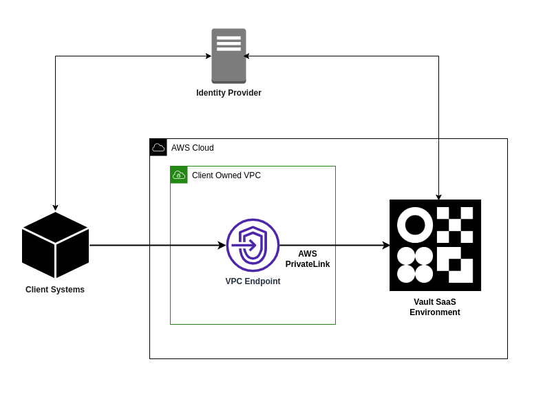
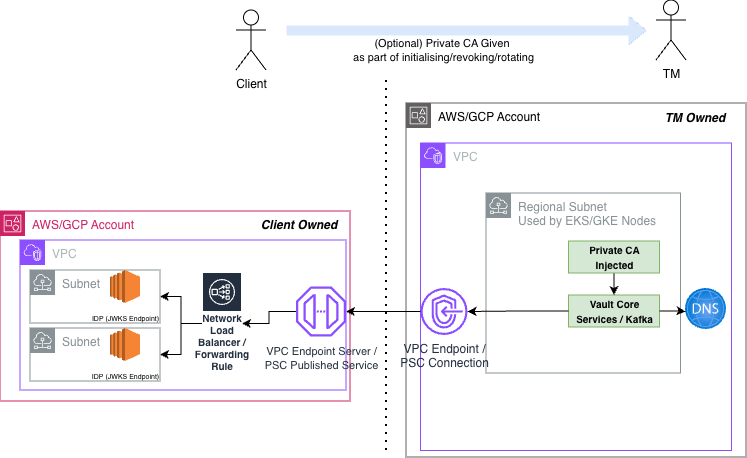
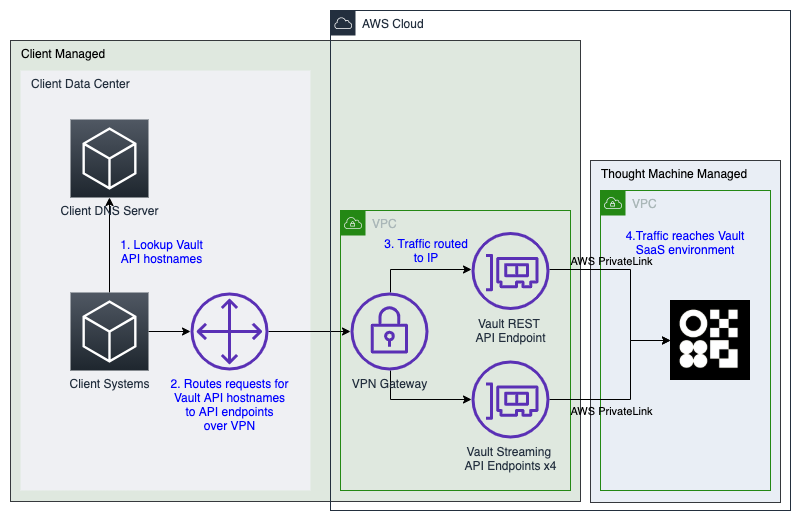
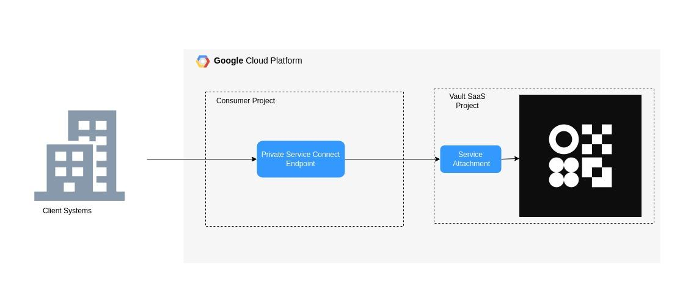
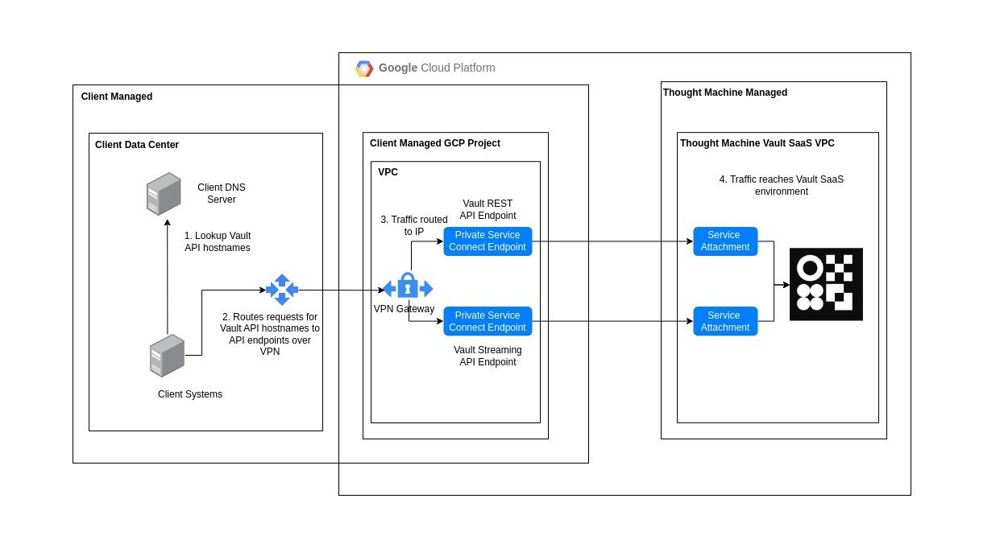

# Vault Core SaaS Onboarding Guide

Learn about the SaaS hosting model of Vault Core and our onboarding process, including how to request and connect to a Vault Core SaaS environment. You can also use this guide for onboarding to [Vault Payments](/vault-payments/latest/EN/) and [Vault Bridge](/additional-product-offerings/latest/EN/vault-bridge).

You will find checklists to help you prepare for going live into production and post-production activities, and information about the resources available to you at every stage.

## [](#overview_of_onboarding_and_environments_in_vault_core_saas "Copy link to heading")Overview of onboarding and environments in Vault Core SaaS

This guide is aimed at Vault SaaS clients to enable their onboarding into their first SaaS environment. Thought Machine ("we") provides it to clients before onboarding starts.

It explains what information that the client ("you") need to provide in order for Thought Machine ("us") to set up their ("your") environments and what to expect from the experience.

### [](#definition_of_onboarding "Copy link to heading")Definition of Onboarding

Onboarding starts when a client signs the SaaS agreement and completes when a client starts to use their Production environment. During this time, you are introduced to your Thought Machine representative who will support your onboarding and discuss any training with you.

### [](#terms_we_use "Copy link to heading")Terms we use

We use a number of key terms, abbreviations and terminology in this *Vault Core SaaS Onboarding Guide*, onboarding request forms, and other documentation. These include ACS, HTTPS, IdP, SAML, SLO, SP, and SSO (this list is not exhaustive).

For a description of these terms in the context of Vault Core SaaS, see [Glossary of Terms](/vault-core/5-9/EN/environment_and_installation/saas/introduction_to_vault_saas/vault_saas_onboarding_guide#glossary_of_terms).

### [](#environments "Copy link to heading")Environments

We will create two environments as part of Thought Machine’s standard offering. This starts with Pre-production once you sign your SaaS agreement, and Production once you establish connectivity with Pre-production and completes the necessary steps. You can find details of your environment provisioning in your service agreement.

 
| Environment | Description |
| --- | --- |
| 
Pre-production

 | 

Non-production. Supports verification of changes and user acceptance testing before deployment to Production.

 |
| 

Production

 | 

Production. Serves live traffic and provides services to you and your customers.

 |

## [](#onboarding_details "Copy link to heading")Onboarding details

In the final stages of the sales process, you will be assigned a Thought Machine representative who will support your onboarding. After you have signed the initial SaaS agreement form and it has been reviewed and approved, your Thought Machine representative will send you the relevant forms to complete:

-   *Vault Core Environment Configuration Request*
    
-   *Vault Core Kafka Authentication Request*
    
-   *Vault Bridge Configuration Request* (if you are onboarding to [Vault Bridge](/additional-product-offerings/latest/EN/vault-bridge))
    
-   *Vault Payments Configuration Request* (if you are onboarding to [Vault Payments](/vault-payments/latest/EN/))
    

Once you have completed and submitted the relevant forms, Thought Machine validates these and uses your details to provision the requested environments.

If you require assistance during the process of completing the above onboarding forms, or have any questions about the information required, raise an Advice Ticket via the link we send you, where we will be able to provide more help.

chat\_bubble

If you are onboarding to Vault Core SaaS only, authentication via Kafka OAuth is optional and not required. However, if you are additionally onboarding to [Vault Payments](/vault-payments/latest/EN/) and/or [Vault Bridge](/additional-product-offerings/latest/EN/vault-bridge), OAuth is required across all environments, and you need to provide your OAuth details in the forms.

### [](#onboarding_process_overview "Copy link to heading")Onboarding process overview

#### [](#1_onboarding_to_the_pre_production_environment "Copy link to heading")1\. Onboarding to the Pre-production environment

You will:

1.  Meet your assigned Thought Machine representative during the final stages of the sales process. They will support your onboarding and provide you links to the onboarding request forms relevant to the product offerings you have signed up to (*Vault Core Environment Configuration Request*, *Vault Core Kafka Authentication Request*, *Vault Bridge Configuration Request*, *Vault Payments Configuration Request*).
    
2.  Sign the SaaS agreement.
    
3.  Complete and submit the relevant onboarding request forms. Thought Machine then validates the forms and uses your details to set up and configure your Vault SaaS environment(s). You will then receive your Client Environment Details, which you use to connect to your Vault SaaS environment - see [Environment details guide](/vault-core/5-9/EN/environment_and_installation/saas/introduction_to_vault_saas/environment_details_guide).
    
4.  [Connect to your Vault Core SaaS environment](/vault-core/5-9/EN/environment_and_installation/saas/introduction_to_vault_saas/vault_saas_onboarding_guide#connect_to_vault_core_saas). During the configuration process, Thought Machine will confirm that you have successfully onboarded to your SaaS environment. Your Thought Machine representative can provide help if you have trouble connecting to the environment.
    
5.  Participate in [post-onboarding activities](/vault-core/5-9/EN/environment_and_installation/saas/introduction_to_vault_saas/vault_saas_onboarding_guide#post_onboarding_steps_for_your_environments), including access to the Service Desk and documentation portal, and learning and training from the Service Management and Client Enablement teams.
    

#### [](#2_onboarding_to_the_production_environment "Copy link to heading")2\. Onboarding to the Production environment

You will:

1.  Discuss when you are ready for Production with your Thought Machine representative. You will cover checklists for [Pre-production Go Live](/vault-core/5-9/EN/environment_and_installation/saas/introduction_to_vault_saas/vault_saas_onboarding_guide#vault_saas_client_pre_production_go_live_checklist), [Pre-production activities](/vault-core/5-9/EN/environment_and_installation/saas/introduction_to_vault_saas/vault_saas_onboarding_guide#pre_production_activities_vault_configuration_layer_and_testing) and [Vault Launch Readiness](/vault-core/5-9/EN/environment_and_installation/saas/introduction_to_vault_saas/vault_saas_onboarding_guide#pre_production_activities_vault_core_launch_readiness).
    
2.  Follow the steps to obtain and onboard to a new environment:
    
    1.  Complete and submit the relevant onboarding request forms - Thought Machine then validates the forms and uses your details to set up and configure your Vault SaaS environment(s).
        
    2.  Receive your environment details from Thought Machine - see [Environment details guide](/vault-core/5-9/EN/environment_and_installation/saas/introduction_to_vault_saas/environment_details_guide).
        
    3.  Use your environment details to [connect to your Vault Core SaaS environment](/vault-core/5-9/EN/environment_and_installation/saas/introduction_to_vault_saas/vault_saas_onboarding_guide#connect_to_vault_core_saas).
        
    
3.  Complete any [post-onboarding activities](/vault-core/5-9/EN/environment_and_installation/saas/introduction_to_vault_saas/vault_saas_onboarding_guide#post_onboarding_steps_for_your_environments), refer to your documentation, and remain in contact with your Thought Machine representative.
    

chat\_bubble

Your Thought Machine representative will confirm the expected time period for provisioning your environment.

### [](#resources_to_assist_your_onboarding "Copy link to heading")Resources to assist your onboarding

Refer to the following resources each time you onboard to a new environment. If you still require assistance, contact your Thought Machine representative.

-   Completing the onboarding request forms: Your Thought Machine representative will provide links to the required forms, and a link to raise an Advice Ticket if you have questions or need help completing the forms.
    
-   [Setting up and configuring Vault Core with a SAML IdP](/vault-core/5-9/EN/environment_and_installation/infrastructure_docs/setting_up_and_configuring_vault_with_a_saml_idp): This guide explains how to set up and configure Vault Core with a SAML IdP to allow authorised access to Vault Core’s Operations Dashboard and Core Apps. Refer to it on our for help with completing the details for Operations Dashboard SAML configuration in the Vault Core Environment Configuration Request form.
    
-   [Overview of onboarding and environments in Vault Core SaaS](/vault-core/5-9/EN/environment_and_installation/saas/introduction_to_vault_saas/vault_saas_onboarding_guide#overview_of_onboarding_and_environments_in_vault_core_saas): For more information about the different environments.
    
-   [Environment details quick start](/vault-core/5-9/EN/environment_and_installation/saas/introduction_to_vault_saas/environment_details_guide): All the guidance and the information you need to use your unique client environment details (as provided to you by Thought Machine) to connect to your SaaS environment.
    
-   [Connect to Vault Core SaaS](/vault-core/5-9/EN/environment_and_installation/saas/introduction_to_vault_saas/vault_saas_onboarding_guide#connect_to_vault_core_saas): Guidance to help you validate connectivity to your SaaS environment.
    
-   [Vault Bridge integrations](/additional-product-offerings/latest/EN/vault-bridge/concepts/integrations): Information on Vault Bridge integrations if you have any special requirements for onboarding.
    
-   [Vault Payments OIDC](/vault-payments/latest/EN/app/authentication#oidc): This page provides information on how Vault Payments works alongside OIDC (OpenID Connect) authentication protocol to authenticate users when logging into Vault Payment Apps.
    
-   [Vault Payments User Access Management](/vault-payments/latest/EN/app/user_access_management): This guide explains the Vault Payments access control model for the Vault Payments App.
    

## [](#completing_the_onboarding_request_forms "Copy link to heading")Completing the onboarding request forms

At the start of the onboarding process, you are required to complete all necessary forms - your Thought Machine representative will send you the ones relevant to your setup:

-   *Vault Core Environment Configuration Request*
    
-   *Vault Core Kafka Authentication Request*
    
-   *Vault Bridge Configuration Request* (if you are onboarding to [Vault Bridge](/additional-product-offerings/latest/EN/vault-bridge))
    
-   *Vault Payments Configuration Request* (if you are onboarding to [Vault Payments](/vault-payments/latest/EN/))
    

You must complete a Vault Core Environment Configuration Request and a Vault Core Kafka Authentication Request form for each environment you want to create - for example, if you want a pre-production and production environment, you need to complete an environment configuration and Kafka authentication form for each environment.

If you are taking [Vault Bridge](/additional-product-offerings/latest/EN/vault-bridge) as an additional offering, you are also required to fill out a Vault Bridge Configuration Request form for every environment you want to provision.

If you are taking [Vault Payments](/vault-payments/latest/EN/) as an additional offering, you will also need to complete a Vault Payments Configuration Request form for every environment you want to provision.

chat\_bubble

For clarification on some of the terminology that we use in this guide and in the forms you receive, refer to our [Glossary of Terms](/vault-core/5-9/EN/environment_and_installation/saas/introduction_to_vault_saas/vault_saas_onboarding_guide#glossary_of_terms).

info

If you are onboarding to Vault Core SaaS only, OAuth authentication is optional (although recommended). If you choose to not complete the fields in either the Vault Core Environment Configuration Request or the Kafka Authentication Request form, the OAuth configuration will be disabled as a result. For Vault Core SaaS, this means using Service Accounts for authentication, which is deprecated.

However, if you are onboarding to Vault Payments and/or Vault Bridge in addition to Vault Core, you are required to configure OAuth authentication across all environments. You must therefore complete the fields required for OAuth authentication.

Once you have completed the required forms for creating a new environment, Thought Machine will validate the form details and provision your Vault SaaS environment accordingly. This involves creating an environment to successfully install and host Vault SaaS, then adding the details you provided for particular configurations, such as Kafka and SAML.

Your Thought Machine representative will confirm the expected time period for provisioning your environment and help you with any queries.

## [](#connect_to_vault_core_saas "Copy link to heading")Connect to Vault Core SaaS

### [](#connect_to_vault_core_saas_on_aws "Copy link to heading")Connect to Vault Core SaaS on AWS

You must establish the connection to your Vault Core SaaS environment from your Amazon Web Services (AWS) VPC using AWS PrivateLink and VPC Endpoints. You can see a high-level example of this in the diagram, *Connecting to Vault Core SaaS from your AWS VPC*. These connections are private (they do not run over the public internet).

To connect to your environment, see:

-   [Steps to connect to Vault Core SaaS on AWS](/vault-core/5-9/EN/environment_and_installation/saas/introduction_to_vault_saas/vault_saas_onboarding_guide#steps_to_connect_to_vault_core_saas_for_aws)
    
-   [Testing connectivity for AWS](/vault-core/5-9/EN/environment_and_installation/saas/introduction_to_vault_saas/vault_saas_onboarding_guide#testing_connectivity_for_aws)
    
-   [Example configuration for AWS](/vault-core/5-9/EN/environment_and_installation/saas/introduction_to_vault_saas/vault_saas_onboarding_guide#example_configuration_for_aws)
    

#### [](#diagram_connecting_to_vault_core_saas_from_your_aws_vpc "Copy link to heading")Diagram: Connecting to Vault Core SaaS from your AWS VPC



#### [](#steps_to_connect_to_vault_core_saas_for_aws "Copy link to heading")Steps to connect to Vault Core SaaS for AWS

Thought Machine provides you with the environment details that you need to connect to Vault Core SaaS which you must use in conjunction with the [Environment details guide](/vault-core/5-9/EN/environment_and_installation/saas/introduction_to_vault_saas/environment_details_guide).

1.  [Complete the onboarding request forms](/vault-core/5-9/EN/environment_and_installation/saas/introduction_to_vault_saas/vault_saas_onboarding_guide#completing_the_onboarding_request_forms), which you receive at the start of the onboarding process.
    
2.  Configure SAML IdP for integrating with Operations Dashboard and Core Apps.
    
    You can find further details on how to configure a SAML identity provider (IdP) to work with Vault Core SaaS in [Setting up and Configuring Vault with a SAML IdP](/vault-core/5-9/EN/environment_and_installation/infrastructure_docs/setting_up_and_configuring_vault_with_a_saml_idp).
    
3.  Configure Vault Core and/or Kafka OAuth - this only applies to you if you have chosen to enable Vault Core and/or Kafka OAuth (recommended).
    
    Vault Core SaaS supports OAuth configuration for both Vault Core and Kafka. This configuration is optional and Thought Machine offers you the choice to enable OAuth when discussing requirements and completing the Vault Core Environment Configuration Request and Vault Core Kafka Authentication Request forms.
    
    -   If you did not choose to use OAuth configuration for Vault Core and Kafka, move to the next step.
        
    -   If you did choose to enable it, you must supply and configure the OAuth 2.0/OIDC (OpenID Connect) Authorisation Server or Identity Provider (IdP) to use the Client Credentials authorisation flow. For more information about how to configure it, see [Kafka OAuth overview](/vault-core/5-9/EN/environment_and_installation/saas/streaming/kafka_auth_technical_overview).
        
    -   If your OAuth JWKS endpoint is not publicly accessible you are required to provision a VPC Endpoint Service if on AWS and Private Service Connect if on GCP and pass the Endpoint information as per Kafka Authentication Request form to Thought Machine to establish a connection to. If your JWKS endpoint is using a private CA, the CA should be shared with Thought Machine as part of onboarding (also part of the request form mentioned).
        
        The flow of connection is as follows:
        
        
        
        chat\_bubble
        
        When using a privately accessible JWKS endpoint, it is your responsibility to ensure that this endpoint is always available, with no downtime. Given there are no security implications for opting to use a privately accessible JWKS endpoint it is recommended to avoid this option when possible to reduce complexity.
        
    
4.  Create subnets in each availability zone for the VPC Endpoints.
    
    You must [create a subnet for the VPC according to the AWS documentation](https://docs.aws.amazon.com/vpc/latest/userguide/configure-subnets.html) for each availability zone within the region. The subnets are for the VPC endpoints to ensure they can connect to the VPC Endpoint services in the Thought Machine AWS account.
    
5.  Create VPC Endpoints
    
    You must create a VPC endpoint in your VPC for each of the service names. For the Vault Core REST APIs, this requires one service name. For the Streaming API, this requires four service names for Vault Core versions earlier than 5.0, or one service name for Vault Core versions 5.0+.
    
    Each VPC endpoint states the availability zone IDs. For most regions, these availability zones are the same as most only have three zones. However, some regions have more than three and the AZ IDs are different for different VPC endpoints. For example, `us-east-1` has six availability zones. Create the VPC endpoints using the subnets in these availability zones. You agree a host region with Thought Machine during the contract agreement process. For a guide, see the [AWS PrivateLink documentation](https://docs.aws.amazon.com/vpc/latest/privatelink/privatelink-access-saas.html).
    
6.  Configure DNS.
    
    In your environment details information, Thought Machine provides you with a list of hostnames that should resolve to the VPC endpoint IP addresses you have created. Thought Machine provides you with the environment details that you need to connect to Vault Core SaaS which you must use in conjunction with the [Environment details guide](/vault-core/5-9/EN/environment_and_installation/saas/introduction_to_vault_saas/environment_details_guide). You should create DNS records for these hostnames in the DNS system.
    
7.  Set up network connectivity.
    
    You must configure your network to allow systems and users to connect to the VPC endpoints. How you achieve this depends on your existing infrastructure. For example, you can use AWS Direct Connect to connect your on-premise systems to the AWS VPC containing the VPC endpoints. You are responsible for all connectivity configuration and setup within your infrastructure.
    

#### [](#testing_connectivity_for_aws "Copy link to heading")Testing connectivity for AWS

1.  Check the status of VPC endpoints.
    
    All VPC endpoints should have the status of "available" in the AWS console. This indicates that they have successfully connected to the Vault Core SaaS environment. If the status of the services is not "available", verify the configuration of the endpoints.
    
2.  Check connectivity to the Vault Core REST APIs using the Operations Dashboard.
    
    Confirm that you can connect to the Operations Dashboard and see the login page by accessing the Operations Dashboard URL from a browser. If you have configured SAML IdP, confirm that you can log into the Operations Dashboard using a configured user. Determine your unique URL using your environment details and the [Environment details guide](/vault-core/5-9/EN/environment_and_installation/saas/introduction_to_vault_saas/environment_details_guide).
    
    Example URL (you must replace `$<…​.>` with a string value):
    
    ```
    https://ops.$<client\_codename>.$<environment>.saas.tmachine.io
    ```
    
    chat\_bubble
    
    For more information about the Operations Dashboard and other Apps, see the [Apps](/vault-core/5-9/EN/reference/core_apps_and_operations_dashboard) documentation.
    
3.  Check connectivity to the Vault Core Streaming API.
    
    Confirm that you can connect to the Vault Core Streaming API. The way that you decide to test this depends on your infrastructure and system configuration. One option is to use a tool such as Kafkacat to list the topics available; this example Kafkacat command would achieve this:
    
    ```
    $ kafkacat -L -X security.protocol=ssl -b kafka.kafka-v2.$<client\_codename>.$<environment>.saas.tmachine.io
    ```
    

#### [](#example_configuration_for_aws "Copy link to heading")Example configuration for AWS

In this example, a client has set up a VPN connection between their on-premise systems and the VPC containing the Vault Core API endpoints. They have set up DNS records for each of the hostnames provided to them that resolve to the relevant VPC endpoint IP address.

Explanation of the process flow:

1.  Lookup Vault Core API hostnames.
    
    1.  The Client System looks up `[https://ops.example.preprod.saas.tmachine.io](https://ops.example.preprod.saas.tmachine.io)` in the Client DNS Server.
        
    2.  The Client DNS Server returns the IP address of the Vault Core REST API VPC endpoint. This confirms that the Client System sends traffic to that IP address (returned in step 1b).
        
    
2.  Client routes API request over VPN - the Client’s network routes traffic to that IP address (returned in step 1b) to the AWS VPC network over a VPN connection.
    
3.  Client routes traffic to IP - the Client’s network routes the traffic arriving in the VPC network to the Vault Core REST API endpoint at that IP address (returned in step 1b).
    

The traffic reaches the Vault Core REST API service through the AWS PrivateLink Private network.

See the AWS information for guidance on [VPC connectivity options](https://docs.aws.amazon.com/whitepapers/latest/aws-vpc-connectivity-options/network-to-amazon-vpc-connectivity-options.html), [connectivity](https://aws.amazon.com/solutions/guidance/network-connectivity-on-aws/) and [patterns](https://docs.aws.amazon.com/prescriptive-guidance/latest/patterns/networking-pattern-list.html).



### [](#connect_to_vault_core_saas_on_gcp "Copy link to heading")Connect to Vault Core SaaS on GCP

You must establish the connection to your Vault Core SaaS environment from your Google Cloud Platform (GCP) virtual private network using the GCP Private Service Connect endpoints. You can see a high-level example of the following diagram. These connections are private (they do not run over the public internet).

To connect to your environment, see:

-   [Steps to connect to Vault Core SaaS to GCP](/vault-core/5-9/EN/environment_and_installation/saas/introduction_to_vault_saas/vault_saas_onboarding_guide#steps_to_connect_to_vault_core_saas_for_gcp)
    
-   [Testing connectivity for GCP](/vault-core/5-9/EN/environment_and_installation/saas/introduction_to_vault_saas/vault_saas_onboarding_guide#testing_connectivity_for_gcps)
    
-   [Example configuration for GCP](/vault-core/5-9/EN/environment_and_installation/saas/introduction_to_vault_saas/vault_saas_onboarding_guide#example_configuration_for_gcp)
    

#### [](#diagram_connecting_to_vault_core_saas_from_your_gcp_virtual_private_network "Copy link to heading")Diagram: Connecting to Vault Core SaaS from your GCP virtual private network



#### [](#steps_to_connect_to_vault_core_saas_for_gcp "Copy link to heading")Steps to connect to Vault Core SaaS for GCP

Thought Machine provides you with the environment details that you need to connect to Vault Core SaaS which you must use in conjunction with the [Environment details guide](/vault-core/5-9/EN/environment_and_installation/saas/introduction_to_vault_saas/environment_details_guide).

1.  [Complete the onboarding request forms](/vault-core/5-9/EN/environment_and_installation/saas/introduction_to_vault_saas/vault_saas_onboarding_guide#completing_the_onboarding_request_forms), which you receive at the start of the onboarding process.
    
2.  Configure SAML IdP for integrating with Operations Dashboard and Core Apps.
    
    You can find further details on how to configure a SAML identity provider (IdP) to work with Vault Core SaaS in [Setting up and Configuring Vault with a SAML IdP](/vault-core/5-9/EN/environment_and_installation/infrastructure_docs/setting_up_and_configuring_vault_with_a_saml_idp).
    
3.  Configure Kafka OAuth.
    
    Vault Core SaaS supports Kafka OAuth. This configuration is optional - if you want to enable Kafka OAuth, you must fill out the relevant fields in the Vault Core Environment Configuration Request and Kafka Authentication Request forms.
    
    -   If you did not choose to use Kafka OAuth, move to the next step.
        
    -   If you did choose to enable it, you must supply and configure the OAuth 2.0/OIDC (OpenID Connect) Authorisation Server or Identity Provider (IdP) to use the Client Credentials authorisation flow. For more information about how to configure it, see [Kafka OAuth overview](/vault-core/5-9/EN/environment_and_installation/saas/streaming/kafka_auth_technical_overview).
        
    
4.  Create subnets for each region for the Private Service Connect endpoints.
    
    You need to create a subnet for the Virtual Private Cloud (VPC) network for each zone in each region and enable Private Google Access. These subnets are for the Private Service Connect endpoints to ensure that they can connect to the endpoint services in the Thought Machine GCP Project.
    
5.  Create Private Service Connect endpoints in your GCP Project.
    
    You must create a Private Service Connect endpoint in your VPC for each of the service names, with one service name for the Vault Core REST APIs and four service names for the Streaming API.
    
    Each endpoint states three zone IDs. For most regions, these zones are the same as most only have three zones. However, some regions have more than three and the IDs are different for different VPC endpoints. For example, us-east1 has three zones and the IDs do not follow a naming convention of a, b, c, but b, c, d instead (`us-east1b`, `us-east1c`, `us-east1d`). Create the VPC endpoints using the subnets created in these zones. You agree a host region with Thought Machine during the contract agreement process. For a guide, see the [GCP documentation](https://cloud.google.com/vpc/docs/configure-private-service-connect-services)
    
6.  Set up network connectivity.
    
    You must configure your network to allow systems and users to connect to the endpoints. How you achieve this depends on your existing infrastructure. GCP offers several options as it covers in its [private access documentation](https://cloud.google.com/vpc/docs/private-access-options), including using GCP Hybrid Connectivity to connect on-premise systems to the GCP private network containing the endpoints. You are responsible for all connectivity configuration and setup within your infrastructure. Consult your cloud network engineer for advice.
    
7.  Configure DNS.
    
    In your environment details information, you are provided with a list of hostnames that should resolve to the Private Service Connect endpoint IP addresses you have created. Thought Machine provides you with the environment details that you need to connect to Vault Core SaaS which you must use in conjunction with the [Environment details guide](/vault-core/5-9/EN/environment_and_installation/saas/introduction_to_vault_saas/environment_details_guide). You should create DNS records for these hostnames in the DNS system.
    

#### [](#testing_connectivity_for_gcp "Copy link to heading")Testing connectivity for GCP

1.  Check the status of Private Service Connect.
    
    All VPC services should have the status "Approved" in the GCP console. This indicates that they have successfully connected to the Vault Core SaaS environment. If the status of the services is not available, verify the configuration of the endpoints.
    
2.  Check connectivity to the Vault Core REST APIs using the Operations Dashboard.
    
    Confirm that you can connect to the Operations Dashboard and see the login page by accessing the Operations Dashboard URL from a browser. If you have configured SAML IdP, confirm that you can log into the Operations Dashboard using a configured user. Determine your unique URL using your environment details and the [Environment details guide](/vault-core/5-9/EN/environment_and_installation/saas/introduction_to_vault_saas/environment_details_guide).
    
    Example URL (you must replace `$<…​.>` with a string value):
    
    ```
    https://ops.$<client\_codename>.$<environment>.saas.tmachine.io
    ```
    
    chat\_bubble
    
    For more information about Operations Dashboard and other Apps, see the [Apps](/vault-core/5-9/EN/reference/core_apps_and_operations_dashboard) documentation.
    
3.  Check connectivity to the Vault Core Streaming API.
    
4.  Confirm that you can connect to the Vault Core Streaming API. The way that you decide to test this depends on your infrastructure and system configuration. One option is to use a tool like Kafkacat to list the topics available. The following example Kafkacat command would achieve this:
    
    ```
    $ kafkacat -L -X security.protocol=ssl -b kafka.kafka-v2.$<client\_codename>.$<environment>.saas.tmachine.io
    ```
    

#### [](#example_configuration_for_gcp "Copy link to heading")Example configuration for GCP

In this example, a client has set up a VPN connection between their on-premise systems and the VPC containing the Vault Core API endpoints. They have set up DNS records for each of the hostnames provided to them that resolve to the relevant VPC endpoint IP address.

Explanation of the process flow:

1.  Lookup Vault Core API hostnames.
    
    1.  The Client System looks up `[https://ops.example.preprod.saas.tmachine.io](https://ops.example.preprod.saas.tmachine.io)` in the Client DNS Server.
        
    2.  The Client DNS Server returns the IP address of the Vault Core REST API VPC endpoint. This confirms that the Client System sends traffic to that IP address (returned in step 1b).
        
    
2.  Client routes API request over VPN - the Client’s network routes traffic to that IP address (returned in step 1b) to the GCP VPC network over a VPN connection.
    
3.  Client routes traffic to IP - the Client’s network routes the traffic arriving in the VPC network to the Vault Core REST API endpoint at that IP address (returned in step 1b).
    
4.  The traffic reaches the Vault Core REST API service through the GCP Private Service Connect endpoint.
    



## [](#post_onboarding_steps_for_your_environments "Copy link to heading")Post-onboarding steps for your environments

### [](#considerations_before_you_launch_into_production "Copy link to heading")Considerations before you launch into production

Complete the activities listed in the [Vault Core SaaS client pre-production go-live checklist](/vault-core/5-9/EN/environment_and_installation/saas/introduction_to_vault_saas/vault_saas_onboarding_guide#vault_saas_client_pre_production_go_live_checklist). You will address some activities during implementation, while others require you to have a Production environment before you can complete them. These activities include:

-   Integration with other systems
    
-   Dead Letter Queue (DLQ) monitoring
    
-   Failure topic monitoring
    
-   Reconciliation
    
-   Reporting
    
-   Compliance
    
-   Training
    

Contact your Client Success Manager if you have any queries about or intend to conduct any testing. They will provide you with the necessary advice before you start.

### [](#considerations_after_you_launch_into_production "Copy link to heading")Considerations after you launch into production

Inform us of any high volume events before they are due to occur. This enables Thought Machine to ensure that your SaaS environment is optimised to support these events. Contact the Thought Machine Support and Operations teams.

### [](#service_procedure_manual "Copy link to heading")Service Procedure Manual

As part of your onboarding, Thought Machine assigns you a Client Success Manager. They act as your Thought Machine representative, and they will explain the following aspects of our service management and work with you to complete the Service Procedure Manual prior to production go-live:

-   Service Management procedure
    
-   Incident management
    
-   Break glass procedure
    
-   Release management
    
-   Reporting
    
-   Disaster recovery
    

### [](#further_learning "Copy link to heading")Further learning

Once you sign your SaaS agreement, you will receive training from the Client Enablement team.

## [](#glossary_of_terms "Copy link to heading")Glossary of Terms

We use the following key terms, abbreviations, and terminology in this Vault Core SaaS Onboarding Guide, onboarding forms, and other documentation.

 
| *Term* | *Description* |
| --- | --- |
| 
ACS

 | 

Assertion Consumer Service. The ACS URL directs your IdP where to send its SAML Response after authenticating a user when connecting to Thought Machine’s Operations Dashboard.

 |
| 

HTTPS

 | 

Hypertext Transfer Protocol Secure. It is used for secure communication over a computer network.

 |
| 

IdP

 | 

Identity Provider. A service that stores and verifies user identity. Details of your IdP are required for SAML authentication for user access to Operations Dashboard.

 |
| 

SAML

 | 

Security Assertion Markup Language. An open standard that allows identity providers to pass authorisation credentials to service providers. This allows the use of one set of credentials to log into many different websites. In this case, Operations Dashboard.

 |
| 

SLO

 | 

Single Log-Out. A feature of SAML that allows the end user to logout from a single session and automatically end all related sessions that were established during SSO by performing a single log-out action. In this case, logging out of the Operations Dashboard.

 |
| 

SP

 | 

Service Provider. In the context of SAML, the Service Provider of an application requires the authentication information, such as a token, that verifies the identity of a user from the SAML Identity Provider in order to grant authorisation to the end user. For example, to grant access to the Operations Dashboard.

 |
| 

SSO

 | 

Single Sign On. A feature of SAML that allows the end user to establish a session with an application and any related optional or mandatory sessions by performing a single sign-on action. In this case, to use the Operations Dashboard.

 |

## [](#vault_saas_client_pre_production_go_live_checklist "Copy link to heading")Vault SaaS client pre-production go-live checklist

This checklist is for you to complete and provide with your written notice to your Thought Machine representative a minimum of 10 days ahead of the go-live date for your Vault Core SaaS production environment. If you do not do this, you may not be entitled to Production level support. You should use this checklist alongside your own company processes and controls.

 
| Item to complete: | Details: |
| --- | --- |
| 
*Thought Machine Vault Core SaaS client name:*

 |  |
| 

*Completed by:*

 |  |
| 

*Date:*

 |  |

  
| Area | Description | Completed? |
| --- | --- | --- |
| 
Environments

 | 

Confirm connectivity to Pre-production and Production SaaS Environments.

 |  |
| 

Service Management Procedure

 | 

Complete and sign off the Service Procedures Manual, covering SLAs, governance arrangements, key contacts and escalation procedures.

 |  |
| 

Service Management Portal

 | 

Ensure that all required support users have access to the Service Management Portal and understand how to raise incidents.

 |  |
| 

Client Service Management Processes

 | 

Establish internal level 1 and 2 support with 24/7 coverage and associated processes.

 |  |
| 

DLQ and failure topic monitoring

 | 

Set up monitoring for bad requests or requests where key fields are missing for the relevant API dead letter queues (DLQs) and failure topics. Read about DLQs in the [Dead Letter Queues](/vault-core/5-9/EN/reference/dlq) section.

 |  |
| 

Schedule Jobs monitoring

 | 

Set up monitoring to check the progress and health of all Schedule Jobs and identify any errored jobs, either via the [Vault Jobs](/vault-core/latest/EN/apps/vault_jobs) web application or by querying the relevant Vault Core [API](/vault-core/5-9/EN/environment_and_installation/saas/observability_and_api_monitoring/api) endpoints.

 |  |
| 

Vault Audit Log archive

 | 

Set up archiving of Vault Audit Logs to retain information about all changes made to any Vault Core resources. Vault Audit Logs information is only retained in Vault Core for 7 days.

 |  |
| 

Vault API Monitoring (optional)

 | 

Configure availability and latency monitoring on the Vault Core APIs as described in the [Vault API Monitoring Guide](/vault-core/5-9/EN/environment_and_installation/saas/observability_and_api_monitoring/api).

 |  |

## [](#pre_production_activities_vault_configuration_layer_and_testing "Copy link to heading")Pre-production activities: Vault Configuration Layer and testing

Vault Core SaaS clients are fully responsible for setup and maintenance of the Vault Core configuration:

  
| Area | Description | Completed? |
| --- | --- | --- |
| 
CI/CD Pipeline

 | 

Establish a CI/CD pipeline for configuration layer code, including automated tests.

 |  |
| 

Configuration Layer deployment processes

 | 

Establish processes and controls for managing version and parameter changes to Smart Contracts and managing account migrations from one version of a Smart Contract to another.

 |  |
| 

Configuration Layer setup

 | 

Ensure that the Configuration Layer is properly migrated over to the production environment (Smart Contracts and internal accounts).

 |  |
| 

Integration with other systems

 | 

Establish connectivity with external systems to Vault Core Kafka topics to enable the use of Vault Core data in systems.

 |  |
| 

Reconciliations and reporting

 | 

Set up a data repository and implement requirements for reconciliations and reporting.

 |  |
| 

Configuration Layer testing

 | 

Complete unit testing to verify contract code correctness and complete simulation testing to verify correctness of financial behaviour and business logic.See also:- Smart Contract Simulation Endpoint- Smart Contract tester

 |  |
| 

Integration testing

 | 

Complete functional and non-functional tests to verify integration correctness with APIs.

 |  |
| 

System standby

 | 

Test that interfacing systems can enter and exit standby mode in the event of Vault Core downtime.

 |  |

## [](#pre_production_activities_vault_core_launch_readiness "Copy link to heading")Pre-production activities: Vault Core Launch Readiness

Thought Machine recommends that Vault Core SaaS clients undertake these launch preparation activities prior to going live with their Production environment.

  
| Area | Description | Completed? |
| --- | --- | --- |
| 
Escrow

 | 

Confirm Escrow requirements and put in place the necessary arrangements.

 |  |
| 

Regulatory compliance

 | 

Confirm that you meet all legal and regulatory obligations. This includes:- Banking products- Processes and reporting- SaaS infrastructure

 |  |
| 

User training

 | 

Provide training to users within support and operations functions about new processes and systems.

 |  |
| 

Vault Core user access

 | 

Set up Vault Core access and permissions for support and operations users (according to your requirements).

 |  |
| 

Launch strategy

 | 

Ensure that you have defined and communicated your approach to launching with Vault Core, including roll-out phases, criteria for moving to the next phase and any pre-launch testing of the strategy.

 |  |
| 

Launch governance agreements

 | 

Establish governance agreements internally and with Thought Machine to ensure that all risks, issues and information is shared effectively during the launch period and the required business approvals are taken.

 |  |
| 

Operational acceptance

 | 

Agree that the solution, processes, procedures and users are ready for production.

 |  |