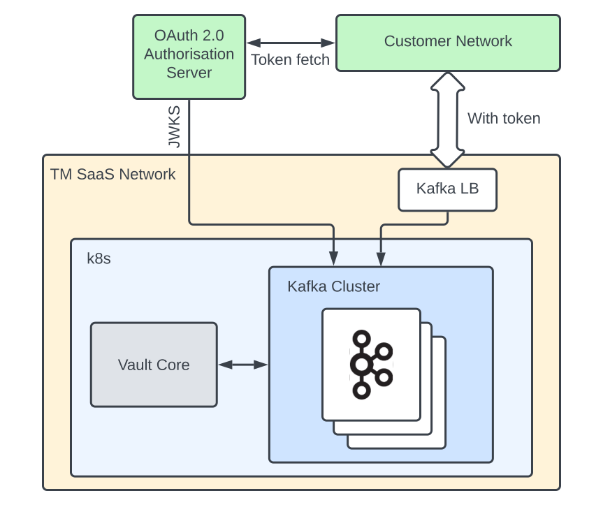

# Kafka Auth overview

SaaS

In order to access public Vault Core Kafka topics and groups in the Thought Machine network from an external network, you can enable external Kafka client authentication and correctly authenticate with Kafka. While Thought Machine does not require Kafka Auth configuration, it does recommend it.

Here, we explain which tasks are necessary to facilitate external Kafka client authentication through the use of SASL/OAUTHBEARER, OAuth 2.0 and the Client Credentials authorisation flow in Thought Machine SaaS environments.

error

Before configuring and connecting to your Vault Core environment for the first time, you must configure Kafka OAuth before you configure the Kafka Endpoint services. Thought Machine recommends configuring Kafka Auth after configuring your SAML IdP in these guides.

## [](#about_this_guide "Copy link to heading")About this guide

This overview is suitable for technical users, including clients, engineers and product specialists, with an in-depth knowledge and understanding of Kafka and OAuth 2.0, and a good understanding of Thought Machine’s SaaS offering.

## [](#architectural_overview_of_kafka_auth_in_vault_saas "Copy link to heading")Architectural overview of Kafka Auth in Vault SaaS

In order to access public Vault Core Kafka topics and groups (Thought Machine network) from an external network, you can authenticate with Kafka brokers using OAuth 2.0.

You will need to provide and setup an OAuth 2.0 Authorisation Server to fetch tokens and authenticate with Kafka using the Client Credentials flow.

Here, we describe the components that Kafka Auth requires from the client and Thought Machine.

### [](#architecture_overview_diagram "Copy link to heading")Architecture overview diagram

Client components:

-   Customer Network
    
-   OAuth 2.0 Authorisation Server
    
-   JWKS endpoint (JSON Web Key Set endpoint)
    

Thought Machine components:

-   TM SaaS Network
    
-   Kafka LB (Load Balancer)
    
-   k8s (Kubernetes)
    
-   Vault Core
    
-   Kafka Cluster
    



## [](#oauth_server_token_and_access_control_requirements_or_vault_core_saas_with_kafka_auth "Copy link to heading")OAuth server, token and access control requirements or Vault Core SaaS with Kafka Auth

### [](#oauth_2_0oidc_authorisation_server_requirements "Copy link to heading")OAuth 2.0/OIDC Authorisation Server requirements

The OAuth 2.0/OIDC (OpenID Connect) Authorisation Server or Identity Provider (IdP) is required for Kafka external client authentication to the Stream API. It serves signed JSON Web Tokens (JWTs) that Kafka clients use as access tokens to authenticate.

The JWKS (JSON Web Key Set) endpoint of the Authorisation Server or IdP serves the public key set - the server/IdP uses this to sign the tokens. The Stream API Kafka brokers use the JWKS endpoint to periodically fetch the latest key set in order to validate access tokens provided by external Kafka clients.

You (the client) must supply and configure the Authorisation Server or IdP to use the Client Credentials authorisation flow.

The configuration requirements include:

-   registering a client app to request tokens
    
-   configuring token claims
    

chat\_bubble

There may be further configuration requirements, depending on the Authorisation Server or IdP that you use. You are responsible for deploying, running, and maintaining the Authorisation Server or IdP, or procuring a managed offering.

### [](#tokens_claims_client_application_and_access_control_requirements "Copy link to heading")Tokens, claims, client application and access control requirements

Using OAuth 2.0 with JSON Web Tokens (JWTs) provides secure authentication and authorisation. The Kafka brokers require certain claims to be populated on the JWT for validation and authorisation. This includes the `principal_name` claim which authorises a client to perform certain operations - this is based on the claim value.

In order to use Vault Core SaaS with Kafka Auth, you MUST ensure that each JWT is:

-   signed with a cryptographic key
    
-   populated with a `principal_name` token claim and a single value that matches one of the following:
    
    -   `EXTERNAL_READ` - gives read-only access
        
    -   `EXTERNAL_WRITE` - gives write-only access
        
    -   `EXTERNAL_ALL` - gives read and write access
        
    -   `EXTERNAL_KC` - gives access to the Kafka Connect (`KC`) internal topics and Consumer Group
        
    

These principals will have the corresponding read, write or all (both read/write) permissions for all public Vault Core Kafka topics. They are also allowed to form Consumer Groups with a name that does not match any of the Vault Core group prefixes (`vault`, `scheduler`, `ep`, `switchboard`). Currently, there is no support for more granular permissions.

In order to provide these custom claim values, you MUST configure the Authorisation Server or IdP to associate different clients to the different EXTERNAL principals. It must work so that when a client requests a token, the `principal_name` claim is set to an appropriate value matching one of these claim roles.

chat\_bubble

The requirement to register a client application per token claim is specific to using Azure AD as described in [this OAuth server setup example](/vault-core/5-9/EN/environment_and_installation/saas/streaming/kafka_auth_technical_overview#setting_up_an_oauth_server). The configuration may differ for other Authorisation Servers or IdPs (for example, others may offer this using a single client) - refer to your documentation for guidance.

#### [](#token_signing_algorithm "Copy link to heading")Token-signing algorithm

You can choose a token-signing algorithm that is compliant with the OAuth standard and the configuration of your Authorisation Server or IdP. The Authorisation Server or IdP informs the Kafka brokers which algorithm to use via the JWKS endpoint.

### [](#client_credentials_authorisation_flow_how_it_works "Copy link to heading")Client Credentials authorisation flow - how it works

In order to access the public topics, you require authorisation from the Authorisation Server or IdP, using the Client Credentials authorisation flow.

At a high level, this works as follows:

1.  Client (application) requests an OAuth 2.0 access token - it uses the client ID and secret (provisioned by the Authorisation Server or IdP) to request a token from the Authorisation Server or IdP.
    
2.  The Authorisation Server or IdP receives and checks the client credentials to validate the request - if it is successful, the server issues and signs a JWT to the client in response (authentication stage).
    
3.  The client (application) receives the JWT access token and passes it in a request using SASL/OAUTHBEARER to the Kafka brokers for authentication and for authorisation for specific Kafka resources.
    
4.  The Kafka brokers receive the access token and validate the request against the latest JWKS fetched from the Authorisation Server or IdP; if it is successful, they authorise the request (authorisation stage).
    

## [](#setting_up_a_kafka_oauth_server "Copy link to heading")Setting up a Kafka OAuth server

In order for you to use Kafka Auth with your Vault Core SaaS environment, you will need to provide an OAuth server to fetch tokens and authenticate with Kafka using the Client Credentials flow.

You will need to setup and configure the server, client app, token claims and roles, and JWKS endpoint access as described in [OAuth server](/vault-core/5-9/EN/environment_and_installation/saas/streaming/kafka_auth_technical_overview#oauth_server_token_and_access_control_requirements).

Here, we provide an example of how you might do this with Microsoft Azure AD.

chat\_bubble

You are responsible for deploying, running and maintaining the OAuth server.

### [](#1_open_the_microsoft_azure_adentra_id_server_application_settings "Copy link to heading")1\. Open the Microsoft Azure AD/Entra ID server application settings

Navigate to and sign-in to your Microsoft Azure/Entra ID portal, open Azure Active Directory and select **App registrations**. See the [Microsoft Azure AD/Entra ID documentation](https://learn.microsoft.com/en-us/azure/active-directory/develop/quickstart-register-app).

### [](#2_register_a_client_application "Copy link to heading")2\. Register a client application

Select **Register an application**.

1.  Add the client application and set the **Name**. We recommend that you choose a name that is easily recognisable.
    
2.  Under **Supported account settings**, set the tenant as appropriate.
    

### [](#3_configure_the_token_claim_settings_in_the_app_manifesto "Copy link to heading")3\. Configure the token claim settings in the app manifesto

In the settings of your new client app, select **Manifest** and use its editor to change the manifest to use the following settings:

-   `"acceptMappedClaims": true`
    
-   `"accessTokenAcceptedVersion": 2`
    

### [](#4_add_the_principal_name_token_claims "Copy link to heading")4\. Add the principal name token claims

1.  Navigate to **Overview**, locate and select the application under **Managed application in local directory**.
    
2.  The **Properties** page opens - select **Single sign-on** from the **Manage** menu.
    
3.  The **OIDC-based Sign-on** page opens. Select **Attributes & Claims** and choose **Add a new claim**.
    
4.  The **Add a new claim** page opens. Add and save a token claim for the claim that you require and make sure that it has the following settings:
    
    -   **Name**: *principal\_name*
        
    -   **Source**: *Attribute*
        
    -   **Source attribute**: *"EXTERNAL\_ALL"* or *"EXTERNAL\_READ"* or *"EXTERNAL\_WRITE"* or *"EXTERNAL\_KC"*
        
    -   **Type** *JWT*
        
    
5.  Save the settings for the client application.
    
6.  Repeat the process until you have registered a client application for each of the different required `principal_name` token claims of the JWT that is provided by the client to the Kafka broker:
    
    -   *"EXTERNAL\_ALL"*
        
    -   *"EXTERNAL\_READ"*
        
    -   *"EXTERNAL\_WRITE"*
        
    -   *"EXTERNAL\_KC"*
        
    

In order to provide these custom claim values, you MUST register a client application with the OAuth server for each claim value of the different EXTERNAL principals.

For example, where `<client-app>` is a client application that is associated with a single claim:

-   App 1 with the name `<client-app>-read` with the claim `EXTERNAL_READ`
    
-   App 2 with the name `<client-app>-write` with the claim `EXTERNAL_WRITE`
    
-   App 3 with the name `<client-app>-all` with the claim `EXTERNAL_ALL`
    
-   App 4 with the name `<client-app>-kc` with the claim `EXTERNAL_KC`
    

It must work so that when a client requests a token, the OAuth server will serve a token with the `principal_name` claim set to the value that matches the claim and access that you associated with the client app.

chat\_bubble

For more information about configuring optional claims, see the [Microsoft documentation](https://learn.microsoft.com/en-us/azure/active-directory/develop/optional-claims).

### [](#5_create_the_client_credentials "Copy link to heading")5\. Create the client credentials

You will need to create the client credentials that the client app will use to request and fetch tokens from the server.

1.  Navigate to **Certificates & secrets**.
    
2.  Select **Client secrets** and then **New client secret**.
    
3.  The **Add a client secret** page opens. Enter the description and expiry time, and add/save the settings.
    

### [](#6_checking_the_kafka_auth_configuration "Copy link to heading")6\. Checking the Kafka Auth configuration

You can fetch the Kafka Auth configuration from a URL that is similar to the following example. Replace `<tenant-id>` with your unique tenant ID.

You can find the `tenant-id` in the OAuth server settings, in the **Overview** section under **Essentials** and **Directory (tenant) ID**.

chat\_bubble

You will need to include these details, such as the issuer URI and JWKS endpoint, in your [Client Environment Request Form](/vault-core/5-9/EN/environment_and_installation/saas/introduction_to_vault_saas/vault_saas_onboarding_guide).

#### [](#example "Copy link to heading")Example:

```
https://login.microsoftonline.com/<tenant-id>/v2.0/.well-known/openid-configuration
```

## [](#useful_links "Copy link to heading")Useful links

In addition to the information here, you may also wish to refer to the following sources:

-   [OAuth 2.0 documentation](https://oauth.net/2/)
    
-   [Apache Kafka Security documentation](https://kafka.apache.org/documentation#security)
    
-   [Microsoft Azure AD/Entra ID documentation](https://learn.microsoft.com/en-us/azure/active-directory/)