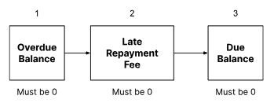

# Product features

The following business features are available with this Product.

## 1\. Loan disbursal

The loan principal is determined by the price of the product or service being purchased by the customer. It is assumed that any credit checks are performed prior to an account being opened, and the loan principal is disbursed to a deposit account.

### 1.1 Disbursal at account opening

The BNPL account is opened through the Accounts API which requires the merchant to specify the loan principal. Once the account has been opened in Vault, the loan principal specified at the time of account opening is disbursed to a deposit account.

The first repayment becomes immediately due and is typically expected to be paid on the day on which the account is opened, though this can be configured.

chat\_bubble

It is expected that if the loan principal for the product being purchased is not exactly divisible into equal repayments, then the final repayment is adjusted to ensure that the principal is paid off exactly. Therefore, a four-repayment loan for a product valued at 99.99 GBP results in four repayments: 25.00 GBP, 25.00 GBP, 25.00 GBP, 24.99 GBP

#### Use cases

##### Loan disbursal into a deposit account (the merchant’s account with the lender)

**Given** a customer requires a loan to purchase a product worth 4,000 GBP at the Point of Sale

-   and there is a BNPL option offered by the merchant
    

**When** the customer decides to opt for BNPL at checkout

**Then** a BNPL customer account is opened in Vault with a balance of 4,000 GBP at the point of purchase

-   and the loan start date is same as the purchase date
    
-   and the funds are disbursed to a deposit account.
    

## 2\. No interest

All instances of the BNPL will not accrue any interest throughout the term of the loan. This is regardless of whether repayments are being made on time or otherwise. The interest rate is not configurable, therefore interest accrual cannot be enabled.

### Use cases

#### Customer opens a BNPL account

**Given** a customer decides to purchase a product using a BNPL loan

-   and they decide to open a BNPL loan account
    

**When** the BNPL loan account is opened in Vault on the day of purchase

**Then** the balance on the account should not accrue interest.

## 3\. Repayments

Lenders are able to configure the number of repayments as well as the frequency of the repayments.

### 3.1 Configurable Number of Repayments and Repayment frequency

The product splits repayments into equal amounts, where the repayment amount is calculated using the following formula:

Repayment amount = Loan Principal / Number of Repayments

The product also supports the ability to select a Repayment Frequency as one of the following:

-   **Weekly** - repayments are due on the same day each week from the day the purchase is made
    
-   **Fortnightly** - repayments are due on a 14-day cycle from the day the purchase is made
    
-   **Monthly** - repayments are due on the same day of the month from the day the purchase is made
    

The term of the loan is calculated by using the Number of Repayments and the Repayment Frequency.

When the monthly Repayment Frequency is used and a scheduled repayment falls on a date that does not exist in every month then the repayment is expected on the last day of that month, meaning if a repayment has not been received by the end of this day, the repayment is deemed overdue. For example, if the repayment day for a loan opened on 31 January, with a monthly repayment schedule, is set as 31, the second repayment is expected on 28 or 29 February.

#### Use cases

##### Configuring Repayment Frequency

**Given** a lender offers the BNPL Product

-   and it can be configured with either a weekly, fortnightly, or monthly Repayment Frequency
    

**When** an account is opened

**Then** the lender expects repayments from the customer based on the frequency that is set.

##### Configuring Number of Repayments

**Given** a lender offers the BNPL Product

-   and the Number of Repayments, x, can be configured
    

**When** an account is opened

**Then** the bank expects the customer to pay off the loan in x repayments.

##### Repayments with a weekly frequency

**Given** a customer decides to open a BNPL account for the purchase worth 4000 GBP

-   and the Number of Repayments is set to 5
    
-   and the Repayment Frequency is set to weekly (every 7 days)
    

**When** the BNPL loan account is opened on 01 Dec 2022

**Then** the lender will expect 5 equal weekly repayments of 800 GBP, where the first repayment is due on the purchase date (01 Dec 2022)

-   and the remaining repayments become due on the following dates:
    
    -   Payment 2: 800 GBP on 08 Dec 2022
        
    -   Payment 3: 800 GBP on 15 Dec 2022
        
    -   Payment 4: 800 GBP on 22 Dec 2022
        
    -   Payment 5: 800 GBP on 29 Dec 2022
        
    

##### Repayments with a fortnightly frequency

**Given** a customer decides to open a BNPL account for the purchase worth 4000 GBP

-   and he Number of Repayments is set to 10
    
-   and the Repayment Frequency is set to fortnightly (every 14 days)
    

**When** the BNPL loan account is opened on 01 Dec 2022 (the purchase date)

**Then** the lender schedules 10 equal fortnightly repayments of 400 GBP, where the first repayment is due on the purchase date

-   and the remaining repayments become due on the following dates:
    
    -   Payment 2: 400 GBP on 14 Dec 2022
        
    -   Payment 3: 400 GBP on 28 Dec 2022
        
    -   Payment 4: 400 GBP on 11 Jan 2023
        
    -   Payment 5: 400 GBP on 25 Jan 2023
        
    -   Payment 6: 400 GBP on 08 Feb 2023
        
    -   Payment 7: 400 GBP on 22 Feb2023
        
    -   Payment 8: 400 GBP on 08 Mar 2023
        
    -   Payment 9: 400 GBP on 22 Mar 2023
        
    -   Payment 10: 400 GBP on 05 Apr 2023
        
    

##### Repayments with a monthly frequency

**Given** a customer decides to open a BNPL account for the purchase worth 4000 GBP

-   and the Number of Repayments is set to 4
    
-   and the Repayment Frequency is set to monthly (the same day every month)
    

**When** the BNPL loan account is opened on 01 Dec 2022 (the purchase date)

**Then** the lender schedules four equal monthly repayments of 1000 GBP, where the first repayment is due on 01 Dec 2022

-   and the remaining repayments become due on the following dates:
    
    -   Payment 2: 1000 GBP on 01 Jan 2023
        
    -   Payment 3: 1000 GBP on 01 Feb 2023
        
    -   Payment 4: 1000 GBP on 01 Mar 2023
        
    

### 3.2 First repayment

The first repayment (also referred to as "first repayment in advance") for the loan is expected to be processed by the lender as soon as the purchase is made, and reflected on the account after it is opened.

It is assumed that before account opening the lender will run the necessary check to ensure that the required amount for the first repayment can be settled, and handle the necessary steps to make sure that a repayment is instructed towards the BNPL account once opened.

By default, the product will run a check at the end of the purchase day to check if the first repayment has been received. The point at which this check is performed can be configured through the Repayment Period.

The repayment becomes due on the repayment date and then becomes overdue at the end of the Repayment Period, which is configurable.

chat\_bubble

The Repayment Period should be less than or equal to the Repayment Frequency. That is, the customer should be expected to pay the most recent repayment prior to the next repayment becoming due.

An example of the sequence of events from the point of purchase:

1.  Lender offers BNPL purchase option on a Merchant’s website with a set Repayment Frequency and Number of Repayments
    
2.  Customer opts for the BNPL purchase option submitting their account details for the account that will be debited to make the repayments
    
3.  Lender checks to ensure the customer has enough funds in their account to pay the first repayment
    
4.  Lender opens the BNPL account and the total purchase amount is disbursed from the Lender to the deposit account
    
5.  Lender is expected to immediately take the first repayment and reflects this on the account
    
6.  The product checks to see that the first repayment to the BNPL account was successful at the end of Repayment Period
    

#### Use cases

##### First repayment becoming Due

**Given** a customer decides to open a BNPL account for the purchase worth £4000

-   and the Number of Repayments is 4
    

**When** the BNPL account is opened on 01 Dec 2022

**Then** the first repayment of 1,000 GBP becomes due

-   and the undue balance is 3,000 GBP.
    

##### First repayment received by the lender

**Given** a customer has an active BNPL account opened on 01 Dec 2022 for the purchase worth 4,000 GBP

-   and the total Number of Repayments is 4
    
-   and the Repayment Period is 1 day
    
-   and the amount due is 1,000 GBP
    

**When** the customer repays 1,000 GBP on 01 Dec 2022

**Then** the amount due of 1,000 GBP is marked as repaid.

##### First repayment becoming overdue

**Given** a customer has an active BNPL account opened on 01 Dec 2022

-   and the Number of Repayments is 4
    
-   and the Repayment Period is 1 day
    
-   and the amount due is 1,000 GBP
    

**When** it is 02 Dec 2022

-   and the 1,000 GBP due amount has not been received by the lender
    

**Then** the amount due of 1,000 GBP is marked as overdue.

### 3.3 Repayment Period

The Repayment Period is the period during which a repayment is due this is configurable and applied to all repayments expected during the life of the loan. The customer is expected to pay the amount due during the Repayment Period, else the amount due is marked as overdue. It is assumed the lender will manage the necessary process to instruct repayment from the customer.

#### Use cases

##### Configuring the Repayment Period

**Given** a customer has opened a BNPL account on the 01 Dec 2022

-   and the Repayment Frequency is fortnightly  
    
-   and the Repayment Period is 10 days  
    
-   and the first repayment is paid on 01 Dec 2022
    

**When** the second repayment becomes due on 01 Jan 2023

-   and the customer has not paid any of the second repayment by the end of 10 Jan 2023
    

**Then** the due amount is marked as overdue.

### 3.4 Repayment Hierarchy

Each time the customer makes a repayment, funds will pay off balances on the account in a set sequence. The hierarchy of repayments is shown in the figure below. Each balance must be zeroed before the next one is repaid:

chat\_bubble

The product does not accept overpayments.

#### Use cases

##### Repayment order

**Given** a customer has a BNPL account on 01 Dec 2022

-   and has Due balance of 250 GBP
    
-   and has Undue balance of 500 GBP
    
-   and has Overdue balance of 250 GBP
    
-   and have been charged a late repayment fee of 25 GBP
    

**When** they repay 500 GBP

**Then** the Overdue balance is 0 GBP

-   and the Fee balance is 0 GBP
    
-   and the Due balance is 25 GBP.
    

##### Reject Overpayments

**Given** a customer has an active BNPL loan account

-   and no amount is due
    

**When** the customer makes a repayment any time during the lifecycle of the loan

**Then** the repayment is rejected.

### 3.5 Grace Period, Late repayment fees and Delinquency

The lender can configure a Grace Period, which begins after the Repayment Period, to allow customers more time to pay off their overdue amounts without being charged a fee.

chat\_bubble

If a Grace Period is set, we would expect the Repayment Period + Grace Period to be less than or equal to the Repayment Frequency. That is, the most recent repayment should be settled, and any late repayment fees should be charged, prior to the next repayment.

After the Repayment Period has ended, if the repayment has not been made by the customer, then the due balance becomes overdue and the loan enters a Grace Period.

During the Grace Period the customer has the opportunity to make any overdue repayments before being charged a late repayment fee.

If there is still an overdue balance at the end of the Grace Period then the late repayment fee is charged.

chat\_bubble

The late repayment fee is configurable, can be set to zero and is applied per late repayment during the life of a loan.

#### Use cases

##### Bank able to set a late repayment fee

**Given** I am a product manager for a bank

**When** I am defining a BNPL product in Vault

**Then** I should be able to set a late repayment fee.

##### Configurable Grace Period

**Given** a customer has opened a BNPL account on 01 Dec 2022 for the purchase worth 4,000 GBP

-   and the Repayment Period is 1 day  
    
-   and the Grace Period is 5 days  
    
-   and the Repayment Frequency is monthly
    
-   and there are no overdue repayments
    
-   and the second repayment of 1,000 GBP becomes due on 01 Jan 2023
    

**When** it is the 02 Jan 2023

-   and customer does not make a repayment for the full amount due
    

**Then** the amount due will become overdue

-   and the Grace Period starts.
    

##### Full repayment not received during Grace Period and Late repayment fee is charged

**Given** a customer has opened a BNPL account on 01 Dec 2022

-   and the Repayment Period is 1 day - and the Grace Period is 5 days
    
-   and the second repayment is due on 01 Jan 2023
    
-   and a late repayment fee has been configured
    

**When** it is the 07 Jan 2023

-   and the customer has not paid the full second repayment (by the end of the Grace Period)
    

**Then** a late repayment fee will be charged.

### 3.6 Delinquency

This product supports the flagging of accounts for delinquency when the customer is unable to clear all outstanding debt by the contractual end date of the loan. When the account becomes delinquent the product instructs a contract notification, which can be used to trigger collection processes by the lender.

#### Use cases

##### Account marked as Delinquent

**Given** the bank offers a BNPL product

**When** the customer has an outstanding overdue and fee balance after the contractual end date of the BNPL loan

**Then** the account is marked as delinquent.

### 3.7 Repayment Notifications

This product supports the ability to send notifications to notify customers when an upcoming repayment will become due, and when repayment has become overdue.

The repayment due notification, defined as the number of days prior to a repayment becoming due, can be configured for the product. Therefore the repayment due notifications are only sent from the second repayment onwards. That is, no notifications will be sent for first repayment.

The repayment overdue notification is sent after the Repayment Period has ended if due balances have not been repaid.

The assumption is that a downstream system will consume these notifications and display the information provided by the Contract Notifications API in a more readable format to the customer.

#### Use cases

##### Repayment notification

**Given** I have a customer with a BNPL loan

-   and the notification period is configured to two days
    

**When** it is two days before the repayment date

**Then** a notification is sent to the customer that a repayment is due in two days.

##### Overdue notification sent after Repayment Period

**Given** the customer has an active loan account with outstanding balance

**When** the Repayment Period ends and the customer has still not repaid the due amount

**Then** a notification is sent to the customer which includes the overdue amount.

## 4\. Product applied limitations

The product applies a number of limitations to prevent from the following changes during the lifecycle of the BNPL loan:

-   Loan amount cannot be changed
    
-   Number of repayments cannot be changed
    
-   Frequency of repayments cannot be changed
    

### Use cases

#### Rejecting a Request to Increase Loan Amount

**Given** a customer has an active BNPL account

**When** there is a request to increase the loan amount

**Then** the request is rejected.

#### Reject Change in Repayment Frequency

**Given** a customer has an active BNPL account

**When** there is a request to change the Repayment Frequency

**Then** the request is rejected.

#### Reject Change in Number of Repayments

**Given** a customer has an active BNPL account

**When** there is a request to change the Number of Repayments

**Then** the request is rejected.