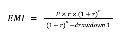

# Product features

The following business features are available with this Product.

## Account opening

The account application process is unique to each bank. Upon requesting an account to be created in Vault Core, a number of Parameters are set or inherited. The following lists those parameters and any orchestration that needs to be considered when creating an account in Vault with this product.

chat\_bubble

The product assumes the account is created via Core API in `ACCOUNT_STATUS_OPEN` status. The resulting schedules and key dates are subsequently anchored to this creation date. If you wish to create accounts in a different status, for example `ACCOUNT_STATUS_PENDING`, or wish to use the Data Loader API, you may need to customise contracts to achieve the desired behaviours.

### Orchestration

Refer to the Line of Credit Integration Guide for further details. There are four levels of parameters defined, these are:

-   Product parameter for line of credit
    
-   Product parameter for loan drawdown
    
-   Account parameter for line of credit
    
-   Account parameter for loan drawdown
    

chat\_bubble

The following parameters can configured to either Line of Credit or to Drawdown:

-   Denomination
    
-   Overpayment fee rate
    

### Product Parameters

These are set when the product is loaded onto Vault, and are inherited by all accounts upon creation.

chat\_bubble

The schedules for the product have been grouped and configured to run in the following order. This is just an example and can be amended, however please remember any changes could impact the logic of the contract: 1. Interest accrual 2. Calculate due amount 3. Check overdue 4. Check delinquency

   
| Name | Parameter Name | Description | Optional |
| --- | --- | --- | --- |
| 
Late Repayment Fee

 | 

late\_repayment\_fee

 | 

Fee to apply due to late repayment.

 | 

No

 |
| 

Late Repayment Fee Income Account

 | 

late\_repayment\_fee\_income\_account

 | 

Internal account for late repayment fee income balance.

 | 

No

 |
| 

Maximum Loan Principal

 | 

maximum\_loan\_principal

 | 

The maximum principal amount for each loan.

 | 

Yes

 |
| 

Minimum Loan Principal

 | 

minimum\_loan\_principal

 | 

The minimum principal amount for each loan.

 | 

Yes

 |
| 

Interest Accrual Hour

 | 

interest\_accrual\_hour

 | 

The hour of the day at which interest is accrued.

 | 

No

 |
| 

Interest Accrual Minute

 | 

interest\_accrual\_minute

 | 

The minute of the hour at which interest is accrued.

 | 

No

 |
| 

Interest Accrual Second

 | 

interest\_accrual\_second

 | 

The second of the minute at which interest is accrued.

 | 

No

 |
| 

Due Amount Calculation Hour

 | 

due\_amount\_calculation\_hour

 | 

The hour of the day at which due amounts are calculated.

 | 

No

 |
| 

Due Amount Calculation Minute

 | 

due\_amount\_calculation\_minute

 | 

The minute of the hour at which due amounts are calculated.

 | 

No

 |
| 

Due Amount Calculation Second

 | 

due\_amount\_calculation\_second

 | 

The second of the minute at which due amounts are calculated.

 | 

No

 |
| 

Available Credit Limit Definition

 | 

credit\_limit\_applicable\_principal

 | 

Defines whether the available credit limit is calculated using the original or outstanding principal for all open loans.

 | 

No

 |
| 

Check Overdue Hour

 | 

check\_overdue\_hour

 | 

The hour of the day at which overdue is checked.

 | 

No

 |
| 

Check Overdue Minute

 | 

check\_overdue\_minute

 | 

The minute of the hour at which overdue is checked.

 | 

No

 |
| 

Check Overdue Second

 | 

check\_overdue\_second

 | 

The second of the minute at which overdue is checked.

 | 

No

 |
| 

Repayment Period (Days)

 | 

repayment\_period

 | 

The number of days after which due amounts are made overdue.

 | 

No

 |
| 

Grace Period (days)

 | 

grace\_period

 | 

The number of days after which the account becomes delinquent.

 | 

No

 |
| 

Check Delinquency Hour

 | 

check\_delinquency\_hour

 | 

The hour of the day at which delinquency is checked.

 | 

No

 |
| 

Check Delinquency Minute

 | 

check\_delinquency\_minute

 | 

The minute of the day at which delinquency is checked.

 | 

No

 |
| 

Check Delinquency Second

 | 

check\_delinquency\_second

 | 

The second of the day at which delinquency is checked.

 | 

No

 |
| 

Maximum Number Of Outstanding Loans

 | 

maximum\_number\_of\_outstanding\_loans

 | 

The maximum number of loans allowed to be open concurrently.

 | 

No

 |
| 

Delinquency Blocking Flags

 | 

delinquency\_blocking\_flags

 | 

The list of flag definitions that block an account becoming delinquent. Expects a string representation of a JSON list.

 | 

No

 |
| 

Due Amount Calculation Blocking Flags

 | 

due\_amount\_calculation\_blocking\_flags

 | 

The list of flag definitions that block due amount calculation. Expects a string representation of a JSON list.

 | 

No

 |
| 

Interest Accrual Blocking Flags

 | 

interest\_accrual\_blocking\_flags

 | 

The list of flag definitions that block interest accruals. Expects a string representation of a JSON list.

 | 

No

 |
| 

Notification Blocking Flags

 | 

notification\_blocking\_flags

 | 

The list of flag definitions that block notifications. Expects a string representation of a JSON list.

 | 

No

 |
| 

Overdue Amount Calculation Blocking Flags

 | 

overdue\_amount\_calculation\_blocking\_flags

 | 

The list of flag definitions that block overdue amount calculation. Expects a string representation of a JSON list.

 | 

No

 |
| 

Penalty Blocking Flags

 | 

penalty\_blocking\_flags

 | 

The list of flag definitions that block penalty interest accrual. Expects a string representation of a JSON list.

 | 

No

 |
| 

Repayment Blocking Flag

 | 

repayment\_blocking\_flags

 | 

The list of flag definitions that block repayments. Expects a string representation of a JSON list.

 | 

No

 |
| 

Denomination

 | 

denomination

 | 

Currency in which the product operates.

 | 

No

 |
| 

Overpayment Fee Income Account

 | 

overpayment\_fee\_income\_account

 | 

Internal account for overpayment fee income balance.

 | 

No

 |
| 

Overpayment Fee Rate

 | 

overpayment\_fee\_rate

 | 

Percentage fee charged on the overpayment amount.

 | 

No

 |
| 

Overpayment Impact Preference

 | 

overpayment\_impact\_preference

 | 

Defines how to handle an overpayment: Reduce EMI but preserve the term.Reduce term but preserve monthly repayment amount.

 | 

No

 |
| 

Penalty Interest Rate

 | 

penalty\_interest\_rate

 | 

The annual penalty interest rate to be applied to overdue amounts.

 | 

No

 |
| 

Penalty Includes Base Rate

 | 

include\_base\_rate\_in\_penalty\_rate

 | 

If true the penalty interest rate is added to the base interest rate.

 | 

No

 |
| 

Penalty Interest Income Account

 | 

penalty\_interest\_income\_account

 | 

Internal account for penalty interest income.

 | 

No

 |
| 

Accrued Interest Receivable Account

 | 

accrued\_interest\_receivable\_account

 | 

Internal account for accrued interest receivable balance.

 | 

No

 |
| 

Interest Accrual Days In Year

 | 

days\_in\_year

 | 

The days in the year for interest accrual calculation. Valid values are "actual", "366", "365", "360"

 | 

No

 |
| 

Interest Accrual Precision

 | 

accrual\_precision

 | 

Precision needed for interest accruals.

 | 

No

 |
| 

Interest Application Precision

 | 

application\_precision

 | 

Number of decimal places accrued interest is rounded to when applying interest.

 | 

No

 |
| 

Interest Received Account

 | 

interest\_received\_account

 | 

Internal account for interest received balance.

 | 

No

 |

### Account parameters

These are set at the point of account creation.

   
| Name | Parameter Name | Description | Optional |
| --- | --- | --- | --- |
| 
Due Amount Calculation Day

 | 

due\_amount\_calculation\_day

 | 

The day of the month that the monthly due amount calculations takes place on. If the day isn’t available in a given month, the previous available day is used instead

 | 

No

 |
| 

Credit Limit

 | 

credit\_limit

 | 

Maximum credit limit available to the customer

 | 

No

 |
| 

Line Of Credit Account Id

 | 

line\_of\_credit\_account\_id

 | 

Linked line of credit account id

 | 

No

 |
| 

Loan Principal

 | 

principal

 | 

The agreed amount the customer will borrow from the bank.

 | 

No

 |
| 

Deposit Account

 | 

deposit\_account

 | 

The account to which the principal borrowed amount will be transferred.

 | 

No

 |
| 

Fixed Interest Rate

 | 

fixed\_interest\_rate

 | 

The fixed annual rate of the loan (p.a).

 | 

No

 |
| 

Total Repayment Count

 | 

total\_repayment\_count

 | 

The total number of repayments to be made, at a monthly frequency unless a repayment\_frequency parameter is present.

 | 

No

 |

### Derived parameters

These are set by the product - specifically logic within the Smart Contract and are determined when requested. They cannot be directly updated.

   
| Name | Parameter Name | Description | Optional |
| --- | --- | --- | --- |
| 
Next Repayment Date

 | 

next\_repayment\_date

 | 

Next scheduled repayment date

 | 

No

 |
| 

Total Early Repayment Amount

 | 

total\_early\_repayment\_amount

 | 

Total early repayment amount required to fully repay and close the account

 | 

No

 |
| 

Arrears Amount

 | 

total\_arrears

 | 

The amount in arrears.

 | 

No

 |
| 

Monthly Repayment Amount

 | 

total\_monthly\_repayment

 | 

The monthly repayment amount across all open loans.

 | 

No

 |
| 

Original Principal

 | 

total\_original\_principal

 | 

The total original principal taken out across all open loans.

 | 

No

 |
| 

Outstanding Due Amount

 | 

total\_outstanding\_due

 | 

The outstanding amount due to be paid.

 | 

No

 |
| 

Outstanding Principal Remaining

 | 

total\_outstanding\_principal

 | 

The outstanding principal not yet repaid.

 | 

No

 |
| 

Available Credit

 | 

total\_available\_credit

 | 

The credit available to be taken as loans.

 | 

No

 |
| 

Total Early Repayment Amount

 | 

per\_loan\_early\_repayment\_amount

 | 

Total early repayment amount required to fully repay and close the account

 | 

No

 |

## Credit Limit (CPP-2287)

### Description

Setting a credit limit for a Line of Credit account so that funds can be borrowed only up to the value of the credit limit that has been defined.

By default, the feature is configured to calculate the available credit based on the outstanding principal of the customer’s open loans. The customer’s credit limit increases when a customer makes a repayment which reduces the outstanding principal of a loan.

chat\_bubble

The feature can instead be configured to calculate the available credit based on the original principal amount, which means that the available credit would be only replenished once a loan is paid in full.

### Configuration Options

-   Credit Limit (account parameter for line of credit)
    
-   Available Credit Limit Calculation Method (product parameter for line of credit):
    
    -   based on the Outstanding Principal
        
    -   based on the Original Principal
        
    

### Business Feature Behaviour

  
| ID | Title | Behaviour |
| --- | --- | --- |
| 
01

 | 

Configuring the Available Credit Limit Calculation Method

 | 

**GIVEN** a Line of Credit product in the offering **WHEN** it is configured **THEN** the Available Credit Limit Calculation Method can be defined, based either on the Outstanding Principal across the Drawdown Loans or on the Original Principal of the Drawdown Loans

 |
| 

02

 | 

Declaring a Credit Limit on Line of Credit opening

 | 

**GIVEN** a Credit Limit has been defined **WHEN** a Line of Credit account is opened **THEN** a specific Credit Limit must be set on the Line of Credit account

 |
| 

03

 | 

Opening multiple loans up to the agreed Credit Limit amount

 | 

**GIVEN** a Credit Limit is assigned to the Line of Credit account **WHEN** a drawdown is initiated **THEN** new loans can be added until the assigned Credit Limit is reached

 |
| 

04

 | 

Rejecting a Drawdown Loan exceeding the available Credit Limit amount

 | 

**GIVEN** a Credit Limit of 20,000 is assigned to a Line of Credit **AND** a total of 10,000 in loans is held across the Line of Credit account **WHEN** a loan of 11,000 is drawn down **THEN** the new loan drawdown is rejected

 |
| 

05

 | 

Accepting a drawdown when available Credit Limit is calculated using the Outstanding Principal

 | 

**GIVEN** the Line of Credit product is configured to have the Available Credit Limit Calculation Method based on the outstanding principal across the existing Drawdown Loans **AND** a Credit Limit of 20,000 is assigned to the Line of Credit account **AND** a Drawdown Loan with the original principal of 11,000 is already opened **AND** an outstanding principal of 9,000 is to be paid off **WHEN** a new loan of 11,000 is drawn down **THEN** the new loan drawdown is accepted **AND** the available Credit Limit is reduced to 0

 |
| 

06

 | 

Accepting requests to increase Credit Limit

 | 

**GIVEN** an open Line of Credit with a Credit Limit assigned **WHEN** the Credit Limit increase is requested **THEN** the request is accepted, and the Credit Limit is updated accordingly

 |
| 

07

 | 

Rejecting requests to reduce the Credit Limit below the total principal of Drawdown Loans

 | 

**GIVEN** a Line of Credit with the Credit Limit of 20,000 **AND** a total principal of 10,000 in Drawdown Loans open across the Line of Credit **WHEN** the reduction in the Credit Limit below 10,000 is requested **THEN** the request is rejected as the total principal amount of disbursed Drawdown Loans cannot be greater than the total Credit Limit

 |
| 

08

 | 

Calculating the Available Credit Limit based on the Original Principal amount of Drawdown Loans

 | 

**GIVEN** the Line of Credit product is configured to have the Available Credit Limit Calculation Method based on the original principal of the existing Drawdown Loans **AND** the Credit Limit of 20,000 **WHEN** the total original principal of all individual Drawdown Loans under the Line of Credit is 15,000 **AND** the total outstanding principal is 12,000 **THEN** the available Credit Limit is 5,000

 |
| 

09

 | 

Calculating the Available Credit Limit based on the Outstanding Principal amount of Drawdown Loans

 | 

**GIVEN** the Line of Credit product is configured to have the Available Credit Limit Calculation Method based on the outstanding principal of the existing Drawdown Loans **AND** the Credit Limit of 20,000 **WHEN** the total original principal of all individual Drawdown Loans under the Line of Credit is 15,000 **AND** the total outstanding principal is 12,000 **THEN** the Available credit limit is 8,000

 |
| 

10

 | 

Retrieving the Available Credit Limit amount

 | 

**GIVEN** an existing Line of Credit account **WHEN** a request to access the Available Credit Limit is made **THEN** the current Available Credit Limit for the Line of Credit account is retrieved

 |
| 

11

 | 

Credit Limit remains open once all loans are paid off and closed

 | 

**GIVEN** an existing Line of Credit account **WHEN** all Drawdown Loans are paid off and closed **THEN** the Line of Credit account remains open and available for further drawdowns until it is closed

 |

## Drawdown Loans (CPP-2289)

### Description

The product allows customers to have one or more loans under an overarching Line of Credit. Each loan can have its own principal, length (term) and interest rate which allows it to have an individual repayment schedule.

The contract uses the **Declining Principal** amortisation method to calculate equated monthly instalments (EMI) according to the following formula:

Where:

-   P = the remaining principal of the loan
    
-   r = the monthly interest rate
    
-   n = the remaining term of the loan
    

The product collates the repayments due for each individual loan into a single monthly repayment amount with a shared due date for the overall Line of Credit account.

### Configuration Options

-   Maximum number of Drawdown Loans per Line of Credit account (product parameter for line of credit)
    
-   Loan term (account parameter for loan drawdown)
    
-   Loan interest rate (account parameter for loan drawdown)
    
-   Minimum Loan Amount (product parameter for line of credit)
    
-   Maximum Loan Amount (product parameter for line of credit)
    

### Business Feature Behaviour

  
| ID | Title | Behaviour |
| --- | --- | --- |
| 
01

 | 

Configuring the maximum number of Drawdown Loans per Line of Credit account

 | 

**GIVEN** a Line of Credit product in the offering **WHEN** it is configured **THEN** the maximum number of Drawdown Loans allowed per Line of Credit account can be defined

 |
| 

02

 | 

Rejecting a loan when the Maximum Number of Drawdown Loans is exceeded

 | 

**GIVEN** an active Line of Credit account with a sufficient Credit Limit and six active Drawdown Loans **AND** the maximum number of Drawdown Loans allowed per Line of Credit account configured as 6 **WHEN** a new Drawdown Loan **THEN** the drawdown request is rejected

 |
| 

03

 | 

Configuring Minimum and Maximum Loan Amounts for drawdown

 | 

**GIVEN** a Line of Credit product in the offering **WHEN** it is configured **THEN** the minimum and maximum loan amounts for drawdown can be defined

 |
| 

04

 | 

Creating a new loan with each drawdown

 | 

**GIVEN** an active Line of Credit account with a sufficient Credit Limit **WHEN** a loan is drawn down from the Line of Credit **THEN** a new Drawdown Loan is created

 |
| 

05

 | 

Assigning a term to each Drawdown Loan

 | 

**GIVEN** an active Line of Credit account with a sufficient Credit Limit **WHEN** a loan is drawn down from the Line of Credit **THEN** a term must be set on that Drawdown Loan

 |
| 

06

 | 

Assigning an interest rate to each Drawdown Loan

 | 

**GIVEN** an active Line of Credit account with a sufficient Credit Limit **WHEN** a loan is drawn down from the Line of Credit **THEN** an interest rate must be set on that Drawdown Loan

 |
| 

07

 | 

Generating amortisation schedule for each Drawdown Loan

 | 

**GIVEN** an active Line of Credit account with a sufficient Credit Limit **WHEN** a loan is drawn down from the Line of Credit **THEN** an Equated Monthly Installment (EMI) is calculated for that Drawdown Loan

 |
| 

08

 | 

Rejecting a loan lower than the Minimum Loan Amount

 | 

**GIVEN** an active Line of Credit account with sufficient Credit Limit **WHEN** a loan is drawn down with a principal lower than the minimum loan amount **THEN** the drawdown request is rejected

 |
| 

09

 | 

Rejecting a loan greater than the Maximum Loan Amount

 | 

**GIVEN** an active Line of Credit account with sufficient Credit Limit **WHEN** a loan is drawn down with a principal greater than the maximum loan amount **THEN** the drawdown request is rejected

 |

## Due Amount Determination (CPP-2290)

### Description

The product calculates the amount due each month based on the outstanding principal and interest that has accrued for each loan a customer opens, and supports sending notifications of due amounts.

A bank can configure the time and day of the month an account calculates a loan’s due amount, and this schedule will apply to all loans under a Line of Credit. When this configured date/time occurs, the accrued interest and principal due for the customer to repay that month will become due and the repayment period begins.

### Configuration Options

-   Due Amount Calculation Day (account parameter for line of credit): this parameter defines when:
    
    -   the monthly due principal and interest are calculated;
        
    -   the repayment period starts;
        
    -   the accrued interest is applied;
        
    -   the EMI is recalculated due to an interest change
        
    
-   Due Amount Calculation Time (product parameter for line of credit)
    

### Business Feature Behaviour

  
| ID | Title | Behaviour |
| --- | --- | --- |
| 
01

 | 

Configuring the Due Amount Calculation Time

 | 

**GIVEN** a Revolving Credit product is being launched **WHEN** it is configured **THEN** the Due Amount Calculation Time can be defined for that product

 |
| 

02

 | 

Setting the Due Amount Calculation Day

 | 

**GIVEN** a Line of Credit account is set to open with the Due Amount Calculation Day as the 15th day of the month **WHEN** the Line of Credit account is opened **THEN** the Due Amount Calculation Day is established as the 15th day of the month

 |
| 

03

 | 

Determining the due amounts on the Due Amount Calculation Day

 | 

**GIVEN** a Line of Credit account that has been set with the Due Amount Calculation Day as the 21st day of the month **WHEN** the 21st day of the month is reached **THEN** the Repayment Period for the account is initiated **AND** the due principal and due interest amounts are determined for that Repayment Period based on the Declining Principal amortisation method

 |
| 

04

 | 

Recalculating the Equated Monthly Instalment (EMI) for the Line of Credit

 | 

**GIVEN** a Line of Credit account is set to open with the Due Amount Calculation Day as the 18th day of the month **AND** the interest rate on a Drawdown Loan has been changed on the 15th day of the month **WHEN** the 18th day of the month is reached **THEN** the Equated Monthly Instalment for the Line of Credit account is recalculated using the new value of the interest rate

 |
| 

05

 | 

Payments not due when an account has been opened for less than a month

 | 

**GIVEN** a Line of Credit account with the Due Amount Calculation Day set as the 25th day of the month **AND** a loan drawdown on 2022-04-20 **WHEN** it is 2022-04-25 **THEN** the due amount calculation for the loan is not run as it has been less than a month since the loan was opened **AND** no payments are due for the loan on 2022-04-25 **AND** the first due amount calculation is set to occur on 2022-05-25 **AND** the first payment due date is set to 2022-05-25

 |
| 

06

 | 

Due Amount Calculation Day changing to a day that has already occurred this month

 | 

**GIVEN** a Line of Credit account with the Due Amount Calculation Day set as the 20th day of the month **AND** the current date of 15th of January **WHEN** the Due Amount Calculation Day is changed to the 2nd day of the month **THEN** the next Due Amount Calculation Day remains scheduled on the 20th of January **AND** the subsequent Due Amount Calculation Day is scheduled on the 2nd of February

 |
| 

07

 | 

Due Amount Calculation Day changing to a day that has not yet occurred this month

 | 

**GIVEN** a Line of Credit account with the Due Amount Calculation Day set as the 20th of the month **AND** the current date of 15th of January **WHEN** the Due Amount Calculation Day is changed to the 25th of the month **THEN** the next Due Amount Calculation Day remains scheduled on the 20th of January **AND** the subsequent Due Amount Calculation Day is scheduled on the 25th of February

 |
| 

08

 | 

Due Amount Calculation Day changing to a day that has not yet occurred this month but the past Due Amount Calculation Day has already happened that month

 | 

**GIVEN** a Line of Credit account with the Due Amount Calculation Day set as the 10th of the month **AND** the current date of 15th of January **WHEN** the Due Amount Calculation Day is changed to the 20th of the month **THEN** the next Due Amount Calculation Day is scheduled on the 20th of February

 |
| 

09

 | 

Clearing the remaining principal in the final due amount

 | 

**GIVEN** a Line of Credit with the Due Amount Calculation Day set as the 25th day of the month **AND** a Drawdown Loan with an outstanding principal of 500 remaining in the last month of its term **WHEN** the due amount calculation is triggered **THEN** the entire outstanding principal of 500 for the loan becomes due

 |
| 

10

 | 

Retrieving the total outstanding due balance

 | 

**GIVEN** a Line of Credit account **WHEN** one or more open loans exist **THEN** the product enables the customer to view the total outstanding due amount across their loans

 |
| 

11

 | 

Retrieving the total outstanding principal

 | 

**GIVEN** a Line of Credit account **WHEN** one or more open loans exist **THEN** the product enables the customer to view the total outstanding principal amount across their loans

 |
| 

12

 | 

Generating payment notification

 | 

**GIVEN** a Line of Credit account configured to calculate due amounts on the 21st day of the month **WHEN** it is the 21st day of the month **THEN** the payment notification is generated containing the repayment amount, next repayment date, and account number

 |

## Overdue Amount Determination (CPP-2365)

### Description

The product calculates the overdue amount using the unpaid (due) amounts of principal and interest from the recent Repayment Period are moved to their respective overdue balances and supports sending notifications of the overdue amount.

A bank can configure the time that the calculation of the overdue amount takes place.

### Configuration Options

-   Repayment Period (product parameter for line of credit)
    
-   Overdue Amount Calculation Time (product parameter for line of credit)
    

### Business Feature Behaviour

  
| ID | Title | Behaviour |
| --- | --- | --- |
| 
01

 | 

Configuring the Overdue Amount Calculation Time

 | 

**GIVEN** a Revolving Credit product is being defined **WHEN** it is configured **THEN** the Overdue Amount Calculation Time can be defined for that product

 |
| 

02

 | 

Determining the overdue amounts at the end of the Repayment Period

 | 

**GIVEN** a Line of Credit account set with the Due Amount Calculation Date of the 15th day of the month **AND** the Repayment Period defined as 5 days **WHEN** the Overdue Amount Calculation Time on the 20th day of the month is reached **THEN** the unpaid (due) amounts of principal and interest from the recent Repayment Period are moved to their respective overdue balances

 |
| 

03

 | 

Retrieving the total overdue amount

 | 

**GIVEN** an active Line of Credit account **WHEN** one or more open loans exist **THEN** the product enables the customer to view the total amount in arrears across their loans

 |
| 

04

 | 

Generating overdue notification

 | 

**GIVEN** a due repayment of 100 for the customer **AND** a fixed late payment fee of 25 **WHEN** the repayment period ends and the due monthly repayment of 100 transitions from due to overdue **THEN** the overdue notification is generated containing both the overdue monthly repayment amount of 100 and the fixed late payment fee of 25

 |

## Credit Line Interest Accrual and Application (CPP-2298)

### Description

Any accrued interest balance on an account is added to an account’s line of credit balance. The product performs interest accrual daily at the configured time on the annual gross interest rate and outstanding principal. It rounds up the accrued interest to a configurable number of decimal places and adds it to the accrued interest balance.

The product uses the following formula to calculate interest daily:

daily accrued interest=(annual gross interest rate / day count) \* outstanding principal

Each month, on the Due Amount Calculation Day, the aggregated daily accrued interest is applied to the Line of Credit due interest balance.

### Configuration Options

-   Annual Gross Interest Rate (account parameter for loan drawdown)
    
-   Interest Accrual Time (product parameter for line of credit)
    
-   Interest Application Time (product parameter for line of credit)
    
-   Interest Accrual Precision (product parameter for loan drawdown) - the number of decimal places at which interest is accrued
    
-   Interest Application Precision (product parameter for loan drawdown) - the number of
    
-   Day Count (product parameter for loan drawdown) - the number of days in the year used for interest accrual calculation
    
-   Due Amount Calculation Day (account parameter for line of credit)
    

### Business Feature Behaviour

  
| ID | Title | Behaviour |
| --- | --- | --- |
| 
01

 | 

Configuring interest accrual

 | 

**GIVEN** a Line of Credit product is being defined **WHEN** the product is configured **THEN** the following be defined:Interest Accrual Time Interest Accrual Precision Day Count

 |
| 

02

 | 

Calculating and accruing daily interest on outstanding principal

 | 

**GIVEN** an active Line of Credit account **AND** an open Drawdown Loan account with an outstanding principal of 10,000 and the Annual Gross Interest Rate of 15% **AND** the Interest Accrual Precision defined as five decimal places **AND** the Day Count defined as 365 **WHEN** the Interest Accrual Time is reached **THEN** the interest accrued is calculated as the principal outstanding (10,000) multiplied by the daily interest rate (0.15/365): 10,000 \* 0.00041 = 4.10959 **AND** added to the accrued interest balance

 |
| 

03

 | 

Configuring interest application

 | 

**GIVEN** a Line of Credit product is being defined **WHEN** the product is configured **THEN** the following can be defined: Interest Application Time Interest Application Precision

 |
| 

04

 | 

Applying accrued interest on the Due Amount Calculation Day

 | 

**GIVEN** an active Line of Credit account with the Due Amount Calculation set to the 15th day of the month **AND** an open Drawdown Loan account with the accrued interest of 123.28770 **AND** the Interest Application Precision is defined as two decimal places **WHEN** it is the 15th day of the month **AND** the Interest Application Time is reached **THEN** the interest accrued is removed from the accrued interest balance **AND** it is applied to the due interest balance of the Line of Credit

 |

## Repayments Processing (CPP-2291)

### Description

When the Due Amount Calculation Day (also known as the repayment date) occurs, the accrued interest and principal due to be repaid for that month will become due. At this point the repayment period begins.

The Repayment Period is a configurable time period that a customer has to repay the amount due (principal and interest). The duration is a configurable value, from 1 to 27, as the number of days of the period from the repayment due day, on which the product calculates the amount due.

The product has a defined Repayment Hierarchy which dictates the order that it receives and applies repayments to clear the customer’s debt across all associated loans.

When a customer payment arrives, the product distributes it across these different pots using the repayment hierarchy, repaying specific balances first and then the due amount. It must pay the entirety of the balance (zero out) for a given entry in the hierarchy before moving to the next entry.

For accounts that have several open loans, the default configuration of the product is to use customer payments to repay all loans according to a specific order. Customers can make payments on all loans (at the overall line of credit level) and also have the option to target repayments to a specific loan. For targeted payments, the product will adjust the repayment order accordingly.

When the customer does not target repayments to a specific loan, the product will repay the loans according to the following order:

1.  oldest, by date opened
    
2.  alphabetically by loan ID (the ID specified at the creation of the individual loan)
    

### Configuration Options

-   Repayment Period (product parameter for line of credit)
    
-   Due Amount Calculation Day (account parameter for line of credit)
    

### Business Feature Behaviour

  
| ID | Title | Behaviour |
| --- | --- | --- |
| 
01

 | 

Configuring the Repayment Period

 | 

**GIVEN** a Revolving Credit product is being launched **WHEN** it is configured **THEN** the term of the Repayment Period can be defined for that product

 |
| 

02

 | 

Calculating the Repayment Period

 | 

**GIVEN** a Line of Credit account with the Due Amount Calculation Day set to the 10th day of the month **AND** the Repayment Period configured as 5 days **WHEN** it is April 10th **THEN** the Repayment Period is initiated at the Due Amount Calculation Time of that Day **AND** it lasts until April 15th

 |
| 

03

 | 

Targeting a payment to a specific loan

 | 

**GIVEN** an active Line of Credit account with several open Drawdown Loans **WHEN** a payment is made towards a specific Drawdown Loan of which the amount does not exceed the total outstanding balance of the loan **THEN** the payment must be accepted **AND** applied to the targeted loan’s balance according to the repayment hierarchy

 |
| 

04

 | 

Applying a payment to a specific loan according to the repayment hierarchy (or when there is only one loan under a Line of Credit)

 | 

**GIVEN** a payment towards a specific Drawdown Loan under a Line of Credit has been accepted **WHEN** the payment is posted **THEN** it is allocated to the account balance in the following order: Clear the overdue principal balance Once the overdue principal balance is paid off, clear the overdue interest balance Once the overdue interest balance is paid off, clear the penalty balance Once the penalty balance is paid off, clear the due principal balance Once the due principal balance is paid off, clear the due interest balance Once the due interest balance is paid off, clear the principal balance Once the principal balance is paid off, clear the accrued interest balance

 |
| 

05

 | 

Rejecting a payment toward a specific loan if the repayment amount is greater than the total outstanding balance of the loan

 | 

**GIVEN** an active Line of Credit account with several open Drawdown Loans **WHEN** a payment is made towards a specific Drawdown Loan of which the amount exceeds the total outstanding balance of the loan **THEN** the payment must be rejected

 |
| 

06

 | 

Rejecting payments targeted to an invalid loan

 | 

**GIVEN** an active Line of Credit account with several open Drawdown Loans **AND** a payment is made towards a specific Drawdown Loan **WHEN** the loan account number is invalid **THEN** the payment must be rejected

 |
| 

07

 | 

Targeting a repayment to a Line of Credit

 | 

**GIVEN** an active Line of Credit account **WHEN** a payment is made towards that Line of Credit account of which the amount does not exceed the total outstanding balance of the Line of Credit **THEN** the payment must be accepted **AND** applied to the underlying Drawdown Loans according to the repayment hierarchy

 |
| 

08

 | 

Applying a payment to the Line of Credit account with more than one Drawdown Loan according to the repayment hierarchy

 | 

**GIVEN** a payment towards a Line of Credit has been accepted **AND** there are two Drawdown Loans associated with it **AND** the loan A had been opened on 2023-01-04 and the loan B had been opened on 2023-01-10 **WHEN** the payment is posted **THEN** it is allocated to the account balance in the following order: Clear the overdue principal balance on the loan A first, then clear the overdue principal balance on the loan B Once the overdue principal balance is paid off on both loans, clear the overdue interest balance on the loan A first, then clear the overdue interest balance on the loan B Once the overdue interest balance is paid off on both loans, clear the penalty interest balance on the loan A first, then clear the penalty interest balance on the loan B Once the penalty interest balance is paid off on both loans, clear the due principal balance on the loan A first, then clear the due principal balance on the loan B Once the due principal balance is paid off on both loans, clear the due interest balance on the loan A first, then clear the due interest balance on the loan B Once the due interest balance is paid off on both loans, clear the principal balance on the loan A first, then clear the principal balance on the loan B Once the principal balance is paid off on both loans, clear the accrued interest balance on the loan A first, then clear the accrued interest balance on the loan B

 |
| 

09

 | 

Rejecting a payment toward a LoC if the payment amount is greater than the total outstanding amount of all Drawdown Loans under the LoC

 | 

**GIVEN** an active Line of Credit account with several open Drawdown Loans **WHEN** a payment is made towards that Line of Credit of which the amount exceeds the total outstanding balance of all Drawdown Loans under that Line of Credit **THEN** the payment must be rejected

 |

## Repayment Holiday (CPP-2292)

### Description

This feature allows banks to enable customers to take a break from regular monthly repayments on a line of credit when required. To collect the repayments missed as part of the repayment holiday, the product will increase the EMI for each loan while the term of each loan remains the same.

### Configuration Options

-   Repayment Holiday (flag): determines the duration of the repayment holiday period by setting a start date and an end date
    

### Business Feature Behaviour

  
| ID | Title | Behaviour |
| --- | --- | --- |
| 
01

 | 

Applying a repayment holiday to a Line of Credit account

 | 

**GIVEN** an active Line of Credit account **WHEN** a Repayment Holiday is requested **THEN** a flag can be applied on the Line of Credit account to determine the start and the end date of the Repayment Holiday for all the underlying loan accounts

 |
| 

02

 | 

Suppressing interest accrual due to repayment holiday

 | 

**GIVEN** a Line of Credit account within the Repayment Holiday period **WHEN** the interest accruing is scheduled to run for all underlying loan accounts **THEN** the accruing is suppressed

 |
| 

03

 | 

Suppressing due amount determination due to repayment holiday

 | 

**GIVEN** a Line of Credit account within the Repayment Holiday period **WHEN** the due balances are scheduled to be determined on a due amount calculation day **THEN** the calculation of due balances is suppressed

 |
| 

04

 | 

Suppressing overdue amount determination due to repayment holiday

 | 

**GIVEN** a Line of Credit account within the Repayment Holiday period **WHEN** the overdue balances are scheduled to be determined at the end of a Repayment Period **THEN** the calculation of overdue balances is suppressed

 |
| 

05

 | 

Suppressing payment due notifications during Repayment Holiday

 | 

**GIVEN** a Line of Credit account within the Repayment Holiday period **WHEN** a payment due notification is scheduled to be generated **THEN** the notification is suppressed

 |
| 

06

 | 

Suppressing delinquency checks during Repayment Holiday

 | 

**GIVEN** a Line of Credit account within the Repayment Holiday period **WHEN** a delinquency check is scheduled to run at the end of a Grace Period **THEN** the delinquency check is suppressed

 |
| 

07

 | 

Rejecting repayments during Repayment Holiday

 | 

**GIVEN** a Line of Credit account within the Repayment Holiday period **WHEN** a repayment is received either towards the Line of Credit or a specific loan **THEN** the repayment is rejected

 |
| 

08

 | 

Ending Repayment Holiday on a given day

 | 

**GIVEN** a Line of Credit account within the Repayment Holiday period **WHEN** the end date of the repayment holiday is reached **THEN** the Repayment Holiday flag is disabled **AND** the Line of Credit and all underlying loans resume the regular behaviour

 |
| 

09

 | 

Increasing the EMI as a result of Repayment Holiday

 | 

**GIVEN** a Line of Credit account within the Repayment Holiday period **WHEN** each repayment date occurs within the holiday period **THEN** the product recalculates the Equated Monthly Instalment (EMI) of each loan **AND** does not change the term of the loans

 |

## Overpayments and Early Repayments (CPP-2293)

### Description

An **overpayment** is a type of repayment that exceeds the expected due amounts.

Overpayments reduce the remaining principal balance thus reducing the amount of interest that accrues as a result.

Customers can make overpayments at the line of credit level and also have the option to target payments to a specific loan. It allows customers with a loan that supports overpayments to: - Overpay a loan as a lump sum or periodically, and it credits any overpayment to the remaining loan principal balance - Make an unlimited number of payments; it does not have a limit - Choose to either reduce the loan term or reduce the EMI for the remainder of the term

It will apply an overpayment to a loan according to the defined repayment order.

The product will reject overpayments that exceed the total combined outstanding principal and interest plus repayment fees, whether the overpayment is for all loans or a targeted loan.

**Early repayment** is a form of overpayment. The product regards it as any payment that results in the whole line of credit or an individual loan being fully paid off. For that to happen, the product provides the "settlement figure": the total amount to pay the loan in full including all fees and penalties.

### Configuration Options

-   Overpayment Impact (product parameter for line of credit) that could be either:
    
    -   EMI reduction or
        
    -   Loan term reduction
        
    
-   Overpayment Fee Rate (product parameter for line of credit)
    

### Business Feature Behaviour

  
| ID | Title | Behaviour |
| --- | --- | --- |
| 
01

 | 

Configuring the Overpayment impact

 | 

**GIVEN** a Revolving Credit product in the offering **WHEN** the product is configured **THEN** the resulting product behaviour when an account receives an overpayment can be selected from the available options: reducing the EMI so that the term remains the same, or reducing the term so that the EMI remains the same

 |
| 

02

 | 

Configuring the Overpayment Fee

 | 

**GIVEN** a Revolving Credit product in the offering **WHEN** the product is configured **THEN** the Overpayment Fee can be defined as percentage of the overpaid amount (i.e. the difference between the expected due amount and the overpayment)

 |
| 

03

 | 

Reducing the EMI as the result of overpayment

 | 

**GIVEN** a Revolving Credit product configured with the option of reducing the Equated Monthly Instalment (EMI) as a result of an overpayment **WHEN** an overpayment is made **THEN** the EMI for the open loans - whose outstanding principal has been reduced - is recalculated on the next Due Amount Calculation Day by the product

 |
| 

04

 | 

Reducing the loan term as the result of overpayment

 | 

**GIVEN** a Revolving Credit product configured with the option of reducing the loan term as a result of an overpayment **WHEN** an overpayment is made **THEN** the term is reduced but the EMI remains the same except for the final month’s EMI, which might adjust to cater for any residual balance

 |
| 

05

 | 

Applying the Overpayment Fee

 | 

**GIVEN** a Revolving Credit product configured with the Overpayment Fee Rate of 5% **AND** an active Line of Credit account **WHEN** an overpayment of 1,000 above the expected due amount is made **THEN** the Overpayment Fee of 50 is applied **AND** the amount of 950 is allocated towards the outstanding principal of the account **AND** the amount of 50 is allocated towards the fee income of the bank

 |
| 

06

 | 

Targeting overpayments

 | 

**GIVEN** an active Line of Credit account with multiple loans **WHEN** an overpayment is made **THEN** either the Line of Credit account or a specific individual loan can be targeted for overpayment processing

 |
| 

07

 | 

Calculating the settlement figure for early repayment

 | 

**GIVEN** an active Line of Credit account **WHEN** there is one or more loans open under that Line of Credit **THEN** the total outstanding amount required to fully pay off the entire Line of Credit - including any applicable fee and penalties - can be retrieved

 |
| 

08

 | 

Early repayment processing

 | 

**GIVEN** a Revolving Credit product configured with the Overpayment Fee Rate of 5% **AND** an individual loan drawn from the Line of Credit account with the outstanding principal of 900 and the due amount of 100 **WHEN** an early repayment of that individual loan is requested **THEN** the customer is required to pay 1045 (900 + 100 + 900\*0.05) in order to pay the loan in full

 |

## Grace Period and Delinquency (CPP-2295)

### Description

The grace period allows the customer more time to repay the overdue balance, including any outstanding fees and penalty interest, in order to prevent the account from becoming delinquent.

An account being marked as delinquent does not incur any behavioural impact and is only to provide the bank with visibility of account delinquency. We assume that the bank will have internal processes in place to take additional action against the customer’s account when it is marked as delinquent.

### Configuration Options

-   Grace Period (account parameter for line of credit): the number of days after which the account becomes delinquent
    
-   Delinquency (flag): indicates that a Line of Credit account is delinquent
    

### Business Feature Behaviour

  
| ID | Title | Behaviour |
| --- | --- | --- |
| 
01

 | 

Configuring a Grace Period

 | 

**GIVEN** a Line of Credit product is being launched **WHEN** it is configured **THEN** a Grace Period can be defined as a single value with the minimum of 0 days and the maximum of 27 days

 |
| 

02

 | 

Line of Credit account entering Grace Period

 | 

**GIVEN** an active Line of Credit account with the Grace Period configured as 7 days **WHEN** the due amounts are not fully paid within the Repayment Period **THEN** the unpaid due balances become overdue **AND** penalties are applied (if configured) **AND** a 7-day window is activated for the customer to pay the overdue balances in order to avoid the account becoming delinquent on day 8

 |
| 

03

 | 

Account does not receive full repayment during the Grace Period

 | 

**GIVEN** an active Line of Credit account with overdue amounts and penalties in the Grace Period **WHEN** the overdue amounts and penalties are not fully paid by the end of the Grace Period **THEN** the delinquency notification is generated

 |
| 

04

 | 

Account receives full repayment during the Grace Period

 | 

**GIVEN** an active Line of Credit account with overdue amounts and penalties in the Grace Period **WHEN** the repayment equal to the amount overdue and penalties is received before the end of the Grace Period **THEN** the delinquency notification is not generated at the end of the Grace Period

 |
| 

05

 | 

Marking a Line of Credit account as delinquent

 | 

**GIVEN** an overdue Line of Credit account at the end of the Grace Period **WHEN** the delinquency notification is generated **THEN** the Line of Credit account will be marked as delinquent

 |

## Late Payment Penalties (CPP-2296)

### Description

The product allows a bank to configure optional penalties to charge customers who do not repay the full amount due by the end of the repayment period.

In this scenario, the product moves the amount outstanding to overdue and applies any configured penalties to the account.

There are two penalty options available:

-   The **flat-fee penalty** is a one-off charge that the product will add to an account for every month that it does not receive a full repayment. The product will add this fee to the Line of Credit account penalty pot regardless of which loan it applies to. No interest will accrue on this fee.
    
-   The **penalty interest rate** is an additional rate of interest. The product accrues penalty interest daily on the overdue principal amount and overdue interest and applies it to the penalties pot, where it remains until settled. It can be defined as a separate rate or combined with the regular interest rate.
    

### Configuration Options

-   Late Repayment Fee (product parameter for line of credit)
    
-   Penalty Interest Rate (product parameter for loan drawdown)
    

### Business Feature Behaviour

  
| ID | Title | Behaviour |
| --- | --- | --- |
| 
01

 | 

Configuring Late Payment Penalties

 | 

**GIVEN** a Revolving Credit product is being launched **WHEN** it is configured **THEN** the Late Repayment Fee and Penalty Interest Rate can be configured with the Penalty Interest Rate being a separate interest rate or combined with the regular interest rate of the loan

 |
| 

02

 | 

Charging Late Repayment Fee

 | 

**GIVEN** an active Line of Credit account with the late repayment fee configured as 25 **AND** the estimated due monthly payment of 100 **AND** when only a payment of 50 GBP has been received during the repayment period **AND** the repayment period ends **WHEN** the due balances are transferred to overdue **THEN** the Late Repayment Fee of 25 is charged **AND** posted to the penalties balance

 |
| 

03

 | 

Not charging a fee to a customer account if fee configured to 0

 | 

**GIVEN** an active Line of Credit account with the late repayment fee configured as 0 **AND** the estimated due monthly payment of 100 **AND** when only a payment of 50 GBP has been received during the repayment period **AND** the repayment period ends **WHEN** the due balances are transferred to overdue **THEN** the Late Repayment Fee is not charged

 |
| 

04

 | 

Charging penalty interest on overdue principal and overdue interest

 | 

**GIVEN** an active Line of Credit account with 100 of overdue principal payments **AND** 50 of overdue interest payments **AND** the penalty interest rate of 10% **WHEN** interest accruing occurs **THEN** the penalty interest is calculated on the overdue balance of 150

 |
| 

05

 | 

Charging penalty Interest on top of the base interest rate

 | 

**GIVEN** an active Line of Credit account with 100 of overdue principal payments **AND** the regular interest rate of 15% **AND** the penalty interest rate of 5% **AND** the product is configured to combine the regular interest rate with the penalty interest rate in order to charge penalty interest **WHEN** interest accruing occurs **THEN** the penalty interest accrues at 20% (regular interest rate + penalty interest rate) on the overdue balance of 100

 |
| 

06

 | 

Not charging extra penalty interest

 | 

**GIVEN** an active Line of Credit account with 100 of overdue principal payments **AND** the regular interest rate of 15% **AND** the penalty interest rate of 0% **AND** the product is configured to combine the regular interest rate with the penalty interest rate in order to charge penalty interest **WHEN** interest accruing occurs **THEN** the penalty interest accrues at 15% (regular interest rate + penalty interest rate) on the overdue balance of 100

 |
| 

07

 | 

Accruing penalty interest into the penalties address

 | 

**GIVEN** the overdue principal on a loan and the penalty interest rate configured as greater than 0 **WHEN** interest accrual occurs **THEN** the daily penalty interest is accrued into the penalties address where it remains until settled

 |

## End of Loans (CPP-2297)

### Description

When a loan is paid off, a notification is generated in order for the bank to initiate the closure process for that Drawdown Loan. When all loans are repaid the Line of Credit account will remain open and will not automatically be closed.

### Business Feature Behaviour

  
| ID | Title | Behaviour |
| --- | --- | --- |
| 
01

 | 

Generating a paid-off notification

 | 

**GIVEN** a Line of Credit account with one or more Drawdown Loans **WHEN** a Drawdown Loan is fully repaid **THEN** a notification detailing which loan account ids have been paid off is generated for the bank to initiate the process to close that loan

 |
| 

02

 | 

Credit facility remains open once the customer repays all loans

 | 

**GIVEN** a Line of Credit account with one or more outstanding Drawdown Loans **WHEN** all loans are fully repaid **THEN** the Line of Credit is not automatically closed but remains open for further drawdowns

 |