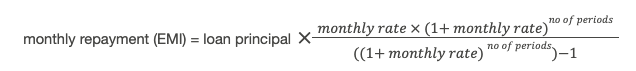
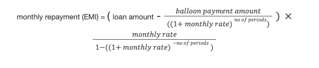

# Product features

The following business features are available with this Product.

## 1\. Loan disbursal

The loan product allows a customer to borrow any amount greater than 1 in the given loan denomination. A bank can configure the loan amounts and whether to charge an upfront fee and the fee amount.

The product supports loan disbursement only to another Vault account, not to an external account.

### 1.1 Disbursal at account opening

You can [open a loan account](/vault-core/5-9/EN/product_library/product_specifications/loan/product_life_cycle_loan#opening_a_loan) through a request to the Accounts API or the `LOAN_APPLICATION` workflow. The workflow is an illustrative workflow to open a `declining_principal` amortised loan, it prompts the customer to select the amount to borrow and a valid account to transfer the funds into.

The product automatically transfers the loan principal amount, specified by the customer when opening their account, to the nominated deposit current account (another Vault account) once it opens the loan.

The loan generates a repayment schedule on account activation for all loans configured with the "declining principal" amortisation method. The repayment schedule is streamed out as a notification containing the following attributes:

-   payment number
    
-   total remaining principal
    
-   total monthly repayment
    
-   principal due
    
-   interest due
    

The repayment schedule amounts are derived from the EMI calculation formula:

#### Related Vault objects

Use the `LOAN_APPLICATION` workflow to open a Loan account.

#### Use cases

##### Loan disbursal into a deposit account

**Given** a customer requests to open a loan of 10,000 GBP

**When** the loan account opens

**Then** the product disburses the loan principal of 10,000 GBP into a validated nominated deposit account.

### 1.2 Upfront fee

Banks can optionally configure an upfront fee to charge to customers at the time of opening an account or set the product to not charge a fee.

Upfront fee configuration options:

-   a flat fee and the amount
    
-   no fee (value of 0)
    
-   amortisation
    
-   the internal account that the upfront fee is transferred into
    

#### Financial calculations

The calculation of the upfront fee for a given customer is subject to the applicable fee options for their specific loan, such as whether to amortise the fee.

When the option to amortise the upfront fee is set to true, the product adds the fee amount on top of the loan amount and calculates the amortised principal. The amount that the product disburses to the customer is only the loan amount. This allows the customer to repay the upfront fee over a period of time alongside their loan, as a single payment.

*amortised principal = loan amount + upfront fee*

When the option to amortise the upfront fee is set to false, the amortised principal balance remains the same (no change). This means that the customer must repay the upfront fee according to a bank’s terms, as a single payment at the start of the loan. The product calculates the amount to disburse to the customer as follows.

*amount disbursed = loan amount - upfront fee*

#### Use cases

##### Charge a flat upfront fee at account opening

**Given** a customer requests a loan of 10,000 GBP

-   and the loan product is configured to charge the account an upfront fee of 50 GBP
    

**When** the product sets the loan principal to 10,000 GBP and disburses 10,000 GBP to the customer

**Then** the product charges an upfront fee of 50 GBP.

##### Amortising an upfront fee

**Given** a customer requests a loan of 10,000 GBP

-   and the loan product is configured to charge the account an upfront fee of 500 GBP
    
-   and to amortise the upfront fee
    

**When** the loan account opens

**Then** the product sets the loan principal to 10,500 GBP and disburses 10,000 GBP to the customer.

##### No amortisation of the upfront fee

**Given** a customer requests a loan of 10,000 GBP

-   and the bank has configured the loan product to charge the account an upfront fee of 500 GBP
    
-   and not to amortise the upfront fee
    

**When** the loan account opens

**Then** the product sets the loan principal to 10,000 GBP and disburses 9,500 GBP to the customer.

## 2\. Interest

The Loan product offers a range of configuration options at a product level and for individual customer accounts. A bank can configure fixed or variable interest, interest rates with positive/zero interest, variable rate caps and floors, accrual time, application behaviour, repayment holidays, and interest and fee capitalisation.

A bank can [define the fixed or variable interest rate](/vault-core/5-9/EN/product_library/product_specifications/loan/features#2_2_variable_and_fixed_interest_rates) according to the type it sets for the loan:

-   Fixed rate
    
    -   Fixed type set at account level through an instance level parameter.
        
    -   Interest rate is the value of an instance level parameter at account level.
        
    
-   Variable rate
    
    -   Variable type set at account level through an instance level parameter.
        
    -   Interest rate is the sum of the template-level variable rate parameter plus an additional instance-level variable interest rate adjustment parameter.
        
    -   Additional template-level parameters for variable interest rate cap and variable interest rate floor.
        
    

This is to provide configurability options, because we assume that a bank will determine the interest rate for the account based on multiple factors and processing that is conducted outside of Vault.

The product performs a daily interest accrual and applies interest on a monthly basis on the due amount calculation day.

### 2.1 Interest accrual and application

The Loan product performs an interest accrual daily at the configured time on the principal as of end of day. It rounds-up the accrued interest to a configurable number of decimal places and adds it to the customer’s accrued interest balance, and later applies the interest to the due balance on the due amount calculation day. The customer can repay the due amount until the repayment period expires; if they do not repay it by the end of the repayment period, this amount becomes overdue.

The base rate (fixed or variable interest rate) is defined as the interest rate on a customer’s account plus a configurable penalty rate. A bank can configure the product to apply or not apply interest to any arrears as follows:

-   apply the base rate (inclusive of the interest rate on the account and the penalty rate applied on any arrears)
    
-   apply only the base interest rate and no penalty interest
    
-   apply no/zero interest
    

The following table summarises the product configuration options for charging interest.

   
| Type | Address | Interest accrual configurability | Note |
| --- | --- | --- | --- |
| 
Principal

 | 

`PRINCIPAL`

 | 

Not Configurable

 |  |
| 

Principal due

 | 

`PRINCIPAL_DUE`

 | 

Configurable

 | 

When using `accrue_interest_on_due_principal`

 |
| 

Interest due

 | 

`INTEREST_DUE`

 | 

Not configurable

 |  |
| 

Principal overdue

 | 

`PRINCIPAL_OVERDUE`

 | 

Configurable

 | 

Penalty interest only

 |
| 

Interest overdue

 | 

`INTEREST_OVERDUE`

 | 

Configurable

 | 

Penalty interest only, when using `penalty_compounds_overdue_interest`

 |

#### Financial calculations

##### Daily accrual amount

The product calculates the daily accrual amount using the following formula:

daily accrued interest = round(round(annual gross interest rate / days in year, 10) \* principal, `accrual_precision`)

The annual gross interest is the effective interest rate as of that day. This allows for any changes in variable rate scenarios.

##### Penalty interest accrual

The product does not charge penalty interest on any late payment fees. Penalty interest starts to accrue daily on the in arrears amount using the following formula:

*accrued in arrears interest = round(balance* daily interest rate, `accrual_precision`)\*

This applies where the product calculates the daily interest rate from the base rate and the penalty interest rate, and using the days in year parameter:

*daily interest rate = round((base rate + penalty interest rate) / days in year, 10)*

The bank can configure both the base rate and penalty interest rate.

#### Related Vault objects

The Contract uses the following addresses to accrue interest and apply interest respectively:

-   `ACCRUED_INTEREST_RECEIVABLE`
    
-   `INTEREST_DUE`
    

#### Use cases

##### Accruing daily interest on a loan

**Given** a bank opens a loan account for a customer

-   and it has a principal of 10,000 GBP
    
-   and an annual interest rate of 2.2%
    
-   and an interest accrual precision of five decimal places
    
-   and configures it to accrue interest at 00:00:01
    
-   and the bank disburses the loan amount of 10,000 GBP
    

**Then** the product accrues interest according to a schedule on a daily basis at 00:00:01 hours

-   **and** bases the calculation on the daily interest rate and the remaining principal as of the current month.
    

###### Example:

*round(round((0.022/365),10)*(10,000),5)\* = 0.60274 GBP

##### Changing the interest rate set for the daily interest accrual schedule

**Given** a customer has a loan

**When** the bank changes the interest rate

**Then** the daily interest accrual schedule uses the new interest rate to calculate interest

-   and the resulting interest due for that period is a combination of the interest accrued using the old rate and interest accrued using the new rate.
    

##### Accruing daily interest after overpayment consideration

**Given** a customer has made an overpayment in a particular payment cycle

**When** the product triggers the daily interest accrual schedule

**Then** interest accrues on the principal amount after the product deducts the customer’s overpayment.

##### Configurable interest accrual time

**Given** the loan product is configured to accrue interest at 22:30:00 (HH:MM:SS)

**When** 22:30:00 occurs each day

**Then** interest is accrued on the principal balance at the end of the previous day.

##### Applying interest on the due amount calculation day

**Given** the customer has accrued 50 GBP of interest over the course of the payment cycle

**When** the product triggers the interest application schedule on the due amount calculation day

**Then** it applies the 50 GBP of accumulated interest to the interest due balance on the account.

##### Configure product to accrue interest on due principal repayment balance

**Given** the bank has configured the product to accrue interest on the due principal balance

-   and the customer has a remaining principal of 10,000 GBP
    
-   and a due principal repayment of 100 GBP
    

**When** the product triggers the interest accrual schedule

**Then** it calculates interest on the combined principal and due principal repayment balance of 10,100 GBP.

### 2.2 Variable and fixed interest rates

The Loan product supports both variable and fixed interest rate types. The rate type (fixed or variable) set on the Loan will determine the interest rate that the interest accrual calculation will use and its result.

The fixed interest rate is defined at an account level and the variable interest rate is defined at a template level. The base variable rate will accept a positive or zero value.

To facilitate tracker rates, customer-specific discounts and other customer-specific adjustments to the base variable rate, the product includes a variable rate adjustment. This is applied on top of the variable interest rate and the variable rate adjustment setting will accept a negative, positive or zero value.

#### Use cases

##### Accruing interest using a fixed interest rate

**Given** a customer has an open loan

-   and the fixed interest loan parameter is set to true
    
-   and a fixed interest rate of 5%
    

**When** the product triggers the interest accrual schedule

**Then** it accrues interest on the account at a rate of 5%.

##### Accruing interest using a variable interest rate

**Given** a customer has an open loan

-   and the fixed interest rate loan parameter is set to false,
    
-   and a variable interest rate of 5%
    
-   and an interest rate adjustment of 2%
    

**When** the product triggers the interest accrual schedule

**Then** it accrues interest on the account at a rate of 7% (5 + 2).

### 2.3 Variable interest rate cap

In order to comply with any regulatory policies, the loan product includes a variable interest rate cap template parameter, which corresponds to the highest interest rate that the bank may charge its customers.

The interest rate cap control guidelines are as follows:

-   The interest rate on the loan must not exceed the interest rate cap - this is set by the bank as the maximum interest rate.
    
-   The bank will only charge the interest rate cap if the variable interest rate on the loan specified in the customer agreement would change to a higher rate than the interest rate cap as a result of a change to the cap.
    
-   The interest rate on the loan is calculated on the interest rate in the customer agreement if the agreed interest rate is less than or equal to the interest rate cap.
    

#### Use cases

##### Setting an interest rate cap

**Given** a bank has a loan product

**When** the bank is setting the loan parameters

**Then** the bank can specify the value for the interest rate for the cap.

##### Product uses the interest rate cap to calculate interest when the variable interest rate exceeds the cap

**Given** a bank has a loan product with a variable interest rate

**When** the sum of the base variable interest rate and the variable rate adjustment is higher than the interest rate cap

**Then** the final interest rate on the loan becomes the interest rate cap, the maximum interest rate set out by the bank.

##### Product uses the variable interest rate calculation when it is less than the interest rate cap

**Given** a bank has a loan product with a variable interest rate

**When** the sum of the base variable interest rate and the variable rate adjustment is lower than the interest rate cap

**Then** the final interest rate on the loan is the sum of the base variable interest rate and the variable rate adjustment.

##### Product uses the interest rate cap when changing it causes the variable interest rate to exceed the cap

**Given** a bank has a loan product with a variable interest rate

**When** as a result of a change in the interest rate cap, the variable interest rate on the loan specified in the agreement would change to a higher rate than the interest rate cap

**Then** the bank only charges the rate it has defined in the interest rate cap.

### 2.4 Variable interest rate floor

Banks can set the minimum interest rate for variable interest - that is, a variable interest floor - as a guard against a scenario of the combined variable interest rate being zero or negative. While the preference of some banks is to use their margin as the floor, this can vary between banks. Our implementation comprises a template parameter which accepts a value as the rate.

#### Use cases

##### Setting an interest rate floor

**Given** a bank has a loan product

**When** the bank is setting the loan parameters

**Then** it is able to specify the floor interest rate value.

##### Final variable interest rate is lower than the interest rate floor

**Given** a bank has a loan product with a variable interest rate

**When** the final/combined variable interest rate is lower than the interest rate floor

**Then** the bank uses the interest rate floor as the final interest rate on the loan.

##### Combined interest rate is greater than or equal to the floor

**Given** a bank has a loan product with a variable interest rate

**When** the final/combined variable interest rate is the same or higher than the interest rate floor

**Then** the bank uses the combined interest rate.

### 2.5 Variable rate EMI considerations

The contract uses the initial principal and total repayment count parameter values to calculate the Equated Monthly Instalment (EMI). It stores and uses the EMI value for the remainder of the loan’s lifetime. This keeps the EMI constant, and is only recalculated when required. For example, as a result of an interest rate change or due to receiving an overpayment.

#### Related Vault objects

The contract uses four addresses for accounting purposes:

-   `PRINCIPAL` tracks remaining principal
    
-   `CAPITALISED_INTEREST_TRACKER` tracks any interest that has been capitalised into the PRINCIPAL address
    
-   `OVERPAYMENT` tracks the overpayment made directly by the customer
    
-   `EMI_PRINCIPAL_EXCESS` stores the value of the indirect increase in the principal payment due to any overpayments. It is kept in a separate address in order to filter out the impact on EMI calculations. This is because the principal is reduced after an overpayment and, as a result, incurs less interest the following month than it would without an overpayment. As the total EMI is kept constant, the principal portion of the EMI becomes bigger than it otherwise would have. This further reduces the interest accrual every month.
    

### 2.6 Interest and fee capitalisation

The loan product enables a bank to select certain types of interest and fees to capitalise into the loan principal:

-   [Penalty interest](/vault-core/5-9/EN/product_library/product_specifications/loan/features#6_2_penalty_interest)
    
-   Fees
    
    -   [Upfront fee](/vault-core/5-9/EN/product_library/product_specifications/loan/features#1_2_upfront_fee)
        
    -   [Late repayment fee](/vault-core/5-9/EN/product_library/product_specifications/loan/features#6_late_repayment_fees)
        
    

#### Use cases

##### Option to capitalise overdue fees when specifying a loan (penalty interest and late repayment fee)

**Given** a bank has a loan product

**When** the bank is specifying the loan

**Then** it has the option to capitalise any overdue fees (penalty interest and late repayment fee).

##### Capitalising penalty interest on a loan

**Given** a bank has configured a loan to capitalise penalty interest

**When** the loan incurs overdue interest

**Then** the product capitalises the penalty interest amount at the next due amount calculation day - **and** the capitalised penalty interest contributes to daily interest accrual.

##### Capitalising late repayment fees on a loan

**Given** a bank has configured a loan to capitalise the late repayment fee

**When** the product charges the late repayment fee

**Then** the product capitalises the fee immediately, instead of making it possible to repay it as a penalty fee

-   and the fee starts contributing to daily interest accrual the next day.
    

##### Capitalising penalty interest and late repayment fee on a loan

**Given** a bank has configured a loan to capitalise the late repayment fee and penalty interest

**When** the product charges either fee

**Then** it capitalises both fees.

##### Not triggering the EMI recalculation

**Given** a bank has configured a loan to capitalise either the late repayment fee or penalty interest

**When** the product charges either fee

**Then** the product does not trigger the EMI recalculation at the next repayment date.

## 3\. Repayments

A bank can choose from a variety of configuration options to suit how the bank or its customers would like to repay the loan.

Customers can repay the principal, with or without the associated interest, in regular repayments over an agreed period or as a balloon payment at or after the term ends to repay everything in full. The product uses the amortisation process to calculate a repayment schedule that is appropriate to the selected repayment method and repayment hierarchy. These methods include interest on declining balance and straight-line amortisation.

For example, if the amortisation option is set as Declining Principal, it calculates a schedule of equal monthly repayments, designed to reduce the principal and the associated interest to zero over the term of the loan or reduce the term of the loan.

The following configuration options are available:

-   [Declining balance](/vault-core/5-9/EN/product_library/product_specifications/loan/features#3_1_interest_on_declining_balance_amortisation)
    
-   [Flat interest](/vault-core/5-9/EN/product_library/product_specifications/loan/features#3_2_flat_interest_amortisation)
    
-   [Rule of 78](/vault-core/5-9/EN/product_library/product_specifications/loan/features#3_3_rule_of_78_amortisation)
    
-   [Minimum repayment](/vault-core/5-9/EN/product_library/product_specifications/loan/features#3_5_minimum_repayment_method) (with balloon payment)
    
-   [Interest-only repayment](/vault-core/5-9/EN/product_library/product_specifications/loan/features#3_6_interest_only_repayments) (with balloon payment)
    
-   [No monthly repayment](/vault-core/5-9/EN/product_library/product_specifications/loan/features#3_7_no_monthly_repayments) (with balloon payment)
    

### 3.1 Interest on declining balance amortisation

When the product uses the interest on declining balance amortisation method, it charges a greater proportion of interest initially and reduces with the loan principal. During amortisation, the EMI (Equated Monthly Instalment) stays constant from account opening and is recalculated only if the following conditions occur. If these conditions do not occur, the EMI persists from the last repayment period.

-   The bank adjusts the variable interest rate
    
-   The customer makes an overpayment and the overpayment impact preference parameter is set to `reduce_emi`
    
-   The customer has a repayment holiday and the repayment holiday impact preference parameter is set to `increase_emi`
    

In order to calculate the monthly repayments, the product requires the loan principal, loan term (in months) provided during the account opening process, and the gross interest rate specified in the product.

#### Use cases

##### Calculating the first EMI after loan disbursement to include additional accrued interest

**Given** a customer recently opened a loan account on 5 January

-   and the repayment day is on day 25 of each month
    

**When** the bank calculates the first EMI

**Then** the first EMI starts from 25 February

-   and is inclusive of EMI (25 January to 24 February) + extra interest accrued from 5 January to 24 January.
    

##### No change to subsequent EMIs when the interest rate remains the same

**Given** a customer has an open loan

-   and the product has already calculated the first EMI
    
-   and the interest rate remains the same
    

**When** the bank calculates the subsequent EMIs for the customer

**Then** the calculated EMI remains the same every month until the term of the loan ends.

##### Recalculating subsequent EMIs when the interest rate changes

**Given** a customer has a variable rate loan

-   and the due amount calculation day is on day 20 of each month
    

**When** the variable interest rate adjustment is updated from 1% to 2%

-   and the update occurs on day 10 of the current month
    

**Then** the product calculates the new EMI

-   and the total daily interest accrued is the total of interest accrued according to the applicable rates for the given periods of time:
    
-   daily interest from day 20 of the previous month until day 9 of the current month at the old rate of 1%
    
-   and the new daily interest accrued from day 10 to day 19 of the current month at the new rate of 2%
    

#### Financial calculations

The product calculates the monthly repayment amount (EMI) using the following formula.

It calculates the monthly rate and no of periods as follows:

*monthly rate = round(gross interest rate / 12, 10)*

*no of periods = loan term (in months)*

##### Example monthly repayment calculation for declining balance amortisation

   
| Reference | Description | Calculation/formula | Example |
| --- | --- | --- | --- |
| 
P

 | 

Principal loan amount

 | 

The amount that the customer has borrowed

 | 

10,000

 |
| 

T

 | 

Loan term

 | 

The length of the loan term

 | 

2 years (24 months)

 |
| 

F

 | 

Fixed annual rate

 | 

The fixed annual rate that the bank and customer agreed when opening the loan product

 | 

1.75%

 |
| 

r

 | 

Monthly interest rate

 | 

F / 12Divide the fixed annual rate (F) by 12 (the number of months in a year)

 | 

*round((1.75/100) / 12,10) = 0.0014583333*

 |
| 

dr

 | 

Daily rate

 | 

F / 365Divide the fixed annual rate (F) by 365 (the number of days in a year)

 | 

*round((1.75/100) / 365,10) = 0.000479452*

 |
| 

n

 | 

Number of payments over the loan term

 | 

Multiply the number of years in the loan term by 12 (the number of months in a year)

 | 

*2*12 = 24\*

 |
| 

MR

 | 

Monthly repayment amount during the fixed period

 | 

\_P \_ \[ r \* (1+r)^n / (((1+r)^n)-1) \]\*

 | 

\_10,000 \_ \[0.0014583333 \* (1+0.0014583333)^24 / (((1+0.0014583333)^24)-1)\] = £424.30\*

 |

### 3.2 Flat interest amortisation

When the product uses the flat interest amortisation method, it distributes the total due interest equally over the term of a loan. As a result, the customer pays a constant amount of interest with each EMI. The product rejects overpayments and repayment holidays do not have any impact on the interest accrued.

#### Financial calculations

The product calculates the monthly repayment amount for flat interest rate amortisation using the following formula:

*monthly repayment amount (EMI) = (loan amount + total payable interest)/term (in months)*

It calculates the total payable interest on the total principal:

\_total payable interest = loan amount \_ annual interest rate \* term (in months) / 12\*

##### Example monthly repayment calculation for flat interest amortisation

   
| Reference | Description | Calculation/formula | Example |
| --- | --- | --- | --- |
| 
P

 | 

Principal loan amount

 | 

The amount that the customer borrowed

 | 

10,000

 |
| 

T

 | 

Loan term

 | 

The length of the loan term

 | 

2 years (24 months)

 |
| 

F

 | 

Fixed annual rate

 | 

The fixed annual rate that the bank and customer agreed when opening the loan product

 | 

1.75%

 |
| 

n

 | 

Number of payments over the loan term

 | 

Multiply the number of years in the loan term by 12 (the number of months in a year)

 | 

2\*12 = 24

 |
| 

TI

 | 

Total interest payable by the customer

 | 

TI = (P \* F \* n)/12

 | 

(10,000 \* 0.0175 \* 24)/12 = 350

 |
| 

MR

 | 

Monthly repayment amount during the fixed period

 | 

MR = (P + TI)/n

 | 

(350 + 10,000)/24 = 431.25

 |
| 

MRI

 | 

Interest portion of the monthly repayment amount (Monthly Repayment Interest)

 | 

MRI = TI/n

 | 

350/24 = 14.58

 |
| 

MRP

 | 

Principal portion of the monthly repayment amount (Monthly Repayment Principal)

 | 

MRP = MR - MRI

 | 

431.25 - 14.58 = 416.67

 |

#### Use cases

##### First EMI after loan disbursement does not include extra interest

**Given** the customer has a newly opened loan account on the 5 of January

-   and the repayment day is on day 25 of the month
    
-   and the product calculates the interest portion of the EMI as 90 GBP
    

**When** the bank calculates the first EMI

**Then** the first EMI remains 90 GBP because the balance does not accrue any further interest.

##### Interest paid each month remains constant

**Given** the loan is using the flat interest amortisation method

-   and interest portion of the EMI has been calculated as 90 GBP for the first month
    

**When** the product calculates the interest portion for subsequent months

**Then** the interest portion of the monthly repayment for all subsequent months is also 90 GBP.

##### Rejecting overpayments

**Given** the loan is using the flat interest amortisation method

**When** the customer attempts to make an overpayment

**Then** the product rejects the overpayment.

##### Repayment holidays do not impact accrued interest

**Given** a customer has a loan product with flat interest amortisation

**When** a repayment holiday is active on the account

**Then** the account "freezes" (for example, EMI and the loan term pause temporarily)

-   and it does not accrue additional interest
    
-   and the product does not capitalise interest
    
-   and the account resumes after the holiday period (for example, EMI and the loan term resume).
    

### 3.3 Rule of 78 amortisation

When the product uses the Rule of 78 interest amortisation method, it distributes the due interest across the term of the loan in accordance with the Rule of 78. This requires the borrower to pay a greater portion of interest in the earlier part of a loan cycle. The product rejects overpayments and repayment holidays do not have any impact on the interest accrued.

#### Financial calculations

The product calculates the monthly repayment amount (EMI) for a Rule of 78 amortisation configuration using the following formula, and bases the total payable interest on the total principal:

\_total payable interest = loan amount \_ annual interest rate \* term (in months) / 12\*

*monthly repayment amount (EMI) = (loan amount + total payable interest)/term (in months)*

It calculates the Rule of 78 interest based on the sum of the years digit (SYD):

\_rule of 78 interest = total interest \_ remaining term / SYD loan term\*

-   Total interest = the total loan repayments less the loan principal
    
-   Remaining term = is the term of the loan remaining at the beginning of the period
    
-   SYD loan term = the sum of the years digit of the term of the loan
    

##### Calculating SYD

For a 1-year loan, the weighting factor is 78:

-   Month 1: 12/78 of the total interest
    
-   Month 2: 11/78 of the total interest
    
-   Month 3: 10/78 of the total interest
    

For example, a lender would sum the number of digits through 12 months in the following calculation where *n* = *12*:

*The sum to n (number of loan term) is given by: n (n+1)/2*

For a 2-year loan, the weighting factor is 300:

-   Month 1: 24/300
    
-   Month 2: 23/300
    
-   Month 3: 22/300
    

###### Example monthly repayment calculation for Rule of 78 amortisation

    
| *Loan amount = 10,000 GBP**Term = 24 months**Interest rate APR = 10%* | *EMI* | *Interest due* | *Principal due* | *Expected principal* |
| --- | --- | --- | --- | --- |
| 
*Month 1*

 | 

*500 GBP*

 | 

*160.00 GBP*

 | 

*340.00 GBP*

 | 

*9,660.00 GBP*

 |
| 

*Month 2*

 | 

*500 GBP*

 | 

*153.33 GBP*

 | 

*346.67 GBP*

 | 

*9,313.33 GBP*

 |
| 

*Month 3 and so on*

 | 

*500 GBP*

 | 

*146.67 GBP*

 | 

*353.33 GBP*

 | 

*8,960.00 GBP*

 |

#### Use cases

##### Specifying straight Rule of 78 interest method of repayment

**Given** a bank is defining a loan product

**When** the bank defines the amortisation methods

**Then** they are able to specify Rule of 78 as the method of repayment.

##### Active repayment holiday freezes the account and interest activity

**Given** a customer has a loan product that uses the Rule of 78 amortisation method

**When** there is an active repayment holiday on the account

**Then** the account "freezes" (for example, EMI and the loan term pause temporarily)

-   and it does not accrue additional interest
    
-   and the product does not capitalise interest
    
-   and the account resumes after the holiday period (for example, **EMI** and the loan term resume).
    

##### Rejecting overpayments

**Given** a customer has a loan product that uses the Rule of 78 amortisation method

**When** the customer attempts to make an overpayment on the monthly EMI

**Then** the product rejects the overpayment.

##### Unpaid due principal does not accrue interest

**Given** a customer has a loan product that uses the Rule of 78 amortisation method

**When** a repayment becomes due and the customer does not immediately repay it

**Then** the unpaid due principal does not accrue daily interest.

##### Overdue amount accrues penalty interest

**Given** a customer has a loan product that uses the Rule of 78 amortisation method

**When** a repayment becomes overdue

**Then** the unpaid overdue principal accrues daily interest using the penalty rate.

##### Rejecting payments that are larger than due amount inclusive of any penalties

**Given** a customer has a repayment of 100 GBP this month

**When** the customer makes two separate payments of 50 GBP and 60 GBP respectively

**Then** the product rejects the 60 GBP posting because it is 10 GBP bigger than the due amount, inclusive of any penalties.

### 3.4 Monthly repayments

Our product calculates the monthly repayment amounts that a customer must pay in order to meet the terms of the loan agreement according to their chosen repayment settings. It offers configuration options that affect monthly repayments, including the repayment amount, repayment holidays and changing the payment day.

During the account opening process, the customer nominates the day of the month on which they will make their monthly repayments. If the nominated day of the month is greater than or equal to the day of the month that the account is created, the first repayment date will occur on the following month. This feature requires that the repayment date is at least one calendar month away from the account opening date. This is to ensure that at least one month has passed before the first repayment is due.

chat\_bubble

Changing the monthly due amount calculation day will change the balloon payment date. It is the only reason why it would change in this product. It is not possible to change the monthly due amount calculation day when there is an active repayment holiday on an account. If an attempt is made to change the due amount calculation day while a repayment holiday is active on the account, then the loan will reject this change.

In the event that the account receives a repayment, the contract checks whether the deposit is in the correct currency, the term is interest-only and overpayments are permitted.

#### Use cases

##### Repayment date greater than or equal to the account creation date

**Given** a customer has opened a loan account on 15 January

**When** the due amount calculation day is set as day 15 of every month

**Then** the first repayment date is 15 February.

##### First repayment date not due until 30+ days have passed

**Given** a customer has opened a loan account on 15 January

**When** the repayment day is day 10 of every month

**Then** the first repayment date is 10 March.

### 3.5 Minimum repayment method

The product has a configuration option to use a minimum monthly repayment method. It allows a customer to repay the minimum amount required for each month of the term, and then repay part of the principal at or after the end of it.

This is only available to use with balloon payment loans. The customer must specify the:

-   Date for the monthly repayment date for the balloon payment loan
    
-   Date for the balloon payment, as the number of days after the last repayment date
    
-   Type of repayment, as either a fixed balloon payment amount or a fixed monthly repayment amount (EMI)
    

#### Financial calculations

##### Example scenario 1: Calculating the EMI if a customer specifies the balloon payment amount

The product calculates the monthly repayment amount (EMI) using the following formula.

It calculates the monthly rate and no of periods as follows:

-   *monthly rate = gross interest rate / 12*
    
-   *no of periods = loan term* (in months)
    

##### Example scenario 2: Calculating the balloon payment amount if a customer specifies the EMI

In the case where the customer specifies the EMI on account opening, the product calculates the balloon payment amount as follows:

*balloon payment amount = remaining principal + interest accrued between the last monthly repayment date and the balloon payment date*

#### Use cases

##### Choosing the balloon payment amount and selecting the option of minimum repayments

**Given** a customer chooses a balloon payment loan

-   and specifies the amount for the balloon payment
    

**When** the customer’s loan amortisation setting is the "minimum repayment" method

**Then** the product calculates the reduced EMI by deducting the specified amount for the balloon payment

-   and applying the reducing balance amortisation method to the remaining principal
    
-   and the specified amount for the balloon payment with any applicable charges is due as a lump sum on the agreed balloon payment date.
    

##### Choosing the EMI amount and selecting the option of minimum repayments

**Given** a customer chooses a balloon payment loan

**When** the customer wishes to determine the monthly repayments amount

**Then** the customer and bank must agree on the EMI amount

-   and agree the monthly repayment date - **and** their only option is the minimum repayment method
    
-   and the customer pays the remaining principal as part of the balloon payment amount.
    

error

We strongly advise against specifying a monthly repayment amount that is less than the accrued monthly interest amount. We do not support any specific checks or restrictions against this scenario. Should this scenario occur, the default behaviour of the product is to make all of the monthly accrued interest due.

### 3.6 Interest-only repayments

The product has a configuration option to handle interest-only repayments with a balloon payment at or after the end of the term. It allows a customer to repay only the interest component of the loan over each month of the term of the loan, and then repay the principal balance which remains.

The monthly payments are based on the number of days in the repayment cycle between repayment dates. The customer defines their balloon payment date when opening the account by specifying it as the number of days after the last repayment date.

In the case where the last due amount calculation day is the same as the balloon payment date, final monthly repayment includes the entire principal amount. Otherwise, the customer pays the principal and any accrued interest and charges on their chosen balloon payment date.

#### Financial calculations

The product calculates the monthly interest repayment using the following formula:

*Interest-only repayment = total accrued interest since the last repayment date*

### 3.7 No monthly repayments

The product has a configuration option that allows a customer to not make monthly repayments and instead repay their loan with a balloon payment on the last day of its term. The balloon payment includes the principal and all accrued interest and fees.

#### Financial calculations

The product calculates the balloon payment using the following formula:

*balloon payment = total accrued interest since the beginning of the term + principal amount*

### 3.8 Repayment hierarchy

The product has a defined repayment hierarchy which dictates the order that it receives and applies repayments to clear the customer’s debt across its different pots within a loan.

When a customer repayment arrives, the product distributes it across these different pots using the repayment hierarchy, repaying specific balances first and then the due amount.

It must pay the entirety of the balance (zero out) for a given entry in the hierarchy before moving to the next entry.

chat\_bubble

To assist your understanding, we recommend referring to the technical explanation of the different balances and their uses in the lending product group architecture markdown provided with the release artefact (`documentation/implementation/product_group_architectures/lending.md`)

#### Figure: Repayment hierarchy

1.  Overdue Principal
    
2.  Overdue Interest
    
3.  Penalty (Fee and/or Interest)
    
4.  Due Principal
    
5.  Due Interest
    
6.  Principal
    
7.  Accrued Interest
    
8.  Accrued Overdue Interest Pending Capitalisation
    

chat\_bubble

The repayment hierarchy in this product is an example only and can be configurable. In common practice interest is cleared first and than principal however, in this example, we have structured it differently as this hierarchy is reused later for the overpayment Feature where Principal is cleared before accrued interest.

#### Use cases

##### Applying a repayment on an account

**Given** the customer has an active loan account

-   and makes an overdue payment
    

**When** the customer makes a repayment within the early repayment limit

**Then** the product must accept the payment

-   and apply it to the account balance in the following order:
    
    1.  Deduct Overdue Principal first
        
    2.  Deduct Overdue Interest only when (1) has balance of 0
        
    3.  Deduct Penalty only when (1), (2) have balance of 0
        
    4.  Deduct Due Principal only when (1), (2),(3) have balance of 0
        
    5.  Deduct Due Interest only when (1), (2),(3), (4) have balance of 0
        
    6.  Deduct Principal only when (1), (2), (3), (4), (5) have balance of 0
        
    7.  Deduct Accrued Interest only when (1), (2), (3), (4), (5), (6) have balance of 0
        
    8.  Deduct Accrued overdue interest pending capitalisation only when (1), (2), (3), (4), (5), (6) and (7) is 0, done for an early repayment only.
        
    

### 3.9 Repayment period

The repayment period is a configurable time period that a customer has to repay the amount due (principal and interest). The duration is a configurable value, from 1 to 28, as the number of days of the period from the repayment due day, on which the product calculates the amount due. It starts on the repayment due day of a given month.

At the start of the repayment period, the Principal and Accrued Interest move into a principal due and interest due balance respectively. If the customer does not pay the full amount due on the final day of the repayment period, then the due balances are moved to overdue and could incur late payment fees and/or penalty interest (as configured). Where a bank has configured an optional [grace period](/vault-core/5-9/EN/product_library/product_specifications/loan/features#3_10_grace_period_and_delinquency), this follows the initial repayment period, allowing the customer more time to repay; otherwise, the account becomes delinquent. A bank can configure these periods using the [repayment parameters](/vault-core/5-9/EN/product_library/product_specifications/loan/product_configurability_loan#repayment_parameters).

#### Use cases

##### Applying a repayment period of 5 days

**Given** the customer has a loan

-   and a repayment period of 5 days
    
-   and a due amount calculation day as day 10 of a given month
    

**When** the product recalculates the end date of the repayment period

**Then** the repayment period is set to end on day 15 of a given month.

##### Due balance repayment changes to overdue at the end of the repayment period

**Given** the customer has a loan

-   and it has a repayment period of 5 days
    
-   and a due amount calculation day of day 10 of a given month
    
-   and a due principal repayment of 100 GBP
    

**When** the repayment period ends

-   and the customer only pays 50 GBP of the 100 GBP due repayment
    

**Then** the product moves the 50 GBP of due balance repayment to overdue

-   and applies late payment penalties.
    

### 3.10 Grace period and delinquency

A bank can configure a grace period of between 0 and 27 days to follow the repayment period, in case the customer does not repay the due balance within it. A grace period allows the customer more time to repay the overdue balance, including any outstanding fees and penalty interest, in order to prevent the account from becoming delinquent. Banks can configure an account to not have a grace period by setting the value of the `grace_period` parameter to 0 days.

When a customer has a grace period enabled on their account, the product does not mark the account as delinquent during the grace period.

-   If the account does not receive a payment during the repayment period, it incurs late payment fees and penalty interest starts to accrue on the overdue amount. The grace period starts.
    
-   If the account receives a repayment during the grace period, whether this is a full or partial repayment, the product regards it as a late payment.
    
-   If the account balance remains overdue when the grace period ends, because the customer does not make a full repayment, the account becomes delinquent.
    

When a customer does not have a grace period on their account, if they do not repay the due balance and any fees within the repayment period, it becomes delinquent.

An account being marked as delinquent does not incur any behavioural impact and is only to provide the bank with visibility of account delinquency. We assume that the bank has internal processes in place to take additional action against the customer’s account when it is marked as delinquent.

chat\_bubble

The product requires that the total of repayment period and grace period are less than the number of days between the successive transfer due amount dates.

#### Related Vault objects

Banks can implement the logic to mark accounts as delinquent. When an account becomes delinquent, the product instantiates the following workflow which applies the relevant flag to a given account.

Workflow to apply a flag:

-   `LOAN_MARK_DELINQUENT` - this workflow runs at the end of the grace period.
    

Flag:

-   `ACCOUNT_DELINQUENT` - the delinquency workflow applies this flag to the account.
    

#### Use cases

##### Defining a grace period during product set up

**Given** a customer has opened a loan account

**When** the bank is defining the grace period

**Then** the bank can specify the grace period as a single value between 0 and 27 days, as the minimum number of days and maximum as less than the next repayment date.

##### Applying a grace period to an account on the account opening

**Given** a bank has defined the grace period for a loan account as 7 days

**When** the customer opens a loan account

**Then** the grace period of 7 days is set against the account.

##### Configuring the grace period account behaviour

**Given** a customer has an active loan account

-   and the bank configures the grace period as 7 days
    

**When** the customer does not make a repayment for the full amount due within the repayment period

**Then** the product changes the amount due to overdue

-   and applies any penalties
    
-   and applies a 7-day window for the customer to repay the balance to avoid the account becoming delinquent on day 8.
    

##### Setting the account as delinquent when full repayment is not received during the grace period

**Given** a customer has an overdue repayment

-   and is within the grace period
    

**When** the customer does not make a repayment equal to the overdue amount due (overdue interest + overdue principal + any penalties) by the end of the grace period

**Then** the workflow marks the account as delinquent.

##### Account receives full repayment during the grace period

**Given** a customer makes a repayment during the grace period

**When** the repayment is equal to the amount overdue (overdue interest + overdue principal + any penalties)

**Then** the grace period ends

-   and the account does not become delinquent.
    

### 3.11 Change monthly due amount calculation day

The product ensures that a due amount calculation event occurs every month for loans that use the monthly repayment logic. It offers customers the option to change the nominated day of the month on which the monthly EMI becomes due. It is not possible to change the monthly due amount calculation day if the first, original due amount calculation date has not passed or when an account has an active repayment holiday. A bank can handle restrictions regarding permitted requests outside of Vault.

-   For all balloon payment loans, changing the due amount calculation date also affects the balloon payment date.
    
-   For loans without monthly repayments (a type of balloon payment loan), the monthly due amount calculation day cannot be changed.
    

Depending on when a customer makes a request, it could result in having less than 1 month between repayments or more than 1 month between repayments.

#### Example of the impact of changing the repayment date

    
| Scenario | Current day | Current repayment date | Request to change repayment day to: | Next repayment date |
| --- | --- | --- | --- | --- |
| 
Scenario 1:Moving to a repayment date higher in date order

 | 

15 January

 | 

20 January

 | 

Day 22 of a month

 | 

22 January

 |
| 

Scenario 2:Moving to a repayment date lower in date order

 | 

15 January

 | 

20 January

 | 

Day 2 of a month

 | 

20 January and2 February

 |

When there is more than 1 month between repayments (see Scenario 1):

-   The balance continues to accrue interest beyond the original repayment date and it becomes repayable at the next repayment date.
    
-   The customer repays more interest at the next repayment date compared to the original payment date.
    

When there is less than 1 month between repayments (see Scenario 2):

-   The balance accrues less interest between the two repayment due dates compared to the original repayment period (or a longer repayment period as with Scenario 1).
    
-   When there is additional interest for the customer to pay as a result of changing the repayment day, a bank can charge it additionally outside of the product. This can be done by sending a posting to the account with the `interest_adjustment` instruction\_details metadata set to true, the loan then sets the interest due amount to the posting amount.
    

Changing the repayment date for a balloon payment loan with monthly repayments:

-   The balloon payment date will move by the same amount of days as the last repayment date.
    
-   Interest calculations will change to account for the change in repayment date and subsequent change to the balloon payment date.
    
-   The customer defines the balloon payment date on opening the account as the number of days after the last repayment date.
    

#### Related Vault objects

You must create an instance parameter update via the core-api to change the monthly due amount calculation day.

chat\_bubble

It is not possible to change the monthly due amount calculation day if the first, original repayment date has not passed or during an active repayment holiday on an accountl The product will reject any such request.

#### Use cases

##### Repayment event occurs once every month

-   **Given** a customer has a loan product
    
-   **When** the customer requests to change their due amount calculation day
    
-   **Then** a due amount calculation event still occurs once per month regardless of the day they choose.
    

##### Due amount calculation event occurs once every month and any change that is past the current due amount calculation day is effective from the next calendar month

**Given** a customer has a loan

-   and the next due amount calculation day is 20 January
    
-   and the current date is 15 January
    

**When** a customer requests to change their repayment date to day 2 of a given month

**Then** the due amount calculation event still occurs on 20 January

-   and the product schedules the subsequent due amount calculation day for 2 February.
    

##### Delaying repayment due day

**Given** a customer has a loan

-   and the next due amount calculation day is 20 January
    
-   and the current date is 15 January
    

**When** a customer requests to change their due amount calculation day to day 29 of a given month

**Then** the due amount calculation event changes to 29 January (the same month).

##### Cannot change due amount calculation day until the first due amount calculation event has occurred

**Given** a customer has a loan

**When** a customer requests to change their due amount calculation day before the first due amount calculation event

**Then** the product rejects the due amount calculation day change.

##### Changing the repayment day of a balloon payment loan

**Given** a customer has a balloon payment loan

-   and has chosen minimum repayments or interest-only repayments
    

**When** the customer decides to move their due amount calculation day

-   and that change results in a last due amount calculation date change of 10 days
    

**Then** the balloon payment day also moves by 10 days from the original date.

### 3.12 Repayment notifications

This product sends notifications to remind customers that their monthly repayment is due or has become overdue. It will send a notification at the beginning of the repayment period when the due amount calculation event occurs. It will also send a notification when the due amount becomes overdue.

-   The due amount calculation event notification provides the following information:
    
    -   Account identifier
        
    -   Total repayment amount that is due
        
    -   The date at which the due amount becomes overdue
        
    
-   The overdue notification provides the following information:
    
    -   Account identifier
        
    -   The total amount that is now overdue
        
    -   The late repayment fee that will be charged (if any)
        
    -   The current date that the amount has become overdue
        
    

#### Use cases

##### Sending a repayment notification on the due amount calculation date

**Given** the customer has an active loan account

-   and an outstanding balance as an EMI of 100 GBP
    

**When** the monthly repayment day occurs

**Then** the product sends a notification

-   and presents the due repayment amount of 100 GBP.
    

##### Sending an overdue payment notification when the repayment becomes overdue

**Given** the customer has a due repayment of 100 GBP

-   and a flat late repayment fee of 25 GBP
    

**When** the repayment period ends

-   and the product transfers the customer’s due repayment of 100 GBP from due to overdue
    

**Then** the product sends a notification to the customer

-   and it presents the overdue payment amount of 100 GBP
    
-   and the flat late repayment fee of 25 GBP.
    

## 4\. Overpayments

An overpayment is a payment that exceeds the expected repayment. Overpayments reduce the remaining principal balance and reduce the amount of interest that accrues as a result (for loans that have an interest rate other than 0%).

Our product credits any overpayment to the remaining loan principal balance. It allows customers with a loan that supports overpayments to:

-   Overpay a loan as a lump sum or periodically, and it credits any overpayment to the remaining loan principal balance.
    
-   Make an unlimited number of payments; it does not have a limit.
    
-   Choose to either reduce the loan term (for loans other than a balloon payment loan) or reduce the EMI for the remainder of the term. Overpayments cannot reduce the term of a loan that requires a balloon payment.
    
-   Reduce the balloon payment for loans that do not require monthly repayments, as a result of reducing the outstanding principal and interest. The term remains the same.
    
-   Reduce the monthly instalments and balloon payment for loans that require interest-only monthly repayments, as a result of reducing the outstanding principal and interest. The term remains the same.
    

chat\_bubble

The product currently does not support overpayments for balloon payment loans that use the minimum repayment method.

### 4.1 Overpayment fees

Customers incur a charge for an overpayment percentage fee if they make an overpayment. The product only applies the fee to the portion of a repayment which is an overpayment. A bank can set the value for the fee percentage, including setting it at 0 (zero) in order to not charge a fee. Its default behaviour is to reduce the loan term.

#### Example of calculating overpayment fees

In this example, a customer makes an overpayment in month 5 which reduces the term. It has an associated overpayment fee, which the product deducts from the overpayment.

Loan arrangement details before the overpayment: - Loan amount = 5,000 GBP - Term = 12 months - Interest rate = 5% - EMI = 428.04 GBP - Overpayment fee percentage = 5%

Overpayment details in month 5: - EMI = 428.04 GBP - Overpayment amount = 500 GBP - Overpayment fee (5% of overpayment amount) = 25 GBP as a deduction - Total payment to the loan account = 928.04 GBP (428.04 + 500 - 25 GBP)

Loan arrangement details after the 500 GBP overpayment: - Loan amount = 5,000 GBP - Term = 11 months - Interest rate = 5% - EMI = 428.04 GBP for months 6, 7, 8, 9, and 10, then 341.64 GBP in month 11 - Overpayment fee percentage = 5%

#### Use cases

##### Allowing overpayment on top of the overdue amount and applying the repayment hierarchy

**Given** the loan has an overdue principal amount of 80 GBP

-   and an overdue interest amount of 20 GBP
    
-   and a penalty fee amount of 100
    
-   and a due principal amount of 80 GBP
    
-   and a due interest amount of 20 GBP
    

**When** the customer makes a repayment of 350 GBP

**Then** the product applies the correct repayment hierarchy; therefore: 1. Overdue principal: 80-80 = 0 GBP 2. Overdue interest: 20-20 = 0 GBP 3. Penalty: 100-100 = 0 GBP 4. Due principal: 80-80 = 0 GBP 5. Due interest: 20-20 = 0 GBP 6. The remaining 50 from the initial repayment amount is made as an overpayment

##### Allowing overpayment on top of the due amount and applying the repayment hierarchy

**Given** the loan has a remaining principal of 5000 GBP

-   and a due principal amount of 400 GBP - **and** a due interest amount of 100 GBP
    
-   and does not have any outstanding fees or penalties - **and** does not have overpayment fee
    

**When** the customer makes a repayment of 700 GBP

**Then** the product applies the correct repayment hierarchy; therefore: 1. Overdue principal: 0 GBP 2. Overdue interest: 0 GBP 3. Penalty: 0 GBP 4. Due principal: 400-400 = 0 GBP 5. Due interest: 100-100 = 0 GBP 6. Principal: 5000-200 = 4800 GBP

##### Charging a fee on overpayment if the overpayment fee is greater than 0

**Given** the loan has a due amount of 100 GBP

-   and it does not have any outstanding fees or penalties
    
-   and it has an overpayment fee of 10%
    

**When** the customer makes a repayment of 200 GBP

**Then** the product reduces the due balance to 0 GBP

-   and applies an overpayment fee of 10 GBP to the overpayment (10% of 100 = 10)
    
-   and the net overpayment is 90 GBP.
    

##### Requiring a bank to define the overpayment fee rate and as a positive value at the product/template level

**Given** a bank is defining a loan

**When** it sets the overpayment fee rate

**Then** the product sets the overpayment fee rate at the template level

-   and requires the bank to set a positive value between 0 to 1 (to four decimal places).
    

### 4.2 Configurable impact of overpayments

An overpayment reduces the outstanding principal of a loan. Our Loan allows a bank to configure the additional impact on an account when it receives an overpayment. It can apply it to a loan in the following ways:

-   Reduce the EMI - the product recalculates the monthly repayment amount for the loan (EMI) and the loan term does not change.
    
-   Reduce the loan term - the product recalculates and reduces the loan term and the EMI remains constant.
    

chat\_bubble

This use case does not apply to balloon payment loans. We do not support switching the overpayment impact preference during the loan.

#### Use cases

##### Specifying the overpayment impact

**Given** a bank has a loan product

**When** it is defining the product

**Then** it can specify the resulting product behaviour when an account receives an overpayment from the available options: reduce EMI so that the term remains same or reduce term so that the EMI remains same.

##### Applying the overpayment impact when the bank specifies to reduce the EMI

**Given** a bank has defined a loan product with the option of reducing the EMI as a result of an overpayment

**When** the customer makes an overpayment

**Then** the product recalculates the EMI on the next due amount calculation day for the open loans that have had their outstanding principal reduced.

##### Applying the overpayment impact when the bank specifies to reduce the term

**Given** a bank has defined a loan product with the option of reducing the term as a result of an overpayment

**When** the customer makes an overpayment

**Then** the product reduces the term

-   and the EMI remains the same except for the final month’s EMI, which might adjust to cater for any residual balance.
    

### 4.3 Monthly and daily interest rest

The product caters for the choice between monthly interest rest and daily interest rest. This allows a bank to specify the way that the product recognises overpayments and more frequent repayments when calculating the outstanding principal and interest.

Daily rest loans:

-   Calculate interest based on the previous day’s outstanding balance.
    
-   Calculate interest for the day after a customer makes a monthly repayment based on the new remaining balance.
    
-   Attract the lowest interest repayments on computed interest.
    

Monthly rest loans:

-   Calculate interest based on the outstanding principal at the beginning of each repayment cycle, without taking overpayments into consideration until the next repayment period.
    
-   Recognise the non-penalty interest at the point of capitalisation.
    
-   Recognise overpayments from the current month at the next month’s due date.
    
-   Reduce the outstanding principal for overpayments from the current month at the next month’s due date.
    
-   Attract higher interest repayments on computed interest than a daily rest loan, because there is a longer period of time for interest accrual on the outstanding balance between the date of the payment and the date that it is reduced as a result.
    

chat\_bubble

The product does not currently support monthly rest for balloon payment loans that do not have monthly repayments.

#### Example interest calculation comparison after a loan repayment for daily and monthly rest

   
| Date | Event | Daily rest | Monthly rest |
| --- | --- | --- | --- |
| 
1 January 2021

 | 

Loan principal outstanding of 10,000 GBP

 | 

Interest on 10,000 GBP

 | 

Interest on 10,000 GBP

 |
| 

7 January 2021

 | 

Overpayment of 5,000 GBP

 | 

Interest on 5000 GBP(10k-5k=5k GBP)

 | 

Interest on 10,000 GBP

 |
| 

1 February 2021

 | 

Outstanding balance of 5,000 GBP

 | 

Interest on 5,000 GBP

 | 

Interest on 5,000 GBP

 |

#### Use cases

##### Monthly interest accrual does not recognise the overpayment until the next month due date

**Given** a customer has a loan

**When** the customer makes an overpayment

**Then** the product does not include the overpayment in the daily interest accrual until the next month’s due date.

##### Changing the due amount calculation day and making an overpayment

**Given** a customer has a loan

**When** the customer changes their due amount calculation day

-   and makes an overpayment
    

**Then** the product recognises the overpayment on the following month’s due date.

##### Changing only the amount calculation day

**Given** a customer has a loan

**When** the customer changes their due amount calculation day

**Then** daily interest accrual continues on the previous month’s outstanding balance until the new due amount calculation date.

## 5\. Early repayment

The product allows a customer to end their term early by paying-off their loan ahead of schedule. It allows early repayment irrespective of whether the loan has a fixed or non-fixed rate of interest. A bank can configure either a fixed or a percentage-based early repayment fee to charge to the customer. Early repayment follows the same payment hierarchy as defined in [Repayment hierarchy](/vault-core/5-9/EN/product_library/product_specifications/loan/features#3_8_repayment_hierarchy).

Early repayment closing process: 1. The customer requests early repayment for their loan 2. The amount required to satisfy the early repayment amount is determined from the derived parameter (`total_early_repayment_amount`) 3. The customer then repays an amount equal to the `total_early_repayment_amount` 4. Upon successful early repayment, the loan sends out a notification indicating the loan can now be closed

### Financial calculations

The bank determines the early repayment fee to charge the customer using the `early_repayment_fee_rate` and the `early_repayment_flat_fee` parameters. Both are used to determine the early repayment fee. For example, if the bank wishes to charge an early repayment fee based on a flat fee, the bank should set the `early_repayment_fee_rate` parameter to `0`.

The ERC is expressed in the following formula:

\_\`erc\_fee\` = `remaining_principal` \_ (`early_repayment_fee_rate` / 100)  
`early_repayment_flat_fee`\*

### Use cases

#### Overpaying the outstanding principal amount to close the loan early

**Given** a customer has requested an early repayment of the loan

**When** the bank approves the request

**Then** the final repayment amount comprises of the remaining principal amount that the customer has to pay after considering all the overpayments

-   and the exact interest due on the early repayment date
    
-   and the ERC fee defined by the bank.
    

##### Example:

If the last repayment date was 20 January and the early repayment date is 10 February, then the total interest that is accrued between 20 January and 10 February (inclusive of both dates) is due for repayment.

## 6\. Late repayment fees

Banks can configure optional late payment penalty fees for customers who do not repay the full amount due by the end of the repayment period and have an overdue balance.

The product allows a bank to apply both a flat-fee penalty and a penalty interest rate to the account, and at the same time on a single account. The product adds all penalties to the account penalty pot.

### 6.1 Flat-fee penalties

The flat-fee penalty is a one-off charge that the product adds to an account for every month that it does not receive a full repayment. A bank can configure this fee as 0 GBP, in which case the product does not apply a penalty fee. The product adds this fee to the Late Payment Penalties pot when the repayment period ends. No interest accrues on this fee.

#### Use cases

##### Charging a fee to a customer account when any amount of the monthly repayment is overdue

**Given** the customer has an open loan with a flat late repayment fee of 25 GBP

-   and a due monthly repayment of 100 GBP
    
-   and they repay only 50 GBP during the month
    

**When** the repayment period ends and their due balance is transferred to overdue

**Then** the customer is charged 25 GBP in late repayment fees.

##### Not charging a fee to a customer account if fee configured to 0

**Given** the customer has an open loan with a flat late repayment fee of 0 GBP

-   and due monthly repayment of 100 GBP
    
-   and they repay only 50 GBP of it
    

**When** the repayment period ends

**Then** the product charges the customer 0 GBP in late repayment fees.

### 6.2 Penalty interest

The penalty interest rate is an additional rate of interest. The product accrues penalty interest daily on the arrears (amount overdue) and applies it to the penalties pot, where it remains until a repayment settles it according to the hierarchy. It does not apply the penalty interest to the due interest address. The bank can configure the loan to optionally capitalise the penalty interest accrued, if the `capitalise_penalty_interest` parameter is set to `True` then accrued penalty interest does not go directly into the penalties pot but instead goes into a pending capitalisation pot. The interest accrued here is capitalised (moved into the principal) at the next due amount calculation event.

We have designed the product to allow a bank to configure options for: - Penalty interest rate - including the option to set the value to `0`, in which case it does not apply penalty interest. - Interest accrual - either on only the overdue principal or accruing interest on both the overdue principal and overdue interest. - Charging interest - as either only penalty interest or charging penalty interest on top of the base interest rate of the loan. - Capitalising penalty interest - either charged directly as a penalty or added to principal at the next due amount calculation event.

#### Use cases

##### Charging penalty interest on both overdue principal and overdue interest

**Given** the customer has 100 GBP of overdue principal repayments

-   and 50 GBP of overdue interest repayments
    
-   and a total penalty interest rate of 10%
    
-   and their account is configured to charge penalty interest on both overdue principal and overdue interest
    

**When** interest accrual occurs

**Then** interest accrues at 10% on the overdue balance of 150 GBP (overdue principal + overdue interest).

##### Charging penalty interest on only overdue principal

**Given** the customer has 100 GBP of overdue principal repayments

-   and 50 GBP of overdue interest repayments
    
-   and a total penalty interest rate of 10%
    
-   and their account is configured to charge penalty interest on only overdue principal
    

**When** interest accrual occurs

**Then** interest accrues at 10% on the overdue balance of 100 GBP (overdue principal only).

##### Charging penalty interest on top of the base interest rate

**Given** the customer has 100 GBP of overdue principal repayments

-   and a base interest rate of 5%
    
-   and a penalty interest rate of 10%
    
-   and their account is configured to charge the penalty interest rate on top of the base interest rate
    

**When** interest accrual occurs

**Then** interest accrues at 15% (base rate + penalty rate) on the overdue balance of 100 GBP.

##### Not charging penalty interest on top of the base interest rate

**Given** the customer has 100 GBP of overdue principal repayments

-   and a base interest rate of 5%
    
-   and a penalty interest rate of 10%
    
-   and their account is configured to charge only the penalty interest rate
    

**When** interest accrual occurs

**Then** interest accrues at 10% (penalty rate only) on the overdue balance of 100 GBP.

##### Not charging extra penalty interest

**Given** the customer has 100 GBP of overdue principal repayments

-   and a base interest rate of 5%
    
-   and a penalty interest rate of 0%
    
-   and their account is configured to charge the penalty interest rate on top of the base interest rate
    

**When** interest accrual occurs

**Then** interest accrues at 5% (base rate + 0) on the overdue balance of 100 GBP.

##### Accruing penalty interest into the penalties pot

**Given** the customer will incur interest charges on an overdue repayment

**When** interest accrual occurs

**Then** the daily penalty interest accrues into the penalties address where it remains until a repayment settles it according to the hierarchy.

##### Accruing penalty interest to be capitalised

**Given** the customer will incur interest charges on an overdue repayment and the loan is configured to capitalise penalty interest

**When** interest accrual occurs

**Then** the daily penalty interest accrues into the pending capitalisation address where it remains until the next due amount calculation event.

## 7\. Repayment holiday

The product allows a bank to apply repayment holiday at an individual account level for certain loans.

Key features of the repayment holiday include:

-   A full break in repayments for the customer (not a reduced monthly repayment)
    
-   Penalties and account delinquency do not apply during the holiday
    
-   Interest still accrues during the holiday
    
-   Available for fixed-rate and variable rate loan types, except balloon type loans
    
-   Banks can apply a holiday at the account level through a flag, with a configurable start date and ending on the standard monthly due amount calculation date
    
-   Banks can configure whether, once the holiday ends, EMI increases while the term remains the same or EMI stays the same while the term increases (instance level)
    

chat\_bubble

The current implementation of the product does not support repayment holidays for balloon payments and the workflow and will block an attempt to start a repayment holiday for balloon payment loans.

### Repayment holiday flag period

Applying the repayment holiday flag on the account sets the repayment holiday. The end date of the holiday must fall on the due amount calculation day, leaving the ability to choose the start date to suit the requirements of a customer. The expected product configuration is that the repayment holiday will always start when the next repayment on the account is due.

chat\_bubble

-   Customers cannot change the due amount calculation day while a repayment holiday is active on their account.
    
-   Before applying this flag to an account, you must create the flag definition.
    

### Repayment holiday flag definition

The product allows you to use the flag definition to define which scheduled events to suppress when the repayment holiday flag is set on the account, and configure flags using the [Event-blocking flag parameters](/vault-core/5-9/EN/product_library/product_specifications/loan/product_configurability_loan#event_blocking_flag_parameters_loan).

The following events are suspended when the flag is enabled:

-   Repayments
    
-   Transferring of the due amount
    
-   Transferring of the overdue amount
    
-   Account becoming delinquent
    
-   Apply penalties
    

### Configuring options to increase EMI (not loan term) or increase loan term (not EMI)

While applying for a repayment holiday, the bank can specify what type of result the holiday will have on the customer’s product: - EMI increases and the loan term remains the same - EMI remains the same (as prior to the holiday) and the loan term extends to accommodate for the unpaid balances

Upon applying a repayment holiday flag: - Interest continues to accrue on the loan principal owed at the beginning of the holiday. - Interest does not compound during the holiday period.

Once the repayment holiday period ends, for either of the repayment holiday impact preference, the product: - Calculates the total interest accrued during the holiday period and rounds-up the figure to the configurable application precision. - Capitalises the total interest accrued during the holiday period to the loan principal.

When the product configuration is set as EMI increases and loan term remains the same, it: - Uses the new outstanding figure to calculate the new EMI, irrespective of whether there is a change in rate or not, which will start to accrue interest. - Keeps the same loan term, as it should not change.

When the product configuration is set as EMI remains the same and loan term increases, it: - Does not re-calculate the EMI (unless another condition results in the EMI recalculation, for example a change in the interest rate)

#### Example repayment holiday EMI and loan term calculation comparison

-   Customer borrows 50,000 GBP for 10 years at 3.1% interest rate
    
-   EMI is 485.12 GBP per month
    
-   Customer is granted a 3-month repayment holiday from Month 4
    

     
| Scenario | Outstanding amount (before repayment or a holiday) | Interest for 3 months | Principal after 3 months | Repayments remaining | EMI after 3 months |
| --- | --- | --- | --- | --- | --- |
| 
Standard repayment (no holiday)

 | 

48,928.32 GBP

 | 

375.43 GBP

 | 

47,472.96 GBP

 | 

111

 | 

485.12 GBP per month

 |
| 

Holiday option 1: Recalculate EMI (retain previous term)

 | 

48,928.32 GBP

 | 

378.56 GBP

 | 

49,306.88 GBP (48,928.32 GBP + 378.56 GBP)

 | 

111

 | 

499.88 GBP per month

 |
| 

Holiday option 2: Recalculate term (retain previous EMI)

 | 

48,928.32 GBP

 | 

378.56 GBP

 | 

49,306.88 GBP (48,928.32 GBP + 378.56 GBP)

 | 

114

 | 

485.12 GBP per month

 |

### Related Vault objects

Banks can implement the logic to mark a Loan account and configure it for a repayment holiday by using the following workflow, flags and flag definitions to apply to it.

When an event such as apply penalty would normally occur, if at least one of the corresponding flags for the feature’s event-blocking flag template parameter is set, then the event will not execute.

Workflow to apply for a repayment holiday:

-   `LOAN_REPAYMENT_HOLIDAY_APPLICATION` - instantiate the workflow on a customer to allow them to apply for a repayment holiday
    

Flags/template parameters for repayment holiday features:

-   [Event-blocking flag parameters](/vault-core/5-9/EN/product_library/product_specifications/loan/product_configurability_loan#event_blocking_flag_parameters_loan) - use these (such as `repayment_blocking_flags`) to control the individual features, which are set up as template parameters
    

Flag to apply and toggle on/off all repayment holiday features to an account:

-   `REPAYMENT_HOLIDAY` - toggles all of the individual features; change or add new repayment holiday flags by amending the list of flag definition IDs in the corresponding template parameter
    

Methods to turn off a repayment holiday:

-   API call to deactivate the flag on the account
    
-   Workflow - set an expiry time on the flag through the workflow
    

### Use cases

#### Applying a repayment holiday on account

**Given** a customer requests a repayment holiday for their account

**When** the bank grants the repayment holiday period

**Then** the product applies the holiday period to their account with a repayment holiday flag

-   and ensures that the start date and end date are the same as the repayment day.
    

#### Outstanding balance continues to accrue interest

**Given** a customer has an open loan account

-   and the repayment holiday impact preference is set to increase EMI
    

**When** the bank applies a repayment holiday period to the account

**Then** interest accrues for the duration of the holiday on the amount that the customers owes at the start of the holiday

-   and after the repayment holiday ends, the product adds interest to the due principal
    
-   and the product uses the new due principal amount as the new figure for its subsequent EMI calculations.
    

#### Configuring which events are blocked by the repayment holiday flag

**Given** a bank is offering a loan product

-   and has specified a repayment holiday flag definition
    

**When** the bank creates a repayment holiday flag on an account

**Then** the product blocks the following events for the duration of the flag:

-   Checking for repayments
    
-   Transfer due amount
    
-   Transfer overdue amount
    
-   Account becoming delinquent
    
-   Apply penalties
    

#### Preventing a change to the repayment date

**Given** a customer has an open loan account

**When** the customer has an active repayment holiday on the account

**Then** the product prevents the customer from changing the repayment date during the repayment holiday period.

#### Preventing repayment notifications when a repayment holiday is active

**Given** a customer has an open loan account

-   and the bank defined a repayment holiday flag definition
    

**When** the bank creates a repayment holiday flag on the account

**Then** the product blocks repayment notification schedules until the repayment holiday period ends

-   **and** it recalculates the EMI.
    

#### Recalculating and increasing the EMI as a result of repayment holiday

**Given** a customer has a loan

-   and a repayment holiday flag set is set on their account
    
-   and the repayment holiday impact preference is set to Increase EMI
    

**When** the holiday period has ended (which is on the next repayment date)

**Then** the product recalculates the EMI irrespective of whether there is a change in rate or not

-   **and** it keeps the term the same (it does not change)
    
-   and the Operations Dashboard displays the account with its new EMI.
    

#### Extending the loan term as a result of a repayment holiday

**Given** a customer has a loan account

-   and has an active repayment holiday
    
-   and the repayment holiday impact preference is set to Increase term
    

**When** the repayment holiday period ends

**Then** the product extends the term of the loan sufficiently long enough in order to account for the interest that it has accrued while keeping the same EMI.

## 8\. Loan top-ups

At any point during the term of the loan, the customer may apply for a top up. A top up allows the customer to borrow additional funds within the same loan and extend the term of their loan. This could also result in a change to their interest rate. A Loan top up is handled via an account conversion; whether or not this is a new `product_id` is at the bank’s discretion.

The following parameters are relevant to a Loan top-up: - `top_up` - indicates whether the conversion should be treated as a Loan top up or not. - `principal` - update to reflect the new total principal of the Loan. The delta between the value at conversion and the previous principal value is disbursed to the customer. For example, if previously the principal was 1000 and then updated to 1500, the top-up would result in an additional disbursal of 500. - `total_repayment_count` - update to reflect the new total repayment count for the loan (original  
extension). For example, if the - `total_repayment_count` was originally `12` and the top-up extends the loan by **five** months, then in this scenario you would set the `total_repayment_count` to `17`. - `fixed_interest_loan` - update if the top up is also switching between a fixed or variable rate Loan. - `fixed_interest_rate` and/or `variable_rate_adjustment` - update if the interest rate of the Loan should be changed. - `deposit_account` - update if the top up principal is to be disbursed into a different customer account.

Once the bank has accepted the customer’s request for a top up, the bank should update the account parameters to reflect the new terms and conditions of the loan. The bank should ensure that the `top_up` parameter is set to `true`, and then initiate the account conversion. The conversion re-amortises the loan and updates any relevant tracking addresses.

For full details, see the Design Document in `documentation/design_decisions/loan_top_up.md` in the Product Library release artefact.