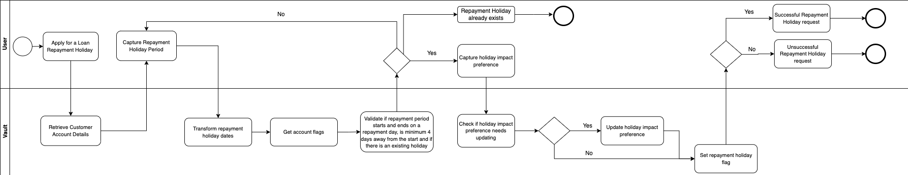

# Process diagrams

Learn about the product specification in relation to business processes and workflows, and the interaction between a customer, the bank (or a user on behalf of the bank), and the Product and Vault Core for the following:

Loan repayment holiday application - when a customer requests a repayment holiday to have a break on making repayments on their Loan account.

## Loan repayment holiday application

For more information about this feature, see [Repayment holiday](/vault-core/5-9/EN/product_library/product_specifications/loan/features#7_repayment_holiday).

