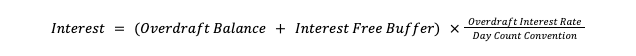

# Product features

The following business features are available with this Product.

## Account Opening

The account application process is unique to each bank. Upon requesting an account to be created in Vault, a number of Parameters are set or inherited. The following lists those parameters and any orchestration that needs to be considered when creating an account in Vault with this product.

### Orchestration

This product supports **Account Tiers** - tiers are assigned to accounts using Vault Flags. Therefore, it is advised that the Account is created in an 'open' state and then a tier Flag is linked to the account.

The product assumes the account is created via Core API in `"ACCOUNT_STATUS_OPEN"` status. The resulting schedules and key dates are subsequently anchored to this creation date. If you wish to create accounts in a different status, for example `"ACCOUNT_STATUS_PENDING"`, or wish to use the Data Loader API, you may need to customise contracts to achieve the desired behaviours.

### Product Parameters

These are set when the product is loaded onto Vault, and are inherited by all accounts upon creation.

chat\_bubble

The schedules for the product have been grouped and configured to run in the following order. This is just an example and can be amended, however please remember any changes could impact the logic of the contract:

Group 1: 1. Interest accrual 2. Interest application

Group 2: 1. Unarranged overdraft fee (before minimum balance fee application so that it is taken into account) 2. Minimum balance fee application 3. Maintenance fee application 4. Inactivity fee application (all fees (except unarranged overdraft fee) are after minimum balance fee application to avoid them causing the minimum balance to be breached)

   
| Name | Parameter Name | Description | Optional |
| --- | --- | --- | --- |
| 
Additional Denominations

 | 

`additional_denominations`

 | 

Currencies that are accepted for this account, formatted as a json list of currency codes

 | 

No

 |
| 

Tier Names

 | 

`account_tier_names`

 | 

JSON encoded list of account tiers used as keys in map-type parameters. Flag definitions must be configured for each used tier. If the account is missing a flag the final tier in this list is used.

 | 

No

 |
| 

Denomination

 | 

`denomination`

 | 

Currency in which the product operates.

 | 

No

 |
| 

Dormancy Flags

 | 

`dormancy_flags`

 | 

The list of flag definitions that indicate an account is dormant. Dormant accounts may incur fees and have their transactions blocked. Expects a string representation of a JSON list.

 | 

No

 |
| 

Excess Fee

 | 

`excess_fee`

 | 

Fee charged for every withdrawal that exceeds the monthly withdrawal limit.

 | 

Yes

 |
| 

Permitted Withdrawals

 | 

`permitted_withdrawals`

 | 

Number of monthly permitted withdrawals. NOTE: Only transactions with the specified transaction type are counted towards this excess fee.

 | 

Yes

 |
| 

Monitored Transaction Type

 | 

`excess_fee_monitored_transaction_type`

 | 

Transaction type being monitored to determine how many operations of this type occurred in the current calendar month period. This parameter will only be used for the assessment of the excessive withdrawal fee.

 | 

Yes

 |
| 

Withdrawal Excess Fee Account

 | 

`excess_fee_income_account`

 | 

Internal account for excess fee income balance.

 | 

No

 |
| 

Block Excess Withdrawals

 | 

`block_excess_withdrawals`

 | 

When configured, if the number of permitted withdrawals is exceeded, any subsequent withdrawals are blocked. If this is not configured, the withdrawal is accepted and the Excess Fee will be applied.

 | 

Yes

 |
| 

Monthly Inactivity Fee

 | 

`inactivity_fee`

 | 

The monthly fee charged for inactivity on an account.

 | 

No

 |
| 

Inactivity Fee Income Account

 | 

`inactivity_fee_income_account`

 | 

Internal account for inactivity fee income balance.

 | 

No

 |
| 

Inactivity Partial Fees Enabled

 | 

`partial_inactivity_fee_enabled`

 | 

Toggles partial payments for inactivity fee

 | 

Yes

 |
| 

Inactivity Fee Application Hour

 | 

`inactivity_fee_application_hour`

 | 

The hour of the day at which inactivity fee is applied.

 | 

No

 |
| 

Inactivity Fee Application Minute

 | 

`inactivity_fee_application_minute`

 | 

The minute of the hour at which inactivity fee is applied.

 | 

No

 |
| 

Inactivity Fee Application Second

 | 

`inactivity_fee_application_second`

 | 

The second of the minute at which inactivity fee is applied.

 | 

No

 |
| 

Inactivity Flags

 | 

`inactivity_flags`

 | 

The list of flag definitions that indicate an account is inactive. Inactive accounts may incur an inactivity fee. Expects a string representation of a JSON list.

 | 

No

 |
| 

Interest Application Precision

 | 

`application_precision`

 | 

Precision needed for interest applications.

 | 

No

 |
| 

Interest Paid Account

 | 

`interest_paid_account`

 | 

Internal account for interest paid.

 | 

No

 |
| 

Interest Received Account

 | 

`interest_received_account`

 | 

Internal account for interest received.

 | 

No

 |
| 

Interest Application Frequency

 | 

`interest_application_frequency`

 | 

The frequency at which interest is applied.

 | 

No

 |
| 

Interest Application Hour

 | 

`interest_application_hour`

 | 

The hour of the day at which interest is applied.

 | 

No

 |
| 

Interest Application Minute

 | 

`interest_application_minute`

 | 

The minute of the hour at which interest is applied.

 | 

No

 |
| 

Interest Application Second

 | 

`interest_application_second`

 | 

The second of the minute at which interest is applied.

 | 

No

 |
| 

Annual Maintenance Fee By Tier

 | 

`annual_maintenance_fee_by_tier`

 | 

The annual fee charged for account maintenance for different tiers.

 | 

No

 |
| 

Annual Maintenance Fee Income Account

 | 

`annual_maintenance_fee_income_account`

 | 

Internal account for annual maintenance fee income balance.

 | 

No

 |
| 

Monthly Maintenance Fee By Tier

 | 

`monthly_maintenance_fee_by_tier`

 | 

The monthly maintenance fee by account tier

 | 

No

 |
| 

Monthly Maintenance Fee Income Account

 | 

`monthly_maintenance_fee_income_account`

 | 

Internal account for monthly maintenance fee income balance.

 | 

No

 |
| 

Monthly Maintenance Partial Fees Enabled

 | 

`partial_maintenance_fee_enabled`

 | 

Toggles partial payments for monthly maintenance fee

 | 

Yes

 |
| 

Maintenance Fees Application Hour

 | 

`maintenance_fee_application_hour`

 | 

The hour of the day at which maintenance fees are applied.

 | 

No

 |
| 

Maintenance Fees Application Minute

 | 

`maintenance_fee_application_minute`

 | 

The minute of the hour at which fees are applied.

 | 

No

 |
| 

Maintenance Fees Application Second

 | 

`maintenance_fee_application_second`

 | 

The second of the minute at which fees are applied.

 | 

No

 |
| 

Maximum Balance Amount

 | 

`maximum_balance`

 | 

The maximum deposited balance amount for the account. Deposits that breach this amount will be rejected.

 | 

No

 |
| 

Tiered Daily Withdrawal Limits

 | 

`tiered_daily_withdrawal_limits`

 | 

The daily withdrawal limits based on account tier. It defines the upper withdrawal limit that cannot be exceeded by Maximum Daily Withdrawal Amount. If above it, the contract will consider the tiered limit as valid

 | 

No

 |
| 

Maximum Daily Deposit Amount

 | 

`maximum_daily_deposit`

 | 

The maximum amount which can be deposited into the account from start of day to end of day.

 | 

No

 |
| 

Maximum Daily Withdrawal Amount

 | 

`maximum_daily_withdrawal`

 | 

The maximum amount that can be withdrawn from the account from start of day to end of day.

 | 

No

 |
| 

Minimum Balance Fee

 | 

`minimum_balance_fee`

 | 

The fee charged if the minimum balance falls below the threshold.

 | 

No

 |
| 

Minimum Balance Threshold By Tier

 | 

`minimum_balance_threshold_by_tier`

 | 

The monthly minimum mean balance threshold by account tier

 | 

No

 |
| 

Minimum Balance Fee Income Account

 | 

`minimum_balance_fee_income_account`

 | 

Internal account for minimum balance fee income balance.

 | 

No

 |
| 

Minimum Balance Fee Application Hour

 | 

`minimum_balance_fee_application_hour`

 | 

The hour of the day at which minimum balance fee is applied.

 | 

No

 |
| 

Minimum Balance Fee Application Minute

 | 

`minimum_balance_fee_application_minute`

 | 

The minute of the hour at which minimum balance fee is applied.

 | 

No

 |
| 

Minimum Balance Fee Application Second

 | 

`minimum_balance_fee_application_second`

 | 

The second of the minute at which minimum balance fee is applied.

 | 

No

 |
| 

Partial Minimum Balance Fees Enabled

 | 

`partial_minimum_balance_fee_application_enabled`

 | 

Enables / Disables partial payments for the Minimum Balance Fee.

 | 

Yes

 |
| 

Minimum Deposit Amount

 | 

`minimum_deposit`

 | 

The minimum amount that can be deposited into the account in a single transaction.

 | 

No

 |
| 

Minimum Withdrawal Amount

 | 

`minimum_withdrawal`

 | 

The minimum amount that can be withdrawn from the account in a single transaction.

 | 

No

 |
| 

Overdraft Interest Rate

 | 

`overdraft_interest_rate`

 | 

The yearly rate at which overdraft interest is accrued.

 | 

Yes

 |
| 

Overdraft Accrued Interest Receivable Account

 | 

`overdraft_interest_receivable_account`

 | 

Internal account for overdraft accrued interest receivable balance.

 | 

Yes

 |
| 

Overdraft Accrued Interest Received Account

 | 

`overdraft_interest_received_account`

 | 

Internal account for overdraft accrued interest received balance.

 | 

Yes

 |
| 

Interest Free Buffer Days

 | 

`interest_free_buffer_days`

 | 

Maximum number of consecutive days that the account can benefit from the interest free buffer. If the number is exceeded, the buffer no longer applies and overdraft interest is accrued on the entire overdrawn balance. The count is reset by the account balance being positive at end of day. When not defined, the buffer amount always applies. See Interest Free Buffer Amount for more details.

 | 

Yes

 |
| 

Interest Free Buffer Amount

 | 

`interest_free_buffer_amount`

 | 

Courtesy amount that will be added to the customer’s EOD overdraft balance reducing or eliminating the overdraft interest accrued. If it is not explicitly set, the buffer amount will be equal to the overdraft balance for the duration of the buffer period. See Interest Free Buffer Days for more details.

 | 

Yes

 |
| 

Autosave Rounding Amount

 | 

`roundup_autosave_rounding_amount`

 | 

For any given spend with the primary denomination, this is the figure to round up to: the nearest multiple higher than the transaction amount. Only used if `autosave_savings_account` is defined and if the transaction type is eligible (see Autosave Transaction Types)

 | 

Yes

 |
| 

Autosave Transaction Types

 | 

`roundup_autosave_transaction_types`

 | 

The list of transaction types eligible for autosave. Expects a JSON-encoded list

 | 

Yes

 |
| 

Tiered Gross Interest Rate

 | 

`tiered_interest_rates`

 | 

Map Of Minimum Balance To Gross Interest Rate For Positive Balances.

 | 

No

 |
| 

Accrued Interest Payable Account

 | 

`accrued_interest_payable_account`

 | 

Internal account for accrued interest payable balance.

 | 

No

 |
| 

Accrued Interest Receivable Account

 | 

`accrued_interest_receivable_account`

 | 

Internal account for accrued interest receivable balance.

 | 

No

 |
| 

Interest Accrual Days In Year

 | 

`days_in_year`

 | 

The days in the year for interest accrual calculation. Valid values are “actual”, “366”, “365”, “360”

 | 

No

 |
| 

Interest Accrual Precision

 | 

`accrual_precision`

 | 

Precision needed for interest accruals.

 | 

No

 |
| 

Interest Accrual Hour

 | 

`interest_accrual_hour`

 | 

The hour of the day at which interest is accrued.

 | 

No

 |
| 

Interest Accrual Minute

 | 

`interest_accrual_minute`

 | 

The minute of the hour at which interest is accrued.

 | 

No

 |
| 

Interest Accrual Second

 | 

`interest_accrual_second`

 | 

The second of the minute at which interest is accrued.

 | 

No

 |
| 

Unarranged Overdraft Fee

 | 

`unarranged_overdraft_fee`

 | 

The daily fee charged for being in unarranged overdraft.

 | 

Yes

 |
| 

Unarranged Overdraft Fee Cap

 | 

`unarranged_overdraft_fee_cap`

 | 

A monthly cap on accumulated fees for entering an unarranged overdraft.

 | 

Yes

 |
| 

Unarranged Overdraft Fee Income Account

 | 

`unarranged_overdraft_fee_income_account`

 | 

Internal account for overdraft fee income balance.

 | 

Yes

 |
| 

Unarranged Overdraft Fee Receivable Account

 | 

`unarranged_overdraft_fee_receivable_account`

 | 

Internal account for overdraft fee receivable account.

 | 

Yes

 |
| 

Unarranged Overdraft Fee Application Hour

 | 

`unarranged_overdraft_fee_application_hour`

 | 

The hour of the day at which unarranged overdraft fee is applied.

 | 

No

 |
| 

Unarranged Overdraft Fee Application Minute

 | 

`unarranged_overdraft_fee_application_minute`

 | 

The minute of the hour at which unarranged overdraft fee is applied.

 | 

No

 |
| 

Unarranged Overdraft Fee Application Second

 | 

`unarranged_overdraft_fee_application_second`

 | 

The second of the minute at which unarranged overdraft fee is applied.

 | 

No

 |

### Account Parameters

These are set at the point of account creation.

   
| Name | Parameter Name | Description | Optional |
| --- | --- | --- | --- |
| 
Inactivity Fee Application Day

 | 

`inactivity_fee_application_day`

 | 

The day of the month on which inactivity fee is applied. If day does not exist in application month, applies on last day of month.

 | 

No

 |
| 

Interest Application Day

 | 

`interest_application_day`

 | 

The day of the month on which interest is applied. If day does not exist in application month, applies on last day of month.

 | 

No

 |
| 

Maintenance Fees Application Day

 | 

`maintenance_fee_application_day`

 | 

The day of the month on which maintenance fee is applied. If day does not exist in application month, applies on last day of month.

 | 

No

 |
| 

Maximum Daily Withdrawal Amount

 | 

`daily_withdrawal_limit_by_transaction_type`

 | 

The maximum amount that can be withdrawn from an account over the current day by transaction type.

 | 

No

 |
| 

Minimum Balance Fee Application Day

 | 

`minimum_balance_fee_application_day`

 | 

The day of the month on which minimum balance fee is applied. If day does not exist in application month, applies on last day of month.

 | 

No

 |
| 

Arranged Overdraft Amount

 | 

`arranged_overdraft_amount`

 | 

An agreed amount which the customer may use to borrow funds

 | 

Yes

 |
| 

Unarranged Overdraft Amount

 | 

`unarranged_overdraft_amount`

 | 

An additional borrowing amount which may be used to validate balance checks when going beyond the agreed borrowing limit

 | 

Yes

 |
| 

Autosave Account

 | 

`roundup_autosave_account`

 | 

The account credited with Round-up Autosave amounts

 | 

Yes

 |
| 

Round-up Autosave Active

 | 

`roundup_autosave_active`

 | 

Switch that controls if the Round-up autosave feature is active or disabled.

 | 

No

 |
| 

Unarranged Overdraft Application Day

 | 

`unarranged_overdraft_fee_application_day`

 | 

The day of the month on which unarranged overdraft fee is applied. If day does not exist in application month, applies on last day of month.

 | 

No

 |

### Derived Parameters

These are set by the product - specifically logic within the Smart Contract and are determined when requested. They cannot be directly updated.

   
| Name | Parameter Name | Description | Optional |
| --- | --- | --- | --- |
| 
Account Tier Name

 | 

`account_tier_name`

 | 

Account tier name of the account

 | 

No

 |

## Account Tiers (CPP-1918)

Account tiers define the configurations of one or more features available on the product. This feature is applicable to funds denominated in the **Primary Denomination** of the account.

For the complete description, configuration options and behaviour of this feature, see [Account Tiers](/vault-core/5-9/EN/product_library/common_business_features/account#account_tiers_cpp_1918).

## Monthly Maintenance Fee (CPP-1921)

The monthly maintenance fee - also known as the monthly service fee - is typically charged for holding an account and the provision of services that accompany the account, such as online banking, debit card usage, and ATM access. The specific amount of the fee and the services it covers can vary depending on the bank and the type of deposit account.

The monthly maintenance fee can also be optionally waived under certain criteria. These are product specific and are defined against each of the products.

This feature is applicable to funds denominated in the Primary Denomination of the account.

For the complete description, configuration options and behaviour of this feature, see [Monthly Maintenance Fee](/vault-core/5-9/EN/product_library/common_business_features/fees#monthly_maintenance_fee_cpp_1921).

## Annual Maintenance Fee (CPP-1971)

### Description

The annual maintenance fee - also known as the annual service fee - is charged for holding an account and the provision of services that accompany the account, such as online banking, debit card usage, and ATM access. The specific amount of the fee and the services it covers can vary depending on the bank and the type of deposit account.

This feature is applicable to funds denominated in the **Primary Denomination** of the account.

### Configuration Options

Annual Maintenance Fee: The fixed amount charged annually. This is configured by **Account Tier**.

### Business Feature Behaviour

  
| ID | Title | Behaviour |
| --- | --- | --- |
| 
01

 | 

Configuring the annual Maintenance Fee for a product

 | 

**GIVEN** a bank offers a product **WHEN** configuring the product **THEN** the bank is able to define the annual maintenance fee

 |
| 

02

 | 

Setting the annual Maintenance Fee on an account

 | 

**GIVEN** a bank offers a product where an annual maintenance fee has been configured **WHEN** a customer opens an account **THEN** the annual maintenance fee is set as per the product configuration

 |
| 

03

 | 

Applying an annual fee

 | 

**GIVEN** a customer has opened an account on the 1 January 2020 **WHEN** it is 12 months later (1 January 2021) **THEN** the maintenance fee will be applied

 |
| 

04

 | 

Scheduled application falls on day 29-31 of the month

 | 

**GIVEN** the fee is due to be applied on day 29, 30, or 31 of the month **WHEN** the day does not exist **THEN** the fee is applied on the previous day

 |

## Permitted Primary Denomination (CPP-1908)

Configuring the primary denomination in which the product can transact. Transactions which are not denominated in the primary denomination are rejected if the product only supports a single currency.

For the complete description, configuration options and behaviour of this feature, see [Permitted Primary Denomination](/vault-core/5-9/EN/product_library/common_business_features/currency_and_denomination#permitted_primary_denomination_cpp_1908).

## Multi-Currency Support (CPP-2121)

Configuring the additional supported denominations in which the product can transact in addition to the primary denomination. Transactions which are not denominated in one of the configured supported denominations are rejected.

For the complete description, configuration options and behaviour of this feature, see [Multi-Currency Support](/vault-core/5-9/EN/product_library/common_business_features/currency_and_denomination#multi_currency_support_cpp_2121).

## Minimum Deposit Amount per Transaction (CPP-1987)

Setting the minimum amount customers can deposit into their accounts in a single deposit transaction, where deposits that are less than the minimum deposit amount will be rejected. This feature is applicable to funds denominated in the Primary Denomination of the account.

For the complete description, configuration options and behaviour of this feature, see [Minimum Deposit Amount per Transaction](/vault-core/5-9/EN/product_library/common_business_features/deposits_withdrawals#minimum_deposit_amount_per_transaction_cpp_1987).

## Maximum Daily Deposit Limit (CPP-1988)

The maximum daily deposit limit to set a limit to the sum of the deposits that can be made into an account in a single day. Deposit transactions that exceed this limit are rejected. This feature is applicable to funds denominated in the Primary Denomination of the account.

For the complete description, configuration options and behaviour of this feature, see [Maximum Daily Deposit Limit](/vault-core/5-9/EN/product_library/common_business_features/deposits_withdrawals#maximum_daily_deposit_limit_cpp_1988).

## Round Up Autosave (CPP-1985)

### Description

This feature automatically transfers a configurable amount to a nominated account upon each debit transaction of a certain type. Autosave transfers are only triggered by debits in the primary denomination of the account.

The amount autosaved is dependent on the rounding that has been configured. The following table provides examples of the amounts autosaved based on the configuration and amount spent.

  
| Autosave Configuration | Amount Spent | \= Amount Autosaved |
| --- | --- | --- |
| 
1

 | 

1.5

 | 

0.5

 |
| 

100

 | 

3,123

 | 

77

 |

### Configuration Options

-   Enable Autosave: Configuration to enable or disable this feature.
    
-   Rounding multiplier: The nearest multiple that is larger than the amount spent.
    
-   Autosave account: The linked round up autosave account in which the autosave transfers are credited.
    
    chat\_bubble
    
    If there are any restrictions on the autosave account, it may result in the autosave transfers being rejected.
    
-   Transaction types: The transaction types that are eligible are configurable. For example, if the purchase is one of the transaction types configured, then any Posting that contains `transaction_type : purchase` in the instruction details triggers an autosave transaction.
    

### Business Feature Behaviour

  
| ID | Title | Behaviour |
| --- | --- | --- |
| 
01

 | 

Configuring rounding amount for round up autosave for a product

 | 

**GIVEN** a bank offers a deposit product **WHEN** configuring the product **THEN** the bank is able to define the rounding amount to be transferred upon each round up autosave transfer

 |
| 

02

 | 

Configuring the transaction types that trigger round up autosave

 | 

**GIVEN** a bank offers a deposit product **WHEN** configuring the round up autosave feature **THEN** the bank is able to define the transaction types that trigger an round up autosave transfer

 |
| 

03

 | 

Setting the rounding amount for round up autosave for an account

 | 

**GIVEN** a bank offers a deposit product **AND** the bank has configured the rounding amount to be used in each round up autosave transfer **WHEN** an account is opened **THEN** rounding amount to be used in each round up autosave is set

 |
| 

04

 | 

Linking a nominated account

 | 

**GIVEN** a bank offers a deposit product **AND** round up autosave is enabled **WHEN** an account is opened with a defined linked (round up autosave) account **THEN** the account is linked to the new account

 |
| 

05

 | 

Enable round up autosave during the life of the account

 | 

**GIVEN** a bank offers a deposit product with the round up autosave feature **AND** an account is open **WHEN** round up autosave is enabled on the account **THEN** round up autosave transfers are created on the back of each valid transaction

 |
| 

06

 | 

Disable round up autosave during the life of the account

 | 

**GIVEN** a bank offers a deposit product with the round up autosave feature **AND** an account is open **WHEN** round up autosave is disabled on the account **THEN** round up autosave transfers are not created on the back of any transaction

 |
| 

07

 | 

Round up autosave creates a transfer when the account balance is positive

 | 

**GIVEN** there is a deposit account with round up autosave enabled **AND** an round up autosave rounding amount is set to 1 **AND** the deposit account has a balance of 5 **WHEN** when an outbound transaction of 1.50 is made **THEN** 0.50 is transferred into the linked account **AND** the remaining balance in the deposit account is 3

 |
| 

08

 | 

Round up autosave transaction is only applied to the primary denomination

 | 

**GIVEN** there is a deposit account with round up autosave enabled **AND** the primary denomination is set **WHEN** there is a debit in a denomination which is not the primary denomination **THEN** there is no round up autosave transaction

 |

## Maximum Daily Transaction Limit per Transaction Type (CPP-2006)

A daily limit placed on the sum of each type of debit transaction. If there is a transaction that would result in one of the limits being breached, then that transaction is rejected.

chat\_bubble

If the product supports Account Tiers, the limits set on the account are validated against the limits defined on the tier assigned to the account to ensure the account limits do not exceed those defined by the tier.

This feature is applicable to funds denominated in the Primary Denomination of the account.

For the complete description, configuration options and behaviour of this feature, see [Maximum Daily Transaction Limit per Transaction Type](/vault-core/5-9/EN/product_library/common_business_features/deposits_withdrawals#minimum_withdrawal_amount_per_transaction_cpp_1976).

## Minimum Withdrawal Amount per Transaction (CPP-1976)

The minimum amount that can be withdrawn or transferred out of an account in a single transaction. This feature is applicable to funds denominated in the Primary Denomination of the account.

For the complete description, configuration options and behaviour of this feature, see [Minimum Withdrawal Amount per Transaction](/vault-core/5-9/EN/product_library/common_business_features/deposits_withdrawals#minimum_withdrawal_amount_per_transaction_cpp_1976).

## Maximum Daily Withdrawal Limit (CPP-2166)

A daily limit placed on the sum of all withdrawals. If there is a withdrawal that would result in the limit being breached, then that withdrawal is rejected. This feature is applicable to funds denominated in the Primary Denomination of the account.

For the complete description, configuration options and behaviour of this feature, see [Maximum Daily Withdrawal Limit](/vault-core/5-9/EN/product_library/common_business_features/deposits_withdrawals#maximum_daily_withdrawal_limit_cpp_2166).

## Number of Withdrawals Permitted and Excess Withdrawal Fee (CPP-1965)

This feature allows you to set a limit on the number of withdrawals that are permitted per calendar month. When the number of permitted withdrawals is exceeded, the subsequent withdrawals are rejected or an excess withdrawal fee is charged.

This feature is applicable to funds denominated in the Primary Denomination of the account.

For the complete description, configuration options and behaviour of this feature, see [Number of Withdrawals Permitted and Excess Withdrawal Fee](/vault-core/5-9/EN/product_library/common_business_features/fees#number_of_withdrawals_permitted_and_excess_withdrawal_fee_cpp_1965).

## Minimum Balance Threshold and Fee (CPP-1922)

To support products that require accounts to hold a minimum deposit to avoid charging a minimum balance fee. The minimum balance fee is applied when the Monthly Average Balance (MAB) for an account is not above a configured threshold.

For the complete description, configuration options and behaviour of this feature, see [Minimum Balance Threshold and Fee](/vault-core/5-9/EN/product_library/common_business_features/fees#minimum_balance_threshold_and_fee_cpp_1922).

## Maximum Balance Limit (CPP-1986)

Maximum balance limit on the account in the primary denomination, where credits that would breach this limit are rejected. This feature is applicable to funds denominated in the Primary Denomination of the account.

For the complete description, configuration options and behaviour of this feature, see [Maximum Balance Limit](/vault-core/5-9/EN/product_library/common_business_features/limits#maximum_balance_limit_cpp_1986).

## Scheduled Deposit Interest Accrual (CPP-1912)

Daily interest accrual model for deposit balances using the partial balance method, where portions of the balance accrue interest at different interest rates, based on the configured interest rate tier. This feature is applicable to funds denominated in the Primary Denomination of the account.

For the complete description, configuration options and behaviour of this feature, see [Scheduled Deposit Interest Accrual](/vault-core/5-9/EN/product_library/common_business_features/interest_and_amortisation#scheduled_deposit_interest_accrual_cpp_1912).

## Scheduled Deposit Interest Application (CPP-1913)

Any accrued interest balance on an account is re-booked to the deposit balance on a periodic basis. The frequency at which interest is applied is configurable. This feature is applicable to funds denominated in the Primary Denomination of the account.

For the complete description, configuration options and behaviour of this feature, see [Scheduled Deposit Interest Application](/vault-core/5-9/EN/product_library/common_business_features/interest_and_amortisation#scheduled_deposit_interest_application_cpp_1913).

## Arranged Overdraft (CPP-1916)

An overdraft can be arranged upfront with a customer prior to its utilisation. A limit is agreed upon, and any debit transactions in violation of this limit will be rejected. If the limit is updated to a value that is less than the overdrawn amount, then all subsequent debit transactions are rejected until the overdrawn amount is brought to a level less than the limit.

For the complete description, configuration options and behaviour of this feature, see [Arranged Overdraft](/vault-core/5-9/EN/product_library/common_business_features/overdraft#arranged_overdraft_cpp_1916).

## Overdraft Interest (CPP-1968)

### Description

​​The daily overdraft interest model for accounts that are utilising this facility, if available. Overdraft interest is accrued on the total overdraft balance that is in overdraft and is calculated using the following formula:

chat\_bubble

-   This feature is applicable to funds denominated in the **Primary Denomination** of the account.
    
-   The total overdraft balance can be composed of both an **Arranged Overdraft** and an **Unarranged Overdraft** portion, where the unarranged overdraft supplements, that is \`added on to', the arranged overdraft balance.
    
-   The optional **Overdraft Interest-Free buffer** feature can be configured to reduce the amount of overdraft interest that is accrued.
    
-   The overdraft interest accrual and application frequency are inherited from the corresponding configurations set for both **Scheduled Deposit Interest Accrual** and **Scheduled Deposit Interest Application**.
    

### Configuration Options

-   Overdraft interest rate: The rate at which overdraft interest is accrued.
    
-   The following configuration is inherited from the options selected as part of the **Scheduled Deposit Interest Accrual** and **Scheduled Deposit Interest Application** features. This includes:
    
    -   Interest accrual time
        
    -   Interest application time
        
    -   Interest application frequency
        
    -   Day count convention
        
    -   Interest accrual precision
        
    

### Business Feature Behaviour

  
| ID | Title | Behaviour |
| --- | --- | --- |
| 
01

 | 

Configuring the overdraft interest rate for a product

 | 

**GIVEN** a bank offers a deposit product **WHEN** configuring the product **THEN** the bank is able to specify an overdraft interest rate

 |
| 

02

 | 

Setting the overdraft interest rate for an account

 | 

**GIVEN** a bank offers a deposit product **AND** has configured the overdraft interest rate **WHEN** an account is opened **THEN** the overdraft interest rate is set based on the product configuration

 |
| 

03

 | 

Accruing overdraft interest

 | 

**GIVEN** there is a deposit account **AND** the balance is -50 **AND** the overdraft interest rate is 2% **AND** the bank has configured interest to be rounded to 5 decimal places when accrued **AND** the day count convention is set to 365 **WHEN** it is the scheduled interest accrual time **THEN** the following overdraft interest is accrued on the account: = -50 \* (2/365) = -0.27397 (Refer to the overdraft interest calculation formula in the description)

 |
| 

04

 | 

Applying the accrued overdraft interest

 | 

**GIVEN** there is a deposit account **AND** there is an accrued overdraft interest balance of -0.27397 **AND** the bank has configured interest to be rounded to 2 decimal places upon application **WHEN** it is the scheduled interest application time on the interest application day **THEN** the accrued overdraft interest of -0.27 to the balance on the account

 |

## Overdraft Interest-Free Buffer (CPP-1973)

### Description

The overdraft interest-free buffer can include two options which operate independently of each other to reduce the amount of overdraft interest that is accrued on an account when it is utilising the overdraft facility:

-   An interest-free buffer which is an amount that corresponds to the portion of the current overdraft balance that is excluded from the overdraft interest calculation, and therefore accrual.
    
-   An overdraft period during which no overdraft interest is accrued. The overdraft period begins when the account first enters overdraft, and ends when either the period ends, in which case overdraft interest is accrued, or the account exits overdraft.
    

This feature is applicable to funds denominated in the Primary Denomination of the account.

### Configuration Options

-   Interest-free buffer amount: Defines amount up to which overdraft interest is not charged when an account is in overdraft
    
-   Interest-free buffer days: Defines the number of days before the overdraft interest-free buffer amount expires and is reset each time the account exits overdraft
    

### Business Feature Behaviour

  
| ID | Title | Behaviour |
| --- | --- | --- |
| 
01

 | 

Configuring the overdraft interest-free buffer amount for a deposit product

 | 

**GIVEN** a bank offers the deposit product **WHEN** configuring the product **THEN** the bank is able to define the overdraft interest-free buffer amount

 |
| 

02

 | 

Configuring the overdraft interest-free buffer days for a deposit product

 | 

**GIVEN** a bank offers the deposit product **WHEN** configuring the product **THEN** the bank is able to define the number of overdraft interest-free buffer days

 |
| 

03

 | 

Only the Interest-Free Buffer amount has been set and account balance is below Interest-Free Buffer amount

 | 

**GIVEN** there is a deposit account with an overdraft facility **AND** the overdraft interest-free buffer amount is 100 **AND** the overdraft interest-free buffer period is not set **AND** the account is overdrawn by 50 **WHEN** interest is due to be accrued **THEN** no interest is accrued on the overdrawn amount

 |
| 

04

 | 

Only the Interest-Free Buffer amount has been set and account balance is above Interest-Free Buffer amount

 | 

**GIVEN** there is a deposit account with an overdraft facility **AND** the overdraft interest-free buffer amount is 100 **AND** the overdraft interest-free buffer period is not set **AND** the account is overdrawn by 150 **WHEN** interest is due to be accrued **THEN** overdraft interest is accrued on the portion that is exceeds the buffer amount (i.e. 150-100 = 50)

 |
| 

05

 | 

Only the Interest-Free Buffer period has been set and a credit resets the overdraft interest-free period

 | 

**GIVEN** there is a deposit account with an overdraft facility **AND** the overdraft interest-free buffer amount is not set **AND** the overdraft interest-free buffer period is set to 5 days **AND** there is a debit resulting in the account being overdrawn **WHEN** there is a credit within 5 days of the debit that results in the balance being equal to or greater than 0 **THEN** no overdraft interest is accrued

 |
| 

06

 | 

Only the Interest-Free Buffer period has been set and a credit is received after the interest-free period has expired

 | 

**GIVEN** there is a deposit account with an overdraft facility **AND** the overdraft interest-free buffer amount is not set **AND** the overdraft interest-free buffer period is set to 5 days **AND** there is a debit of 50 **WHEN** there is a credit after 5 days that results in the balance being equal to or greater than 0 **THEN** overdraft interest is accrued on the days after the interest-free buffer period where the balance was less than 0

 |
| 

07

 | 

Interest-Free Buffer amount and period have been set and account balance is below or equal to buffer amount and within buffer period

 | 

**GIVEN** there is a deposit account with an overdraft facility **AND** the overdraft interest-free buffer amount is 100 **AND** the overdraft interest-free buffer period is 5 days **AND** the account is overdrawn by 50 **WHEN** 5 days have passed since the account entered the overdraft **AND** interest is due to be accrued **THEN** overdraft interest is accrued on the 50

 |
| 

08

 | 

Interest-Free Buffer amount and period have been set and account balance is above buffer amount outside buffer period

 | 

**GIVEN** there is a deposit account with an overdraft facility **AND** the overdraft interest-free buffer amount is 100 **AND** the overdraft interest-free buffer period is 5 **AND** the account balance is 0 **WHEN** there is a debit of 150 **THEN** overdraft interest accrued on the 50 amount for 5 days **AND** overdraft interest is accrued on the 150 amount after 5 days

 |
| 

09

 | 

Interest-Free Buffer amount and period have not been set

 | 

**GIVEN** there is a deposit account with an overdraft facility **AND** the overdraft interest-free buffer amount is not set **AND** the overdraft interest-free buffer period is not set **AND** the account balance is 0 **WHEN** there is a debit of 50 **THEN** overdraft interest is accrued on the total overdrawn amount

 |

## Unarranged Overdraft and Unarranged Overdraft Fee (CPP-1974)

### Description

Setting an unarranged overdraft on an account with a chargeable fee. Debit transactions that result in the limit being exceeded will be rejected. Fees can be capped in order to limit the accumulation of unarranged overdraft fees.

chat\_bubble

If the product supports an **Unarranged Overdraft** in addition to an **Arranged Overdraft**, then the account can be overdrawn by the total of the arranged and unarranged overdraft amounts before debit transactions are rejected. This feature is applicable to funds denominated in the **Primary Denomination** of the account.

### Configuration Options

-   Unarranged overdraft amount: The maximum amount an account can be overdrawn using the unarranged overdraft.
    
-   Unarranged overdraft fee: The daily fee amount that is accrued on an account that is in overdraft.
    
-   Unarranged overdraft monthly fee cap: The maximum amount that can be charged in unarranged overdraft fees per month. The cap is reset on the fee application day.
    
-   Unarranged overdraft fee accrual time: The time at which the fee is accrued on a daily basis.
    
-   Unarranged overdraft fee application day of month: The day of the month on which the accrued fees are applied. If the scheduled day falls on a date that does not exist, such as 30 February, then it is rescheduled to the previous day.
    
-   Unarranged overdraft fee application time: The time at which the accrued fees are applied on the unarranged overdraft fee application day.
    

### Business Feature Behaviour

  
| ID | Title | Behaviour |
| --- | --- | --- |
| 
01

 | 

Configuring the unarranged overdraft amount

 | 

**GIVEN** a bank offers a deposit product **WHEN** an account is opened **THEN** the bank is able to specify an unarranged overdraft amount

 |
| 

02

 | 

Utilising the unarranged overdraft

 | 

**GIVEN** there is a deposit account **AND** the balance on the account is 0 **AND** there is an arranged overdraft amount of 100 **AND** the unarranged overdraft amount is 300 **WHEN** there is a request to withdraw 250 **THEN** the withdrawal is accepted **AND** the account balance will be -250

 |
| 

03

 | 

No overdraft when the unarranged overdraft amount not set

 | 

**GIVEN** there is a deposit account **AND** the balance on the account is 0 **AND** there is an arranged overdraft of 100 **AND** the unarranged overdraft amount has not been set **WHEN** the customer makes a withdrawal of 150 **THEN** the withdrawal will be rejected

 |
| 

04

 | 

Rejecting a withdrawal that would exceed the unarranged overdraft amount

 | 

**GIVEN** there is a deposit account **AND** the balance on the account is 0 **AND** there is an arranged overdraft of 100 **AND** the unarranged overdraft amount is 50 **WHEN** there is a withdrawal request of 250 **THEN** the withdrawal will be rejected because it exceeds the total available overdraft of 150

 |
| 

05

 | 

Unarranged overdraft use when arranged amount is set to zero

 | 

***GIVEN*** a bank offers a deposit product **AND** the balance on the account is 0 **AND** there is no arranged overdraft **AND** the unarranged overdraft amount is set to 100 **WHEN** the customer attempts to make a withdrawal of 50 **THEN** the withdrawal will be accepted because it does not exceed the total available overdraft of 100

 |
| 

06

 | 

Configuring the unarranged overdraft fee for a deposit product

 | 

**GIVEN** a bank offers a deposit product **WHEN** configuring the product **THEN** the bank is able to define an unarranged overdraft fee

 |
| 

07

 | 

Setting the unarranged overdraft fee on an account

 | 

**GIVEN** a bank offers a deposit product where an unarranged overdraft fee is set **WHEN** an account is opened **THEN** the unarranged overdraft fee is set on the opened account based on the product configuration

 |
| 

08

 | 

Configurable unarranged overdraft fee accrual time

 | 

**GIVEN** the product has been configured to accrue the unarranged overdraft fee at HH:MM:SS **AND** there is an account that is utilising an unarranged overdraft **WHEN** it is HH:MM:SS **THEN** the unarranged overdraft fee will be accrued to the account

 |
| 

09

 | 

Unarranged overdraft fee application day

 | 

**GIVEN** the product has been configured to apply the unarranged overdraft fee **WHEN** an account is opened **THEN** the bank is able to define the day of the month on which the fee is applied for that account

 |
| 

10

 | 

Configurable unarranged overdraft fee application time for the product

 | 

**GIVEN** the product has been configured to apply the unarranged overdraft fee at HH:MM:SS **AND** there is an account that is utilising an unarranged overdraft **WHEN** it is HH:MM:SS **THEN** the unarranged overdraft fee will be applied to the account **AND** the monthly fee cap is reset

 |
| 

11

 | 

Accruing the overdraft fee when the customer is using their unarranged overdraft

 | 

**GIVEN** there is a deposit account **AND** the account is utilising an unarranged overdraft **AND** the configured unarranged overdraft fee is set to 5 **AND** the bank has configured the product to accrue the fee at HH:MM:SS **WHEN** it is HH:MM:SS **THEN** the unarranged overdraft fee of 5 will be accrued

 |
| 

12

 | 

Applying the accrued unarranged overdraft fee

 | 

**GIVEN** there is a deposit account **AND** the account has an accrued unarranged overdraft balance **AND** the bank has configured the product to apply the fee at HH:MM:SS **WHEN** it is HH:MM:SS on the unarranged overdraft application day **THEN** any accrued unarranged overdraft fees will be applied to the deposit balance.

 |
| 

13

 | 

Setting the unarranged overdraft fee cap for the deposit product

 | 

**GIVEN** a bank offers a deposit product **WHEN** configuring the product **THEN** the bank is able to define an unarranged overdraft fee cap

 |
| 

14

 | 

Setting the unarranged overdraft fee cap for an account

 | 

**GIVEN** a bank offers a deposit product where an unarranged overdraft fee cap is set **WHEN** an account is opened **THEN** the unarranged overdraft monthly fee cap is set based on the product configuration

 |
| 

15

 | 

Setting the unarranged overdraft fee cap to zero

 | 

**GIVEN** a bank offers a deposit product where the unarranged overdraft fee cap is set to zero **WHEN** an account is opened **THEN** no unarranged overdraft fee cap is set

 |
| 

16

 | 

No fee when the customer has reached their fee cap for the month

 | 

**GIVEN** there is a deposit account **AND** the unarranged overdraft is being utilised **AND** the unarranged overdraft fee cap is set to 15 **AND** the accumulated unarranged overdraft fees on the account for the current month is 15 **WHEN** another day passes **AND** it is the current month **THEN** no additional unarranged overdraft fees are applied to the account

 |
| 

17

 | 

Scheduled application falls on day 29-31 of the month

 | 

**GIVEN** the unarranged overdraft fee is due to be applied on day 29, 30, or 31 of the month **WHEN** the day does not exist **THEN** the fee is applied on the previous day

 |

## Inactivity and Inactivity Fee (CPP-2031)

The option to mark an account as inactive. This feature is applicable to funds denominated in the Primary Denomination of the account.

For the complete description, configuration options and behaviour of this feature, see [Inactivity and Inactivity Fee](/vault-core/5-9/EN/product_library/common_business_features/fees#inactivity_and_inactivity_fee_cpp_2031).

## Dormancy (CPP-1911)

While the definition of dormant varies, this typically occurs when there has been no activity on the account (e.g. transactions) for an extended period of time. When an account is marked as dormant, transactions on the account are restricted until it is reactivated, and the charging of fees is paused.

For the complete description, configuration options and behaviour of this feature, see [Dormancy](/vault-core/5-9/EN/product_library/common_business_features/account#dormancy_cpp_1911).

## Deposit Interest Application upon Account Closure (CPP-1967)

The account closure process is initiated and managed by the bank. This feature supports this process by applying any interest that has been accrued when the Vault account status is set to \`pending closure'.

For the complete description, configuration options and behaviour of this feature, see [Deposit Interest Application upon Account Closure](/vault-core/5-9/EN/product_library/common_business_features/interest_and_amortisation#deposit_interest_application_upon_account_closure_cpp_1967).

## Current Account Specific Requirements (CPP-2396)

### Purpose

Aim of this section is to specify the acceptance criteria for the Current Account product.

### 1 Monthly Maintenance Fee

#### Description

For deposit products with an overdraft, the following additional acceptance criteria should apply.

#### Business Feature Behaviour

  
| ID | Title | Behaviour |
| --- | --- | --- |
| 
01

 | 

Applying the Maintenance Fee with insufficient funds and available overdraft limit while partial fee payment allowed

 | 

**GIVEN** the Maintenance Fee of 5 is chargeable on an account\*AND\* the insufficient account balance of 3 to cover the fee in full\*AND\* there is an overdraft limit of 500 available\*AND\* the partial fee payment is allowed **WHEN** the fee is applied **THEN** the bank collects the funds available on the account reducing its' balance to zero **AND** the remaining fee amount of 2 is collected from the available overdraft limit

 |

### 2 Monthly Maintenance Fee Waivers

#### Description

The Monthly Maintenance Fee can be waived (not charged) under certain defined criteria that are specific to the Current Account product. If any of the criteria are met at the time when the fee is applied, the fee will be waived.

#### Configuration Options

-   Minimum Balance Threshold - the Monthly Average Balance threshold that must be met in order to waive the Maintenance Fee.
    

#### Business Feature Behaviour

  
| ID | Title | Behaviour |
| --- | --- | --- |
| 
01

 | 

Configuring Maintenance Fee Waiver

 | 

**GIVEN** a bank offers a product **WHEN** configuring a Maintenance Fee Waiver\*THEN\* the bank can configure whether it is enabled or disabled for all accounts

 |
| 

02

 | 

Configuring the Minimum Balance Threshold

 | 

**GIVEN** a bank offers a product **WHEN** configuring the waiver based on the Monthly Average Balance\*THEN\* the bank can define the Minimum Balance Threshold that must be met in order to waive the Maintenance Fee for all accounts

 |
| 

03

 | 

Configuring the Minimum Balance Threshold via Account Tiers

 | 

**GIVEN** a bank offers a product **WHEN** configuring the Minimum Balance Threshold via Account Tiers\*THEN\* the threshold defined via Account Tiers will take precedence over other defined values

 |
| 

04

 | 

Waiving based on the Monthly Average Balance (MAB)

 | 

**GIVEN** a customer has an account where the waiver based on the Monthly Average Balance is enabled\*WHEN\* the Monthly Average Balance is equal to or greater than the Minimum Balance Threshold at the time of Maintenance Fee application\*THEN\* the Monthly Maintenance Fee is waived

 |

#### Supplemental Information

Steps to calculate the Monthly Average Balance (MAB) are covered in [Minimum Balance Threshold and Fee](/vault-core/5-9/EN/product_library/common_business_features/fees#minimum_balance_threshold_and_fee_cpp_1922) The threshold for each waiver can be configured per Account Tier see [Account Tiers](/vault-core/5-9/EN/product_library/common_business_features/account#account_tiers_cpp_1918)

### 3 Minimum Balance Fee with Overdraft

#### Description

For deposit products with an overdraft, the following additional acceptance criteria should apply.

#### Business Feature Behaviour

  
| ID | Title | Behaviour |
| --- | --- | --- |
| 
01

 | 

Minimum Balance Fee collection with insufficient funds and available overdraft limit while partial fee payment allowed

 | 

**GIVEN** the Minimum Balance Fee of 10 is chargeable on an account **AND** an insufficient account balance of 6 to cover the fee in full **AND** there is an overdraft limit of 500 available **AND** the partial fee payment is allowed **WHEN** the fee is applied **THEN** the bank collects the funds available on the account reducing its balance to zero **AND** the remaining fee amount of 4 is collected from the available overdraft limit

 |

### 4 Inactivity Fee with Overdraft

#### Description

For deposit products with an overdraft, the following additional acceptance criteria should apply.

#### Business Feature Behaviour

  
| ID | Title | Behaviour |
| --- | --- | --- |
| 
01

 | 

Applying the Inactivity Fee with insufficient funds and available overdraft limit while partial fee payment allowed

 | 

**GIVEN** the Inactivity Fee of 10 is chargeable on an account **AND** the insufficient account balance of 3 to cover the fee in full **AND** there is an overdraft limit of 500 available **AND** the partial fee payment is allowed **WHEN** the fee is applied **THEN** the bank collects the funds available on the account reducing its' balance to zero **AND** the remaining fee amount of 7 is collected from the available overdraft limit

 |