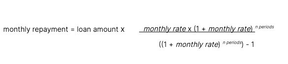
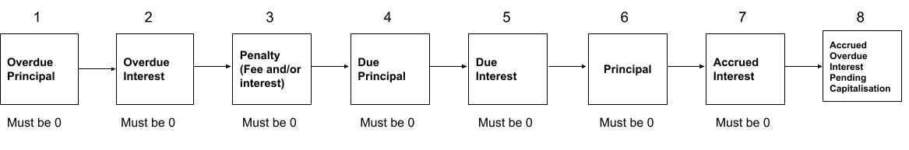
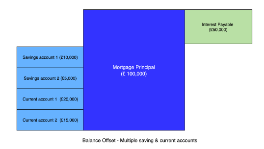

# Product features

The following business features are available with this Product.

## 1\. Mortgage disbursal

The Mortgage Application workflow process enables the customer to specify the required loan amount and the nominated account into which to transfer the funds. The loan (or principal) amount is transferred to the nominated account once the account has been opened.

### Related Vault objects

Use the `MORTGAGE_APPLICATION` workflow to open a Mortgage account.

### Use cases

#### Mortgage disbursal into the deposit account

**Given** a customer chooses to borrow a fixed-rate mortgage with a principal of 1,000,000 GBP

**When** the mortgage account opens

**Then** the product disburses the mortgage principal of 1,000,000 GBP into the deposit account.

## 2\. Interest

The interest rate of the Mortgage contract is defined by an interest rate at the instance or template level. The stated interest rate is either:

-   a fixed interest rate
    
-   a variable interest rate parameter, (which comprises either only the variable interest rate or the variable interest rate plus an additional margin which we refer to as the variable rate adjustment).
    

This is to provide configurability options, because we assume that a bank will determine the interest rate for the account based on multiple factors and processing that is conducted outside of Vault.

The Mortgage product performs a daily interest accrual and applies interest on a monthly basis on the due amount calculation day.

### 2.1 Interest accrual and application

The Mortgage product performs an interest accrual daily at the configured time on the principal as of end of day. It rounds-up the accrued interest to a configurable number of decimal places and adds it to the customer’s accrued interest, and later applies the interest on the repayment date. The customer can repay the due amount until the next due amount calculation date; if they do not repay it by this time, this amount becomes overdue.

The base rate (fixed or variable interest rate) is defined as the interest rate on a customer’s account plus a configurable penalty rate. A bank can configure the product to apply or not apply interest to any arrears as follows:

-   apply the base rate (inclusive of the interest rate on the account and the penalty rate)
    
-   apply only the base interest rate and no penalty interest
    
-   apply no/zero interest
    

#### Financial calculations

The product calculates the daily accrual amount using the following formula:

\_daily accrued interest = round(round(annual gross interest rate / days in year, 10) \_ principal, `accrual_precision`)\*

The annual gross interest (ROI) is the effective interest rate as of that day. This allows for any changes in variable rate scenarios.

The product does not charge penalty interest on any late payment fees. Penalty interest starts to accrue daily on the in arrears amount using the following formula:

\_accrued in arrears interest = balance \_ daily interest rate\*

This applies where the product calculates the daily interest rate from the base rate and the penalty interest rate, and using a day count of 365 days:

*daily interest rate = round((base rate + penalty interest rate) / days in year, 10)*

The bank can configure both the base rate and penalty interest rate.

#### Related Vault objects

The contract uses the following addresses to accrue interest and apply interest respectively:

-   `ACCRUED_INTEREST_RECEIVABLE`
    
-   `INTEREST_DUE`
    

#### Use cases

##### Accrue daily interest

**Given** a customer has an active mortgage

-   and it has an Annual Rate of Interest (ROI) of 2.2%
    
-   and has an accrual precision of 5 decimal places
    
-   and configures it to accrue interest at 00:00:01
    

**When** the bank has disbursed the loan amount of 1,000,000 GBP

**Then** the interest is accrued on a daily basis at the time of 00:00:01 hrs

-   and the calculation based on the daily ROI and the remaining principal as of the current month:
    

round(round((0.022/365),10)\*(1,000,000),5) = 60.27400 GBP

##### Change in daily accruals when ROI changes

**Given** a customer has an active mortgage

-   and has the Interest + Principal repayment option
    

**When** the bank changes the Annual ROI

**Then** the daily interest accrual is automatically adjusted by the contract to consider the new rate, resulting in the interest due for that period comprising interest accrued using the old rate and interest using the new rate.

Example: When the following is true:

-   The previous repayment date was 25 January
    
-   The next payment date is 25 February
    
-   The ROI changes on 18 February
    

Then:

-   Interest accrued from 25 January to 17 February is calculated using the old rate
    
-   Interest accrued from 18 February to 24 February is calculated using the new rate
    
-   This will form the monthly due amount if the case arises where there is a rate change
    

##### Accrue daily interest after overpayment consideration

**Given** a customer has made an overpayment in a particular payment cycle

-   and it is within the overpayment limit
    

**When** the product triggers the daily interest accrual event

**Then** the daily interest accrues on the remaining principal amount after the overpayment is deducted (Interest calculated = Principal - Overpayment).

##### Configuring the interest accrual time

**Given** the bank has configured the mortgage product to accrue interest at 22:30:00 (HH:MM:SS)

**When** 22:30:00 occurs each day

**Then** the accounts under the mortgage product accrue interest at the given time.

##### Applying interest on the repayment day

**Given** the bank has configured the mortgage product to calculate repayment at 00:00:10 (HH:MM:SS) on the due amount calculation day

-   and a customer with a mortgage account has been accruing interest on a daily basis
    

**When** the due amount calculation schedule event is triggered

**Then** the product will apply the interest accumulated in the current repayment cycle on the due amount calculation day at 00:00:10

-   and add it to the customer’s interest due balance.
    

### 2.2 Variable and fixed interest rates

The Mortgage product supports both variable and fixed interest rate types. The rate type (fixed or variable) set on the Mortgage determines the interest rate that the interest accrual calculation will use and its result.

The fixed interest rate is defined at an instance level and the variable interest rate is defined at a template level. For the base variable rate, the configuration allows a rate of interest that is positive or zero.

The product also includes a variable rate adjustment which a bank can define at an instance level to facilitate tracker rates, customer-specific discounts and other customer-specific adjustments to the base variable rate. This adjustment is applied on top of the base variable rate.

Generally, banks use the following terms to refer to these different rates:

-   Reference or base rate = variable interest rate
    
-   Margin rate = variable rate adjustment
    

#### Use cases

##### Mortgage product set to fixed interest rate at the time of account opening

**Given** a customer has an active mortgage

-   and a fixed interest rate of 5%
    
-   and a fixed interest term of 12 months
    
-   and a mortgage term of 12 months
    

**When** the product triggers the interest accrual schedule

**Then** interest accrues on the remaining balance on the account at a rate of 5% until the end of the Mortgage term.

##### Mortgage product set to variable interest rate at the time of account opening

**Given** a customer has an active mortgage

-   and a variable interest rate of 5%
    
-   and a variable interest rate adjustment of 2%
    

**When** the product triggers the interest accrual schedule

**Then** interest accrues on the remaining balance on the account at a rate of 7% (5 + 2) until the end of the mortgage term.

### 2.3 Variable interest rate cap

In order to comply with any regulatory policies, the Mortgage product includes a variable interest rate cap template parameter, which corresponds to the highest interest rate that the bank may charge its customers.

The interest rate cap control guidelines are as follows:

-   The interest rate on the Mortgage must not exceed the interest rate cap - this is set by the bank as the maximum interest rate.
    
-   The bank will only charge the interest rate cap if the variable interest rate on the Mortgage specified in the customer agreement would change to a higher rate than the interest rate cap as a result of a change to the cap.
    
-   The interest rate on the loan is calculated on the interest rate in the customer agreement if the agreed interest rate is less than or equal to the interest rate cap.
    

#### Use cases

##### Setting an interest rate cap

**Given** a bank has a Mortgage product

**When** the bank is setting the Mortgage parameters

**Then** the bank can specify the value for the interest rate for the cap.

##### Product uses the interest rate cap to calculate interest when the variable interest rate exceeds the cap

**Given** a bank has a Mortgage product with a variable interest rate

**When** the sum of the base variable interest rate and the variable rate adjustment is higher than the interest rate cap

**Then** the final interest rate on the Mortgage becomes the interest rate cap, the maximum interest rate set out by the bank.

##### Product uses the variable interest rate calculation when it is less than the interest rate cap

**Given** a bank has a Mortgage product with a variable interest rate

**When** the sum of the base variable interest rate and the variable rate adjustment is lower than the interest rate cap

**Then** the final interest rate on the loan is the sum of the base variable interest rate and the variable rate adjustment.

##### Product uses the interest rate cap when changing it causes the variable interest rate to exceed the cap

**Given** a bank has a Mortgage product with a variable interest rate

**When** as a result of a change in the interest rate cap, the variable interest rate on the loan specified in the agreement would change to a higher rate than the interest rate cap

**Then** the bank will only charge the rate it has defined in the interest rate cap.

### 2.4 Variable interest rate floor

Banks can set the minimum interest rate for variable interest - that is, a variable interest floor - as a guard against a scenario of the combined variable interest rate being zero or negative. While the preference of some banks is to use their margin as the floor, this can vary between banks. Our implementation comprises a template parameter which accepts a value as the rate.

#### Use cases

##### Setting an interest rate floor

**Given** a bank has a Mortgage product

**When** the bank is setting the Mortgage parameters

**Then** it is able to specify the floor interest rate value.

##### Final variable interest rate is lower than the interest rate floor

**Given** a bank has a Mortgage product with a variable interest rate

**When** the final/combined variable interest rate is lower than the interest rate floor

**Then** the bank uses the interest rate floor as the final interest rate on the Mortgage.

##### Combined interest rate is greater than or equal to the floor

**Given** a bank has a Mortgage product with a variable interest rate

**When** the final/combined variable interest rate is the same or higher than the interest rate floor

**Then** the bank uses the combined interest rate.

### 2.5 Variable interest rate EMI considerations

A fixed-rate mortgage will move to a variable rate after its fixed-rate term ends. The Equated Monthly Instalment (EMI) must remain constant for the fixed rate period (unless another condition is met to cause re-amortisation, for example, an overpayment). In order to accommodate requirements for both the EMI and recalculations during the variable rate period, the contract uses initial principal and total repayment count parameter values for the EMI calculation. This value is stored and used for the remainder of the fixed-rate period.

When the fixed-rate period ends and the mortgage moves to a variable rate, the EMI is recalculated. For more information on EMI recalculation, see [Amortisation](/vault-core/5-9/EN/product_library/product_specifications/mortgage/features#3_1_amortisation).

#### Related Vault objects

During a variable-rate period, the EMI calculation uses actual balances in the addresses to:

-   Segregate effects of overpayments on the EMI calculation
    
-   Accurately track the annual overpayment allowance
    

The contract uses five addresses for accounting purposes, these are:

-   `PRINCIPAL` tracks remaining principal
    
-   `CAPITALISED_INTEREST_TRACKER` tracks any interest that has been capitalised into the PRINCIPAL address
    
-   `OVERPAYMENT` tracks the overpayment made directly by the customer
    
-   `EMI_PRINCIPAL_EXCESS` stores the value of the indirect increase in the principal payment due to any overpayments. It is kept in a separate address in order to filter out the impact on EMI calculations. This is because the principal is reduced after an overpayment and, as a result, incurs less interest the following month than it would without an overpayment. As the total EMI is kept constant, the principal portion of the EMI becomes bigger than it otherwise would have. This further reduces the interest accrual every month.
    
-   `CAPITALISED_INTEREST_TRACKER` tracks the interest that has been capitalised as a result of a repayment holiday
    

## 3\. Repayments

A customer needs to repay the principal, and the associated interest in fixed monthly repayments, over an agreed period of time. The product uses the amortisation process to calculate a schedule of equal monthly repayments, designed to reduce the principal and associated interest to zero over the loan term.

### 3.1 Amortisation

During amortisation the EMI (equated monthly instalment) stays constant from account opening and is only recalculated if the following conditions occur. If these conditions do not occur, the EMI persists from the last repayment period.

-   No previous EMI has been calculated
    
-   Movement from Interest Only repayment EMI to principal plus interest EMI
    
-   Movement from fixed interest to variable
    
-   During variable rate period the rate is adjusted after the last due amount calculation date
    
-   First due amount calculation date after the end of the repayment holiday
    
-   Banks opt to recalculate EMI due to overpayments
    

The monthly repayment calculation includes the mortgage amount, mortgage term (in years), which is set during the account opening process, and the gross interest rate, which is specified in the product.

#### Financial calculations

The product calculates the monthly repayment amount using the following formula:

The product calculates the *monthly rate* and *no of periods* (number of periods) as follows:

-   *monthly rate* = monthly rate = round(gross interest rate / 12, 10)
    
-   *n periods* = loan term (in years) ×12
    

##### Example monthly repayment calculation using the amortisation formula:

   
| Reference | Description | Calculation/Formula | Example |
| --- | --- | --- | --- |
| 
P

 | 

Principal mortgage amount

 | 

Property price - deposit amount

 | 

400,000

 |
| 

T

 | 

Mortgage term

 | 

The length of the mortgage

 | 

30 years

 |
| 

F

 | 

Fixed annual rate

 | 

Fixed by the bank when opening the mortgage product as agreed with the customer

 | 

1.75%

 |
| 

r

 | 

Monthly interest rate

 | 

F / 12:Divide the fixed annual rate (F) by 12 (the number of months in a year)

 | 

(1.75/100) / 12 = 0.001458

 |
| 

dr

 | 

Daily rate

 | 

F/365

 | 

round((1.75/100) / 365,10) = 0.000479452

 |
| 

n

 | 

Number of payments over the mortgage term

 | 

Multiply the number of years in your mortgage term by 12 (the number of months in a year)

 | 

30\*12 = 360

 |
| 

MR

 | 

Monthly repayment amount during the fixed period

 | 

P \* \[ r(1+r)^n / (((1+r)^n)-1) \]

 | 

400,000 \* \[0.001458 (1+0.001458)^360 / (((1+0.001458)^360)-1) \] = 1,428.97 GBP

 |

#### Use cases

##### Calculating the first EMI and customer repayment amount after Mortgage disbursement

**Given** a customer has an active fixed rate mortgage

-   and it has an Interest + Principal repayment option
    
-   and the daily interest accrual happens for the same interest rate
    

**When** the bank calculates the first EMI for Interest + Principal repayments

**Then** the product charges the interest accrued during the grace period to the customer

-   and charges the actual EMI on the repayment day.
    

###### Example:

For a customer with a Mortgage start date of 5 January and the repayment date set as day 25 of every month, their EMI will start from 25 February. Their first repayment is inclusive of EMI (25 January to 24 February) + extra interest accrued from 5 January to 24 January. - Mortgage start date = 5 January - Monthly repayment date = day 25 of each month - First EMI (25 February) = EMI (25 January to 24 February) + interest (5 to 24 January) - Next EMI (25 March) = EMI (25 February to 24 March)

##### Calculating subsequent EMIs when annual interest rate remains unchanged

**Given** a customer has an active fixed rate mortgage

-   and it has the Interest + Principal repayment option
    
-   and the daily interest accrual happens for the same interest rate
    
-   and the product has calculated the first EMI
    

**When** the bank calculates the subsequent EMIs for the customer

**Then** the product calculates the EMI as the same amount until the Mortgage term.

###### Example:

P = 800,000 GBP; F = (2%) / 12 ; n = 10 Years (120 Months)

EMI = \[800,000 \* (0.02/12) \* (1+0.02/12)^120\] / \[(1+0.02/12)^120-1\] → 7,361.08 GBP (rounding half up to 2 digits)

##### Subsequent EMIs when annual interest rate gets changed

**Given** a customer has an active variable rate mortgage

-   and the repayment day is on day 20 of each month
    
-   and the interest rate is updated on day 10 of the current month
    

**When** the bank recalculates the EMI for the subsequent months after the rate change

**Then** the account must calculate the daily interest accrued from day 20 of the previous month to day 9 of the current month at the old variable rate

-   and calculate from days 10 to 19 of the current month at the new variable rate.
    

### 3.2 Monthly repayments

During the account opening process, the customer nominates the day of the month on which they want their monthly amounts to become due. If the nominated day of the month is greater than or equal to the day of the month that the account is created then the first repayment date occurs on the following month. If the repayment date is set to less than the account creation date then the first repayment is not due until 30+ days have passed. This is to ensure that at least one month has passed before the first repayment is due. To see an example, see the use cases in [Change monthly repayment day](/vault-core/5-9/EN/product_library/product_specifications/mortgage/features#3_6_change_monthly_due_amount_calculation_day).

When a repayment is received, the Contract checks whether the deposit is in accordance to the account terms and conditions; for example, in the correct currency.

#### Use cases

##### Due amount calculation day greater than or equal to the account creation day

**Given** a customer has opened a mortgage account on 15 January

**When** the repayment day is set as day 15 of every month

**Then** the first repayment date is 15 February.

##### First due amount calculation date is not due until 30+ days have passed

**Given** a customer has opened a mortgage account on 15 January

**When** the repayment day is day 10 of every month

**Then** the first repayment date is 10 March.

### 3.3 Repayment hierarchy

The product has a defined repayment hierarchy which dictates the order that it receives and applies repayments to clear the customer’s debt across its different pots within a mortgage.

When a customer repayment arrives, the product distributes it across these different pots using the repayment hierarchy, repaying specific balances first and then the due amount.

It must pay the entirety of the balance (zero out) for a given entry in the hierarchy before moving to the next entry.

1.  Overdue Principal
    
2.  Overdue Interest
    
3.  Penalty (Fee and/or Interest)
    
4.  Due Principal
    
5.  Due Interest
    
6.  Principal
    
7.  Accrued Interest
    
8.  Accrued Overdue Interest Pending Capitalisation
    

chat\_bubble

The repayment hierarchy in this product is an example only and can be configurable. In common practice interest is cleared first and than principal however, in this example, we have structured it differently as this hierarchy is reused later for the overpayment Feature where Principal is cleared before accrued interest.

#### Use cases

##### Active mortgage account follows the specified repayment order

**Given** a customer has an active mortgage account

**When** the customer makes an overdue payment within the early repayment limit

**Then** the account must accept the payment and apply it in the following order:

1.  Deduct Overdue Principal first
    
2.  Deduct Overdue Interest only when (1) is 0
    
3.  Deduct Penalty only when (1), (2) is 0
    
4.  Deduct Due Principal only when (1), (2), (3) is 0
    
5.  Deduct Due Interest only when (1), (2), (3), (4) is 0
    
6.  Deduct Principal only when (1), (2), (3), (4), (5) is 0
    
7.  Deduct Accrued Interest only when (1), (2), (3), (4), (5), (6) is 0
    
8.  Deduct Accrued overdue interest pending capitalisation only when (1), (2), (3), (4), (5), (6) and (7) is 0, done for an early repayment only.
    

### 3.4 Interest-only repayments

The product has a configuration option to handle interest-only repayments where the repayment amount is based on the number of days in the repayment cycle between repayment dates over the interest-only term. Customers following this repayment schedule will pay off only the interest component of the mortgage. It is possible to set the start of the mortgage term to an interest-only basis which then rolls over into interest plus principal for the remainder of the term.

At the end of the interest-only mortgage term the principal balance will remain as only the interest portion of the mortgage has been paid and is no longer outstanding. In the case where the interest-only term is the same as the total mortgage term, the entire principal amount is added to the final monthly repayment at the end of the mortgage life cycle.

#### Financial calculations

The monthly interest repayment is calculated using the following formula:

-   interest-only repayment = total accrued interest since the last due amount calculation date
    

#### Use cases

##### Subsequent monthly due amount for interest-only repayments

**Given** a customer has an active fixed-rate mortgage

-   and it has an Interest-only repayment plan
    
-   and the daily interest accrual happens for the same interest rate
    
-   and has paid the first monthly due amount
    

**When** the bank calculates the subsequent monthly due amount for the customer

**Then** the total monthly due amount only comprises the total interest accrued in that repayment cycle plus any penalties and overdue interest amount

-   and the account does not have a principal due amount or principal overdue amount.
    

###### Example:

If the last repayment date was 25 January and the next payment date is 25 February, then the monthly due amount is the total interest accrued from 25 January until 24 February.

##### Recalculating due amounts after a rate change for interest-only repayments

**Given** a customer has an active variable rate mortgage

-   and has an interest-only repayment option
    

**When** the bank changes the annual interest rate and calculates the subsequent monthly due amount for the customer

**Then** the daily interest accrual adjusts to the rate

-   and, therefore, interest due for that period includes interest accrued at the old rate and interest accrued at the new rate
    
-   and the account does not have a principal due amount or principal overdue amount.
    

###### Example:

**Given:**

-   Date of previous repayment = 25 January (current year)
    
-   Date of next repayment = 25 February (current year)
    

**When:**

-   Date of interest rate change = 18 February (current year)
    

**Then:**

-   Interest is accrued at the old rate = 25 January to 17 February
    
-   Interest is accrued at the new rate = 18 February to 24 February
    
-   Monthly due amount = total balance inclusive of due principal and due interest accrued at the different interest rates
    

### 3.5 Grace period and delinquency

A bank can configure a grace period to follow the repayment period, in case the customer does not repay the due balance within it. A grace period allows the customer more time to repay the overdue balance, including any outstanding fees and penalty interest, in order to prevent the account from becoming delinquent. Banks can configure an account to not have a grace period by setting the value of the `grace_period` parameter to 0 days.

When a customer has a grace period enabled on their account, then:

-   If the account does not receive a payment by the next due amount calculation date, the remaining unpaid amounts become overdue, and the overdue balances are then subject to fees and penalty interest. The grace period then starts.
    
-   If the account balance remains overdue when the grace period ends, because the customer does not make a full repayment, the account becomes delinquent.
    

When a customer does not have a grace period on their account, if they do not repay the due balance and any fees by the start of the next due amount calculation event, it becomes delinquent.

An account being marked as delinquent does not incur any behavioural impact and is only to provide the bank with visibility of account delinquency. We assume that the bank will have internal processes in place to take additional action against the customer’s account when it is marked as delinquent.

#### Related Vault objects

Banks can implement the logic to mark accounts as delinquent. When an account becomes delinquent, the product send a contract notification which will then auto-instantiate the following workflow which will apply the relevant flag to a given account.

Workflow to apply a flag:

-   `MORTGAGE_MARK_DELINQUENT` - this workflow runs at the end of the grace period.
    

Flag:

-   `ACCOUNT_DELINQUENT` - the delinquency workflow applies this flag to the account.
    

#### Use cases

##### Defining a grace period when setting up the product

**Given** a customer has opened a mortgage account

**When** the bank is defining the grace period

**Then** the bank must specify the grace period (in the number of days) as a minimum value of 0 and a maximum less than the next due amount calculation date.

##### Applying a grace period to an account on opening

**Given** a bank has defined the grace period for a mortgage account as 7 days

**When** the customer opens a mortgage account

**Then** the grace period of 7 days is set against the account.

##### Configuring the grace period account behaviour

**Given** a customer has an active mortgage account with a configurable grace period defined as 7 days

**When** the customer does not make a repayment for the full amount by the next due amount calculation date

**Then** the amount due must become overdue

-   and the product must apply any penalties
    
-   and, from this point, the customer has a 7-day window (the configured grace period) to repay before the account becomes delinquent on = day 8.
    

##### Behaviour of the account when full repayment is not received during the grace period

**Given** a customer has an overdue payment

-   and is in the grace period
    

**When** the customer does not make a repayment equal to the overdue amount due (overdue interest  
overdue principal + any penalties) by the end of the grace period

**Then** the account is marked as delinquent.

##### Behaviour of the account when repayment is received in the grace period

**Given** a customer has made a repayment during the grace period

**When** the repayment is equal to the amount overdue (overdue interest + overdue principal + any penalties)

**Then** the grace period must end and the account must not become delinquent.

### 3.6 Change monthly due amount calculation day

The product offers the customer the option to change the nominated day of the month on which their monthly amounts become due. In order to make the change, we require 30+ days for the change to take effect.

    
| Scenario | Current day | Current repayment date | Request to change repayment day to: | New repayment date |
| --- | --- | --- | --- | --- |
| 
1\. Moving to a due amount calculation date higher in date order

 | 

15 January

 | 

20 January

 | 

day 22

 | 

22 February

 |
| 

2\. Moving to a due amount calculation date lower in date order

 | 

15 January

 | 

20 January

 | 

day 2

 | 

2 March

 |

If the customer chooses a new day that is before the current day of the month, the new day will only take effect after +30 days. For example, if it is February when a customer is choosing a new due amount calculation day, then if the next due amount calculation date was scheduled for February, it moves to March. See scenario 2 in the table. The monthly repayment due on 20 January is unchanged. However, the next monthly due amount calculation event is moved from 20 January to 2 March.

Depending on when a customer makes a request, a change of repayment date could mean at least more than one month between repayments. This can result in a customer having additional interest due or paying surplus interest. It is possible to add additional interest to the next monthly repayment or handle any surplus interest paid by a customer as an overpayment.

#### Related Vault objects

-   During an active repayment holiday on an account, it is not possible to change the repayment day and the product rejects a request to change it.
    

#### Use cases

##### A customer must pay more towards interest due after changing the due amount calculation day

**Given** a customer is regularly repaying the mortgage on the repayment day

**When** the customer requests for the change in the due amount calculation day which is greater than the current due amount calculation day

**Then** the bank must accumulate the daily interest accrued between the previous due amount calculation day and new due amount calculation day

-   and apply the accrued interest as the interest due on the new due amount calculation date
    
-   and the monthly interest due for the customer must increase.
    

###### Example:

If the last due amount calculation date was 20 January and the next due amount calculation date is 25 February after the change, then the interest due is the accumulation of the interest accrued from 20 January until 24 February.

##### A customer must pay less towards interest due after changing the due amount calculation day

**Given** a customer is regularly repaying the loan on the due amount calculation date

**When** the customer requests to change the due amount calculation day to a day that is earlier than the current due amount calculation day

**Then** the bank must only charge on the interest that has been accrued over this reduced period - and the monthly interest due for the customer reduces.

###### Example:

If the last due amount calculation date was 20 January and the next due amount calculation date is 10 February based on the customer request, then the actual interest due is the daily interest accrued from 20 January to 9 February. This is the exact amount to charge to the customer.

## 4\. Late repayment fees

Banks can configure optional late payment penalty fees for customers who do not repay the full amount due by the next due amount calculation date and have an overdue balance.

The product allows a bank to apply both a flat-fee penalty and a penalty interest rate to the account, and at the same time on a single account. The product adds all penalties to the account penalty pot.

### 4.1 Flat-fee penalties

The flat-fee penalty is a one-off charge that the product will add to an account for every month that it does not receive a full repayment. A bank can configure this fee to any value they like, such as 0 GBPP, in which case the product will not apply a penalty fee. The product will add this fee to the Late Payment Penalties pot. No interest will accrue on this fee.

#### Use cases

##### Charging a fee to a customer account when any amount of the monthly repayment is overdue

**Given** the customer has a mortgage with a flat late repayment fee of 25 GBP

-   and a due monthly repayment of 100 GBP
    
-   and they have paid only 50 GBP during the month
    

**When** the next due amount calculation event occurs

-   and their due balance is transferred to overdue
    

**Then** the customer incurs a charge of 25 GBP in late payment fees.

##### Not charging a fee to a customer account if the fee value is configured to 0

**Given** the customer has a mortgage with a flat late repayment fee of 0

-   and a due monthly repayment of 100 GBP
    
-   and has only paid 50 GBP of it
    

**When** the next due amount calculation event occurs and their due balance is transferred to overdue

**Then** the customer incurs a charge of 0 GBP in late payment fees.

### 4.2 Penalty interest

The penalty interest rate is an additional rate of interest. The product accrues penalty interest daily on the arrears (amount overdue) and applies it to the fees pot rather than the due interest pot. The bank can configure the loan to optionally capitalise the penalty interest accrued, if the capitalise\_penalty\_interest parameter is set to True then accrued penalty interest will not go directly to the penalties pot but will instead go to a pending capitalisation pot. The interest accrued here will be capitalised (moved into the principal) at the next due amount calculation event. We have designed the product to allow banks to choose and configure whether it will charge only penalty interest or charge penalty interest on top of the base interest rate of the mortgage.

We have designed the product to allow a bank to configure options for:

-   Penalty interest rate, including the option to set the value to 0, in which case it will not apply penalty interest.
    
-   Interest accrual, either on only the overdue principal or accruing interest on both the overdue principal and overdue interest.
    
-   Charging interest, as either only penalty interest or charging penalty interest on top of the base interest rate of the mortgage.
    
-   Capitalising penalty interest, either to be charged directly as a penalty or to be added to principal at the next due amount calculation event.
    

#### Use cases

##### Charge penalty interest to a customer on both overdue principal and overdue interest

**Given** the customer has 100 GBP of overdue principal repayments

-   and 50 GBP of overdue interest repayments
    
-   and a total penalty interest rate of 10%
    

**When** interest accrual occurs

**Then** interest is accrued at 10% on the overdue balance of 150 GBP (overdue principal + overdue interest).

##### Charge penalty interest on top of the base rate

**Given** the customer has 100 GBP of overdue principal repayments

-   and a base interest rate of 5% - and a penalty interest rate of 10%
    
-   and their account is configured to charge the penalty interest rate on top of the base rate
    

**When** interest accrual occurs

**Then** interest is accrued at 15% (base rate + penalty rate) on the overdue balance of 100 GBP.

##### No base rate interest is charged when penalty interest is set at greater than 0% and is charged on an overdue payment balance

**Given** the customer has 100 GBP of overdue principal repayments

-   and a base interest rate of 5% - and a penalty interest rate of 10%
    
-   and their account is configured not to charge the penalty interest rate on top of the base rate
    

**When** interest accrual occurs

**Then** interest is accrued at 10% (penalty rate only) on the overdue balance of 100 GBP.

##### Only base rate interest is charged on an overdue payment balance when penalty interest is set at 0% and charged on top of the base rate

**Given** the customer has 100 GBP of overdue principal repayments

-   and a base interest rate of 5% - and a penalty interest rate of 0%
    
-   and their account is configured to charge the penalty interest rate on top of the base rate
    

**When** interest accrual occurs

**Then** interest is accrued at 5% (base rate + 0) on the overdue balance of 100 GBP.

##### Apply penalty interest to an overdue balance and add the amount to the fees pot

**Given** the customer has 100 GBP of overdue principal repayments

-   and a base interest rate of 5% - and a penalty interest rate of 10%
    
-   and their account is configured to charge the penalty interest rate on top of the base rate
    

**When** interest accrual occurs

**Then** the penalty interest accrued is on the overdue balance

-   and the final amount is added to the penalty interest/fees pot.
    

##### Accruing penalty interest to be capitalised

**Given** the customer has 100 GBP of overdue principal repayments

-   and a base interest rate of 5% - and a penalty interest rate of 10%
    
-   and their account is configured to charge the penalty interest rate on top of the base rate
    

**When** interest accrual occurs and the Mortgage is configured to capitalise penalty interest

**Then** the penalty interest accrued over the month is on the overdue balance

-   and the final amount is added to the pending capitalisation pot where it remains until the next due amount calculation event, where it then gets capitalised.
    

## 5\. Product switching

Banks will offer different types of mortgages at competitive rates. Customers of a bank will prefer the lowest rate available, which will often involve switching mortgages and often lenders, too.

Our mortgage product has the ability to allow switching between the different types:

-   repayment plans
    
-   between a Principal + Interest plan and an Interest-only plan
    
-   fixed interest rate and variable interest rate
    
-   standard mortgages and offset mortgages
    

Throughout the lifetime of a mortgage, the change from fixed interest rate to variable rate is one-directional. However, it is possible to manually switch the product between these rates via a Mortgage Product Switch, which essentially creates a new product on the same account. This helps customers to switch within the same product and take advantage of better interest rates

The interest is accrued on the new interest rate on the same day as the switch occurs.

Should the repayment plan switch during the repayment period (mid-cycle), then the newly-changed plan is effective on the following repayment cycle.

A Mortgage Product Switch is handled via an account conversion:

-   Once the bank has accepted the customer’s request for a product switch, the bank should update the account parameters to reflect the new terms and conditions of the Mortgage.
    
-   To ensure the account conversion is treated as a product switch (as opposed to another conversion) the parameter Mortgage `product_switch` parameter must be set to true before executing the account conversion. Whether the conversion is between two versions of the same product (same product\_id) or two versions of a different product (different product\_id) is at the bank’s discretion.
    
-   The bank should then initiate the account conversion. The conversion will re-amortise the Mortgage, update any relevant tracking addresses and charge any relevant fees. The overpayment allowance period will be reset to start on the conversion date. For full details see the documentation/design\_decisions/mortgage\_product\_transfers.md design document in the product library release artefact.
    

## 6\. Overpayments

An overpayment is defined as a payment made that exceeds the expected monthly mortgage repayment. An overpayment reduces the amount of principal and this, in turn, reduces the amount of interest that a customer accrues or reduces the term maintaining the EMI constant. An annual overpayment limit is a percentage of the remaining principal balance at the beginning of the current annual period. A customer can overpay on their mortgage either by making a payment as a lump sum or periodically. The annual period is defined as 12 months from the date of account opening.

Any unused limit does not carry over to the next annual period. For example, if the allowance is 10% and only 5% is used during an annual period, then during the next annual period the customer’s allowance is 10%, not 15%.

The Product credits any overpayment to the remaining mortgage principal balance. You can configure the product to either reduce the loan term or reduce the EMI for the remainder of the term.

### 6.1 Overpayment allowance and fees

#### Use cases

##### Bank defines overpayment allowance

**Given** the bank is defining a Mortgage

**When** it sets the overpayment allowance parameter

**Then** the overpayment allowance is set at the account level as a percentage (%).

##### Customer does not exceed overpayment allowance

**Given** a mortgage account has a overpayment allowance of 10%

-   and the current outstanding principal is 1,000,000 GBP
    
-   and the total overpayment made this year is 0 GBP
    

**When** a customer makes an overpayment of 20,000 GBP

**Then** the remaining mortgage principal must reduce to 980,000 GBP and the product must calculate the interest due on the principal that remains after the overpayment of 20,000 GBP.

##### Charging an overpayment fee on the amount above overpayment allowance limit when a customer exceeds the overpayment allowance

**Given** a mortgage account has an outstanding principal of 100,000 GBP

-   and overpayment allowance of 10%, and an overpayment fee of 2%
    
-   and has a due amount of 10,000 GBP
    
-   and no outstanding penalties
    

**When** the customer makes a repayment of 15,000 GBP which exceeds the overpayment allowance (10% of 100,000=10,000)

**Then** the due balance must reduce to 0 GBP

-   and the overpayment is: = 5,000 GBP - (2% fee of 5,000 GBP = 100 GBP) = 5,000 GBP - 100 GBP = 4,900 GBP is the final amount that the product applies to the balance as the overpayment.
    

### 6.2 Configurable impact of overpayments

The product allows the bank to configure the impact on an account of an overpayment. When an account receives an overpayment it results in a type of reduction to the mortgage.

There are two ways that the bank can apply the impact of the overpayment to a mortgage:

1.  Reduce the EMI - the product recalculates the monthly repayment amount for the mortgage (EMI) so that the mortgage term remains the same.
    
2.  Reduce the mortgage term - the result of the overpayment is to reduce the mortgage term, given that the EMI remains constant.
    

#### Use cases

##### Ability to specify the preference for the impact of overpayments on a mortgage

**Given** a bank has a Mortgage product

**When** they are defining the product

**Then** they are able to specify the behaviour that should occur as a result of an overpayment as to either Reduce EMI - term remains same or Reduce term - EMI remains same

##### Overpayment impact is to reduce the EMI on a mortgage

**Given** a bank has defined a Mortgage product with the option of reducing the EMI as a result of an overpayment

**When** the customer makes an overpayment

**Then** the EMI is recalculated at the next due amount calculation eventfor any open mortgages where the outstanding principal has been reduced.

##### Overpayment impact is to reduce the term on a mortgage

**Given** a bank has defined a Mortgage product with the option of reducing the term as a result of an overpayment

**When** the customer makes an overpayment

**Then** the term is reduced

-   and the EMI remains the same with the exception of the EMI for the final month, which the product might adjust to cater for any residual balance.
    

#### Financial calculations

-   Mortgage amount = 800,000 GBP
    
-   Term = 12 months
    
-   Mortgage start date = 1 January 2021
    
-   Fixed Interest rate = 2%
    
-   Fixed Interest term = 12 months
    
-   Repayment day = day 2 of the month
    
-   Overpayment allowance = 10%
    
-   Overpayment fee = 2%
    

##### Example: Reduce the EMI

In this example, the `OVERAYMENT_IMPACT_PREFERENCE` is set to `reduce_emi` at the time of account opening. When there is an overpayment after the fourth due calculation event, the product will recalculate the EMI on the next due amount calculation event and the mortgage term remains unchanged for 12 months.

      
| Month | Note | Repayment made | EMI | Interest Due | Principal Due | Principal Balance |
| --- | --- | --- | --- | --- | --- | --- |
| 
11/1/2020

 | 

Loan opens, EMI calculated

 | 

254.22

 | 

254.22

 | 

0

 | 

0

 | 

3,000.00

 |
| 

20/2/2020

 | 

First due calc event

 | 

254.22

 | 

254.22

 | 

10.19

 | 

246.32

 | 

2,753.68

 |
| 

20/3/2020

 | 

Regular repayment of EMI

 | 

254.22

 | 

254.22

 | 

6.78

 | 

247.44

 | 

2,506.24

 |
| 

20/4/2020

 | 

Regular repayment of EMI

 | 

254.22

 | 

254.22

 | 

6.6

 | 

247.62

 | 

2,258.62

 |
| 

20/5/2020

 | 

Overpayment of 250

 | 

504.22

 | 

254.22

 | 

5.75

 | 

248.47

 | 

1,760.15

 |
| 

20/6/2020

 | 

EMI recalculation on due calc event after overpayment

 | 

222.58

 | 

222.58

 | 

4.63

 | 

217.95

 | 

1,542.20

 |
| 

20/7/2020

 | 

Regular repayment of EMI

 | 

222.58

 | 

222.58

 | 

3.93

 | 

218.65

 | 

1,323.55

 |
| 

20/8/2020

 | 

Regular repayment of EMI

 | 

222.58

 | 

222.58

 | 

3.48

 | 

219.10

 | 

1,104.45

 |
| 

20/9/2020

 | 

Regular repayment of EMI

 | 

222.58

 | 

222.58

 | 

2.91

 | 

219.67

 | 

884.78

 |
| 

20/10/2020

 | 

Regular repayment of EMI

 | 

222.58

 | 

222.58

 | 

2.25

 | 

220.33

 | 

664.45

 |
| 

20/11/2020

 | 

Regular repayment of EMI

 | 

222.58

 | 

222.58

 | 

1.75

 | 

220.83

 | 

443.62

 |
| 

20/12/2020

 | 

Regular repayment of EMI

 | 

222.58

 | 

222.58

 | 

1.13

 | 

221.45

 | 

222.17

 |
| 

20/1/2021

 | 

Final repayment

 | 

222.75

 | 

222.58

 | 

0.58

 | 

222.17

 | 

0.00

 |

## 7\. Early repayment on a mortgage

The mortgage product allows a customer to end their term early by paying-off their mortgage ahead of schedule. It allows early repayment irrespective of whether the loan has a fixed or non-fixed rate of interest. A bank can configure either a fixed or a percentage-based early repayment fee to charge to the customer. Early repayment follows the same payment hierarchy as defined in [Repayments](/vault-core/5-9/EN/product_library/product_specifications/mortgage/features#3_3_repayment_hierarchy).

The customer will need to provide the details of the account that will fund the early repayment. The bank will close the account once the customer has paid the final, total remaining balance.

### Financial calculations

The early repayment fee is calculated as either a flat fee or a percentage fee based on the value of the Early Repayment Fee product parameter. If this parameter value is positive, it is considered to be a flat early repayment fee. If it is negative, the fee is a percentage fee calculated as:

\_\`erc\_fee\` = `remaining_principal` \_ (overpayment allowance fee rate)\*

chat\_bubble

An overpayment allowance fee is also charged when a customer makes an early repayment (see the Overpayments section). The total early repayment fee is a combination of the overpayment allowance fee and the early repayment fee that is charged as a result of repaying the mortgage early.

The Total Early Repayment Fee derived parameter gives the value that needs to be paid in order to completely pay off the mortgage early, including both fees. If a posting is made for this amount, the mortgage is paid off and a closure notification is issued.

### Use cases

#### Close the mortgage loan early by pre-paying the outstanding principal amount

**Given** a customer makes a posting for the total early repayment amount of the mortgage

**Then** the mortgage issues a closure account notification

##### Example:

If the last due amount calculation date was 20 January and the early repayment date is 10 February, then the total interest that has accrued from 20 January until 10 February (inclusive) is due for repayment.

## 8\. Offset mortgage

### 8.1 Balance offsetting

A mortgage with an offset feature is a way to reduce the amount of interest customers pay back over the life (term) of a mortgage. There are two types of offset variant:

-   Balance offset (our product)
    
-   Interest offset
    

Our mortgage product supports the balance offset variant, which links an active mortgage to multiple savings or current accounts. The total outstanding balance of any savings or current accounts linked to the offset mortgage account is offset on the mortgage principal. This lowers the monthly mortgage payments and instead the customer will not earn any interest on the savings or current account balance.

As customers usually pay more interest on a mortgage than is earned from savings or current accounts, an offset mortgage can save customers a substantial amount of money over its lifetime. This means that as a month goes on, the daily interest accrued on an offset mortgage will differ depending on the offset account balance.

  
| Mortgage types | Repayment plans | Eligibility |
| --- | --- | --- |
| 
Fixed-rate mortgage

 | 

Principal + Interest

 | 

Eligible

 |
| 

Fixed-rate mortgage

 | 

Interest only

 | 

Not eligible

 |
| 

Variable-rate mortgage

 | 

Principal + Interest

 | 

Eligible

 |
| 

Variable-rate mortgage

 | 

Interest only

 | 

Not eligible

 |

#### Example: Mortgage with multiple savings or current accounts at Year 1 (without offset)

-   Mortgage: 100,000 GBP with an interest rate of 3.00% (-3,000 GBP a year)
    
-   Savings account 1 balance: 10,000 GBP with an interest rate of 2.00% (+200 GBP a year)
    
-   Savings account 2 balance: 5,000 GBP with an interest rate of 2.00% (+100 GBP a year)
    
-   Current account 1 balance: 20,000 GBP with an interest rate of 2.00% (+400 GBP a year)
    
-   Current account 2 balance: 15,000 GBP with an interest rate of 2.00% (+300 GBP a year)
    
-   Total net cost to the customer: (3,000 GBP - 1,000 GBP) = 2,000 GBP
    

#### Example: Offset mortgage with multiple savings or current accounts at Year 1 (with offset)

-   Mortgage: 100,000 GBP with an interest rate of 3.00% (-3,000 GBP a year)
    
-   Savings account 1 balance: 10,000 GBP
    
-   Savings account 2 balance: 5,000 GBP
    
-   Current account 1 balance: 20,000 GBP
    
-   Current account 2 balance: 15,000 GBP
    
-   Effective mortgage principal: 50,000 GBP with a mortgage interest rate of 3.00% (-1,500 GBP a year)
    
-   Total offset amount from savings or current accounts: 50,000 GBP with 0% interest rate
    
-   Total net cost to the customer: -1,500 GBP
    

#### Cost to the customer of using an offset account in Year 1

-   Without offset: -2,000 GBP
    
-   With offset: -1,500 GBP
    
-   Difference: 500 GBP benefit to the customer
    

### 8.2 Offset interest accrual and application

The offset mortgage feature performs an interest accrual daily on the outstanding mortgage principal after offsetting at the end of the day and applies it on the monthly due amount calculation date. The interest accrues at five decimal places (this is configurable) and the accrued interest is later rounded-up to two decimal places (also configurable) and added to the customer’s interest due balance.

#### Financial calculations

The daily accrual amount is calculated using the following formula:

\_daily accrued interest = round(round(annual gross interest rate / days in a year, 10) \_ effective balance, 5)\*

The annual gross interest (ROI) is the effective interest rate as of that day. This allows for any changes in variable rate scenarios.

This applies where the product calculates the daily interest rate from the base rate and the penalty interest rate, and using a day count of 365 days:

*daily interest rate = round((base rate + penalty interest rate) / days in year,5)*

The product offers the ability to configure both the base rate and penalty interest rate.

The effective balance is calculated using the following formula:

*effective balance = mortgage principal offset balance (from linked savings or current accounts)*

#### Related Vault objects

The contract uses the following three addresses to accrue interest and apply interest: - `ACCRUE_INTEREST` - `INTEREST_DUE`

##### Table: Daily interest accrual with offsetting

The following table demonstrates daily interest accrual with offsetting.

        
| Day | Mortgage amount | Offset transaction | Offset balance (End of Day) | Interest calculation amount | Fixed interest rate | Daily interest with offset | Daily interest without offset | Offset benefit |
| --- | --- | --- | --- | --- | --- | --- | --- | --- |
| 
1

 | 

800,000.00 GBP

 |  | 

0.00 GBP

 | 

800,000.00 GBP

 | 

2.00%

 | 

0 GBP

 | 

43.84 GBP

 | 

0 GBP

 |
| 

2

 | 

800,000.00 GBP

 | 

1,000.00 GBP

 | 

1,000.00 GBP

 | 

799,000.00 GBP

 | 

2.00%

 | 

43.78 GBP

 | 

43.84 GBP

 | 

0.06 GBP

 |
| 

3

 | 

800,000.00 GBP

 |  | 

1,000.00 GBP

 | 

799,000.00 GBP

 | 

2.00%

 | 

43.78 GBP

 | 

43.84 GBP

 | 

0.06 GBP

 |
| 

4

 | 

800,000.00 GBP

 |  | 

1,000.00 GBP

 | 

799,000.00 GBP

 | 

2.00%

 | 

43.78 GBP

 | 

43.84 GBP

 | 

0.06 GBP

 |
| 

5

 | 

800,000.00 GBP

 | 

15,000.00 GBP

 | 

16,000.00 GBP

 | 

784,000.00 GBP

 | 

2.00%

 | 

42.96 GBP

 | 

43.84 GBP

 | 

0.88 GBP

 |
| 

6

 | 

800,000.00 GBP

 |  | 

16,000.00 GBP

 | 

784,000.00 GBP

 | 

2.00%

 | 

42.96 GBP

 | 

43.84 GBP

 | 

0.88 GBP

 |
| 

7

 | 

800,000.00 GBP

 |  | 

16,000.00 GBP

 | 

784,000.00 GBP

 | 

2.00%

 | 

42.96 GBP

 | 

43.84 GBP

 | 

0.88 GBP

 |
| 

8

 | 

800,000.00 GBP

 | 

20,000.00 GBP

 | 

36,000.00 GBP

 | 

764,000.00 GBP

 | 

2.00%

 | 

41.86 GBP

 | 

43.84 GBP

 | 

1.98 GBP

 |
| 

9

 | 

800,000.00 GBP

 |  | 

36,000.00 GBP

 | 

764,000.00 GBP

 | 

2.00%

 | 

41.86 GBP

 | 

43.84 GBP

 | 

1.98 GBP

 |
| 

10

 | 

800,000.00 GBP

 |  | 

36,000.00 GBP

 | 

764,000.00 GBP

 | 

2.00%

 | 

41.86 GBP

 | 

43.84 GBP

 | 

1.98 GBP

 |
| 

11

 | 

800,000.00 GBP

 |  | 

36,000.00 GBP

 | 

764,000.00 GBP

 | 

2.00%

 | 

41.86 GBP

 | 

43.84 GBP

 | 

1.98 GBP

 |
| 

12

 | 

800,000.00 GBP

 |  | 

36,000.00 GBP

 | 

764,000.00 GBP

 | 

2.00%

 | 

41.86 GBP

 | 

43.84 GBP

 | 

1.98 GBP

 |
| 

13

 | 

800,000.00 GBP

 |  | 

36,000.00 GBP

 | 

764,000.00 GBP

 | 

2.00%

 | 

41.86 GBP

 | 

43.84 GBP

 | 

1.98 GBP

 |
| 

14

 | 

800,000.00 GBP

 | 

\-2,000.00 GBP

 | 

34,000.00 GBP

 | 

766,000.00 GBP

 | 

2.00%

 | 

41.97 GBP

 | 

43.84 GBP

 | 

1.87 GBP

 |
| 

15

 | 

800,000.00 GBP

 |  | 

34,000.00 GBP

 | 

766,000.00 GBP

 | 

2.00%

 | 

41.97 GBP

 | 

43.84 GBP

 | 

1.87 GBP

 |
| 

16

 | 

800,000.00 GBP

 |  | 

34,000.00 GBP

 | 

766,000.00 GBP

 | 

2.00%

 | 

41.97 GBP

 | 

43.84 GBP

 | 

1.87 GBP

 |
| 

17

 | 

800,000.00 GBP

 |  | 

34,000.00 GBP

 | 

766,000.00 GBP

 | 

2.00%

 | 

41.97 GBP

 | 

43.84 GBP

 | 

1.87 GBP

 |
| 

18

 | 

800,000.00 GBP

 |  | 

34,000.00 GBP

 | 

766,000.00 GBP

 | 

2.00%

 | 

41.97 GBP

 | 

43.84 GBP

 | 

1.87 GBP

 |
| 

19

 | 

800,000.00 GBP

 |  | 

34,000.00 GBP

 | 

766,000.00 GBP

 | 

2.00%

 | 

41.97 GBP

 | 

43.84 GBP

 | 

1.87 GBP

 |
| 

20

 | 

800,000.00 GBP

 | 

\-10,000.00 GBP

 | 

24,000.00 GBP

 | 

776,000.00 GBP

 | 

2.00%

 | 

42.52 GBP

 | 

43.84 GBP

 | 

1.32 GBP

 |
| 

21

 | 

800,000.00 GBP

 |  | 

24,000.00 GBP

 | 

776,000.00 GBP

 | 

2.00%

 | 

42.52 GBP

 | 

43.84 GBP

 | 

1.32 GBP

 |
| 

22

 | 

800,000.00 GBP

 |  | 

24,000.00 GBP

 | 

776,000.00 GBP

 | 

2.00%

 | 

42.52 GBP

 | 

43.84 GBP

 | 

1.32GBP

 |
| 

23

 | 

800,000.00 GBP

 |  | 

24,000.00 GBP

 | 

776,000.00 GBP

 | 

2.00%

 | 

42.52 GBP

 | 

43.84 GBP

 | 

1.32 GBP

 |
| 

24

 | 

800,000.00 GBP

 |  | 

24,000.00 GBP

 | 

776,000.00 GBP

 | 

2.00%

 | 

42.52 GBP

 | 

43.84 GBP

 | 

1.32 GBP

 |
| 

25

 | 

800,000.00 GBP

 | 

\-23,000.00 GBP

 | 

1,000.00 GBP

 | 

799,000.00 GBP

 | 

2.00%

 | 

43.78 GBP

 | 

43.84 GBP

 | 

0.06 GBP

 |
| 

26

 | 

800,000.00 GBP

 |  | 

1,000.00 GBP

 | 

799,000.00 GBP

 | 

2.00%

 | 

43.78 GBP

 | 

43.84 GBP

 | 

0.06 GBP

 |
| 

27

 | 

800,000.00 GBP

 |  | 

1,000.00 GBP

 | 

799,000.00 GBP

 | 

2.00%

 | 

43.78 GBP

 | 

43.84 GBP

 | 

0.06 GBP

 |
| 

28

 | 

800,000.00 GBP

 |  | 

1,000.00 GBP

 | 

799,000.00 GBP

 | 

2.00%

 | 

43.78 GBP

 | 

43.84 GBP

 | 

0.06 GBP

 |
| 

29

 | 

800,000.00 GBP

 |  | 

1,000.00 GBP

 | 

799,000.00 GBP

 | 

2.00%

 | 

43.78 GBP

 | 

43.84 GBP

 | 

0.06 GBP

 |
| 

30

 | 

800,000.00 GBP

 |  | 

1,000.00 GBP

 | 

799,000.00 GBP

 | 

2.00%

 | 

43.78 GBP

 | 

43.84 GBP

 | 

0.06 GBP

 |
| 

31

 | 

800,000.00 GBP

 |  | 

1,000.00 GBP

 | 

799,000.00 GBP

 | 

2.00%

 | 

43.78 GBP

 | 

43.84 GBP

 | 

0.06 GBP

 |

#### Use cases

##### Creating a new offset mortgage plan

**Given** a customer has requested for a mortgage balance offsetting

-   and has an existing savings and current accounts that are not linked to an offset mortgage plan
    

**When** the bank decides to offer an offset mortgage to the customer

**Then** the bank must create a new offset mortgage plan and link the savings accounts and current accounts to it successfully.

##### Offsetting a mortgage against only a positive balance

**Given** a customer has linked multiple savings or current accounts to their offset mortgage

**When** the savings or current accounts have a zero or negative balance

**Then** the product treats the offset amount as 0.

##### Accruing interest on an overdraft balance in the current account instead of offsetting

**Given** a customer has linked a current account to their offset mortgage

**When** the current account has an overdraft balance during offset period

**Then** the overdraft amount is not used for offsetting

-   and the product applies the interest accrual on the overdraft balance to the current account.
    

##### No offset amount when the available balance of all linked accounts is 0

**Given** a customer has linked multiple savings or current accounts to their offset mortgage

**When** the available balance on all linked accounts is '0'

**Then** the daily interest must accrue on the remaining mortgage balance without offset amount (which is 0).

##### Offsetting a mortgage when the available balance of all linked accounts is greater than 0

**Given** a customer has linked multiple savings or current accounts to their offset mortgage

**When** the available balance on all linked accounts are greater than 0

**Then** the remaining mortgage balance is offset by the accumulated balance of all linked accounts on which interest is accrued.

##### Offsetting a mortgage when the available balance of some accounts is greater than 0

**Given** a customer has linked multiple savings or current accounts to their offset mortgage

**When** the available balance for some of the linked accounts is 0

**Then** the remaining mortgage balance is offset by the accumulated balance of any linked accounts that is greater than 0 on which interest is accrued.

##### Customer makes a withdrawal from some of the linked accounts

**Given** a customer has linked multiple savings accounts or current accounts to offset mortgage

**When** they make a withdrawal from \`Current account '1 and 'Savings account 2' (see table)

**Then** the remaining mortgage balance is offset by the outstanding balance of all the linked accounts on which interest is accrued.

##### Customer makes a new deposit on some of the linked accounts

**Given** a customer has linked multiple savings or current accounts to offset mortgage

**When** they make a deposit into Current Account 2 and Savings Account 1

**Then** the remaining mortgage balance is offset by the outstanding balance of all the linked accounts on which interest is accrued.

###### Stopping interest accrual on linked accounts

**Given** a customer has linked multiple savings or current accounts to offset mortgage

**When** the offset amount is more than 0 on the linked accounts

**Then** the interest accrual on all the linked accounts is stopped regardless of whether the balance is more or less than the outstanding principal.

##### Closing the offset mortgage plan (currently, only closure of one savings account is supported)

**Given** a customer has an existing offset mortgage plan

**When** the bank decides to terminate the offset mortgage offering to the customer

**Then** the bank must disassociate the linked mortgage from the offset mortgage plan

-   and disassociate the linked savings account from the offset mortgage plan
    
-   and close the offset mortgage plan.
    

##### Handling overpayments on an offset mortgage plan

**Given** a mortgage is linked to an offset mortgage plan

**When** the customer makes an overpayment during the repayment period

**Then** the daily interest is accrued on the outstanding mortgage principal minus any overpayments and the offset amount.

## 9\. Repayment holiday

The product allows a bank to apply repayment holiday at an individual account level.

Key features of the repayment holiday include:

-   A full break in repayments for the customer (not a reduced monthly repayment)
    
-   Penalties and account delinquency do not apply during the holiday
    
-   Interest still accrues during the holiday
    
-   Available for fixed-rate and variable rate mortgage types
    
-   Banks can apply a holiday at the account level using a flag, with a configurable start date to suit the customer and ending on the standard monthly repayment date
    

### Repayment holiday flag period

Applying the repayment holiday flag on the account sets the repayment holiday. The end date of the holiday must fall on the due amount calculation day, leaving the ability to choose the start date to suit the requirements of a customer. The expected product configuration is that the repayment holiday always starts when the next repayment on the account is due.

chat\_bubble

Before applying this flag to an account, you must create the flag definition.

### Repayment holiday flag definition

The product allows you to use the flag definition to define which scheduled events are suppressed when the repayment holiday flag is set on the account. The following events are suspended when the flag is enabled:

-   Repayments
    
-   Transferring of the due amount
    
-   Transferring of the overdue amount
    
-   Account becoming delinquent
    
-   Apply penalties
    

chat\_bubble

It is not possible to change the due amount calculation day when there is an active repayment holiday on an account.

### Interest accrual and repayment holidays

Interest accrues on the mortgage principal amount that is owed at the start of the holiday and interest will not compound during the holiday period. However, the total interest accrued during the holiday period is capitalised to the mortgage principal once the holiday period ends. The total accrued interest during the holiday period is rounded-up to two decimal places (this is configurable) and capitalised to the mortgage principal.

On the next day, interest accrual occurs on the increased principal amount and this becomes the new figure to use to calculate new EMI.

Once the holiday expires, the product recalculates the new EMI for the mortgage account and keeps the same term, irrespective of whether there is a change in rate. The behaviour is the same with an offset mortgage account.

Example:

-   The customer has borrowed 1,000,000 GBP for 25 years at an interest rate of 3%.
    
-   EMI is 4,742.11 GBP a month.
    
-   The customer is granted a repayment holiday for six months starting from month four.
    

 
| **Term left after repayment holiday (months)** | 291 |
| --- | --- |
| 
**Outstanding amount at repayment holiday start date**

 | 

993,256.84 GBP

 |
| 

**Interest for 6 months of payment holiday**

 | 

14,898.84 GBP

 |
| 

**Outstanding amount at repayment holiday end date**

 | 

1,008,225.68 GBP (993,256.84 GBP + 14,898.84 GBP)

 |
| 

**Result**

 | 

EMI increases to 4,880.60 GBP for remaining 291 months (term does not change)

 |

### Related Vault Objects

Applying/removing a flag:

-   Applying a flag to the mortgage account marks it as a repayment holiday.
    
-   The contract is configured by default to use the `REPAYMENT_HOLIDAY` flag to define a repayment holiday period.
    
-   To turn off a repayment holiday, either deactivate the flag on the account through an API call or set an expiry time on the flag through the workflow.
    
-   Use the `MORTGAGE_REPAYMENT_HOLIDAY_APPLICATION` workflow to apply for a repayment holiday by instantiating it on an account.
    

Event-blocking flag parameters:

-   Each individual feature that you can control for a repayment holiday is set up as its own template parameter, these are the Event-blocking flag parameters. These parameters contain a list of flag definitions that when applied to an account toggle on/off the defined feature; if a flag is set the parameters stop an event from occurring.
    

For example, when an event such as applying a penalty fee would normally occur, if at least one of the corresponding flags (such as `REPAYMENT_HOLIDAY`) is listed in the `penalty_blocking_flags` parameter and is active on the account, then the event will not execute.

-   The `REPAYMENT_HOLIDAY` flag toggles (on/off) all of the individual features by default. You can change the `REPAYMENT_HOLIDAY` flag or add new repayment holiday flags, by amending the list of flag definition IDs in the corresponding template parameter.