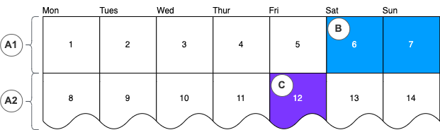
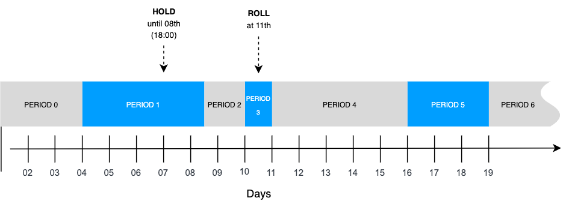

# Calendars

## What are Calendars?

### Purpose of Calendars

Calendars are optional Vault Core components allowing you to specify time periods for influencing processing activity. They have a number of use cases, such as:

-   Using them in Smart Contracts to avoid accruing or capitalising interest on weekends
    
-   Affecting the booking date in the balance reporting pipeline
    
-   A payments hub using them to implement payment scheme rules such as in the UK, whereby standing orders should not be processed on holidays
    

info

In Vault Core 5, support for pausing and resuming End-of-Day processing is available using [Processing Groups](/vault-core/5-9/EN/reference/processing_groups).

Calendars can leverage:

-   *Calendar Events*: Singular, specific time periods
    
-   *Calendar Periods*: Time periods recurring at regular, repeating intervals
    

You can create multiple Calendars to represent different use cases, and each calendar may have a single Calendar Period Descriptor associated with it, which will allow it to construct repeating Calendar Periods; the length of which can be set to either minute, hour, day, week, month, or year.

### Example Calendar

The following example illustrates how Periods and Events can be used in a Calendar. In this case:

-   The Calendar’s Period Descriptor is set to construct recurring seven day periods, starting on Monday the 1st (A1, A2 in the below diagram)
    
-   Two specific Calendar Events have been created; one for a weekend (B below), and another for a bank holiday (C below)
    

### Calendar resources

#### Calendar Event

A *Calendar Event* is a resource containing a pair of *UTC timestamps* that mark the start and end of a specific event. You can assign any name to an event - for example, "fps downtime", "public holiday", "weekend", or "working day".

The Calendar Event definition is open by design, so any component integrating with Vault Core can treat the Calendar Events as required. An event can span any duration, even less than a day.

A Calendar Event’s timestamps form a half-open interval, inclusive of the start time and exclusive of the end time. For instance, a Calendar Event that spans a whole day might have:

-   A `start_timestamp` of 01 March 2024 00:00:00
    
-   An `end_timestamp` of 02 March 2024 00:00:00
    

Calendar Events are streamed out upon creations and updates, to the Core Streaming API [CalendarEvents](/vault-core/5-9/EN/api/core_api#calendar_events) topic.

#### Calendar Period

A *Calendar Period* is an implicitly-defined recurring (and regular) interval in a Calendar. This interval marks when a cycle starts and ends given a unit of time, such as a day or year.

chat\_bubble

In order to use the Calendar Period functionality, a Calendar must have a [Calendar Period Descriptor](/vault-core/5-9/EN/reference/calendar#calendar_period_descriptor) associated with it.

Components integrating with Vault Core can get a unique identifier for the current cycle (`period`) by making a request through the Core API for the [Calendar Period](/vault-core/5-9/EN/api/core_api#calendarperiod). You can also request the corresponding cycle for a provided point in time in the past or the future.

In addition to requesting Period details on demand, [Period Creation Events](/vault-core/5-9/EN/api/core_api#calendarperiodevent) are published when a Calendar Period begins.

You can change the current Calendar Period by applying a [Hold or Roll](/vault-core/5-9/EN/reference/calendar#manipulating_holding_and_rolling_periods) action. A Hold action extends the end timestamp of a period, whereas a Roll action shortens the end timestamp of a period. Action timestamps for both Hold and Roll must be in the future.

To reference a bookkeeping date for the Calendar period, use the `expected_start_timestamp` or `expected_end_timestamp`.

#### Calendar Period Descriptor

The *Calendar Period Descriptor* describes the frequency of *Calendar Periods* created by the *Calendar* in the unit of time used (hours, days, weeks, months, years) and its value. The smallest period of time allowed by a Period Descriptor is 1 hour.

chat\_bubble

The *Calendar Period Descriptor* is integral to how frequently *Calendar Periods* are created by the *Calendar* - it must be defined first, and cannot later be modified.

Once a *Calendar* has been created (and set to active) with an assigned *Calendar Period Descriptor*, new periods will be created according to the Period Descriptor’s specification.

If a Calendar is inactive, no periods will be produced. When a Calendar is updated to be active again, Calendar Periods will resume, catching up as necessary.

The Period Descriptor also defines when the first period starts. When a Calendar is created with a Period Descriptor that starts in the past, the service will emit all Calendar Periods up to the present time.

chat\_bubble

A Calendar Period Descriptor can be shared between multiple Calendars.

#### Referencing Calendar Periods

A Calendar Period contains a monotonically increasing value, so that downstream processes integrating with Vault Core can introduce a strict ordering where this might have been lost during parallel processing within Vault Core. This value is transformed and derived from a timestamp provided by the calendar, which all components can use to reference the current period.

The periods, as they advance in time, are streamed out as events on the [CalendarPeriodEvent](/vault-core/5-9/EN/api/core_api#calendarperiodevent) Core streaming API topic on an *at least once* basis. Services integrating with Vault Core may listen to these period events based on the period descriptor associated with the Calendar they have created.

The streamed event will contain:

-   The current period, the calendar it is associated with
    
-   The `expected_start_timestamp` of the period
    
-   The `actual_start_timestamp` when the event was emitted.
    

These are required to indicate whether the event has been instructed to roll or hold.

chat\_bubble

Calendar periods have a period resolution of 1 day by default.

The following features help you to manage Calendar Periods:

-   *Calendar Period Descriptor*: Use to set the start and length of a period
    
-   *Hold and roll actions*: Manipulate the current period by extending or terminating the period interval
    
-   *Annotations*: Label Calendar Periods
    

## Calendar Period management

### Period numbers

Each Calendar Period is associated with a sequentially-assigned `period` number. The first period for a given calendar will have period 0. The next period will be number 1, the next is 2, and so on.

Calendars that share the same *Calendar Period Descriptor* will emit Calendar Period events with synchronised period numbers.

#### Example:

In this example, two Calendar Period Descriptors are created:

-   ID=Zeta, start timestamp=2025-10-01, daily interval
    
-   ID=Phi, start timestamp=2025-10-02, two day interval
    

Three calendars are also created, referencing the above Descriptors:

-   Calendar ID=**Alpha**, assigned with CPD ID=Zeta
    
-   Calendar ID=**Beta**, assigned with CPD ID=Zeta
    
-   Calendar ID=**Gamma**, assigned with CPD ID=Phi
    

Over the next seven days, the following periods would emit events:

   
| Date | Alpha | Beta | Gamma |
| --- | --- | --- | --- |
| 
2025-10-01

 | 

Period=0

 | 

Period=0

 | 

*No event*

 |
| 

2025-10-02

 | 

Period=1

 | 

Period=1

 | 

Period=0

 |
| 

2025-10-03

 | 

Period=2

 | 

Period=2

 | 

*No event*

 |
| 

2025-10-04

 | 

Period=3

 | 

Period=3

 | 

Period=1

 |
| 

2025-10-05

 | 

Period=4

 | 

Period=4

 | 

*No event*

 |
| 

2025-10-06

 | 

Period=5

 | 

Period=5

 | 

Period=2

 |
| 

2025-10-07

 | 

Period=6

 | 

Period=6

 | 

*No event*

 |

Note how periods from **Alpha** and **Beta** share the same period numbers, and the same start dates.

### Pausing Calendar Periods

To pause a Calendar Period, call PUT /v1/calendar/{calendar\_id}:updateDetails, setting `calendar.is_active` to "false".

This halts the production of Calendar Periods. When this calendar is later set to `active`, Calendar Period production resumes, catching up any missed periods.

chat\_bubble

Calendars can be created as inactive, which prevents periods from being produced until it is updated to active.

#### Example of pausing a Calendar

Given this Calendar Period Descriptor:

-   ID=`Xray`, start timestamp=`2025-10-01`, daily interval
    

This calendar is created at 2025-10-01:

-   Calendar ID=`Delta`, assigned with CPD ID=`Xray`
    

The first three days:

  
| Date | Periods emitted | For start timestamp |
| --- | --- | --- |
| 
2025-10-01

 | 

Period=0

 | 

2025-10-01

 |
| 

2025-10-02

 | 

Period=1

 | 

2025-10-02

 |
| 

2025-10-03

 | 

Period=2

 | 

2025-10-03

 |

After period 2 has been emitted, the Calendar is deactivated using the update request update request:

PUT `coreAPI/v1/calendar/Delta:updateDetails` with:

At this point, calendar periods will not be emitted.

Three days later on 2025-10-06, the Calendar is re-activated again:

The resulting effect looks like this:

  
| Date | Periods emitted | For start timestamp |
| --- | --- | --- |
| 
2025-10-04

 | 

None

 | 

N/A

 |
| 

2025-10-05

 | 

None

 | 

N/A

 |
| 

2025-10-06

 | 

Period=3

 | 

2025-10-04

 |
| 

Period=4

 | 

2025-10-05

 |
| 

Period=5

 | 

2025-10-06

 |
| 

2025-10-07

 | 

Period=6

 | 

2025-10-07

 |

Periods 3, 4 and 5 catch up after the Calendar is reactivated, and the periods are emitted as normal following this.

#### Example of an inactive Calendar on creation

Given this Calendar Period Descriptor:

-   ID=`Xray`, start timestamp=`2025-10-01`, daily interval
    

This calendar is created at 2025-10-01:

-   Calendar ID=`Echo`, IsActive=`false`, and assigned with CPD ID=`Xray`
    

Calendar periods are not emitted immediately, which also allows Bookkeeping labels to be defined in the meantime.

Five days later, on 2025-10-06, the calendar is activated.

This shows the effect on the generated calendar periods:

  
| Date | Periods emitted | For start timestamp |
| --- | --- | --- |
| 
2025-10-01

 | 

None

 | 

N/A

 |
| 

2025-10-02

 | 

None

 | 

N/A

 |
| 

2025-10-03

 | 

None

 | 

N/A

 |
| 

2025-10-04

 | 

None

 | 

N/A

 |
| 

2025-10-05

 | 

None

 | 

N/A

 |
| 

2025-10-06

 | 

Period=0

 | 

2025-10-01

 |
| 

Period=1

 | 

2025-10-02

 |
| 

Period=2

 | 

2025-10-03

 |
| 

Period=3

 | 

2025-10-04

 |
| 

Period=4

 | 

2025-10-05

 |
| 

Period=5

 | 

2025-10-06

 |
| 

2025-10-07

 | 

Period=6

 | 

2025-10-07

 |

### Starting in the past or future

The *Calendar Period Descriptor* defines a `start timestamp`, which determines when the first period starts from.

The *Calendar Service* will try to produce Calendar Periods up to the current system time. If the most recent period does not have an end timestamp in the future, the service will continue to produce periods for this associated Calendar until it is current. If the start time is in the future, the service will wait until this time before the first period will be produced.

### Manipulating - Holding and Rolling Periods

Periods usually tick over at regular intervals as defined by the Period Descriptor.

You can modify the intervals for the Periods that have been emitted most recently, either to extend the period (hold) or finish the period immediately (roll).

Holding or rolling the current period will affect the length of the next period:

-   Holding the current period will cause the next period to be shorter (unless it is subsequently held)
    
-   Rolling the current period will cause the next period to start earlier (as it must occur immediately after the end of the prior period) and have a longer time span (unless it is also subsequently rolled early)
    

#### Demonstration using a three-day period interval

Given this Calendar Period Descriptor:

-   ID=`Tri`, start timestamp=`2025-10-01 00:00:00`, with an interval of three days
    

This calendar is created at 2025-10-01:

-   Calendar ID=`Nautical`, assigned with CPD ID=`Tri`
    

In the first six days, two periods are emitted:

   
| Date | Periods emitted | For start timestamp |  |
| --- | --- | --- | --- |
| 
2025-10-01

 | 

Period=0

 | 

2025-10-01

 |  |
| 

2025-10-02

 | 

None

 | 

N/A

 |  |
| 

2025-10-03

 | 

None

 | 

N/A

 |  |
| 

2025-10-04

 | 

Period=1

 | 

2025-10-04

 |  |
| 

2025-10-05

 | 

None

 | 

N/A

 |  |
| 

2025-10-06

 | 

None

 | 

N/A

 |  |

##### Demonstrating HOLD

Before the next period is emitted, a request is sent to HOLD until `2025-10-08`.

PUT `coreAPI/v1/calendar/Nautical/period/current:change` with:

The emitted periods look like the following:

   
| Date | Periods emitted | For start timestamp | Action |
| --- | --- | --- | --- |
| 
2025-10-07

 | 

None

 | 

N/A

 | 

None

 |
| 

2025-10-08

 | 

Period=2

 | 

2025-10-07

 | 

HOLD until

 |
| 

2025-10-09

 | 

None

 | 

N/A

 | 

None

 |
| 

2025-10-10

 | 

Period=3

 | 

2025-10-10

 | 

None

 |

Period 1 has effectively been lengthened, while Period 2 has been shortened as the actual start is on `2025-10-08 18:00:00`, but it still ends at `2025-10-10 00:00:00`, so the effective duration is only 1 and a half days, instead of 3 days.

##### Demonstrating ROLL

Continuing the above example, and before the end of the day on 2025-10-10, we send a ROLL request to PUT `coreAPI/v1/calendar/Nautical/period/current:change` with:

This ends Period 3 early, and causes Period 4 to be effectively lengthened with an overall period length of five days:

   
| Date | Periods emitted | For start timestamp | Action |
| --- | --- | --- | --- |
| 
2025-10-10

 | 

Period=3

 | 

2025-10-10

 | 

None

 |
| 

2025-10-11

 | 

Period=4

 | 

2025-10-13

 | 

ROLL at

 |
| 

2025-10-12

 | 

None

 | 

N/A

 | 

None

 |
| 

2025-10-13

 | 

None

 | 

N/A

 | 

None

 |
| 

2025-10-14

 | 

None

 | 

N/A

 | 

None

 |
| 

2025-10-15

 | 

None

 | 

N/A

 | 

None

 |
| 

2025-10-16

 | 

Period=5

 | 

2025-10-16

 | 

None

 |
| 

2025-10-17

 | 

None

 | 

N/A

 | 

None

 |
| 

2025-10-18

 | 

None

 | 

N/A

 | 

None

 |
| 

2025-10-19

 | 

Period=6

 | 

2025-10-19

 | 

None

 |

#### Diagram to illustrate the effects of HOLD and ROLL

The following diagram illustrates the cumulative effects of the above actions on periods:

