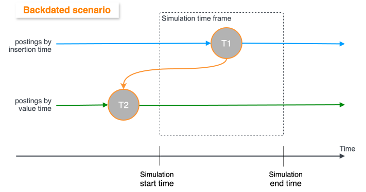
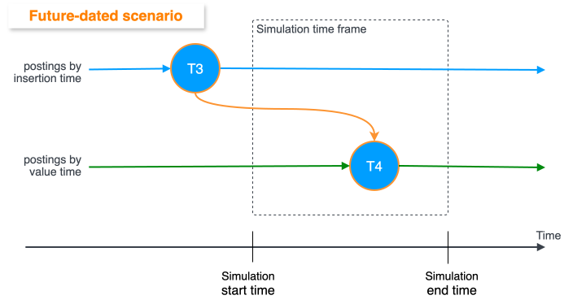

# Existing Account Simulation

info

Note the [unsupported features](/vault-core/5-9/EN/reference/contracts/contract_simulation#unsupported_features) that also apply to Existing Account Simulation.

*Existing Account Simulation* retrieves existing Accounts and their associated resources (referenced within a Smart Contract or Supervisor Contract hook execution) in the state they were at the defined simulation start time.

For existing accounts, the associated resources that are fetched to set up the simulation are:

-   Event type schedules
    
-   Schedule last execution times
    
-   Postings
    
-   Balances
    
-   Account flags
    
-   Instance parameters
    
-   Expected parameter values
    

You can use Existing Account Simulation to test an existing or new Smart Contract logic on an existing Account, and observe how the different Contract logic would behave given the Account’s state at the simulation start time.

chat\_bubble

Existing Account Simulation automatically retrieves some existing product data (postings, balances, expected parameters, and flags) associated with the Account.

For all other product-level data (calendars, global and template parameters), you must define [Existing Product Simulation](/vault-core/5-9/EN/reference/contracts/contract_simulation/existing_product_simulation) in your request.

## How to use Existing Account Simulation

To reference existing accounts in [your Simulation request](/vault-core/5-9/EN/reference/contracts/contract_simulation/how_to_use#prepare_your_request), define `existing_accounts[]` with the `account_id` of the existing Vault Core Account(s) you want to reference in the simulation.

If this is an internal account, set `is_internal` to `true`.

### Resources

As you write the [instructions](/vault-core/5-9/EN/reference/contracts/contract_simulation/how_to_use#instructions) for your Existing Account Simulation request, be aware of the limited support for the resources below.

info

Existing Account Simulation aims to recreate what the real Vault Core instance was at the simulation start timestamp. Therefore, it only retrieves existing data, resources, or Smart Contract hooks (including scheduled events) that were inserted **before** the simulation start time.

For more information, see [Timestamps in Existing Account Simulation](/vault-core/5-9/EN/reference/contracts/contract_simulation/existing_account_simulation#timestamps_in_existing_account_simulation).

#### Accounts

When you simulate an existing Account, do not specify its Smart Contract ID in `existing_smart_contracts[]` since Vault Core automatically retrieves the full state of the account, including the associated Smart Contract.

When fetching data for existing Accounts, Simulation refers to the hook requirements defined in their Smart Contract(s). If there is no hook requirement for a requirement data type, this data is not included in the simulation.

lightbulb

You can use Existing Account Simulation to create, convert, or close an account on a Smart Contract that references [expected\_parameters](/vault-core/5-9/EN/reference/contracts/contracts_api_4xx/smart_contracts_api_reference4xx/metadata#expected_parameters).

 
| Resource | Notes on Existing Account Simulation |
| --- | --- |
| 
Existing account status

 | 

Simulation only supports the following existing Account statuses at the simulation start time:

-   [v1 Accounts](/vault-core/5-9/EN/api/core_api#accounts_version_1): Any status, except for `ACCOUNT_STATUS_PENDING`.
    
    Running Simulation on an existing v1 Account in `PENDING` status may not trigger any Smart Contract hooks.
    
-   [v2 Accounts](/vault-core/5-9/EN/api/core_api#accounts_version_2): `ACCOUNT_STATUS_OPEN` or `ACCOUNT_STATUS_PENDING_CLOSURE`.
    
    Running Simulation on an existing v2 Account with any other status may result in an HTTP 400 response.
    

 |
| 

Mature accounts

 | 

Simulation may run slowly for existing accounts with a large amount of historical data. For example, if a Smart Contract hook has a requirement period of one year, Simulation will take time fetching thousands of postings for the account.

 |
| 

Migrated accounts

 | 

Simulation start timestamps set before the migration event of accounts created by the [Data Loader API](/vault-core/5-9/EN/environment_and_installation/migrating_to_vault/migrating_using_the_data_loader_api) (including migrated accounts with a `source_create_timestamp` before the simulation start timestamp) may result in a HTTP 400 response.

 |

#### Schedules

Existing Account Simulation only runs [Schedule](/vault-core/5-9/EN/reference/scheduler) jobs that are scheduled to execute within the simulation time frame.

 
| Resource | Notes on Existing Account Simulation |
| --- | --- |
| 
Schedule status

 | 

Simulation does not support existing Schedules with status `SCHEDULE_STATUS_DELAYED`.

 |
| 

Multiple simultaneous schedules

 | 

In Simulation, when multiple Schedules are set to run at the same timestamp for an existing account, all schedules will execute *before* their outcomes are processed. This means schedules will not see the outcomes of any jobs that share the same `instructions[].timestamp`. + If your schedules depend on the outcomes of another schedule, we suggest you define them to run sequentially so that event outcomes are always processed before the next event.

 |
| 

Rejected postings

 | 

In Simulation, if a Contract instructs Postings as part of a Schedule Job and any of these Postings are rejected, the Job and the Schedule are not marked as failed and subsequent Jobs continue to be created.

 |

#### Other resources

 
| Resource | Notes on Existing Account Simulation |
| --- | --- |
| 
Existing parameter values' Effective To timestamp

 | 

Simulation can only retrieve the `effective_to_timestamp` that is currently active for existing Parameter Values; it cannot retrieve past timestamps.

 |
| 

Existing accounts associated with Plans

 | 

Simulation supports existing Supervisor Contracts, however it does not support existing [Plans](/vault-core/5-9/EN/reference/plans). + Therefore, when you simulate an existing account, it will not resolve its existing supervision associations and Plans. Because of this, any existing Plan schedules overriding account schedules will not be respected by the Simulation.

 |

## Timestamps in Existing Account Simulation

Existing Account Simulation creates a simulated Vault Core instance that reflects what the production instance of Vault Core was at the simulation start time. Therefore, Simulation only retrieves historical values of associated data (including scheduled events) as they existed **up to the simulation start time**. When the simulation begins, the Simulation engine does not retrieve data that was inserted in the production Vault Core during the simulation period.

info

Existing Account Simulation only retrieves resources that were inserted **before or at** the simulation start time. A backdated resource that was inserted **after** the simulation start time will not be included in the simulation.

Simulation determines which existing data to retrieve based on the *insertion timestamp* of resources in Vault Core, rather than their *value/effective timestamp* (for more information, see [Timestamps in Vault Core](/vault-core/5-9/EN/reference/postings#timestamps_in_vault_core)):

-   *Insertion timestamp*: The real-time timestamp when the resource was created.
    
-   *Value/Effective timestamp*: The logical time of an event that is provided by the client in the Smart Contract hook execution. Sometimes referred to as the *effective time* of the resource.
    

If a resource has a value/effective timestamp earlier than its insertion timestamp, it is *backdated*. If a resource has a value/effective timestamp later than its insertion timestamp, it is *future-dated*.

### Backdated Postings

For example, if a posting was inserted in the production instance of Vault Core after the simulation start time (at T1), even if the value/effective timestamp (T2) was set before the simulation start time (backdated), the posting is **not** included in the simulation.

### Future-dated Postings

Conversely, if a posting was inserted in the production Vault Core before the simulation start time at T3, and its value/effective timestamp was set after the simulation start time (future-dated) at T4, the posting is included and runs at time T4 in the simulation.

## Example of Existing Account Simulation

The following is a simple example of an Existing Account Simulation that creates a new parameter value for an existing parameter (`example-parameter-1`) for Account ID `example-account-123` (assuming it already exists in your production Vault Core instance):

### Request body

Example Python request

### JSON response

Running the above script produces the following JSON response:

Example JSON response