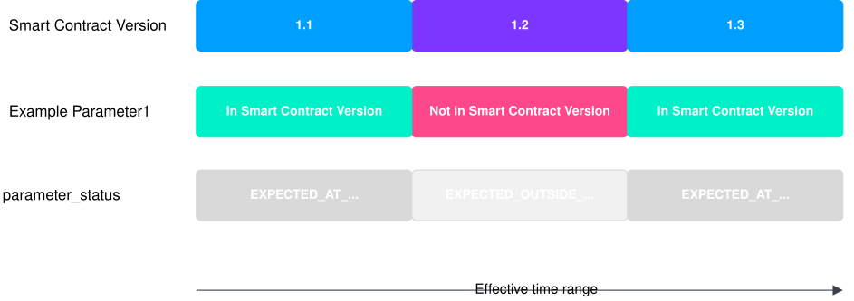
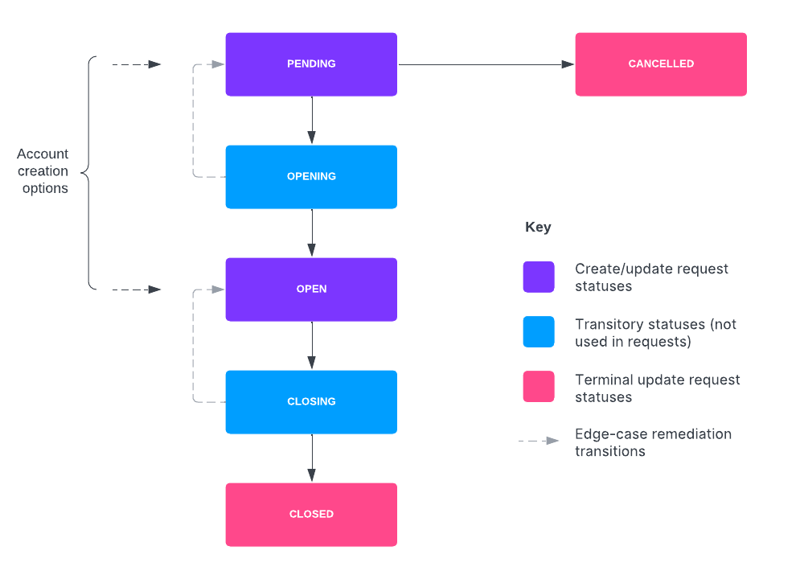

# Accounts version 2

## Managing Accounts

### Before you start

This section contains tutorials on how to perform some of the common tasks with Accounts. It includes example API requests and responses, and the Streaming events you can expect as a result of mutations.

chat\_bubble

These tutorials assume that you are:

-   Are using `v2/accounts` and the associated `vault.core_api.v2.accounts.account.events topic` (whether you have integrated anew with these, or have completed [Switching from v1 to v2 Accounts API](/vault-core/5-9/EN/reference/accounts/switching_from_v1_to_v2_accounts_api)).
    
-   Have uploaded a [Contracts Language V4](/vault-core/5-9/EN/reference/contracts/contracts_api_4xx/) Smart Contract containing `parameters` or `expected_parameters` syntax (and created any relevant Parameters).
    
-   Have the customer ID of a customer with the status CUSTOMER\_STATUS\_ACTIVE to associate with the Account you want to create.
    

### Creating an Account

#### Creating an Internal Account

chat\_bubble

Internal Accounts can also be created via the Configuration Layer Utility (CLU) when installing Vault Core. For more information, see [Resources supported for import](/vault-core/5-9/EN/environment_and_installation/infrastructure_docs/configuration_layer_utility_user_guide#resources_supported_for_import) in the CLU guidance.

Internal Accounts are always OPEN (and therefore cannot be CLOSED), and do not have an associated Smart Contract. To create an Internal Account via the Core API, Call `POST /v2/accounts`, providing the:

-   Unique `account.id`
    
-   `account.type` of `ACCOUNT_TYPE_INTERNAL`
    
-   `account.status` of `ACCOUNT_STATUS_OPEN`
    

chat\_bubble

-   The `processing_group_id` is set to `"DEFAULT"` if not provided.
    
-   If using Multiple Processing Groups (an Extension), set the `processing_label` field to use this Internal Account together with
    

##### Example create Internal Account request

##### Example create Internal Account response

##### Event streams

  
| Description | Event triggered | Streaming topic |
| --- | --- | --- |
| 
The Internal Account has been created.

 | 

[AccountEvent](/vault-core/5-9/EN/api/core_api#account_events_v2_topic)(AccountCreatedEvent)

 | 

`vault.core_api.v2.accounts.account.events`

 |

#### Creating a Customer Account

You create a Customer Account by requesting a PENDING state. When creating an account in PENDING state, no Smart Contract code will be executed.

To create a Customer Account in `PENDING` status, call `POST /v2/accounts`, providing the:

-   `account.status` of `ACCOUNT_STATUS_PENDING`
    
-   `account.type` of `ACCOUNT_TYPE_CUSTOMER`
    
-   `account.stakeholder_ids` of customers using the account
    
-   `account.smart_contract_version_id` of the Smart Contract backing this Account
    

You can also:

-   Create an account-owned Parameter value using `create_options.parameter_values`
    
-   Associate this account with a node in the [Parameter Value Hierarchy](/vault-core/5-9/EN/reference/parameters/building_and_managing_the_parameter_value_hierarchy) by providing a `parameter_value_hierarchy_node_id`
    

##### Example create Customer Account request

The following example is a request to create a Customer Account (by setting it to PENDING status), backed by a Smart Contract "23456":

##### Example create Customer Account response

The response confirms the Account status transition to `ACCOUNT_STATUS_PENDING`:

#### Event streams

  
| Description | Event triggered | Streaming topic |
| --- | --- | --- |
| 
The Customer Account has been created in PENDING status.

 | 

[AccountEvent](/vault-core/5-9/EN/api/core_api#account_events_v2_topic)(AccountCreatedEvent)

 | 

`vault.core_api.v2.accounts.account.events`

 |
| 

The Account-owned Parameter value creation (if requested in the PENDING API call) is confirmed.

 | 

[ParameterValueEvent](/vault-core/5-9/EN/api/core_api#parametervalueevent)(ParameterValueCreatedEvent)

 | 

`vault.core_api.v1.parameters.parameter_value.events`

 |

#### More information

-   For more information about Account statuses and lifecycles, see [Account statuses](/vault-core/5-9/EN/reference/accounts/accounts_version_2#account_statuses).
    
-   For more field-level information about Accounts, see the [Core API Accounts version 2](/vault-core/5-9/EN/api/core_api#accounts_version_2) resource.
    
-   For troubleshooting unresolved Account statuses, see [Troubleshooting Customer Accounts](/vault-core/5-9/EN/reference/accounts/accounts_version_2#troubleshooting_customer_accounts).
    

### Opening an Account

#### Opening a Customer Account created in Pending status

chat\_bubble

This tutorial assumes that you are aware of the [prerequisites](/vault-core/5-9/EN/reference/accounts/accounts_version_2#before_you_start_2).

To open a Customer Account you created in the `ACCOUNT_STATUS_PENDING` status, call `PUT /v2/accounts/{account.id}`, providing the account.status of `ACCOUNT_STATUS_OPEN` and `status` as a value in `update_mask.paths[]`.

##### Example open pending Account request

##### Example open pending Account response

The response confirms the Account status transition to OPEN:

##### Event streams

  
| Description | Event triggered | Streaming topic |
| --- | --- | --- |
| 
The Smart Contract `activation_hook` is triggered reporting the `ACCOUNT_STATUS_OPENING` status.

 | 

[AccountEvent](/vault-core/5-9/EN/api/core_api#account_events_v2_topic)(AccountUpdatedEvent)

 | 

`vault.core_api.v2.accounts.account.events`

 |
| 

Posting instruction directives have been committed (if any).

 | 

[PostingInstructionBatchCreatedEvent](/vault-core/5-9/EN/api/core_api#posting_events)

 | 

`vault.api.v1.postings.posting_instruction_batch.created`

 |
| 

The balance has been updated (if applicable).

 | 

Balance event ([AccountBalanceEvent](/vault-core/5-9/EN/api/core_api#accountbalanceevent))

As of Vault Core 5.7, you can receive streamed events whenever a Customer Account’s live value balance or booking balance changes, via [BalanceEvent](/vault-core/5-9/EN/api/core_api#balanceevent)

 | 

`vault.core_api.v1.balances.account_balance.events`, `vault.core_api.v2.balances.balance.events`

 |
| 

Contract notification directives have been processed (if any).

 | 

[ContractNotificationEvent](/vault-core/5-9/EN/api/core_api#contract_notification_events)

 | 

`vault.core_api.v1.contracts.contract_notification.events`

 |
| 

All Smart Contract directives have been committed, reporting the `ACCOUNT_STATUS_OPEN` status.

 | 

[AccountEvent](/vault-core/5-9/EN/api/core_api#account_events_v2_topic)(AccountUpdatedEvent)

 | 

`vault.core_api.v2.accounts.account.events`

 |

#### Opening a Customer Account on creation

chat\_bubble

This tutorial assumes that you are aware of the [prerequisites](/vault-core/5-9/EN/reference/accounts/accounts_version_2#before_you_start_2).

You can create and open a Customer Account in OPEN state. A request to transition the account into OPEN state will trigger the Smart Contract’s activation hook.

To create and open an Account, call `POST /v2/accounts`, providing the:

-   `account.type` of `ACCOUNT_TYPE_CUSTOMER`
    
-   `account.status` of `ACCOUNT_STATUS_OPEN`
    
-   `account.stakeholder_ids` of customers using the account
    
-   `account.smart_contract_version_id` of the Smart Contract backing this Account
    

You can also:

-   Create an account-owned Parameter value using `create_options.parameter_values`
    
-   Associate this account with a node in [the Parameter Value Hierarchy](/vault-core/5-9/EN/reference/parameters/building_and_managing_the_parameter_value_hierarchy) by providing a `parameter_value_hierarchy_node_id`
    
-   Backdate the opening of the Account using the `activation_timestamp`
    

##### Example open Account request

The following example is a request to OPEN a Customer Account, backed by a Smart Contract "12345". This example includes the creation of an account-owned Parameter value (a `decimal_value` of "1000"), which is referenced in the Smart Contract as: `expected_parameters = [ExpectedParameter(id="example_account_param")]`:

##### Example open Account response

The response confirms the Account status transition to `ACCOUNT_STATUS_OPEN`:

##### Event streams

  
| Description | Triggered event | Streaming topic |
| --- | --- | --- |
| 
The Smart Contract `activation_hook` is triggered reporting the `ACCOUNT_STATUS_OPENING` status.

 | 

[AccountEvent](/vault-core/5-9/EN/api/core_api#account_events_v2_topic)

-   (AccountCreatedEvent); or
    
-   (AccountUpdatedEvent) if the Account was initially set to PENDING
    

 | 

`vault.core_api.v2.accounts.account.events`

 |
| 

The Account-owned Parameter value creation (if requested) is confirmed.

 | 

[ParameterValueEvent](/vault-core/5-9/EN/api/core_api#parametervalueevent)(ParameterValueCreatedEvent)

 | 

`vault.core_api.v1.parameters.parameter_value.events`

 |
| 

Posting instruction directives have been committed (if any).

 | 

[PostingInstructionBatchCreatedEvent](/vault-core/5-9/EN/api/core_api#posting_events)

 | 

`vault.api.v1.postings.posting_instruction_batch.created`

 |
| 

The balance has been updated (if applicable).

 | 

Balance event ([AccountBalanceEvent](/vault-core/5-9/EN/api/core_api#accountbalanceevent))

As of Vault Core 5.7, you can receive streamed events whenever a Customer Account’s live value balance or booking balance changes, via [BalanceEvent](/vault-core/5-9/EN/api/core_api#balanceevent)

 | 

`vault.core_api.v1.balances.account_balance.events`, `vault.core_api.v2.balances.balance.events`

 |
| 

Contract notification directives have been processed (if any).

 | 

[ContractNotificationEvent](/vault-core/5-9/EN/api/core_api#contract_notification_events)

 | 

`vault.core_api.v1.contracts.contract_notification.events`

 |
| 

All Smart Contract directives have been committed, reporting the `ACCOUNT_STATUS_OPEN` status.

 | 

[AccountEvent](/vault-core/5-9/EN/api/core_api#account_events_v2_topic)(AccountUpdatedEvent)

 | 

`vault.core_api.v2.accounts.account.events`

 |

chat\_bubble

-   If for any reason the account status cannot transition to `ACCOUNT_STATUS_OPEN` (for example, Vault Core fails to create the schedules), the account status will move to `ACCOUNT_STATUS_PENDING` until the issue is resolved
    
-   Depending on the progress made, an account can also transition to `ACCOUNT_STATUS_OPEN`, but with errors. The returned error message indicates the failure reason and the state the account is currently in.
    

### Updating Account stakeholders

To update the stakeholders (customers) associated with an Account, call `PUT /v2/accounts/{account.id}`, providing the:

-   Customer ID(s) in `account.stakeholder_ids[]`
    
-   `stakeholder_ids` as a value in `update_mask.paths[]`
    

#### Example Account stakeholder update request

The following example request adds a new stakeholder to an Account, adding to the original `ee48f1f0-d1de-4591-a4c1-4889be830dec` stakeholder:

#### Example Account stakeholder update response

The response confirms the addition of the new stakeholder `2413ab25-7c25-4ef6-8ab7-a07b2cd7a0ab`:

#### Event streams

  
| Description | Event triggered | Streaming topic |
| --- | --- | --- |
| 
The stakeholder update is complete.

 | 

[AccountEvent](/vault-core/5-9/EN/api/core_api#account_events_v2_topic)(AccountUpdatedEvent)

 | 

`vault.core_api.v2.accounts.account.events`

 |

### Changing Account associations with Parameter Value Hierarchy Nodes

Customer Accounts can only be associated with one Parameter Value Hierarchy Node at a time.

You can associate an OPEN Customer Account with a new Parameter Value Hierarchy Node (removing any association from a current node), or you can just disassociate the Customer Account from a node (without associating it with a new node).

Changing an Account’s association with a node (for Smart Contracts opted in to hook execution) will trigger the:

-   `pre_parameter_change_hook`, even if the resolved value of the Parameter does *not* change as a result
    
-   `post_parameter_change_hook` only if the resolved value of the Parameter *does* change as a result
    

Call `PUT /v2/accounts/{account.id}`, providing the:

-   New node to assign the Customer Account to in `parameter_value_hierarchy_node_id` (or leave the field blank to disassociate the Account from its node)
    
-   `parameter_value_hierarchy_node_id` as a value in `​update_mask.paths[]​​`
    

#### Example request to assign a Customer Account to a new node

Assuming that the associated Smart Contract’s [pre\_parameter\_change\_hook](/vault-core/5-9/EN/reference/contracts/contracts_api_4xx/smart_contracts_api_reference4xx/hooks#pre_parameter_change_hook) accepted the change (or the hook was skipped), the response confirms the change to any Parameter value as a result of the new node assignment.

#### Event streams

  
| Description | Event triggered | Streaming topic |
| --- | --- | --- |
| 
The Account association with a node in the Parameter Value Hierarchy has changed.

 | 

[AccountEvent](/vault-core/5-9/EN/api/core_api#account_events_v2_topic)(AccountUpdatedEvent)

 | 

`vault.core_api.v2.accounts.account.events`

 |

### Retrieving effective Parameter Values for a Customer Account

You can query a point in time or a time range to either:

-   Retrieve details of the Parameter Values in effect on a Customer Account; or
    
-   View the Parameter Values that *would* affect a Customer Account if it was using an alternative Smart Contract, and/or one or more Parameters
    

To see a list of *current* effective Parameter Values for a Customer Account, call `GET /v1/parameter-values:viewEffective`, providing the:

-   Number of effective Parameter Values to be returned in `page_size`
    
-   ID of the Account in `account_id`
    

This is the most basic request, and will retrieve details of all Parameter Values currently in effect for the Customer Account provided (confirmed by a `parameter_status`: "PARAMETER\_STATUS\_EXPECTED\_AT\_EFFECTIVE\_TIME").

You can also:

-   Provide an alternative Smart Contract Version ID, to preview the Parameter Values that would affect this Account if it was backed by this Smart Contract Version; and/or
    
-   Provide Parameter IDs, to view the effects of these Parameters being included in any Smart Contract
    

warning

You can optionally provide a `snapshot_timestamp` to resolve all the Parameter Values as they were at that point in time. However:

-   This will only provide accurate data for backdated Parameter Value creations. It will **not** provide accurate data when the `snapshot_timestamp` is before:
    
    -   A future-dated Parameter Value creation or cancellation
        
    -   The `create_timestamp` of a new Parameter Value
        
    -   A Parameter Value’s `effective_to_timestamp` is explicitly updated
        
    
-   Thought Machine recommends using a time at least a few seconds in the past. This ensures that all Parameter Values are given enough time to process.
    
-   To include the opening time of a Customer Account, use the Account’s `source_create_timestamp`, not the `activation_timestamp`.
    

The following examples describe these additional options in more detail.

chat\_bubble

If you use the Parameter Value Hierarchy, you can also query the Parameter Values from its point of view. For more information, see [Retrieving effective Parameter values for a node](/vault-core/5-9/EN/reference/parameters/building_and_managing_the_parameter_value_hierarchy#retrieving_effective_parameter_values_for_a_node).

#### Examples of retrieval options

Point in time Time range

The following example cURL request is for effective Parameter values at a point in time for the Customer Account `b478075c-3e14-4fec-92f3-4bba8edec64a`. In this case, an alternative Smart Contract Version is provided, to view the effect this would have on the Account:

Example response

The response confirms the `effective_parameter_values` that would be applied to this Customer Account, as a result of being backed by the alternative Smart Contract Version:

The following example cURL request is for effective Parameter values within a time range for the Customer Account `b478075c-3e14-4fec-92f3-4bba8edec64a`. In this case, Parameter IDs are provided, to view the effect these would have on the Account if they were expected in a Smart Contract Version.

Example response

The response confirms the `effective_parameter_values` that would be applied to this Customer Account, if they were included in a Smart Contract:

#### Time ranges spanning multiple Smart Contract Versions

When an `account_id` is backed by more than one Smart Contract Version across a time range, and a Parameter is not expected in all Smart Contracts, the response includes Effective Parameter Values with:

-   The `parameter_status` : `…​EXPECTED_AT_EFFECTIVE_TIME` to indicate the *presence* of the Parameter in the Smart Contract backing the Customer Account at this time
    
-   The `parameter_status` : `…​EXPECTED_OUTSIDE_EFFECTIVE_TIME` to indicate the *absence* of the Parameter from the Smart Contract backing the Customer Account at this time
    

The following diagram illustrates this.

#### Diagram: Parameter status when spanning multiple Smart Contract Versions

### Retrieving details of Account associations with Parameter Value Hierarchy Nodes

To see a list of Customer Accounts associated with Parameter Value Hierarchy nodes (or Accounts not associated with any nodes), call `GET v2/accounts`, providing the:

-   `type` of `ACCOUNT_TYPE_CUSTOMER`
    
-   Either:
    
    -   `parameter_value_hierarchy_node_id` to see the Accounts associated with this node; or
        
    -   `parameter_value_hierarchy_node_id_include_subtree` to see the Accounts associated with this node and with all descendant nodes of this node; or
        
    -   `empty_parameter_value_hierarchy_node_id = true` to see all Accounts that are *not* associated with any nodes in the Parameter Value Hierarchy
        
    

#### Example request for Accounts associated with a Parameter Value Hierarchy Node

The following example cURL request is for Accounts associated with the Parameter Value Hierarchy node "B3":

The response lists all Accounts associated with the supplied `parameter_value_hierarchy_node_id`.

### Account conversions

Account conversions (formerly known as Account migrations) involve changing the Smart Contract Version backing one or more Customer Accounts.

warning

Ensure that any active conversion has finished before attempting another. Do not attempt to run two concurrent conversions from the same Accounts or Plans; for example Smart Contract version X to Y, and concurrently X to Z. This is because there are various race conditions that can affect the final state of the conversion. For more information, see [Checking Account conversion progress](/vault-core/5-9/EN/reference/accounts/accounts_version_2#checking_account_conversion_progress).

You can convert either:

-   [A single Account from one product version to another](/vault-core/5-9/EN/reference/accounts/accounts_version_2#converting_a_single_account_to_a_new_product_version); or
    
-   [Multiple Accounts to a new destination product version](/vault-core/5-9/EN/reference/accounts/accounts_version_2#converting_multiple_accounts_to_a_new_product_version)
    

#### Converting a single Account to a new product version

To convert one Customer Account to a new product version, call [PUT /v2/accounts/{account.id}](/vault-core/5-9/EN/api/core_api#_core_api_v2_accounts_Account_UpdateAccount), providing the:

-   `smart_contract_version_id` of the Smart Contract version to convert this Account to
    
-   `smart_contract_version_id` as a value in `update_mask.paths[]`
    

##### Example Account conversion request via v2 Accounts API

The following is an example request to convert an Account (`46ec9792-def0-4a3c-819c-40585df7f248`) to a new Smart Contract version "54321":

##### Example response to v2 Account conversion request

The response confirms that the Account has been converted to the new `smart_contract_version_id`:

##### Event streams

  
| Description | Event triggered | Streaming topic |
| --- | --- | --- |
| 
The `pending_smart_contract_version_id` is being processed.

 | 

[AccountEvent](/vault-core/5-9/EN/api/core_api#account_events_v2_topic)(AccountUpdatedEvent)

 | 

`vault.core_api.v2.accounts.account.events`

 |
| 

Posting instruction directives have been committed (if any).

 | 

[PostingInstructionBatchCreatedEvent](/vault-core/5-9/EN/api/core_api#posting_events)

 | 

`vault.api.v1.postings.posting_instruction_batch.created`

 |
| 

The balance has been updated (if applicable).

 | 

Balance event ([AccountBalanceEvent](/vault-core/5-9/EN/api/core_api#accountbalanceevent))

As of Vault Core 5.7, you can receive streamed events whenever a Customer Account’s live value balance or booking balance changes, via [BalanceEvent](/vault-core/5-9/EN/api/core_api#balanceevent)

 | 

`vault.core_api.v1.balances.account_balance.events`, `vault.core_api.v2.balances.balance.events`

 |
| 

Account notification directives have been processed (if any).

 | 

[ContractNotificationEvent](/vault-core/5-9/EN/api/core_api#contract_notification_events)

 | 

`vault.core_api.v1.contracts.contract_notification.events`

 |
| 

The Account has been converted to the new Smart Contract.(`pending_smart_contract_version_id` is returned empty, and `smart_contract_version_id` shows the new contract ID)

 | 

[AccountEvent](/vault-core/5-9/EN/api/core_api#account_events_v2_topic)(AccountUpdatedEvent)

 | 

`vault.core_api.v2.accounts.account.events`

 |

#### Converting multiple Accounts to a new product version

To convert several Customer Accounts to a new product version, call [POST v2/account-migrations](/vault-core/5-9/EN/api/core_api#_core_api_v2_accounts_AccountMigration_CreateAccountMigration), providing the:

-   Product version ID(s) that you want to convert Accounts from in `from_product_version_ids`
    
-   Destination product version ID for these Accounts in `to_product_version_id`
    

##### Example create Account conversion request

The following example is a request to convert Customer Accounts from product versions "1" and "2" to "3":

##### Example create Account conversion response

The response confirms the initial status of `ACCOUNT_MIGRATION_STATUS_PENDING_EXECUTION`:

##### Checking Account conversion progress

To monitor the progress of bulk conversions and resubmit the request to convert any missed Accounts, you can:

-   Use the Grafana [Core](/vault-core/5-9/EN/environment_and_installation/infrastructure_docs/observability_and_monitoring/using_the_observability_stack#core) **Account Management** dashboard folder and the **Bulk Operations Health** dashboard
    
-   Call [GET /v2/account-migrations:batchGet](/vault-core/5-9/EN/api/core_api#_core_api_v2_accounts_BatchGetAccountMigrationsResponse_BatchGetAccountMigrations)
    
-   Use the [Vault Jobs App](/vault-core/5-9/EN/reference/core_apps_and_operations_dashboard/vault_jobs#how_account_conversion_jobs_are_created)
    
    info
    
    A completed bulk conversion does not necessarily mean that all Accounts were successfully converted. It instead means that all conversions have reached a terminal status (such as successful or errored).
    

To check the status of all Accounts, you can:

-   call [GET /v2/accounts:batchGet](/vault-core/5-9/EN/api/core_api#_core_api_v2_accounts_BatchGetAccountsResponse_BatchGetAccounts) and check the `smart_contract_version_id`
    
-   listen to `vault.core_api.v2.accounts.account.events`
    

##### Event streams

  
| Description | Event triggered | Streaming topic |
| --- | --- | --- |
| 
The Vault Job has been created.

 | 

[JobCreatedEvent](/vault-core/5-9/EN/api/core_api#vault_jobs_events)

 | 

`vault.core_api.v1.vault_jobs.job.events`

 |
|  | 

The `pending_smart_contract_version_id` is being processed.

 | 

[AccountEvent](/vault-core/5-9/EN/api/core_api#account_events_v2_topic)(AccountUpdatedEvent)

 |
| 

`vault.core_api.v2.accounts.account.events`

 | 

Posting instruction directives have been committed (if any).

 | 

[PostingInstructionBatchCreatedEvent](/vault-core/5-9/EN/api/core_api#posting_events)

 |
| 

`vault.api.v1.postings.posting_instruction_batch.created`

 | 

The balance has been updated (if applicable).

 | 

Balance event ([AccountBalanceEvent](/vault-core/5-9/EN/api/core_api#accountbalanceevent))

As of Vault Core 5.7, you can receive streamed events whenever a Customer Account’s live value balance or booking balance changes, via [BalanceEvent](/vault-core/5-9/EN/api/core_api#balanceevent)

 |
| 

`vault.core_api.v1.balances.account_balance.events`, `vault.core_api.v2.balances.balance.events`

 | 

Account notification directives have been processed (if any).

 | 

[ContractNotificationEvent](/vault-core/5-9/EN/api/core_api#contract_notification_events)

 |
| 

`vault.core_api.v1.contracts.contract_notification.events`

 | 

The Account has been converted to the new Smart Contract.(`pending_smart_contract_version_id` is returned empty, and `smart_contract_version_id` shows the new contract ID)

 | 

[AccountEvent](/vault-core/5-9/EN/api/core_api#account_events_v2_topic)(AccountUpdatedEvent)

 |
| 

`vault.core_api.v2.accounts.account.events`

 | 

The Vault Job has been updated.

 | 

[JobUpdatedEvent](/vault-core/5-9/EN/api/core_api#vault_jobs_events)

 |

### Cancelling or closing a Customer Account

A PENDING Customer Account can be cancelled, or an OPEN Customer Account can be closed.

#### Cancelling a Customer Account

A Customer Account can be cancelled if it is in the PENDING status.

chat\_bubble

The CANCELLED status is a terminal status, and cannot be changed.

To cancel a Customer Account, call `PUT /v2/accounts/{account.id}`, providing the:

-   Requested `account.status` of `ACCOUNT_STATUS_CANCELLED`
    
-   `status` as a value in `update_mask.paths[]`
    

##### Example Account cancellation request

##### Example Account cancellation response

The response confirms the Account status transition to ACCOUNT\_STATUS\_CANCELLED:

##### Event streams

  
| Description | Event triggered | Streaming topic |
| --- | --- | --- |
| 
The account status has been updated to CANCELLED.

 | 

[AccountEvent](/vault-core/5-9/EN/api/core_api#account_events_v2_topic)(AccountUpdatedEvent)

 | 

vault.core\_api.v2.accounts.account.events

 |

#### Closing a Customer Account

A Customer Account can be closed if it is in the OPEN status.

chat\_bubble

The CLOSED status is a terminal status, and cannot be changed.

To close a Customer Account, call `PUT /v2/accounts{account.id}`, providing the:

-   Requested `account.status` of `ACCOUNT_STATUS_CLOSED`
    
-   `status` as a value in `update_mask.paths[]`
    

##### Example Account closure request

The following example is a request to close a Customer Account (`d8fef4d9-caf0-4565-8eca-b49f0733105b`):

Vault Core initially applies the status `ACCOUNT_STATUS_CLOSING`, and attempts to commit the Smart Contract directives, terminate schedules, and close the ledger for the Account as part of the same synchronous call:

-   If there are no restrictions preventing the closure of the Account, and the balance of the Account (including any future-dated Postings) is zero, the Account status in the response will be `ACCOUNT_STATUS_CLOSED` - the deactivation hook has run, all Smart Contract directives have been committed, all balances are zero, and all schedules have been terminated.
    
    chat\_bubble
    
    The balance check includes all Posting Instructions with a `value_timestamp` up to and including 90 calendar days in the future (from the time of the request).
    
-   If for any reason the Account cannot be closed, an error will be returned and the status response will be `ACCOUNT_STATUS_OPEN` or `ACCOUNT_STATUS_CLOSED`, depending on where the error occurred. For more information, see [Troubleshooting Customer Accounts](/vault-core/5-9/EN/reference/accounts/accounts_version_2#troubleshooting_customer_accounts).
    

##### Example Account closure response

The following example response confirms a successfully CLOSED Customer Account:

##### Event streams

  
| Description | Event triggered | Streaming topic |
| --- | --- | --- |
| 
The Account CLOSING is in progress.

 | 

[AccountEvent](/vault-core/5-9/EN/api/core_api#account_events_v2_topic)(AccountUpdatedEvent)

 | 

vault.core\_api.v2.accounts.account.events

 |
| 

The Posting instruction directives have been committed.

 | 

[PostingInstructionBatchCreatedEvent](/vault-core/5-9/EN/api/core_api#posting_events)

 | 

vault.api.v1.postings.posting\_instruction\_batch.created

 |
| 

The balance has been updated (if applicable).\*

 | 

Balance event ([AccountBalanceEvent](/vault-core/5-9/EN/api/core_api#accountbalanceevent))

As of Vault Core 5.7, you can receive streamed events whenever a Customer Account’s live value balance or booking balance changes, via [BalanceEvent](/vault-core/5-9/EN/api/core_api#balanceevent)

 | 

`vault.core_api.v1.balances.account_balance.events`, `vault.core_api.v2.balances.balance.events`

 |
| 

Account notification directives have been processed.

 | 

[ContractNotificationEvent](/vault-core/5-9/EN/api/core_api#contract_notification_events)

 | 

vault.core\_api.v1.contracts.contract\_notification.events

 |
| 

The Account has been successfully CLOSED.

 | 

[AccountEvent](/vault-core/5-9/EN/api/core_api#account_events_v2_topic)(AccountUpdatedEvent)

 | 

vault.core\_api.v2.accounts.accounts.events

 |

\* Any remaining future-dated Postings will still emit balance events when their `value_timestamp` is reached, even after the account has been closed.

## Troubleshooting Customer Accounts

Vault Core will automatically retry Customer Account status (or Account Conversion) requests. In exceptional cases, however, these can fail to resolve as requested. In a failure scenario, Account statuses will either:

-   *Fail 'backward'*: The status transitions backward to the original (or a precursor) status, with an error. Typically caused by the Schedules failing to be created or updated.
    
-   *Fail 'forward'*: The status transitions to the requested status, but with an error. Typically caused by the Postings being rejected, or by AccountNotificationDirectives failing.
    

The following table summarises the various failure scenarios and the transitions triggered:

   
| Account operation | Schedule failure | Postings failure | Notifications failure |
| --- | --- | --- | --- |
| 
Account opening (on creation)

 | 

PENDING (precursor status)

 | 

OPEN (forward)

 | 

OPEN (forward)

 |
| 

Account opening (via an update from PENDING)

 | 

PENDING (back)

 | 

OPEN (forward)

 | 

OPEN (forward)

 |
| 

Conversion

 | 

Stay on the current Smart Contract (back)

 | 

Move to the new Smart Contract (forward)

 | 

Move to the new Smart Contract (forward)

 |
| 

Account closure

 | 

OPEN (back)

 | 

OPEN (back)

 | 

CLOSED (forward)

 |

You can view the error message for specific details, but this section contains some of the more typical failure scenarios and how to remedy them.

### Failures when trying to OPEN a Customer Account

When a request is made to [OPEN a Customer Account](/vault-core/5-9/EN/reference/accounts/accounts_version_2#creating_an_account) via `POST v2/accounts`, this section explains some typical failures that can occur, and how to remedy them:

  
| Synchronous error response status | Event streams | Remediation |
| --- | --- | --- |
| 
`PENDING`

 | 

-   AccountEvent (AccountCreatedEvent) - status `OPENING`, or (AccountUpdatedEvent) if the Account was created in PENDING first, then requested to OPEN
    
-   AccountEvent (AccountUpdatedEvent)
    
-   status `PENDING` with error
    

 | 

-   Check the Smart Contract, it is likely to need modifying
    
-   Convert the pending Account to the modified Smart Contract version
    
-   Call PUT `v2/accounts` to [update the Account(s) to OPEN](/vault-core/5-9/EN/reference/accounts/accounts_version_2#opening_an_account)
    

 |
| 

`OPEN`

 | 

-   AccountEvent (AccountCreatedEvent) - status `OPENING`, or (AccountUpdatedEvent) if the Account was created in PENDING first, then requested to OPEN
    
-   AccountEvent (AccountUpdatedEvent) - status `OPEN` with error
    

 | 

-   Instruct new Postings via the [Postings APIs](/vault-core/5-9/EN/api/postings_api#postings_apis)
    
-   Depending on the scenario, you may want to remedy the failed Account(s) via a call to PUT `v2/accounts` to [Convert the Account(s)](/vault-core/5-9/EN/reference/accounts/accounts_version_2#account_conversions) to a new Smart Contract.
    

 |

### Failures when trying to convert a Customer Account

When a request is made to [convert a Customer Account](/vault-core/5-9/EN/reference/accounts/accounts_version_2#account_conversions) to a new Smart Contract version via `PUT v2/accounts`, this section explains some typical failures that can occur, and how to remedy them. In the case of Account Conversions, the status does not change; instead the failure is indicated by the behaviour of the `smart_contract_version_id` field:

  
| Synchronous error response field content | Event streams | Remediation |
| --- | --- | --- |
| 
`smart_contract_version_id` populated with current (pre-conversion) version

 | 

AccountEvent (AccountUpdatedEvent) with error

 | 

Check the Smart Contract, it is likely to need Scheduled Events remediation- Retry the conversion for the failed Accounts

 |
| 

`smart_contract_version_id` populated with new version

 | 

AccountEvent (AccountUpdatedEvent) with error

 | 

-   It is likely that [Postings](/vault-core/5-9/EN/api/postings_api#postings_apis) or [AccountNotificationDirectives](/vault-core/5-9/EN/reference/contracts/contracts_api_4xx/common_types_4xx/classes#accountnotificationdirective) have failed. Remedy these as applicable.
    
-   Retry the conversion for the failed Accounts
    

 |

### Failures when trying to CLOSE a Customer Account

When a request is made to [close a Customer Account](/vault-core/5-9/EN/reference/accounts/accounts_version_2#closing_a_customer_account) via POST `v2/accounts`, this section explains some failures that can occur, and how to remedy them:

  
| Synchronous error response status | Event streams | Remediation |
| --- | --- | --- |
| 
`OPEN`

 | 

-   AccountEvent (AccountUpdatedEvent)
    
-   status `CLOSING`\- AccountEvent (AccountUpdatedEvent)
    
-   status `OPEN` with error
    

 | 

-   Typically the balance failed to reach zero, or some schedules failed to terminate. Make the necessary changes (for example by instructing [Postings](/vault-core/5-9/EN/api/postings_api#using_the_api) to zero the balance)
    
-   Call `PUT /v2/accounts{account.id}` to resend the [close account request](/vault-core/5-9/EN/reference/accounts/accounts_version_2#closing_a_customer_account).
    

 |
| 

`CLOSED`

 | 

-   AccountEvent (AccountUpdatedEvent)
    
-   status `CLOSING`
    
-   AccountEvent (AccountUpdatedEvent)
    
-   status `CLOSED` with error
    

 | 

-   This is most likely due to an [AccountNotificationDirective](/vault-core/5-9/EN/reference/contracts/contracts_api_4xx/common_types_4xx/classes#accountnotificationdirective) being too large for Kafka to consume. In this case, the Smart Contract will need remediation.
    
-   Otherwise, in an extremely unlikely event, either the Schedules failed to deactivate, or Account Notifications failed for other reasons. For this to occur, persistent infrastructure issues may be the cause.
    

 |

## Account statuses

Account statuses play a key role in determining what operations can or cannot be performed on behalf of a Customer Account.

chat\_bubble

Internal Accounts do not have a lifecycle like Customer Accounts; they are always in the OPEN status, they cannot be updated to the CLOSED status, and are essentially destinations for the institution’s funds.

### Account lifecycle statuses

chat\_bubble

In exceptional circumstances (when a Customer Account cannot fully resolve a requested status), Account statuses can transition:

-   From OPENING to PENDING
    
-   From OPENING to OPEN, but with errors
    
-   From CLOSING back to OPEN
    
-   From CLOSING to CLOSED, but with errors
    

For more information, see [Troubleshooting Customer Accounts](/vault-core/5-9/EN/reference/accounts/accounts_version_2#troubleshooting_customer_accounts).

### Account status descriptions

Every Customer Account is in one of the following statuses. For brevity, the prefix `ACCOUNT_STATUS_` has been omitted.

chat\_bubble

For more information about the status types, see [Account status types](#account_status_types).

  
| Status | Status type | Description |
| --- | --- | --- |
| 
`PENDING`

 | 

Persistent, creation state, allows Account conversions

 | 

An optional precursor status when setting up an account, but before moving it to OPEN. When requested, this means that no hook has yet been run, no schedules will exist, and Postings will be rejected.

 |
| 

`CANCELLED`

 | 

Persistent, terminal state, does not allow Account conversions

 | 

An optional status which can be used to prevent a PENDING account from moving to OPEN.

 |
| 

`OPENING`

 | 

Transitory, does not allow Account conversions

 | 

Initial status given when requesting an account to OPEN. The account is in the process of opening - the activation hook succeeded at least once, but the Smart Contract directives it produced may or may not have been committed.

 |
| 

`OPEN`

 | 

Persistent, creation state, allows Account conversions

 | 

OPEN is used to request the opening of an account. Initially the account will be given the OPENING status above. When the status reaches OPEN (without errors), the account is open - the activation hook has run and all Smart Contract directives have been committed. The account is ready for business-as-usual (BAU) usage. OPEN is also the only status used by Internal Accounts.

 |
| 

`CLOSING`

 | 

Transitory, does not allow Account conversions

 | 

Initial status given when updating an account to CLOSED. The account is in the process of closing - the deactivation hook succeeded at least once, but the Smart Contract directives it produced may or may not have been committed.

 |
| 

`CLOSED`

 | 

Persistent, terminal state, does not allow Account conversions

 | 

CLOSED is used to request the closing of an account. Initially the account will be given the CLOSING status above. When the status reaches CLOSED (without errors), the account is closed - the deactivation hook has run, all directives have been committed, all balances are zero and cannot change, and all schedules have been terminated.

 |
| 

'converting'(implied by a non-empty `pending_smart_contract_version_id`, does not affect `ACCOUNT_STATUS_…​`)

 | 

Transitory

 | 

Used when converting an Account to a new Smart Contract. The conversion hook succeeded at least once, but the directives may or may not have been committed. When an event indicates that the content of `pending_smart_contract_version_id` is empty, and is instead populated in `smart_contract_version_id` (and there are no errors), the Account has successfully converted to the new Smart Contract.

 |
| 

`PENDING_OPENING` (temporary, deprecated)

 | 

Temporary state, only used for requests made via `v1/accounts`. Deprecated and will be removed no earlier than Vault Core 7.0.

 | 

Indicates the same state as the OPENING status, but only if the activation request was made via the `/v1/accounts` endpoint.

 |
| 

`PENDING_CLOSURE` (legacy, deprecated)

 | 

Legacy state, only used for requests made via `v1/accounts`. Deprecated and will be removed no earlier than Vault Core 7.0.

 | 

Replaced by the improved CLOSING status above. Will need to be mapped to CLOSING before Vault Core 7.0.

 |

### Account status types

A Customer Account status is either one of the two following types. For details of which types apply to which status, see [Account status descriptions](#account_status_descriptions).

#### Persistent and transitory statuses

##### Persistent statuses

A *persistent* status is one that an account can be in indefinitely, with guarantees relating to whether Smart Contract Hooks have run. You can request any persistent status via the [Accounts v2](/vault-core/5-9/EN/api/core_api#account) resource:

-   A *creation* status is used to create a Vault Core account; the two options are PENDING or OPEN.
    
-   A *terminal* status is used to deactivate a Vault Core account; the two options are CANCELLED or CLOSED.
    

##### Transitory statuses

A *transitory* status is internally given by Vault Core, and is one that an account must move out of eventually. Under normal operating conditions the majority of accounts will spend only fractions of a second in a transitory status.

Transitory statuses cannot be requested, and cannot provide guarantees about the state of the account; some, none, or all directives returned by a Smart Contract Hook may have been committed. While in transitory statuses, certain operations are prevented to avoid invalid conditions. For more information, see the Core API [Accounts v2](/vault-core/5-9/EN/api/core_api#v2) resource.

chat\_bubble

Vault Core will continually try to move accounts out of transitory statuses by retrying the original request the same way a user of the API would. For more information, see [Troubleshooting Customer Accounts](/vault-core/5-9/EN/reference/accounts/accounts_version_2#troubleshooting_customer_accounts). Where several accounts are left in a transitory status, this suggests a more widespread issue - we recommend investigating your infrastructure (such as the database or Kafka health), followed by investigating affected accounts if no infrastructure issues are apparent.

##### The 'converting' transitory status

When performing an account conversion (converting a Customer Account over to a new Smart Contract), an implicit 'converting' transitory status is given. This does not affect the current status of the Account; instead it is used to indicate that the conversion is in progress.

A 'converting' Account is indicated by the populating of the `pending_smart_contract_version_id` field. This field is intended to only be set temporarily for the duration of the request to update the Account to a new Smart Contract Version; if it remains populated for any length of time it may indicate that user intervention is required.

#### Convertible and non-convertible statuses

-   A *convertible* status allows a Customer Account to have its Smart Contract version changed (also known as account conversion). The convertible statuses are PENDING and OPEN.
    
-   A *non-convertible* status does not allow a Customer Account to have its Smart Contract version changed. The non-convertible statuses are OPENING, CLOSING, CLOSED and CANCELLED.