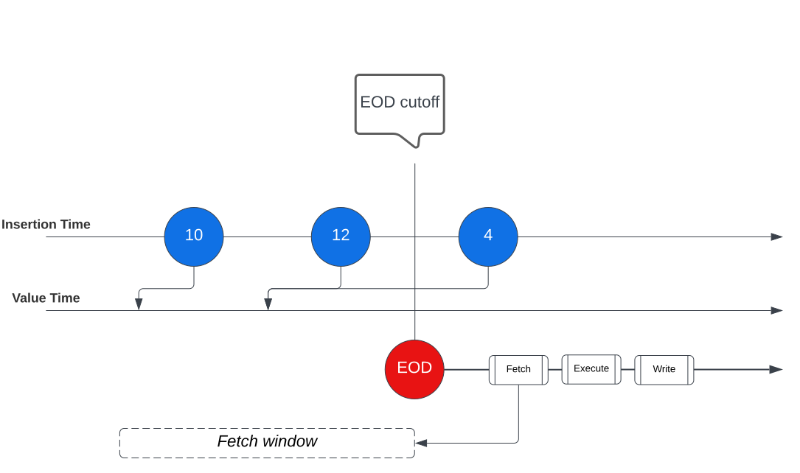

# General concepts

Writing Smart Contracts involves understanding several concepts, some of which are listed below.

The concepts that follow are general across Contract Language API 4 only.

## Contract Parameters

Parameters can be used to give Smart Contracts access to certain configurable values that may not be available at the time of writing the contract; for example, the current central bank interest rate, or the day of the month that a particular customer wants their interest paid on.

From Vault Core 5, we introduced the [Parameters](/vault-core/5-9/EN/api/core_api#parameters) resource, and the Expected Parameters syntax to reference these Parameters.

### Expected Parameters

#### Use of Expected Parameters

Expected Parameters are used to reference parameters created via the [Core API Parameters](/vault-core/5-9/EN/api/core_api#parameters) resource, introduced in Vault Core 5. A Smart Contract can define a list of [ExpectedParameters](/vault-core/5-9/EN/reference/contracts/contracts_api_4xx/common_types_4xx/classes#expectedparameter) in its [metadata](/vault-core/5-9/EN/reference/contracts/contracts_api_4xx/smart_contracts_api_reference4xx/metadata#expected_parameters), which provide an external means of configuring the Smart Contract’s behaviour.

Core API Parameter values can be accessed from within the Smart Contract via parameter fetchers. To learn about Core API Parameters, see [Parameters](/vault-core/5-9/EN/reference/parameters/).

chat\_bubble

Supervisor contracts do not currently support `expected_parameters` syntax, and will not have visibility of parameters defined in supervised accounts using `expected_parameters` syntax.

error

You cannot use Expected Parameters in conjunction with the [Accounts version 1 API](/vault-core/5-9/EN/api/core_api#accounts_version_1). v1 Accounts integrations must:

1.  Follow the process for [switching from v1 to v2 Accounts API](/vault-core/5-9/EN/reference/accounts/switching_from_v1_to_v2_accounts_api); then
    
2.  Complete the [switch to the Core API Parameters resource](/vault-core/5-9/EN/reference/parameters/switching_to_core_api_parameters).
    

#### Defining Expected Parameters in Smart Contracts

An Expected Parameter defined in the Smart Contract metadata specifies:

-   The parameter `id`, which must have been created via the [Parameters API](/vault-core/5-9/EN/api/core_api#parameters) prior to uploading the Smart Contract
    
-   Optionally, a `constraint`, specifying the Parameter type and validation; if the constraint *is* specified, it must precisely match the constraint as created via the Parameters API
    
-   Vault Core will validate that there is a match
    

The values that an Account can access for each Expected Parameter are set (only) via the Parameters API, which introduced hierarchical value ownership. For more information, see [Parameters](/vault-core/5-9/EN/reference/parameters/).

#### Fetching parameter values in a Smart Contract

Once expected parameters are defined as part of the [contract metadata](/vault-core/5-9/EN/reference/contracts/contracts_api_4xx/smart_contracts_api_reference4xx/metadata#expected_parameters), a data fetcher must also be defined in the contract metadata (see [Account data fetchers](/vault-core/5-9/EN/reference/contracts/contracts_api_4xx/concepts#data_fetchers)). The fetcher specifies:

-   A (optional) list of parameter IDs for which values will be retrieved
    
-   Either an instant of time (for a [ParameterObservationFetcher](/vault-core/5-9/EN/reference/contracts/contracts_api_4xx/common_types_4xx/classes#parametersobservationfetcher)) or a period of time (for a [ParametersIntervalFetcher](/vault-core/5-9/EN/reference/contracts/contracts_api_4xx/common_types_4xx/classes#parametersintervalfetcher)) for which to resolve the values.
    

To retrieve values in a Smart Contract, the fetcher ID must be specified in the `fetch_account_data` decorator. Finally, the values can be retrieved using [get\_parameter\_timeseries](/vault-core/5-9/EN/reference/contracts/contracts_api_4xx/smart_contracts_api_reference4xx/vault#get_parameter_timeseries) or [get\_parameters\_observation](/vault-core/5-9/EN/reference/contracts/contracts_api_4xx/smart_contracts_api_reference4xx/vault#get_parameters_observation).

### Parameters

The parameters required by an account can be divided into three tiers:

-   `GLOBAL`: Bank-wide values such as the native currency or central bank interest rate
    
-   `TEMPLATE` (`PRODUCT`): Values common to all accounts running on a particular Smart Contract. For example, a product-specific interest rate, overdraft rate, or deposit limit
    
-   `INSTANCE`: Values specific to one account running on the Smart Contract. For example, a day-of-month the customer would like their interest paid on, or a particular limit placed on the customer’s individual account
    
    info
    
    Thought Machine recommends that you understand the [Parameters changes](/vault-core/5-9/EN/vault_core_overview/whats_new_in_vc5/overview#parameters_changes) before creating any new Instance Parameters on Vault Core 5; in particular [Parameter mapping](/vault-core/5-9/EN/vault_core_overview/whats_new_in_vc5/overview#parameter_mapping).
    

lightbulb

[Expected parameters](/vault-core/5-9/EN/reference/contracts/contracts_api_4xx/concepts#expected_parameters) provide more features than `GLOBAL` or `INSTANCE` parameters, and are the recommended solution for account-based configuration. `TEMPLATE` parameters can still be used for product-level parameters.

`GLOBAL` parameters are defined elsewhere in Vault; they are optionally set via the Configuration Layer Utility (CLU) at the time of bank instantiation and can be updated via the Core API. Their definitions do not need to be repeated by each Smart Contract that uses them; it is enough to specify them by name in the `global_parameters` list in the metadata section.

`TEMPLATE` and `INSTANCE` level parameters must have their structures defined in full inside the Smart Contract as they are unique to the given contract. Initial values for `TEMPLATE` parameters must be provided at the time the Smart Contract is uploaded, and initial `INSTANCE` level values must be provided on Account creation. Parameters of both types are updatable during the lifecycle of any given Smart Contract, via the Core API.

Parameters can also be derived parameters. This means that rather than defining its own value, a derived parameter’s value is instead programmatically generated from other parameters or account data. More information about derived parameters can be found at [Parameter](/vault-core/5-9/EN/reference/contracts/contracts_api_4xx/common_types_4xx/classes#parameter) and [derived\_parameter\_hook](/vault-core/5-9/EN/reference/contracts/contracts_api_4xx/smart_contracts_api_reference4xx/hooks#derived_parameter_hook).

chat\_bubble

Values for derived parameters (values returned by [derived\_parameter\_hook](/vault-core/5-9/EN/reference/contracts/contracts_api_4xx/smart_contracts_api_reference4xx/hooks#derived_parameter_hook)) are not persisted; they are not stored in the database but calculated on demand. They are therefore not returned from the [get\_parameter\_timeseries](/vault-core/5-9/EN/reference/contracts/contracts_api_4xx/smart_contracts_api_reference4xx/vault#get_parameter_timeseries) function. This is by design because Smart Contracts already have access to any value that is considered "derived". For example, a Smart Contract can have helper functions that return derived values. These can be used by both the `derived_parameter_hook` and any other part of the Smart Contract requiring this value.

In [Contracts Language API Version 4.0.0](/vault-core/5-9/EN/reference/contracts/contracts_api_4xx/smart_contracts_api_reference4xx/) each Smart Contract must import and define (assigned to the `parameters` variable) a list of [Parameter](/vault-core/5-9/EN/reference/contracts/contracts_api_4xx/common_types_4xx/classes#parameter) objects:

Each parameter defines a typed object as well as the required metadata (e.g. a `min_value`) to allow Vault to automatically build a widget to make the parameter settable via a front-end interface.

chat\_bubble

Some fields (e.g. `update_permission`) only apply to `INSTANCE` level parameters.

More details on the structure of these objects can be found at [Parameter](/vault-core/5-9/EN/reference/contracts/contracts_api_4xx/common_types_4xx/classes#parameter). Values for parameters are set before (for `GLOBAL`/`TEMPLATE` (`PRODUCT`) level) or at (for `INSTANCE` level) the creation of an Account, and are guaranteed to be accessible throughout the life of the Account. Because these parameter values can change over the lifecycle of an Account, Vault stores a timeseries of values for each parameter. One example could be a parameter called `'overdraft_limit'`, and the timeseries would represent changes to a customer’s limit each year as a result of credit rescoring.

See [get\_parameter\_timeseries](/vault-core/5-9/EN/reference/contracts/contracts_api_4xx/smart_contracts_api_reference4xx/vault#get_parameter_timeseries) for more details.

## Account Attributes

[Account Attributes](/vault-core/5-9/EN/reference/accounts/account_attributes/) are a way to expose account-specific information by computing outputs derived from Smart Contracts at particular points in time. They work similarly to derived parameters, but have clearer delineation from Core API Parameters, and enhanced functionality and performance.

### Defining Account Attributes

An Account Attribute defined in the Smart Contract metadata specifies:

-   The Account Attribute `name`
    
    chat\_bubble
    
    Account Attribute names need only be unique per Smart Contract - it is worth the API caller being aware of this, because a particular Account Attribute could potentially have different behaviour in different Smart Contracts.
    
-   The Account Attribute `data_type`
    

The following Account Attribute data types are supported:

 
| Usage in Smart Contract | Response (path) in API |
| --- | --- |
| 
AttributeDateTimeType

 | 

`value.date_time_value.value`

 |
| 

AttributeDecimalType

 | 

`value.decimal_value.value`

 |
| 

AttributeStringType

 | 

`value.string_value.value`

 |

### Defining attribute\_hook Fetchers in a Smart Contract

The `attribute_hook` supports all fetching using both the `fetch_account_data` and `requires` fetchers. Each decorator must provide an `attribute_name` which is used to assign specific fetchers for that attribute. This allows for optimised fetching depending on which attribute is being calculated. The following is an example of both decorators:

chat\_bubble

To ensure good performance when fetching data from Vault, Thought Machine strongly recommends using the `@fetch_account_data` fetchers.

### Example usage of Account Attributes

The following is an example of the use of all Account Attribute types.

chat\_bubble

Due to the fact that Attribute value calculations are likely to be used by other systems (such as customer applications), we recommend annotating each Attribute in the Smart Contract to caution against changing or removing them without considering downstream impacts.

For a basic example Smart Contract which uses Account Attributes, see the Smart Contracts [Common examples documentation](/vault-core/5-9/EN/reference/contracts/contracts_api_4xx/common_examples#account_attributes).

## Hooks

"Hooks" are the standardised interface by which Vault communicates with a given Smart Contract. The actual hook names and interfaces are subject to change.

Each Contract API version specifies a list of all possible hooks that are allowed - see [api\_versions](/vault-core/5-9/EN/reference/contracts/introduction#contracts_language_api) for more details.

Hooks are functions defined in the Smart Contract that Vault will call at fixed points in the lifecycle of an Account:

    
| Hook Name | When Called | Triggered by | Typical Usage | Supervisor support? |
| --- | --- | --- | --- | --- |
| 
[activation\_hook](/vault-core/5-9/EN/reference/contracts/contracts_api_4xx/smart_contracts_api_reference4xx/hooks#activation_hook)

 | 

Once before Account activation

 | 

Any request to set a Customer Account to `ACCOUNT_STATUS_OPEN`, either via the v1 or v2 Accounts endpoints

 | 

Initial money movements, schedule definitions, and so on

 | 

[Yes](/vault-core/5-9/EN/reference/contracts/contracts_api_4xx/supervisor_contracts_api_reference4xx/hooks#activation_hook)

 |
| 

[pre\_posting\_hook](/vault-core/5-9/EN/reference/contracts/contracts_api_4xx/smart_contracts_api_reference4xx/hooks#pre_posting_hook)

 | 

Before committing each new desired batch of posting instructions on the Account

 | 

Vault Core receiving a Posting Instruction Batch creation request which meets the type requirements as specified in [Smart Contract execution and restriction checks](/vault-core/5-9/EN/reference/postings#smart_contract_execution_and_restriction_checks)

 | 

Accept or reject the batch of posting instructions

 | 

[Yes](/vault-core/5-9/EN/reference/contracts/contracts_api_4xx/supervisor_contracts_api_reference4xx/hooks#pre_posting_hook)

 |
| 

[post\_posting\_hook](/vault-core/5-9/EN/reference/contracts/contracts_api_4xx/smart_contracts_api_reference4xx/hooks#post_posting_hook)

 | 

After committing an accepted batch of posting instructions

 | 

Vault Core committing a Posting Instruction Batch to the Postings Ledger

 | 

Implement hook directives off the [Hot Path](/vault-core/5-9/EN/reference/contracts/contracts_api_4xx/concepts#the_hot_path)

 | 

[Yes](/vault-core/5-9/EN/reference/contracts/contracts_api_4xx/supervisor_contracts_api_reference4xx/hooks#post_posting_hook)

 |
| 

[post\_posting\_adjustment\_hook](/vault-core/5-9/EN/reference/contracts/contracts_api_4xx/smart_contracts_api_reference4xx/hooks#post_posting_adjustment_hook)

 | 

When an Adjustment calculation runs

 | 

Vault Core detecting the need for an Adjustment calculation on a `post_posting_hook`.

Only available with the Adjustments Extension.

 | 

Override the BAU logic on the `post_posting_hook` during the Adjustments process

 | 

No

 |
| 

[scheduled\_event\_hook](/vault-core/5-9/EN/reference/contracts/contracts_api_4xx/smart_contracts_api_reference4xx/hooks#scheduled_event_hook)

 | 

Whenever a defined schedule has told Vault to call it back

 | 

A schedule job for a schedule on an account published by the [Scheduler](/vault-core/5-9/EN/reference/scheduler)

 | 

Periodic operations such as interest payment

 | 

[Yes](/vault-core/5-9/EN/reference/contracts/contracts_api_4xx/supervisor_contracts_api_reference4xx/hooks#scheduled_event_hook)

 |
| 

[scheduled\_event\_adjustment\_hook](/vault-core/5-9/EN/reference/contracts/contracts_api_4xx/smart_contracts_api_reference4xx/hooks#scheduled_event_adjustment_hook)

 | 

When an Adjustment calculation runs

 | 

Vault Core detecting the need for an Adjustment calculation on a `scheduled_event_hook`.

Only available with the Adjustments Extension.

 | 

Override the BAU logic on the `scheduled_event_hook` during the Adjustments process

 | 

No

 |
| 

[pre\_parameter\_change\_hook](/vault-core/5-9/EN/reference/contracts/contracts_api_4xx/smart_contracts_api_reference4xx/hooks#pre_parameter_change_hook)

 | 

When any Account-based API call attempts to affect the Account’s resolved `ExpectedParameter` value (including a [future-dated value](/vault-core/5-9/EN/reference/contracts/contracts_api_4xx/common_examples/generic#future_dated_parameter_values)), or its `INSTANCE` level `Parameter` value.

 | 

Depends on the setting for `triggers_pre_parameter_change_hook`. For more information, see [Behaviour of the pre\_parameter\_change\_hook](/vault-core/5-9/EN/reference/parameters/using_core_api_parameters#behaviour_of_the_pre_parameter_change_hook).

 | 

Validate the parameter change and reject if necessary

 | 

No

 |
| 

[post\_parameter\_change\_hook](/vault-core/5-9/EN/reference/contracts/contracts_api_4xx/smart_contracts_api_reference4xx/hooks#post_parameter_change_hook)

 | 

After any `ExpectedParameter` value change or `INSTANCE` level `Parameter` value change affects an Account.

 | 

Depends on the setting for `triggers_post_parameter_change_hook`. For more information, see [Behaviour of the post\_parameter\_change\_hook](/vault-core/5-9/EN/reference/parameters/using_core_api_parameters#behaviour_of_the_post_parameter_change_hook).

 | 

Optionally instruct hook directives

 | 

No

 |
| 

[post\_parameter\_change\_adjustment\_hook](/vault-core/5-9/EN/reference/contracts/contracts_api_4xx/smart_contracts_api_reference4xx/hooks#post_parameter_change_adjustment_hook)

 | 

When an Adjustment calculation runs

 | 

Vault Core detecting the need for an Adjustment calculation on a `post_parameter_change` hook.

Only available with the Adjustments Extension.

 | 

Override the BAU logic on the `post_parameter_change_hook` during the Adjustments process

 | 

No

 |
| 

[attribute\_hook](/vault-core/5-9/EN/reference/contracts/contracts_api_4xx/smart_contracts_api_reference4xx/hooks#attribute_hook)

 | 

When requiring calculated values for one or more Customer Accounts

 | 

Each time `GET /v1/account-attribute-values` is called with one or more matching ``account_id`s and `attribute_names``.

 | 

Return the calculated value(s) for a specific Attribute at an effective time, such as APR or the next monthly repayment amount.

 | 

No

 |
| 

[derived\_parameter\_hook](/vault-core/5-9/EN/reference/contracts/contracts_api_4xx/smart_contracts_api_reference4xx/hooks#derived_parameter_hook)

 | 

When requiring calculated values that depend on other (legacy) Smart Contract parameter values

 | 

Each time parameter values are requested via [DerivedParameterValue](/vault-core/5-9/EN/api/core_api#derivedparametervalue)

 | 

Outputting calculated values that depend on other Smart Contract parameter values or the account state, such as APR or the next monthly repayment amount.

 | 

No

 |
| 

[conversion\_hook](/vault-core/5-9/EN/reference/contracts/contracts_api_4xx/smart_contracts_api_reference4xx/hooks#conversion_hook)

 | 

Before an Account is converted to a new Smart Contract version

 | 

Any API call which requests the converting of a Customer Account to a new Smart Contract version (such as `PUT /v2/accounts/{account.id}`)

 | 

Changing the product behaviour of one or more Customer Accounts

 | 

[Yes](/vault-core/5-9/EN/reference/contracts/contracts_api_4xx/supervisor_contracts_api_reference4xx/hooks#conversion_hook)

 |
| 

[conversion\_adjustment\_hook](/vault-core/5-9/EN/reference/contracts/contracts_api_4xx/smart_contracts_api_reference4xx/hooks#conversion_adjustment_hook)

 | 

When an Adjustment calculation runs

 | 

Vault Core detecting the need for an Adjustment calculation on a `conversion_hook`. Can only be triggered if the `adjustments_versioning_policy` is set to `HISTORIC`.

Only available with the Adjustments Extension.

 | 

Override the BAU logic on the `conversion_hook` during the Adjustments process

 | 

No

 |
| 

[deactivation\_hook](/vault-core/5-9/EN/reference/contracts/contracts_api_4xx/smart_contracts_api_reference4xx/hooks#deactivation_hook)

 | 

Once just before the Account is closed

 | 

Any request to set a Customer Account to `ACCOUNT_STATUS_CLOSED`, either via the v1 or v2 Accounts endpoints

 | 

Performing cleanup actions on a Customer Account

 | 

No

 |

## Optimised data fetching

### About optimised data fetching

Optimised data fetchers allow you to retrieve only the Vault data that is needed for the execution of a given Contract Hook. These fetchers offer functionality to control data retrieval with a high level of granularity, offering the ability to define a specific data window or even a single data point.

### Account data fetchers

Smart Contract logic often requires current or historical data about the Account that is being executed. To provide high levels of specificity on the data that is retrieved from Vault for hook execution, we provide account data fetchers.

The Smart Contracts Language API provides optimised fetching for the following account data:

-   Balances intervals
    
-   Balances observations
    
-   Calendars intervals
    
-   Calendars observations
    
-   Expected Parameter intervals
    
-   Expected Parameter observations
    
-   Flags intervals
    
-   Flags observations
    
-   Last scheduled event datetime observations
    
-   Postings intervals
    

chat\_bubble

In Contracts Language API 4.0+, account data fetchers are the *only* way to retrieve postings and balances data.

Each hook in the [Smart Contract API reference](/vault-core/5-9/EN/reference/contracts/contracts_api_4xx/smart_contracts_api_reference4xx/hooks) shows which data fetchers it can use under the "Allowed Account Fetcher Requirements" section (if a hook does not contain this section then it does not allow any data fetchers). Additionally, information on the individual account fetcher keywords can be found [here](/vault-core/5-9/EN/reference/contracts/contracts_api_4xx/smart_contracts_api_reference4xx/account_fetcher_requirements/).

Account data fetchers must first be defined in the Contract [metadata](/vault-core/5-9/EN/reference/contracts/contracts_api_4xx/smart_contracts_api_reference4xx/metadata#data_fetchers); you can then use them for a specific hook by declaring the ID of the fetcher in the `@fetch_account_data` decorator.

#### The scheduled event hook and live data fetching

The `scheduled_event_hook` is a point-in-time hook, meaning that it is intended to be run at a specific timestamp. We refer to this time as a schedule’s **effective time**.

The actual **execution time** of a schedule will always be later than its effective time, making it nondeterministic, as the product balance time series can change between effective time and execution time if backdated postings are received in that interval.

Data fetched from Vault from `scheduled_event_hook` will resolve the required time interval from the perspective of an observation time. This observation time will either be the `effective_datetime` of the hook or the upper bound of the time interval that has been defined, whichever is higher. This ensures that any backdated data that is subsequently inserted into the time interval will not be fetched if the hook is run again after the backdates occur. For more details on observation time, see [Financial consistency guarantees](/vault-core/5-9/EN/reference/contracts/contracts_api_4xx/concepts#financial_consistency_guarantees).

For `scheduled_event_hook`, specify:

-   `DefinedDateTime.EFFECTIVE_DATETIME` to return Postings and Balances with a `value_timestamp` up to the `effective_datetime` of the hook, as observed at the `effective_datetime` of the hook
    
-   `DefinedDateTime.LIVE` to return Postings and Balances with a `value_timestamp` up to the execution time of the hook (`UTC NOW()`), as observed at the execution time of the hook
    

error

-   If an interval or observation uses `DefinedDateTime.LIVE`, then changes up to the runtime of the hook are included for that fetcher. Consequently, rerunning the hook could fetch more data and the hook could return different hook directives.
    
-   For Schedules that are part of a Schedule Group, the second and subsequent Schedules in that group always fetch Postings and Balances with an observation time after the runtime of the previous Schedule. This is to ensure that the these Schedules fetch Postings and Balances that are instructed by the previous Schedules.
    

#### Sample Smart Contract

The Smart Contract below demonstrates the declaration and use of each type of requirement fetcher:

### Supervisor data fetchers

The Contracts Language API provides optimised fetching support for the following account data in Supervisor Contracts:

-   Balances intervals
    
-   Balances observations
    

chat\_bubble

Optimised fetching uses the [`fetch_account_data`](/vault-core/5-9/EN/reference/contracts/contracts_api_4xx/common_types_4xx/decorators#fetch_account_data) decorator, whereas all other data fetching uses the [`requires`](/vault-core/5-9/EN/reference/contracts/contracts_api_4xx/common_types_4xx/decorators#requires) decorator.

The list of supported account data fetchers for each hook can be found in [Hooks section](/vault-core/5-9/EN/reference/contracts/contracts_api_4xx/supervisor_contracts_api_reference4xx/hooks/). Where a hook does not show an *Allowed Account Fetcher Requirements* section, it does not support any data fetcher requirements. For further information on individual account fetcher keywords, see [Account Fetcher Requirements](/vault-core/5-9/EN/reference/contracts/contracts_api_4xx/supervisor_contracts_api_reference4xx/account_fetcher_requirements/).

Account data fetchers must first be defined in the Supervisor Contract [metadata](/vault-core/5-9/EN/reference/contracts/contracts_api_4xx/supervisor_contracts_api_reference4xx/metadata/) in order to be used in the `@fetch_account_data` decorator. To fetch required supervisee data for a specific Supervisor hook, the fetcher IDs must be requested per `supervised_smart_contracts` alias. Any supervised account data can be fetched using the account data fetchers for a particular hook regardless of whether the hook is supervised for the particular supervisee alias.

## Requirements

### About requirements

A hook often needs information about the current state of the Account that is being executed.

Vault can provide the following information to running hooks:

-   Postings timeseries (only in Supervisor contracts)
    
-   Balances timeseries (only in Supervisor contracts)
    
-   Parameters timeseries
    
-   Flag timeseries
    
-   Last scheduled event execution datetimes
    
-   Calendar events data
    

Not all hooks are allowed to access all types of data. For more information, see the *Allowed Requirements* section under each [Hook reference description](/vault-core/5-9/EN/reference/contracts/contracts_api_4xx/smart_contracts_api_reference4xx/hooks/).

For safety and performance reasons, running Smart Contracts are not allowed to access the database directly. Instead, all data requirements must be specified upfront via statically-parsable means.

In Contracts Language API version 4.0.0 and above, a hook can specify the data it needs by using either the `@requires` or `@fetch_account_data` decorator. The `@requires` decorator is used in Smart Contracts to fetch `parameters`, `flags`, `last_execution_datetime` or `calendar` as follows:

The allowed arguments to `@requires` in Smart Contracts are:

-   `parameters`: a bool that defaults to `False`
    
-   `last_execution_datetime`: a list of str (representing required event\_types by name)
    
-   `flags`: a bool that defaults to `False`
    
-   `calendar`: a list of str (representing the Calendar IDs of the required Calendar Events)
    

In Supervisor Contracts, the `@requires` decorator is allowed the following addition arguments which are superseded by `@fetch_account_data` in Smart Contracts:

-   `postings`: a str (list joined with `,`) of "Range Specifiers"
    
-   `balances`: a str (list joined with `,`) of "Range Specifiers"
    

For Parameters and Flags, the timeseries that is returned will include values up to and including the effective datetime of hook execution. For example, if a Parameter has value "A" at 01:00 and value "B" at 03:00, and the effective time of the scheduled event hook is 02:00, then the latest value of that Parameter will be "A".

chat\_bubble

`@requires` must take at least one parameter. If there are no requirements for the hook, `@requires` must be omitted.

### Range specifiers

When fetching Postings or Balances for a Supervisee Account through a Supervisor Contract the time range must be specified; as an Account matures, it’s possible that there may be many thousands of data points in the various timeseries that Vault maintains.

Fetching all these data points when not necessary would incur an undue burden on the database and network; because of this, a time range must be specified.

To ensure data requests are limited appropriately, `postings` and `balances` parameters in the `@requires` decorator for a hook must use time range specifiers. Specifiers can be:

-   Strings like `1 day`, `2 months`, or `3 years` to fetch all data for the specified duration in the past, from the `effective_datetime` of the hook execution.
    
-   `latest` to fetch the latest value in the timeseries at the `effective_datetime` of the hook execution.
    

chat\_bubble

Take care when specifying a range, because requests for large amounts of data will have a performance cost - you should only request the data you need and should use [optimised data fetching](/vault-core/5-9/EN/reference/contracts/contracts_api_4xx/concepts#about_optimised_data_fetching) where possible.

You can use the `live` modifier for these range specifiers in order to fetch the most current data rather than the values at the hook’s `effective_datetime`. For example, if a schedule is supposed to run at midnight but is delayed by an hour then the `latest` balance will be the value at midnight, whereas the `latest live` balance will be the value at 1am. Note that the `live` modifier must be used in conjunction with a range specifier and cannot be used by itself. Some example uses of the `live` modifier are:

-   `latest live` - this will fetch the latest value in the timeseries at the current time, regardless of the `effective_datetime` for the hook execution. `latest live` is only supported for balances.
    
-   `1 day live` - this will fetch the past day’s worth of values from the `effective_datetime` of the hook execution, but will fetch all data up to the current time.
    

error

-   The `last_execution_datetime` requirement fetches the `live` last execution time, so any backdated execution will provide the latest schedule execution time as of the current system clock time, rather than the `effective_datetime` of the hook.
    
-   When using `1 day live`, be aware that any backdated execution could result in a large increase in data being fetched. For example, if a hook is run with an `effective_datetime` 1 day earlier than the current time then `1 day live` will result in 2 days of data being fetched.
    
-   If an Account has a very large number of postings and/or balances, it could result in a broken state when retrieving the requirements, blocking future transactions. The exact maximum number of postings/balances for an Account will vary, but the data limit is approximately 4 MB. These constraints also apply when fetching Template parameters - if any one parameter timeseries exceeds the aforementioned data limit of 4 MB, this can result in a broken state.
    
-   `latest live` and `latest` are only valid for balances. They will return no data when used to fetch postings. This is because postings are valued at discrete timestamps. `latest live` and `latest` request a view of the data at an exact point in time.
    

## The "hot path"

The “hot path” is an informal industry term referring to the chain of events required to move money to or from banks (for example, withdrawing cash) which typically has a service level agreement (SLA) for latency.

The time-sensitive nature of this operation has resulted in the splitting of the [pre\_posting\_hook](/vault-core/5-9/EN/reference/contracts/contracts_api_4xx/smart_contracts_api_reference4xx/hooks#pre_posting_hook) and [post\_posting\_hook](/vault-core/5-9/EN/reference/contracts/contracts_api_4xx/smart_contracts_api_reference4xx/hooks#post_posting_hook) in Contracts Language API 4.

info

`pre_posting_hook` is considered to be on the hot path, meaning it must be executed as quickly as possible.

For more information on how to support financial consistency between `pre_posting_hook` and `post_posting_hook`, see [Financial Consistency Best Practices](/vault-core/5-9/EN/reference/contracts/contracts_api_4xx/best_practice_guidelines#financial_consistency).

## Vault object

Each hook takes two arguments, called vault and hook\_arguments. The vault argument is an instance of the [Vault object](/vault-core/5-9/EN/reference/contracts/contracts_api_4xx/smart_contracts_api_reference4xx/vault/) which contains attributes and methods required for accessing Vault data available to the hook.

In previous versions of the Contracts Language API this `vault` object also contained methods for instructing hook directives, but this is now achieved through result classes unique to each hook (see, for example, the activation\_hook result class [here](/vault-core/5-9/EN/reference/contracts/contracts_api_4xx/common_types_4xx/classes#activationhookresult)).

## Objects in global scope

error

Thought Machine strongly recommends that Smart Contract writers only use variables at the global scope to store read-only constants.

For performance reasons, Contract Execution evaluates the values of global variables only once, when a hook is run for a new Smart Contract version. These values are stored in a cache, and shared across multiple hook executions. Smart Contracts must therefore avoid performing any of the operations described in the following sections.

### Avoid storing values returned from non-deterministic functions at the global scope.

Example:

### Avoid updating the values of global variables using the global keyword.

Example:

### Avoid updating any mutable objects when stored in global variables.

Example:

## Using floats in Contract code

The use of `float` in Contract code has always been discouraged due to the [issues and limitations](https://docs.python.org/3.9/tutorial/floatingpoint.html) of the type. In previous versions of the Contracts Language API we converted any `float` objects to `Decimal` on upload of the Contract code to Vault, however, in 4.0+ they will now raise an exception. It is recommended that you use either `Decimal` or `int` throughout.

## Financial Concepts in Smart Contracts

### What is Phase?

The [phase](/vault-core/5-9/EN/reference/contracts/contracts_api_4xx/common_types_4xx/enums#phase) refers to the availability of a given Balance. For more complex Smart Contracts, e.g. credit cards that may need one or more credit lines (implemented as Account Addresses), there may be a requirement for the "pending" concept to be applied to specific Account Addresses, preventing the use of a single `PENDING_{INCOMING/OUTGOING}` address.

For example, a request to *authorise* money leaving a credit card Account may require money to be debited from an address representing a specific credit line. In such a case, Vault might adjust the Balance where \` (account\_address='credit\_line\_1' and phase=PENDING\_OUTGOING)\`.

In other words, Account Address and Pending/Committed phase are two separate dimensions in the Balance model.

### What are Posting Instructions?

A posting instruction, which either comes into Vault via the Core API, or is created by the Smart Contract itself, represents a *change in state* to a [ClientTransaction](/vault-core/5-9/EN/reference/contracts/contracts_api_4xx/common_types_4xx/classes#clienttransaction), or an instantaneous change in the distribution of amount and `Phase` on the `ClientTransaction`. Vault (and Smart Contracts) support the following posting instruction types:

-   A request to authorise a money movement:
    
    -   [InboundAuthorisation](/vault-core/5-9/EN/reference/contracts/contracts_api_4xx/common_types_4xx/classes#inboundauthorisation).
        
    -   [OutboundAuthorisation](/vault-core/5-9/EN/reference/contracts/contracts_api_4xx/common_types_4xx/classes#outboundauthorisation).
        
    
-   A request to modify a previously authorised amount: [AuthorisationAdjustment](/vault-core/5-9/EN/reference/contracts/contracts_api_4xx/common_types_4xx/classes#authorisationadjustment)
    
-   A non-refusable (by the Smart Contract) instruction to "settle" - i.e. finalise - a previous Authorisation: [Settlement](/vault-core/5-9/EN/reference/contracts/contracts_api_4xx/common_types_4xx/classes#settlement). An optional amount may be specified - even if the amount is higher than the original Authorisation, the Smart Contract may not refuse it.
    
-   A non-refusable instruction to "cancel" any outstanding (i.e. non-settled) Authorisations: [Release](/vault-core/5-9/EN/reference/contracts/contracts_api_4xx/common_types_4xx/classes#release).
    
-   A request to directly move money; this is equivalent to an Authorisation followed by an immediate Settlement:
    
    -   [InboundHardSettlement](/vault-core/5-9/EN/reference/contracts/contracts_api_4xx/common_types_4xx/classes#inboundhardsettlement).
        
    -   [OutboundHardSettlement](/vault-core/5-9/EN/reference/contracts/contracts_api_4xx/common_types_4xx/classes#outboundhardsettlement).
        
    
-   A request to move money between two Vault accounts. Addresses may not be specified: [Transfer](/vault-core/5-9/EN/reference/contracts/contracts_api_4xx/common_types_4xx/classes#transfer).
    
-   A request to immediately move money on one or more Accounts with specifiable Account Address and Phase: [CustomInstruction](/vault-core/5-9/EN/reference/contracts/contracts_api_4xx/common_types_4xx/classes#custominstruction).
    

#### What are Postings?

A [Posting](/vault-core/5-9/EN/reference/contracts/contracts_api_4xx/common_types_4xx/classes#posting) is the concrete, denormalised materialisation of a posting instruction inside the Vault postings ledger and can be also referred to as "committed postings". A given posting instruction may boil down to more than one committed posting - for example the `Settlement` instruction. The committed postings are generated by the posting ledger for each posting instruction, other than the `CustomInstruction`, which allows user to input the postings to be committed to the ledger. The committed postings for each posting instruction can be viewed via Core API as it is an output field on the PostingInstructionBatch [endpoint](/vault-core/5-9/EN/api/core_api#postinginstructionbatch). Also the committed postings are used by the Contracts Language API [balances()](/vault-core/5-9/EN/reference/contracts/contracts_api_4xx/common_types_4xx/classes#authorisationadjustment) method when evaluating the balance change of each posting instruction.

#### Client Transactions

A [ClientTransaction](/vault-core/5-9/EN/reference/contracts/contracts_api_4xx/common_types_4xx/classes#clienttransaction) is roughly analogous to a traditional Transaction concept, except the implementation of the money movement is not instantaneous; instead, it may happen over a period of time, depending on the payment scheme in use.

The state of the `ClientTransaction` may be mutated in various ways, and these are called posting instructions.

A `ClientTransaction` is therefore an ordered list of posting instructions, sorted by time. The `ClientTransactions` may not contain any combination of posting instructions in any order - a Release before an Authorisation is meaningless, etc.

The Vault postings ledger asserts that a particular posting instruction, either entering Vault via the Core API, or being instructed via a Smart Contract directive, is a valid addition to its parent `ClientTransaction`. This behaviour is also reflected in [Contract Simulation](/vault-core/5-9/EN/reference/contracts/contract_simulation) and the `contracts_api` [package](/vault-core/5-9/EN/reference/contracts/contracts_api_4xx/development_and_testing#installation), which can be used for the Contracts unit tests.

#### Credit vs Debit

Balances are split into debits and credits. This allows consumers of Vault’s Streaming API to consume balances in a way that makes more intuitive sense from an accounting perspective. Inside Smart Contracts, individual [Balances](/vault-core/5-9/EN/reference/contracts/contracts_api_4xx/common_types_4xx/classes#balance) are represented as a \` (credit, debit, net)\` structure, meaning that the distinction between credit and debit is available, but not forced upon the Smart Contract if it does not need it.

## Smart Contracts CLv4 Posting Instruction Types compatibility

Vault (and Smart Contracts) support a number of posting instruction types, as we explain in [Financial Concepts in Smart Contracts](/vault-core/5-9/EN/reference/contracts/contracts_api_4xx/concepts#financial_concepts). Here, we provide compatibility information for each field that is available for different Posting Instruction Types when using CLv4 Smart Contracts.

chat\_bubble

-   For an overview on payments and description of each of the Posting instruction types that are available in Vault Core, refer to [Main components](/vault-core/5-9/EN/reference/postings#main_components) of Postings.
    
-   For a description of each field/class attribute for Postings, refer to the [Contract Language API 4 reference information](/vault-core/5-9/EN/reference/contracts/contracts_api_4xx/common_types_4xx/classes/).
    

### Methods

The following methods are available to the specified Posting Instruction Types when using CLv4 Smart Contracts. For more information, refer to the following Contracts API 4 [Attributes](/vault-core/5-9/EN/reference/contracts/contracts_api_4xx/smart_contracts_api_reference4xx/vault#attributes) and [Methods](/vault-core/5-9/EN/reference/contracts/contracts_api_4xx/smart_contracts_api_reference4xx/vault#methods) (`vault` object), and [Common Examples](/vault-core/5-9/EN/reference/contracts/contracts_api_4xx/common_examples/) reference pages.

Method: `balances(*, account_id, tside)`

Returns: The net balance changes caused by this posting instruction.

Return value: `BalanceDefaultDict` - see the reference pages for more information

**Common to all types?**: Yes - compatible with all Posting Instruction Types: [`InboundHardSettlement`](/vault-core/5-9/EN/reference/contracts/contracts_api_4xx/common_types_4xx/classes#inboundhardsettlement), [`OutboundHardSettlement`](/vault-core/5-9/EN/reference/contracts/contracts_api_4xx/common_types_4xx/classes#outboundhardsettlement), [`Transfer`](/vault-core/5-9/EN/reference/contracts/contracts_api_4xx/common_types_4xx/classes#transfer), [`InboundAuthorisation`](/vault-core/5-9/EN/reference/contracts/contracts_api_4xx/common_types_4xx/classes#inboundauthorisation), [`OutboundAuthorisation`](/vault-core/5-9/EN/reference/contracts/contracts_api_4xx/common_types_4xx/classes#outboundauthorisation), [`Settlement`](/vault-core/5-9/EN/reference/contracts/contracts_api_4xx/common_types_4xx/classes#settlement), [`AuthorisationAdjustment`](/vault-core/5-9/EN/reference/contracts/contracts_api_4xx/common_types_4xx/classes#authorisationadjustment), [`Release`](/vault-core/5-9/EN/reference/contracts/contracts_api_4xx/common_types_4xx/classes#release), and [`CustomInstruction`](/vault-core/5-9/EN/reference/contracts/contracts_api_4xx/common_types_4xx/classes#custominstruction)

### Fields and descriptions

Select a field name to jump to its compatibility information. You can also check compatibility information for [all fields in our quick look-up table](/vault-core/5-9/EN/reference/contracts/contracts_api_4xx/concepts#lookup_table_all_fields).

[`instruction_details`](#instruction_details) | [`transaction_code`](#transaction_code) | [`override_all_restrictions`](#override_all_restrictions) | [`amount`](#amount) | [`adjustment_amount`](#adjustment_amount) | [`authorised_amount`](#authorised_amount) | [`delta_amount`](#delta_amount) | [`denomination`](#denomination) | [`target_account_id`](#target_account_id) | [`internal_account_id`](#internal_account_id) | [`debtor_target_account_id`](#debtor_target_account_id) | [`creditor_target_account_id`](#creditor_target_account_id) | [`advice`](#advice) | [`type`](#type) | [`id`](#id)

chat\_bubble

For descriptions and usage information, refer to the Core API and [Contracts](/vault-core/5-9/EN/api/core_api#contract) reference pages.

#### Key to compatibility definitions

Refer to these compatibility definitions when checking the information for all fields.

-   **YES**: This field is available for the specified Posting Instruction Type
    
-   **NO**: This field is not available for the specified Posting Instruction Type
    
-   **Common to all types?**: Whether the field is available for *all* of the following Posting Instruction Types; *YES* it is or *NO* it is not:
    
    [Inbound hard settlement](/vault-core/5-9/EN/reference/contracts/contracts_api_4xx/common_types_4xx/classes#InboundHardSettlement), [Outbound hard settlement](/vault-core/5-9/EN/reference/contracts/contracts_api_4xx/common_types_4xx/classes#OutboundHardSettlement), [Transfer](/vault-core/5-9/EN/reference/contracts/contracts_api_4xx/common_types_4xx/classes#transfer), [Inbound authorisation](/vault-core/5-9/EN/reference/contracts/contracts_api_4xx/common_types_4xx/classes#InboundAuthorisation), [Outbound authorisation](/vault-core/5-9/EN/reference/contracts/contracts_api_4xx/common_types_4xx/classes#OutboundAuthorisation), [Settlement](/vault-core/5-9/EN/reference/contracts/contracts_api_4xx/common_types_4xx/classes#settlement), [Authorisation adjustment](/vault-core/5-9/EN/reference/contracts/contracts_api_4xx/common_types_4xx/classes#AuthorisationAdjustment), [Release](/vault-core/5-9/EN/reference/contracts/contracts_api_4xx/common_types_4xx/classes#release), and [Custom instruction](/vault-core/5-9/EN/reference/contracts/contracts_api_4xx/common_types_4xx/classes#CustomInstruction)
    

##### instruction\_details

An optional mapping containing instruction-level metadata.

**Common to all types?**: Yes. This field is available to:

[`InboundHardSettlement`](/vault-core/5-9/EN/reference/contracts/contracts_api_4xx/common_types_4xx/classes#inboundhardsettlement) | [`OutboundHardSettlement`](/vault-core/5-9/EN/reference/contracts/contracts_api_4xx/common_types_4xx/classes#outboundhardsettlement) | [`Transfer`](/vault-core/5-9/EN/reference/contracts/contracts_api_4xx/common_types_4xx/classes#transfer) | [`InboundAuthorisation`](/vault-core/5-9/EN/reference/contracts/contracts_api_4xx/common_types_4xx/classes#inboundauthorisation) | [`OutboundAuthorisation`](/vault-core/5-9/EN/reference/contracts/contracts_api_4xx/common_types_4xx/classes#outboundauthorisation) | [`Settlement`](/vault-core/5-9/EN/reference/contracts/contracts_api_4xx/common_types_4xx/classes#settlement) | [`AuthorisationAdjustment`](/vault-core/5-9/EN/reference/contracts/contracts_api_4xx/common_types_4xx/classes#authorisationadjustment) | [`Release`](/vault-core/5-9/EN/reference/contracts/contracts_api_4xx/common_types_4xx/classes#release) | [`CustomInstruction`](/vault-core/5-9/EN/reference/contracts/contracts_api_4xx/common_types_4xx/classes#custominstruction)

##### transaction\_code

An ISO20022 Bank Transaction Code field; a set of properties to identify the underlying transaction.

**Common to all types?**: Yes. This field is available to:

[`InboundHardSettlement`](/vault-core/5-9/EN/reference/contracts/contracts_api_4xx/common_types_4xx/classes#inboundhardsettlement) | [`OutboundHardSettlement`](/vault-core/5-9/EN/reference/contracts/contracts_api_4xx/common_types_4xx/classes#outboundhardsettlement) | [`Transfer`](/vault-core/5-9/EN/reference/contracts/contracts_api_4xx/common_types_4xx/classes#transfer) | [`InboundAuthorisation`](/vault-core/5-9/EN/reference/contracts/contracts_api_4xx/common_types_4xx/classes#inboundauthorisation) | [`OutboundAuthorisation`](/vault-core/5-9/EN/reference/contracts/contracts_api_4xx/common_types_4xx/classes#outboundauthorisation) | [`Settlement`](/vault-core/5-9/EN/reference/contracts/contracts_api_4xx/common_types_4xx/classes#settlement) | [`AuthorisationAdjustment`](/vault-core/5-9/EN/reference/contracts/contracts_api_4xx/common_types_4xx/classes#authorisationadjustment) | [`Release`](/vault-core/5-9/EN/reference/contracts/contracts_api_4xx/common_types_4xx/classes#release) | [`CustomInstruction`](/vault-core/5-9/EN/reference/contracts/contracts_api_4xx/common_types_4xx/classes#custominstruction)

##### override\_all\_restrictions

Specifies whether to ignore all restrictions.

**Common to all types?**: Yes. This field is available to:

[`InboundHardSettlement`](/vault-core/5-9/EN/reference/contracts/contracts_api_4xx/common_types_4xx/classes#inboundhardsettlement) | [`OutboundHardSettlement`](/vault-core/5-9/EN/reference/contracts/contracts_api_4xx/common_types_4xx/classes#outboundhardsettlement) | [`Transfer`](/vault-core/5-9/EN/reference/contracts/contracts_api_4xx/common_types_4xx/classes#transfer) | [`InboundAuthorisation`](/vault-core/5-9/EN/reference/contracts/contracts_api_4xx/common_types_4xx/classes#inboundauthorisation) | [`OutboundAuthorisation`](/vault-core/5-9/EN/reference/contracts/contracts_api_4xx/common_types_4xx/classes#outboundauthorisation) | [`Settlement`](/vault-core/5-9/EN/reference/contracts/contracts_api_4xx/common_types_4xx/classes#settlement) | [`AuthorisationAdjustment`](/vault-core/5-9/EN/reference/contracts/contracts_api_4xx/common_types_4xx/classes#authorisationadjustment) | [`Release`](/vault-core/5-9/EN/reference/contracts/contracts_api_4xx/common_types_4xx/classes#release) | [`CustomInstruction`](/vault-core/5-9/EN/reference/contracts/contracts_api_4xx/common_types_4xx/classes#custominstruction)

##### amount

The amount moved by this posting instruction.

**Common to all types?**: No. See the following information.

**Types that this field is available to:**

[`InboundHardSettlement`](/vault-core/5-9/EN/reference/contracts/contracts_api_4xx/common_types_4xx/classes#inboundhardsettlement) | [`OutboundHardSettlement`](/vault-core/5-9/EN/reference/contracts/contracts_api_4xx/common_types_4xx/classes#outboundhardsettlement) | [`Transfer`](/vault-core/5-9/EN/reference/contracts/contracts_api_4xx/common_types_4xx/classes#transfer) | [`InboundAuthorisation`](/vault-core/5-9/EN/reference/contracts/contracts_api_4xx/common_types_4xx/classes#inboundauthorisation) | [`OutboundAuthorisation`](/vault-core/5-9/EN/reference/contracts/contracts_api_4xx/common_types_4xx/classes#outboundauthorisation) | [`Settlement`](/vault-core/5-9/EN/reference/contracts/contracts_api_4xx/common_types_4xx/classes#settlement) | [`Release`](/vault-core/5-9/EN/reference/contracts/contracts_api_4xx/common_types_4xx/classes#release)

**Types that this field is NOT available to:**

[`AuthorisationAdjustment`](/vault-core/5-9/EN/reference/contracts/contracts_api_4xx/common_types_4xx/classes#authorisationadjustment) | [`CustomInstruction`](/vault-core/5-9/EN/reference/contracts/contracts_api_4xx/common_types_4xx/classes#custominstruction)

##### adjustment\_amount

The adjustment amount for this posting instruction.

**Common to all types?**: No. See the following information.

**Types that this field is available to:**

[`AuthorisationAdjustment`](/vault-core/5-9/EN/reference/contracts/contracts_api_4xx/common_types_4xx/classes#authorisationadjustment)

**Types that this field is NOT available to:**

[`InboundHardSettlement`](/vault-core/5-9/EN/reference/contracts/contracts_api_4xx/common_types_4xx/classes#inboundhardsettlement) | [`OutboundHardSettlement`](/vault-core/5-9/EN/reference/contracts/contracts_api_4xx/common_types_4xx/classes#outboundhardsettlement) | [`Transfer`](/vault-core/5-9/EN/reference/contracts/contracts_api_4xx/common_types_4xx/classes#transfer) | [`InboundAuthorisation`](/vault-core/5-9/EN/reference/contracts/contracts_api_4xx/common_types_4xx/classes#inboundauthorisation) | [`OutboundAuthorisation`](/vault-core/5-9/EN/reference/contracts/contracts_api_4xx/common_types_4xx/classes#outboundauthorisation) | [`Settlement`](/vault-core/5-9/EN/reference/contracts/contracts_api_4xx/common_types_4xx/classes#settlement) | [`Release`](/vault-core/5-9/EN/reference/contracts/contracts_api_4xx/common_types_4xx/classes#release) | [`CustomInstruction`](/vault-core/5-9/EN/reference/contracts/contracts_api_4xx/common_types_4xx/classes#custominstruction)

##### authorised\_amount

The amount of the `AuthorisationAdjustment`. Acceptable values: A delta (the difference between the previous amount and the new amount) or a new total authorised amount.

**Common to all types?**: No. See the following information.

**Types that this field is available to:**

[`AuthorisationAdjustment`](/vault-core/5-9/EN/reference/contracts/contracts_api_4xx/common_types_4xx/classes#authorisationadjustment)

**Types that this field is NOT available to:**

[`InboundHardSettlement`](/vault-core/5-9/EN/reference/contracts/contracts_api_4xx/common_types_4xx/classes#inboundhardsettlement) | [`OutboundHardSettlement`](/vault-core/5-9/EN/reference/contracts/contracts_api_4xx/common_types_4xx/classes#outboundhardsettlement) | [`Transfer`](/vault-core/5-9/EN/reference/contracts/contracts_api_4xx/common_types_4xx/classes#transfer) | [`InboundAuthorisation`](/vault-core/5-9/EN/reference/contracts/contracts_api_4xx/common_types_4xx/classes#inboundauthorisation) | [`OutboundAuthorisation`](/vault-core/5-9/EN/reference/contracts/contracts_api_4xx/common_types_4xx/classes#outboundauthorisation) | [`Settlement`](/vault-core/5-9/EN/reference/contracts/contracts_api_4xx/common_types_4xx/classes#settlement) | [`Release`](/vault-core/5-9/EN/reference/contracts/contracts_api_4xx/common_types_4xx/classes#release) | [`CustomInstruction`](/vault-core/5-9/EN/reference/contracts/contracts_api_4xx/common_types_4xx/classes#custominstruction)

##### delta\_amount

The change that this accepted instruction has made to the amount authorised for this `ClientTransaction`.

**Common to all types?**: No. See the following information.

**Types that this field is available to:**

[`AuthorisationAdjustment`](/vault-core/5-9/EN/reference/contracts/contracts_api_4xx/common_types_4xx/classes#authorisationadjustment)

**Types that this field is NOT available to:**

[`InboundHardSettlement`](/vault-core/5-9/EN/reference/contracts/contracts_api_4xx/common_types_4xx/classes#inboundhardsettlement) | [`OutboundHardSettlement`](/vault-core/5-9/EN/reference/contracts/contracts_api_4xx/common_types_4xx/classes#outboundhardsettlement) | [`Transfer`](/vault-core/5-9/EN/reference/contracts/contracts_api_4xx/common_types_4xx/classes#transfer) | [`InboundAuthorisation`](/vault-core/5-9/EN/reference/contracts/contracts_api_4xx/common_types_4xx/classes#inboundauthorisation) | [`OutboundAuthorisation`](/vault-core/5-9/EN/reference/contracts/contracts_api_4xx/common_types_4xx/classes#outboundauthorisation) | [`Settlement`](/vault-core/5-9/EN/reference/contracts/contracts_api_4xx/common_types_4xx/classes#settlement) | [`Release`](/vault-core/5-9/EN/reference/contracts/contracts_api_4xx/common_types_4xx/classes#release) | [`CustomInstruction`](/vault-core/5-9/EN/reference/contracts/contracts_api_4xx/common_types_4xx/classes#custominstruction)

##### denomination

The denomination of the amount moved by the posting instruction.

**Common to all types?**: No. See the following information.

**Types that this field is available to:**

[`InboundHardSettlement`](/vault-core/5-9/EN/reference/contracts/contracts_api_4xx/common_types_4xx/classes#inboundhardsettlement) | [`OutboundHardSettlement`](/vault-core/5-9/EN/reference/contracts/contracts_api_4xx/common_types_4xx/classes#outboundhardsettlement) | [`Transfer`](/vault-core/5-9/EN/reference/contracts/contracts_api_4xx/common_types_4xx/classes#transfer) | [`InboundAuthorisation`](/vault-core/5-9/EN/reference/contracts/contracts_api_4xx/common_types_4xx/classes#inboundauthorisation) | [`OutboundAuthorisation`](/vault-core/5-9/EN/reference/contracts/contracts_api_4xx/common_types_4xx/classes#outboundauthorisation) | `Settlement` | [`AuthorisationAdjustment`](/vault-core/5-9/EN/reference/contracts/contracts_api_4xx/common_types_4xx/classes#authorisationadjustment) | [`Release`](/vault-core/5-9/EN/reference/contracts/contracts_api_4xx/common_types_4xx/classes#release)

**Types that this field is NOT available to:**

[`CustomInstruction`](/vault-core/5-9/EN/reference/contracts/contracts_api_4xx/common_types_4xx/classes#custominstruction)

##### target\_account\_id

The ID of the account that has its balance affected by this posting instruction.

**Common to all types?**: No. See the following information.

**Types that this field is available to:**

[`InboundHardSettlement`](/vault-core/5-9/EN/reference/contracts/contracts_api_4xx/common_types_4xx/classes#inboundhardsettlement) | [`OutboundHardSettlement`](/vault-core/5-9/EN/reference/contracts/contracts_api_4xx/common_types_4xx/classes#outboundhardsettlement) | [`InboundAuthorisation`](/vault-core/5-9/EN/reference/contracts/contracts_api_4xx/common_types_4xx/classes#inboundauthorisation) | [`OutboundAuthorisation`](/vault-core/5-9/EN/reference/contracts/contracts_api_4xx/common_types_4xx/classes#outboundauthorisation) | [`Settlement`](/vault-core/5-9/EN/reference/contracts/contracts_api_4xx/common_types_4xx/classes#settlement) | [`AuthorisationAdjustment`](/vault-core/5-9/EN/reference/contracts/contracts_api_4xx/common_types_4xx/classes#authorisationadjustment) | [`Release`](/vault-core/5-9/EN/reference/contracts/contracts_api_4xx/common_types_4xx/classes#release)

**Types that this field is NOT available to:**

[`Transfer`](/vault-core/5-9/EN/reference/contracts/contracts_api_4xx/common_types_4xx/classes#transfer) | [`CustomInstruction`](/vault-core/5-9/EN/reference/contracts/contracts_api_4xx/common_types_4xx/classes#custominstruction)

##### internal\_account\_id

An internal Vault account ID.

**Common to all types?**: No. See the following information.

**Types that this field is available to:**

[`InboundHardSettlement`](/vault-core/5-9/EN/reference/contracts/contracts_api_4xx/common_types_4xx/classes#inboundhardsettlement) | [`OutboundHardSettlement`](/vault-core/5-9/EN/reference/contracts/contracts_api_4xx/common_types_4xx/classes#outboundhardsettlement) | [`InboundAuthorisation`](/vault-core/5-9/EN/reference/contracts/contracts_api_4xx/common_types_4xx/classes#inboundauthorisation) | [`OutboundAuthorisation`](/vault-core/5-9/EN/reference/contracts/contracts_api_4xx/common_types_4xx/classes#outboundauthorisation) | [`Settlement`](/vault-core/5-9/EN/reference/contracts/contracts_api_4xx/common_types_4xx/classes#settlement) | [`AuthorisationAdjustment`](/vault-core/5-9/EN/reference/contracts/contracts_api_4xx/common_types_4xx/classes#authorisationadjustment) | [`Release`](/vault-core/5-9/EN/reference/contracts/contracts_api_4xx/common_types_4xx/classes#release)

**Types that this field is NOT available to:**

[`Transfer`](/vault-core/5-9/EN/reference/contracts/contracts_api_4xx/common_types_4xx/classes#transfer) | [`CustomInstruction`](/vault-core/5-9/EN/reference/contracts/contracts_api_4xx/common_types_4xx/classes#custominstruction)

##### debtor\_target\_account\_id

The account that is debited by this posting instruction.

**Common to all types?**: No

**Types that this field is available to:**

[`Transfer`](/vault-core/5-9/EN/reference/contracts/contracts_api_4xx/common_types_4xx/classes#transfer)

**Types that this field is NOT available to:**

[`InboundHardSettlement`](/vault-core/5-9/EN/reference/contracts/contracts_api_4xx/common_types_4xx/classes#inboundhardsettlement) | [`OutboundHardSettlement`](/vault-core/5-9/EN/reference/contracts/contracts_api_4xx/common_types_4xx/classes#outboundhardsettlement) | [`InboundAuthorisation`](/vault-core/5-9/EN/reference/contracts/contracts_api_4xx/common_types_4xx/classes#inboundauthorisation) | [`OutboundAuthorisation`](/vault-core/5-9/EN/reference/contracts/contracts_api_4xx/common_types_4xx/classes#outboundauthorisation) | [`Settlement`](/vault-core/5-9/EN/reference/contracts/contracts_api_4xx/common_types_4xx/classes#settlement) | [`AuthorisationAdjustment`](/vault-core/5-9/EN/reference/contracts/contracts_api_4xx/common_types_4xx/classes#authorisationadjustment) | [`Release`](/vault-core/5-9/EN/reference/contracts/contracts_api_4xx/common_types_4xx/classes#release) | [`CustomInstruction`](/vault-core/5-9/EN/reference/contracts/contracts_api_4xx/common_types_4xx/classes#custominstruction)

##### creditor\_target\_account\_id

The account credited by this posting instruction.

**Common to all types?**: No. See the following information.

**Types that this field is available to:**

[`Transfer`](/vault-core/5-9/EN/reference/contracts/contracts_api_4xx/common_types_4xx/classes#transfer)

**Types that this field is NOT available to:**

[`InboundHardSettlement`](/vault-core/5-9/EN/reference/contracts/contracts_api_4xx/common_types_4xx/classes#inboundhardsettlement) | [`OutboundHardSettlement`](/vault-core/5-9/EN/reference/contracts/contracts_api_4xx/common_types_4xx/classes#outboundhardsettlement) | [`InboundAuthorisation`](/vault-core/5-9/EN/reference/contracts/contracts_api_4xx/common_types_4xx/classes#inboundauthorisation) | [`OutboundAuthorisation`](/vault-core/5-9/EN/reference/contracts/contracts_api_4xx/common_types_4xx/classes#outboundauthorisation) | [`Settlement`](/vault-core/5-9/EN/reference/contracts/contracts_api_4xx/common_types_4xx/classes#settlement) | [`AuthorisationAdjustment`](/vault-core/5-9/EN/reference/contracts/contracts_api_4xx/common_types_4xx/classes#authorisationadjustment) | [`Release`](/vault-core/5-9/EN/reference/contracts/contracts_api_4xx/common_types_4xx/classes#release) | [`CustomInstruction`](/vault-core/5-9/EN/reference/contracts/contracts_api_4xx/common_types_4xx/classes#custominstruction)

##### advice

This indicates that the Smart Contract should skip balance checks for this posting instruction. For the `advice` flag to be set in the posting instruction object, it must be supported in the specific type posting instruction object in the Core API. This defaults to `false` if it is supported by the `PostingInstructionType` but is not supplied.

**Common to all types?**: No. See the following information.

**Types that this field is available to:**

[`InboundHardSettlement`](/vault-core/5-9/EN/reference/contracts/contracts_api_4xx/common_types_4xx/classes#inboundhardsettlement) | [`OutboundHardSettlement`](/vault-core/5-9/EN/reference/contracts/contracts_api_4xx/common_types_4xx/classes#outboundhardsettlement) | [`InboundAuthorisation`](/vault-core/5-9/EN/reference/contracts/contracts_api_4xx/common_types_4xx/classes#inboundauthorisation) | [`OutboundAuthorisation`](/vault-core/5-9/EN/reference/contracts/contracts_api_4xx/common_types_4xx/classes#outboundauthorisation) | [`AuthorisationAdjustment`](/vault-core/5-9/EN/reference/contracts/contracts_api_4xx/common_types_4xx/classes#authorisationadjustment)

**Types that this field is NOT available to:**

[`Transfer`](/vault-core/5-9/EN/reference/contracts/contracts_api_4xx/common_types_4xx/classes#transfer) | [`Settlement`](/vault-core/5-9/EN/reference/contracts/contracts_api_4xx/common_types_4xx/classes#settlement) | \[[`Release`](/vault-core/5-9/EN/reference/contracts/contracts_api_4xx/common_types_4xx/classes#release)\] | [`CustomInstruction`](/vault-core/5-9/EN/reference/contracts/contracts_api_4xx/common_types_4xx/classes#custominstruction)

##### type

The posting instruction type, such as `CustomInstruction` or `Transfer`.

**Common to all types?**: Yes. This field is available to:

[`InboundHardSettlement`](/vault-core/5-9/EN/reference/contracts/contracts_api_4xx/common_types_4xx/classes#inboundhardsettlement) | [`OutboundHardSettlement`](/vault-core/5-9/EN/reference/contracts/contracts_api_4xx/common_types_4xx/classes#outboundhardsettlement) | [`Transfer`](/vault-core/5-9/EN/reference/contracts/contracts_api_4xx/common_types_4xx/classes#transfer) | [`InboundAuthorisation`](/vault-core/5-9/EN/reference/contracts/contracts_api_4xx/common_types_4xx/classes#inboundauthorisation) | [`OutboundAuthorisation`](/vault-core/5-9/EN/reference/contracts/contracts_api_4xx/common_types_4xx/classes#outboundauthorisation) | [`Settlement`](/vault-core/5-9/EN/reference/contracts/contracts_api_4xx/common_types_4xx/classes#settlement) | [`AuthorisationAdjustment`](/vault-core/5-9/EN/reference/contracts/contracts_api_4xx/common_types_4xx/classes#authorisationadjustment) | [`Release`](/vault-core/5-9/EN/reference/contracts/contracts_api_4xx/common_types_4xx/classes#release) | [`CustomInstruction`](/vault-core/5-9/EN/reference/contracts/contracts_api_4xx/common_types_4xx/classes#custominstruction)

##### id

Uniquely identifies the posting instruction in Vault Core.

**Common to all types?**: Yes. This field is available to:

[`InboundHardSettlement`](/vault-core/5-9/EN/reference/contracts/contracts_api_4xx/common_types_4xx/classes#inboundhardsettlement) | [`OutboundHardSettlement`](/vault-core/5-9/EN/reference/contracts/contracts_api_4xx/common_types_4xx/classes#outboundhardsettlement) | [`Transfer`](/vault-core/5-9/EN/reference/contracts/contracts_api_4xx/common_types_4xx/classes#transfer) | [`InboundAuthorisation`](/vault-core/5-9/EN/reference/contracts/contracts_api_4xx/common_types_4xx/classes#inboundauthorisation) | [`OutboundAuthorisation`](/vault-core/5-9/EN/reference/contracts/contracts_api_4xx/common_types_4xx/classes#outboundauthorisation) | [`Settlement`](/vault-core/5-9/EN/reference/contracts/contracts_api_4xx/common_types_4xx/classes#settlement) | [`AuthorisationAdjustment`](/vault-core/5-9/EN/reference/contracts/contracts_api_4xx/common_types_4xx/classes#authorisationadjustment) | [`Release`](/vault-core/5-9/EN/reference/contracts/contracts_api_4xx/common_types_4xx/classes#release) | [`CustomInstruction`](/vault-core/5-9/EN/reference/contracts/contracts_api_4xx/common_types_4xx/classes#custominstruction)

##### client\_batch\_id

The client batch ID that allows related posting instructions (for example, interest accrual payments) to be associated with each other.

**Common to all types?**: Yes. This field is available to:

[`InboundHardSettlement`](/vault-core/5-9/EN/reference/contracts/contracts_api_4xx/common_types_4xx/classes#inboundhardsettlement) | [`OutboundHardSettlement`](/vault-core/5-9/EN/reference/contracts/contracts_api_4xx/common_types_4xx/classes#outboundhardsettlement) | [`Transfer`](/vault-core/5-9/EN/reference/contracts/contracts_api_4xx/common_types_4xx/classes#transfer) | [`InboundAuthorisation`](/vault-core/5-9/EN/reference/contracts/contracts_api_4xx/common_types_4xx/classes#inboundauthorisation) | [`OutboundAuthorisation`](/vault-core/5-9/EN/reference/contracts/contracts_api_4xx/common_types_4xx/classes#outboundauthorisation) | [`Settlement`](/vault-core/5-9/EN/reference/contracts/contracts_api_4xx/common_types_4xx/classes#settlement) | [`AuthorisationAdjustment`](/vault-core/5-9/EN/reference/contracts/contracts_api_4xx/common_types_4xx/classes#authorisationadjustment) | [`Release`](/vault-core/5-9/EN/reference/contracts/contracts_api_4xx/common_types_4xx/classes#release) | [`CustomInstruction`](/vault-core/5-9/EN/reference/contracts/contracts_api_4xx/common_types_4xx/classes#custominstruction)

##### client\_transaction\_id

The client transaction ID of the `ClientTransaction` that this posting instruction is a part of. A posting instruction may be viewed as a change of state to a `ClientTransaction`.

**Common to all types?**: No. See the following information.

**Types that this field is available to:**

[`InboundAuthorisation`](/vault-core/5-9/EN/reference/contracts/contracts_api_4xx/common_types_4xx/classes#inboundauthorisation) | [`OutboundAuthorisation`](/vault-core/5-9/EN/reference/contracts/contracts_api_4xx/common_types_4xx/classes#outboundauthorisation) | [`Settlement`](/vault-core/5-9/EN/reference/contracts/contracts_api_4xx/common_types_4xx/classes#settlement) | [`AuthorisationAdjustment`](/vault-core/5-9/EN/reference/contracts/contracts_api_4xx/common_types_4xx/classes#authorisationadjustment) | [`Release`](/vault-core/5-9/EN/reference/contracts/contracts_api_4xx/common_types_4xx/classes#release)

**Types that this field is NOT available to:**

[`InboundHardSettlement`](/vault-core/5-9/EN/reference/contracts/contracts_api_4xx/common_types_4xx/classes#inboundhardsettlement) | [`OutboundHardSettlement`](/vault-core/5-9/EN/reference/contracts/contracts_api_4xx/common_types_4xx/classes#outboundhardsettlement) | [`Transfer`](/vault-core/5-9/EN/reference/contracts/contracts_api_4xx/common_types_4xx/classes#transfer) | [`CustomInstruction`](/vault-core/5-9/EN/reference/contracts/contracts_api_4xx/common_types_4xx/classes#custominstruction)

##### unique\_client\_transaction\_id

The globally unique ID of the `ClientTransaction` that this posting instruction is a part of. This value is not deterministic; therefore, it is not guaranteed to be consistent between different contract executions for the same `ClientTransaction`. A posting instruction may be viewed as a change of state to a `ClientTransaction`.

**Common to all types?**: Yes. This field is available to:

[`InboundHardSettlement`](/vault-core/5-9/EN/reference/contracts/contracts_api_4xx/common_types_4xx/classes#inboundhardsettlement) | [`OutboundHardSettlement`](/vault-core/5-9/EN/reference/contracts/contracts_api_4xx/common_types_4xx/classes#outboundhardsettlement) | [`Transfer`](/vault-core/5-9/EN/reference/contracts/contracts_api_4xx/common_types_4xx/classes#transfer) | [`InboundAuthorisation`](/vault-core/5-9/EN/reference/contracts/contracts_api_4xx/common_types_4xx/classes#inboundauthorisation) | [`OutboundAuthorisation`](/vault-core/5-9/EN/reference/contracts/contracts_api_4xx/common_types_4xx/classes#outboundauthorisation) | [`Settlement`](/vault-core/5-9/EN/reference/contracts/contracts_api_4xx/common_types_4xx/classes#settlement) | [`AuthorisationAdjustment`](/vault-core/5-9/EN/reference/contracts/contracts_api_4xx/common_types_4xx/classes#authorisationadjustment) | [`Release`](/vault-core/5-9/EN/reference/contracts/contracts_api_4xx/common_types_4xx/classes#release) | [`CustomInstruction`](/vault-core/5-9/EN/reference/contracts/contracts_api_4xx/common_types_4xx/classes#custominstruction)

##### insertion\_datetime

The datetime that indicates when the posting instruction was inserted into the posting ledger.

**Common to all types?**: Yes. This field is available to:

[`InboundHardSettlement`](/vault-core/5-9/EN/reference/contracts/contracts_api_4xx/common_types_4xx/classes#inboundhardsettlement) | [`OutboundHardSettlement`](/vault-core/5-9/EN/reference/contracts/contracts_api_4xx/common_types_4xx/classes#outboundhardsettlement) | [`Transfer`](/vault-core/5-9/EN/reference/contracts/contracts_api_4xx/common_types_4xx/classes#transfer) | [`InboundAuthorisation`](/vault-core/5-9/EN/reference/contracts/contracts_api_4xx/common_types_4xx/classes#inboundauthorisation) | [`OutboundAuthorisation`](/vault-core/5-9/EN/reference/contracts/contracts_api_4xx/common_types_4xx/classes#outboundauthorisation) | [`Settlement`](/vault-core/5-9/EN/reference/contracts/contracts_api_4xx/common_types_4xx/classes#settlement) | [`AuthorisationAdjustment`](/vault-core/5-9/EN/reference/contracts/contracts_api_4xx/common_types_4xx/classes#authorisationadjustment) | [`Release`](/vault-core/5-9/EN/reference/contracts/contracts_api_4xx/common_types_4xx/classes#release) | [`CustomInstruction`](/vault-core/5-9/EN/reference/contracts/contracts_api_4xx/common_types_4xx/classes#custominstruction)

##### value\_datetime

The logical datetime at which the posting instruction takes effect.

**Common to all types?**: Yes. This field is available to:

[`InboundHardSettlement`](/vault-core/5-9/EN/reference/contracts/contracts_api_4xx/common_types_4xx/classes#inboundhardsettlement) | [`OutboundHardSettlement`](/vault-core/5-9/EN/reference/contracts/contracts_api_4xx/common_types_4xx/classes#outboundhardsettlement) | [`Transfer`](/vault-core/5-9/EN/reference/contracts/contracts_api_4xx/common_types_4xx/classes#transfer) | [`InboundAuthorisation`](/vault-core/5-9/EN/reference/contracts/contracts_api_4xx/common_types_4xx/classes#inboundauthorisation) | [`OutboundAuthorisation`](/vault-core/5-9/EN/reference/contracts/contracts_api_4xx/common_types_4xx/classes#outboundauthorisation) | [`Settlement`](/vault-core/5-9/EN/reference/contracts/contracts_api_4xx/common_types_4xx/classes#settlement) | [`AuthorisationAdjustment`](/vault-core/5-9/EN/reference/contracts/contracts_api_4xx/common_types_4xx/classes#authorisationadjustment) | [`Release`](/vault-core/5-9/EN/reference/contracts/contracts_api_4xx/common_types_4xx/classes#release) | [`CustomInstruction`](/vault-core/5-9/EN/reference/contracts/contracts_api_4xx/common_types_4xx/classes#custominstruction)

##### booking\_datetime

The logical datetime at which the posting instruction will be booked.

**Common to all types?**: Yes. This field is available to:

[`InboundHardSettlement`](/vault-core/5-9/EN/reference/contracts/contracts_api_4xx/common_types_4xx/classes#inboundhardsettlement) | [`OutboundHardSettlement`](/vault-core/5-9/EN/reference/contracts/contracts_api_4xx/common_types_4xx/classes#outboundhardsettlement) | [`Transfer`](/vault-core/5-9/EN/reference/contracts/contracts_api_4xx/common_types_4xx/classes#transfer) | [`InboundAuthorisation`](/vault-core/5-9/EN/reference/contracts/contracts_api_4xx/common_types_4xx/classes#inboundauthorisation) | [`OutboundAuthorisation`](/vault-core/5-9/EN/reference/contracts/contracts_api_4xx/common_types_4xx/classes#outboundauthorisation) | [`Settlement`](/vault-core/5-9/EN/reference/contracts/contracts_api_4xx/common_types_4xx/classes#settlement) | [`AuthorisationAdjustment`](/vault-core/5-9/EN/reference/contracts/contracts_api_4xx/common_types_4xx/classes#authorisationadjustment) | [`Release`](/vault-core/5-9/EN/reference/contracts/contracts_api_4xx/common_types_4xx/classes#release) | [`CustomInstruction`](/vault-core/5-9/EN/reference/contracts/contracts_api_4xx/common_types_4xx/classes#custominstruction)

##### batch\_id

The ID of the batch of posting instructions that are inserted into the ledger atomically.

**Common to all types?**: Yes. This field is available to:

[`InboundHardSettlement`](/vault-core/5-9/EN/reference/contracts/contracts_api_4xx/common_types_4xx/classes#inboundhardsettlement) | [`OutboundHardSettlement`](/vault-core/5-9/EN/reference/contracts/contracts_api_4xx/common_types_4xx/classes#outboundhardsettlement) | [`Transfer`](/vault-core/5-9/EN/reference/contracts/contracts_api_4xx/common_types_4xx/classes#transfer) | [`InboundAuthorisation`](/vault-core/5-9/EN/reference/contracts/contracts_api_4xx/common_types_4xx/classes#inboundauthorisation) | [`OutboundAuthorisation`](/vault-core/5-9/EN/reference/contracts/contracts_api_4xx/common_types_4xx/classes#outboundauthorisation) | [`Settlement`](/vault-core/5-9/EN/reference/contracts/contracts_api_4xx/common_types_4xx/classes#settlement) | [`AuthorisationAdjustment`](/vault-core/5-9/EN/reference/contracts/contracts_api_4xx/common_types_4xx/classes#authorisationadjustment) | [`Release`](/vault-core/5-9/EN/reference/contracts/contracts_api_4xx/common_types_4xx/classes#release) | [`CustomInstruction`](/vault-core/5-9/EN/reference/contracts/contracts_api_4xx/common_types_4xx/classes#custominstruction)

##### batch\_details

An optional mapping containing batch-level metadata attached to the list of posting instructions that are atomically accepted or rejected.

**Common to all types?**: Yes. This field is available to:

[`InboundHardSettlement`](/vault-core/5-9/EN/reference/contracts/contracts_api_4xx/common_types_4xx/classes#inboundhardsettlement) | [`OutboundHardSettlement`](/vault-core/5-9/EN/reference/contracts/contracts_api_4xx/common_types_4xx/classes#outboundhardsettlement) | [`Transfer`](/vault-core/5-9/EN/reference/contracts/contracts_api_4xx/common_types_4xx/classes#transfer) | [`InboundAuthorisation`](/vault-core/5-9/EN/reference/contracts/contracts_api_4xx/common_types_4xx/classes#inboundauthorisation) | [`OutboundAuthorisation`](/vault-core/5-9/EN/reference/contracts/contracts_api_4xx/common_types_4xx/classes#outboundauthorisation) | [`Settlement`](/vault-core/5-9/EN/reference/contracts/contracts_api_4xx/common_types_4xx/classes#settlement) | [`AuthorisationAdjustment`](/vault-core/5-9/EN/reference/contracts/contracts_api_4xx/common_types_4xx/classes#authorisationadjustment) | [`Release`](/vault-core/5-9/EN/reference/contracts/contracts_api_4xx/common_types_4xx/classes#release) | [`CustomInstruction`](/vault-core/5-9/EN/reference/contracts/contracts_api_4xx/common_types_4xx/classes#custominstruction)

##### final

If set to true, any remaining amount authorised for the `ClientTransaction` is released. No posting instructions may mutate the `ClientTransaction` once a final Settlement is accepted.

**Common to all types?**: No. See the following information.

**Types that this field is available to:**

[`Settlement`](/vault-core/5-9/EN/reference/contracts/contracts_api_4xx/common_types_4xx/classes#settlement)

**Types that this field is NOT available to:**

[`InboundHardSettlement`](/vault-core/5-9/EN/reference/contracts/contracts_api_4xx/common_types_4xx/classes#inboundhardsettlement) | [`OutboundHardSettlement`](/vault-core/5-9/EN/reference/contracts/contracts_api_4xx/common_types_4xx/classes#outboundhardsettlement) | [`Transfer`](/vault-core/5-9/EN/reference/contracts/contracts_api_4xx/common_types_4xx/classes#transfer) | [`InboundAuthorisation`](/vault-core/5-9/EN/reference/contracts/contracts_api_4xx/common_types_4xx/classes#inboundauthorisation) | [`OutboundAuthorisation`](/vault-core/5-9/EN/reference/contracts/contracts_api_4xx/common_types_4xx/classes#outboundauthorisation) | [`AuthorisationAdjustment`](/vault-core/5-9/EN/reference/contracts/contracts_api_4xx/common_types_4xx/classes#authorisationadjustment) | [`Release`](/vault-core/5-9/EN/reference/contracts/contracts_api_4xx/common_types_4xx/classes#release) | [`CustomInstruction`](/vault-core/5-9/EN/reference/contracts/contracts_api_4xx/common_types_4xx/classes#custominstruction)

##### postings

A list of postings (credits and debits).

**Common to all types?**: No. See the following information.

**Types that this field is available to:**

[`CustomInstruction`](/vault-core/5-9/EN/reference/contracts/contracts_api_4xx/common_types_4xx/classes#custominstruction)

**Types that this field is NOT available to:**

[`InboundHardSettlement`](/vault-core/5-9/EN/reference/contracts/contracts_api_4xx/common_types_4xx/classes#inboundhardsettlement) | [`OutboundHardSettlement`](/vault-core/5-9/EN/reference/contracts/contracts_api_4xx/common_types_4xx/classes#outboundhardsettlement) | [`Transfer`](/vault-core/5-9/EN/reference/contracts/contracts_api_4xx/common_types_4xx/classes#transfer) | [`InboundAuthorisation`](/vault-core/5-9/EN/reference/contracts/contracts_api_4xx/common_types_4xx/classes#inboundauthorisation) | [`OutboundAuthorisation`](/vault-core/5-9/EN/reference/contracts/contracts_api_4xx/common_types_4xx/classes#outboundauthorisation) | [`Settlement`](/vault-core/5-9/EN/reference/contracts/contracts_api_4xx/common_types_4xx/classes#settlement) | [`AuthorisationAdjustment`](/vault-core/5-9/EN/reference/contracts/contracts_api_4xx/common_types_4xx/classes#authorisationadjustment) | [`Release`](/vault-core/5-9/EN/reference/contracts/contracts_api_4xx/common_types_4xx/classes#release)

##### postings.credit

Represents the direction of the financial movement.

**Common to all types?**: No. See the following information.

**Types that this field is available to:**

[`CustomInstruction`](/vault-core/5-9/EN/reference/contracts/contracts_api_4xx/common_types_4xx/classes#custominstruction)

**Types that this field is NOT available to:**

[`InboundHardSettlement`](/vault-core/5-9/EN/reference/contracts/contracts_api_4xx/common_types_4xx/classes#inboundhardsettlement) | [`OutboundHardSettlement`](/vault-core/5-9/EN/reference/contracts/contracts_api_4xx/common_types_4xx/classes#outboundhardsettlement) | [`Transfer`](/vault-core/5-9/EN/reference/contracts/contracts_api_4xx/common_types_4xx/classes#transfer) | [`InboundAuthorisation`](/vault-core/5-9/EN/reference/contracts/contracts_api_4xx/common_types_4xx/classes#inboundauthorisation) | [`OutboundAuthorisation`](/vault-core/5-9/EN/reference/contracts/contracts_api_4xx/common_types_4xx/classes#outboundauthorisation) | [`Settlement`](/vault-core/5-9/EN/reference/contracts/contracts_api_4xx/common_types_4xx/classes#settlement) | [`AuthorisationAdjustment`](/vault-core/5-9/EN/reference/contracts/contracts_api_4xx/common_types_4xx/classes#authorisationadjustment) | [`Release`](/vault-core/5-9/EN/reference/contracts/contracts_api_4xx/common_types_4xx/classes#release)

##### postings.amount

Represents the value of the financial movement.

**Common to all types?**: No. See the following information.

**Types that this field is available to:**

[`CustomInstruction`](/vault-core/5-9/EN/reference/contracts/contracts_api_4xx/common_types_4xx/classes#custominstruction)

**Types that this field is NOT available to:**

[`InboundHardSettlement`](/vault-core/5-9/EN/reference/contracts/contracts_api_4xx/common_types_4xx/classes#inboundhardsettlement) | [`OutboundHardSettlement`](/vault-core/5-9/EN/reference/contracts/contracts_api_4xx/common_types_4xx/classes#outboundhardsettlement) | [`Transfer`](/vault-core/5-9/EN/reference/contracts/contracts_api_4xx/common_types_4xx/classes#transfer) | [`InboundAuthorisation`](/vault-core/5-9/EN/reference/contracts/contracts_api_4xx/common_types_4xx/classes#inboundauthorisation) | [`OutboundAuthorisation`](/vault-core/5-9/EN/reference/contracts/contracts_api_4xx/common_types_4xx/classes#outboundauthorisation) | [`Settlement`](/vault-core/5-9/EN/reference/contracts/contracts_api_4xx/common_types_4xx/classes#settlement) | [`AuthorisationAdjustment`](/vault-core/5-9/EN/reference/contracts/contracts_api_4xx/common_types_4xx/classes#authorisationadjustment) | [`Release`](/vault-core/5-9/EN/reference/contracts/contracts_api_4xx/common_types_4xx/classes#release)

##### postings.denomination

The denomination of the posting.

**Common to all types?**: No. See the following information.

**Types that this field is available to:**

[`CustomInstruction`](/vault-core/5-9/EN/reference/contracts/contracts_api_4xx/common_types_4xx/classes#custominstruction)

**Types that this field is NOT available to:**

[`InboundHardSettlement`](/vault-core/5-9/EN/reference/contracts/contracts_api_4xx/common_types_4xx/classes#inboundhardsettlement) | [`OutboundHardSettlement`](/vault-core/5-9/EN/reference/contracts/contracts_api_4xx/common_types_4xx/classes#outboundhardsettlement) | [`Transfer`](/vault-core/5-9/EN/reference/contracts/contracts_api_4xx/common_types_4xx/classes#transfer) | [`InboundAuthorisation`](/vault-core/5-9/EN/reference/contracts/contracts_api_4xx/common_types_4xx/classes#inboundauthorisation) | [`OutboundAuthorisation`](/vault-core/5-9/EN/reference/contracts/contracts_api_4xx/common_types_4xx/classes#outboundauthorisation) | [`Settlement`](/vault-core/5-9/EN/reference/contracts/contracts_api_4xx/common_types_4xx/classes#settlement) | [`AuthorisationAdjustment`](/vault-core/5-9/EN/reference/contracts/contracts_api_4xx/common_types_4xx/classes#authorisationadjustment) | [`Release`](/vault-core/5-9/EN/reference/contracts/contracts_api_4xx/common_types_4xx/classes#release)

##### postings.account\_id

An `account_id` that is targeted by the financial movement.

**Common to all types?**: No. See the following information.

**Types that this field is available to:**

[`CustomInstruction`](/vault-core/5-9/EN/reference/contracts/contracts_api_4xx/common_types_4xx/classes#custominstruction)

**Types that this field is NOT available to:**

[`InboundHardSettlement`](/vault-core/5-9/EN/reference/contracts/contracts_api_4xx/common_types_4xx/classes#inboundhardsettlement) | [`OutboundHardSettlement`](/vault-core/5-9/EN/reference/contracts/contracts_api_4xx/common_types_4xx/classes#outboundhardsettlement) | [`Transfer`](/vault-core/5-9/EN/reference/contracts/contracts_api_4xx/common_types_4xx/classes#transfer) | [`InboundAuthorisation`](/vault-core/5-9/EN/reference/contracts/contracts_api_4xx/common_types_4xx/classes#inboundauthorisation) | [`OutboundAuthorisation`](/vault-core/5-9/EN/reference/contracts/contracts_api_4xx/common_types_4xx/classes#outboundauthorisation) | [`Settlement`](/vault-core/5-9/EN/reference/contracts/contracts_api_4xx/common_types_4xx/classes#settlement) | [`AuthorisationAdjustment`](/vault-core/5-9/EN/reference/contracts/contracts_api_4xx/common_types_4xx/classes#authorisationadjustment) | [`Release`](/vault-core/5-9/EN/reference/contracts/contracts_api_4xx/common_types_4xx/classes#release)

##### postings.account\_address

An address of the account that is targeted by the financial movement.

**Common to all types?**: No. See the following information.

**Types that this field is available to:**

[`CustomInstruction`](/vault-core/5-9/EN/reference/contracts/contracts_api_4xx/common_types_4xx/classes#custominstruction)

**Types that this field is NOT available to:**

[`InboundHardSettlement`](/vault-core/5-9/EN/reference/contracts/contracts_api_4xx/common_types_4xx/classes#inboundhardsettlement) | [`OutboundHardSettlement`](/vault-core/5-9/EN/reference/contracts/contracts_api_4xx/common_types_4xx/classes#outboundhardsettlement) | [`Transfer`](/vault-core/5-9/EN/reference/contracts/contracts_api_4xx/common_types_4xx/classes#transfer) | [`InboundAuthorisation`](/vault-core/5-9/EN/reference/contracts/contracts_api_4xx/common_types_4xx/classes#inboundauthorisation) | [`OutboundAuthorisation`](/vault-core/5-9/EN/reference/contracts/contracts_api_4xx/common_types_4xx/classes#outboundauthorisation) | [`Settlement`](/vault-core/5-9/EN/reference/contracts/contracts_api_4xx/common_types_4xx/classes#settlement) | [`AuthorisationAdjustment`](/vault-core/5-9/EN/reference/contracts/contracts_api_4xx/common_types_4xx/classes#authorisationadjustment) | [`Release`](/vault-core/5-9/EN/reference/contracts/contracts_api_4xx/common_types_4xx/classes#release)

##### postings.asset

Represents the asset type of the financial movement.

**Common to all types?**: No. See the following information.

**Types that this field is available to:**

[`CustomInstruction`](/vault-core/5-9/EN/reference/contracts/contracts_api_4xx/common_types_4xx/classes#custominstruction)

**Types that this field is NOT available to:**

[`InboundHardSettlement`](/vault-core/5-9/EN/reference/contracts/contracts_api_4xx/common_types_4xx/classes#inboundhardsettlement) | [`OutboundHardSettlement`](/vault-core/5-9/EN/reference/contracts/contracts_api_4xx/common_types_4xx/classes#outboundhardsettlement) | [`Transfer`](/vault-core/5-9/EN/reference/contracts/contracts_api_4xx/common_types_4xx/classes#transfer) | [`InboundAuthorisation`](/vault-core/5-9/EN/reference/contracts/contracts_api_4xx/common_types_4xx/classes#inboundauthorisation) | [`OutboundAuthorisation`](/vault-core/5-9/EN/reference/contracts/contracts_api_4xx/common_types_4xx/classes#outboundauthorisation) | [`Settlement`](/vault-core/5-9/EN/reference/contracts/contracts_api_4xx/common_types_4xx/classes#settlement) | [`AuthorisationAdjustment`](/vault-core/5-9/EN/reference/contracts/contracts_api_4xx/common_types_4xx/classes#authorisationadjustment) | [`Release`](/vault-core/5-9/EN/reference/contracts/contracts_api_4xx/common_types_4xx/classes#release)

##### postings.phase

Represents the phase of the financial movement.

**Common to all types?**: No. See the following information.

**Types that this field is available to:**

[`CustomInstruction`](/vault-core/5-9/EN/reference/contracts/contracts_api_4xx/common_types_4xx/classes#custominstruction)

**Types that this field is NOT available to:**

[`InboundHardSettlement`](/vault-core/5-9/EN/reference/contracts/contracts_api_4xx/common_types_4xx/classes#inboundhardsettlement) | [`OutboundHardSettlement`](/vault-core/5-9/EN/reference/contracts/contracts_api_4xx/common_types_4xx/classes#outboundhardsettlement) | [`Transfer`](/vault-core/5-9/EN/reference/contracts/contracts_api_4xx/common_types_4xx/classes#transfer) | [`InboundAuthorisation`](/vault-core/5-9/EN/reference/contracts/contracts_api_4xx/common_types_4xx/classes#inboundauthorisation) | [`OutboundAuthorisation`](/vault-core/5-9/EN/reference/contracts/contracts_api_4xx/common_types_4xx/classes#outboundauthorisation) | [`Settlement`](/vault-core/5-9/EN/reference/contracts/contracts_api_4xx/common_types_4xx/classes#settlement) | [`AuthorisationAdjustment`](/vault-core/5-9/EN/reference/contracts/contracts_api_4xx/common_types_4xx/classes#authorisationadjustment) | [`Release`](/vault-core/5-9/EN/reference/contracts/contracts_api_4xx/common_types_4xx/classes#release)

### Look-up table for all fields

This look-up table shows the fields that are available for different Posting Instruction Types when using CLv4 Smart Contracts. For descriptions of each field and usage information, refer to the [Contracts API 4](/vault-core/5-9/EN/reference/contracts/contracts_api_4xx/common_types_4xx/classes/) and Core API [Contracts](/vault-core/5-9/EN/api/core_api#contract) reference pages.

       
| *Field* | *Inbound and Outbound Hard Settlement* | *Transfer* | *Inbound and Outbound Authorisation* | *Settlement* | *Authorisation Adjustment* | *Release* | *Custom Instruction* |
| --- | --- | --- | --- | --- | --- | --- | --- |
| 
[`instruction_details`](#instruction_details)

 | 

YES

 | 

YES

 | 

YES

 | 

YES

 | 

YES

 | 

YES

 | 

YES

 |
| 

[`transaction_code`](#transaction_code)

 | 

YES

 | 

YES

 | 

YES

 | 

YES

 | 

YES

 | 

YES

 | 

YES

 |
| 

[`override_all_restrictions`](#override_all_restrictions)

 | 

YES

 | 

YES

 | 

YES

 | 

YES

 | 

YES

 | 

YES

 | 

YES

 |
| 

[`amount`](#amount)

 | 

YES

 | 

YES

 | 

YES

 | 

YES

 | 

NO

 | 

YES

 | 

NO

 |
| 

[`adjustment_amount`](#adjustment_amount)

 | 

NO

 | 

NO

 | 

NO

 | 

NO

 | 

YES

 | 

NO

 | 

NO

 |
| 

[`authorised_amount`](#authorised_amount)

 | 

NO

 | 

NO

 | 

NO

 | 

NO

 | 

YES

 | 

NO

 | 

NO

 |
| 

[`delta_amount`](#delta_amount)

 | 

NO

 | 

NO

 | 

NO

 | 

NO

 | 

YES

 | 

NO

 | 

NO

 |
| 

[`denomination`](#denomination)

 | 

YES

 | 

YES

 | 

YES

 | 

YES

 | 

YES

 | 

YES

 | 

NO

 |
| 

[`target_account_id`](#target_account_id)

 | 

YES

 | 

NO

 | 

YES

 | 

YES

 | 

YES

 | 

YES

 | 

NO

 |
| 

[`internal_account_id`](#internal_account_id)

 | 

YES

 | 

NO

 | 

YES

 | 

YES

 | 

YES

 | 

YES

 | 

NO

 |
| 

[`debtor_target_account_id`](#debtor_target_account_id)

 | 

NO

 | 

YES

 | 

NO

 | 

NO

 | 

NO

 | 

NO

 | 

NO

 |
| 

[`creditor_target_account_id`](#creditor_target_account_id)

 | 

NO

 | 

YES

 | 

NO

 | 

NO

 | 

NO

 | 

NO

 | 

NO

 |
| 

[`advice`](#advice)

 | 

YES

 | 

NO

 | 

YES

 | 

NO

 | 

YES

 | 

NO

 | 

NO

 |
| 

[`type`](#type)

 | 

YES

 | 

YES

 | 

YES

 | 

YES

 | 

YES

 | 

YES

 | 

YES

 |
| 

[`id`](#id)

 | 

YES

 | 

YES

 | 

YES

 | 

YES

 | 

YES

 | 

YES

 | 

YES

 |
| 

[`client_batch_id`](#client_batch_id)

 | 

YES

 | 

YES

 | 

YES

 | 

YES

 | 

YES

 | 

YES

 | 

YES

 |
| 

[`client_transaction_id`](#client_transaction_id)

 | 

NO

 | 

NO

 | 

YES

 | 

YES

 | 

YES

 | 

YES

 | 

NO

 |
| 

[`unique_client_transaction_id`](#unique_client_transaction_id)

 | 

YES

 | 

YES

 | 

YES

 | 

YES

 | 

YES

 | 

YES

 | 

YES

 |
| 

[`insertion_datetime`](#insertion_datetime)

 | 

YES

 | 

YES

 | 

YES

 | 

YES

 | 

YES

 | 

YES

 | 

YES

 |
| 

[`value_datetime`](#value_datetime)

 | 

YES

 | 

YES

 | 

YES

 | 

YES

 | 

YES

 | 

YES

 | 

YES

 |
| 

[`booking_datetime`](#booking_datetime)

 | 

YES

 | 

YES

 | 

YES

 | 

YES

 | 

YES

 | 

YES

 | 

YES

 |
| 

[`batch_id`](#batch_id)

 | 

YES

 | 

YES

 | 

YES

 | 

YES

 | 

YES

 | 

YES

 | 

YES

 |
| 

[`batch_details`](#batch_details)

 | 

YES

 | 

YES

 | 

YES

 | 

YES

 | 

YES

 | 

YES

 | 

YES

 |
| 

[`final`](#final)

 | 

NO

 | 

NO

 | 

NO

 | 

YES

 | 

NO

 | 

NO

 | 

NO

 |
| 

[`postings`](#postings)

 | 

NO

 | 

NO

 | 

NO

 | 

NO

 | 

NO

 | 

NO

 | 

YES

 |
| 

[`postings.credit`](#postingscredit)

 | 

NO

 | 

NO

 | 

NO

 | 

NO

 | 

NO

 | 

NO

 | 

YES

 |
| 

[`postings.amount`](#postingsamount)

 | 

NO

 | 

NO

 | 

NO

 | 

NO

 | 

NO

 | 

NO

 | 

YES

 |
| 

[`postings.denomination`](#postingsdenomination)

 | 

NO

 | 

NO

 | 

NO

 | 

NO

 | 

NO

 | 

NO

 | 

YES

 |
| 

[`postings.account_id`](#postingsaccount_id)

 | 

NO

 | 

NO

 | 

NO

 | 

NO

 | 

NO

 | 

NO

 | 

YES

 |
| 

[`postings.account_address`](#postingsaccount_address)

 | 

NO

 | 

NO

 | 

NO

 | 

NO

 | 

NO

 | 

NO

 | 

YES

 |
| 

[`postings.asset`](#postingsasset)

 | 

NO

 | 

NO

 | 

NO

 | 

NO

 | 

NO

 | 

NO

 | 

YES

 |
| 

[`postings.phase`](#postingsphase)

 | 

NO

 | 

NO

 | 

NO

 | 

NO

 | 

NO

 | 

NO

 | 

YES

 |

## Timezones in Hook Executions

All datetime objects within hook executions are timezone-aware using the `ZoneInfo` class. All `effective_datetime` arguments provided in hook execution will be timezone-aware and in UTC, because Vault operates in UTC.

The only exception is for objects relating to the *definition* of event types of a contract. These are [ScheduledEvent](/vault-core/5-9/EN/reference/contracts/contracts_api_4xx/common_types_4xx/classes#scheduledevent), [UpdateAccountEventTypeDirective](/vault-core/5-9/EN/reference/contracts/contracts_api_4xx/common_types_4xx/classes#updateaccounteventtypedirective) and [UpdatePlanEventTypeDirective](/vault-core/5-9/EN/reference/contracts/contracts_api_4xx/common_types_4xx/classes#updateplaneventtypedirective) objects:

-   When `ScheduledEvent`s are provided as hook arguments in `conversion_hook`, the datetime fields provided will be a timezone-aware datetime in the [events\_timezone](/vault-core/5-9/EN/reference/contracts/contracts_api_4xx/smart_contracts_api_reference4xx/vault#events_timezone) the account or plan is operating in.
    
-   When `ScheduledEvent`s, `UpdateAccountEventTypeDirective`s or `UpdatePlanEventTypeDirective`s are returned as part of HookResult objects, the datetime fields returned **must** match the timezone [events\_timezone](/vault-core/5-9/EN/reference/contracts/contracts_api_4xx/smart_contracts_api_reference4xx/vault#events_timezone) the account or plan is operating in.
    

error

The `effective_datetime` argument of `scheduled_event_hook` is **provided in UTC**, regardless of the `events_timezone` of the account or plan, as Vault triggers events in UTC.

### Converting from UTC to event\_timezone

When writing contracts, you can easily convert datetime objects from UTC to the `events_timezone` of the account or plan by using the [.astimezone](/vault-core/5-9/EN/reference/contracts/contracts_api_4xx/common_examples#updating_an_event_type) method. In addition, you can get the operating timezone by using the [vault.events\_timezone](/vault-core/5-9/EN/reference/contracts/contracts_api_4xx/smart_contracts_api_reference4xx/vault#events_timezone) attribute, regardless of whether it is set in the Processing Group or in Smart Contract metadata.

## Supported Timezones

Timezones are defined using IANA timezone IDs from the *tz database*. The timezones that are supported within Smart or Supervisor Contracts are listed below.

Follow the links for more details on defining the timezone in the `events_timezone` metadata for [Smart Contracts](/vault-core/5-9/EN/reference/contracts/contracts_api_4xx/smart_contracts_api_reference4xx/metadata#events_timezone) and [Supervisor Contracts](/vault-core/5-9/EN/reference/contracts/contracts_api_4xx/supervisor_contracts_api_reference4xx/metadata#events_timezone).

 
| Timezone | Timezone (continued) |
| --- | --- |
| 
Africa/Abidjan

 | 

Asia/Phnom\_Penh

 |
| 

Africa/Accra

 | 

Asia/Pontianak

 |
| 

Africa/Addis\_Ababa

 | 

Asia/Pyongyang

 |
| 

Africa/Algiers

 | 

Asia/Qatar

 |
| 

Africa/Asmara

 | 

Asia/Qyzylorda

 |
| 

Africa/Asmera

 | 

Asia/Rangoon

 |
| 

Africa/Bamako

 | 

Asia/Riyadh

 |
| 

Africa/Bangui

 | 

Asia/Saigon

 |
| 

Africa/Banjul

 | 

Asia/Sakhalin

 |
| 

Africa/Bissau

 | 

Asia/Samarkand

 |
| 

Africa/Blantyre

 | 

Asia/Seoul

 |
| 

Africa/Brazzaville

 | 

Asia/Shanghai

 |
| 

Africa/Bujumbura

 | 

Asia/Singapore

 |
| 

Africa/Cairo

 | 

Asia/Srednekolymsk

 |
| 

Africa/Casablanca

 | 

Asia/Taipei

 |
| 

Africa/Ceuta

 | 

Asia/Tashkent

 |
| 

Africa/Conakry

 | 

Asia/Tbilisi

 |
| 

Africa/Dakar

 | 

Asia/Tehran

 |
| 

Africa/Dar\_es\_Salaam

 | 

Asia/Tel\_Aviv

 |
| 

Africa/Djibouti

 | 

Asia/Thimbu

 |
| 

Africa/Douala

 | 

Asia/Thimphu

 |
| 

Africa/El\_Aaiun

 | 

Asia/Tokyo

 |
| 

Africa/Freetown

 | 

Asia/Tomsk

 |
| 

Africa/Gaborone

 | 

Asia/Ujung\_Pandang

 |
| 

Africa/Harare

 | 

Asia/Ulaanbaatar

 |
| 

Africa/Johannesburg

 | 

Asia/Ulan\_Bator

 |
| 

Africa/Kampala

 | 

Asia/Urumqi

 |
| 

Africa/Khartoum

 | 

Asia/Ust-Nera

 |
| 

Africa/Kigali

 | 

Asia/Vientiane

 |
| 

Africa/Kinshasa

 | 

Asia/Vladivostok

 |
| 

Africa/Lagos

 | 

Asia/Yakutsk

 |
| 

Africa/Libreville

 | 

Asia/Yekaterinburg

 |
| 

Africa/Lome

 | 

Asia/Yerevan

 |
| 

Africa/Luanda

 | 

Atlantic/Azores

 |
| 

Africa/Lubumbashi

 | 

Atlantic/Bermuda

 |
| 

Africa/Lusaka

 | 

Atlantic/Canary

 |
| 

Africa/Malabo

 | 

Atlantic/Cape\_Verde

 |
| 

Africa/Maputo

 | 

Atlantic/Faeroe

 |
| 

Africa/Maseru

 | 

Atlantic/Faroe

 |
| 

Africa/Mbabane

 | 

Atlantic/Jan\_Mayen

 |
| 

Africa/Mogadishu

 | 

Atlantic/Madeira

 |
| 

Africa/Monrovia

 | 

Atlantic/Reykjavik

 |
| 

Africa/Nairobi

 | 

Atlantic/South\_Georgia

 |
| 

Africa/Ndjamena

 | 

Atlantic/St\_Helena

 |
| 

Africa/Niamey

 | 

Atlantic/Stanley

 |
| 

Africa/Nouakchott

 | 

Australia/ACT

 |
| 

Africa/Ouagadougou

 | 

Australia/Adelaide

 |
| 

Africa/Porto-Novo

 | 

Australia/Brisbane

 |
| 

Africa/Sao\_Tome

 | 

Australia/Broken\_Hill

 |
| 

Africa/Timbuktu

 | 

Australia/Canberra

 |
| 

Africa/Tripoli

 | 

Australia/Currie

 |
| 

Africa/Tunis

 | 

Australia/Darwin

 |
| 

Africa/Windhoek

 | 

Australia/Eucla

 |
| 

America/Adak

 | 

Australia/Hobart

 |
| 

America/Anchorage

 | 

Australia/LHI

 |
| 

America/Anguilla

 | 

Australia/Lindeman

 |
| 

America/Antigua

 | 

Australia/Lord\_Howe

 |
| 

America/Araguaina

 | 

Australia/Melbourne

 |
| 

America/Argentina/Buenos\_Aires

 | 

Australia/North

 |
| 

America/Argentina/Catamarca

 | 

Australia/NSW

 |
| 

America/Argentina/ComodRivadavia

 | 

Australia/Perth

 |
| 

America/Argentina/Cordoba

 | 

Australia/Queensland

 |
| 

America/Argentina/Jujuy

 | 

Australia/South

 |
| 

America/Argentina/La\_Rioja

 | 

Australia/Sydney

 |
| 

America/Argentina/Mendoza

 | 

Australia/Tasmania

 |
| 

America/Argentina/Rio\_Gallegos

 | 

Australia/Victoria

 |
| 

America/Argentina/Salta

 | 

Australia/West

 |
| 

America/Argentina/San\_Juan

 | 

Australia/Yancowinna

 |
| 

America/Argentina/San\_Luis

 | 

Brazil/Acre

 |
| 

America/Argentina/Tucuman

 | 

Brazil/DeNoronha

 |
| 

America/Argentina/Ushuaia

 | 

Brazil/East

 |
| 

America/Aruba

 | 

Brazil/West

 |
| 

America/Asuncion

 | 

Canada/Atlantic

 |
| 

America/Atikokan

 | 

Canada/Central

 |
| 

America/Atka

 | 

Canada/Eastern

 |
| 

America/Bahia\_Banderas

 | 

Canada/Mountain

 |
| 

America/Bahia

 | 

Canada/Newfoundland

 |
| 

America/Barbados

 | 

Canada/Pacific

 |
| 

America/Belem

 | 

Canada/Saskatchewan

 |
| 

America/Belize

 | 

Canada/Yukon

 |
| 

America/Blanc-Sablon

 | 

CET

 |
| 

America/Boa\_Vista

 | 

Chile/Continental

 |
| 

America/Bogota

 | 

Chile/EasterIsland

 |
| 

America/Boise

 | 

CST6CDT

 |
| 

America/Buenos\_Aires

 | 

Cuba

 |
| 

America/Cambridge\_Bay

 | 

EET

 |
| 

America/Campo\_Grande

 | 

Egypt

 |
| 

America/Cancun

 | 

Eire

 |
| 

America/Caracas

 | 

EST

 |
| 

America/Catamarca

 | 

EST5EDT

 |
| 

America/Cayenne

 | 

Etc/GMT-0

 |
| 

America/Cayman

 | 

Etc/GMT-1

 |
| 

America/Chicago

 | 

Etc/GMT-10

 |
| 

America/Chihuahua

 | 

Etc/GMT-11

 |
| 

America/Coral\_Harbour

 | 

Etc/GMT-12

 |
| 

America/Cordoba

 | 

Etc/GMT-13

 |
| 

America/Costa\_Rica

 | 

Etc/GMT-14

 |
| 

America/Creston

 | 

Etc/GMT-2

 |
| 

America/Cuiaba

 | 

Etc/GMT-3

 |
| 

America/Curacao

 | 

Etc/GMT-4

 |
| 

America/Danmarkshavn

 | 

Etc/GMT-5

 |
| 

America/Dawson\_Creek

 | 

Etc/GMT-6

 |
| 

America/Dawson

 | 

Etc/GMT-7

 |
| 

America/Denver

 | 

Etc/GMT-8

 |
| 

America/Detroit

 | 

Etc/GMT-9

 |
| 

America/Dominica

 | 

Etc/GMT

 |
| 

America/Edmonton

 | 

Etc/GMT+0

 |
| 

America/Eirunepe

 | 

Etc/GMT+1

 |
| 

America/El\_Salvador

 | 

Etc/GMT+10

 |
| 

America/Ensenada

 | 

Etc/GMT+11

 |
| 

America/Fort\_Nelson

 | 

Etc/GMT+12

 |
| 

America/Fort\_Wayne

 | 

Etc/GMT+2

 |
| 

America/Fortaleza

 | 

Etc/GMT+3

 |
| 

America/Glace\_Bay

 | 

Etc/GMT+4

 |
| 

America/Godthab

 | 

Etc/GMT+5

 |
| 

America/Goose\_Bay

 | 

Etc/GMT+6

 |
| 

America/Grand\_Turk

 | 

Etc/GMT+7

 |
| 

America/Grenada

 | 

Etc/GMT+8

 |
| 

America/Guadeloupe

 | 

Etc/GMT+9

 |
| 

America/Guatemala

 | 

Etc/GMT0

 |
| 

America/Guayaquil

 | 

Etc/Greenwich

 |
| 

America/Guyana

 | 

Etc/UCT

 |
| 

America/Halifax

 | 

Etc/Universal

 |
| 

America/Havana

 | 

Etc/UTC

 |
| 

America/Hermosillo

 | 

Etc/Zulu

 |
| 

America/Indiana/Indianapolis

 | 

Europe/Amsterdam

 |
| 

America/Indiana/Knox

 | 

Europe/Andorra

 |
| 

America/Indiana/Marengo

 | 

Europe/Astrakhan

 |
| 

America/Indiana/Petersburg

 | 

Europe/Athens

 |
| 

America/Indiana/Tell\_City

 | 

Europe/Belfast

 |
| 

America/Indiana/Vevay

 | 

Europe/Belgrade

 |
| 

America/Indiana/Vincennes

 | 

Europe/Berlin

 |
| 

America/Indiana/Winamac

 | 

Europe/Bratislava

 |
| 

America/Indianapolis

 | 

Europe/Brussels

 |
| 

America/Inuvik

 | 

Europe/Bucharest

 |
| 

America/Iqaluit

 | 

Europe/Budapest

 |
| 

America/Jamaica

 | 

Europe/Busingen

 |
| 

America/Jujuy

 | 

Europe/Chisinau

 |
| 

America/Juneau

 | 

Europe/Copenhagen

 |
| 

America/Kentucky/Louisville

 | 

Europe/Dublin

 |
| 

America/Kentucky/Monticello

 | 

Europe/Gibraltar

 |
| 

America/Knox\_IN

 | 

Europe/Guernsey

 |
| 

America/Kralendijk

 | 

Europe/Helsinki

 |
| 

America/La\_Paz

 | 

Europe/Isle\_of\_Man

 |
| 

America/Lima

 | 

Europe/Istanbul

 |
| 

America/Los\_Angeles

 | 

Europe/Jersey

 |
| 

America/Louisville

 | 

Europe/Kaliningrad

 |
| 

America/Lower\_Princes

 | 

Europe/Kiev

 |
| 

America/Maceio

 | 

Europe/Kirov

 |
| 

America/Managua

 | 

Europe/Lisbon

 |
| 

America/Manaus

 | 

Europe/Ljubljana

 |
| 

America/Marigot

 | 

Europe/London

 |
| 

America/Martinique

 | 

Europe/Luxembourg

 |
| 

America/Matamoros

 | 

Europe/Madrid

 |
| 

America/Mazatlan

 | 

Europe/Malta

 |
| 

America/Mendoza

 | 

Europe/Mariehamn

 |
| 

America/Menominee

 | 

Europe/Minsk

 |
| 

America/Merida

 | 

Europe/Monaco

 |
| 

America/Metlakatla

 | 

Europe/Moscow

 |
| 

America/Mexico\_City

 | 

Europe/Nicosia

 |
| 

America/Miquelon

 | 

Europe/Oslo

 |
| 

America/Moncton

 | 

Europe/Paris

 |
| 

America/Monterrey

 | 

Europe/Podgorica

 |
| 

America/Montevideo

 | 

Europe/Prague

 |
| 

America/Montreal

 | 

Europe/Riga

 |
| 

America/Montserrat

 | 

Europe/Rome

 |
| 

America/Nassau

 | 

Europe/Samara

 |
| 

America/New\_York

 | 

Europe/San\_Marino

 |
| 

America/Nipigon

 | 

Europe/Sarajevo

 |
| 

America/Nome

 | 

Europe/Simferopol

 |
| 

America/Noronha

 | 

Europe/Skopje

 |
| 

America/North\_Dakota/Beulah

 | 

Europe/Sofia

 |
| 

America/North\_Dakota/Center

 | 

Europe/Stockholm

 |
| 

America/North\_Dakota/New\_Salem

 | 

Europe/Tallinn

 |
| 

America/Ojinaga

 | 

Europe/Tirane

 |
| 

America/Panama

 | 

Europe/Tiraspol

 |
| 

America/Pangnirtung

 | 

Europe/Ulyanovsk

 |
| 

America/Paramaribo

 | 

Europe/Uzhgorod

 |
| 

America/Phoenix

 | 

Europe/Vaduz

 |
| 

America/Port\_of\_Spain

 | 

Europe/Vatican

 |
| 

America/Port-au-Prince

 | 

Europe/Vienna

 |
| 

America/Porto\_Acre

 | 

Europe/Vilnius

 |
| 

America/Porto\_Velho

 | 

Europe/Warsaw

 |
| 

America/Puerto\_Rico

 | 

Europe/Zagreb

 |
| 

America/Rainy\_River

 | 

Europe/Zaporozhye

 |
| 

America/Rankin\_Inlet

 | 

Europe/Zurich

 |
| 

America/Recife

 | 

GB-Eire

 |
| 

America/Regina

 | 

GB

 |
| 

America/Resolute

 | 

GMT-0

 |
| 

America/Rio\_Branco

 | 

GMT

 |
| 

America/Rosario

 | 

GMT+0

 |
| 

America/Santa\_Isabel

 | 

GMT0

 |
| 

America/Santarem

 | 

Greenwich

 |
| 

America/Santiago

 | 

Hongkong

 |
| 

America/Santo\_Domingo

 | 

HST

 |
| 

America/Sao\_Paulo

 | 

Iceland

 |
| 

America/Shiprock

 | 

Indian/Antananarivo

 |
| 

America/Sitka

 | 

Indian/Chagos

 |
| 

America/St\_Barthelemy

 | 

Indian/Christmas

 |
| 

America/St\_Johns

 | 

Indian/Cocos

 |
| 

America/St\_Kitts

 | 

Indian/Comoro

 |
| 

America/St\_Lucia

 | 

Indian/Kerguelen

 |
| 

America/St\_Thomas

 | 

Indian/Mahe

 |
| 

America/St\_Vincent

 | 

Indian/Maldives

 |
| 

America/Swift\_Current

 | 

Indian/Mauritius

 |
| 

America/Tegucigalpa

 | 

Indian/Mayotte

 |
| 

America/Thule

 | 

Indian/Reunion

 |
| 

America/Thunder\_Bay

 | 

Iran

 |
| 

America/Tijuana

 | 

Israel

 |
| 

America/Toronto

 | 

Jamaica

 |
| 

America/Tortola

 | 

Japan

 |
| 

America/Vancouver

 | 

Kwajalein

 |
| 

America/Virgin

 | 

Libya

 |
| 

America/Whitehorse

 | 

MET

 |
| 

America/Winnipeg

 | 

Mexico/BajaNorte

 |
| 

America/Yakutat

 | 

Mexico/BajaSur

 |
| 

America/Yellowknife

 | 

Mexico/General

 |
| 

Antarctica/Casey

 | 

MST

 |
| 

Antarctica/Davis

 | 

MST7MDT

 |
| 

Antarctica/DumontDUrville

 | 

Navajo

 |
| 

Antarctica/Macquarie

 | 

NZ-CHAT

 |
| 

Antarctica/Mawson

 | 

NZ

 |
| 

Antarctica/McMurdo

 | 

Pacific/Auckland

 |
| 

Antarctica/Palmer

 | 

Pacific/Bougainville

 |
| 

Antarctica/Rothera

 | 

Pacific/Chatham

 |
| 

Antarctica/South\_Pole

 | 

Pacific/Chuuk

 |
| 

Antarctica/Syowa

 | 

Pacific/Easter

 |
| 

Antarctica/Troll

 | 

Pacific/Efate

 |
| 

Arctic/Longyearbyen

 | 

Pacific/Enderbury

 |
| 

Asia/Aden

 | 

Pacific/Fakaofo

 |
| 

Asia/Amman

 | 

Pacific/Funafuti

 |
| 

Asia/Anadyr

 | 

Pacific/Galapagos

 |
| 

Asia/Aqtau

 | 

Pacific/Gambier

 |
| 

Asia/Aqtobe

 | 

Pacific/Guadalcanal

 |
| 

Asia/Ashgabat

 | 

Pacific/Guam

 |
| 

Asia/Ashkhabad

 | 

Pacific/Honolulu

 |
| 

Asia/Baghdad

 | 

Pacific/Johnston

 |
| 

Asia/Bahrain

 | 

Pacific/Kiritimati

 |
| 

Asia/Baku

 | 

Pacific/Kosrae

 |
| 

Asia/Bangkok

 | 

Pacific/Kwajalein

 |
| 

Asia/Barnaul

 | 

Pacific/Majuro

 |
| 

Asia/Beirut

 | 

Pacific/Marquesas

 |
| 

Asia/Bishkek

 | 

Pacific/Midway

 |
| 

Asia/Brunei

 | 

Pacific/Nauru

 |
| 

Asia/Calcutta

 | 

Pacific/Niue

 |
| 

Asia/Chita

 | 

Pacific/Norfolk

 |
| 

Asia/Choibalsan

 | 

Pacific/Noumea

 |
| 

Asia/Chongqing

 | 

Pacific/Pago\_Pago

 |
| 

Asia/Chungking

 | 

Pacific/Palau

 |
| 

Asia/Colombo

 | 

Pacific/Pitcairn

 |
| 

Asia/Dacca

 | 

Pacific/Pohnpei

 |
| 

Asia/Damascus

 | 

Pacific/Ponape

 |
| 

Asia/Dhaka

 | 

Pacific/Port\_Moresby

 |
| 

Asia/Dili

 | 

Pacific/Rarotonga

 |
| 

Asia/Dubai

 | 

Pacific/Saipan

 |
| 

Asia/Dushanbe

 | 

Pacific/Samoa

 |
| 

Asia/Gaza

 | 

Pacific/Tahiti

 |
| 

Asia/Harbin

 | 

Pacific/Tarawa

 |
| 

Asia/Hebron

 | 

Pacific/Tongatapu

 |
| 

Asia/Ho\_Chi\_Minh

 | 

Pacific/Truk

 |
| 

Asia/Hong\_Kong

 | 

Pacific/Wake

 |
| 

Asia/Hovd

 | 

Pacific/Wallis

 |
| 

Asia/Irkutsk

 | 

Pacific/Yap

 |
| 

Asia/Istanbul

 | 

Poland

 |
| 

Asia/Jakarta

 | 

Portugal

 |
| 

Asia/Jayapura

 | 

PRC

 |
| 

Asia/Jerusalem

 | 

PST8PDT

 |
| 

Asia/Kabul

 | 

ROC

 |
| 

Asia/Kamchatka

 | 

ROK

 |
| 

Asia/Karachi

 | 

Singapore

 |
| 

Asia/Kashgar

 | 

Turkey

 |
| 

Asia/Kathmandu

 | 

UCT

 |
| 

Asia/Katmandu

 | 

Universal

 |
| 

Asia/Khandyga

 | 

US/Alaska

 |
| 

Asia/Kolkata

 | 

US/Aleutian

 |
| 

Asia/Krasnoyarsk

 | 

US/Arizona

 |
| 

Asia/Kuala\_Lumpur

 | 

US/Central

 |
| 

Asia/Kuching

 | 

US/East-Indiana

 |
| 

Asia/Kuwait

 | 

US/Eastern

 |
| 

Asia/Macao

 | 

US/Hawaii

 |
| 

Asia/Macau

 | 

US/Indiana-Starke

 |
| 

Asia/Magadan

 | 

US/Michigan

 |
| 

Asia/Makassar

 | 

US/Mountain

 |
| 

Asia/Manila

 | 

US/Pacific

 |
| 

Asia/Muscat

 | 

US/Samoa

 |
| 

Asia/Nicosia

 | 

UTC

 |
| 

Asia/Novokuznetsk

 | 

W-SU

 |
| 

Asia/Novosibirsk

 | 

WET

 |
| 

Asia/Omsk

 | 

Zulu

 |
| 

Asia/Oral

 |  |

## Financial Consistency Guarantees

### Financial Consistency in Vault

Financial consistency in Vault usually refers to one of the two following consistency guarantees:

#### Fetch Time Consistency

Fetch time consistency is a guarantee that data read from Vault is consistent at given point in time. In Vault Core 5, we offer strong fetch time consistency: when postings and balances are read at a given point in time, the postings and balances data will be in sync with each other.

#### Commit Time Consistency

Commit time consistency is a guarantee that if postings or balances are read ahead of executing a contracts hook, the changes from the directives of that hook are written to the ledger only if, at time of committing the changes, the account or plan being operated on has not had a racing change in its postings or balances since the read time. We ensure commit time consistency on pre posting hooks only.

There are different consistency guarantees depending upon the operations being carried out.

### Consistency of Hook Executions

In Vault, all operations that perform a hook execution have *fetch time consistency*. This means you can always be sure a hook will have a consistent view of the ledger for both postings and balances data if they are fetched. The only operation with a strong guarantee of *commit time consistency* is in pre posting checks for a PostingInstructionBatch instructed against the Postings API. All other hooks that can instruct postings **will not have a commit time consistency check** applied to them at insertion time.

For best practices on how to mitigate issues with consistency of hook executions through handling value timestamps and insertion times, see [Ensuring Consistency of Hook Executions](/vault-core/5-9/EN/reference/contracts/contracts_api_4xx/best_practice_guidelines#financial_consistency).

### Observation Time Fetching

Vault Core 5 introduces observation time fetching, which ensures hook executions behave in a deterministic manner. Observation time fetching allows you to view a window of data as it was at a particular observation time. In the example below, you will only see posting 10 and 12 in the EOD schedule, as the observation time will be the EOD cutoff.

Vault currently only allows observation time fetching for scheduled events; the observation time is set to the effective time unless the live modifier has been used, in which case Vault sets it to observe the live state of the window.

## Asynchronous Operation Ordering

### Post Posting Ordering

Post posting ordering refers to Vault’s architectural implementation that ensures that post posting events will be processed in a strict order that is derived from the update count change of the account/plan that is triggering the post posting event. These post posting events are processed in order and are blocked on failure; such failures are manually acted upon using the Core APIs PostPostingFailure API. For unsupervised accounts, their post posting events are ordered against their account update count. For supervised accounts and their plan, the ordering is against the update count of the plan supervising the accounts; these accounts will be updated whenever any of the accounts supervised have an increase in their update count.

### Scheduled Event Ordering

Schedules are ordered against themselves (i.e. a schedule cannot process its next iteration until its current process has succeeded); they are orderable via the event\_types\_groups metadata.

### Racing Events

Asynchronous events that trigger contract executions are ordered in isolation, but different journeys do not provide ordering guarantees against one another. Therefore, when for example a scheduled event and post posting event are run at the same time, they observe the same view of the ledger and provide financial movements based on that view in isolation.

In the very unlikely situation where Vault encounters cases where events have raced and operated on inconsistent state, you can use the Simulation APIs to calculate a delta to be applied to Vault to remediate the state

For advice on how to mitigate issues with race conditions between hook executions, see [Handling Race conditions between Hook Executions](/vault-core/5-9/EN/reference/contracts/contracts_api_4xx/best_practice_guidelines#financial_consistency).

## Posting Instruction enrichment

### Posting Instruction enrichment

Downstream integrations in many products often require information about a Posting Instruction that is readily available in pre-posting. To enable products to surface this information, it is possible to enrich a Posting Instruction with a dictionary of key/value pairs in the pre-posting hook. The enrichment is then available on the `enrichment_details` property of the Posting Instruction when it goes through post-posting or when it is later fetched, and on the `enrichments` field on the Postings API response message and on records fetched through the Core API.

chat\_bubble

It is possible for Transfer and Custom Instructions to affect multiple customer accounts. Only the enrichment added in the pre-posting hook of a given account is available in the post-posting and fetched postings in that account.

#### Illustration 1

Consider a Transfer between customer accounts A and B, both of which are using a Smart Contract which adds enrichment in pre-posting. The Transfer is proposed in the pre-posting hook in both accounts concurrently, and both accounts add enrichment independently. The instruction is then committed to the database, and the associated Postings API message streamed out on the Postings Response topic includes the enrichment from both accounts. The instruction is then passed into post-posting on each account. The instruction only has the enrichment from the respective account (the instruction passed into account A’s post-posting only includes the enrichment added in account A’s pre-posting hook). If the instruction is fetched for either account, again only the enrichment from the respective account is included (if the instruction is fetched in the scheduled event hook for account B, then it only includes the enrichment added in account B’s pre-posting hook).

If the instruction is returned in a Core API request, it includes the enrichment from both accounts.

#### Illustration 2

Consider a situation where an account debit transaction exceeds a previously-agreed overdraft, which the bank wants to accept, but also to send a letter out to the customer notifying an additional account charge. The bank could handle this by adding an enrichment in pre-posting which will appear in the response message. A downstream service that reads this response can then send the notification letter. Additionally, this enrichment will appear on the Posting Instruction in post-posting where the additional fee can be charged to the customer through a Posting Instruction directive.

chat\_bubble

The following limitations are enforced per Posting Instruction enrichment:

-   Only ASCII characters may be used in the keys and values
    
-   No more than 600 characters in total (keys and values) may be used in the enrichment from an account on an instruction An exception will be raised and the proposed instructions will not be accepted if either of these limitations are exceeded.
    

### Examples

#### Basic Enrichment in a Smart Contract

#### Propagating Enrichment from a Supervisee in a Supervisor Contract

#### Updating Enrichment from a Supervisee in a Supervisor Contract