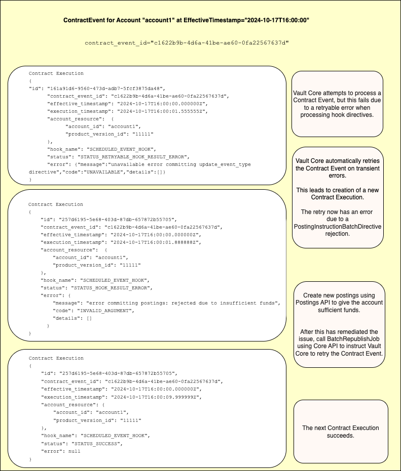
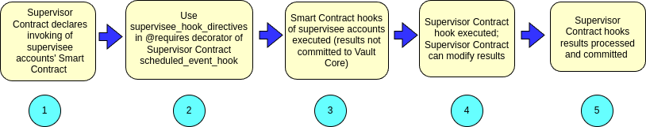
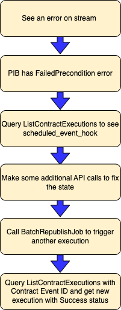
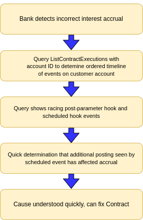

# Running Contracts in production

In order to help monitor and debug Smart and Supervisor Contracts that are running in production, Vault Core uses [Contract Events](/vault-core/5-9/EN/api/core_api#contract_events), which contain sequences of [Contract Executions](/vault-core/5-9/EN/reference/contracts/contracts_api_4xx/running_contracts_in_production#contract_events_and_the_contract_executions_api).

Vault Core provides:

-   Contract Execution resources
    
-   The Contract Events API endpoints for querying Contract Execution resources
    
-   The ContractExecutionEvent stream for notifications on creation of these resources on failed Contract execution
    

chat\_bubble

Vault Core only creates Contract Execution resources for hook executions of Contracts Language version 4. Vault Core supports executions of:

-   scheduled\_event\_hook [for Smart Contracts](/vault-core/5-9/EN/reference/contracts/contracts_api_4xx/smart_contracts_api_reference4xx/hooks#scheduled_event_hook) and [for Supervisor Contracts](/vault-core/5-9/EN/reference/contracts/contracts_api_4xx/supervisor_contracts_api_reference4xx/hooks#scheduled_event_hook)
    
-   post\_posting\_hook [for Smart Contracts](/vault-core/5-9/EN/reference/contracts/contracts_api_4xx/smart_contracts_api_reference4xx/hooks#post_posting_hook) and [for Supervisor Contracts](/vault-core/5-9/EN/reference/contracts/contracts_api_4xx/supervisor_contracts_api_reference4xx/hooks#post_posting_hook)
    
-   [post\_parameter\_change\_hook](/vault-core/5-9/EN/reference/contracts/contracts_api_4xx/smart_contracts_api_reference4xx/hooks#post_parameter_change_hook), except if the parameter value creation was triggered via [v1/account-updates](/vault-core/5-9/EN/api/core_api#accountupdate)
    
-   [conversion\_hook](/vault-core/5-9/EN/reference/contracts/contracts_api_4xx/smart_contracts_api_reference4xx/hooks#conversion_hook) for Account Migrations targeting a CLv4 Smart Contract
    

The [Accounts V1 APIs](/vault-core/5-9/EN/api/core_api#accounts_version_1) are now superseded by [Accounts V2 APIs](/vault-core/5-9/EN/api/core_api#accounts_version_2). In line with this, creating ParameterValues via [v1/account-updates](/vault-core/5-9/EN/api/core_api#accountupdate) is also now superseded by [v1/parameter-values](/vault-core/5-9/EN/api/core_api#parametervalue). Executions of [post\_parameter\_change\_hook](/vault-core/5-9/EN/reference/contracts/contracts_api_4xx/smart_contracts_api_reference4xx/hooks#post_parameter_change_hook) triggered via [v1/parameter-values](/vault-core/5-9/EN/api/core_api#parametervalue) can cause the creation of ContractExecutions.

## [](#contract_events_and_the_contract_executions_api "Copy link to heading")Contract Events and the Contract Executions API

A **Contract Event**:

-   Is the occurrence of a logical business journey in Vault Core that may require Contract hook execution
    
-   Is defined by a unique Contract Event ID for the journey
    
-   Comprises a sequence of Contract Executions
    

Examples of Contract Events include:

-   A scheduled event for `Account1` at `2024-01-01T00:00:00`
    
-   A post-posting hook for an account due to it being targeted in a `PostingInstructionBatch`
    
-   A post-parameter change hook for an account due to the creation of a new `ParameterValue` owned by that account
    

A **Contract Execution** resource occurs for a Contract Event when Vault Core attempts to execute a Smart or Supervisor Contract hook and process any hook results contained in the results object that was returned by that Contract hook.

Each Contract Execution has:

-   An `execution_timestamp`, which is the real system time at which Vault Core executed the Contract hook
    
-   Information about the execution: the Account or Plan IDs involved, the Product Version IDs or Supervisor Contract Version ID involved, the Contract Event ID, the `effective_timestamp` of the Contract Event, and the hook name
    
-   A `status` field and an `error` field that is set if the hook execution or processing of hook results encountered an error during code execution or the processing of hook results
    

There may be multiple Contract Executions for a single Contract Event. This occurs when:

-   A Supervisor Contract invokes the Smart Contract hooks of supervisee accounts. See section [Contract Execution supervision model](/vault-core/5-9/EN/reference/contracts/contracts_api_4xx/running_contracts_in_production#contract_execution_supervision_model).
    
-   Vault Core retries a Contract Event after an error, either automatically, or due to a manually-triggered retry. See section [Creation of Contract Execution data on retryable errors](/vault-core/5-9/EN/reference/contracts/contracts_api_4xx/running_contracts_in_production#creation_of_contract_execution_data_on_retryable_errors).
    
-   Vault Core processes an idempotent request multiple times. You should expect no duplicate effects, but Vault Core provides observability that this scenario has occurred.
    

The following diagram shows an example of a Contract Event in progress:



## [](#contract_execution_supervision_model "Copy link to heading")Contract Execution Supervision model

A Contract Execution has:

-   A single Account ID or Plan ID
    
-   A single Product Version ID or Supervisor Contract Version ID whose code was executed and is associated to the above Account or Plan
    

You can configure a Supervisor Contract to invoke the Smart Contract hooks of the supervised accounts.

The progress is as follows:



1.  The Supervisor Contract declares that hooks of supervisee accounts' Smart Contract be invoked.
    
2.  One way to configure this is to use the [`supervisee_hook_directives`](/vault-core/5-9/EN/reference/contracts/contracts_api_4xx/supervisor_contracts_api_reference4xx/hook_requirements#supervisee_hook_directives) keyword in the [`@requires`](/vault-core/5-9/EN/reference/contracts/contracts_api_4xx/common_types_4xx/decorators#requires) decorator of a Supervisor Contract `scheduled_event_hook`.
    
3.  The Smart Contract hooks of supervisee accounts are executed. Results are not committed to Vault Core.
    
4.  The Supervisor Contract hook is executed, receiving the results of supervisee accounts' Smart Contract hooks as input. The Supervisor Contract can modify the results, discard those results, and also return additional results.
    
5.  Vault Core processes the Supervisor Contract hook results to commit the instructed changes.
    

There is a Contract Execution resource created for each invoked supervisee Smart Contract hook, and a Contract Execution for the Supervisor Contract hook. See [Contract Execution](/vault-core/5-9/EN/api/core_api#contractexecution).

The Contract Executions for Smart Contract hooks that were invoked as supervisees have a non-nil `invoking_resource` field. This declares that this Contract Execution was an invoked hook, and therefore that the hook results were not processed by Vault but only passed to the invoking hook as an input. The `invoking_resource` field references:

-   The ID of the Plan that supervised the Account
    
-   The ID of the Supervisor Contract Version that supervised the Product Version
    
-   The ID of the ContractExecution for the above Plan, and the Supervisor Contract Version that received the hook results of this execution as an input to its hook execution.
    

If the supervisee executions encounter an error, then that execution will have one of the error statuses, and no Contract Execution resource will be created for the plan execution. In this case, Vault Core sets the fields `invoking_resource.invoking_plan.plan_id` and `invoking_resource.invoking_plan.supervisor_contract_version_id`; however, as the plan execution did not occur, the field `invoking_resource.invoking_contract_execution_id` is not set.

If the supervisee executions succeed, they will have a status `STATUS_HOOK_RESULTS_RETURNED_TO_PARENT`.

## [](#creation_of_contract_execution_data_on_retryable_errors "Copy link to heading")Creation of Contract Execution data on retryable errors

A Contract Execution can have the following retryable error statuses:

-   `STATUS_RETRYABLE_EXECUTION_ERROR`
    
-   `STATUS_RETRYABLE_HOOK_RESULTS_PARTIAL_ERROR`
    
-   `STATUS_RETRYABLE_HOOK_RESULTS_ERROR`.
    

These occur when there is a retryable error when processing the Contract Execution. Vault Core does not create a Contract Execution on every retryable error. If a Contract Execution displays one of the retryable execution statuses, Vault Core may be continuing to retry the contract execution internally. Vault Core only creates a new resource when:

-   The Contract Execution encounters a new and different error, which may be a different transient error or a non-transient error (in which case the Status and/or Error field will be different)
    
-   The Product Version ID or Supervisor Contract Version ID changes
    
-   A Core API endpoint was triggered to manually retry the contract event. For example, this can occur when calling [BatchRepublishJob](/vault-core/5-9/EN/api/core_api#job) or [RepublishPostPostingFailure](/vault-core/5-9/EN/api/core_api#postpostingfailure).
    

## [](#monitoring_of_contract_events_and_contract_executions_via_event_stream "Copy link to heading")Monitoring of Contract Events and Contract Executions via Event Stream

Vault Core provides a ContractExecutionEvent stream in Core Streaming API. A `ContractExecutionEvent` is only provided on this stream if the Contract Execution has an error status:

```
STATUS\_RETRYABLE\_EXECUTION\_ERROR
STATUS\_EXECUTION\_ERROR
STATUS\_RETRYABLE\_HOOK\_RESULT\_ERROR
STATUS\_HOOK\_RESULT\_ERROR
STATUS\_RETRYABLE\_HOOK\_RESULT\_PARTIAL\_ERROR
STATUS\_HOOK\_RESULT\_PARTIAL\_ERROR
```

In addition to monitoring all other failure and DLQ topics, Thought Machine recommends that you also monitor this Event Stream to be notified on any Contract Executions with a non-retryable error status. The ContractExecutionEvent stream is best-effort only, so you must monitor both other failure and DLQ topics in addition to the ContractExecutionEvent stream. Additionally, monitoring the ContractExecutionEvent stream allows you to easily get further information to help any debugging investigation, and be aware if a large number of transient errors are occurring. Contract Executions with a retryable error status link may not always need investigating, as events are usually automatically retried and then succeed later.

## [](#contract_events_api_data_guarantees "Copy link to heading")Contract Events API data guarantees

### [](#contract_events_api_data_consistency "Copy link to heading")Contract Events API data consistency

Contract Execution data is observability data. Do not use the information from the observability data as a basis for financial decision making. In particular, the ListContractExecutions API and ContractExecutionEvent stream are best-effort and not guaranteed to be created, although any failure to create is likely to be rare, and occur only when Vault Core is in an acute operational error state.

You can disable data collection by making operational Kubernetes configuration changes. Contact Thought Machine support if you are planning to do this.

Contract Execution data is created asynchronously after the contract execution takes place. Therefore, there is some time lag after a contract execution occurs before its observation is available through the ListContractExecutions API endpoint.

### [](#contract_events_api_data_retention "Copy link to heading")Contract Events API data retention

See information on [configuring the Data Deleter Job](/vault-core/5-9/EN/environment_and_installation/infrastructure_docs/tmcomponent_operator_user_guide/before_you_start#configuring_data_deleter_job).

There is also a minimum configuration for data retention, which you can change. The event stream is further subject to standard retention periods for Core Streaming API Kafka topics.

chat\_bubble

If you want to capture Contract Executions with error statuses as they are created and archive them yourself, you can use the [ContractExecutionEvent stream](/vault-core/5-9/EN/reference/contracts/contracts_api_4xx/running_contracts_in_production#monitoring_of_contract_events_and_contract_executions_via_event_stream). You can decrease retention periods to achieve this: contact Thought Machine support to discuss your requirements before doing this.

### [](#contract_events_api_performance_expectations "Copy link to heading")Contract Events API performance expectations

Typically, Contract Execution data is available shortly after a Contract Execution takes place. For larger operations, such as Schedule Events for millions of accounts, the creation of Contract Execution data is automatically rate-limited in order to prioritise financial processing over the fast availability of observability data.

For medium to large banks, that is those with around 5 million or more unsupervised customer accounts, the creation of all Contract Execution observability data can finish 60 to 120 minutes after the Scheduled Events complete. For very large banks, that is those with around 30 million or more unsupervised customer accounts, the creation of all Contract Execution observability data can finish 2 to 4 hours after the Scheduled Events complete.

There are no guarantees beyond this general guidance for the time lag before Contract Execution observability data is created. You can modify the extent of rate-limiting using Kubernetes operational configuration. However, modifying this configuration will void any SLOs/SLAs for all other Vault APIs, so you must contact Thought Machine support if you are planning to do this.

### [](#contract_events_api_configuration "Copy link to heading")Contract Events API configuration

It is possible to disable the collection of Contract Execution resources per Contract hook.

It is also possible to enable the collection of Contract Execution observations upon events even when the Contract itself does not define a hook. For example, upon the creation of a ParameterValue, if the Contract does not a define a `post_parameter_change_hook`, you can configure the API to create a Contract Execution with the status `STATUS_SUCCESS_NO_HOOK`. You can use this to temporarily enable the observation if you are converting an Account or Plan to a new Smart or Supervisor Contract Version that adds or removes a hook, where there is the risk that events triggering that hook may race the contract conversion event.

You cannot configure Contracts Events APIs using a Core API endpoint. This action requires modification of operational Kubernetes configuration. Contact Thought Machine support if you are planning to do this.

## [](#monitoring_examples "Copy link to heading")Monitoring examples

Here are two monitoring examples for Contract Events:

### [](#example_1_a_scheduled_event_has_an_error_detect_and_fix "Copy link to heading")Example 1: A scheduled event has an error; detect and fix



### [](#example_2_incorrect_interest_accrual_determine_timeline_after_racing_events_detected "Copy link to heading")Example 2: Incorrect interest accrual: determine timeline after racing events detected

