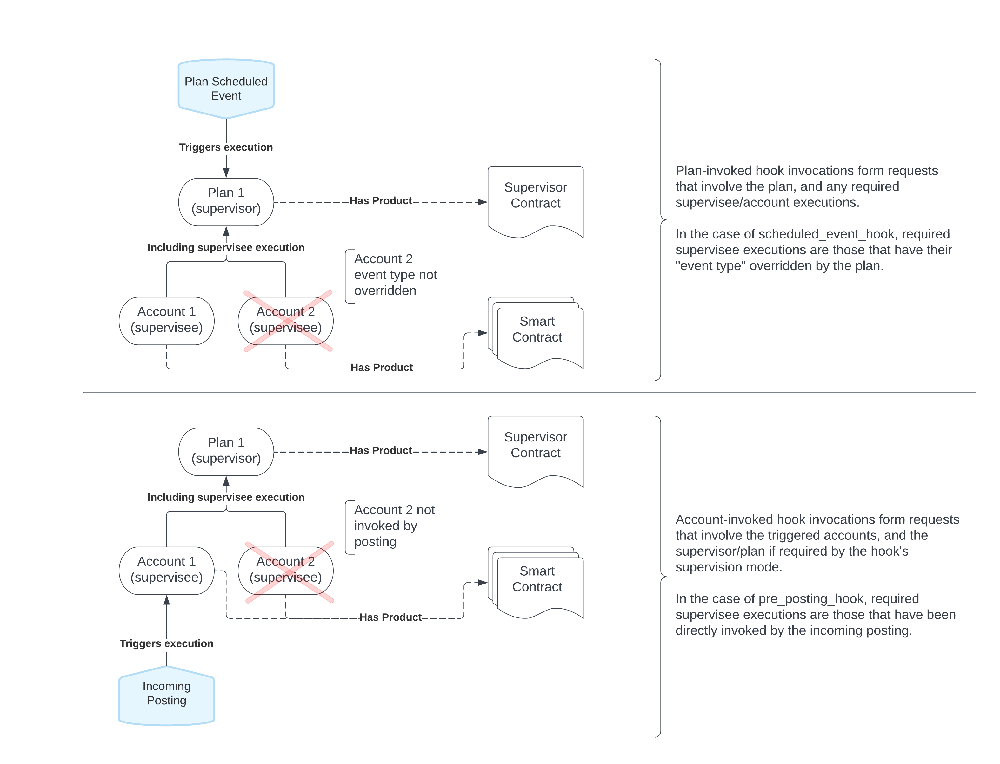
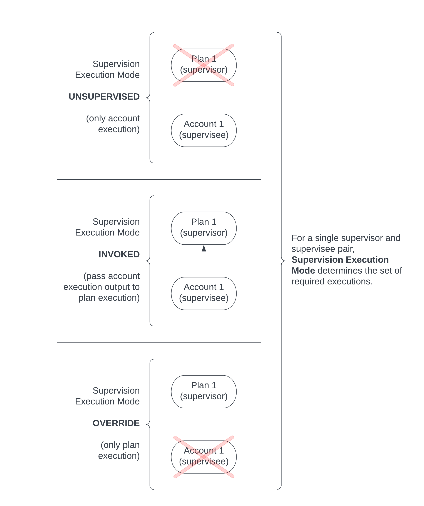
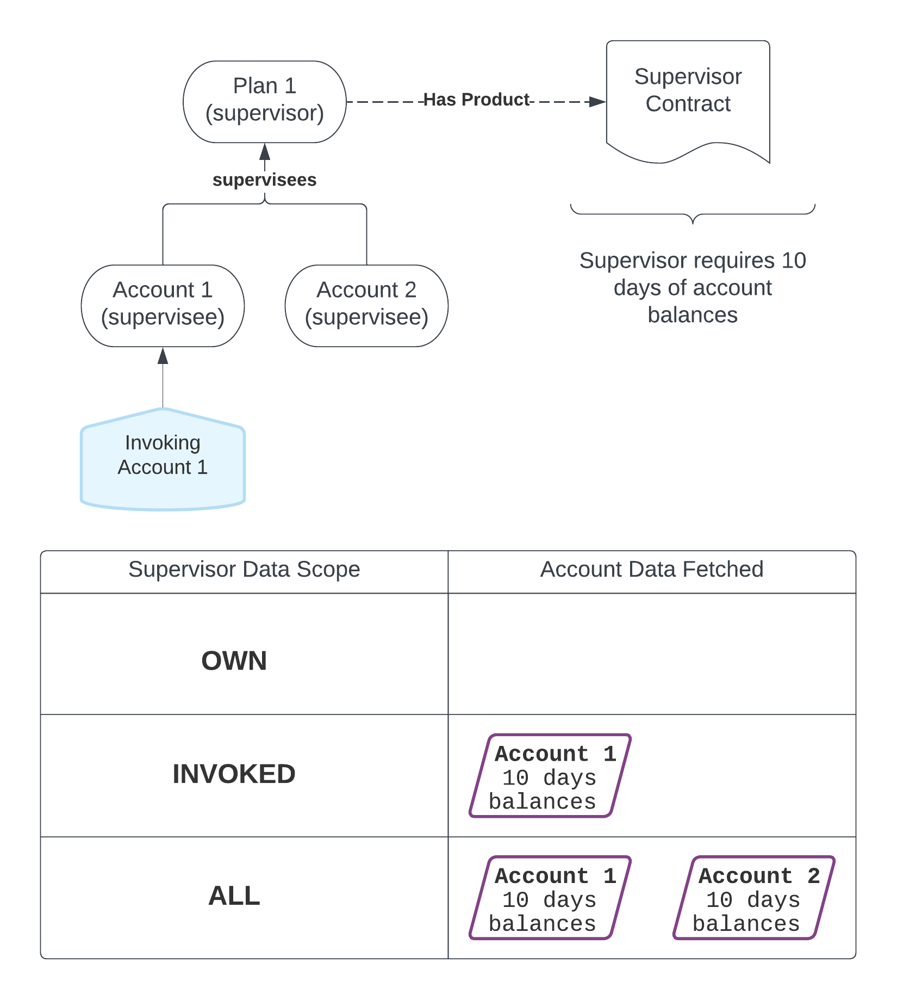

# Supervisor Contracts overview

## What is a Supervisor Contract?

A Supervisor Contract is a special type of Smart Contract that you can use to connect other Smart Contracts together. For example, you can use a Supervisor Contract to [perform interest-rate offsetting between a mortgage account and a savings account](/vault-core/5-9/EN/reference/contracts/contracts_api_4xx/common_examples/generic#example_usage_of_supervisor_contracts_for_interest_rate_offsetting).

In order to supervise a Smart Contract, the `smart_contract_version_id` needs to be declared in the Supervisor Contract [metadata](/vault-core/5-9/EN/reference/contracts/contracts_api_4xx/supervisor_contracts_api_reference4xx/metadata/). This allows for supervision logic to be added to existing accounts without the need to alter the original Smart Contract.

Once a Smart Contract is supervised, any Smart Contract returned hook directives will be sent to the Supervisor Contract before they are instructed to Vault. This allows the Supervisor Contract to intercept and adjust any directives as necessary. For the [interest rate offsetting example](/vault-core/5-9/EN/reference/contracts/contracts_api_4xx/common_examples/generic#example_usage_of_supervisor_contracts_for_interest_rate_offsetting), this would involve intercepting the interest payment hook directives from the mortgage and savings accounts and then adjusting them based on balance information from each account before instructing an adjusted interest payment.

In the same way an account is an instance of a Smart Contract, a [plan](/vault-core/5-9/EN/reference/plans/) is an instance of a particular Supervisor Contract. For an account to be supervised, it has to be [associated](/vault-core/5-9/EN/reference/plans#associate_account_plan_updates) (onboarded) onto a plan.

As part of the onboarding, multiple compatibility checks are performed, such as:

-   The account Smart Contract and the plan Supervisor Contract `api` versions are compatible: a Supervisor Contract based on the Contracts Language API 4 can only supervise a Smart Contract based on the Contract Language API 4, not a Smart Contract based on the Contract Language API 3
    
-   The plan Supervisor Contract can supervise that account’s Smart Contract based on its [metadata configuration](/vault-core/5-9/EN/reference/contracts/contracts_api_4xx/supervisor_overview#supervisor_contract_structure)
    
-   The account is not yet supervised by some other plan
    

To fetch existing Supervisor Contracts and create new ones, use the [Core API SupervisorContract](/vault-core/5-9/EN/api/core_api#supervisorcontract) endpoint.

## Supervisor Contract responsibilities

Where a Smart Contract contains the "complete" definition of a given Product with regards to its financial behaviour within Vault, a Supervisor Contract can alter this behaviour to represent complex relationships between standalone accounts.

In the [supervisor rebalancing example](/vault-core/5-9/EN/reference/contracts/contracts_api_4xx/common_examples#example_usage_of_supervisor_contracts_for_rebalancing), we move the fund between two separate and otherwise independent accounts as new postings get accepted on one of the supervised accounts. These accounts are not aware of each other, and are not even aware that they are being supervised.

When a Smart Contract is supervised, its hook directives are not immediately instructed as they would otherwise be. Instead the hook directives are passed to the Supervisor Contract and it is the responsibility of this Supervisor Contract to instruct all of the necessary hook directives, whether it altered them or not.

### Supervision Entry Points

There are two general entry points into a Supervisor Contract/Plan. A Supervisor Contract execution can either be invoked directly via the Plan, or invoked by a supervision association with an Account (see *Supervision Execution Modes* for details). This differs per hook/journey:

-   `activation_hook`: via **Plan** (cannot execute supervisees)
    
-   `conversion_hook`: via **Plan** (cannot execute supervisees)
    
-   `pre_posting_hook`: via **Account**
    
-   `post_posting_hook`: via **Account**
    
-   `scheduled_event_hook`: via **Plan**
    

The following diagram provides a visual representation of these entry points:

### Supervision Execution Mode

Supervision Execution Mode describes the behaviour of how a given Account/Plan relationship will be executed. There are three possible values:

-   **UNSUPERVISED**: Only the account’s hook is executed, and the Plan is ignored. This is only possible if the triggering event targets an account ("account invoked" from *Supervision Entry Points*).
    
-   **INVOKED**: First, the account’s hook is executed, and the results are passed into the Plan hook, which is then executed. This is most relevant if the triggering event targets an account ("account invoked" from *Supervision Entry Points*), however for the Supervisor `scheduled_event_hook`, if `supervisee_hook_directives` is required then all overridden accounts are considered **INVOKED**.
    
-   **OVERRIDE**: Only the Plan’s hook is executed, and the account is ignored.
    

### Supervisor Data Scope

Supervisor Data Scope allows the Supervisor Contract writer to filter the supervisee (Account) data available to the Supervisor, to improve performance of critical journeys. There are three possible values:

-   **OWN**: Only Plan/global data is available for the Supervisor hook execution. No supervisee / Account data can be accessed within the Supervisor hook execution.
    
-   **INVOKED**: Alongside Plan/global data, all targeted (invoked) supervisee Account data is also fetched and made available within the Supervisor hook execution.
    
-   **ALL**: Alongside Plan/global data, all supervisee Account data is also fetched and made available within the Supervisor hook execution. For example, if the Plan supervises two accounts \[A1, A2\], and the Supervisor hook requires one day of Account balances, then regardless of which Account invokes the Plan, one day of balances for accounts \[A1, A2\] will be fetched.
    

Note that the requirements to fetch for each Account are specified by the Supervisor Contract. If the Plan’s Supervisor Contract asks for **one day** of balances, but the Account’s Smart Contract specifies **three days** of balances, **only one day** of balances will be provided to the Supervisor hook execution.

## Supervisor Contract structure

Supervisor Contracts are written in a very similar way to standard Smart Contracts. They define [Hooks](/vault-core/5-9/EN/reference/contracts/contracts_api_4xx/concepts#hooks) and supervision associations that enable the supervisor’s hook to be called in addition to, or instead of, the associated supervisees Smart Contract hook. A Supervisor Contract can then inspect data from the Smart Contracts and adjust or create hook directives or return values on behalf of the supervised Smart Contracts. For a list of all hooks that can be defined in a Supervisor Contract, see the [Supervisor Hooks](/vault-core/5-9/EN/reference/contracts/contracts_api_4xx/supervisor_contracts_api_reference4xx/hooks/) section.

In order to supervise a Smart Contract, the Supervisor Contract must contain the following:

The specified `alias` can be used to refer to the supervised Smart Contract.

### Supervision of scheduled\_event\_hook

To override the execution schedule of an `event_type` in a Smart Contract, the Supervisor Contract must declare the following code for the [event\_types](/vault-core/5-9/EN/reference/contracts/contracts_api_4xx/supervisor_contracts_api_reference4xx/metadata#event_types) metadata:

Once an account is onboarded onto a plan, this will override the `SMART_CONTRACT_EVENT` scheduled event on the account backed by the Smart Contract referred to as `alias1` within this Supervisor Contract, with the event `SUPERVISOR_CONTRACT_EVENT` defined in the Supervisor Contract. Once this is done, an `activation_hook` defining the `SUPERVISOR_CONTRACT_EVENT` schedule can be declared in the Supervisor Contract along with `scheduled_event_hook`; this `scheduled_event_hook` will then be run instead of, or in addition to, the original Smart Contract `scheduled_event_hook`. The original `SMART_CONTRACT_EVENT` scheduled event will continue to trigger as defined in the Smart Contract, but none of the code within its `scheduled_event_hook` will actually be executed. To run the original `scheduled_event_hook` before the Supervisor Contract `scheduled_event_hook`, add `supervisee_hook_directives='all'` to the `requires` decorator. Set this to `none` to disregard the Smart Contract and only run the new Supervisor Contract code.

For an example of overriding the `scheduled_event_hook`, see [Interest Offsetting example](/vault-core/5-9/EN/reference/contracts/contracts_api_4xx/common_examples#example_usage_of_supervisor_contracts_for_interestrate_offsetting).

### Supervision of post\_posting\_hook

To override the execution of an account’s `post_posting_hook`, you must specify the `supervise_post_posting_code` in the [supervised\_smart\_contracts](/vault-core/5-9/EN/reference/contracts/contracts_api_4xx/supervisor_contracts_api_reference4xx/metadata#supervised_smart_contracts) metadata. This will trigger the supervisor’s `post_posting_hook` execution for any newly created [PostingInstructionBatch](/vault-core/5-9/EN/api/core_api#postinginstructionbatch) that targets the account.

To run the original account’s `post_posting_hook` before the Supervisor Contract `post_posting_hook`, specify `supervisee_hook_directives='invoked'` in the `requires` decorator. Set `supervisee_hook_directives='none'` to disregard the Smart Contract and only run the new Supervisor Contract code.

For an example of overriding the `post_posting_hook` hook, see [Rebalancing between accounts example](/vault-core/5-9/EN/reference/contracts/contracts_api_4xx/common_examples#example_usage_of_supervisor_contracts_for_rebalancing).

### Supervision of pre\_posting\_hook

To override the execution of an account’s `pre_posting_hook`, you must specify the `pre_posting_hook` [SupervisionExecutionMode](/vault-core/5-9/EN/reference/contracts/contracts_api_4xx/common_types_4xx/enums#supervisionexecutionmode) in the `supervised_hooks` attribute of the [SmartContractDescriptor](/vault-core/5-9/EN/reference/contracts/contracts_api_4xx/common_types_4xx/classes#smartcontractdescriptor) in the [supervised\_smart\_contracts](/vault-core/5-9/EN/reference/contracts/contracts_api_4xx/supervisor_contracts_api_reference4xx/metadata/) metadata.

This will trigger the supervisor’s `pre_posting_hook` execution for any newly created [PostingInstructionBatch](/vault-core/5-9/EN/api/core_api#postinginstructionbatch) that targets the account.

-   INVOKED: The supervisee hook is executed, and the results from the supervisee execution are made available to the supervisor hook via the `vault` method [get\_hook\_results](/vault-core/5-9/EN/reference/contracts/contracts_api_4xx/smart_contracts_api_reference4xx/vault#get_hook_result).
    
-   OVERRIDE: The supervisor hook is executed, ignoring the supervisee hook. Results from the supervisee hook executions are not available to the supervisor, because the supervisee hook is not executed. Calling the `get_hook_results` method returns `None`.
    
-   If `SupervisionExecutionMode` is not specified, the Smart Contract is not supervised and the account hook will be executed as normal without the supervisor hook being triggered.
    

For an example of invoking the `pre_posting_hook`, see [Overdraft protection example](/vault-core/5-9/EN/reference/contracts/contracts_api_4xx/common_examples#overdraft_protection).

The Supervisor Contract hooks also support *data requirements* and *optimised data fetching*, similar to Smart Contracts. For more information:

-   On Data requirements, see the [Hook Requirements](/vault-core/5-9/EN/reference/contracts/contracts_api_4xx/concepts#requirements) concepts section and [Hook Requirements](/vault-core/5-9/EN/reference/contracts/contracts_api_4xx/supervisor_contracts_api_reference4xx/hook_requirements/) Supervisor API section.
    
-   On Optimised data fetching, see [Supervisor data fetchers](/vault-core/5-9/EN/reference/contracts/contracts_api_4xx/concepts#supervisor_data_fetchers) concepts section and [Data fetchers](/vault-core/5-9/EN/reference/contracts/contracts_api_4xx/supervisor_contracts_api_reference4xx/account_fetcher_requirements/) Supervisor API section.
    

## Flexible supervision

### About flexible supervision

The *flexible* supervision is an alternative concept to the [*standard*](/vault-core/5-9/EN/reference/contracts/contracts_api_4xx/supervisor_overview#supervisor_contract_structure) supervision process; allowing the creation of a Supervisor Contract that can be used to supervise an account without the need to declare its Product Version ID in the Supervisor code. Where [standard](/vault-core/5-9/EN/reference/contracts/contracts_api_4xx/supervisor_overview#supervisor_contract_structure) supervision requires you to link the Supervisor Contract with the specific Product Version IDs of any supervisee Smart Contracts, flexible supervision allows you to create a Contract that can supervise *any* Smart Contract.

chat\_bubble

Flexible supervision *only* supports supervision of the `scheduled_event_hook` contract hook

### The risks of flexible supervision

Some benefits of standard supervision are lost with flexible supervision. The main risk is due to the fact that there is no validation performed when associating an Account to a Plan. The purpose of hardcoding Product Version IDs in Supervisor Contracts is to allow several checks to take place in order to assert that a Smart Contract and a Supervisor Contract are compatible before they go live; this is not possible with flexible supervision.

One of these checks asserts that the event types overridden in the Supervisor Contract do in fact exist in the supervisee Smart Contract; in flexible mode, an event is overridden solely on the name. If the names:

-   *Match*, then the event is overridden
    
-   *Do not match*, then the event is not overridden
    

### Structural differences in flexible Supervisor Contracts

The structure of a flexible Supervisor Contract is somewhat different to that described in [Supervisor Contract Structure](/vault-core/5-9/EN/reference/contracts/contracts_api_4xx/supervisor_overview#supervisor_contract_structure) because:

-   `supervised_smart_contracts` must be empty (or it can be removed entirely) to signal that this Supervisor Contract has no restrictions on the Smart Contracts it can supervise.
    
-   As a natural consequence of being unable to declare an `alias` for a specific supervisee, `event_types` must only provide names of events and can no longer declare `overrides_event_types`. The events are overridden automatically by name, once an account is on-boarded onto a plan, which is backed by the Supervisor Contract, rather than through explicit declaration.
    
-   It is not possible to override the `post_posting_hook` or `pre_posting_hook` with flexible supervision because this functionality relies on an `alias` being defined for a supervisee, which is not possible without hard-coding the Product Version IDs.
    
-   The supervisee function `get_alias` used in the Supervisor Contract will return None, so there can no longer be any Contract logic using the alias of a supervisee.
    

error

-   *All* supervisees with `event_types` whose names match those declared in a flexible Supervisor will be overridden once an account is onboarded onto a plan, which is backed by the Supervisor Contract; take care to use distinct naming.
    
-   Supervision of an event that is part of an [EventTypesGroup](/vault-core/5-9/EN/reference/contracts/contracts_api_4xx/common_types_4xx/classes#eventtypesgroup) will remove it from that group, meaning that the EventTypesGroup must be redefined in the Supervisor Contract.