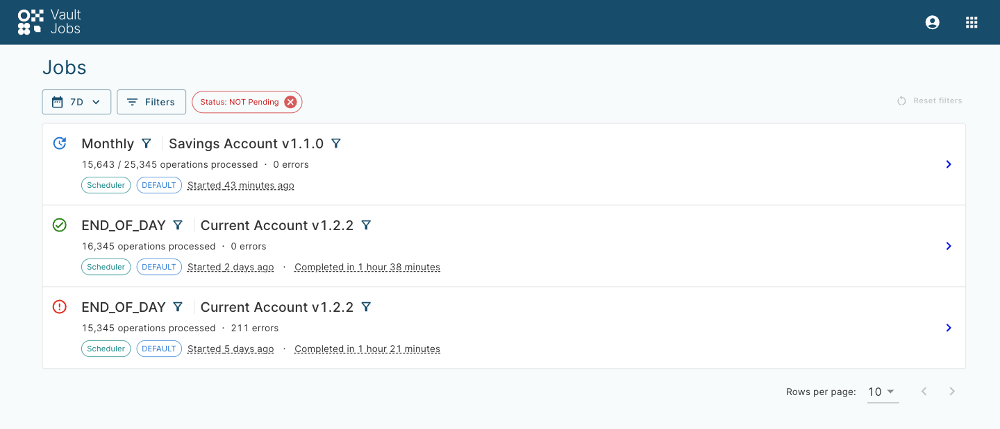
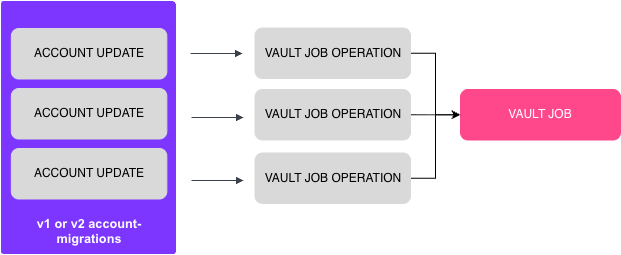
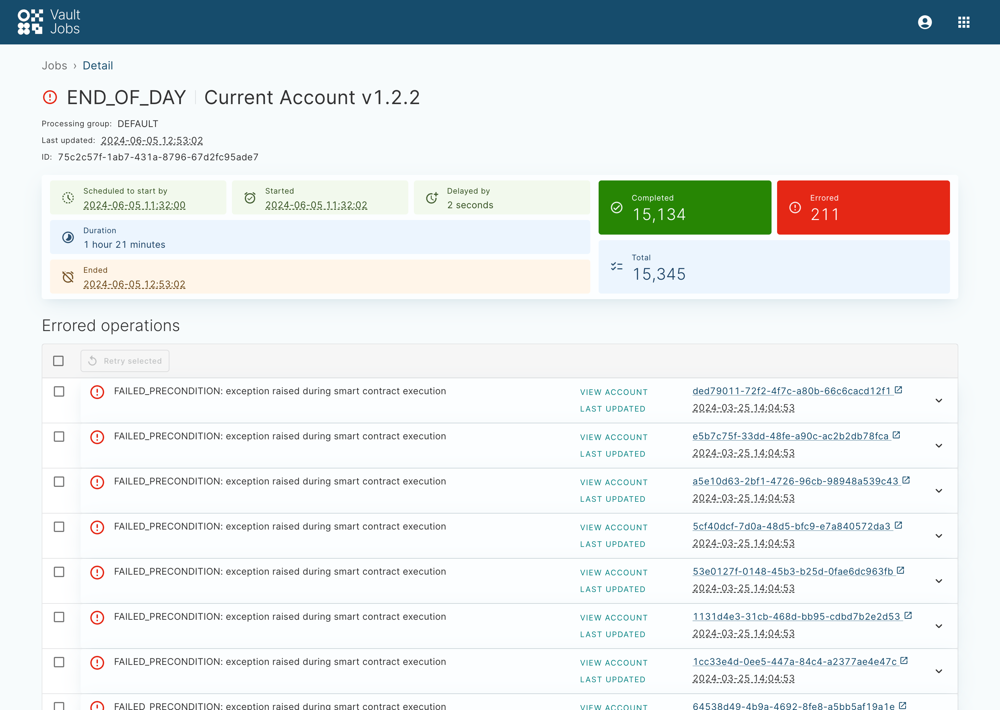
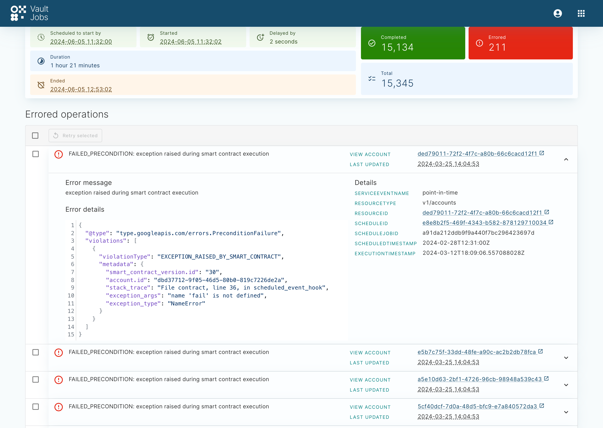
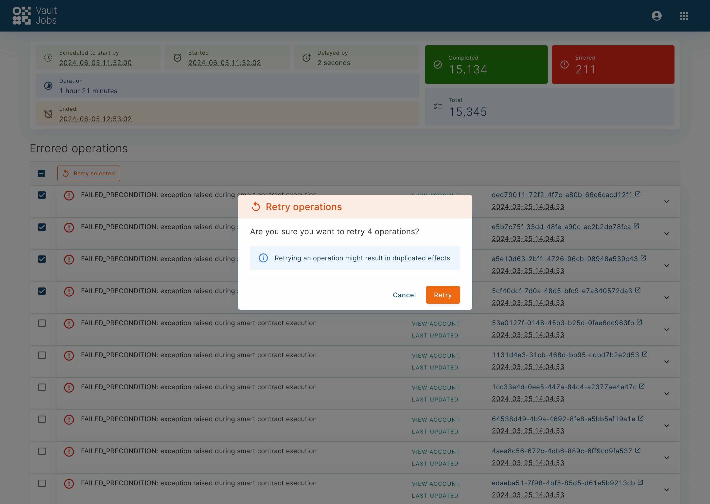

# Vault Jobs

## Logging in and permissions

chat\_bubble

You need to configure your Identity Provider (IDP) with your Vault Core details to support access to both Vault Core Apps and Operations Dashboard.

### Role permissions (SAML) and scopes (OIDC)

chat\_bubble

`Vault Version: View` is a required permission for all roles for access to the Vault Jobs App.

  
| Resource | Operation | Scope |
| --- | --- | --- |
| 
Vault Job

 | 

View

 | 

core.vault\_jobs:read

 |
| 

Vault Job operation

 | 

View

 | 

core.vault\_jobs:read

 |
| 

Vault Job operation

 | 

Edit

 | 

core.vault\_jobs:execute

 |
| 

Parameter Value

 | 

View

 | 

core.parameter\_values:read

 |
| 

Product Version

 | 

View

 | 

core.product\_versions:read

 |
| 

Vault Version

 | 

View

 | 

core.vault\_versions:read

 |

### Accessing Vault Jobs

You can access Vault Jobs by using your unique client URL. Alternatively, you can visit Operations Dashboard and select Vault Jobs from the App Switcher in the (upper right) navigation menu for each Vault Core App.

The following URLs contain a `$<placeholder>` in place of your unique client details for the purposes of these examples.

#### Example URL for bank-hosted environments:

#### Example URL for SaaS environments:

#### App Switcher:

#### More information:

If you require information about configuring access to Core Apps and Operations Dashboard, see the following setup guides. These guides link to the [Setting up and Configuring Vault with a SAML IDP](/vault-core/5-9/EN/environment_and_installation/infrastructure_docs/setting_up_and_configuring_vault_with_a_saml_idp/) guide and provide an overview of the overall steps to set up Vault Core.

-   Clients with a bank-hosted Vault Core environment: [Getting Started with Vault Core](/vault-core/5-9/EN/environment_and_installation/infrastructure_docs/getting_started_with_vault_core)
    
-   Clients with a Vault Core SaaS environment: [Environment details guide → Core Apps and Operations Dashboard](/vault-core/5-9/EN/environment_and_installation/saas/introduction_to_vault_saas/environment_details_guide#core_apps_and_operations_dashboard)
    

## What is Vault Jobs?

### Definition

Vault Jobs is a web application that displays the progress and health of long-running account processes within Vault Core, such as End of Day. For example:

Vault Jobs displays two resources, Vault Jobs and Vault Job operations:

-   A Vault Job comprises multiple operations. Each Vault Job provides insight into how quickly its contained operations are being processed, along with a count of Complete and Errored operations. Each Job also displays integration-specific metadata about the Vault Job to aid a user’s investigation into the health of a Vault Job.
    
-   A Vault Job operation represents an individual process within a Vault Job. An operation, once processed, has one of the following states:
    
    -   Succeeded: The operation has been processed without error and the **Completed** total of the parent Vault Job is incremented by one.
        
    -   Errored: The operation has errored and the **Errored** total of the parent Vault Job is incremented by one.
        
    
-   An errored Vault Job operation contains metadata, such as IDs and links to the affected resource in the Operations Dashboard, along with any errors that occurred during processing. A user can retry errored Scheduler Job operations in bulk via an action button on an individual Vault Job details page. Once a user retries a Scheduled Job operation, the service resets the operation status to in progress and resets the Vault Job **Errored** number, status and **Ended** timestamp. The retried operations may now succeed or error again - you can identify the result as follows:
    
    -   Success: If a retried operation succeeds then Vault Jobs removes it from the list of operations in Vault Job details page and updates the total **Completed** number
        
    -   Error: If a retried operation errors, its status is reset back to errored and the Vault Job total **Errored** number is updated
        
        chat\_bubble
        
        -   Vault Jobs only displays errored operations and in progress operations (if they previously have errored), in the list of **Errored operations**
            
        -   You cannot retry Errored Parameter change operations
            
        
    

### What are the use cases?

Vault Jobs has integrations with the Core API [Scheduler](/vault-core/5-9/EN/api/core_api#scheduler), [Core API Parameters](/vault-core/5-9/EN/api/core_api#parameters), and [v1](/vault-core/5-9/EN/api/core_api#accountmigration) or [v2](/vault-core/5-9/EN/api/core_api#accountmigration_2) bulk Account conversions.

chat\_bubble

Integrations with Core API Parameters are only supported in Contracts Language version 4.

#### Core API Scheduler

The following diagram shows the Core API Scheduler integration, where each Schedule Job that the Scheduler creates has a corresponding Vault Job operation:

This integration supports the following use cases for using Vault Jobs:

-   Monitoring the progress of all Schedule Jobs
    
-   Identifying any Schedule Job operations that have errored, to investigate the likely cause of the failure
    
-   Logged-in users can view the progress of Schedule Jobs, grouped by various attributes of the specific Vault Job - see [How Vault Jobs are created](/vault-core/5-9/EN/reference/core_apps_and_operations_dashboard/vault_jobs#how_vault_jobs_are_created)
    
-   Remediating errored Schedule Jobs (Vault Job operations) by retrying them in bulk once underlying issue with a Scheduled Job is fixed. For example, syntax error in the Smart Contract is fixed and impacted Accounts are converted to the new Smart Contract version. You can monitor remediation via the **Remediation Processor** panels on the [Vault Jobs Overview dashboard](/vault-core/5-9/EN/environment_and_installation/infrastructure_docs/observability_and_monitoring/introduction_to_grafana_and_key_dashboards#vault_jobs_overview_dashboard)
    

chat\_bubble

If using a Contracts Language version 3 contract, the Vault Job executed immediately after a plan migration may not display accurate completion data.

#### Core API Parameters

chat\_bubble

Parameter Jobs are only supported in Contracts Language version 4.

The following diagram shows the Core API Parameters integration, where a point in time change to a globally owned and/or [Parameter Value Hierarchy](/vault-core/5-9/EN/reference/parameters/building_and_managing_the_parameter_value_hierarchy) node owned value triggers the `post_parameter_change_hook` (for Accounts that are opted in to the hook), which in turn generates a Vault Job operation:

This integration supports the following use cases for using Vault Jobs:

-   Monitoring the progress of global or Parameter Value Hierarchy Node owned Parameter value changes
    
-   Identifying any Parameter change operations that have errored, to investigate the likely cause of the failure
    

#### Account conversions

The following diagram shows the Account conversions integration, where each Account update that Vault Core creates has a corresponding Vault Job Operation:

### Related information

Refer to the following pages for more information about the Vault Core features that this section describes:

-   [Scheduler overview](/vault-core/5-9/EN/reference/scheduler#glossary)
    
-   [Smart Contracts overview](/vault-core/5-9/EN/reference/contracts/)
    
-   [Smart Contracts Event Types](/vault-core/5-9/EN/reference/contracts/contracts_api_4xx/common_types_4xx/classes#smartcontracteventtype)
    
-   [Core API ParameterValue resource](/vault-core/5-9/EN/api/core_api#parametervalue)
    
-   [Parameters](/vault-core/5-9/EN/reference/parameters)
    
-   [Converting multiple v1 Accounts](/vault-core/5-9/EN/reference/accounts/accounts_version_1#converting_multiple_accounts_to_a_new_product_version)
    
-   [Converting multiple v2 Accounts](/vault-core/5-9/EN/reference/accounts/accounts_version_2#converting_multiple_accounts_to_a_new_product_version)
    

## How Vault Jobs are created

*Vault Jobs* and *Vault Job operations* are created automatically when either Scheduler Jobs, Parameter value changes (above account level), or bulk Account Conversions occur within Vault Core.

### How Scheduler Jobs are created

chat\_bubble

For Scheduler Jobs to be created, at least one Smart Contract must exist and it must define at least one Smart Contract Event Type. There must also be active accounts using the Smart Contract.

A *Scheduler Job* is created by any unique combination of the following attributes:

-   [Processing Groups](/vault-core/5-9/EN/reference/processing_groups)
    
-   Smart Contract version (see the [Smart Contracts overview](/vault-core/5-9/EN/reference/contracts/contracts_api_4xx/overview)) or Supervisor Contract version (see the [Supervisor Contracts overview](/vault-core/5-9/EN/reference/contracts/contracts_api_4xx/supervisor_overview/))
    
-   Event Type - as defined within the Smart Contract (see [Smart Contract Event Type](/vault-core/5-9/EN/reference/contracts/contracts_api_4xx/common_types_4xx/classes#smartcontracteventtype))
    
-   Scheduled timestamp. This is the time when the Schedules are set to execute (see [Scheduler Overview](/vault-core/5-9/EN/reference/scheduler#schedules))
    

For every unique grouping of Scheduler Jobs there will be a single Vault Job created. For example, attributes with the following values will be grouped under the same Vault Job:

-   `DEFAULT_PROCESSING_GROUP` (Processing Group)
    
-   `CURRENT_ACCOUNT v1.0.0` (Smart Contract version)
    
-   `END_OF_DAY` (Event Type)
    
-   `SCHEDULED_TIMESTAMP`
    

### How Parameter change Jobs are created

chat\_bubble

-   Parameter change Jobs are only supported in Contracts Language version 4.
    
-   For Parameter change Jobs to be created, at least one Smart Contract must exist which is using `expected_parameters`, and must include `triggers_post_parameter_change_hook=True`.
    

A *Parameter change* Job is created any time that a Parameter value change comes into effect, where the owner of the value(s) are global and/or one or more nodes in [the Parameter Value Hierarchy](/vault-core/5-9/EN/reference/parameters/building_and_managing_the_parameter_value_hierarchy).

It is the *point in time* of a change that triggers the Parameter change job; multiple Parameter Value changes occurring at the same time (either becoming effective or expiring) will therefore create a *single* Parameter change Job, containing the operations of one or more values and owners.

chat\_bubble

-   Account-owned Parameter value changes will not lead to the creation of a Parameter change Job.
    
-   Parameter values are only displayed for *explicit* changes (when a value expires or is created); they are not displayed for *implicit* changes as a result of hierarchical relationships (for example, a resolved parent value becoming effective as a result of a child value expiring).
    

### How Account conversion Jobs are created

An *Account Conversion* job is created when a bulk Account Conversion request is made to either [POST v1/account-migrations](/vault-core/5-9/EN/api/core_api#_core_api_v1_accounts_AccountMigration_CreateAccountMigration) or [POST v2/account-migrations](/vault-core/5-9/EN/api/core_api#_core_api_v2_accounts_AccountMigration_CreateAccountMigration).

## Using Vault Jobs

lightbulb

If you are using the Adjustments Extension, see [Monitoring Adjustment progress](/vault-core/5-9/EN/reference/adjustments#monitoring_adjustment_progress) for details on how the Vault Jobs App integrates with Adjustments.

The following information is displayed from the Vault Jobs App:

-   The attributes that created the Vault Job:
    
    -   If it was generated by the **Scheduler** this displays the Event name, Smart Contract Version, and Processing Group
        
    -   If it was generated by a **Parameter change** (Contracts Language version 4 only), this displays the Parameter Values that triggered the Vault Job
        
        chat\_bubble
        
        The Parameter values are only displayed for *explicit* changes (when a value expires or is created); they are not displayed for *implicit* changes as a result of hierarchical relationships (for example, a resolved parent value becoming effective as a result of a child value expiring).
        
    
-   When the operations within the Vault Job are (or were) scheduled to start by
    
-   When the operations within the Vault Job actually started and, if complete, when the Job finished
    
-   The duration of the Vault Job
    
-   The number of Completed and Errored operations as well as the estimated total number of operations (including those that are yet to be processed)
    
-   In the case of Errored:
    
    -   Scheduler Job operations, view a link to the Schedule and Account pages in the Operations Dashboard along with any error traces highlighted
        
    -   Parameter change Job operations (Contracts Language version 4 only), view a link to the Smart Contract Version and Account pages in the Operations Dashboard along with any error traces highlighted
        
    

chat\_bubble

If the optional [Data Deleter Job](/vault-core/5-9/EN/environment_and_installation/infrastructure_docs/tmcomponent_operator_user_guide/before_you_start#configuring_data_deleter_job) is enabled, the Vault Jobs app only displays 90 days of Vault Jobs history.

For example, the Vault Jobs app below displays three separate Vault Scheduler Jobs at various stages of completion:

-   **Monthly: Savings Account v1.1.0** Job is in progress, with no errors reported so far
    
-   **END\_OF\_DAY: Current Account V1.2.2** Job has completed, with no errors reported
    
-   Another **END\_OF\_DAY: Current Account V1.2.2** Job has completed, but has some errored Schedule Executions
    

Click on the Job that contains errors to see more information about the operations that have failed, along with additional information about the duration of the Vault Job:

Click on any of the errored operations to expand the row and view [additional information](/vault-core/5-9/EN/reference/core_apps_and_operations_dashboard/vault_jobs#vault_jobs_field_descriptions) about the affected Account or Plan:

To retry multiple errored Scheduler Job operations: 1. Select the individual operations. 2. Click the **Retry Selected** button. 3. A dialogue appears that acknowledges the total number of operations that you have selected to retry. Confirm the **Retry**: 

chat\_bubble

You cannot retry Errored Parameter change operations.

For more information about the fields in the panels, see [Vault Jobs Field Descriptions](/vault-core/5-9/EN/reference/core_apps_and_operations_dashboard/vault_jobs#vault_jobs_field_descriptions).

## Vault Jobs Field Descriptions

The following table describes the fields displayed in Vault Jobs panels.

### Vault Jobs fields

The following table describes the fields shown in the Vault Jobs main panel or the **Filters** dialog:

 
| Field | Description |
| --- | --- |
| 
Status

 | 

The status of the Vault Job. The status can be one of the following:

-   **Pending**: The Vault Job has not yet started.
    
-   **In progress**: The Vault Job is in progress.
    
-   **Abandoned**: All operations expected to execute for the Job were disabled, because they were not required.
    
-   **Errored**: The Vault Job has completed with at least one error.
    
-   **Succeeded**: The Vault Job has completed with no errors.
    
-   **Expired**: The Vault Job has received no updates for 24 hours.
    

 |
| 

Metadata (Scheduler)

 | 

-   **smart\_contract\_version\_id**: The ID of the Smart Contract version that created the Schedule Jobs within the Vault Job.
    
-   **event\_name**: The Event name of all Schedule operations within the Vault Job.
    
-   **processing\_group\_id**: The Processing group ID shared by all Schedule operations within the Vault Job.
    
-   **supervisor\_contract\_version\_id**: The ID of the Supervisor Contract version that created the Schedule operations within the Vault Job.
    
-   **all\_contract\_version\_ids** (filter only): The IDs of either Smart Contracts or Supervisor Contracts.
    

 |
| 

Metadata (Parameter change)

 | 

-   **parameter\_ids**: The IDs of the Parameters associated with the Vault Job.
    
-   **parameter\_value\_hierarchy\_node\_ids** The IDs of the Parameter Value Hierarchy Nodes associated with the Vault Job.
    
-   **parameter\_value\_ids** The IDs of the Parameter values associated with the Vault Job.
    
-   **owner\_type\_strings**: This filter accepts either "global" (to filter on globally owned values) or "parameter\_value\_hierarchy\_node" (to filter on Parameter Value Hierarchy Node owned values) in the **Value** field.
    

 |
| 

Metadata (Account conversion)

 | 

-   **bulk\_operation\_id**: The ID of the bulk Account conversion that created this job, as a result of a call to the v1 or v2 `account-migrations` endpoint.
    

 |

### Vault Jobs operations fields

The following table describes the fields shown in the Vault Jobs operations (**Jobs > Detail**) page:

#### Detail page

 
| Field | Description |
| --- | --- |
| 
Last updated

 | 

When the Vault Job was last updated.

 |
| 

Scheduled to start by

 | 

When the Vault Job was scheduled to begin.

 |
| 

Started

 | 

When the Vault Job started.

 |
| 

Delayed by

 | 

The delay between the **Scheduled to start by** time, and the **Started** time.

 |
| 

Duration

 | 

The time elapsed since the Vault Job began.

 |
| 

Ended

 | 

When the Vault Job ended. If the Vault Job is still in progress, this field will have no value.

 |
| 

Completed

 | 

The number of operations that have been processed without error.

 |
| 

Errored

 | 

The number of operations that have errored while processing.

 |
| 

Total

 | 

The total number of operations expected to run (this is an estimated total, which can reduce in certain scenarios).

 |

#### Hierarchy/Global owned Parameter Values panel

 
| Field | Description |
| --- | --- |
| 
HIERARCHY NODE OWNED

 | 

The ID of [the Parameter Value Hierarchy](/vault-core/5-9/EN/reference/parameters/building_and_managing_the_parameter_value_hierarchy) node that owns the Parameter value.

 |
| 

GLOBAL OWNED

 | 

Whether the Parameter value is globally owned.

 |
| 

{TYPE} VALUE

 | 

The type and value of the Parameter.

 |
| 

Expired / Effective

 | 

Whether the value became effective or expired at the time of the Vault Job.

 |

#### Errored operations section (Scheduler)

The following table describes the fields shown in the Vault Jobs operations **Errored operations** section. Some of the fields are only visible in certain scenarios:

 
| Field | Description |
| --- | --- |
| 
Error message

 | 

Error returned by the failing Vault Job’s operation.

 |
| 

Error details

 | 

Error details (such as for `type` and `stack_trace`) returned by the failed Vault Job’s operation.

 |
| 

Details

 | 

-   **LAST UPDATED**: When this operation was last updated.
    
-   **SERVICEEVENTNAME**: A reference to the Vault Core service where the error occurred.
    
-   **RESOURCETYPE**: Either Account or Plan.
    
-   **RESOURCEID**: If the **RESOURCETYPE** is **account** this is a link to the account ID search page in the Operations Dashboard; otherwise, it is the Plan ID.
    
-   **SCHEDULEID**: A link to the schedule details page in the Operations Dashboard.
    
-   **SCHEDULEJOBID**: The ID of the Schedule Job (also known as a Vault Job operation).
    
-   **SCHEDULEDTIMESTAMP**: The timestamp when the Schedule Job was set to run. The timestamp uses UTC.
    
-   **EXECUTIONTIMESTAMP**: The timestamp when the Schedule Job occurred. The timestamp uses UTC.
    

 |
| 

Remediation details

 | 

-   **CREATEDAT**: The timestamp when the user successfully submitted the retry action for the errored operation.
    
-   **PROCESSEDAT**: The timestamp when the `remediation-processor` processed the retry action.
    
-   **ERRORMESSAGE**: The error that occurred when processing a retry action in the `remediation-processor`. Note that this is NOT an error of the failing Schedule Job.
    

 |

#### Errored operations section (Parameter change)

 
| Field | Description |
| --- | --- |
| 
Error message

 | 

Error returned by the failing Vault Job’s operation.

 |
| 

Error details

 | 

Error details (such as for `type` and `stack_trace`) returned by the failed Vault Job’s operation.

 |
| 

Details

 | 

-   **SERVICEEVENTNAME**: A reference to the Vault Core service where the error occurred.
    
-   **ACCOUNTID**: The ID of the Account involved; this is a link to the account ID search page in the Operations Dashboard.
    
-   **PARAMETERIDS** The ID of any impacted Parameters. In certain circumstances this could include the IDs of additional Parameters not strictly related to the Job (such as Account-owned Parameters).
    
-   **SMARTCONTRACTVERSIONID**: The ID of the associated Smart Contract version; this is a link to the Product management section in the Operations Dashboard.
    

 |

#### Errored operations section (Account conversion)

 
| Field | Description |
| --- | --- |
| 
Error message

 | 

Error returned by the failing Vault Job’s operation.

 |
| 

Error details

 | 

Error details (such as for `type` and `stack_trace`) returned by the failed Vault Job’s operation.

 |
| 

Details

 | 

-   **SERVICEEVENTNAME**: A reference to the Vault Core service where the error occurred.
    
-   **ACCOUNTID**: The ID of the Account involved; this is a link to the account ID search page in the Operations Dashboard.
    
-   **SMARTCONTRACTVERSIONID**: The ID of the target Smart Contract version; this is a link to the Product management section in the Operations Dashboard.
    

 |

## Vault Jobs Streaming Events

### Vault Jobs

Vault Jobs publishes Vault Jobs events using the Vault Core Streaming API when:

-   it receives related OperationEvents that trigger it to create a Vault Job (JobCreatedEvent)
    
-   the Status of a Vault Job changes (JobUpdatedEvent)
    

You can subscribe to Vault Jobs Updates to receive a notification when a given Vault Job has finished and to view the status of a given Job. For example, this can be particularly useful if you wish to receive a notification when the End-of-Day process has completed.

For a list of possible statuses and other event information, see [Vault Job Events](/vault-core/5-9/EN/api/core_api#vault_jobs_events).

### Vault Jobs Group

Vault Jobs publishes Vault Jobs Group events using the Vault Core Streaming API when: - it creates a Vault Jobs Group (GroupCreatedEvent) - the Status of a Vault Jobs Group changes (GroupUpdatedEvent)

There are cases when you may find it useful to know when a group of Vault Jobs has finished. For example, when the End-of-Day process has completed across all products or Processing Groups. You can subscribe to Vault Jobs Group Updates to receive a notification when the status of a given Vault Jobs Group has updated.

Vault Jobs creates a Vault Jobs Group as a side effect of creating a Vault Job. Currently, Vault Jobs can create Vault Jobs Groups only for Schedule Manager Jobs and only does so using the following combinations of fields from a Vault Job:

-   `processing_group` and `effective_timestamp` (scheduled execution time)
    
-   `processing_group`, `effective_timestamp`, and `event_name`
    

chat\_bubble

In rare cases, the status of a Vault Job can change from JOB\_STATUS\_SUCCEEDED, JOB\_STATUS\_ABANDONED, JOB\_STATUS\_ERRORED, or JOB\_STATUS\_EXPIRED back to JOB\_STATUS\_IN\_PROGRESS. This might only occur when Vault Jobs receives newly-created or updated late Operations (as a result of new OperationEvents) for a Vault Job that had previously closed. Some examples of when this might occur include:

-   It is the first run of a Scheduler Job for a Schedule that existed prior to upgrading to Vault Core 5.3.
    
-   Remediating a Scheduler Job that had previously failed or was stuck then triggers subsequent Scheduler Jobs to run.
    

Consequently, if any such Job is part of a Vault Jobs Group, the statuses of relevant Groups might also change back to GROUP\_STATUS\_IN\_PROGRESS.