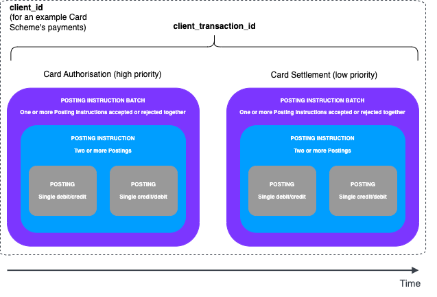
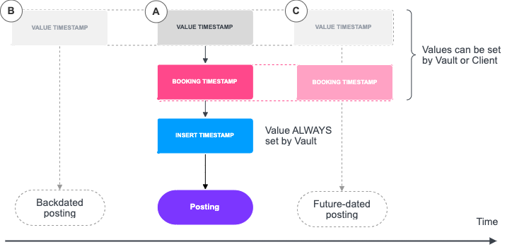
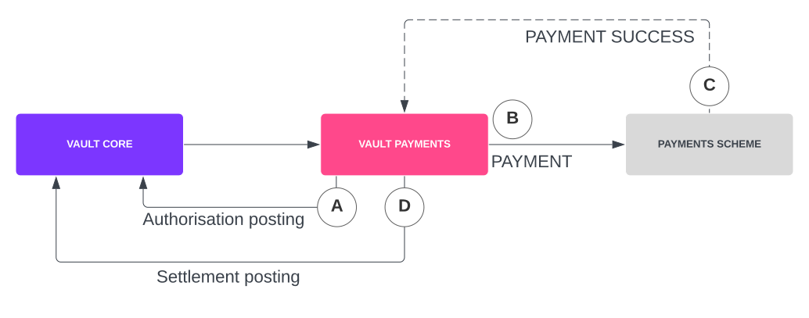
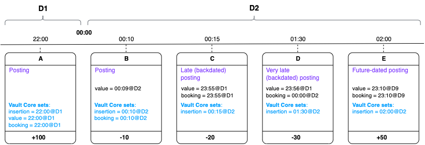
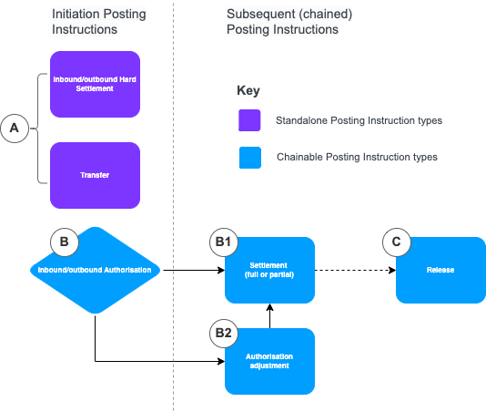

# Postings

## What are Postings?

### Purpose of Postings

Postings are the units of financial data in Vault Core and form the Postings Ledger, Vault Core’s append-only single source of financial truth. Postings are always generated by Posting Instructions.

The Postings Ledger is based on the double-entry accounting principle, such that each Posting Instruction always represents a balanced financial movement in terms of debits and credits.

### The Vault Core Postings model

The key building blocks that make up Postings in Vault Core are:

-   A [*Posting*](/vault-core/5-9/EN/reference/postings#posting), the lowest-level object which captures a single credit or debit to an account in Vault Core.
    
-   A [*Posting Instruction*](/vault-core/5-9/EN/reference/postings#posting_instruction), which represents an intent to make a balanced set of Postings, such as a movement of funds between two accounts. Posting Instructions may create two or more Postings. There are multiple types of Posting Instruction, which generate different kinds of Postings.
    
-   A [*Posting Instruction Batch*](/vault-core/5-9/EN/reference/postings#posting_instruction_batch), which is the smallest group of Posting Instructions that must be accepted, or rejected, together in a single message. Posting Instructions in a Posting Instruction Batch are atomically accepted or rejected (all at once, not partially).
    
-   A [*Client transaction*](/vault-core/5-9/EN/reference/postings#client_transaction), a way to chain multiple Posting Instructions that logically work together (in a strict order), and with a defined beginning and end, to capture a financial process’s entire lifecycle.
    
-   A `PostingsAPIClient` resource, to segregate routes in the Postings API for specific payment integrations
    
-   High and low priority routes, to prioritise Posting Instruction Batches for latency sensitive uses (for example card authorisations) over latency insensitive cases (for example batch settlements) respectively
    

#### Diagram: The Vault Core Postings model

The following diagram illustrates how the core elements of the Postings model come together when used in multiple Posting Instruction Batches, using a customer payment with an example Card Scheme’s Authorisation and Settlement:

### Postings API interfaces

The Postings resources that you can interface with in our various APIs are described in the [Postings APIs](/vault-core/5-9/EN/api/postings_api#postings_apis) documentation.

## Timestamps in Vault Core

### Timestamps in postings

chat\_bubble

From Vault Core 5.5, Thought Machine added value and booking timestamps at Posting Instruction level. For more information, see [Timestamps introduced at Posting Instruction level](/vault-core/5-9/EN/vault_core_overview/financial_model#timestamps_introduced_at_posting_instruction_level).

In order for Vault Core to fulfill its role as a ledger (in accordance to the Vault Core [Financial Model](/vault-core/5-9/EN/vault_core_overview/financial_model)), it needs to be able to derive an account balance at any point in time.

To do this, Vault Core requires three timestamps on every posting:

-   **Insertion timestamp**: The time that Vault Core processed the posting and inserted it into the database. Vault Core always sets this value, and it cannot be changed.
    
-   **Value timestamp**: The time when the funds should have moved (or are set to move, if in future) between the source and destination accounts. This is set by either Vault Core (to match insertion) or the client, depending on where the posting originates. This timestamp can be set to before, or up to 90 calendar days after, the insertion timestamp.
    
-   **Booking timestamp**: The time when the funds movement was booked. This is set by either Vault Core (to match insertion) or the client. This timestamp can be set to before, or up to 90 calendar days after, the insertion timestamp.
    

warning

We do not recommend backdating the booking timestamp, unless the End of Day (EOD) period to which the backdating applies has not been closed.

#### Illustration of timestamps in a posting

The following diagram shows when these timestamps could be applied to a posting:

-   **A**: Where Vault Core is the source of truth, it sets all timestamps to the same value.
    
-   Where Vault Core is a system of record (SoR), the client sets the value timestamp either:
    
    -   **B**: In the past (called a backdated posting), or
        
    -   **C**: In the future (called a future-dated posting)
        
        chat\_bubble
        
        The booking timestamp can also be set in the future, or in the past (if the booking period has not yet closed).
        
    

### Examples of timestamps

chat\_bubble

The examples in this section have been updated to reflect the addition of value and booking timestamps at Posting Instruction level, introduced in Vault Core release 5.5. For more information, see [Timestamps introduced at Posting Instruction level](/vault-core/5-9/EN/vault_core_overview/financial_model#timestamps_introduced_at_posting_instruction_level).

#### Example of timestamps in a payment

The diagram below shows an example of how these timestamps are typically applied for an external payment sent from an account held in Vault Core.

A payment typically comprises of two postings made from a payments system (such as [Vault Payments](https://vault-portal.thoughtmachine.net/vault-payments/latest/EN/)) to Vault Core:

-   **A**: The payments system submits an outbound Authorisation posting for an outbound payment to Vault Core. This posting tells Vault Core to ring-fence funds for a payment.
    
-   **B**: The payment is submitted to the scheme.
    
-   **C**: The payment response from the scheme is successful.
    
-   **D**: The payment system submits a Settlement posting instruction to Vault Core.
    

Each of these postings has an associated timestamp. For the Authorisation posting instruction (**A**), Vault Core is the source of truth and so Vault Core sets all values for the timestamps:

-   **Insertion timestamp**: Set by Vault Core when the posting is inserted into the database.
    
-   **Value timestamp**: Set by Vault Core to the same value as the insertion timestamp.
    
-   **Booking timestamp**: Set by Vault Core to the same value as the insertion timestamp.
    

For the Settlement posting instruction (**D**), Vault Core is only the system of record and so the client also sets some timestamp values:

-   **Insertion timestamp**: Set by Vault Core when the posting is inserted into the database.
    
-   **Value timestamp**: Set by the client to the time the payment succeeded (according to the payments scheme).
    
-   **Booking timestamp**: Set by Vault Core to the same value as the insertion timestamp.
    

#### Example of timestamps over time

Here is a more involved example that shows a sequence of postings over two calendar days (**D1** and **D2**). This example includes a mix of different types of postings where Vault Core is either a source of truth or system of record (SoR):

The following table shows the timeline for these postings occurring over two days (**D1** and **D2**):

  
| Time | Posting | Timestamp action for |
| --- | --- | --- |
| 
D1 22:00

 | 

Vault Core receives Posting A to credit the account with £100.

 | 

Vault Core is the source of truth. So, Vault Core sets all three timestamps:

-   Insertion timestamp: set to 22:00@D1
    
-   Value timestamp: set to 22:00@D1 (matching the insertion timestamp)
    
-   Booking timestamp: set to 22:00@D1 (matching the insertion timestamp)
    

 |
| 

D2 00:10

 | 

Vault Core receives Posting B from a Payments integration, debiting the account by £10.

 | 

Vault Core is the SoR. Therefore, the client sets the value timestamp and Vault Core sets:

-   Insertion timestamp: set to 00:10@D2
    
-   Booking timestamp: set to 00:10@D2 (matching the insertion timestamp)
    

 |
| 

D2 00:15

 | 

Vault Core receives late Posting C, debiting the account by £20.

 | 

The client was late submitting this to Vault Core; the value timestamp is 23:55 on D1. The client knows that this posting has missed the cutoff for D1, but it was actually booked in that period in the client estate.

The client therefore manually sets the booking timestamp to match the value timestamp, and Vault Core sets:

-   Insertion timestamp: set to 00:15@D2
    

 |
| 

D2 01:30

 | 

Vault Core receives very late Posting D, debiting the account by £30.

 | 

The client was late submitting this to Vault Core; the value timestamp is 23:56 on D1. The client knows that although it is valued in D1, this posting has missed the booking cutoff for D1.

The client therefore manually sets the booking timestamp to 00:00@D2 (the start of the client’s D2 booking period), and Vault Core sets:

-   Insertion timestamp: set to 01:30@D2
    

 |
| 

D2 02:00

 | 

Vault Core accepts a future-dated Posting E, which will credit the account with £50 on day 9 (D9).

 | 

In this case, the client wants to value and book this posting at the same future time. Therefore, the client sets both the value and booking timestamps to 23:10 on day 9, and Vault Core sets:

-   Insertion timestamp: set to 02:00@D2
    

 |

### Timestamps in the Pre Posting Hook

The `insertion_timestamp` is the time when Vault Core commits a posting to the database. This timestamp is immutable and is always set by Vault Core at database commit time. Since the pre posting hook is executed before the posting is committed, the `insertion_timestamp` is not yet known, and so the following timestamps may be slightly earlier: the processing time of when the hook is executed.

chat\_bubble

For financial consistency there are mechanisms in place to ensure that processing time is logically the same as insertion time. This means that if anything in the state of the ledger has changed between processing time and insertion time (which would have affected the decision made by the ledger) then the transaction will fail.

-   *hook\_arguments.effective\_datetime*: The default value is the processing time of when the hook is executed, which as stated above, **is slightly earlier** than the insertion timestamp. If a `value_timestamp` is set in the posting request at *Posting Instruction* level, this will have no effect on `hook_arguments.effective_datetime`. If a `value_timestamp` is set in the posting request at *Posting Instruction Batch* level (deprecated, as noted above), then that value is used as `hook_arguments.effective_datetime`.
    
-   *hook\_arguments.posting\_instructions\[\].value\_datetime*: The default value is the same as `hook_arguments.effective_datetime` if there is no value set for `value_timestamp` for this posting in the request.
    
-   *hook\_arguments.posting\_instructions\[\].booking\_datetime*: The default value is the same as `hook_arguments.effective_datetime` if there is no value set for `value_timestamp` or `booking_timestamp` for this posting in the request.
    
-   *hook\_arguments.posting\_instructions\[\].insertion\_datetime*: This will always be `None` in the pre posting hook.
    

In the post posting hook, these timestamps will instead default to the `insertion_timestamp`, since the postings are now committed and this is known.

## Main components

This section describes the building blocks of Postings in Vault Core. To learn about the various APIs and their usage, see the documentation for the [Postings APIs](/vault-core/5-9/EN/api/postings_api/).

### Posting

A Posting object is the lowest-level object in the Postings APIs. It captures a single entry in an account’s postings ledger, recording either a credit or a debit to the account, and contains fields that are diverse enough to model a variety of financial instruments.

  
| Field | Type | Description |
| --- | --- | --- |
| 
`account_id`

 | 

String

 | 

The ID of the Vault Core account being posted to.

 |
| 

`account_address`

 | 

String

 | 

The address of the Vault Core account being posted to. Addresses provide the ability to segregate funds within an account, for example to separately calculate interest accrual. Every account has a DEFAULT address, the address to which postings are normally sent.

 |
| 

`asset`

 | 

String

 | 

The asset value of the posting. For example, this can be used to model different asset classes: fiat currency, commodities, equity.

 |
| 

`phase`

 | 

Enumeration

 | 

The posting phase, used to disambiguate COMMITTED (debiting/crediting) from PENDING (ring fencing) postings.

 |
| 

`credit`

 | 

Boolean (true/false)

 | 

Indicates whether the posting is a credit or a debit.

 |
| 

`amount`

 | 

String

 | 

The posting amount.

 |
| 

`denomination`

 | 

String

 | 

The posting denomination. For example, this can be used to provide further specification of the financial transaction: USD, miles, gold or AAPL.

 |

### Posting Instruction

A Posting Instruction represents an intent to generate two or more Postings to Vault Core.

Using Posting Instructions, the Postings APIs process and record a financial transaction and the transaction’s intent (or purpose) within the lifecycle of the financial process that it belongs to. For example, the Postings could be the result of an internal transfer between two customers of the same bank in Vault Core, or the result of a card authorisation.

The intent for financial transactions is recorded for two reasons:

-   *Financial consistency*: The Postings APIs enforce consistent movements of funds. This is exemplified in a card integration that has authorised a customer’s card transaction. At a later date, the integration will attempt to settle that transaction and debit the funds from the customer’s account. The Postings APIs understand the intent to settle, so they can ensure that the settlement instruction is associated with an open authorisation instruction, guaranteeing consistency in payment lifecycles.
    
-   *Auditability*: The Posting APIs' ability to capture intent behind financial transactions provides observability across Vault Core, so that any integrated systems (and any operations users) can understand the financial story that an integration is driving.
    

The Postings APIs expose nine [Posting Instruction Types](/vault-core/5-9/EN/reference/postings#posting_instruction_types) that capture various financial intents.

### Posting Instruction Batch

A Posting Instruction Batch object lets a payment integration group related Posting Instructions inside an atomic wrapper so that all instructions share the same fate; they are either accepted, rejected, or error out together.

For example, a payment integration processing a foreign transaction that also wants to logically separate the transaction and the scheme’s foreign transaction fee can do this by submitting a Posting Instruction Batch that contains two outbound authorisation instructions for the same customer account covering each transaction, with the guarantee that they will be accepted or rejected together.

warning

Posting Instruction Batches are not batches in the sense of *batch processing*, where the same operation is performed on every item contained in the batch. In a Posting Instruction Batch, if any Posting Instruction is rejected, then the entire set of Posting Instructions will be rejected. You should therefore only group together Posting Instructions where a single decision is the required behaviour. Bulk payments should instead be de-bulked and instructed individually.

#### Backdating and future-dating

Posting Instructions in a batch may also be backdated or future-dated, while still retaining the atomicity described above.

For example, a Posting Instruction Batch may contain the following Posting Instructions:

1.  An Inbound Authorisation instruction with a current (or past) value timestamp
    
2.  An Authorisation Adjustment instruction, which is also when the batch was actually sent to Vault Core (with value timestamp left as default to match insertion timestamp)
    
3.  A Settlement instruction with a future-dated value timestamp
    

All of these instructions will still be accepted, rejected, or error out together, and any relevant balance(s) will also be affected when the future value timestamp is reached. For this reason, you should only use future-dating when there is certainty (or very high confidence) that future balance changes can proceed without the need for further checks; for example crediting a customer’s current account as opposed to debiting it.

warning

While we guarantee atomicity in Posting Instruction Batches, we do not guarantee the order in which the Posting Instructions will be arranged in a Posting Instruction Batch response.

### Client transaction

A client transaction captures a financial process’s entire lifecycle, which can be made up of one or more Posting Instructions (in one or more Posting Instruction Batches) that logically work together, with a defined beginning and end. Some examples of client transactions that a payment integration might want to implement are:

-   *Card integration*: A client transaction might capture a card transaction’s lifecycle, made up of an authorisation phase which is then followed by a settlement phase at a later date to debit the funds from the customer’s account.
    
-   *Instant payment*: A client transaction might capture an inbound instant payment for a Vault Core customer. It might consist of an authorisation phase, followed by a credit at a later date. Alternatively it might consist of an outright credit, depending on the scheme’s rules.
    
-   *Internal transfer*: A client transaction might capture an internal transfer between two Vault Core customers, which would involve an outright crediting of a customer while debiting the other.
    

#### Multiple Posting Instructions

chat\_bubble

Not all payments require multiple Posting Instructions. For example, an internal transfer may map to a single transfer posting instruction, which simultaneously opens and closes a client transaction.

If a client transaction contains multiple Posting Instructions, there are two ways to define the order in which instructions are processed:

-   Define different `value_timestamp` values for each instruction to enforce any required order.
    
    The `value_timestamp` is truncated to microsecond precision, so for a `value_timestamp` to be considered later than another, it must be at least 1 microsecond later.
    
-   Define the same `value_timestamp` or `booking_timestamp` value for two or more posting instructions, and place them in separate Posting Instruction Batches.
    
    info
    
    Instructions can share identical `value_timestamp` or `booking_timestamp` only if insertion times are different (in other words, instructions are from different Posting Instruction Batches).
    
    Instructions within a client transaction must have non-decreasing `value_timestamp` and `booking_timestamp`.
    

If a posting instruction does not specify a `value_timestamp`, it will default to the `insertion_timestamp`.

## Posting Instruction types

Posting Instruction types are either standalone, or part of a longer transaction chain (chainable):

-   *Standalone*: For these types, only a single Posting Instruction is required to complete the client transaction. The Posting Instruction Batch containing a standalone type must use a unique combination of `client_id` and `client_transaction_id`.
    
-   *Chainable*: For these types, more than one Posting Instruction is required to complete the client transaction, either within a single Posting Instruction Batch, or across multiple batches. The first API call (to initiate the client transaction) must use a unique combination of `client_id` and `client_transaction_id`, so that any subsequent calls can reference it.
    

chat\_bubble

Posting Instruction types submitted via the asynchronous Kafka Postings API can be chained to Instruction types that were previously submitted via the synchronous REST Postings API (and vice versa). For example, you can send a card authorisation in a Postings Instruction Batch via the synchronous API, and chain a settlement to this in a second Posting Instruction Batch via the asynchronous API. For more information, see [Using the synchronous API](/vault-core/5-9/EN/api/postings_api#using_the_synchronous_api).

### Summary of Posting Instruction type usage

The following diagram illustrates the use of Vault Core’s various Posting types, for standalone and chainable Posting Instructions. Each type is described in more detail below:

1.  To initiate a client transaction, you can use a standalone hard settlement or a transfer, which also closes the transaction (A in the diagram), or you can use an authorisation (B).
    
2.  Following an authorisation, you can settle some or all of the authorised amount (B1) or submit an authorisation adjustment (B2).
    
3.  You can continue to (partially) settle or submit more authorisation adjustments as required, finally releasing any ring-fenced funds to close the transaction (C below).
    

### Inbound authorisation (chainable)

This chainable instruction credits a customer’s account, and debits a provided internal account, with a pending incoming phase. Effectively this instruction is used to record a pending credit against a customer account. When an inbound authorisation is created, it implicitly opens a client transaction that is to be mutated by other instructions at a later date.

lightbulb

An example is a cheque being deposited into the customer’s account (authorisation) and it must first clear (settlement) before funds are available. If the cheque is cancelled this would require a release of the authorised funds.

chat\_bubble

An inbound authorisation can be combined with a future-dated settlement in the same Posting Instruction Batch, whereby if accepted, the customer’s account would be credited at the future value date and the ringfenced funds would be released.

Example inbound authorisation object

### Outbound authorisation (chainable)

This instruction debits a customer account, and credits a provided internal account, with a pending outgoing phase. Effectively this instruction ringfences customer funds. When an outbound authorisation is created, it implicitly opens a client transaction that can be mutated by other instructions at a later date.

lightbulb

An example use for this instruction is a card payment at a fuel station. The scheme may request an authorisation of £100. Later, a settlement can be submitted against this client transaction to debit the customer’s account with the amount spent on fuel, and release the remaining ringfenced funds.

Example outbound authorisation object

### Authorisation adjustment (chainable)

If accepted, this instruction changes an existing client transaction by adjusting the amount authorised by an earlier authorisation.

In order to process an authorisation adjustment, the Postings API looks up the client transaction specified in the instruction and is able to infer its direction (inbound or outbound). This instruction attempts to further debit (or credit) a positive (or negative) amount to a customer account, and credit (or debit) a provided internal account, based on the direction of the transaction.

lightbulb

An example using an authorisation adjustment is a hotel reservation:

1.  An outbound authorisation is submitted when the hotel is booked.
    
2.  A week later, the customer decides to extend their stay at the hotel; the hotel requests an authorisation adjustment to a higher amount.
    
3.  At the end of the stay, the client transaction is settled using a settlement.
    

Example authorisation adjustment object

### Settlement (chainable)

The chainable settlement type is used to convert ring-fenced funds into actual postings (debits and credits) in the committed phase. In order to process a settlement, the Postings API looks up the client transaction specified in the instruction and is able to infer its direction (inbound or outbound).

The behaviour of the settlement type can be manipulated with the use of two fields: `amount` and `final`. For example, a settlement for an outbound client transaction can leave the `amount` field empty and the `final` field set to true or false to indicate whether the client transaction should be closed.

chat\_bubble

For more examples of the use of these fields, see [Example use of amount and final fields in Settlement Posting Instructions](/vault-core/5-9/EN/reference/postings#example_use_of_amount_and_final_fields_in_settlement_posting_instructions).

Example settlement object

### Inbound hard settlement (standalone)

This standalone instruction credits a customer’s account in the committed phase, with no intent to further modify the state of the client transaction. It also debits an internal account to follow the double-entry accounting model.

lightbulb

General examples include a customer depositing funds into their account via a branch, or receiving funds from another bank’s customer account. Another example use case is exposed by the FPS payment scheme’s inbound payment returns. The scheme dictates that inbound returns *must* be accepted by the receiving bank. The phase is committed for both postings because, as far as the scheme is concerned, the financial transaction has taken place on their books. Consequently, there is no use for an authorisation phase - Vault Core must accept these funds.

Example inbound hard settlement object

### Outbound hard settlement (standalone)

This standalone instruction debits a customer’s account in the committed phase, with no intent to further modify the state of the client transaction. It also credits an internal account to follow the double-entry accounting model. For example, a payment integration might model a cash withdrawal as an outbound hard settlement.

lightbulb

Examples include a cash withdrawal, a bill payment, or a customer making an online purchase.

Example outbound hard settlement object

### Release (chainable)

If accepted, this instruction closes an existing client transaction by releasing funds ring-fenced by a client transaction. No instruction can be chained after a release.

In order to process a release, the Postings API looks up the client transaction specified in the instruction and is able to infer its direction (inbound or outbound). It calculates the amount of funds ringfenced and then makes the relevant postings (credit and debits) needed to offset these ringfenced funds. Effectively this means Vault Core reduces the amount ring-fenced by this client transaction to zero.

lightbulb

An example use of release is the return of a hire car, undamaged, whereby an authorised security deposit is released back to the customer.

Example release object

### Transfer (standalone)

This instruction transfers an amount from one Vault Core account to another, in the committed phase. Effectively this instruction debits a Vault Core customer and credits another for the same amount, yielding two postings.

Example transfer object

### Custom instruction

Custom instructions provide the ability to write postings directly to the Postings ledger.

info

It is recommended to only use custom instructions for exceptional circumstances, when your required financial process cannot be modelled by any combination of the other posting instruction types. For example, you can use a custom instruction for an operations-driven workflow to rectify an incorrect movement of funds.

Example custom instruction

### Example use of amount and final fields in Settlement Posting Instructions

The following table shows how the `amount` and `final` fields in Settlement Posting Instructions let a caller model a complex financial process. The scenarios below do not cover Internal Account movements; they mirror the movements on the Customer Accounts, and are documented in the Core API section.

 
| Scenario | Description |
| --- | --- |
| 
`amount` is specified and `final` is true

 | 

-   The Postings API releases any funds authorised by the client transaction, up to the amount specified.
    
-   Simultaneously, the Postings API debits/credits the same amount from/to the customer account (depending on the direction of the client transaction - inbound or outbound)
    
-   The client transaction is then closed because final is set to true
    

 |
| 

`amount` is specified and `final` is false

 | 

-   The Postings API releases any funds authorised by the client transaction, up to the amount specified; any remaining funds stay in an authorisation hold
    
-   Simultaneously, the Postings API debits/credits the same amount from/to the customer account (depending on the direction of the client transaction - inbound or outbound)
    

 |
| 

`amount` is not specified and `final` is true

 | 

-   The Postings API releases any funds authorised by the client transaction
    
-   Simultaneously, the Postings API debits/credits those funds from/to the customer account (depending on the direction of the client transaction - inbound or outbound)
    
-   The client transaction is then closed because final is set to true
    

 |
| 

`amount` is not specified and `final` is false

 | 

-   This is not authorised and will yield an `INVALID_ARGUMENT` error. Vault Core only allows an unspecified amount if this is the last instruction to mutate this client transaction.An example use case of the settlement instruction would be a typical card transaction flow. When a customer makes a card transaction online, the scheme submits an authorisation to ringfence the funds from the customer’s account. Later, the scheme submits a clearing request to debit funds from the customer’s account.
    

Note: In this scenario, `final` should be set to true as further mutation of this client transaction isn’t expected. The amount would most likely be specified because card schemes allow merchants to clear an amount different to that of the authorisation.

 |

## Postings checks

After being requested, Posting Instructions go through a range of checks. They safeguard the integrity of Vault Core’s single source of financial truth. The order in which the checks are completed can depend on various factors.

### Idempotency

This stage checks whether a request has already been processed in the past. If it has, then the flow goes straight to response and events streaming (streaming stage) to republish the same messages that were published the first time the request was processed.

### Account resolution

This stage resolves the targeted account to be credited. This is specified by either the account ID, the payment device token or internal account processing label on Posting Instructions.

chat\_bubble

Account resolution by internal account processing label is only available on Vault Core with the Multiple Processing Groups Extension.

#### Resolution by account ID

This checks that the account exists and is in a valid status of `OPEN` or `CLOSING` (`PENDING_CLOSURE` in accounts v1). In addition, any account ID passed to an `internal_account_id` field is checked to ensure it is an internal account, otherwise an `INVALID_ARGUMENT` error is returned.

#### Resolution by payment device token

There is a relationship between [payment device](/vault-core/5-9/EN/api/core_api#payment_devices) tokens and accounts. A payment device and an account are linked by creating a payment device link which can be uniquely identified at a specific point in time by a payment device token.

The Postings APIs allow callers to specify accounts using payment device tokens to enable the concept of scheme-specific payment devices outside of Vault Core. This mechanism also provides logical isolation of instructions processed on a specific payment device, allowing Vault’s core to answer questions such as: `` `What instructions specified by PaymentDeviceToken `X `` were accepted today?''

Therefore this stage resolves the account and payment device of the payment device link associated with the specified payment device token. The following checks are then made:

-   Does the account exist? Is it in a valid status of `OPEN` or `CLOSING` (in accounts v1 this is `PENDING_CLOSURE`)?
    
-   Are both the account and the payment device active as of the posting instruction batch’s `value_timestamp`?
    

#### Resolution by internal account processing label

chat\_bubble

Resolution by internal account processing label is only applicable with the Multiple Processing Groups Extension.

Using `internal_account_processing_label` in place of `internal_account_id` dynamically routes the posting to an internal account in the relevant Processing Group of the customer account with a matching `processing_label`. This relies on another account ID found in the posting instruction to determine the Processing Group that the instruction is targeting. Posting instructions generated by a contract hook PostingInstructionDirective always uses the Processing Group of the originating account. An INVALID\_ARGUMENT error is returned if Vault Core cannot find an account ID (that is either a `target_account` or an `account_id` for custom instructions) to determine the Processing Group for the instruction, or if a matching internal account is not found for the processing label.

### Client transaction lifecycle checks

This stage performs a database call to fetch any previous posting instruction batches in the client transaction chain, and performs lifecycle checks on client transactions, enriching the request with external data. For each instruction processed, any corresponding client transaction gets loaded.

A response for the initiating instruction must first be received before subsequent postings against the client transaction can be accepted.

chat\_bubble

Release, Adjust and Settlement postings must use the same client transaction ID that was sent for the authorisation postings and should belong to the same posting client ID (logical namespace). This especially applies in cases where multiple Posting client IDs and integration topics are created.

#### Instruction types that initiate a client transaction

The following instruction types must contain a unique client transaction ID, because they initiate a client transaction. If the client transaction has been used before for a given client ID, the instruction is rejected with a posting violation of the type `CLIENT_TRANSACTION_ALREADY_EXISTS`:

-   Transfer
    
-   Inbound hard settlement
    
-   Outbound hard settlement
    
-   Inbound authorisation
    
-   Outbound authorisation
    
-   Custom
    

lightbulb

While `client_transaction_id` only needs to be unique for a given `client_id`, we strongly recommend making the `client_transaction_id` globally unique.

Rather than reusing the same client transaction ID across different client IDs, it is better practice to use a unique client transaction ID every time.

#### Instruction types that require additional checks

##### Authorisation adjustment

While a client transaction must consist of a single outbound authorisation, it can have multiple authorisation adjustments.

The following checks are carried out:

-   If the client transaction does not exist for a given client ID, the request is rejected with the posting violation type `CLIENT_TRANSACTION_DOES_NOT_EXIST`.
    
-   If the client transaction is closed (meaning a final settlement or a release was processed against this transaction), the request is rejected with the posting violation type `CLIENT_TRANSACTION_CLOSED`.
    
-   If there is a negative adjustment for an amount that is greater than the total amount of funds ringfenced by the client transaction, the request is rejected with the posting violation type `ADJUSTMENT_YIELDS_AUTHORISATION_WITH_NEGATIVE_AMOUNT`.
    

##### Release or settlement

For either a release or settlement posting type, the client transaction must consist of an inbound authorisation or an outbound authorisation with zero to multiple adjustments following it. The following checks are carried out:

-   If the client transaction does not exist for a given client ID, the request is rejected with the posting violation type `CLIENT_TRANSACTION_DOES_NOT_EXIST`.
    
-   If the client transaction is closed, the request is rejected with the posting violation type `CLIENT_TRANSACTION_CLOSED`.
    

##### Custom instruction

If the client transaction already exists for a given client ID, it must consist of a chain of custom instructions exclusively. If it does not, we return a posting violation of type `CLIENT_TRANSACTION_INVALID_OPERATION`.

### Smart Contract execution and restriction checks

#### Smart Contract execution

Smart Contract executions are run according to the instructions of a Posting Instruction Batch. See [Smart Contracts](/vault-core/5-9/EN/reference/contracts/) for more information.

Smart Contract execution through the `pre_posting_hook` will always be run for the following posting types:

-   Transfer
    
-   Inbound hard settlement
    
-   Outbound hard settlement
    
-   Inbound authorisation
    
-   Outbound authorisation
    
-   Authorisation adjustment
    
-   Custom instruction
    

Smart Contract execution through the `pre_posting_hook` will only be run if `require_pre_posting_hook_execution` is specified in the posting instruction for the following posting types:

-   Release
    
-   Settlement
    

chat\_bubble

Calculations performed in Smart Contracts use the default precision of the decimal datatype, which is 28 significant figures.

#### Restriction checks

When posting instructions specify a customer account via the `account_id` field, the Postings API checks the customer-level restrictions as well as the account-level restrictions. When a customer account is specified via a payment device token, payment device-level restrictions are also checked. Any restriction violation yields a restriction violation object (within the posting instruction object), which contains the relevant restriction set ID in Vault Core.

### Committing to the database

This stage commits Posting Instruction Batches to the database. Postings with the accepted status are written to the Postings Ledger table, whereas rejected Postings are written to the read-optimised database and journal tables. Postings with the status of `errored` are not committed.

### Streaming out responses and events via Kafka topics

*Response streamer*: This stage streams out Posting Instruction Batch requests to the relevant Kafka topic (each integration has its own response topic). To route a response to a caller, the Postings API retrieves the Postings API client associated with the posting instruction batch’s specified `client_id`. All posting instruction batches will be streamed out by the response streamer, whether accepted, rejected or errored.

*Event streamer*: This stage streams out a `PostingInstructionBatchCreatedEvent` for every accepted or rejected posting instruction batch. Unlike the response streamer, this is a stream that merges posting instruction batches from all Postings API clients into a single, unified Kafka stream. It will include the live balance for the account.