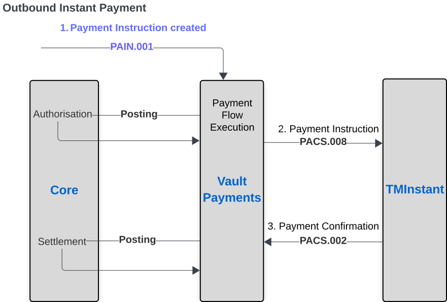
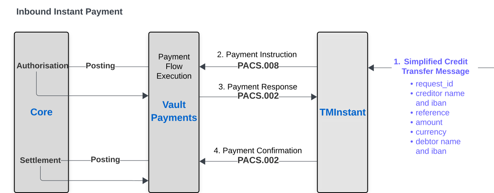

# Instant payments

Vault Payments includes an instant payment scheme named TMInstant that can be used to evaluate Vault Payment’s instant payment capabilities for account to account processing. It is modelled on modern ISO 20022 instant payment schemes. Users can use a combination of the [Instruction](/vault-payments/latest/EN/api/payments_api#Instructions) endpoints and the [Credit Transfer Simulator](/vault-payments/latest/EN/api/payments_api#simulator_credit_transfers) endpoints to evaluate instant payment processing flows such as submitting outbound payments, receiving and responding to time sensitive inbound payments and the receiving and submission of payment returns. The TMInstant payment system uses the following instruction types:

-   `FIToFICustomerCreditTransfer` (based on pacs.008)
    
-   `FIToFIPaymentStatusReport` (based on pacs.002)
    
-   `PaymentReturn` (based on pacs.004)
    

The Sandbox provides pre-configured Instruction Flows for TMInstant scheme processing.

Find these Instruction Flows in the **Configuration** > **View Flows** [area of the Vault Payments app](https://sandbox.payments.tmachine.io/configuration/instructionflows):

-   TMInstant Outbound
    
-   TMInstant Outbound Status Report
    
-   TMInstant Outbound Return
    
-   TMInstant Inbound
    
-   TMInstant Inbound Status Report
    
-   TMInstant Inbound Return
    

> ***NB:*** TMInstant is an internal, non-production scheme made available solely for evaluation and demonstration purposes.

## TMInstant scheme simulator

There are two TMInstant payments processing paths outlined below:

### Receiving an inbound instant payment

Here Vault Payments is acting on behalf of the payment recipient.

1.  The TMInstant Scheme initiates an inbound `FIToFICustomerCreditTransfer` Instruction.
    
2.  On receiving the result on the Instruction processed by Vault Payments, the TMInstant Scheme initiates a corresponding inbound `FIToFIPaymentStatusReport` Instruction.
    

Once the payment is settled, the recipient has the option to return this payment as follows:

3.  The original payment recipient initiates an outbound `PaymentReturn` Instruction.
    
4.  The TMInstant Scheme initiates a corresponding outbound `FIToFIPaymentStatusReport` Instruction.
    

### Submitting an outbound instant payment

Here Vault Payments is acting on behalf of the payment initiator.

1.  The payment initiator initiates an outbound `FIToFICustomerCreditTransfer` Instruction.
    
2.  The TMInstant Scheme initiates a corresponding outbound `FIToFIPaymentStatusReport` Instruction.
    

Vault Payments may receive a corresponding payment return in the future:

3.  The TMInstant Scheme initiates an inbound `PaymentReturn` Instruction.
    

### TMInstant scheme simulator

The Scheme Simulator provides two convenience endpoints to simulate both inbound credit transfers and inbound returns. API documentation for the TMInstant scheme simulator can be found [here](/vault-payments/latest/EN/api/payments_api#Simulator_Credit_Transfers).

#### Simulate inbound payment

`[https://sandbox.payments.tmachine.io/api/sandbox/simulate/credit-transfers/inbound](https://sandbox.payments.tmachine.io/api/sandbox/simulate/credit-transfers/inbound)`

Example request:

The simulator initiates both the `FIToFICustomerCreditTransfer` and corresponding confirmation `FIToFIPaymentStatusReport`.

#### Simulate inbound return payment

`[https://sandbox.payments.tmachine.io/api/sandbox/simulate/credit-transfers/inbound-return](https://sandbox.payments.tmachine.io/api/sandbox/simulate/credit-transfers/inbound-return)`

Example request:

The simulator fetches the requested outbound `FIToFICustomerCreditTransfer` Instruction and initiates the corresponding inbound `PaymentReturn` Instruction.

#### Outbound submission simulation

The TMInstant outbound `FIToFICustomerCreditTransfer` flow submits the instruction to the TMInstant scheme simulator. The scheme simulator’s default behaviour initiates a corresponding outbound `FIToFIPaymentStatusReport` with transaction status `ACCC`. The payment initiator can override this default behaviour by setting `message_v08.credit_transfer_transaction_information[0].payment_identification.end_to_end_identification` on the `FIToFICustomerCreditTransfer` as follows:

 
| `end_to_end_identification` | Behaviour |
| --- | --- |
| 
`ACWP RESPONSE`

 | 

outbound `FIToFIPaymentStatusReport` initiated with transaction status `ACWP`

 |
| 

`ACSP RESPONSE`

 | 

outbound `FIToFIPaymentStatusReport` initiated with transaction status `ACSP`

 |
| 

`ACCC RESPONSE`

 | 

outbound `FIToFIPaymentStatusReport` initiated with transaction status `ACCC`

 |
| 

`RJCT RESPONSE`

 | 

outbound `FIToFIPaymentStatusReport` initiated with transaction status `RJCT`

 |
| 

`DROP RESPONSE`

 | 

no `FIToFIPaymentStatusReport` initiated

 |

Example request:

#### Outbound payment return submission

The TMInstant simulator allows for the submission of `PaymentReturn` Instructions for inbound credit transfers that have completed.

1.  After simulating an inbound credit transfer, obtain the `correlation_id` - the TMInstant simulator will generate this as a UUID when the credit transfer is processed.
    
2.  Make a request to the `[https://sandbox.payments.tmachine.io/api/v1/instructions:initiate](https://sandbox.payments.tmachine.io/api/v1/instructions:initiate)` POST endpoint specifying a `PaymentReturn` payload as follows:
    

3.  The `PaymentReturn` will now begin to process. Provided that the Instruction is deemed to be valid by the associated payment flow, the Instruction will be submitted to the TMInstant simulator and a pacs.002 status report Instruction will be generated.
    
4.  The fate of the payment return can be tracked in the Payments UI under the `correlation_id` that was used throughout the chain of Instructions.
    

## Outbound Credit Transfer Instruction Flow

The flow for Instructions of type `FIToFICustomerCreditTransfer` with direction `OUTBOUND`. The flow:

1.  Carries out a scheme validation.
    
2.  Resolves and evaluates account rules
    
3.  Performs outbound authorisation postings.
    
4.  Submits outbound payment to the scheme.
    

The flow requires:

-   No previous outbound or inbound credit transfers
    

### Validate Instruction step

The *Validate Instruction* step ensures the validity of various fields on the Instruction.

-   The reference must be between 1 and 100 characters inclusive
    
-   The amount must be between 0.01 and 30.00 inclusive
    

The scheme validation step additionally generates payment identification fields. If validation fails the instruction goes to the *Payment Cancelled* step.

### Validate debtor step

The *Validate debtor* step performs Payment Instrument resolution and Account Link selection, evaluates Payment Instrument and Account Link restrictions, and performs Payment Instrument and Account Link updates. If no errors occur the instruction goes to the *Authorisation posting* step, otherwise the step sets the outcome to `REJECTED`.

### Authorisation posting step

This step sends an Outbound Authorisation posting debiting the customer account and crediting `LIQUIDITY_ACCOUNT`. If the posting succeeds, the Instruction goes to the *Scheme submission* step, otherwise the step sets the outcome to `REJECTED`.

### Scheme submission step

The *Scheme submission* step sends the payment to the TMInstant scheme integration `tminstant-scheme-simulator`, and processing completes here with instruction outcome set to `ACCEPTED`.

## Outbound Status Report Instruction Flow

The flow for Instructions of type `FIToFIPaymentStatusReport` with direction `OUTBOUND`. The flow:

1.  Settles or Releases funds based on transaction status.
    

The flow requires:

-   A previous accepted outbound credit transfer or payment return
    

### Validate Instruction step

The *Validate Instruction* step ensures that a matching outbound credit transfer or payment return exists and that the transaction status is valid. If the transaction status indicates that the Instruction has been accepted the flow enters the *Settlement posting* step. For rejected transaction statuses, the flow transitions to the *Release posting* step.

### Settlement posting step

This step settles the previously ringfenced funds to complete the payment. Processing completes here with instruction outcome set to `ACCEPTED`.

### Release posting step

On notification that the outbound credit transfer could not be applied to the creditor account, this step releases the previously ringfenced funds. Processing completes here with instruction outcome set to `REJECTED`.

## Inbound Credit Transfer Instruction Flow

The flow for Instructions of type `FIToFICustomerCreditTransfer` with direction `INBOUND`. The flow:

1.  Resolves and evaluates account rules
    

The flow requires:

-   No previous outbound or inbound credit transfers
    

### Validate Instruction step

The *Validate Instruction* step ensures that there are no previous matched instructions and the validity of various fields on the inbound instruction.

### Validate creditor step

The *Validate creditor* step performs Payment Instrument resolution and Account Link selection, evaluates Payment Instrument and Account Link restrictions, and performs Payment Instrument and Account Link updates. If any problems occur, such as a rule associated with the Payment Instrument that prevents further processing, the step sets outcome to `REJECTED`.

### Inbound Authorisation postings step

The *Inbound Authorisation postings* step issues a posting to the Account on Vault Core instance that is associated with the underlying PaymentInstrument. The customer account is credited and `LIQUIDITY_ACCOUNT` is debited. If the inbound authorisation posting cannot be credited to the account, the step sets the outcome of the Instruction to `REJECTED`.

### Initiate status report Instruction step

The *Initiate status report Instruction* step issues a pacs.002 Instruction that is used to represent the status of the pacs.008 Instruction that is being processed.

## Inbound Status Report Instruction Flow

The flow for Instructions of type `FIToFIPaymentStatusReport` with direction `INBOUND`. The flow:

1.  Settles or Releases funds based on transaction status.
    

The flow requires:

-   A previous inbound credit transfer
    

### Validate Instruction step

The *Validate Instruction* step ensures that the matched inbound credit transfer exists and that the transaction status is valid. If the transaction status is a rejected status, the step sets instruction outcome to `REJECTED`. Depending on the transaction status, the Instruction goes to the *Settlement posting* or *Release posting* step.

### Settlement posting step

This step sends a settlement posting to credit the customer account where funds were authorised previously. If no errors occur the step sets the Instruction outcome to `ACCEPTED`.

### Release posting step

This step sends a release posting to the customer account to cancel the authorisation that was issued in the inbound credit transfer flow previously. If no errors occur the step sets Instruction outcome to `REJECTED`.

## Outbound Payment Return Instruction Flow

image::tm\_instant\_outbound\_instant\_payment\_returned.svg\[tm instant outbound instant payment\_returned\]

The flow for Instructions of type `PaymentReturn` with direction `OUTBOUND`. The flow:

1.  Carries out a scheme validation.
    
2.  Performs outbound authorisation postings.
    
3.  Submits outbound payment to the scheme.
    

The flow requires:

-   A previous accepted inbound credit transfer - A previous accepted inbound status report
    

### Scheme validation step

The *Scheme validation* step ensures the validity of various fields on the Instruction. - A matched inbound credit transfer must exist - The amount must match the inbound credit transfer - The currency must match the inbound credit transfer

The *Scheme validation* step generates various original payment identification fields. If validation fails, the step sets the outcome of the Instruction to `REJECTED`, otherwise the instruction goes to the *Authorisation postings* step.

### Authorisation postings step

This step sends an Outbound Authorisation posting debiting the customer account and crediting `LIQUIDITY_ACCOUNT`. If the posting failed, the step sets the outcome of the Instruction to `REJECTED`, otherwise the instruction goes to the *Scheme submission* step.

### Scheme submission step

The *Scheme submission* step sends the payment to the TMInstant scheme integration `tminstant-scheme-simulator`, and processing completes here with instruction outcome set to `ACCEPTED`.

## Inbound Payment Return Instruction Flow

The flow for Instructions of type `PaymentReturn` with direction `INBOUND`. The flow:

1.  Carries out a scheme validation.
    
2.  Performs hard settlement postings.
    

The flow requires:

-   A previous accepted outbound credit transfer
    
-   A previous accepted outbound status report
    

### Scheme validation step

The *Scheme validation* step ensures the validity of various fields on the instruction.

-   A matched outbound credit transfer must exist
    
-   The original payment identification must match the outbound credit transfer
    
-   The debtor and creditor accounts and parties must match the outbound credit transfer
    
-   The original settlement amount and date must match the outbound credit transfer
    

### Hard Settlement posting step

This step sends an Inbound Hard Settlement posting crediting the customer account and debiting `LIQUIDITY_ACCOUNT`.