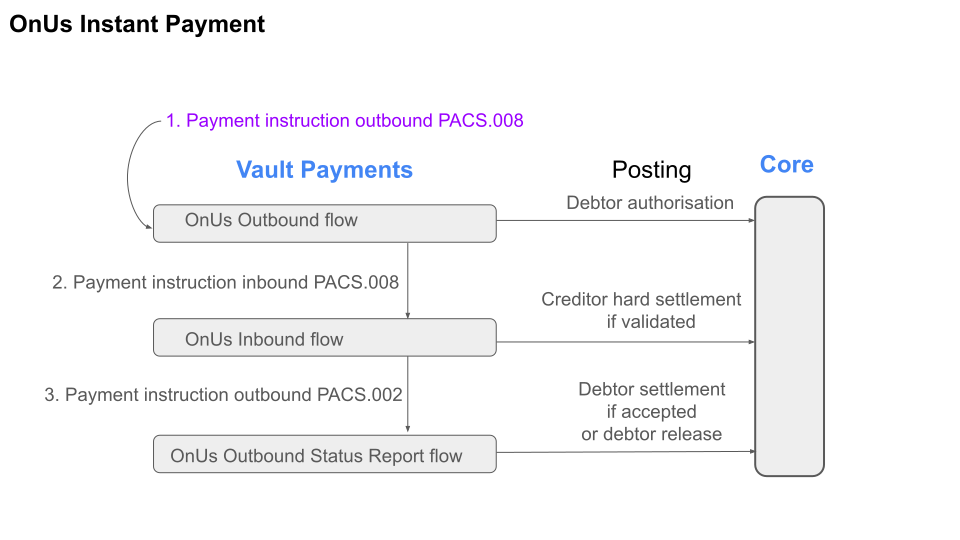

# On us instant payments

Vault Payments includes an on us instant payment scheme named TMOnUs that can be used to evaluate Vault Payment’s instant payment capabilities for account to account processing for payments between accounts from the same bank. It is modelled on modern ISO 20022 instant payment schemes. Users can use the [Instruction](/vault-payments/latest/EN/api/payments_api#Instructions) endpoints to evaluate instant payment processing flows such as submitting outbound payments, and receiving and responding to time sensitive inbound payments. The TMOnUs payment system uses the following instruction types: - `FIToFICustomerCreditTransfer` (based on pacs.008) - `FIToFIPaymentStatusReport` (based on pacs.002)

The Sandbox provides pre-configured Instruction Flows for TMOnUs scheme processing. There are also two provisioned EUR accounts with payment instruments to use when trying out the flows.

By directing a single instruction processing request to the outbound flow, if its outcome is `ACCEPTED` then two further instructions will be generated and sent. The outbound OnUs flow will generate and send an inbound FI to FI credit transfer instruction towards the creditor account, and when that instruction outcome is determined, the inbound OnUs flow will generate and send an outbound status report instruction.

Find these Instruction Flows in the **Configuration** > **View Flows** [area of the Vault Payments app](https://sandbox.payments.tmachine.io/flows/deployed):

-   TMOnUs Outbound - TMOnUs Outbound Status Report - TMOnUs Inbound
    

> ***NB:*** TMOnUs is an internal, non-production scheme made available solely for evaluation and demonstration purposes.

## Outbound OnUs Credit Transfer Instruction Flow

In order to send an instruction to this flow for processing, the instruction flow ID should be specified as "onus-outbound".

The flow for OnUs Instructions of type `FIToFICustomerCreditTransfer` with direction `Outbound`. The flow:

1.  Carries out a scheme validation.
    
2.  Resolves and evaluates account rules.
    
3.  Performs outbound authorisation postings.
    
4.  Submits an inbound credit transfer.
    

The flow requires:

-   No previous outbound or inbound credit transfers
    

### Scheme validation step

The *Scheme validation* step ensures the validity of various fields on the instruction. - The reference must be between 1 and 100 characters inclusive - The amount must be between 0.01 and 100000.00 inclusive

The *Scheme validation* step additionally generates payment identification fields. If validation fails the step sets the outcome to `REJECTED`.

### Rule evaluation step

The *Rule evaluation* step performs Payment Instrument resolution and Account Link selection, evaluates Payment Instrument and Account Link restrictions, and performs Payment Instrument and Account Link updates for the debtor. If no errors occur the instruction goes to the *Authorisation posting* step, otherwise the step sets the outcome to `REJECTED`.

### Authorisation posting step

This step sends an Outbound Authorisation posting debiting the customer account and crediting `LIQUIDITY_ACCOUNT`. If the posting succeeds, the Instruction goes to the *Initiate instruction* step, otherwise the step sets the outcome to `REJECTED`.

### Initiate instruction step

This step initiates an inbound credit transfer, and processing completes here with instruction outcome set to `ACCEPTED`.

### Example InitiateInstruction request

## Inbound OnUs Credit Transfer Instruction Flow

The flow for TMOnUs Instructions of type `FIToFICustomerCreditTransfer` with direction `Inbound`. The flow:

1.  Carries out a scheme validation.
    
2.  Resolves and evaluates account rules.
    
3.  Performs settlement postings.
    
4.  Submits outbound status report.
    

The flow requires:

-   Exactly one previous outbound credit transfer. The preceding outbound credit transfer ringfences the debtor funds which will be settled in this step.
    

The inbound credit transfer instruction entering this flow is triggered in the outbound onus credit transfer flow.

### Matched Instructions check step

The *Matched Instructions check* step ensures that there is only one previous credit transfer type matched instruction (outbound) and ensures the validity of various fields on the inbound instruction.

### Account check step

The *Account Check* step performs Payment Instrument resolution and Account Link selection, evaluates Payment Instrument and Account Link restrictions, and performs Payment Instrument and Account Link updates for the creditor. If any errors occur, the step sets outcome to `REJECTED` otherwise the step sets outcome to `ACCEPTED`.

### Settlement posting step

This step sends an Inbound Hard Settlement posting crediting the customer account and debiting `LIQUIDITY_ACCOUNT`. If the posting succeeded, the Instruction goes to the *Initiate instruction* step, otherwise the step sets the outcome to `REJECTED`.

### Initiate instruction step

This step initiates an outbound status report, and processing completes here with instruction outcome set to `ACCEPTED`.

## Outbound OnUs Status Report Instruction Flow

The flow for OnUs Instructions of type `FIToFIPaymentStatusReport` with direction `Outbound`. The flow:

1.  Carries out a scheme validation.
    
2.  Settles or Releases funds based on transaction status.
    

The flow requires:

-   Two previous accepted credit transfers: outbound and inbound. The result of the inbound credit transfer determines which posting this flow makes.
    

The status report instruction entering this flow is triggered in the inbound onus credit transfer flow.

### Matched submission processing step

The *Matched submission processing* step ensures that there are exactly two previous credit transfer type matched instructions and ensures that the transaction status is valid.

### Settlement posting step

This step settles the previously ringfenced funds if the transaction status is an accepted status. Processing completes here with instruction outcome set to `ACCEPTED` if the posting succeeds or `REJECTED` otherwise.

### Release posting step

This step releases the previously ringfenced funds if the transaction status is rejected. Processing completes here with instruction outcome set to `ACCEPTED` if the posting succeeds or `REJECTED` otherwise.