# Using the app

Using the Vault Payments App, you can investigate how Vault Payments processes different types of Instructions and diagnose issues encountered in the flows. You can also view and draft flows in a low-code editor. For the initial launch of the Sandbox, no write operations are available from the Vault Payments App.

chat\_bubble

To access the Vault Payments app, see [Authentication](/vault-payments/latest/EN/app/authentication/).

## Supported browsers

We aim to deliver a secure and high quality front end application using the most up to date web standards available.

For this reason, the browsers on which Vault Payments App is currently supported are the last 3 versions of Google Chrome, Safari, Firefox, and Edge.

## Dates

The Vault Payments App shows dates and times converted to the local browser timezone. The corresponding timezone is always shown next to the date. Some dates and times do not have any timezone information. The app displays these as received in the instruction payload, accompanied by an info-bubble which you can hover on to see more information about the data type.

## Dashboards

The **Dashboards** section allows the review of [aggregated metrics](/vault-payments/latest/EN/api/aggregations) concerning the Payments processed through the Vault Payments platform.

For more information on Dashboards, see: [/using\_vault\_payments/dashboards](/vault-payments/latest/EN/using_vault_payments/dashboards).

### Setting up a home Dashboard

When loading the Dashboards section for the first time, the application will show a list of all of the available Dashboards alongside their description. You can click on any of the cards in the list to navigate to the Dashboard.

If there is a Dashboard you are particularly interested in seeing, you can use the 'house' icon next to the Dashboard name to mark it as your home Dashboard. Once you have done this, every time you load the app, this will be the Dashboard you will see by default. If you change your mind, you can click the button again to remove the home Dashboard to see the full list of Dashboards on the landing page.

The icon will be visible on all Dashboards so if you would like to change your home Dashboard at any point, you can click on the icon on your desired Dashboard to update your selection.

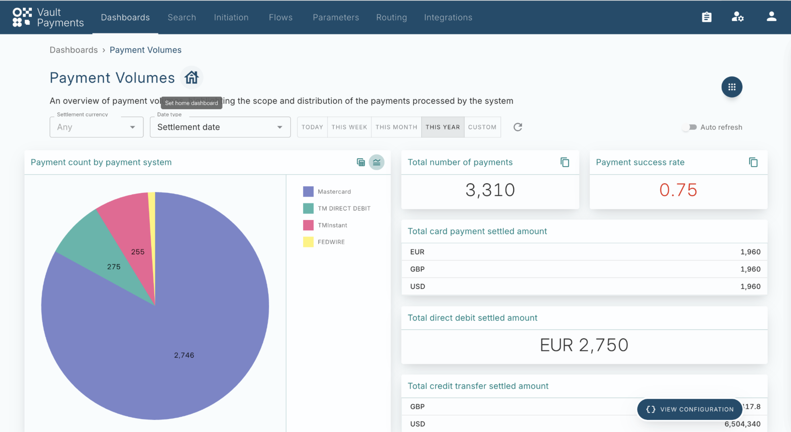

### Dashboard widgets

Dashboards are made up of widgets. Widgets present different Payment processing metrics.

Dashboards currently support 5 types of widget:

<table class="tableblock frame-all grid-all stretch center"><colgroup><col style="width: 50%;"> <col style="width: 50%;"></colgroup><tbody><tr><td class="tableblock halign-left valign-top">
Widget type
</td><td class="tableblock halign-left valign-top">
Description
</td></tr><tr><td class="tableblock halign-left valign-top">
Value
</td><td class="tableblock halign-left valign-top">
A value widget displays a single value of significance. Depending on the configuration of the Dashboard, this value may be highlighted if it has breached a specific threshold.
</td></tr><tr><td class="tableblock halign-left valign-top">
Table
</td><td class="tableblock halign-left valign-top">
A table widget lays out grouped metrics in a tabular format. This widget may contain multiple levels of nesting.
</td></tr><tr><td class="tableblock halign-left valign-top">
Pie chart
</td><td class="tableblock halign-left valign-top">
A pie chart widget displays values as segments of a pie chart.
</td></tr><tr><td class="tableblock halign-left valign-top">
Bar chart
</td><td class="tableblock halign-left valign-top">
A bar chart widget displays values as bars in a bar chart. If the data is nested then the bars will be further divided into segments.
</td></tr><tr><td class="tableblock halign-left valign-top">
Line chart
</td><td class="tableblock halign-left valign-top">
A line chart widget displays grouped data in linear format. This widget type is particularly useful for reviewing time-series data.
</td></tr></tbody></table>

#### Viewing chart legends and underlying data

Each chart widget includes a couple of icons in its header to allow toggling the legend on/off and switching the visualisation to a tabular format.

A tooltip appears when hovering on any of the chart data, which shows the full information about the slice of data. The legend can be used to correlate values with the Payments they correspond to at a single glance.

Reviewing the chart data in tabular format can be particularly useful for comparing values that are either very close together or so small they aren’t very visible in chart format.

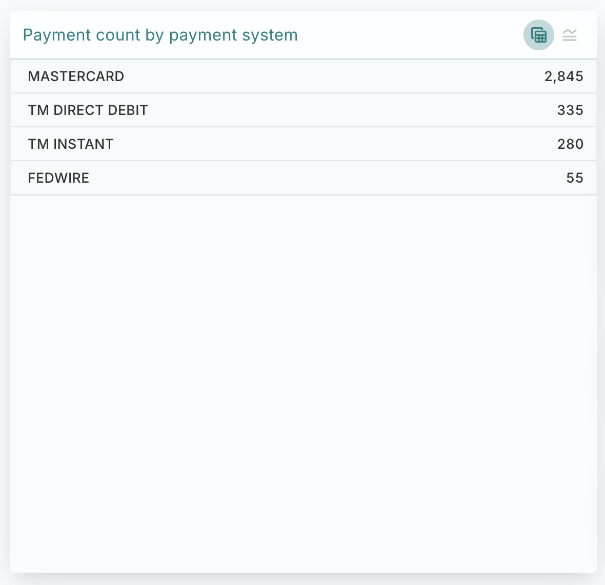

#### Viewing the Payments that make up the metrics

The Dashboards screen is seamlessly integrated with the Payment Search screen. That means that we can easily select any of the data point in the widgets and click through to view the actual Payments that make up the aggregated value.

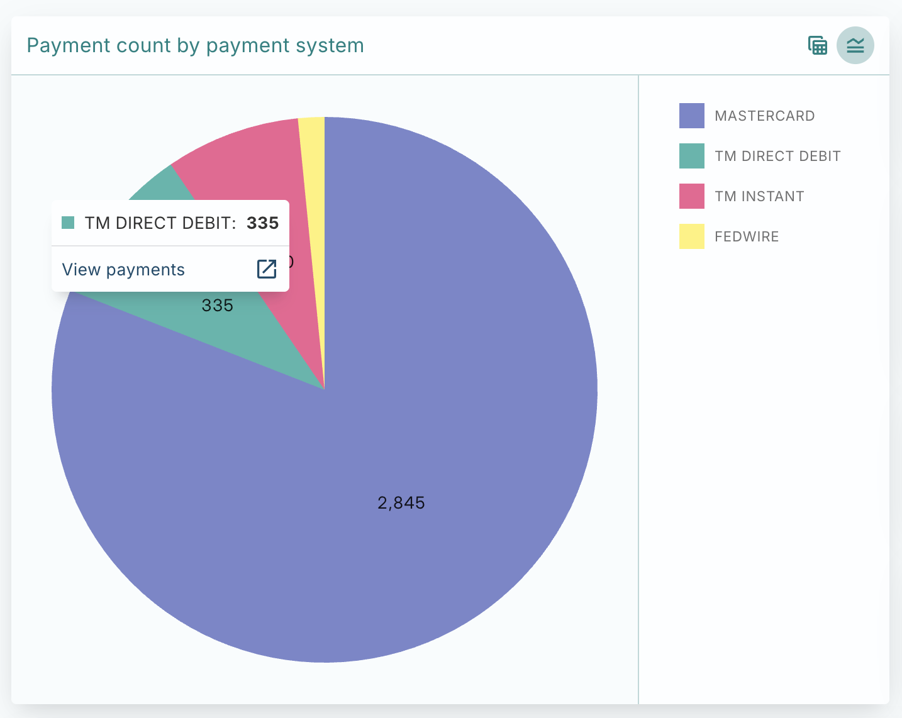

Drilling into the widget data points will take you to the Search screen, with a pre-populated [Search Query Language](/vault-payments/latest/EN/api/search_query_language) filter, which returns the set of Payments which make up the data point you have clicked on.

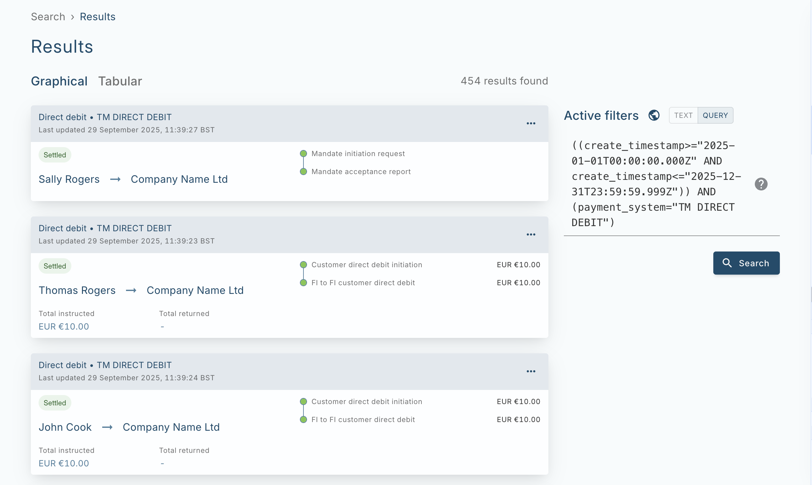

### Updating filters

The header of the Dashboard contains a set of simple filters which are applied to the Payments. Only Payments matching these filters will be aggregated in the Dashboard’s widgets.

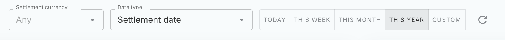

You may use the filters to narrow down the data set you are reviewing. The available filters are:

<table class="tableblock frame-all grid-all stretch center"><colgroup><col style="width: 50%;"> <col style="width: 50%;"></colgroup><tbody><tr><td class="tableblock halign-left valign-top">
Filter
</td><td class="tableblock halign-left valign-top">
Description
</td></tr><tr><td class="tableblock halign-left valign-top">
Settlement currency
</td><td class="tableblock halign-left valign-top">
The settlement currency code of the Payments. Only Payments settled in the selected currency will be aggregated if a value is set.
</td></tr><tr><td class="tableblock halign-left valign-top">
Date type
</td><td class="tableblock halign-left valign-top">
The type of date on which the timeframe filter should be applied.
</td></tr><tr><td class="tableblock halign-left valign-top">
Timeframe
</td><td class="tableblock halign-left valign-top">
To select a timeframe for the Payments that should be aggregated, you can pick a relative timeframe such as 'Today'/'This month' etc. or you can select a custom timeframe using a calendar. Your local timezone will be used to build the timeframe requested.
</td></tr></tbody></table>

### Auto refresh

The header of the Dashboard also has an 'Auto refresh' toggle. If enabled, the data in the Dashboard will be refreshed periodically to update the metrics shown.

### Navigating to view other Dashboards

The Navigator button on the top-right of the Dashboard opens a navigation sidebar which allows you to navigate to any of the other available Dashboards.

### Viewing and editing the Dashboard configuration

The 'View configuration' button in the bottom right of the screen can be used to view the JSON configuration of the Dashboard you are currently viewing. This can be useful as a starting point if you wish to create a new Dashboard or a new version for an existing Dashboard using the [Dashboards API](/vault-payments/latest/EN/api/payments_api#dashboards).

Editing the JSON value in this code panel will automatically update the Dashboard you are viewing. This is very useful for previewing Dashboard changes and validating new configuration.

chat\_bubble

Please note that changes made in this view will not be persisted. If making changes to the configuration, make sure you have copied your changes before navigating away.

### Using the Dashboard developer

The 'Dashboard developer' view in the application offers a blank canvas to start building and validating a new Dashboard configuration. This view will allow you to start building a new Dashboard from scratch. Once happy with the configuration, you can call the [Dashboards API](/vault-payments/latest/EN/api/payments_api#dashboards) to create a new Dashboard Version.

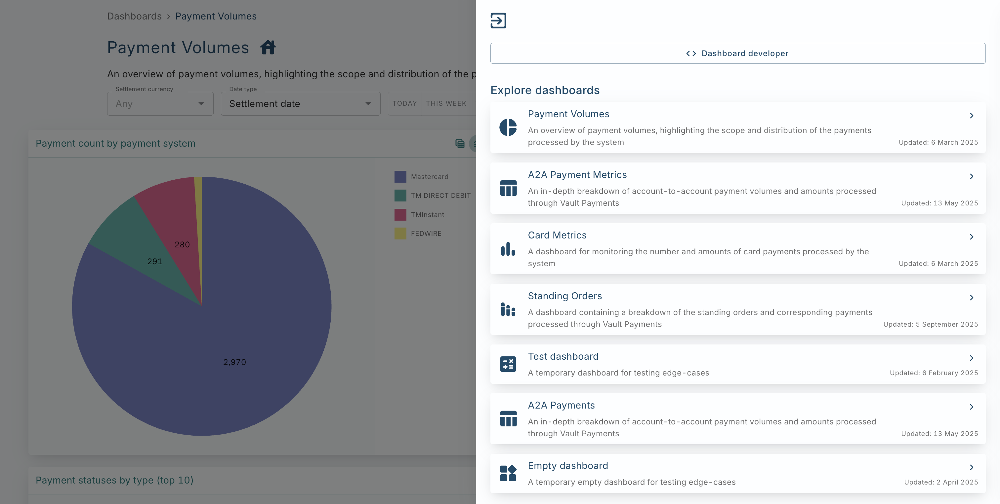

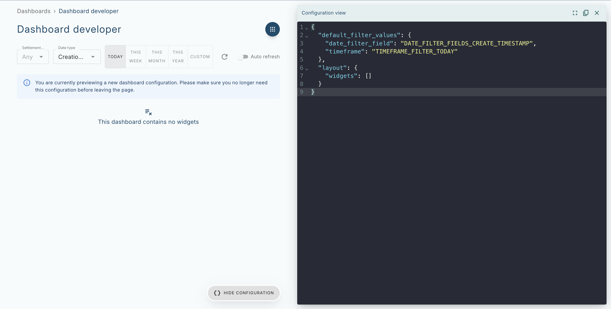

For more information on creating new Dashboards, see: [/using\_vault\_payments/dashboards](/vault-payments/latest/EN/using_vault_payments/dashboards).

## Payments

The **Payments** section facilitates the location and inspection of Payments, including the details of their underlying Instructions.

### Finding payments

The **Search** section of Payments offers an extensive set of filters which you can employ to narrow down the search for a particular Payment or set of Payments. When searching for a Payment, you can also use properties in its underlying Instructions to narrow down your results.

There are two main ways of searching for Payments. You can use:

-   the **Search for anything** input box at the top of the page to quickly filter against all of the indexed Payment and Instruction fields. This search matches queries against all of the fields available in the *Search by property* section underneath, using prefix matching. Searching for `Will` using this search bar returns all payments made by or received by both `William` and `Will`.
    
-   the **Search by property** form to refine your Payment search when you have some specific information about the Payment you are looking for - for example, if you know who made the Payment and how much money they paid.
    

The properties available for filtering come in a few different shapes:

-   **Text** properties support the matching of individual words within the text. For example, searching for `Lucas` in the `Paid by` property field returns Payments sent by both `Lucas Charles` and `Stephen Lucas`.
    
-   **Identifier** properties such as Instruction IDs and Payment references use exact matching. That means that if you make a spelling mistake in the input provided, you may find no results.
    
-   **Fixed options** are available for some properties such as statuses and types. These types of filters also use exact matching.
    
-   **Timestamp** properties support both exact and range matching. You don’t need to provide both ends when filtering on dates - you can search for all Payments that happened before a date and time, or all Payments created in the last hour.
    
-   **Amount** properties also support exact and range matching. When filtering on amounts, you must also provide a currency. Filters on cross-currency ranges aren’t supported.
    

The filter properties have three possible scopes:

-   **General** properties are commonly used filters which apply to both Payments and their underlying Instructions.
    
-   **Payment** properties apply to Payments.
    
-   **Instruction** properties apply to the underlying Instructions in Payments. Some of the filters available in the general and Payment levels also have equivalents at the Instruction level. If you supply values for both, the Instruction filter always overrides the Payment filter. For example, if you search for `Lucas` in the `Paid by` field and `Sylvia` in the `Card • Payer name` field, you only find card Payments made by Sylvia.
    

As you refine your filters, you can see the number of corresponding results dynamically update in the bottom of the screen. This number is approximate, as more Payments may be processed in the short timeframe between selecting the filters and submitting the search form.

On the **Search > Results** screen you can see the current active filter state on the right side. You can use this form to further refine your search criteria. At this stage, you can use the icon next to the **Active filters** header to toggle between using property filters and global search.

### Initiating payments

The **Initiation** section enables bank operators to create or update payments by initiating instructions directly from the browser.

For more information on Instruction resources, see: [Instructions documentation](/vault-payments/latest/EN/using_vault_payments/instructions_and_flows#instructions).

#### Initiate a payment

To initiate a payment, follow these steps:

##### Select a template

Initiation templates are forms that bank operators can fill out to populate the instruction before it is processed by Vault Payments.

[Templates](/vault-payments/latest/EN/using_vault_payments/templates) are client-facing configuration resources that transform complex ISO 20022 API payloads into guided forms. Each template has been pre-configured to create a [particular type of instruction](/vault-payments/latest/EN/using_vault_payments/instructions_and_flows#instruction_types) (e.g., an authorisation initiation), with fields that operators can fill in or override.

Templates can be found in the sidebar. Select one by clicking the `+` icon next to its name. Remove a selected template by clicking the `x` icon in the subheader of the form.

chat\_bubble

Templates are managed via the [Templates API](/vault-payments/latest/EN/api/payments_api#Templates). For information on creating templates, see: [Creating Templates tutorial](/vault-payments/latest/EN/introduction_to_vault_payments/tutorials/creating_templates).

##### Fill out the form

When a template is selected, it will be loaded onto the page as a form, in which a bank operator will be able to provide relevant information before submitting the payment for processing.

Some fields may be mandatory, and those that are will be highlighted if left empty when the form is submitted.

##### Submit the form

Once the form is filled out, the bank operator can submit the payment for processing by clicking the submit button.

The instruction will then be processed by Vault Payments in the same way it would be if a user were to make a `POST` request to [/api/v1/instructions:initiate](/vault-payments/latest/EN/api/payments_api#_payments_v1_instructions_InitiateInstructionResponse_InitiateInstruction) with the equivalent underlying payload.

For more information on the processing of instructions, see: [Flows documentation](/vault-payments/latest/EN/using_vault_payments/instructions_and_flows#instruction_flows).

##### View the results

After the payment has been submitted, the bank operator will be able to view the results of the payment in the **Results** section of the Vault Payments app. The results will include:

-   A copyable payment ID, which can be used to search for the payment in the [Search](/vault-payments/latest/EN/app/using_the_app#finding_payments) section
    
-   A link to the payment’s details, which will show the full details of the payment, including the details for the instruction that was processed
    
-   A link to the details of the [Instruction Flow Version](/vault-payments/latest/EN/using_vault_payments/instructions_and_flows#instruction_flow_versions) used to process the submitted instruction
    
-   A JSON representation of the instruction that was submitted to Vault Payments
    

Links to the payment details and instruction flow versions will open in a new tab, allowing the bank operator to view the details of the payment and the flow used to process it without losing their place in the app.

#### Using payment initiation template presets

If the manual payment initiation UI is used to initiate a payment that will be required again in the future, the contents of the form can be saved to be used again at a later date.

Once the form is filled in with the details that should be saved, the 'Save new preset' button can be clicked to save the values:

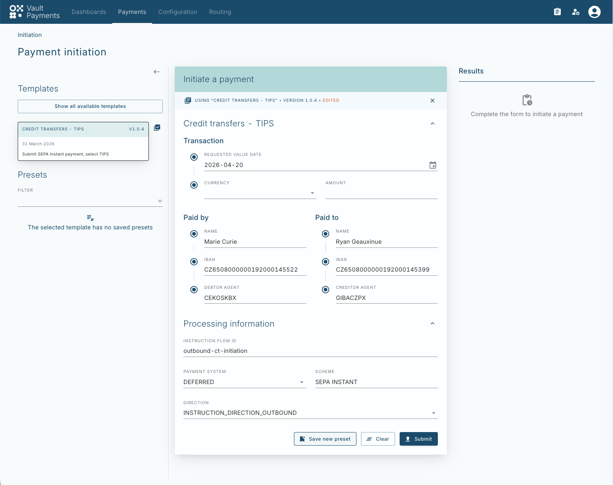

Each preset corresponds to a single payment initiation template. Once saved, a preset can be found and selected from the left-hand side Presets list for the template:

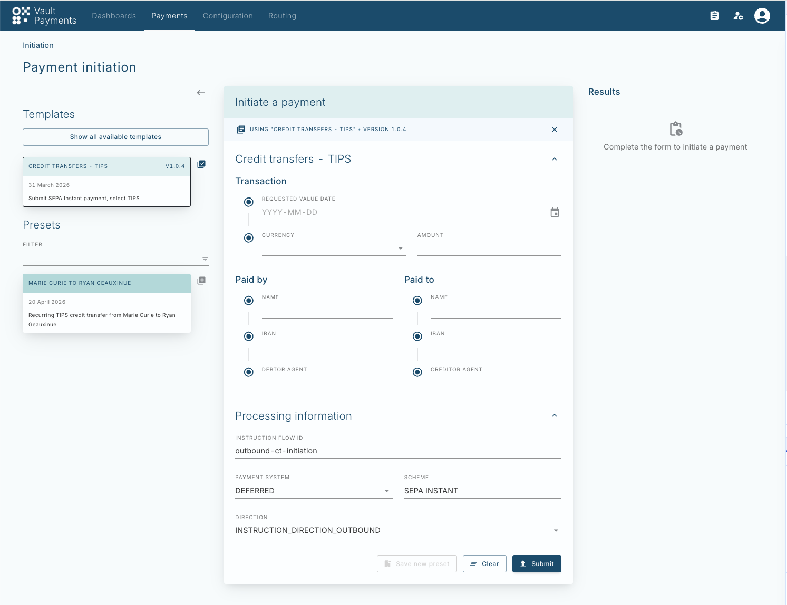

To edit the values in a preset, simply apply the preset and edit the values in the form. A button will show up allowing you to save the changes made to the preset:

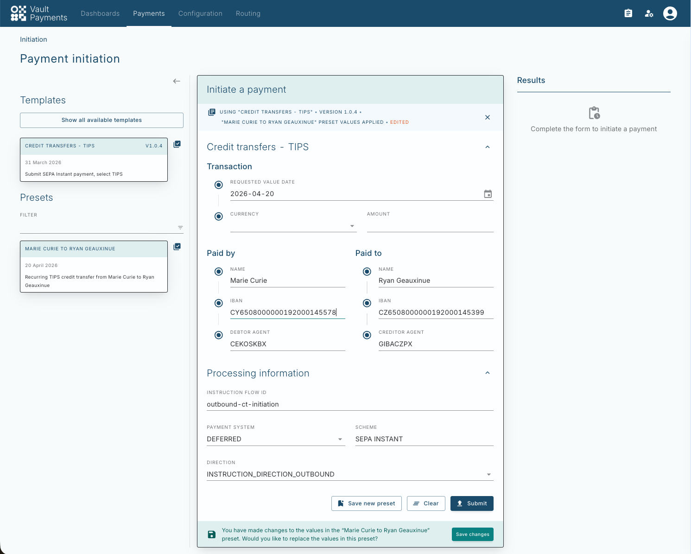

Alternatively, the 'Save new preset' button can be clicked to create a separate preset with these new values.

##### Deleting template presets

Once the values in a template preset are no longer required, they can be deleted directly from the Vault Payments App. This can be done by clicking its corresponding delete icon in the Presets list.

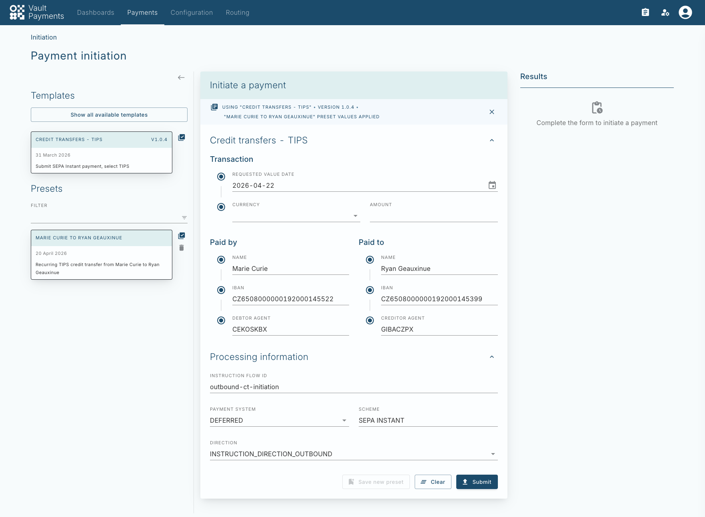

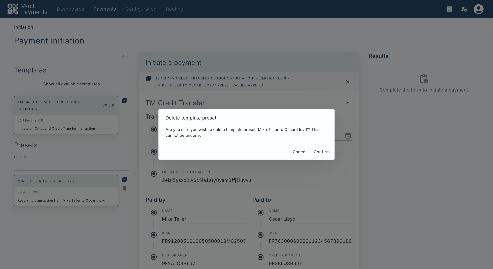

chat\_bubble

This operation will delete all of the information stored in the template preset and cannot be reverted. The preset will still exist in the system for auditing purposes, but will no longer show up in the list of presets for the template.

## Flows

The **Flows** section enables the viewing and drafting of Instruction Flows in the engine. These define how incoming Instructions are processed.

For more information on flow resources, see: [/using\_vault\_payments/instructions\_and\_flows/#instruction\_flows](/vault-payments/latest/EN/using_vault_payments/instructions_and_flows#instruction_flows).

### Deployed Flows

The **Deployed Flows** section allows you to view Instruction Flows that have been uploaded to the current environment using the Engine APIs

-   **Flow overview** provides a preview of the current active flow version alongside a list of expected parameters and their current values.
    
-   **Flow version inspector** provides a detailed view of the selected flow version
    
    -   Graph representation of the flows steps, functions and the relationships between them
        
    -   Code view for inspection
        
    -   View expected parameters and their current values
        
    -   Create as a development flow for experimentation within the UI
        
    

### Develop Flows

The **Develop Flows** section allows you to import, edit and export draft Instruction Flow versions. You can then [upload these Flow versions](/vault-payments/latest/EN/api/payments_api#InstructionFlowVersion) using the Engine APIs, outside of the Vault Payments App, for the Engine to use them to process Instructions

## Parameters

The **Parameters** section enables the viewing, creation and editing of global parameters. These can be used to configure the behaviour of flows and rules without editing code.

For more information on parameters, see: [/using\_vault\_payments/parameters](/vault-payments/latest/EN/using_vault_payments/parameters).

### View parameters

The list of global parameters shows all currently available global parameters and their current value.

The list can be filtered by **id** / **display\_name** / **description** and **value**

### Create global parameter

You can create a new global parameter in the current environment directly in the UI. It is also possible to create a global value on creation to allow immediate use of the parameter in flows and rules.

### Parameter details

Within the **Parameter details** section you can view the parameters current value and its historic values over time.

It is also possible to edit the value of the parameter for immediate effect in the current environment.

## Routing

The **Routing** section enables the search and viewing of Routing resources. From this screen, users can search for a Payment Instrument and view all its Payments and related resources (including [Account Links](/vault-payments/latest/EN/using_vault_payments/routing#account_links), Cards, and [Cardholders](/vault-payments/latest/EN/cards/concepts#cardholders)), as well as its associated Parameter Values.

For more information on routing, see: [/using\_vault\_payments/routing](/vault-payments/latest/EN)/using\_vault\_payments/routing.

### Finding Payment Instruments

The **Search** section of Routing allows the search of Payment Instruments by their routing information (`bank_identifier` and `instrument_identifier`).

If navigating to this page via a direct link from a Payment details screen, the routing information inputs in the Search section automatically contain the corresponding details.

### Parameter Values

The **Parameter Values** tab in Routing allows the viewing of Parameter Values set for the payment instrument. A historical list of all the values these parameters have had for this payment instrument is also available.

These parameter values override the values set globally (which are visible in [the Parameters screen](/vault-payments/latest/EN/app/using_the_app#parameters)) during the processing of instructions corresponding to this payment instrument.

The list of parameter values can be filtered by **id** / **display\_name** / **description** and **value**.

Directly from this tab, you can update these parameter values and add new parameter value overrides at the payment instrument level.

### Relationships

The **Relationships** tab presents details about the related resources linked to the payment instrument. Here, you can review the default Account Link of the instrument, as well as its dynamic Account Links.

If the Payment Instrument is a Card, this tab can also be used to view details about the Card and its Cardholder.

### Payments

The **Payments** tab contains a list of all the Payments made using this payment instrument. This list can be filtered further, using a set of filters on the right-hand side. This screen works similarly to the **Search** screen in the Payments section, while filtering only within the payment instrument’s payments.

For more information on searching for payments, see [the Payments section](/vault-payments/latest/EN/app/using_the_app#payments)

## Integrations

The **Integrations** section enables viewing Integrations, the interfaces to external systems.

For more information on integrations, see: [/using\_vault\_payments/integrations/](/vault-payments/latest/EN/using_vault_payments/integrations/).

### View integrations

The list of integrations shows all currently available integrations.

The list can be filtered by **id** / **display\_name** / **description** and **type**

### Integration details

Within the **Integration details** section you can view the integration’s current value and its historic values over time.

## Tasks

The **Tasks** section enables the viewing and interaction of Tasks.

For more information on Tasks, see: [Tasks](/vault-payments/latest/EN/using_vault_payments/tasks).

### Finding Tasks

In the Tasks section, different tabs are presented: **To do**, **In progress**, **Completed**, and **All tasks**. Each tab will show different Tasks depending on the roles you have, and your participation in a Task. Furthermore, each queue has a set of filters allowing you to find a particular Task.

#### To do

The **To do** tab presents all the Tasks that you should be aware of based on your role, allowing you to either assign yourself to the Task immediately by clicking **Claim**, or add mark a Task to review later by clicking **Review**.

You will see Tasks which are in a stage are relevant to your role, whether they need to be actioned by you, or an action by another user requires your approval.

#### In progress

The **In progress** tab shows Tasks which have you have participated in, but yet to be resolved. This is split up into Tasks which are **Waiting for you** (you need to act on it) and **Waiting for others** (others need to act on it).

Tasks which are **Waiting for you** are Tasks which are waiting for your input.

-   For assignees, you need to either:
    
    -   Propose an action.
        
    -   Propose a different action, as your action was rejected.
        
    
-   For reviewers, you need to either:
    
    -   Review the Task.
        
    -   Re-review the Task, as the proposed action has changed.
        
    

Tasks which are **Waiting for others** are Tasks which are not waiting for your input.

-   For assignees, you are waiting because:
    
    -   Other users to review your proposed action.
        
    
-   For reviewers, you are waiting because either:
    
    -   Other users need to review the Task.
        
    -   The assignee needs to propose or change their action.
        
    

#### Completed

The **Completed** tab shows Tasks which have reached a terminal status, and which you have participated in. This includes both Tasks which were executed successfully, as well as those which errored, exceeded their expiry deadline, or were abandoned after rejection.

#### All tasks

The **All tasks** tab is your complete list, showing every Task in the system, even those that do not directly involve you.

You can assign yourself to any Task, regardless of role. You can also review any Task, though it will not move the Task forward if your role is not relevant.

### Task Side Panel

Clicking on a Task opens up a page displaying the details relevant to the Task. For example, when clicking on a Manual Decision submission Task, then the Payment holding the Instruction with that Manual Decision will be opened. A side panel will also show, displaying the details of the Task, including the assignee, the approval stages, and the reviewers.

On this page, assuming the Task is in the relevant status, you can assign yourself to a Task, propose an action, review the Task, or even unclaim reviewing a Task if you no longer wish to review. Every action is described in the **Activity log**, hence every assignment, review, and change to the action is available to view, informing you of the history that led to a Task being in its current status.

### Example Usage

Let us work through an example scenario where Tasks have been setup, and during the processing of an Instruction, a Manual Decision is required to approve the payment. Then a Task will be created, waiting for an assignee to pick it up.

#### Assignee

To find a Task to assign yourself to, you navigate to the **To do** tab and find a Task which has no assignee. This appears for you because you have a role which is relevant to the Task.

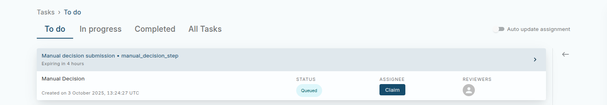

By clicking the **Claim** button, you can assign yourself to that Task. This means it will no longer appear in the **To do** tab of other users who might be suitable for assigning themselves to the Task, since it already has an assignee.

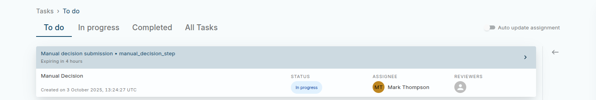

Clicking on the Task then brings you to the **Payment** page. Here, you can look at the Payment details and decide which option for the Manual Decision is most appropriate. Notice that the **Activity log** has an entry mentioning that the assignment has changed.

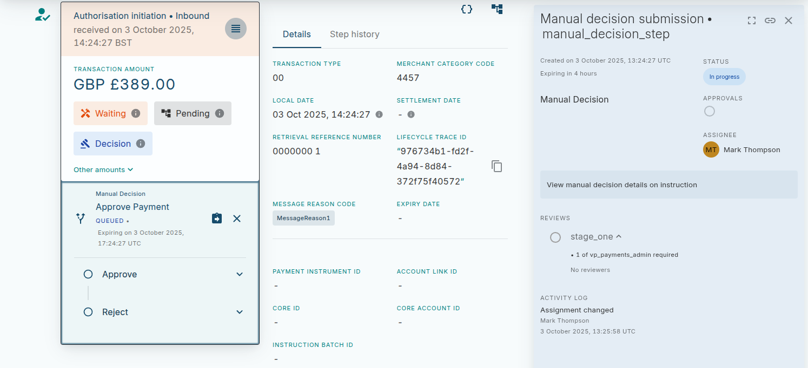

Upon submitting the option, the Task transitions to "Awaiting review" as it requires someone to approve your decision before it can be executed. Under the **Reviews** section, you can see that there is a single stage of approvals needed, and this has a single criterion specifying that a user with the "vp\_payments\_admin" role must approve before the Task can be executed. Also, notice that the **Activity log** has new entries stating that you submitted an option, which led to the status changing.

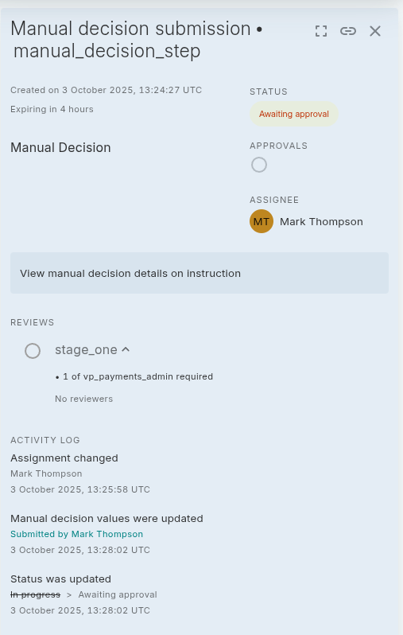

You must now wait for such a user to find the Task and approve. You can track your Task in the **In progress** tab, and it appears in the **Waiting for others** column as it is waiting for reviews. If the Task was rejected, then it would appear in the **Waiting for you** column, as you would need to change your proposed option, restarting the review process.

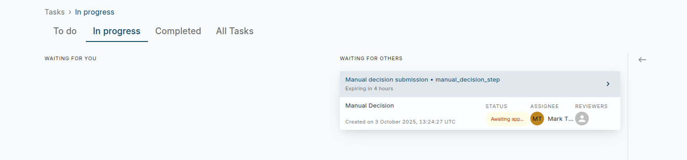

When the Task has been approved, the Task will be executed. Notice that you can see the history that led to the Task being approved and executed by reading the **Activity log**.

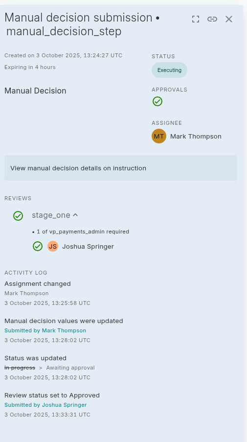

Once executed, the status will be updated with the result, and you can find the completed Task in the **Completed** tab.

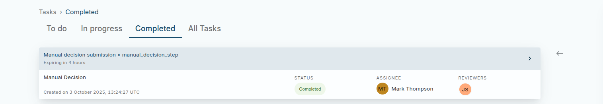

#### Reviewer

To find a Task to review, you navigate to the **To do** tab and find a Task which requires reviewers. This Task appears for you because you have a role which is required in the current approval stage of the Task.

You click the **Review** button to mark that you will review it. When enough people with a certain role mark that they will review it, or have reviewed it, then the Task no longer appears in the **To do** tab of users with that role.

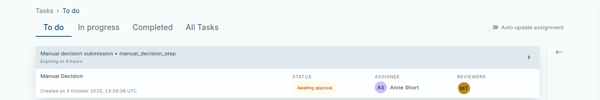

In the **In progress** tab, you can see that the Task is in the **Waiting for you** column as you have yet to make a review on it. If you had already reviewed it and it required further approvals, or you had rejected it, then it would appear in the **Waiting for others** tab.

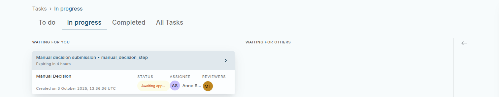

Clicking on the Task brings you to the **Payment** page, where you can see what decision was made. You can review the Payment and the proposed option to make sure they align, while also checking the **Activity log** to make sense of how the Task got to its current state.

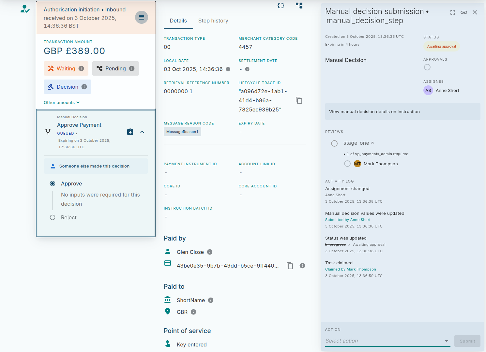

At the bottom, you can select whether to approve or reject the assignee’s decision, and click **Submit** to submit the review. If the Task requires no further reviews, and you approve, then the Task will be executed immediately.

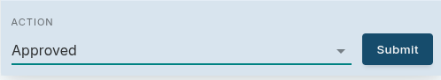

As this Task only requires a single approval, then if you approved the Task, the Task will be executed. As before, once completed, you can find the completed Task in the **Completed** tab.