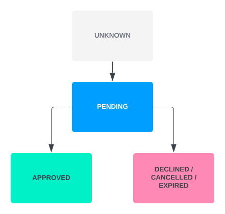

# 3DS Integration

This section gives an overview of the Vault Payments 3DS (3D Secure) integration. 3DS provides cardholder authentication during e-commerce (electronic commerce) transactions.

## 3DS Overview

Vault Payments provides a native 3DS integration that allows clients to quickly start processing 3DS transactions.

### 3DS Records

`3DS Records` track the state of a 3DS authentication. `3DS Records` are created by Vault Payments when a request signalling the start of a 3DS authentication is received. Vault Payments is responsible for managing the state of the `3DS Record`. The only exception to that is the `oob_status` field. The value of this field is managed by the Vault Payments client and is used to communicate the outcome of the cardholder authentication if facilitated by the client - this is covered in more detail in the next section. Clients can use the `List` and `BatchGet` endpoints to view the state of the 3DS Records.

### 3DS Flows

There are 3 types of 3DS authentication flows:

-   Frictionless flow (Green) - where there is no challenge and the payment is submitted. - Challenge Flow (Amber) - a challenge is issued to authenticate the cardholder. If the challenge is successful then the payment is submitted. Otherwise it is rejected. - Decline Flow (Red) - the payment is rejected and is never submitted as it is considered high risk.
    

These flows mirror the perceived risk of the transaction. Low risk transactions use the green flow, medium risk transactions are processed via the amber flow and high risk transactions the red flow. This is guided by rules set by the client.

When a frictionless or decline flow takes place the transaction is processed by Vault Payments. No action is required from the cardholder or the Vault Payments client.

If a transaction is medium risk then the transaction requires further authentication and a challenge flow takes place. The cardholder can select `SMS` or `Mobile application` as their authentication method.

In an `SMS` challenge flow an authentication code is generated and sent via SMS to the cardholder’s mobile phone. They then enter the authentication code on the merchant’s store to finish authentication. The `SMS` challenge flow is fully managed by Vault Payments. The `SMS` option is available to all cardholders who have a valid `phone_number` saved in the [Cardholder](/vault-payments/latest/EN/api/payments_api#Cardholders) resource.

The `Mobile application` challenge flow allows Vault Payments clients to specify their own challenge flow. This would usually be used to perform 3DS authentication via the client’s mobile banking application. When a cardholder selects `Mobile application` authentication Vault Payments updates the `3DS Record` `oob_status` to `THREE_DS_RECORD_OOB_STATUS_PENDING`. As a result Vault Payments publishes a `3DS Record` Update Event reflecting this change. The client application listens for this event and then performs the cardholder authentication. When the authentication is complete the client updates the `3DS Record` and sets the `oob_status` to the appropriate value.

The below diagram indicates the status pathways for a `3DS Record` `oob_status`. For brevity, the prefix `THREE_DS_RECORD_OOB_STATUS_` has been omitted:

The rest of the authentication is processed by Vault Payments.

chat\_bubble

The `Mobile application` option is always available for cardholders to select.

### Outseer

Vault Payments partners with Outseer to provide a native 3DS integration. Outseer perform the risk analysis for 3DS authenticated payments based on the rules you have outlined in the Outseer Policy Manager. This is where you define the rules that control what type of transactions are processed by frictionless, challenge, and decline flows. For this please refer to the documentation provided to you by Outseer.