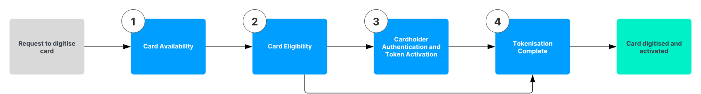

# Mastercard integration

This section gives an overview of the Vault Payments Mastercard integration.

## MDES integration

MDES(Mastercard Digital Enablement Service) is a digitisation service provided by Mastercard for generating and provisioning digital payment credentials into mobile devices. Vault Payments provides an MDES integration out of the box.

### Pre-digitisation flow

In MDES the process of provisioning a new token on a cardholder’s device is called pre-digitisation. This process includes a message exchange between Mastercard and the Issuer for each of the steps in the table below. The messages authenticate the cardholder and inform the issuer of the outcome of the tokenisation process. The following diagram illustrates the exchange:

  
| Step | Name | Description |
| --- | --- | --- |
| 
1

 | 

Card Availability

 | 

Card Availability checks that a card is available for tokenisation.

 |
| 

2

 | 

Card Eligibility

 | 

Card Eligibility provides authentication data(cardholder name, email hash) that is used by the issuer to determine whether the token digitisation should be approved, declined or if additional authentication is required.

 |
| 

3

 | 

Cardholder Authentication and Token Activation

 | 

If the decision from the previous step is to require additional authentication then this step is required. Depending on the authentication type selected Vault Payments may or may not receive a message for this step from Mastercard

 |
| 

4

 | 

Tokenisation Completion

 | 

MDES notifies the issuer that the token is active and can be used to make payments

 |

Each of those messages is sent by Mastercard to Vault Payments. The messages are processed as part of the Card Payments flow and are available in the Investigation and Repair UI. The provided Vault Payments card authorisation flow performs an email hash(Wallet Provider Account ID Hash) and cardholder name verification on the Card Availability messages. If those are invalid the flow requires additional authentication of the cardholder. On Card Eligibility messages in addition to the preceding two checks the flow also performs an address verification, phone number verification and CVC2 verification. If those are invalid the flow requires additional authentication of the cardholder. There is no processing done on Cardholder Authentication and Tokenisation Complete messages. Those are always successful.

Once pre-digitisation is complete the token becomes available for use. A `Card Token` resource is created in Vault Payments. This resource can be used to track and manage the state of provisioned tokens. Mastercard holds their own token state which is mirrored in Vault Payments. Vault Payments is notified of any changes to a token’s state via Token Event Notification messages. You may also trigger status changes to the token using the `Card Token` resource API. See this [page](/vault-payments/latest/EN/cards/concepts#card_tokens) for more information on the `Card Token` resource.

chat\_bubble

Mastercard may send authorisation messages related to a token before they have notified Vault Payments that tokenisation completed. Vault Payments accepts such payments in accordance with Mastercard’s recommendations.

### Authorisation

Authorisation messages received by Vault Payments that originate from a token are processed like any other card payment. MDES performs all the cryptographic checks instead of Vault Payments and sends the results as part of the 0100 message. Any payments that fail to pass those checks are rejected by MDES and never reach Vault Payments.