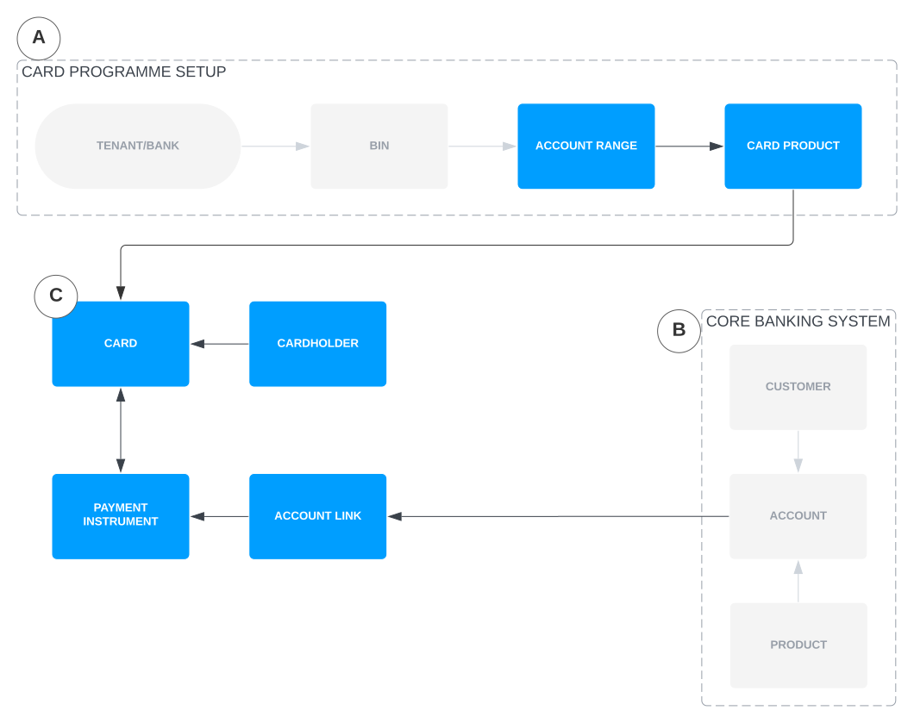

# Tutorials

The following tutorials assume that you have:

-   A valid JSON Web Token (JWT) (referred to as `AUTH_TOKEN` in the code examples).
    
-   The `curl` and `uuidgen` programs installed on your machine
    

chat\_bubble

For a list of pre-configured resources, see [Provided resources](/vault-payments/latest/EN/introduction_to_vault_payments/sandbox_quick_start#provided_resources).

The following examples have been tested in the Linux Bash shell, but are expected to work with general command line shells with a little modification.

You might find it helpful to save these environment variables in your shell session, as they are referred to later in this tutorial.

In the following tutorials, where applicable, we ask you to save and reuse variables based on API response values, to save you time from rewriting them.

## Set up and issue a card

In Production we will provide full capability to create card programmes including BINs, as shown in the following diagram (A). Vault Payments is also designed to operate with any core banking system (B). For the purpose of the Sandbox we have pre-configured and provisioned a set of resources which are described in [Provided resources](/vault-payments/latest/EN/introduction_to_vault_payments/sandbox_quick_start#provided_resources).

As the first step of the tutorial, we will guide you through how to create a `Cardholder`.

chat\_bubble

To see how the default resources have been set up, you can call the relevant List or BatchGet endpoints, such as `GET /api/v1/cards/account-ranges:batchGet`. You can test the APIs for creating new `Account Ranges`, `Card Products`, `Cardholders` and `Cards` in the Sandbox by calling the relevant Create endpoints.

### Step 1 - Create a Cardholder

A `Card` requires a `Cardholder` (C in the above diagram), so create one by calling `POST /api/v1/cards/cardholders`.

The following example request specifies a particular `Cardholder` ID so that subsequent tutorials can reference the same ID. You can also replace this with any other UUID, or omit it and the system will randomly generate one.

chat\_bubble

You can only use the ID specified if a `Cardholder` has not already been created using this ID.

chat\_bubble

You can use the `Cardholder` ID to link a `Cardholder` in Vault Payments with a customer in your CRM system. Alternatively, you can store this association in the \`Cardholder’s metadata field, as shown in the example request.

This response indicates that the `Cardholder` has been created:

### Step 2 - Create a Card for the Cardholder

Call `POST /api/v1/cards/issuance:issue` to issue a `Card` for the `Cardholder` that was created. This example request issues a `Card` on the [supplied Card Product](/vault-payments/latest/EN/introduction_to_vault_payments/sandbox_quick_start#provided_resources).

The following example request specifies the same `Card` ID used in Step 1, which can be replaced with any other UUID or omitted altogether.

chat\_bubble

You can only use the ID specified if a `Card` has not already been created using this ID.

chat\_bubble

You can issue multiple `Cards` for the same `Cardholder`.

The following response indicates that the `Card` has been issued, and is associated with the `Cardholder`:

Make a note of the `payment_instrument_id` in the response because you will need this in later tutorials.

When creating a `Card`:

-   A Payment Instrument is automatically created and associated with it (as shown in the `payment_instrument_id` field); and
    
-   Its status is governed by its ``CardProduct’s `issuing_plan.issuing_status`` field. If this status is set to `CARD_STATUS_INACTIVE`, then the `Card` will need to be [activated](/vault-payments/latest/EN/cards/tutorials#activate_a_card) separately.
    

If you wish to create a physical card, the `CardProduct` must support it and the card type on the resource creation has to be set to `CARD_TYPE_PHYSICAL`. A `CardOrder` will be automatically created for the physical card. On production, ``CardOrder`s will be batched and sent to a personalisation bureau for processing. Once the physical card is shipped from the personalisation bureau, the `CardOrder`` status will be updated to `SHIPPED`.

chat\_bubble

In the sandbox the supplied [supplied Card Product](/vault-payments/latest/EN/introduction_to_vault_payments/sandbox_quick_start#provided_resources) only supports virtual card creation.

## Link a card to an account

Prerequisites:

-   The ID of a `Payment Instrument` associated with an active `Card`
    
-   The ID of an `Account Link`
    

You should now have a `Card` associated with a `Payment Instrument`, but the `Payment Instrument` is not yet linked to any account in a core banking system; you must update it with a default `Account Link` before its `Card` can be used to make any Payments.

Update this with a call to `PUT /api/v1/payment-instruments/{payment_instrument.id}`. The following example request links the `Payment Instrument` that was created in [Set up and issue a virtual card](/vault-payments/latest/EN/cards/tutorials#set_up_and_issue_a_virtual_card) to the [Account Link we supplied](/vault-payments/latest/EN/introduction_to_vault_payments/sandbox_quick_start#provided_resources) for the GBP current account.

Replace the Payment Instrument ID with the one that was returned in the response to your card issuance request:

The following response indicates that the `Payment Instrument` now has a default `Account Link`:

## Activate a card

To activate a `Card`, you need the ID of an existing `Card` that was created with `CARD_STATUS_INACTIVE`.

Activate it with a call to `PUT /api/v1/cards/issuance/{card.id}`:

The following response indicates that the `Card` is now `ACTIVE`:

To manage the \`Card’s lifecycle further, see [Freeze and unfreeze a card](/vault-payments/latest/EN/cards/tutorials#freeze_and_unfreeze_a_card).

## Make a card payment

This tutorial requires a `Cardholder` with an active `Card` whose `Payment Instrument` has a default `Account Link`.

### Step 1 - Get Card Details in clear text

To assume the role of the ``Card’s `Cardholder``, you first need to retrieve sensitive details of the card - its Primary Account Number (PAN), Security Code and Expiry Date. In the sandbox environment, Vault Payments exposes APIs for retrieving these card details in clear text. In Production, Vault Payments will only expose APIs for retrieving card details in encrypted form.

Retrieve the details of a `Card` you created with a call to `GET /api/sandbox/cards/{card_id}:cleartextCardDetails`:

The response should look like this:

chat\_bubble

You can also retrieve these encrypted details by calling the Production PCI-DSS compliant [encrypted endpoint](/vault-payments/latest/EN/api/payments_api#CardDetail). To learn how to decrypt retrieved data, see [Encrypting sensitive data](/vault-payments/latest/EN/using_vault_payments/vault_payments_api#encrypting_sensitive_data).

Save the retrieved card details for use in later steps:

### Step 2 - Simulate an Authorisation

Using the `Card` details you retrieved, simulate an authorisation by updating the below example request with your Card’s PAN, Security Code and Expiry Date, then making a call to `POST /api/sandbox/simulate/cards/authorisation-initiations`.

The `amount` field’s format is decimals (e.g. 10.00), and in this example the `merchant_category_code` of "5812" corresponds to \`Eating Places, Restaurants' in the ISO18245 specification for Merchant Category Codes (also known as Card Acceptor Business Codes):

The returned response includes a Response Code of "00", indicating that the Authorisation was successful:

You can also view this Payment in the **Investigation** > **Search** [area of the Vault Payments app,](https://sandbox.payments.tmachine.io/investigation/search) and entering the `instruction_id` returned above into the search bar.

chat\_bubble

We recommend that you avoid simulating Authorisations with very large amounts, since this may rapidly deplete the funds in the simulated core banking account, and cause further Authorisations to be declined.

Save the life cycle trace ID to be used in the next step:

### Step 3 - Simulate a Presentment

When the Authorisation in [Step 2](/vault-payments/latest/EN/cards/tutorials#step_2__simulate_an_authorisation) is approved, its amount will be deducted from the corresponding account’s available balance in the core banking system. However, the funds will not yet have moved from this account to the internal account for settling with the scheme.

To trigger this transfer of funds, simulate a First Presentment message by making a call to `POST /api/sandbox/simulate/cards/financial-initiations`, providing the same `pan`, `expiry_date`, `amount`, `currency`, and `transaction_type` as before, as well as the same `life_cycle_trace_id` (including all trailing spaces) that was returned when simulating the Authorisation:

This returned response will include the instruction ID, indicating that the Presentment has been successfully submitted to Vault Payments for processing:

As Clearing is a background process, it may take a few seconds for Vault Payments to fully process the Presentment message. As before, you can observe its progress by visiting the **Investigation** > **Search** [area of the Vault Payments app](https://sandbox.payments.tmachine.io/investigation/search), and entering the `instruction_id` returned above into the search bar. The search results should include a corresponding **Financial Initiation** message (the ISO 20022 equivalent of the First Presentment message type).

When Vault Payments has fully processed the message, visit the Vault Core Operations Dashboard at `{vault-core-operations-dashboard-url}/customers/{Customer ID}/accounts/{Account ID}` (where\`{Customer ID}\` and `{Account ID}` correspond to the pre-provisioned Customer and GBP Account in Vault Core) to inspect the posting that was triggered by the Presentment message. This will display a transfer of GBP 11.00 from the account to the internal suspense account used for settling with the scheme.

Additionally, if you click into the internal account, you will see a related posting that transfers the Interchange Fee from that account to the profit & loss internal account. This Interchange Fee percentage is currently hardcoded in the Presentment simulator.

## Freeze and unfreeze a card

This tutorial requires a `Card` with the status set to `CARD_STATUS_ACTIVE`.

### Step 1 - Update status to SUSPENDED

To update a ``Card’s status, make a call to `PUT /api/v1/cards/issuance/{card.id}``, for example using the Card ID created from an earlier section:

The response confirms that the `Card` is now in the `SUSPENDED` status:

You can now use the Simulator to [make a card payment](/vault-payments/latest/EN/cards/tutorials#make_a_card_payment) and verify that it will be declined.

### Step 2 - Update status back to ACTIVE

You can now make another call to `PUT /api/v1/cards/issuance/{card.id}` as per step 1, but use the status of `CARD_STATUS_ACTIVE` to reactivate the `Card`. This is the response:

You can now use the Simulator to [make a card payment](/vault-payments/latest/EN/cards/tutorials#make_a_card_payment) and verify that it will be accepted.