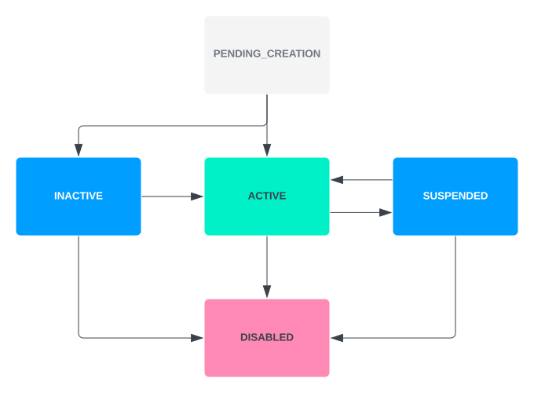
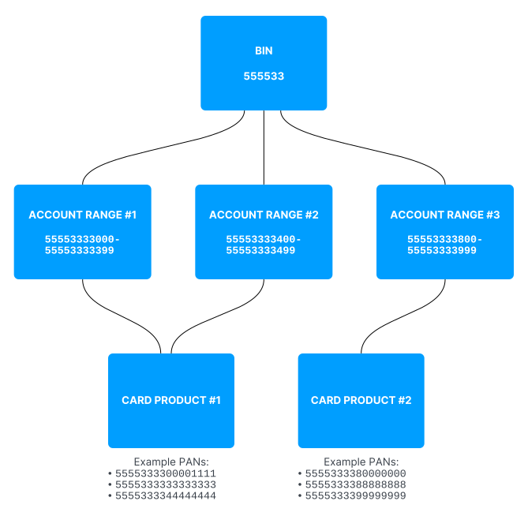
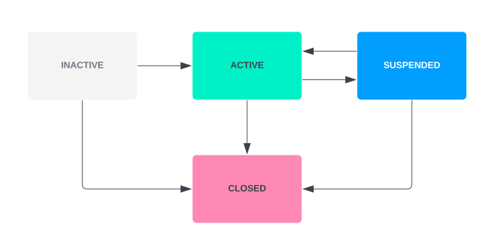
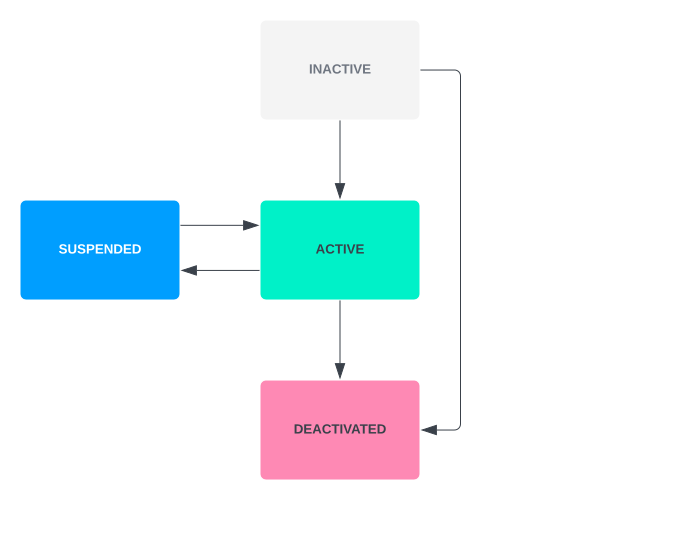
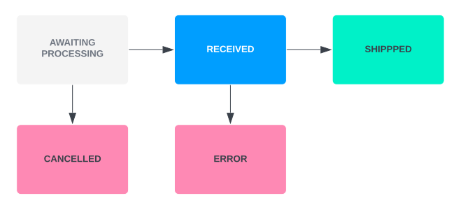
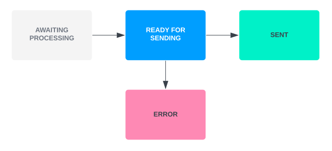

# Card Management Overview

A `Card` represents a payment card issued within the Vault Payments system, and references the following resources:

-   [Card Product](/vault-payments/latest/EN/cards/concepts/card_management_overview#card_products): A blueprint for a card programme, defining default behaviour and characteristics of cards within that programme. A CardProduct will contain at least one `Account Range` from which PANs for cards within the product will be allocated.
    
-   [Account Range](/vault-payments/latest/EN/cards/concepts/card_management_overview#account_ranges): Segments a BIN into ranges with different attributes, enabling support for multiple card programmes.
    
-   [Cardholder](/vault-payments/latest/EN/cards/concepts/card_management_overview#cardholders): Captures cardholder data for address verification and dispatching physical card orders, and can be associated with a one-to-many relationship with `Cards`.
    
-   [Payment Instrument](/vault-payments/latest/EN/using_vault_payments/routing#payment_instruments) resource. A card has a 1-1 maping with a generic `Payment Instrument`. This allows for dynamic selection of accounts and application of rules at the point of authorisation.
    

The following resources reference the `Card`:

-   A [Card Token](/vault-payments/latest/EN/cards/concepts/card_management_overview#card_tokens): Represents a digital token stored on cardholder’s mobile device. It can be used to make card transactions.
    
-   A [Card Order](/vault-payments/latest/EN/cards/concepts/card_management_overview#card_orders): Represents an order of the physical `Card` that needs to be sent to the personalisation bureau to be printed and shipped via mail to the customer.
    

Some of the fields on the `Card` resource are in the PCI-DSS scope and need to be retrieved separately as [`Card Details`](/vault-payments/latest/EN/cards/concepts/card_management_overview#card_details_encryption).

There are two `Card` types:

-   VIRTUAL - technically a PAN, security code and expiration date. Allows to use the card for e-commerce and tokenised transactions.
    
-   PHYSICAL - all of the above, plus allows to use the card for physical transactions such as magnetic stripe and PIN transactions at the POS (Point of Service) terminal.
    

The `Card Order` is created for `PHYSICAL` cards. It is not created for the `VIRTUAL` ones.

**LVT**

The abbreviation for the Low Value Transaction.

**LVT counter**

A counter which keeps track of the count of contactless transactions since the last PIN entry. For instance, if the `LVT counter limit` is 5, the `Cardholder` will be asked for PIN once they’ve made 5 contactless transactions. After a transaction with a valid PIN entry, the counter is reset to 0.

**LVT accumulator**

keeps track of the accumulative value of contactless transactions since last PIN entry. For instance, if the `LVT accumulator limit` is 150 GBP, the `Cardholder` can make one transaction for 100 GBP, and another for 60 GBP. Next time they use their card, they will be asked for PIN. After a transaction with a valid PIN entry, the accumulator is reset to 0. **ATC::** is the abbreviation for the 'Application Transaction Counter'. The counter increments when a card transaction is made. It is one of the standard security measures used to prevent attacks that pre-play the application cryptogram data.

### Card Issuance

The below diagram indicates the status pathways for a `Card`. For brevity, the prefix `CARD_STATUS_` has been omitted:

1.  When a `Card` is created it is given a temporary status of `PENDING_CREATION`.
    
2.  Depending on the `Card Product`, the `Card` will then transition to:
    
    -   `INACTIVE`: The `Card` cannot yet be used until it is set to `ACTIVE` or `DISABLED`; or
        
    -   `ACTIVE`: The `Card` is ready to be used; for example when the Cardholder has confirmed receipt of a physical card.
        
    
3.  When a `Card` is set to `ACTIVE` it can be updated to:
    
    -   `SUSPENDED`: A non-terminal status which blocks all Payments via the `Card` until a decision is made to reactivate or disable the `Card`; or
        
    -   `DISABLED`: A terminal status which permanently disables the `Card`.
        
    

chat\_bubble

If the `Cardholder` status is updated to `CLOSED`, all ``Card`s associated with the `Cardholder`` will automatically transition to `DISABLED`.

#### Issue a virtual Card

A virtual `Card` can be described as a set of `PAN`, `security code` and `expiration timestamp`. It allows use of the card for e-commerce and tokenised transactions.

chat\_bubble

Tokenised transactions can be allowed or disabled on the `Card Product` level by setting the `allow_digital_wallets` flag to `true` or `false`.

1.  Before any cards can be issued, a [`Card Product`](/vault-payments/latest/EN/api/payments_api#Card%20Products) needs to be set up.
    
2.  Each card requires a [`Cardholder`](/vault-payments/latest/EN/api/payments_api#Cardholders) with a valid address.
    
3.  To issue a virtual `Card`, set card type as `CARD_TYPE_VIRTUAL`.
    

#### Issue a physical Card

chat\_bubble

Before physical cards can be issued, an integration with a personalisation bureau responsible for manufacturing the physical cards must be set up. This includes setting up a `Card Profile` and `Card Product`, as well as card design and fulfillment options. You will need to work with Thought Machine and your personalisation bureau to decide which options will suit your program best.

A physical `Card` is represented by a Card resource of type `CARD_TYPE_PHYSICAL`. It can be used as a virtual card for ecommerce, and additionally allows using the card for physical transactions such as magnetic stripe and PIN transactions at a POS (Point of Service) terminal.

1.  Before any cards can be issued, a [`Card Product`](/vault-payments/latest/EN/api/payments_api#Card%20Products) needs to be set up.
    
2.  Each card requires a [`Cardholder`](/vault-payments/latest/EN/api/payments_api#Cardholders) with a valid address. This is the address that the card will be shipped to.
    
3.  To issue a physical `Card`, set card type as `CARD_TYPE_PHYSICAL`.
    
4.  The card order status can be tracked via the [`Card Order`](/vault-payments/latest/EN/api/payments_api#Card%20Orders) resource.
    

### Card Replacement

The card may need to be replaced for different reasons, for example:

-   The card is lost or stolen.
    
-   The card details have been compromised in fraudulent activity.
    
-   The physical card is damaged.
    
-   The card is expired or nearing expiry.
    

A specific [`Replace` endpoint](/vault-payments/latest/EN/api/payments_api#Card) is available to service these replacement journeys.

One important feature that sets this endpoint out from the standard `Issue` endpoint is the choice to keep the existing PAN/PIN on the `Card`; this is typical of the `expiry` or `damaged` user journeys, but is ultimately down to the choice of the caller integration. `PCI-DSS` scope is maintained this way as the caller needs no knowledge of the existing PAN/PIN during this process.

In addition, Vault Payments maintains a reporting channel to the `Mastercard Automatic Billing Updater` (ABU), which allows Mastercard to inform Merchants of any card detail replacements (even if a PAN has changed), so that they may maintain a recurring payment instruction, without further input from the end user.

Vault Payments also maintains a `Cards Expiry Manager` service by default (which may be toggled off per client), which orchestrates automatic renewal. The service will search through all ``Card`s whose `Card Product`` is set with the `Reissue` expiry plan, and will automatically create replacement cards with the same PAN/PIN, for existing `Cards` that are near expiry. It is also responsible for automatically disabling any `Card` that has expired.

### Suspend or disable a Card

A `Card` can be temporarily suspended/frozen. This can be achieved by making an API call to update `Card` status to `SUSPENDED`.

chat\_bubble

This does not suspend a tokenised card’s token, as the token is considered to be a separate entity.

A `Card` can be disabled. This can be achieved by making an API call to update `Card` status to `DISABLED`. This is a terminal card state and cannot be reverted.

## Card Products

Specifying a card programme is primarily achieved through creation of a `Card Product`. A `Card Product` defines the features of all `Cards` within the programme, along with the expected state progression for the `Card`, and what should happen next when the `Card` is reaching its expiration date. While some of the `Card Product` default values can be overridden when creating a `Card`, it sets out what to expect as default behaviour. For example, to define:

-   Whether only virtual, or both virtual and physical `Cards` can be created under the same programme
    
-   Whether the `Card` can be tokenised for digital wallets
    
-   Certain limits for the `Card` when used for contactless transactions or PIN attempts
    
-   The physical card’s reference to a personalisation bureau and bureau product ID (if a personalisation bureau is to be used)
    
-   The [`Card Profile`](/vault-payments/latest/EN/cards/concepts#card_profile) of a `Card`
    

When creating a `Card Product` you can associate one or more ``Account Range`s with it. The selected `Account Range``(s) must have the same `scheme_product_code` and `pan_length` as the card product.

The `Card Product` contains a default `issuing_plan` and `expiry_plan` for all `Cards`:

-   The `issuing_plan` contains the default status of the card upon creation - Active or Inactive.
    
-   The `expiry_plan` contains a default duration after which the card will expire. When a card is created, if the `expiration_timestamp` is unspecified, it will be the default duration in the future.
    

chat\_bubble

The expiry plan contains an expiry action, which can be set to `close`, `reissue`, or `transfer`. The functionality behind these values will be implemented in a future release. Similarly, the functionality behind `allow_digital_wallets`, `profile_id`, `personalisation_bureau_id` and `personalisation_bureau_product_id` will be implemented in a future release.

## Account Ranges

`Account Ranges` are used to segment a Banking Identification Number (BIN) into different tranches, so that an assigned BIN can be used for multiple `Card Products` for efficient card portfolio management. Generally BINs are six to eight digits long; however Vault Payments can support BINs of any length.

chat\_bubble

-   An `Account Range` is defined with 11-digit upper and lower limits. All `Cards` associated with that `Account Range` are created with a randomly assigned PAN number from within the account range. This is why an \`Account Range’s bounds cannot be updated.
    
-   For Sandbox we have provided pre-allocated BINs, documented in the *Vault Payments Sandbox Onboarding Handbook*. A default `Account Range` spanning a tenth of the BIN (`range_from`: BIN  
    200, `range_to`: BIN + 299) has already been provisioned.
    

When a `Card` has been created with a PAN in an `Account Range` the `count` field increases until the `Account Range` reaches the maximum capacity assigned to it when it was created. If you attempt to create a `Card` resource for a `Card Product` that has reached its `Account Range` capacity, an error will be returned and a separate `Account Range` with new capacity will need to be assigned to the product in order to begin creating `Cards` for it again.

chat\_bubble

For security purposes, the upper and lower limits of `Account Ranges` fall within PCI scope and are therefore not stored in cleartext anywhere in the system; they can only be viewed in cleartext when retrieved via the encrypted endpoints and decrypted. For the sandbox we provide cleartext endpoints in addition to the encrypted endpoints; these cleartext endpoints will not be available in production.

## Cardholders

The `Cardholder` resource represents a user that wants to access and use `Cards` issued and processed on the Vault Payments platform. One `Cardholder` can have zero to multiple `Cards`.

-   A `Cardholder` can be created in status `INACTIVE` or `ACTIVE`.
    
-   The `SUSPENDED` status is a non-terminal status meaning that the `Cardholder` has been temporarily suspended and cannot create or use their `Cards`.
    
-   The `CLOSED` status is a terminal status which permanently disables the `Cardholder` and their `Cards`.
    

error

The `Cardholder` resource does not enforce any requirements on the email, phone number or address fields; these requirements depend on the operating region(s) and should be enforced elsewhere before providing the information to Vault Payments.

## Card Tokens

A `Card Token` is a digital token stored on a cardholder’s mobile device or on a merchant’s server. Each `Card Token` represents a single card. A `Card Token` can be used to make transactions instead of the `Card`. A single `Card` can be referenced by multiple \`Card Token\`s.

A `Card Token` can only be created by the card network. The network sends a series of token digitisation messages to Vault Payments. The provided Authorisation Instruction Flow processes these messages and creates a new `Card Token` resource. If a cardholder updates a token on their device, a separate digitisation Authorisation message is sent to Vault Payments via the card network, and the token is updated automatically.

Vault Payments clients can update the `status` and `metadata` of a `Card Token` themselves. All other fields are managed by the card network and cannot be updated by clients.

The below diagram indicates the status pathways for a `Card token`. For brevity, the prefix `CARD_TOKEN_STATUS_` has been omitted:

1.  When the card network starts the pre-digitisation journey Vault Payments creates a `Card Token` in status `INACTIVE`.
    
2.  If the journey is successful then the token moves to `ACTIVE`. If the journey fails then the token moves to `DEACTIVATED`.
    
3.  When a `Card Token` is in status `ACTIVE` it can be updated to:
    
    -   `SUSPENDED`: A non-terminal status which disables the token until a decision is made to reactivate or deactivate the `Card Token`; or
        
    -   `DEACTIVATED`: A terminal status which permanently disables a `Card Token`.
        
    

chat\_bubble

Vault Payments automatically communicates any updates to the `status` value to the card network.

chat\_bubble

As part of the `ReplaceCard` API call Vault Payments automatically notifies the card network of the funding PAN change for all ``Card Token`s related to the target `Card``. This allows tokens to continue being used with the newly issued card.

error

Use of the Mastercard Token Management tool for updating a card token’s funding PAN is strongly discouraged. This leaves the `Card Token` resource in Vault Payments pointing to the old card.

## Card Orders

`Card Order` represents an order of the physical `Card`. It is created in the background as part of the card issuance flow. To order a physical `Card`, you need to issue a `Card` with type `PHYSICAL`. A `Card Order` with a shipping address copied from the `Cardholder` will be created.

`Card Order Batch` represents a batch with ``Card Order`s. When the `Card Order`` is created, it is assigned to a batch automatically (either to an already exising batch or a new one, if the existing batch has reached its capacity limits).

There are two types of batches, dependent on the purpose of `Card Orders`:

-   `NEW` - orders of new physical ``Card`s. - `REPLACEMENT`` - orders of the `Card` replacements.
    

\`Card Order Batch\`es are sent off to the personalisation bureau on a regular basis (e.g. daily at midnight).

The below diagram indicates the status pathways for a `Card Order`. For brevity, the prefix `CARD_ORDER_STATUS_` has been omitted:

1.  When the `Card Order` is created, its status is `AWAITING_PROCESSING`. It is now waiting to be sent to the personalisation bureau. It is possible to cancel the `Card Order` before the `Card Order Batch` is sent off. It can be done via status update API call.
    
2.  When we get a receipt confirmation from the personalisation bureau, the `Card Order` status is updated to `RECEIVED`.
    
3.  After receiving a dispatch confirmation from the personalisation bureau, we update the status to `SHIPPED`. The `Card Order` will be updated with order tracking details and the shipped date if provided.
    
4.  In case of any issues with the order, the personalisation bureau can respond with an error. The `Card Order` status will be updated to `ERROR`, and we will populate the error reason into the `reason` field.
    

The below diagram indicates the status pathways for a `Card Order Batch`. For brevity, the prefix `CARD_ORDER_BATCH_STATUS_` has been omitted:

1.  When the `Card Order Batch` is created, its status is `AWAITING_PROCESSING`.
    
2.  Before the batch can be sent to personalisation bureau, we update its status to `READY_FOR_SENDING`, meaning that no further \`Card Order\`s can be added to the batch.
    
3.  Once we’ve successfully sent the batch to the personalisation bureau, we update its status to `SENT`. The personalisation bureau will respond with receipt confirmation for each included `Card Order` (see `Card Order` statuses).
    
4.  In case of a non-retryable error when sending the batch, the status will be updated to `ERROR`.
    

## Card Details encryption

`PCI-DSS` (Payment Card Industry Data Security Standard) is an information security standard for organisations that handle card instruments and instructions from the major card schemes. In Vault Payments we have a separate environment where we isolate all sensitive payment card operations and data into a single, small, tightly secured location.

The `Card` resource contains PCI data. The sensitive fields are encrypted using an `HSM` (Hardware Security Module) and stored securely in a PCI-DSS compliant database.

Retrieving the following `Card` fields requires the client to be PCI-DSS compliant and can be done via API calls to the [`CardDetail endpoint`](/vault-payments/latest/EN/api/payments_api#CardDetail) and [`PIN endpoint`](/vault-payments/latest/EN/api/payments_api#PIN):

-   PAN - Security Code (CVC/CVV) - PAN Sequence Number - PIN
    

These `Card` fields are not considered to be part of PCI-DSS scope and can be retrieved via API call to the [`Card endpoint`](/vault-payments/latest/EN/api/payments_api#Card):

-   PAN last digits - Expiration date
    

We use the `Derived Key` to import and export sensitive data to and from the PCI zone via public networks. This key is derived using an incoming signed `Ephemeral Client Public Key` and our private key. The `Derived Key` is only stored for import requests as a single-use key which expires after 5 minutes.

The key derivation is happening in the background as part of each call to:

-   Retrieve `Account Ranges` - Retrieve `Card Details` - Retrieve `PIN` - Update `PIN`
    

chat\_bubble

`Derived Key` is an encrypted AES-128 key block.

## Card Profile

A `Card Profile` is a set of attributes that define the chip card behaviour. These attributes include, but are not limited to the chip version, contactless transactions support or cardholder verification methods. Each `Card Profile` needs to be officially approved by the scheme. For Mastercard, this can be done via `CPV` (Card Personalization Validation) or `CNS` (Change Notification Status) process. For Visa DPS integration, this is handled by Visa DPS.

chat\_bubble

The `CPV` is Mastercard’s official procedure aimed at guaranteeing that each chip card product provides an adequate degree of quality and security for both cardholders and acceptance points. This process ensures that the product meets the requisites and industry standards.

chat\_bubble

The `CNS` process enables issuers to provide a CPV Service Provider with a list of minor changes they intend to apply to an existing product.