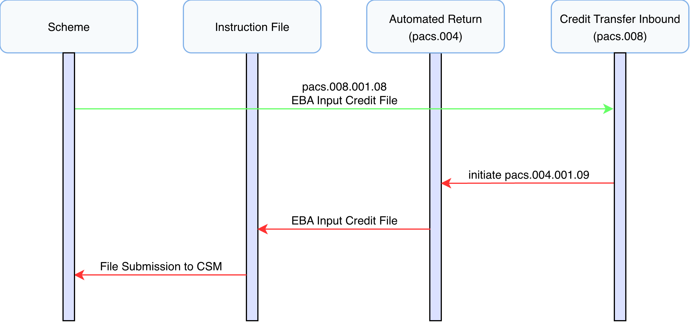
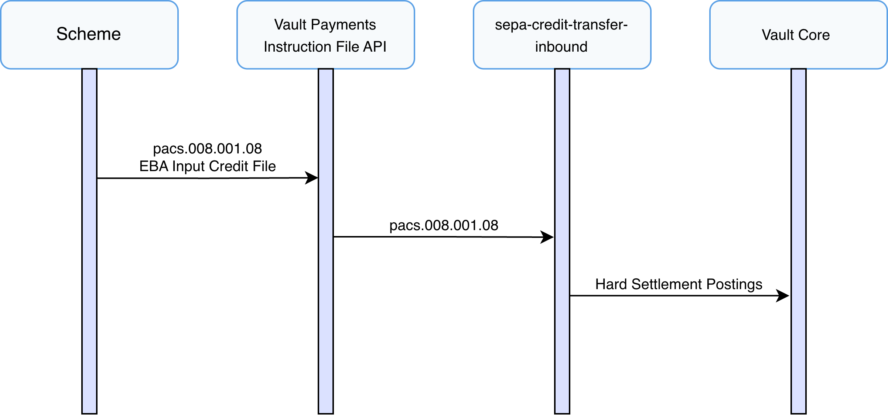
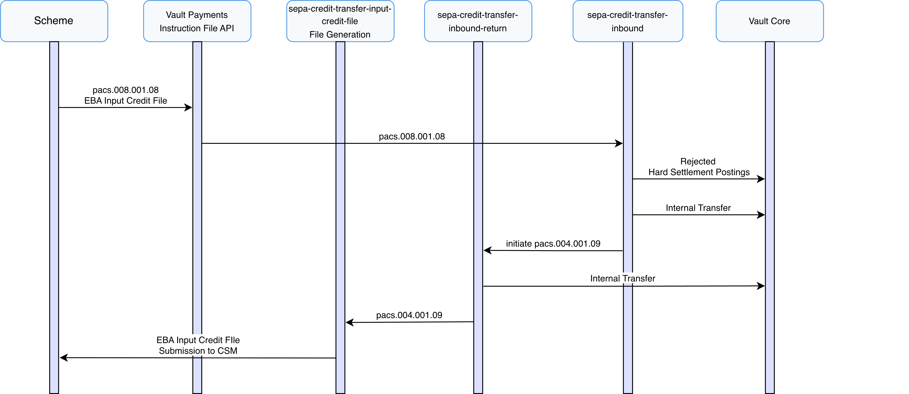

# Inbound Payment Journeys

This section describes the end-to-end inbound processing of SEPA Credit Transfers within Vault Payments.

SEPA Credit Transfers supports the creation of inbound payments via FIToFICustomerCreditTransfer (pacs.008) files or individual instructions.

The journeys described in this section cover all possible outcomes of an inbound SCT, including:

-   Successful processing of credit transfers
    
-   Automatic returns when unable to process the inbound payment
    

## Receiving Inbound Payments

This scenario describes the successful inbound processing of a SEPA Credit Transfer within Vault Payments, from receiving a FIToFICustomerCreditTransfer (pacs.008) (DS-02) to an Inbound Hard Settlement posting to the Beneficiary account on Vault Core.

chat\_bubble

Payments directly via a FIToFICustomerCreditTransfer (pacs.008) instructions or via a received InstructionFile.

**FIToFICustomerCreditTransfer (pacs.008) (DS-02 in SEPA Implementation Guide)**

1.  A FIToFICustomerCreditTransfer (pacs.008) is submitted to Vault Payments via upload of an Instruction File representing a pacs.008 ISO 20022 message. This file is split into Instructions initiating an `sepa-credit-transfer-inbound` flow for each.
    
2.  The flow validates the Instruction against ISO 20022 rules and ensures compliance with the SEPA Credit Transfer Scheme Inter-PSP Implementation Guidelines.
    
3.  Routing checks are performed, matching the creditor account via identification IBAN, ensuring a valid Payment Instrument and Account Link exists and no restrictions are in place.
    
4.  An Inbound Hard Settlement posting is issued to the connected Vault Core instance using the matched account details resulting in a credit to the creditor’s account. On successful postings the Payment status is set to `SETTLED`.
    

## Automatic Return

If funds cannot be applied to the creditor’s account for any reason, a PaymentReturn (pacs.004) must be generated and sent back to the Originator.

This scenario assumes an unsuccessful inbound payment to a creditor account that belongs to the financial institution using Vault Payments but is unable to accept funds.

**FIToFICustomerCreditTransfer (pacs.008) (DS-02 in SEPA Implementation Guide)**

1.  A FIToFICustomerCreditTransfer (pacs.008) is submitted to Vault Payments via upload of an Instruction File representing a pacs.008 ISO 20022 message. This file is split into Instructions initiating an `sepa-credit-transfer-inbound` flow for each.
    
2.  The flow validates the Instruction against ISO 20022 rules and ensures compliance with the SEPA Credit Transfer Scheme Inter-PSP Implementation Guidelines.
    
3.  Routing checks are performed, matching the creditor account via identification IBAN, ensuring a valid Payment Instrument and Account Link exists and no restrictions are in place.
    
4.  An Inbound Hard Settlement posting is issued to the connected Vault Core instance using the matched account details, however the postings are `REJECTED` due to restrictions on the account.
    
5.  Internal transfer postings are issued to the connected Vault Core internal accounts, this tracks fund movements according to scheme rules.
    
6.  A PaymentReturn (pacs.004) is initiated using the `sepa-credit-transfer-inbound-return` flow.
    

**PaymentReturn (pacs.004) (DS-03 in SEPA Implementation Guide)**

1.  The flow validates the Instruction against ISO 20022 rules and ensures compliance with the SEPA Credit Transfer Scheme Inter-PSP Implementation Guidelines.
    
2.  Internal transfer postings are issued to the connected Vault Core internal accounts, in the reverse direction to original postings, this tracks fund movements according to scheme rules. The Payment status is set to `RETURNED`.
    
3.  An EBA Input Credit File is generated and made available for submission according to the `sepa-credit-transfer-input-credit-file` InstructionFileSpecification. This file should be submitted to the selected CSM in accordance with SEPA Credit Transfer scheme rules.
    

chat\_bubble

Manual Returns must be completed through the PR-02 Credit Transfer Recall process as defined in the SEPA Credit Transfer Scheme Rule Book. More information describing manual Returns and Recalls can be found in the Inbound / Outbound Recall section.

## File Support

### Origin Received

Inbound FIToFICustomerCreditTransfer (pacs.008) instructions are processed according to the `sepa-received-scheme-files` InstructionFileSpecification.

### Origin Generated

Inbound PaymentReturn (pacs.004) instructions are generated into files according to the `sepa-credit-transfer-input-credit-file` InstructionFileSpecification which produces an EBA Input Credit File. Instructions are grouped into batches by `group_header.interbank_settlement_date`.