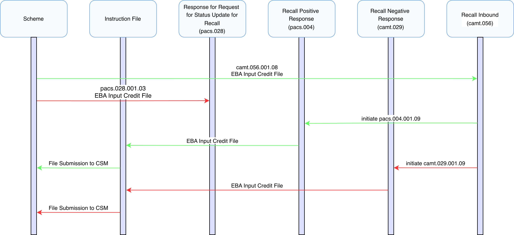
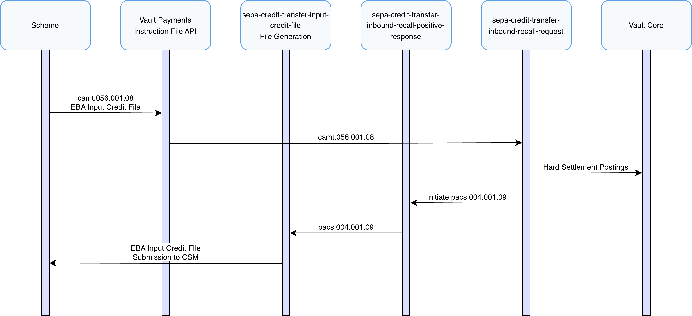
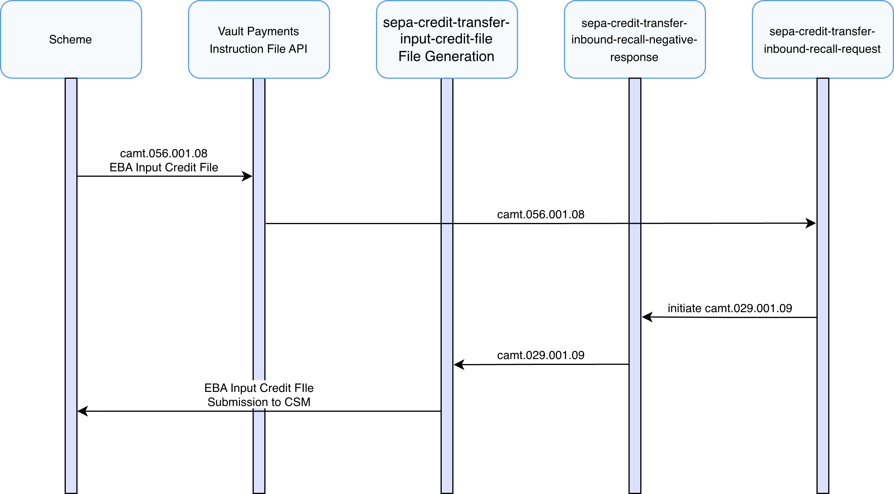
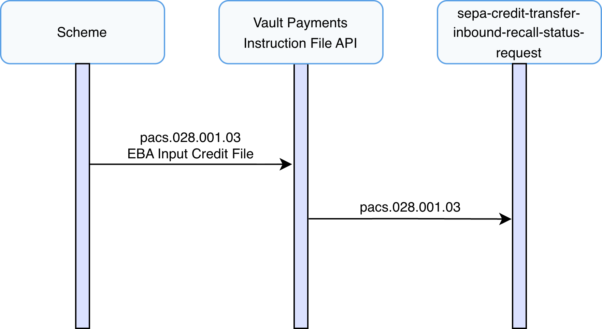

# Inbound Recall Journeys

This section describes the end-to-end inbound processing of SEPA Credit Transfers recalls within Vault Payments.

SEPA Credit Transfers supports the creation of inbound recalls via FIToFIPaymentCancellationRequest (camt.056) instructions.

This implements the PR-02 Credit Transfer Recall process as defined in the SEPA Credit Transfer Scheme Rule Book.

info

A Recall occurs when the Originator PSP requests to cancel a SEPA Credit Transfer Transaction. The Recall procedure can be initiated only by the Originator PSP which may do it on behalf of the Originator.

The journeys described in this section cover all possible outcomes of an inbound recalls in SCT, including:

-   Receipt of a Recall Request
    
-   Submission of Responses
    
-   Receipt of status update requests
    

## Inbound Recall with Positive Response

This scenario describes processing an inbound recall request within Vault Payments that results in a positive recall, from receiving a FIToFIPaymentCancellationRequest (camt.056) to Instruction File submission to the SEPA scheme via the `sepa-credit-transfer-inbound-recall-positive-response` flow.

**FIToFIPaymentCancellationRequest (camt.056) (DS-05 in SEPA Implementation Guide)**

1.  A FIToFIPaymentCancellationRequest (camt.056) is submitted to Vault Payments via upload of an Instruction File representing a camt.056 ISO 20022 message. This file is split into Instructions initiating an `sepa-credit-transfer-inbound-recall-request` flow for each.
    
2.  The flow validates the Instruction against ISO 20022 rules and ensures compliance with the SEPA Credit Transfer Scheme Inter-PSP Implementation Guidelines.
    
3.  The flow ensures the Instruction is matched to a previously processed Credit Transfer.
    
4.  Recall Acceptance is determined based on scheme rules and cut-off times provided in the `step2-business-days` calendar. If within an acceptable window processing continues, otherwise the instruction is Rejected and End Flow.
    
5.  Routing checks are performed, matching the creditor account via identification IBAN, ensuring a valid Payment Instrument and Account Link exist.
    
6.  A Manual Decision resource is created in the `QUEUED` status for operator review.
    
    -   Action: Operators can Accept or Reject the recall via the Vault Payments API or Vault Payments App. If an operator rejects the recall, a mandatory 4-letter reason code must be provided.
        
    -   Deadline: The decision must be submitted within the 15-day deadline to prevent scheme rule breaches.
        
    
7.  On acceptance a Outbound Hard settlement posting is issued to the connected Vault Core instance using the creditor account details. On successful postings the Payment status is set to `REVERSED`.
    
8.  A PaymentReturn (pacs.004) is initiated using the `sepa-credit-transfer-inbound-recall-positive-response` flow.
    

**PaymentReturn (pacs.004) (DS-06 in SEPA Implementation Guide)**

1.  The flow validates the Instruction against ISO 20022 rules and ensures compliance with the SEPA Credit Transfer Scheme Inter-PSP Implementation Guidelines.
    
2.  An EBA Input Credit File is generated and made available for submission according to the `sepa-credit-transfer-input-credit-file` InstructionFileSpecification. This file should be submitted to the selected CSM in accordance with SEPA Credit Transfer scheme rules.
    

## Inbound Recall with Negative Response

This scenario describes processing an inbound recall request within Vault Payments that results in a negative recall, from receiving a FIToFIPaymentCancellationRequest (camt.056) to Instruction File submission to the SEPA scheme via the `sepa-credit-transfer-inbound-recall-negative-response` flow.

**FIToFIPaymentCancellationRequest (camt.056) (DS-05 in SEPA Implementation Guide)**

1.  A FIToFIPaymentCancellationRequest (camt.056) is submitted to Vault Payments via upload of an Instruction File representing a camt.056 ISO 20022 message. This file is split into Instructions initiating an `sepa-credit-transfer-inbound-recall-request` flow for each.
    
2.  The flow validates the Instruction against ISO 20022 rules and ensures compliance with the SEPA Credit Transfer Scheme Inter-PSP Implementation Guidelines.
    
3.  The flow ensures the Instruction is matched to a previously processed Credit Transfer.
    
4.  Recall Acceptance is determined based on scheme rules and cut-off times provided in the `step2-business-days` calendar. If within an acceptable window processing continues, otherwise the instruction is Rejected and End Flow.
    
5.  Routing checks are performed, matching the creditor account via identification IBAN, ensuring a valid Payment Instrument and Account Link exist.
    
6.  A Manual Decision resource is created in the `QUEUED` status for operator review.
    
    -   Action: Operators can Accept or Reject the recall via the Vault Payments API or Vault Payments App. If an operator rejects the recall, a mandatory 4-letter reason code must be provided.
        
    -   Deadline: The decision must be submitted within the 15-day deadline to prevent scheme rule breaches.
        
    
7.  On rejection a ResolutionOfInvestigation (camt.029) is initiated using the `sepa-credit-transfer-inbound-recall-negative-response` flow.
    

**ResolutionOfInvestigation (camt.029) (DS-06 in SEPA Implementation Guide)**

1.  The flow validates the Instruction against ISO 20022 rules and ensures compliance with the SEPA Credit Transfer Scheme Inter-PSP Implementation Guidelines.
    
2.  An EBA Input Credit File is generated and made available for submission according to the `sepa-credit-transfer-input-credit-file` InstructionFileSpecification. This file should be submitted to the selected CSM in accordance with SEPA Credit Transfer scheme rules.
    

## Processing of a Request for Status Update

This scenario describes the receipt of a request for Status Update on a previous Recall Request.

A Status Request may be sent in the event of no response from a recall request which would only occur in exceptional cases. If receiving a request an investigation should take place to manually identify and resolve the issue.

**FIToFIPaymentStatusRequest (pacs.028) (DS-05 in SEPA Implementation Guide)**

1.  Vault Payments receives a FIToFIPaymentStatusRequest via an Instruction API request, initiating the `sepa-credit-transfer-inbound-recall-status-request` flow.
    
2.  The flow validates the Instruction against ISO 20022 rules and ensures compliance with the SEPA Credit Transfer Scheme Inter-PSP Implementation Guidelines.
    
3.  A Manual Decision resource is created in the `QUEUED` status for operator review.
    
    -   Action: Operators can mark the investigation as complete.
        
    

## Recall Deadlines

Recalls must be initiated relative to the original SCT execution date based on the reason code:

  
| Reason Code | Description | Submission Deadline |
| --- | --- | --- |
| 
`DUPL`

 | 

Duplicate Payment

 | 

10 Banking Business Days

 |
| 

`TECH`

 | 

Technical Issue

 | 

10 Banking Business Days

 |
| 

`FRAD`

 | 

Fraudulent Origin

 | 

13 Months

 |

## Rejected Recall Reasons

If an operator chooses to reject the request, they must select one of the following ISO-20022 standard reason codes:

  
| Reason Code | Display Name | Description |
| --- | --- | --- |
| 
`AC04`

 | 

Closed Account Number

 | 

The account is no longer active

 |
| 

`AM04`

 | 

Insufficient Funds

 | 

Not enough liquidity to reverse the payment

 |
| 

`ARDT`

 | 

Already Returned

 | 

The funds have already been sent back via a separate message

 |
| 

`CUST`

 | 

Customer Decision

 | 

The Beneficiary refused the debit

 |
| 

`LEGL`

 | 

Legal Decision

 | 

Legal or regulatory reasons prevent the return

 |
| 

`NOAS`

 | 

No Answer From Customer

 | 

The Beneficiary could not be reached for consent

 |
| 

`NOOR`

 | 

No Original Transaction Received

 | 

The original credit transfer cannot be located

 |

## File Support

### Origin Received

FItoFIPaymentCancellationRequest (camt.056), FIToFIPaymentStatusRequest (pacs.028) and PaymentReturn (pacs.004) instructions are processed according to the `sepa-received-scheme-files` InstructionFileSpecification.

### Origin Generated

Inbound PaymentReturn (pacs.004) instructions are generated into files according to the `sepa-credit-transfer-input-credit-file` InstructionFileSpecification which produces an EBA Input Credit File. Instructions are grouped into batches by `group_header.interbank_settlement_date + "-Recall"`.

Inbound ResolutionOfInvestigation (camt.029) instructions are generated into files according to the `sepa-credit-transfer-input-credit-file` InstructionFileSpecification which produces an EBA Input Credit File. Instructions are grouped into batches by `cancellation_details[0].transaction_information_and_status[0].original_interbank_settlement_date`.