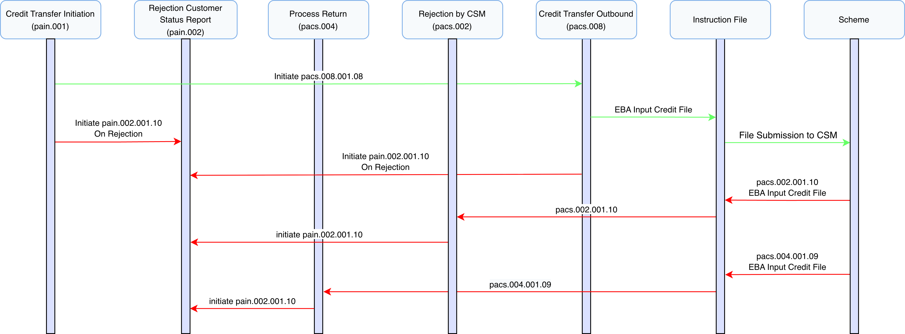
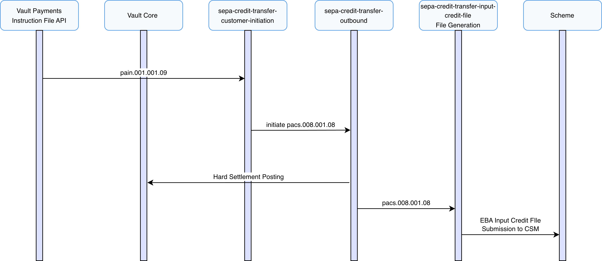
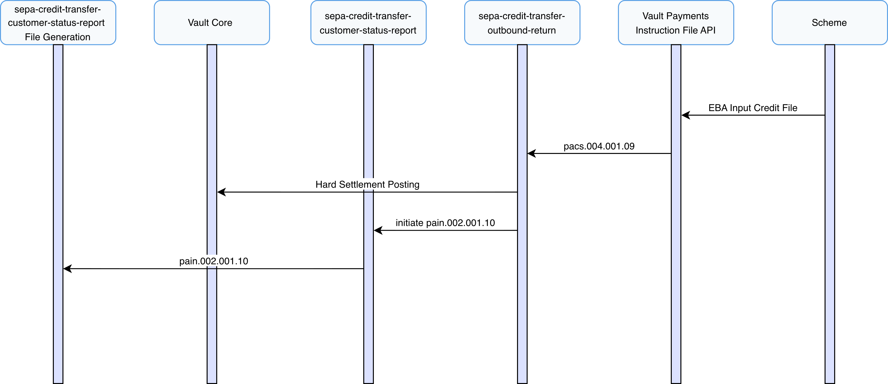
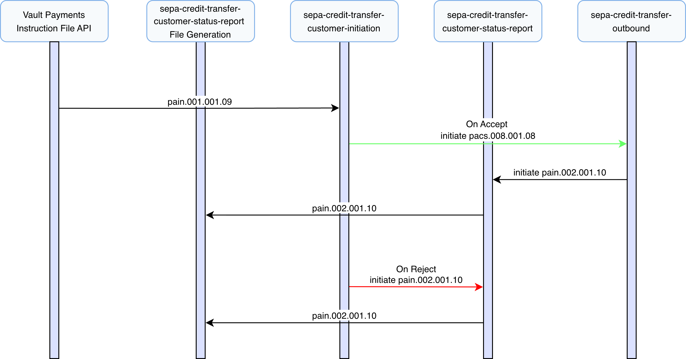

# Outbound Payment Journeys

This section describes the end-to-end outbound processing of SEPA Credit Transfers within Vault Payments.

SEPA Credit Transfers supports the creation of outbound payments via CustomerCreditTransferInitiation (pain.001) files or individual instructions. It also supports the creation of outbound payments from FIToFICustomerCreditTransfer (pacs.008) instructions directly. This results in the generation of an EBA Input Credit File for scheme submission.

The journeys described in this section cover all possible outcomes of an outbound SCT, including:

-   Successful submission to the CSM
    
-   Returns via the scheme
    
-   Rejections by Vault Payments
    

## Sending an Outbound Payment

This scenario describes the successful outbound processing of a SEPA Credit Transfer within Vault Payments, from receiving a CustomerCreditTransferInitiation (pain.001) (DS-01) to Instruction File submission to the SEPA scheme.

chat\_bubble

Payments can also be initiated via FIToFICustomerCreditTransfer (pacs.008) instructions. In this scenario all processing is the same except no corresponding CustomerPaymentStatusReport (pain.002) is created on rejections or returns.

**CustomerCreditTransferInitiation (pain.001) (DS-01 in SEPA Implementation Guide)**

1.  Vault Payments receives a CustomerCreditTransferInitiation via an Instruction API request, initiating the `sepa-credit-transfer-customer-initiation` flow.
    
2.  The flow validates the Instruction against ISO 20022 rules and ensures compliance with the SEPA Credit Transfer Scheme Customer-to-PSP Implementation Guidelines.
    
3.  Routing checks are performed, matching the debtor account via identification IBAN, ensuring a valid Payment Instrument and Account Link exist and no restrictions are in place.
    
4.  A FIToFICustomerCreditTransfer (pacs.008) is initiated using the `sepa-credit-transfer-outbound` flow.
    

**FIToFICustomerCreditTransfer (pacs.008) (DS-02 in SEPA Implementation Guide)**

1.  The flow validates the Instruction against ISO 20022 rules and ensures compliance with the SEPA Credit Transfer Scheme Inter-PSP Implementation Guidelines.
    
2.  Routing checks are performed
    
    -   If the instruction was created directly, the flow matches the debtor account via identification IBAN, ensuring a valid Payment Instrument and Account Link exist.
        
    -   If created via a Customer Initiation this check is skipped as it has already been performed.
        
    
3.  Acceptance and Execution dates are determined based on scheme rules and cut-off times provided in the `step2-business-days` calendar. If within an acceptable window (3 Business days) processing continues, otherwise the instruction is warehoused and paused until the next acceptable window.
    
4.  An Outbound Hard Settlement posting is issued to the connected Vault Core instance using the matched account details resulting in a debit to the debtor’s account. On successful postings the Payment status is set to `SETTLED`.
    
5.  An EBA Input Credit File is generated and made available for submission according to the `sepa-credit-transfer-input-credit-file` InstructionFileSpecification. This file should be submitted to the selected CSM in accordance with SEPA Credit Transfer scheme rules.
    

chat\_bubble

SEPA Credit Transfers have no positive acceptance confirmation from the scheme. Successful submission is assumed in the absence of a rejection or return from the scheme or Beneficiary PSP.

## Credit Transfer Rejected by CSM

This scenario describes a Credit Transfer that is rejected by the CSM which results in receiving a FIToFIPaymentStatusReport (pacs.002) (DS-03).

**FIToFIPaymentStatusReport (pacs.002) (DS-03 in SEPA Implementation Guide)**

1.  A FIToFIPaymentStatusReport (pacs.002) is submitted to Vault Payments via upload of an Instruction File representing a pacs.002 ISO 20022 message. This file is split into Instructions initiating an `sepa-credit-transfer-status-report` flow for each.
    
2.  The flow validates the Instruction against ISO 20022 rules and ensures compliance with the SEPA Credit Transfer Scheme Inter-PSP Implementation Guidelines.
    
3.  The flow ensures the Instruction is matched to a previously processed Credit Transfer.
    
4.  Routing checks are performed, matching the debtor account via identification IBAN, ensuring a valid Payment Instrument and Account Link exist and no restrictions are in place.
    
5.  An Inbound Hard Settlement posting is issued to the connected Vault Core instance using the matched account details resulting in a credit to the debtor’s account, returning the funds originally debited. On successful postings the Payment status is set to `REJECTED`.
    
6.  A CustomerPaymentStatusReport (pain.002) is initiated using the `sepa-credit-transfer-customer-status-report` flow.
    

chat\_bubble

Payments that were initiated without a CustomerCreditTransferInitiation (pain.001) will not generate a CustomerPaymentStatusReport (pain.002).

**CustomerPaymentStatusReport (pain.002)**

1.  The flow validates the Instruction against ISO 20022 rules and ensures compliance with the SEPA Credit Transfer Scheme Customer-to-PSP Implementation Guidelines.
    
2.  A Customer Status Report file is generated and made available according to the `sepa-credit-transfer-customer-status-report` InstructionFileSpecification. This file should be submitted back to the Originator through agreed channels.
    

## Credit Transfer Returned by Beneficiary

A 'Return' occurs when a SEPA Credit Transfer is diverted from normal execution, after an Outbound Hard Settlement by Vault Payment, and a PaymentReturn (pacs.004) is sent by the Beneficiary PSP to Vault payments.

This scenario describes the events following a Return by the Beneficiary-PSP via the Scheme, from receiving a PaymentReturn (pacs.004) (DS-03) to Instruction File submission to the Originator.

**PaymentReturn (pacs.004) (DS-03 in SEPA Implementation Guide)**

1.  A PaymentReturn (pacs.004) is submitted to Vault Payments via upload of an Instruction File representing a pacs.004 ISO 20022 message. This file is split into Instructions initiating an `sepa-credit-transfer-outbound-return` flow for each.
    
2.  The flow validates the Instruction against ISO 20022 rules and ensures compliance with the SEPA Credit Transfer Scheme Inter-PSP Implementation Guidelines.
    
3.  The flow ensures the Instruction is matched to a previously processed Credit Transfer.
    
4.  Routing checks are performed, matching the debtor account via identification IBAN, ensuring a valid Payment Instrument and Account Link exist and no restrictions are in place.
    
5.  A Period Calculation is made to determine the business day by which the return message must be received. If within an acceptable window (3 Business days) processing continues, otherwise the instruction is `Rejected`.
    
6.  An Inbound Hard Settlement posting is issued to the connected Vault Core instance using the matched account details resulting in a credit to the debtor’s account, returning the funds originally debited. On successful postings the Payment status is set to `RETURNED`.
    
7.  A CustomerPaymentStatusReport (pain.002) is initiated using the `sepa-credit-transfer-customer-status-report` flow.
    

chat\_bubble

Payments that were initiated without a CustomerCreditTransferInitiation (pain.001) will not generate a CustomerPaymentStatusReport (pain.002).

**CustomerPaymentStatusReport (pain.002)**

1.  The flow validates the Instruction against ISO 20022 rules and ensures compliance with the SEPA Credit Transfer Scheme Customer-to-PSP Implementation Guidelines.
    
2.  A Customer Status Report file is generated and made available according to the `sepa-credit-transfer-customer-status-report` InstructionFileSpecification. This file should be submitted back to the Originator through agreed channels.
    

## Credit Transfer Cancelled by Vault Payments

In the event of validation failure or rejected Postings a SEPA Credit Transfer can be cancelled by Vault Payments before submission to the scheme or creation of an Instruction File.

In these Scenario’s the Payment status is updated to `CANCELLED`.

chat\_bubble

Payments that were initiated without a CustomerCreditTransferInitiation (pain.001) will not generate a CustomerPaymentStatusReport (pain.002).

## File Support

### Origin Received

Outbound CustomerCreditTransferInitiation (pain.001) and FIToFICustomerCreditTransfer (pacs.008) instructions are processed according to the `sepa-received-ct-files` InstructionFileSpecification.

FIToFIPaymentStatusReport (pacs.002) and PaymentReturn (pacs.004) instructions are processed according to the `sepa-received-scheme-files` InstructionFileSpecification.

### Origin Generated

Outbound FIToFICustomerCreditTransfer (pacs.008) instructions are generated into files according to the `sepa-credit-transfer-input-credit-file` InstructionFileSpecification which produces an EBA Input Credit File. Instructions are grouped into batches by `group_header.interbank_settlement_date`.

CustomerPaymentStatusReport (pain.002) instructions for rejections are generated into files according to the `sepa-credit-transfer-customer-status-report` InstructionFileSpecification. Instructions are grouped into files and batches by `group_header.message_identification`.