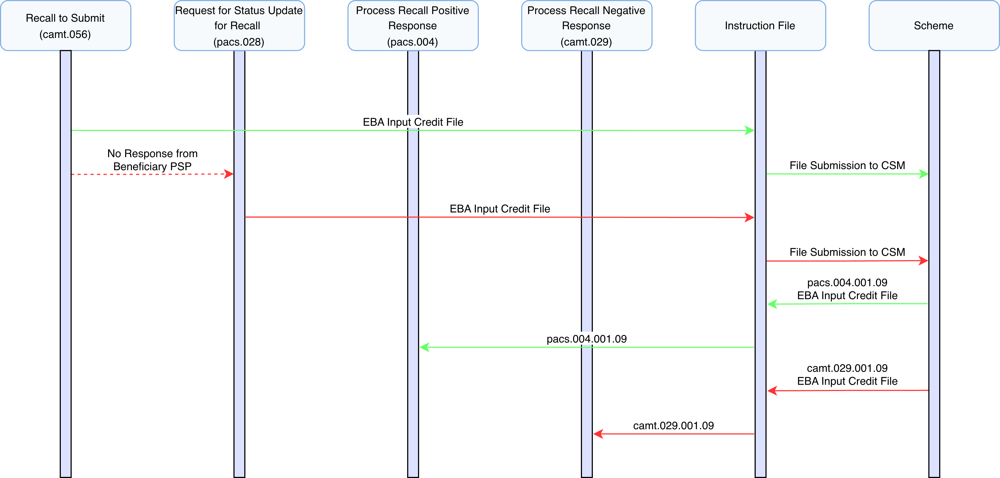
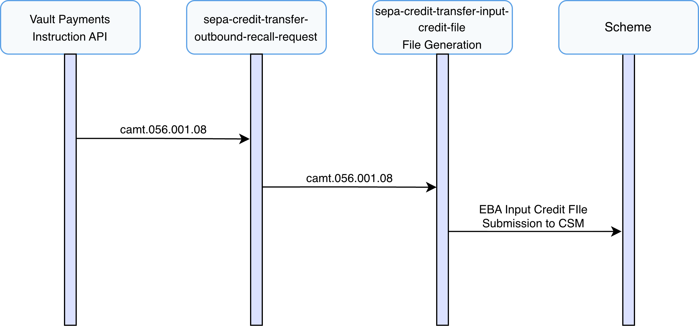
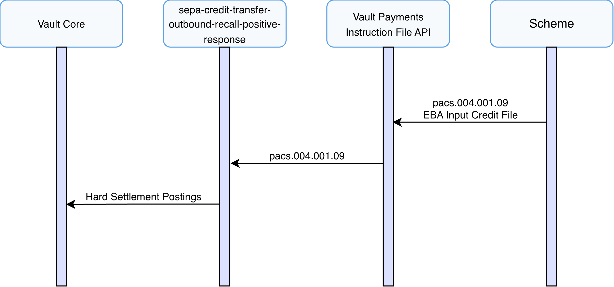
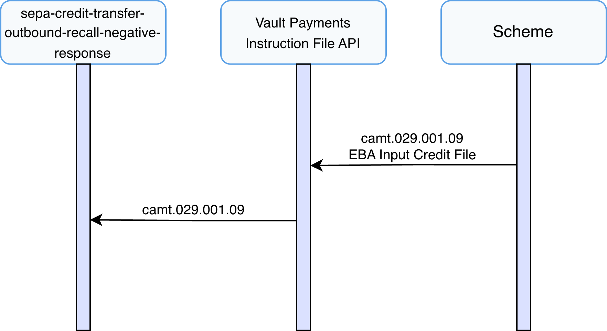
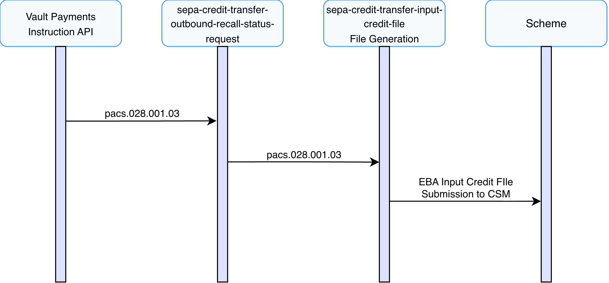

# Outbound Recall Journeys

This section describes the end-to-end outbound processing of SEPA Credit Transfers recalls within Vault Payments.

SEPA Credit Transfers supports the creation of outbound recalls via FIToFIPaymentCancellationRequest (camt.056) instructions.

This implements the PR-02 Credit Transfer Recall process as defined in the SEPA Credit Transfer Scheme Rule Book.

info

A Recall occurs when the Originator PSP requests to cancel a SEPA Credit Transfer Transaction. The Recall procedure can be initiated only by the Originator PSP which may do it on behalf of the Originator.

The journeys described in this section cover all possible outcomes of an inbound recalls in SCT, including:

-   Submission of a Recall request
    
-   Handling responses
    
-   Submitting follow up status update requests
    

## Sending an Outbound Recall

This scenario describes the submission of an outbound Recall Request of a SEPA Credit Transfer within Vault Payments, from receiving a FItoFIPaymentCancellationRequest (camt.056) (DS-05) to Instruction File submission to the SEPA scheme.

**FIToFIPaymentCancellationRequest (pain.056) (DS-05 in SEPA Implementation Guide)**

1.  Vault Payments receives a FItoFIPaymentCancellationRequest via an Instruction API request, initiating the `sepa-credit-transfer-outbound-recall-request` flow.
    
2.  The flow validates the Instruction against ISO 20022 rules and ensures compliance with the SEPA Credit Transfer Scheme Inter-PSP Implementation Guidelines.
    
3.  The flow ensures the Instruction is matched to a previously processed Credit Transfer.
    
4.  Recall Acceptance is determined based on scheme rules and cut-off times provided in the `step2-business-days` calendar. If within an acceptable window processing continues, otherwise the instruction is Rejected.
    
    chat\_bubble
    
    FIToFIPaymentCancellationRequest messages that have `cancellation_reason_code` of `DUPL` or `TECH` must be sent out within a period of 10 Banking Business Days, or 13 months if the `cancellation_reason_code` is `FRAD`, following the execution date of the initial SEPA Credit Transfer Transaction.
    
5.  An EBA Input Credit File is generated and made available for submission according to the `sepa-credit-transfer-input-credit-file` InstructionFileSpecification. This file should be submitted to the selected CSM in accordance with SEPA Credit Transfer scheme rules. On submission, the Payment status is set to `RECALL REQUESTED`.
    

## Processing of a Recall Response

There are two types of responses to a Recall Request. A Positive Response and a Negative Response:

-   A **Positive Response** is a successful recall resulting in the Originator’s account being credited with the amount specified on the positive response to the recall.
    
-   A **Negative Response** is an unsuccessful recall signifying to Vault Payments that the request has been rejected.
    

This section describes how Vault Payments process both positive and negative responses.

### Positive Response

This scenario describes the process of a Positive Recall Response from receiving a PaymentReturn (pacs.004) (DS-05).

**PaymentReturn (pacs.004) (DS-05 in SEPA Implementation Guide)**

1.  A PaymentReturn (pacs.004) is submitted to Vault Payments via upload of an Instruction File representing a pacs.004 ISO 20022 message. This file is split into Instructions initiating a `sepa-credit-transfer-outbound-recall-positive-response` flow for each. Instructions can also be initiated individually via API request.
    
2.  The flow validates the Instruction against ISO 20022 rules and ensures compliance with the SEPA Credit Transfer Scheme Inter-PSP Implementation Guidelines.
    
3.  The flow ensures the Instruction is matched to a previously processed Credit Transfer and Recall Request.
    
4.  Routing checks are performed, matching the debtor account via identification IBAN, ensuring a valid Payment Instrument and Account Link exist and no restrictions are in place.
    
5.  An Inbound Hard settlement posting is issued to the connected Vault Core instance using the creditor account details, returning the funds originally debited. On successful postings the Payment status is set to `REVERSED`.
    

### Negative Response

This scenario describes the process of a Negative Recall Response from receiving a ResolutionOfInvestigation (camt.029) (DS-05).

**ResolutionOfInvestigation (camt.029) (DS-05 in SEPA Implementation Guide)**

1.  A ResolutionOfInvestigation (camt.029) is submitted to Vault Payments via upload of an Instruction File representing a camt.029 ISO 20022 message. This file is split into Instructions initiating a `sepa-credit-transfer-outbound-recall-negative-response` flow for each. Instructions can also be initiated individually via API request.
    
2.  The flow validates the Instruction against ISO 20022 rules and ensures compliance with the SEPA Credit Transfer Scheme Inter-PSP Implementation Guidelines.
    
3.  The flow ensures the Instruction is matched to a previously processed Credit Transfer and Recall Request.
    
4.  Reverts the Payment status to original `SETTLED` to reflect failed recall.
    

## Sending a Request for Status Update

This scenario describes the process for requesting a Status Update on a previous Recall Request, from receiving a FIToFIPaymentStatusRequest (pacs.028) (DS-029) to Instruction File submission to the SEPA scheme.

info

In the exceptional case of no response from the Beneficiary PSP, at the end of the 15 Banking Business Days period following the receipt of the Recall from the Originator PSP, a Request for Status Update may be sent to the Beneficiary PSP.

**FIToFIPaymentStatusRequest (pacs.028) (DS-05 in SEPA Implementation Guide)**

1.  Vault Payments receives a FIToFIPaymentStatusRequest via an Instruction API request, initiating the `sepa-credit-transfer-outbound-recall-status-request` flow.
    
2.  The flow validates the Instruction against ISO 20022 rules and ensures compliance with the SEPA Credit Transfer Scheme Inter-PSP Implementation Guidelines.
    
3.  An EBA Input Credit File is generated and made available for submission according to the `sepa-credit-transfer-input-credit-file` InstructionFileSpecification. This file should be submitted to the selected CSM in accordance with SEPA Credit Transfer scheme rules.
    

## File Support

### Origin Generated

Outbound FItoFIPaymentCancellationRequest (camt.056) instructions are generated into files according to the `sepa-credit-transfer-input-credit-file` InstructionFileSpecification which produces an EBA Input Credit File. Instructions are grouped into batches by `underlying[0].transaction_information[0].original_interbank_settlement_date`.

Outbound FIToFIPaymentStatusRequest (pacs.028) instructions are generated into files according to the `sepa-credit-transfer-input-credit-file` InstructionFileSpecification which produces an EBA Input Credit File. Instructions are grouped into batches by `transaction_information[0].original_transaction_reference.interbank_settlement_date`.