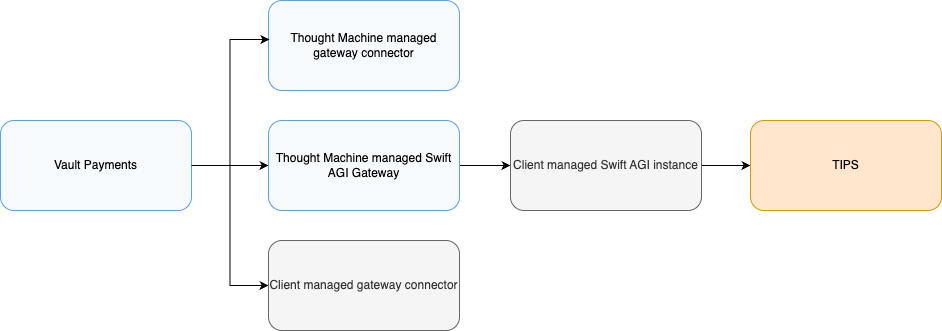
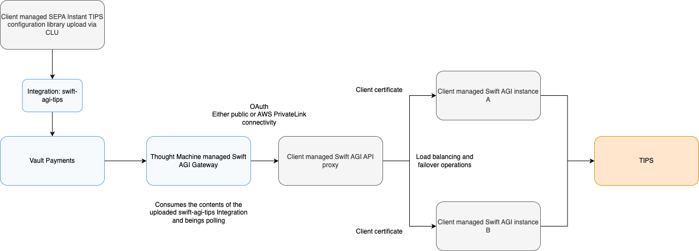

# Connecting to TIPS via the Swift AGI Gateway

## Overview

The Swift AGI gateway is a component built and maintained by Thought Machine that enables Vault Payments to connect to a Swift Alliance Gateway Instant (AGI) instance deployed by a financial institution. Swift AGI enables institutions to access SwiftNet Instant and the payment systems it supports, such as SEPA Instant TIPS.

Vault Payments is a product composed of multiple components, APIs, and pieces of configuration such as flows. One of its core capabilities is processing ISO 20022 Instructions via the universal payment engine. These Instructions are processed according to the logic defined by an Instruction Flow configuration, enabling Vault Payments to execute payments in a flexible, scheme-agnostic way.

However, this ISO 20022 instruction processing capability cannot operate in isolation. A component must bridge Vault Payments and the external payment system - handling the sending and receiving of Instructions in the correct format and through the appropriate channel.

While an increasing number of payment systems globally adopt ISO 20022, many do not. As such, Vault Payments uses a **gateway connector** model to abstract integration concerns. A gateway connector is a component that:

-   Receives instructions from Vault Payments and submits them to the external scheme
    
-   Accepts incoming instructions from external systems and initiates them in Vault Payments
    
-   Handles scheme-specific formatting, protocol handling, and connectivity
    

Gateway connectors may be:

-   Built and managed by Thought Machine
    
-   Built and managed by clients or partners, deployed externally to Vault Payments and reachable over a secure interface
    

The Swift AGI gateway is a gateway connector that is:

-   Built and managed by Thought Machine
    
-   Designed to support institutions processing SEPA Instant TIPS payments
    
-   Deployed alongside Vault Payments and pre-integrated with the Swift AGI REST Connector interface
    

This section provides an overview of how the Swift AGI gateway operates and its role in ensuring reliable delivery of ISO 20022 messages between Vault Payments and the TIPS system via SwiftNet Instant.

## Configuring the Swift AGI Integration

This section describes how to configure Vault Payments to connect to TIPS via the Swift AGI gateway. Institutions have multiple environment options depending on the stage of deployment:

### Environments

When integrating Vault Payments with TIPS via the Swift AGI gateway, institutions may choose one of the following options:

-   Use the Thought Machine Swift AGI Simulator for non-production environments
    
-   Connect to a TIPS test environment
    
-   Connect to the TIPS production environment
    

To use the Swift AGI Simulator, set the following environment variable in your non-production configuration:

`SWIFT_AGI_HOST=http://swift-agi-simulator:8080`

The integration should be also be updated to use `internal_connectivity: true` instead of `public_internet_connectivity` when using the simulator.

Additional API reference documentation on the Swift AGI Simulator [here](/vault-payments/latest/EN/api/payments_api#simulator_swift_agi).

### Connectivity and Deployment Model

The financial institution is responsible for deploying and configuring a Swift Alliance Gateway Instant (AGI) instance such that the AGI REST connector interface is exposed to Vault Payments. This can be achieved using either:

-   Public internet connectivity
    
-   AWS PrivateLink connectivity (recommended for production)
    

Vault Payments does **not** support direct configuration of TLS certificates when submitting requests to the AGI REST connector. Therefore, it is recommended that institutions deploy an API proxy layer in front of AGI, secured using OAuth 2.0.

This proxy should:

-   Authenticate incoming requests from Vault Payments using OAuth
    
-   Forward them to the AGI REST connector
    
-   Attach client TLS certificates as required by the Swift AGI configuration (`agi-config.xml`)
    
-   Expose a single endpoint for Vault Payments (regardless of number of AGI instances)
    
-   Provide load balancing and failover between AGI instances
    

### Creating the Integration Resources

The Swift AGI integration is defined using Integration and Integration Version resources within Vault Payments. These are provided as part of the SEPA Instant TIPS Configuration Pack. Additional documentation on the concept of Integrations in Vault Payments is available [here](/vault-payments/latest/EN/using_vault_payments/integrations).

The following values must be supplied by the institution setting up the integration:

 
| Variable | Description |
| --- | --- |
| 
`SWIFT_AGI_OAUTH_ISSUER`

 | 

The URL of your OAuth 2.0 identity provider.

 |
| 

`SWIFT_AGI_OAUTH_CLIENT_ID`

 | 

The client ID to be used for authenticating Vault Payments requests to the proxy.

 |
| 

`SWIFT_AGI_OAUTH_CLIENT_SECRET`

 | 

The client secret paired with the provided client ID.

 |
| 

`SWIFT_AGI_DN`

 | 

The Distinguished Name (DN) of your Swift AGI instance.

 |
| 

`SWIFT_AGI_HOST`

 | 

The URL of your Swift AGI proxy (used by Vault Payments to receive and send messages).

 |
| 

`SWIFT_AGI_REFRESH_AFTER`

 | 

The desired refresh interval for Vault Payments to obtain a token on.

 |

chat\_bubble

The value of `SWIFT_AGI_REFRESH_AFTER` in the OAuth configuration should be lower than the lifetime of the access token issued by your identity provider, with some buffer.

#### Integration

The value of id swift-agi-tips is referenced across multiple Instruction Flows and should not be changed unless done so in coordination with those flows.

#### Integration Version

These values should be configured for each Vault Payments environment you wish to connect to your deployed AGI instance. Environment-specific differences (e.g. endpoints, credentials) should be reflected accordingly.

Once the values are supplied, the Integration and Integration Version resources can be created by templating the Configuration Library YAML files and applying them using the CLU CLI. For guidance on this, see [Import via CLU](/vault-payments/latest/EN/configuration_library/europe/sepa_instant_tips#import_via_clu).

You can find out more information on the concept of Integrations in Vault Payments [here](/vault-payments/latest/EN/using_vault_payments/integrations).

### Gateway Activation

Once the configuration is applied:

-   The Swift AGI gateway will detect and consume the new or updated Integration resource.
    
-   It will attempt to obtain an authentication token from the issuer specified in the Integration Version resource.
    
-   The gateway will begin polling the configured Swift AGI proxy endpoint to receive incoming messages and to process outbound send requests.
    
-   Changes are applied asynchronously but typically take effect almost immediately.
    

chat\_bubble

Configuration of the Integration resource is the responsibility of the client. If any support is needed, please contact Thought Machine.

### Diagram

This diagram illustrates how Vault Payments connects to Swift AGI via an institution-owned proxy, with OAuth authentication and TLS offloading handled externally.

## From Swift AGI to Vault Payments

This section documents how the Thought Machine Swift AGI gateway transforms incoming messages from TIPS into Vault Payments Instructions, assigns the correct fields and Instruction Flow, and guarantees idempotency for each request.

### ReceiveIndication-to-Instruction mapping

Upon receiving a ReceiveIndication message from a Swift AGI instance, the Swift AGI gateway constructs an Initiate Instruction request to Vault Payments. This involves transforming the incoming ISO 20022 XML payload and populating the required Instruction fields.

The table below describes how fields in the Initiate Instruction request are derived from the ReceiveIndication message:

  
| Vault Payments Field | ReceiveIndication Field | Description |
| --- | --- | --- |
| 
create\_request\_id

 | 

messageId

 | 

Deterministically derived from the message\_id using UUIDv5 to ensure consistency and deduplication.

 |
| 

direction

 | 

Derived internally

 | 

See [Instruction Direction Assignment](#_instruction_direction_assignment).

 |
| 

instruction\_flow\_id

 | 

Derived internally

 | 

See [Message-to-Flow Mapping](#_message_to_flow_mapping).

 |
| 

scheme

 | 

N/A

 | 

Always set to SEPA INSTANT.

 |
| 

payment\_system

 | 

N/A

 | 

Always set to TIPS.

 |
| 

correlation\_id

 | 

Derived internally

 | 

Managed by the Swift AGI gateway and used to associate related messages (e.g. pacs.008 and pacs.002).

 |
| 

payment\_id

 | 

Derived internally

 | 

Same logic as correlation ID.

 |
| 

payload

 | 

payload

 | 

Raw ISO 20022 XML from Swift AGI. For example, a pacs.008.001.08 will populate fi\_to\_fi\_customer\_credit\_transfer.

 |
| 

context\["messageReference"\]

 | 

messageReference

 | 

Unique reference passed from Swift AGI.

 |
| 

context\["sendTimestamp"\]

 | 

sendTimestamp

 | 

Timestamp when Swift AGI sent the message.

 |
| 

context\["receiveTimestamp"\]

 | 

receiveTimestamp

 | 

Timestamp when the message was received by the Swift AGI gateway.

 |
| 

context\["\_\_payment\_system"\]

 | 

N/A

 | 

Always set to TIPS.

 |
| 

context\["\_\_payment\_scheme"\]

 | 

N/A

 | 

Always set to SEPA INSTANT.

 |
| 

context\["\_\_payment\_type"\]

 | 

N/A

 | 

Always set to PAYMENT\_TYPE\_CREDIT\_TRANSFER.

 |

### Instruction Direction Assignment

The Swift AGI gateway assigns a `direction` to each Instruction using the following rules:

-   For all ReceiveIndication messages carrying a pacs.008 payload, the direction is always `INBOUND`.
    
-   For other message types (e.g. pacs.002, pacs.004, camt.029), the gateway performs a lookup in its internal correlation table using the message ID.
    
-   If a match is found, the previously recorded direction is used.
    
-   If no match is found, the default direction is set to `INBOUND`.
    

This mechanism guarantees directional consistency across related messages, ensuring that Vault Payments treats all Instructions within a Payment according to a coherent direction context as determined by the initiating message.

### Idempotency Strategy

Vault Payments requires idempotent Initiate Instruction requests to avoid duplication of Instructions. To achieve this, the Swift AGI gateway uses the `message_id` field from the ReceiveIndication request to generate a deterministic `create_request_id` via UUIDv5.

### Message-to-Instruction-Flow Mapping

The Swift AGI gateway uses the message content (type and the type of a referenced preceding message) to assign the appropriate Instruction Flow in Vault Payments. The table below outlines the default mapping.

If you would like to override any mappings, please contact Thought Machine support.

   
| Payment Direction | ISO 20022 Message Type | Original Message Type | Instruction Flow ID |
| --- | --- | --- | --- |
| 
Inbound

 | 

pacs.008.001.08

 | 

N/A

 | 

sepa-instant-tips-inbound

 |
| 

Inbound

 | 

pacs.002.001.10

 | 

pacs.008.001.08

 | 

sepa-instant-tips-inbound-status-report-confirmation

 |
| 

Inbound

 | 

pacs.002.001.10

 | 

pacs.002.001.10

 | 

sepa-instant-tips-inbound-status-report-confirmation

 |
| 

Inbound

 | 

pacs.002.001.10

 | 

pacs.004.001.09

 | 

sepa-instant-tips-inbound-payment-return-status-report-confirmation

 |
| 

Inbound

 | 

pacs.002.001.10

 | 

camt.029.001.09

 | 

sepa-instant-tips-inbound-resolution-of-investigation-status-report-confirmation

 |
| 

Inbound

 | 

camt.056.001.08

 | 

N/A

 | 

sepa-instant-tips-inbound-payment-cancellation-request

 |
| 

Inbound

 | 

camt.054.001.06

 | 

N/A

 | 

sepa-instant-tips-inbound-bank-customer-debit-credit-notification

 |
| 

Inbound

 | 

admi.007.001.01

 | 

N/A

 | 

sepa-instant-tips-inbound-receipt-acknowledgement

 |
| 

Outbound

 | 

pacs.002.001.10

 | 

N/A

 | 

sepa-instant-tips-outbound-status-report

 |
| 

Outbound

 | 

pacs.004.001.09

 | 

N/A

 | 

sepa-instant-tips-outbound-payment-return

 |
| 

Outbound

 | 

camt.029.001.09

 | 

N/A

 | 

sepa-instant-tips-outbound-resolution-of-investigation

 |
| 

Outbound

 | 

admi.007.001.01

 | 

N/A

 | 

sepa-instant-tips-outbound-receipt-acknowledgement

 |

chat\_bubble

If `N/A` is specified in the **Original Message Type** column, the flow ID is determined purely based on the ISO 20022 message type.

## From Vault Payments to Swift AGI

This section describes how the Thought Machine Swift AGI gateway transforms Instructions received from Vault Payments into SendRequest messages, submits them to the Swift AGI REST connector interface, and handles error scenarios.

### Instruction-to-SendRequest Mapping

When a SchemeSubmissionStep is executed in Vault Payments with a Swift AGI Integration specified, the Swift AGI gateway constructs a SendRequest message using the contents of the Instruction and submits it via a `POST` request to the `/messaging/v1/instant-message` endpoint of the Swift AGI REST connector.

The table below outlines how each field in the SendRequest is derived:

  
| SendRequest Field | Source in Vault Payments | Description |
| --- | --- | --- |
| 
messageId

 | 

ISO 20022 message identifier

 | 

Derived from the MsgId element within the ISO 20022 payload. The exact value depends on the message type (e.g. pacs.008, pacs.004).

 |
| 

version

 | 

Static

 | 

Always set to 1 in accordance with the Swift AGI REST connector specification.

 |
| 

service

 | 

Deployment environment

 | 

Set to tips.msg.ins in production environments and tips.msg.ins!pt in pre-production environments.

 |
| 

sender

 | 

distinguished\_name from IntegrationVersion

 | 

Populated using the distinguished\_name field defined in the Swift AGI Integration Version.

 |
| 

receiver

 | 

Static

 | 

Always set to cn=tips,o=trgtxetp,o=swift.

 |
| 

messageType

 | 

Instruction payload type

 | 

Derived from the ISO 20022 message type of the Instruction (e.g. pacs.008.001.08) with .EPC appended.

 |
| 

messageReference

 | 

Matches message\_id

 | 

Replicates the value used for message\_id.

 |
| 

technicalAckRequired

 | 

Static

 | 

Always set to On-Error, requesting a technical acknowledgment only in the case of errors.

 |
| 

payload

 | 

Instruction payload

 | 

ISO 20022 XML payload from the Instruction, serialised to a single-line string.

 |
| 

HTTP Header: 'X-Request-ID'

 | 

Generated by Vault Payments

 | 

A UUID generated at submission time for traceability.

 |
| 

HTTP Header: 'Content-Type'

 | 

Static

 | 

Always set to application/json.

 |
| 

HTTP Header: 'Authorization'

 | 

OAuth token from IntegrationVersion

 | 

The bearer token is retrieved using the OAuth credentials defined in the Swift AGI Integration Version.

 |

### Resiliency and Error Handling

The Swift AGI gateway automatically retries requests that fail due to transient errors, as defined by the Swift AGI REST connector interface.

If a request fails due to a non-retryable error (e.g. unauthorised response, invalid payload), the error is returned to Vault Payments. If an `on_error_func` is defined on the `SchemeSubmissionStep`, it will be executed.

If the request is successfully submitted, the `resolve_func` is triggered and flow execution proceeds as normal.

The Swift AGI gateway implements an **at-most-once** delivery mechanism. This ensures that, under normal operation, an identical `SendRequest` will not be submitted to the Swift AGI more than once-provided that no non-transient error was encountered.

info

In extremely rare edge cases, it is possible that a request may be transmitted to the Swift AGI REST connector but a negative or error response is returned (e.g. due to an unexpected timeout). In such cases, the Instruction may appear to have failed in Vault Payments, while the underlying payment is later confirmed via a pacs.002 confirmation status report. Clients should be aware of this possibility when building exception handling processes.

Vault Payments records the full outcome of each submission attempt. In the event of a failure, clients should inspect the `history` field of the `Instruction` for diagnostic details.