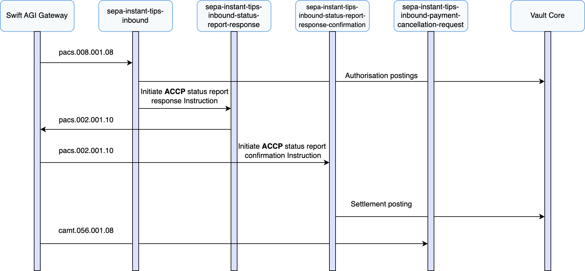
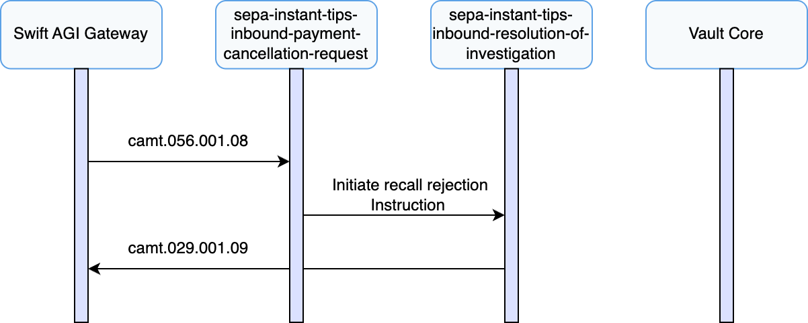
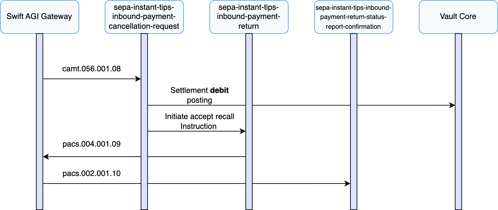

# Inbound Payment Recall Journeys

## Inbound Recall Handling

This section covers the full lifecycle of processing inbound recalls (camt.056) for SEPA Instant TIPS payments that Vault Payments has previously received and settled. In these scenarios, Vault Payments acts as the creditor PSP and receives a FIToFIPaymentCancellationRequest (camt.056) from the originator PSP, requesting reversal of the funds previously credited.

Inbound recalls may be issued for reasons such as suspected fraud, duplication, or customer error. Vault Payments supports the full scheme-compliant handling of such messages, including validation, operator review, generation of ResolutionOfInvestigation (camt.029) messages, and execution of PaymentReturn (pacs.004) when a recall is accepted.

The following sections detail inbound recall receipt, decision handling (accept or reject), and the resulting credit return or rejection flows.

## Receiving an Inbound Recall Request

This section describes how Vault Payments handles the receipt of a FIToFIPaymentCancellationRequest (camt.056) for a previously settled inbound SEPA Instant TIPS payment.

Upon receipt of the camt.056 message via the Swift AGI gateway, Vault Payments initiates the `sepa-instant-tips-inbound-payment-cancellation-request` flow.

1.  The flow validates that the camt.056 message is structurally valid and conforms to the SEPA Instant TIPS specification using the TIPS validation library in the Flows SDK.
    
2.  It checks whether the original inbound payment exists, has previously been marked as `SETTLED`, and is eligible for recall.
    
3.  The flow validates that the cancellation reason code is permitted, and, where required, that the recall window has not expired.
    
4.  If the specified reason is TECH or DUPL, the flow checks whether the request falls within 10 banking business days, using the calendar identified by the `sepa-instant-business-banking-calendar-id` Parameter. If the reason is any other reason, such as FRAD, the flow checks that the request falls within 13 months.
    
5.  Validates that the original creditor account has a valid status and is eligible to be debited as part of a potential return.
    
6.  Raises a [Manual Decision](/vault-payments/latest/EN/using_vault_payments/manual_decisions) for an operator to review and determine the response to the recall request. This manual decision is configured to expire 15 banking business days after receipt of the camt.056. If no decision is made within this window, a ResolutionOfInvestigation (camt.029) is automatically generated and submitted to TIPS via the Swift AGI gateway.
    
7.  Vault Payments sets the status of the Payment to `RECALL_REQUESTED`.
    

At this stage, the decision on whether to accept or reject the inbound recall is deferred to operational users, either via the Vault Payments App or the API.

Note that this flow is also configured to automatically initiate a rejection ResolutionOfInvestigation (camt.029) in cases where key validation checks fail - for example, if the original creditor account is no longer valid. This helps ensure that a timely and compliant response is always issued for the incoming recall request. The flow can be adapted to meet the specific SEPA Instant TIPS recall processing requirements of a financial institution.

## Rejecting an Inbound Recall

This section describes the process Vault Payments follows when a recall request for a previously settled inbound SEPA Instant TIPS payment is **rejected**.

Rejection may be appropriate for several reasons, such as the funds having already been withdrawn, the creditor disputing the justification for the recall, or the request being received after the permitted recall window has lapsed.

In this scenario, an operator rejects the recall (via the Vault Payments App or API) by resolving the previously raised Manual Decision. This triggers the initiation of a ResolutionOfInvestigation (camt.029) Instruction via the `sepa-instant-tips-inbound-resolution-of-investigation` flow.

1.  The "Reject recall" option is selected in the previously raised Manual Decision by an operator.
    
2.  The `sepa-instant-tips-inbound-payment-cancellation-request` flow initiates a ResolutionOfInvestigation (camt.029) Instruction via the `sepa-instant-tips-inbound-resolution-of-investigation` flow, including the operator-specified reason code.
    
3.  The ResolutionOfInvestigation (camt.029) Instruction is submitted to the originator PSP via TIPS and the Swift AGI gateway.
    
4.  The Payment status is updated from `RECALL_REQUESTED` back to `SETTLED`.
    

As no PaymentReturn (pacs.004) is issued, the funds remain with the creditor. Vault Payments retains a full history of the recall request, the rejection response, and all related status information. This information is available via the Vault Payments UI, API, and Streaming API to support reconciliation, compliance, and any further manual investigation.

## Accepting an Inbound Recall

This section describes the process Vault Payments follows when a recall request for a previously settled inbound SEPA Instant TIPS payment is **accepted**.

Once an operator accepts the recall (via the Vault Payments App or API), Vault Payments invokes the `sepa-instant-tips-inbound-payment-return` flow.

1.  The "Accept recall" option is selected in the previously raised Manual Decision by an operator.
    
2.  A debit posting is created on the original creditor account via the Vault Core Postings API, using the amount and currency from the original payment.
    
3.  The `sepa-instant-tips-inbound-payment-cancellation-request` flow initiates a PaymentReturn (pacs.004) Instruction via the `sepa-instant-tips-inbound-payment-return` flow, including the operator-specified reason code.
    
4.  The PaymentReturn (pacs.004) Instruction is submitted to the originator PSP via TIPS and the Swift AGI gateway.
    
5.  A FIToFIPaymentStatusReport (pacs.002) is received from TIPS via the Swift AGI gateway, confirming successful processing of the return.
    
6.  The Payment status is updated from `RECALL_REQUESTED` to `RETURNED`, indicating that the recall has been successfully completed.
    

The returned amount must not exceed the original payment value and must be settled in the same currency, in accordance with SEPA Instant scheme rules.

Vault Payments retains a complete record of the recall request, the resulting PaymentReturn (pacs.004), and all relevant updates. This information is accessible via the Vault Payments UI, API, and Streaming API to support reconciliation, compliance, and operational oversight.