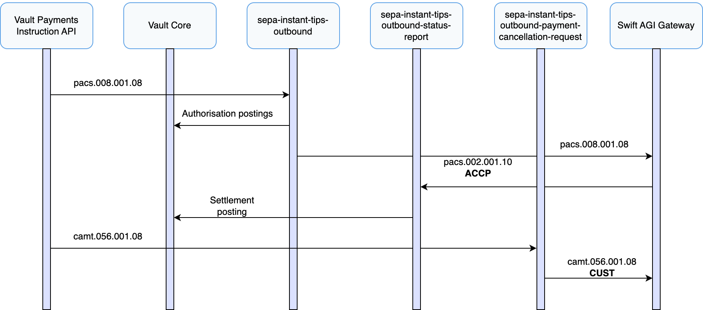
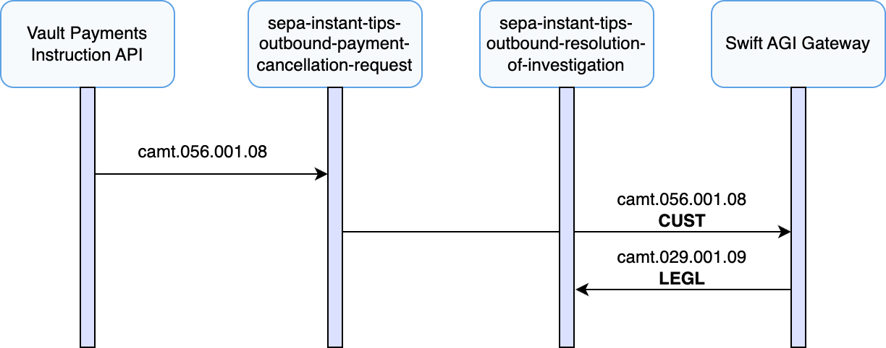
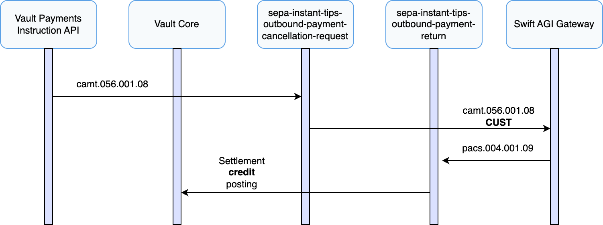

# Outbound Payment Recall Journeys

## Outbound Recall Handling

This section covers the full lifecycle of initiating and managing recalls (camt.056) for outbound SEPA Instant TIPS payments that have already been settled. A recall allows the originator PSP to request the reversal of a payment, typically due to customer error, suspected fraud, or duplication. Vault Payments supports this process using the ISO 20022 message types FIToFIPaymentCancellationRequest (camt.056), ResolutionOfInvestigation (camt.029), and PaymentReturn (pacs.004).

Recalls can only be initiated after the original payment has reached a final status of `SETTLED`, confirmed by the receipt of an `ACCP` FIToFIPaymentStatusReport (pacs.002). Vault Payments enables recall initiation either via API or through the [Payment Initiation UI](/vault-payments/latest/EN/app/using_the_app#initiating_payments), allowing operational users to initiate a recall against an existing outbound payment. This triggers the `sepa-instant-tips-outbound-payment-cancellation-request` flow, which validates the request and submits the FIToFIPaymentCancellationRequest (camt.056) to TIPS.

Once the recall is issued, Vault Payments tracks its lifecycle using a dedicated payment status (`RECALL_REQUESTED`). When a response is received from the beneficiary PSP in the form of a ResolutionOfInvestigation (camt.029), the payment status is updated as follows:

-   If accepted, a PaymentReturn (pacs.004) is issued to credit the original debtor account, and the status is updated to `RETURNED`.
    
-   If rejected, the status reverts to `SETTLED` and the rejection reason is recorded.
    

Vault Payments also supports recall deadline tracking to help ensure compliance with SEPA Instant scheme rules.

The following sections detail recall initiation, handling of accepted and rejected responses, and key operational considerations.

## Initiating an Outbound Recall

This section describes how Vault Payments supports the initiation of a payment recall for a previously settled outbound SEPA Instant TIPS payment using the ISO 20022 FIToFIPaymentCancellationRequest (camt.056) message.

Recalls can be initiated in two ways:

-   Via API, by submitting an outbound FIToFIPaymentCancellationRequest (camt.056) Instruction directly to Vault Payments via the [Initiate Instruction](/vault-payments/latest/EN/api/payments_api#_payments_v1_instructions_InitiateInstructionResponse_InitiateInstruction) endpoint.
    
-   Via the Vault Payments App, using the Payment Initiation UI to select a previously configured template and submit a recall request.
    

The ID of the Payment that was previously settled must be specified as the `payment_id` when initiating the FIToFIPaymentCancellationRequest (camt.056) Instruction.

The recall initiation triggers the `sepa-instant-tips-outbound-payment-cancellation-request` flow, which performs the following steps:

1.  Uses the TIPS validation library available in the Flows SDK to validate that the recall request is compliant with the TIPS specification.
    
2.  Validates that the original FIToFICustomerCreditTransfer (pacs.008) exists and that an accepted FIToFIPaymentStatusReport (pacs.002) was received.
    
3.  Validates that the cancellation reason code is permitted and, where applicable, that the recall window - which can extend up to 13 months - has not expired.
    
4.  If the specified reason is TECH or DUPL, the flow checks whether the request was initiated within 10 banking business days, using the calendar identified by the `sepa-instant-business-banking-calendar-id` Parameter.
    
5.  Validates that the original debtor account has a valid status and is eligible to receive a return credit if the recall is accepted.
    
6.  Performs a lookup against the TIPS directory using the Vault Payments Membership Directory capability to ensure that the original creditor agent BIC remains reachable.
    
7.  Submits the FIToFIPaymentCancellationRequest (camt.056) to TIPS via the Swift AGI gateway.
    
8.  Sets the Payment status to `RECALL_REQUESTED`.
    

Because the same Payment ID is referenced, Vault Payments tracks the recall as a child Instruction of the original payment. A ResolutionOfInvestigation (camt.029) response is expected from the beneficiary PSP. Operators can monitor the recall’s status via the Vault Payments UI, HTTP API, or Streaming API.

## Handling of a Negative Response

This section describes how Vault Payments handles the scenario in which a recall request for an outbound SEPA Instant TIPS payment is rejected by the beneficiary PSP. In accordance with the SEPA Instant scheme and TIPS specification, this response is delivered using the ISO 20022 ResolutionOfInvestigation (camt.029) message.

Upon receipt of a ResolutionOfInvestigation (camt.029) message indicating a negative outcome, Vault Payments initiates the `sepa-instant-tips-outbound-resolution-of-investigation` flow to process the response and update the status of the original payment and its associated recall.

This flow performs the following key actions:

1.  Confirms that the incoming ResolutionOfInvestigation (camt.029) refers to a previously issued FIToFIPaymentCancellationRequest (camt.056) by matching to an existing recall Instruction with the same Payment ID.
    
2.  Records the full Instruction, including the rejection reason code and any additional explanatory text provided.
    
3.  Updates the Payment status from `RECALL_REQUESTED` back to `SETTLED`.
    

As per the TIPS scheme, a rejected recall does not affect the original settled payment in terms of fund movement. The payment remains irrevocable, and no PaymentReturn (pacs.004) is expected. The rejection reason may indicate that the payment has already been credited to the beneficiary, the recall window has expired, or the PSP has deemed the request unjustified under scheme rules.

Vault Payments retains a full history of the recall request, the ResolutionOfInvestigation (camt.029) response, and all related status information. This information is available via the Vault Payments UI, API, and Streaming API to support reconciliation, compliance, and any further manual investigation.

## Handling of an Accepted Response

This section describes how Vault Payments handles the scenario in which a recall request for a previously settled outbound SEPA Instant TIPS payment is accepted by the beneficiary PSP. In line with SEPA Instant and TIPS specifications, this results in the beneficiary PSP issuing a PaymentReturn (pacs.004) message.

Upon receipt of the PaymentReturn (pacs.004), Vault Payments invokes the `sepa-instant-tips-outbound-payment-return` flow, which processes the return and credits the original debtor’s account accordingly.

This flow performs the following key actions:

1.  Confirms that the incoming PaymentReturn (pacs.004) refers to a previously issued FIToFIPaymentCancellationRequest (camt.056) by matching it to an existing recall Instruction with the same Payment ID.
    
2.  Issues a credit posting to the original debtor account via the Vault Core Postings API, using the currency and amount provided in the pacs.004 message. This reverses the original outbound payment.
    
3.  Sets the Payment status to `RECALLED`, indicating that the recall has been successfully completed and funds returned.
    

In accordance with scheme rules, the returned amount must not exceed the original payment value and must be settled in the same currency. The original debtor agent BIC (i.e. the sender of the original payment and recall request) is expected to remain valid and reachable in the TIPS directory at the time the return is processed.

Vault Payments aggregates the Instructions that comprise the original payment, the recall request, and the resulting return into a single Payment to support visibility and operational handling.