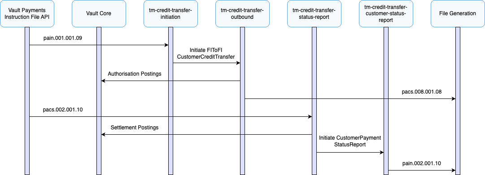

# Outbound Payment Journeys

This section describes the processes involved when Vault Payments initiates an outbound payment via TM Credit Transfers.

TM Credit Transfer supports the creation of outbound payments via CustomerCreditTransferInitiations (pain.001) files or individual Instructions.

## Sending Outbound Payments

Outbound Payments via TM Credit Transfer are modelled using CustomerCreditTransferInitiation (pain.001) messages which create FIToFICustomerCreditTransfer (pacs.008) Instructions. These would then be submitted to a scheme in a file. Acting as the scheme you can then respond using a FIToFIPaymentStatusReport (pacs.002) file. In addition, a CustomerPaymentStatusReport (pain.002) file is generated as part of processing.

This scenario assumes a successful outbound payment from a debtor that belongs to the financial institution using Vault Payments.

CustomerCreditTransferInitiation (pain.001)

1.  A CustomerCreditTransferInitiation (pain.001) is submitted to Vault Payments via upload of an Instruction File representing a pain.001 ISO 20022 message. This file is split into Instructions initiating an `tm-credit-transfer-initiation` flow for each, this is defined in the `tm-credit-transfer-received-files` File Specification. Instructions can also be initiated individually via API request.
    
2.  The flow validates the Instruction against ISO 20022 rules with some additional scheme rules, this includes a scheme transaction limit set via a parameter.
    
3.  Routing checks are made, matching the debtor account via identification details, ensuring a valid account exists and no restrictions are in place.
    
4.  A FIToFICustomerCreditTransfer (pacs.008) is initiated using the `tm-credit-transfer-outbound` flow.
    

FIToFICustomerCreditTransfer (pacs.008)

1.  The flow validates the Instruction against ISO 20022 rules with some additional scheme rules.
    
2.  Funds are reserved by issuing authorisation postings to the connected Vault Core instance using the account details matched in the original Instruction. The Payment status is set to `AUTHORISED`
    
3.  A pacs.008 File is generated and made available for submission.
    

chat\_bubble

For this example scheme the Instruction File can be manually updated to simulate scheme submission, this can be done when the Instruction File is in status `PROCESSING_STATUS_AWAITING_SUBMISSION` which occurs on the processing schedule or when the file has reached it defined limit of 5 Instructions. See [Instruction Files](/vault-payments/latest/EN/using_vault_payments/instruction_batch_processing#updating_instruction_file_specification) for more details.

FIToFIPaymentStatusReport (pacs.002)

1.  A FIToFIPaymentStatusReport (pacs.002) is created via upload of an Instruction File. This file is split into Instructions initiating an `tm-credit-transfer-status-report` flow for each. Instructions can also be initiated individually via API request.
    
2.  The flow validates the Instruction against ISO 20022 rules with some additional scheme rules.
    
3.  On an Accepted report (ACCP), settlement postings are issued to the connected Vault Core instance using the account details matched in the original Instruction, the Payment status is set to `SETTLED`. On a Rejected report (RJCT), release postings are issued and the Payment status is set to `REJECTED`.
    
4.  A CustomerPaymentStatusReport (pain.002) is initiated using the `tm-credit-transfer-customer-status-report` flow with the appropriate outcome.
    

CustomerPaymentStatusReport (pain.002)

1.  The flow validates the Instruction against ISO 20022 rules with some additional scheme rules.
    
2.  A pacs.002 File is generated and made available for submission.
    

## File Support

TM Credit Transfer supports Instruction Files containing CustomerCreditTransferInitiation (pain.001), via the `tm-credit-transfer-received-files` File Specification, in addition to individual Instruction initiation API requests.

All generated files are grouped into files and batches based on the group\_header.message\_identification of the Instructions.

## Correlation ID

TM Credit Transfer messages use the `UETR` value to correlate Instructions to a payment. This field is mandatory and checked during validation.

## Scheme Field Requirements

The table below contains the additional field requirements in addition to standard ISO 20022 requirements.

 
| Instruction | Additional Requirement |
| --- | --- |
| 
CustomerCreditTransferInitiation

 | 

`message_v09.payment_information[0].credit_transfer_transaction_information[0].payment_identification.uetr`

 |
| 

`message_v09.payment_information[0].credit_transfer_transaction_information[0].creditor`

 |
| 

`message_v09.payment_information[0].credit_transfer_transaction_information[0].creditor_account`

 |
| 

`message_v09.payment_information[0].credit_transfer_transaction_information[0].creditor_agent`

 |
| 

FIToFICustomerCreditTransfer

 | 

`message_v08.credit_transfer_transaction_information[0].payment_identification.uetr`

 |
| 

`message_v08.credit_transfer_transaction_information[0].payment_identification.transaction_identification`

 |
| 

`message_v08.credit_transfer_transaction_information[0].debtor_account`

 |
| 

`message_v08.credit_transfer_transaction_information[0].creditor_account`

 |
| 

FIToFIPaymentStatusReport

 | 

`message_v10.transaction_information_and_status[0].original_uetr`

 |
| 

`message_v10.transaction_information_and_status[0].transaction_status`

 |
| 

CustomerPaymentStatusReport

 | 

`message_v10.original_payment_information_and_status[0].payment_information_status`

 |
| 

`message_v10.original_payment_information_and_status[0].transaction_information_and_status[0].original_uetr`

 |

## Payment Attributes

The table below provides a mapping between a Payment and the Instruction fields.

 
| Payment Attribute | Value / Field |
| --- | --- |
| 
`scheme`

 | 

`TM CREDIT TRANSFER`

 |
| 

`payment_system`

 | 

`TM CREDIT TRANSFER`

 |
| 

`type`

 | 

`PAYMENT_TYPE_CREDIT_TRANSFER`

 |
| 

`direction`

 | 

`PAYMENT_DIRECTION_OUTBOUND`

 |
| 

`payment_parties.payer`

 | 

`customer_credit_transfer_initiation.message_v09.payment_information[0].debtor.name`

 |
| 

`payment_parties.payee`

 | 

`customer_credit_transfer_initiation.message_v09.payment_information[0].credit_transfer_transaction_information[0].creditor.name`

 |
| 

`credit_transfer_payment_data.credit_transfer_amount.instructed_amount.amount`

 | 

`customer_credit_transfer_initiation.message_v09.payment_information[0].credit_transfer_transaction_information[0].amount.instructed_amount.amount`

 |
| 

`credit_transfer_payment_data.credit_transfer_amount.instructed_amount.currency`

 | 

`customer_credit_transfer_initiation.message_v09.payment_information[0].credit_transfer_transaction_information[0].amount.instructed_amount.currency`

 |
| 

`credit_transfer_payment_data.credit_transfer_amount.interbank_settlement_amount.amount`

 | 

`fi_to_fi_customer_credit_transfer.message_v08.credit_transfer_transaction_information[0].interbank_settlement_amount.amount`

 |
| 

`credit_transfer_payment_data.credit_transfer_amount.interbank_settlement_amount.currency`

 | 

`fi_to_fi_customer_credit_transfer.message_v08.credit_transfer_transaction_information[0].interbank_settlement_amount.currency`

 |