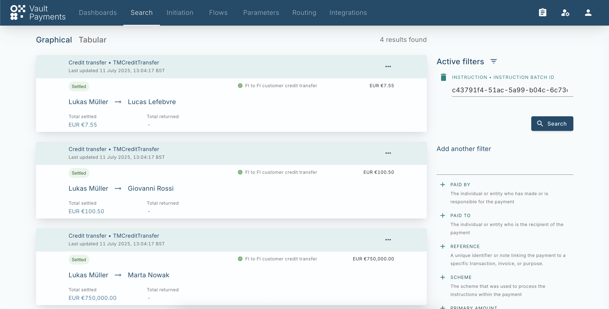
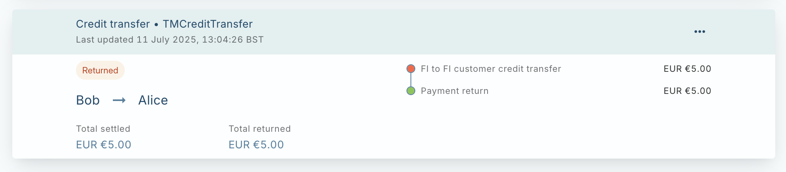

# Process Inbound Credit Transfer File

This tutorial covers how to create Inbound Credit Transfers from a file in the TM Credit Transfer Configuration Pack.

## Upload pacs.008 File

Inbound Credit Transfers can be uploaded via the [Files API](/vault-payments/latest/EN/using_vault_payments/files), these can then be used to create Instruction Files for processing.

chat\_bubble

The identifiers in the provided example file are static. If running the tutorial again these identifiers need to be changed to avoid incorrect correlation of instructions.

chat\_bubble

Instruction Files support currently supports a single batch with up to to 10,000 Instructions. The provided file includes 2 Instructions for brevity.

We will create a File using the provided example. [Example TM Credit Transfer pacs.008](/vault-payments/latest/EN/resources/example_pacs008.xml)

After creating the File we then need to process it. We do this be creating an [Instruction File](/vault-payments/latest/EN/using_vault_payments/instruction_batch_processing). We can can use the returned ID as the `file_id` when creating the Instruction File along with the InstructionFileSpecification.

Upon creating the Instruction File, it will be split into batches and then processed. We can use the returned ID as the `instruction_file_id` to track its processing.

## Track processing via Instruction Batches

The processing of an Instruction File can be tracked directly via its `processing_status` or via the created Instruction Batches which can be retrieved via List Instruction Batches endpoint.

The response will contain the Instruction Batch created via the Instruction File:

When all the Instructions within the batch have processed the resource will be updated with a `processing_status` of `PROCESSING_STATUS_COMPLETED`

## View Processed Inbound Payments

The created Payments can be viewed using Payment Search by filtering by the `instruction_batch_id`.

## Optional: Automatic PaymentReturn when funds can not be accepted

The provided file also contains an IBAN that is not present in Vault Payments. According to the scheme rules, an inbound credit transfer can not be rejected, funds must be accepted and a return created. When we are unable to accept funds of a valid instruction for any reason a PaymentReturn is created and postings are made between internal accounts to track fund movement.

A PaymentReturn (pacs.004) File will later be generated according to the Instruction File Specification on a schedule or when enough instructions have been queued.