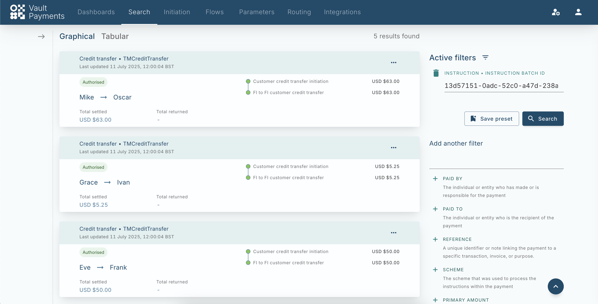
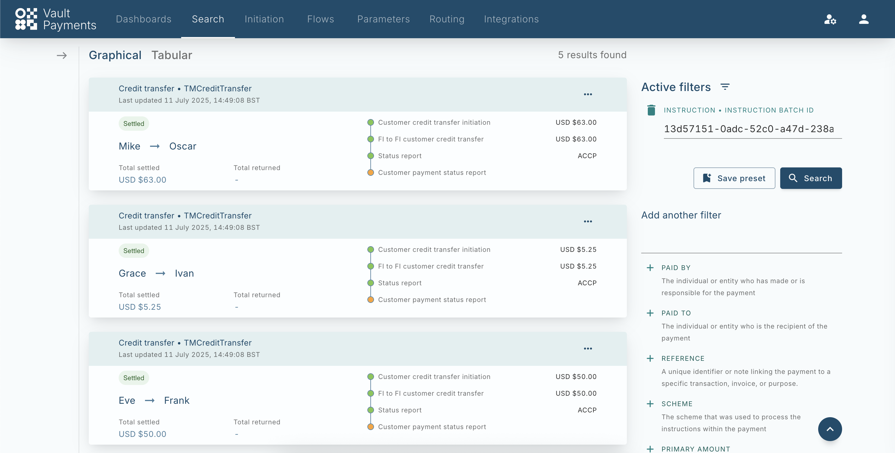

# Send Outbound Credit Transfer File

This tutorial covers how to create Outbound Credit Transfers from a file of CustomerCreditTransferInitiation (pain.001) in the TM Credit Transfer Configuration Pack.

## Upload pain.001 File

Customer Credit Transfer Initiations can be uploaded via the [Files API](/vault-payments/latest/EN/using_vault_payments/files), these can then be used to create Instruction Files for processing.

chat\_bubble

The identifiers in the provided example file are static. If running the tutorial again these identifiers need to be changed to avoid incorrect correlation of instructions.

chat\_bubble

Instruction Files support currently supports a single batch with up to to 10,000 Instructions. The provided file includes 2 Instructions for brevity.

We will create a File using the provided example. [Example TM Credit Transfer pain.001](/vault-payments/latest/EN/resources/example_pain001.xml)

After creating the File, we then need to process it. We do this be creating an [Instruction File](/vault-payments/latest/EN/using_vault_payments/instruction_batch_processing). We can can use the returned ID as the `file_id` when creating the Instruction File along with the InstructionFileSpecification.

After creating the Instruction File, it is split into batches and then processed.

## Track processing via Instruction Batches

The processing of an Instruction File can be tracked directly via its `processing_status` or via the created Instruction Batches which can be retrieved via List Instruction Batches endpoint.

The response will contain the Instruction Batch created via the Instruction File:

When all the Instructions within the batch have processed, the resource will be updated with a `processing_status` of `PROCESSING_STATUS_COMPLETED`

## View Processed Outbound Payments

The created Payments can be viewed using Payment Search by filtering by the `instruction_batch_id`.

As part of processing, a FIToFICustomerCreditTransfer (pacs.008) is initiated and a corresponding file generated.

## Submit Generated pacs.008 File

Once the Instruction File reaches its capacity or a Calendar event is triggered, the file’s `processing_status` is updated from `PROCESSING_STATUS_COLLECTING` to `PROCESSING_STATUS_AWAITING_SUBMISSION` indicating that the file is ready to be submitted to the scheme. More information on this process can be found [here](/vault-payments/latest/EN/using_vault_payments/instruction_batch_processing#outbound_instruction_file_processing).

In production, a scheme gateway would be responsible for sending this file to the scheme and updating its status to `PROCESSING_STATUS_COMPLETED` once submission is complete. In this tutorial we will do this manually using the Payments API.

On the Payment detail view, click the `{}` icon on the 'FI to FI customer credit transfer' to show the JSON representation of the Instruction. Note down the value of the `instruction_batch_id` field, this is the ID of the Instruction Batch that the Instruction has been added to.

You should receive a response similar to that shown below. The Instruction Batch is in status `PROCESSING_STATUS_AWAITING_SUBMISSION` as it has reached capacity and is ready to be submitted to the scheme within an Instruction File. Note down the ID of the Instruction File containing the batch under the field `instruction_file_id`.

We can use the returned `instruction_file_id` to update the Instruction to `PROCESSING_STATUS_COMPLETED` to continue processing.

The generated file can be viewed using the `pre_signed_url` returned by the Files API, see [Retriving Files](/vault-payments/latest/EN/using_vault_payments/files#retrieving_files) for more information.

## Upload pacs.002 File

Processing will be completed upon receiving a FIToFIPaymentStatusReport (pacs.002). We can follow the same process as before, first creating the File and then creating an Instruction File using the returned `file_id`. [Example TM Credit Transfer pacs.002](/vault-payments/latest/EN/resources/example_pacs002.xml)

## View Completed Outbound Payments

After submission of the Instruction File the processing of the relevant Payment will complete which can be viewed in Payment Search.

In addition, a CustomerPaymentStatusReport (pain.002) file is generated for all processing outbound credit transfers. This can be viewed via the Files API.