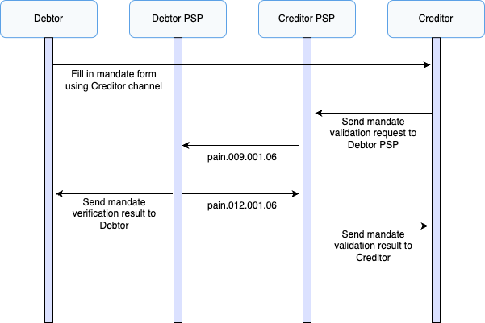
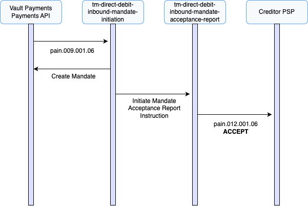

# Mandate Issuance Journeys

TM Direct Debit supports the issuance of electronic mandates where issuance is initiated by the debtor. The process illustrated below involves four parties: the Debtor, Debtor PSP (Payment Services Provider), Creditor and Creditor PSP.

Vault Payments supports both inbound (Debtor PSP) and outbound (Creditor PSP) mandate issuance journeys.

1.  The Debtor fills in a Mandate form on the Creditor’s channel, authorising the Creditor to collect regular payments from an account with the Debtor PSP.
    
2.  The Creditor ensures all the scheme rules and regulatory requirements are satisfied and accepts the mandate.
    
3.  The Creditor sends mandate information to the Debtor PSP for validation through a routing service provided by the Creditor PSP. This is done via a MandateInitiationRequest (pain.009).
    
4.  The Debtor PSP validates the request and asks the Debtor to confirm that the mandate details are correct.
    
5.  Once the Debtor confirms the mandate, the Debtor PSP sends a MandateAcceptanceReport (pain.012) with the results of validation to the Creditor PSP.
    
6.  The Creditor PSP receives the mandate validation results from the Debtor PSP and passes the results to the Creditor
    

## Sending an Outbound Mandate Initiation Request

In this scenario, Vault Payments represents the Creditor PSP which is responsible for sending mandate information via a routing service to the Debtor PSP for validation.

chat\_bubble

A Manual Payment Initiation Template is provided to allow for initiation via the Vault Payments App.

MandateInitiationRequest (pain.009)

1.  A MandateInitiationRequest (pain.009) is created via API request (or Manual Payment Initiation UI), initiating a `tm-direct-debit-outbound-mandate-initiation` flow.
    
2.  The flow validates the Instruction against ISO 20022 rules with some additional scheme rules.
    
3.  The flow submits the MandateInitiationRequest (pain.009) to the Debtor PSP for validation via an Integration.
    

MandateAcceptanceReport (pain.012)

1.  A MandateAcceptanceReport (pain.012) is created via API request, initiating a `tm-direct-debit-outbound-mandate-acceptance-report` flow. This request is from the Debtor PSP with an 'Accept' result.
    
2.  The flow validates the Instruction against ISO 20022 rules with some additional scheme rules.
    
3.  A `Mandate` resource is created within Vault Payments representing the newly issued mandate.
    
4.  The Payment status is set to `SETTLED`.
    

## Receiving an Inbound Mandate Initiation Request

In this scenario, Vault Payments represents the Debtor PSP which is responsible for validating mandate issuance information that it receives from the Creditor via a routing service provided by the Creditor PSP.

MandateInitiationRequest (pain.009)

1.  A MandateInitiationRequest (pain.009) is created via API request, initiating a `tm-direct-debit-inbound-mandate-initiation` flow.
    
2.  The flow validates the Instruction against ISO 20022 rules with some additional scheme rules.
    
3.  A `Mandate` resource is created within Vault Payments representing the newly issued mandate.
    
4.  A MandateAcceptanceReport (pain.012) is initiated using the `tm-direct-debit-inbound-mandate-acceptance-report` flow. This contains the response that should be sent back to the Creditor PSP indicating acceptance of the mandate initiation request.
    

MandateAcceptanceReport (pain.012)

1.  The flow validates the Instruction against ISO 20022 rules with some additional scheme rules.
    
2.  The flow submits the MandateAcceptanceReport (pain.012) containing an 'Accept' result to the Creditor PSP via an Integration.
    
3.  The Payment status is set to `SETTLED`.
    

## Mandate Attributes

The table below provides a mapping between a created Mandate and data elements on the MandateInitiationRequest (pain.009) XML document or Instruction payload.

For brevity, the `mandate_initiation_request.message_v06.mandate[0].` prefix has been omitted from the Instruction payload JSON Paths

  
| Mandate Attribute | XML Path | JSON Path |
| --- | --- | --- |
| 
`scheme_mandate_id`

 | 

`/Document/MndtInitnReq/Mndt/MndtId`

 | 

`mandate_identification[0]`

 |
| 

`scheme_creditor_id`

 | 

`/Document/MndtInitnReq/Mndt/CdtrSchmeId/Id/PrvtId/Othr/Id`

 | 

`creditor_scheme_identification.identification.private_identification.other[0].identification`

 |
| 

`debtor_agent_id`

 | 

`/Document/MndtInitnReq/Mndt/DbtrAgt/FinInstnId/BICFI`

 | 

`debtor_agent.financial_institution_identification.bicfi`

 |
| 

`service_level`

 | 

`/Document/MndtInitnReq/Mndt/Tp/SvcLvl/Cd`

 | 

`type.service_level.code`

 |
| 

`local_instrument_code`

 | 

`/Document/MndtInitnReq/Mndt/Tp/LclInstrm/Cd`

 | 

`type.local_instrument.code`

 |
| 

`category_purpose`

 | 

`/Document/MndtInitnReq/Mndt/Tp/CtgyPurp/Cd`

 | 

`type.category_purpose.code`

 |
| 

`sequence_type`

 | 

`/Document/MndtInitnReq/Mndt/Ocrncs/SeqTp`

 | 

`occurrences.sequence_type`

 |
| 

`amounts.first_collection_amount`

 | 

`/Document/MndtInitnReq/Mndt/FrstColltnAmt`

 | 

`first_collection_amount`

 |
| 

`amounts.recurring_collection_amount`

 | 

`/Document/MndtInitnReq/Mndt/ColltnAmt`

 | 

`recurring_collection_amount`

 |
| 

`amounts.maximum_amount`

 | 

`/Document/MndtInitnReq/Mndt/MaxAmt`

 | 

`maximum_amount`

 |
| 

`debtor_party_details.name`

 | 

`/Document/MndtInitnReq/Mndt/Dbtr/Nm`

 | 

`debtor.name`

 |
| 

`debtor_party_details.routing_information.bank_identifier`

 | 

`/Document/MndtInitnReq/Mndt/DbtrAgt/FinInstnId/BICFI`

 | 

`debtor_agent.financial_institution_identification.bicfi`

 |
| 

`debtor_party_details.routing_information.instrument_identifier`

 | 

`/Document/MndtInitnReq/Mndt/DbtrAcct/Id/IBAN`

 | 

`debtor_account.identification.iban`

 |
| 

`creditor_party_details.name`

 | 

`/Document/MndtInitnReq/Mndt/Cdtr/Nm`

 | 

`creditor.name`

 |
| 

`creditor_party_details.routing_information.bank_identifier`

 | 

`/Document/MndtInitnReq/Mndt/CdtrAgt/FinInstnId/BICFI`

 | 

`creditor_agent.financial_institution_identification.bicfi`

 |
| 

`creditor_party_details.routing_information.instrument_identifier`

 | 

`/Document/MndtInitnReq/Mndt/CdtrAcct/Id/IBAN`

 | 

`creditor_account.identification.iban`

 |

## Scheme Attributes

The table below provides a mapping between TM Direct Debit scheme attributes and data elements on the MandateInitiationRequest (pain.009) XML document or Instruction payload.

  
| Attribute | XML Path | JSON Path |
| --- | --- | --- |
| 
Scheme Mandate ID

 | 

`/Document/MndtInitnReq/Mndt/MndtId`

 | 

`mandate_initiation_request.message_v06.mandate[0].mandate.mandate_identification[0]`

 |
| 

Scheme Creditor ID

 | 

`/Document/MndtInitnReq/Mndt/CdtrSchmeId/Id/PrvtId/Othr/Id`

 | 

`mandate_initiation_request.message_v06.mandate[0].mandate.creditor_scheme_identification.identification.private_identification.other[0].identification`

 |

## Scheme Field Requirements

The table below contains the additional field requirements in addition to standard ISO 20022 requirements.

  
| Instruction | XML Path | JSON Path |
| --- | --- | --- |
| 
MandateInitiationRequest

 | 

`/Document/MndtInitnReq/Mndt/Ocrncs/SeqTp`

 | 

`mandate_initiation_request.message_v06.mandate[0].occurrences.sequence_type`

 |
| 

`/Document/MndtInitnReq/Mndt/Dbtr/Nm`

 | 

`mandate_initiation_request.message_v06.mandate[0].debtor.name`

 |
| 

`/Document/MndtInitnReq/Mndt/DbtrAgt/FinInstnId/BICFI`

 | 

`mandate_initiation_request.message_v06.mandate[0].mandate.debtor_agent.financial_institution_identification.bicfi`

 |
| 

`/Document/MndtInitnReq/Mndt/DbtrAcct/Id/IBAN`

 | 

`mandate_initiation_request.message_v06.mandate[0].debtor_account.identification.iban`

 |
| 

`/Document/MndtInitnReq/Mndt/Cdtr/Nm`

 | 

`mandate_initiation_request.message_v06.mandate[0].creditor.name`

 |
| 

`/Document/MndtInitnReq/Mndt/CdtrAgt/FinInstnId/BICFI`

 | 

`mandate_initiation_request.message_v06.mandate[0].mandate.creditor_agent.financial_institution_identification.bicfi`

 |
| 

`/Document/MndtInitnReq/Mndt/CdtrAcct/Id/IBAN`

 | 

`mandate_initiation_request.message_v06.mandate[0].creditor_account.identification.iban`

 |

## Payment Attributes

The table below provides a mapping between a Payment and the Instruction fields.

 
| Payment Attribute | Value / Field |
| --- | --- |
| 
`scheme`

 | 

`TM DIRECT DEBIT`

 |
| 

`payment_system`

 | 

`TM DIRECT DEBIT`

 |
| 

`type`

 | 

`PAYMENT_TYPE_DIRECT_DEBIT`

 |
| 

`payment_parties.payer`

 | 

`mandate_initiation_request.message_v06.mandate[0].debtor.name`

 |
| 

`payment_parties.payee`

 | 

`mandate_initiation_request.message_v06.mandate[0].debtor.name.creditor.name`

 |