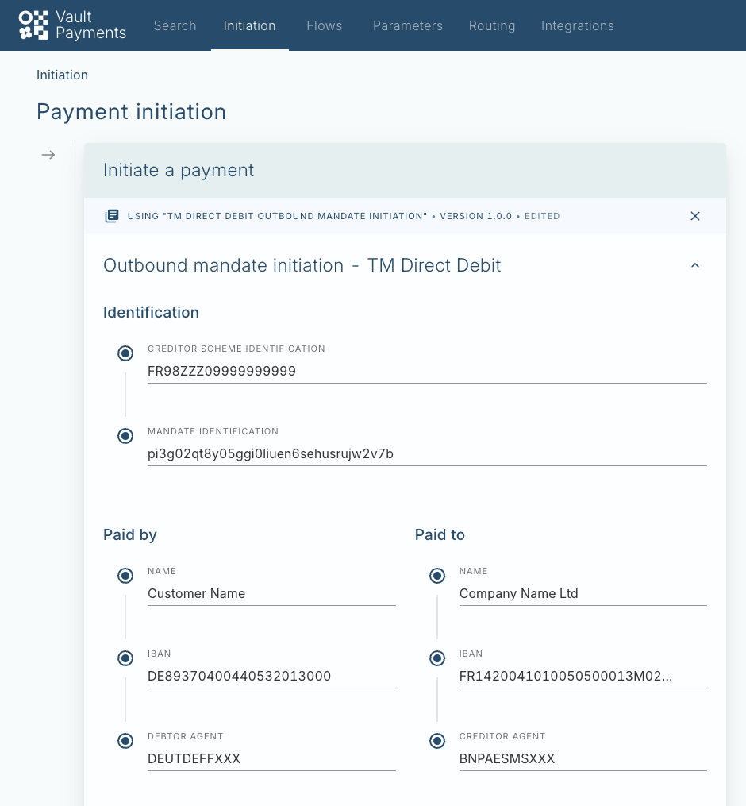
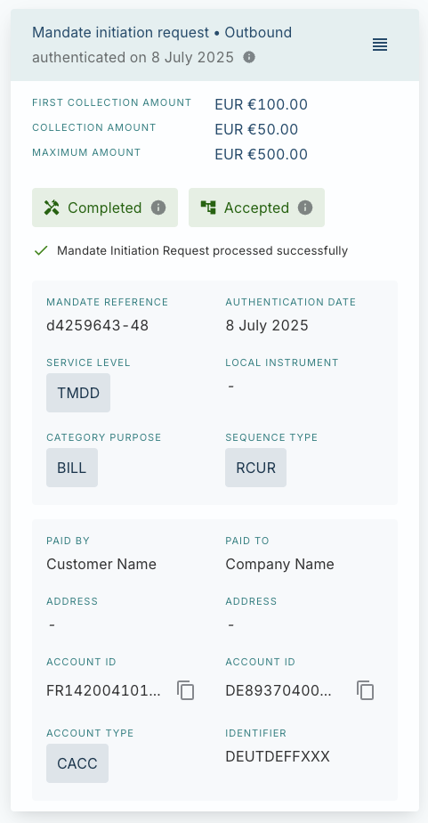
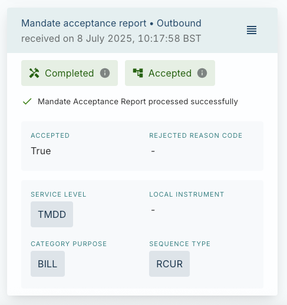

# Issue a Mandate

In this tutorial we will construct and submit a mandate initiation request as part of the TM Direct Debit mandate issuance journey. In this scenario Vault Payments assumes the role of the Creditor PSP (Payment Services Provider). We receive mandate information from the Debtor via the Creditor. We send this information to the Debtor PSP for validation and, if successful, we create and store an electronic mandate. For more information on the TM Direct Debit mandate issuance journey, you can consult the [reference documentation](/vault-payments/latest/EN/configuration_library/example/tm_direct_debit/mandate_issuance_journeys).

This tutorial will include the submission of the mandate initiation request and using the Vault Payments App to view the status of the request. We will also retrieve and view the newly created Mandate using the Payments API.

## Submit Instruction to the Payments API

In this example, a company (Creditor) issues a mandate that allows it to bill a customer (Debtor) via a recurring payment.

We first submit an instruction to the Payments API which represents the MandateInitiationRequest (pain.009) message to be sent to the Debtor PSP for validation. Alternatively, you can use a Manual Initiation Template to submit the Instruction using the Vault Payments App by skipping ahead to [this](/vault-payments/latest/EN/configuration_library/example/tm_direct_debit/tutorials/issue_a_mandate#submit_instruction_via_manual_initiation_alternative_approach) step.

We create an instruction using the [/api/v1/instructions:initiate POST endpoint](/vault-payments/latest/EN/api/payments_api#instructions), providing the MandateInitiationRequest payload as an ISO 20022 XML message. The Mandate Identification field `/Document/MndtInitnReq/Mndt/MndtId` on the XML message should contain a unique ID that, along with the Scheme Creditor ID uniquely identifies the mandate within the scheme.

In this example, it is the Creditor account that must be recognised by Vault Payments in order for postings to be made - the Debtor account is held by another financial institution. For the Creditor account, we use the IBAN `FR9120051010050500013M02505` which corresponds to an account that is automatically provisioned for users of the sandbox instance.

chat\_bubble

You can find more information on the resources that are automatically provisioned for sandbox users [here](/vault-payments/latest/EN/introduction_to_vault_payments/sandbox_quick_start#provided_resources).

The MandateInitiationRequest (pain.009) must contain a Scheme Creditor ID and a Scheme Mandate ID. These identifiers provide a unique reference within the scheme for the direct debit originator institution (Scheme Creditor ID) and the mandate (Scheme Mandate ID). Within these tutorials we use the following values for these IDs:

  
| Attribute | XML Path | Value |
| --- | --- | --- |
| 
Scheme Creditor ID

 | 

`/Document/MndtInitnReq/Mndt/CdtrSchmeId/Id/PrvtId/Othr/Id`

 | 

`FR98ZZZ09999999999`

 |
| 

Scheme Mandate ID

 | 

`/Document/MndtInitnReq/Mndt/MndtId`

 | 

`9a7399eb07fd443b8058ba3284e7d30c`

 |

chat\_bubble

This tutorial assumes that any Mandate under this scheme has a unique combination of `scheme_mandate_id` and `scheme_creditor_id`. You should generate a new `scheme_mandate_id` if you wish to create additional Mandates within this tutorial.

When using the `:initiate` endpoint, the response will look like this:

Please copy the `payment_id` from the response. We will use it in the next step of the tutorial.

The initiate Instruction endpoint is asynchronous. Structurally valid Instructions are assigned a `processing_status` of `IN_PROGRESS` and processing of the Instruction begins.

The processing steps for this journey are documented [here](/vault-payments/latest/EN/configuration_library/example/tm_direct_debit/mandate_issuance_journeys#sending_an_outbound_mandate_initiation_request). For this tutorial, the integration for submitting messages to the Debtor PSP has been mocked with a service that responds back with a MandateAcceptanceReport (pain.012) confirming successful validation by the Debtor PSP.

## Submit Instruction via Manual Initiation (alternative approach)

You can use a Payment Initiation Template to submit the instruction instead of the Payments API approach outlined above.

A Template is provided in the configuration pack for initiating a MandateInitiationRequest (pain.009). You can find it on the sandbox [here](https://sandbox.payments.tmachine.io/payments/initiate?initiationTemplate=tm-direct-debit-outbound-mandate-initiation-template).

The fields on the template are pre-filled and do not need to be modified. Once submitted, an Instruction will be initiated with predefined values set and other fields populated from the values defined in the form.

## Tracking the status of the payment

A Payment will have been created that contains the two Instructions created during the previous step. You can view this Payment using Payments Search on the Vault Payments App, searching by the `payment_id` from the previous step if the Instruction was initiated from the Payments API.

The status of the Payment is displayed at the top of the details page as 'Settled'. It consists of two Instructions: a 'Mandate initiation request' sent to the Debtor PSP and a 'Mandate acceptance report' received back in response containing the acceptance confirmation.

Both Instructions are displayed in the payment detail view. The first Instruction represents the 'Mandate initiation request' and contains the mandate details that are sent to the Debtor PSP for verification.

Viewing the 'Mandate acceptance report', you can inspect the details of the response from the Debtor PSP which shows that the request was accepted.

Click to view details of this Instruction and then click on the `{}` symbol to view the JSON representation. Note down the value of the field `mandate_id` which contains the ID of the Mandate created by the flow.

## View the Mandate

After successfully processing the mandate initiation request, a Mandate will have been created. You can view this resource via the Payments API, using the command below and replacing the ID with the `mandate_id` from the previous section.

The returned resource will look similar to that shown below. It can then be used within a flow while processing a direct debit collection or other payment type that requires a mandate. To learn more about how mandates are used when processing collections, you can follow the [send an outbound collection](/vault-payments/latest/EN/configuration_library/example/tm_direct_debit/tutorials/send_an_outbound_collection) tutorial.